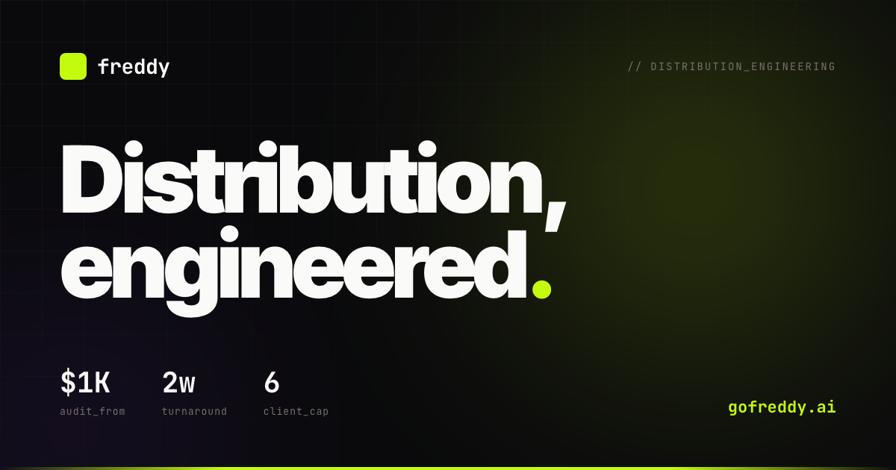

# gofreddy

**Distribution engineering, shipped as a CLI.** One engineer plus autonomous agents, wired together into the systems a marketing department would build.

Powers the work at [**gofreddy.ai**](https://jryszardnoszczyk.github.io/gofreddy/) — a one-person distribution engineering agency.



---

## What this is

A Python CLI that runs per-client distribution workflows: SEO audits, competitor ad teardowns, social + news monitoring, content generation, and publishing. The heavy lifting is done by provider integrations (DataForSEO, Foreplay, Adyntel, Xpoz, NewsData, Apify, Gemini, OpenAI, xAI, fal.ai). The glue is file-based — every session, every API call, every cost is an append-only JSONL under `clients/<name>/`.

Forked from the Freddy SaaS codebase. Every provider integration is **byte-identical** to the source. The SaaS layer (FastAPI, Supabase, Stripe, Postgres, React frontend) is stripped out in favor of direct provider calls and per-client file workspaces. No backend to run. No database to host. No auth to maintain.

## Install

Python **3.13** required (3.14 breaks hatchling's build backend).

```bash
git clone https://github.com/jryszardnoszczyk/gofreddy.git
cd gofreddy
python3.13 -m venv .venv
source .venv/bin/activate
pip install -e '.[dev]'

cp .env.example .env      # fill in provider credentials
freddy setup              # verify they're all set
```

## Usage

```bash
# Create a client workspace
freddy client new acme-corp

# Run audits — each writes to clients/acme-corp/cost_log.jsonl
freddy audit seo         --client acme-corp  acme.com
freddy audit competitive --client acme-corp  competitor.com
freddy audit monitor     --client acme-corp  "acme corp"

# Reports + audit trail
freddy client log    acme-corp
freddy client report acme-corp

# Static portal — dark-themed HTML per client
python portal/generate.py --client acme-corp
# → open portal/output/acme-corp/index.html
```

## Command surface

```
freddy
├── setup            verify provider credentials
├── client
│   ├── new          create a new client workspace
│   ├── list         list all client workspaces
│   ├── log          show audit trail
│   └── report       generate a summary report
├── audit
│   ├── seo          DataForSEO domain rank snapshot
│   ├── competitive  Foreplay + Adyntel ad teardown
│   └── monitor      Xpoz social mentions
├── save             save raw data to session directory
├── sitemap          parse a domain's sitemaps
├── auto-draft       cron-driven draft generation
├── iteration        autoresearch session tracking
└── transcript       transcript infrastructure
```

## Repo layout

```
cli/freddy/            # CLI surface — 8 commands, 3 command groups
  commands/            # client, audit, setup, save, sitemap, auto-draft,
                       # iteration, transcript

src/                   # 16 modules — providers, adapters, models, configs
  common/              # cost recorder (JSONL), Gemini pricing models
  seo/                 # DataForSEO
  competitive/         # Foreplay, Adyntel, creative vision
  monitoring/          # Xpoz, NewsData, platform adapters
  generation/          # fal, Grok, TTS, avatar, music, composition
  fetcher/             # TikTok, YouTube, Instagram scrapers
  evaluation/          # Gemini + OpenAI judges
  sessions/            # file-based session repository
  storage/             # R2 blob storage
  publishing/          # platform publishers
  analysis/            # video analysis (Gemini)
  fraud/               # engagement / follower quality scoring
  deepfake/            # LIPINC + Reality Defender
  geo/                 # generative engine optimization
  video_projects/      # persistent video project models
  batch/               # batch processing primitives

configs/               # report generation scripts, storyboard QA
landing/               # gofreddy.ai landing page (single HTML file)
docs/templates/        # proposal, agreement, audit report, monthly
                       # report, onboarding checklist
portal/                # Jinja2 client-portal static site generator
tests/                 # 193 tests kept (SaaS test dirs deleted)
clients/               # per-client workspaces — .gitkeep only
```

## Data model

Every client workspace looks like this:

```
clients/<name>/
├── config.json                       # client metadata
├── .env                              # per-client credentials (0600, git-ignored)
├── cost_log.jsonl                    # every API call, every cent, append-only
├── artifacts/                        # generated outputs
└── sessions/
    └── <timestamp>-<type>/
        ├── meta.json                 # session state
        ├── actions.jsonl             # tool calls in chronological order
        └── iterations.jsonl          # autoresearch loop iterations
```

Append-only. Version-controllable. Zero schema migrations. Zero database.

## Principles

- **Copy, don't reimplement.** Providers come from the source verbatim. Verified byte-identical via SHA-256 across 94 critical files.
- **File-based storage.** JSONL under `clients/<name>/`. `aiofiles` instead of `asyncpg`. Static HTML portals instead of dashboards.
- **Ownership as a feature.** Every build ships with runbooks, keys in the client's name, and documentation a mid-level engineer can read.
- **One engineer, six client cap.** The ceiling is the calendar, not the margin.
- **Commit to main.** No branches for solo work.

## Tech stack

| Layer | Tool |
|---|---|
| Runtime | Python 3.13 |
| CLI | Typer |
| HTTP | httpx, aiofiles |
| Models | google-genai, openai, xai-sdk |
| Data providers | DataForSEO, Foreplay, Adyntel, Xpoz, NewsData, Apify, ScrapeCreators |
| Generation | fal.ai, Grok Imagine, Fish Audio |
| Storage | Cloudflare R2 (aioboto3) |
| Video | PyMuPDF, yt-dlp |
| Build | hatchling |
| Lint/type | ruff, mypy |

## Contact

**JR Noszczyk** · [noszczykai@gmail.com](mailto:noszczykai@gmail.com) · [linkedin](https://www.linkedin.com/in/jryszardnoszczyk/)

Agency: [**gofreddy.ai**](https://jryszardnoszczyk.github.io/gofreddy/)
