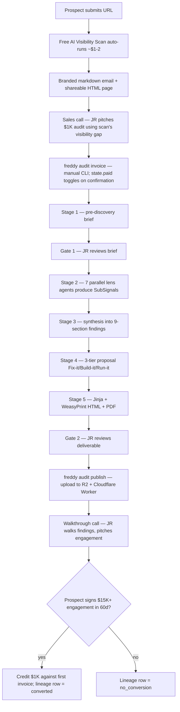
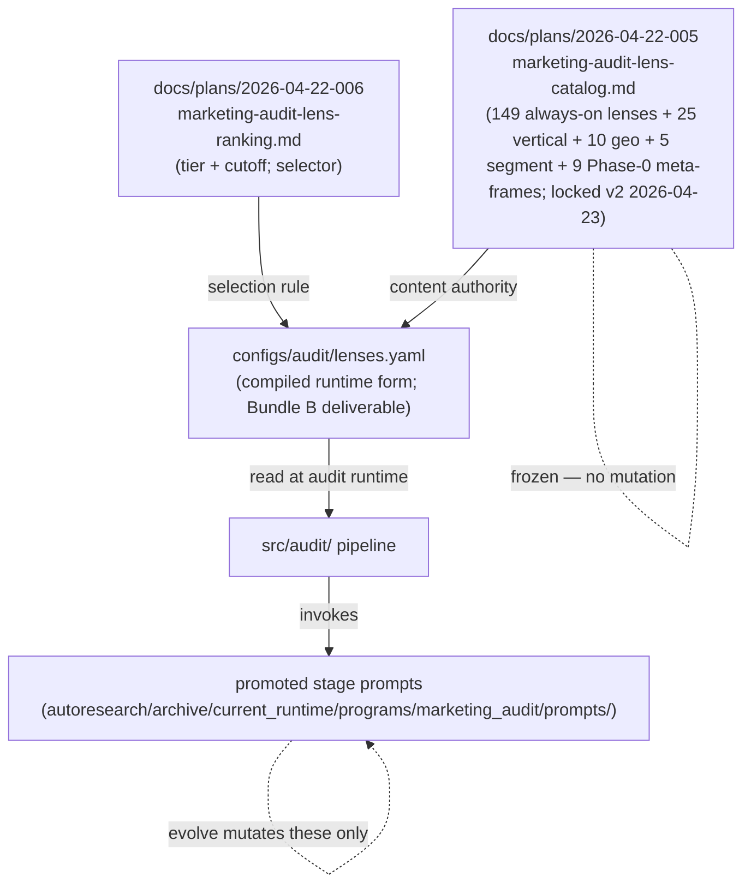
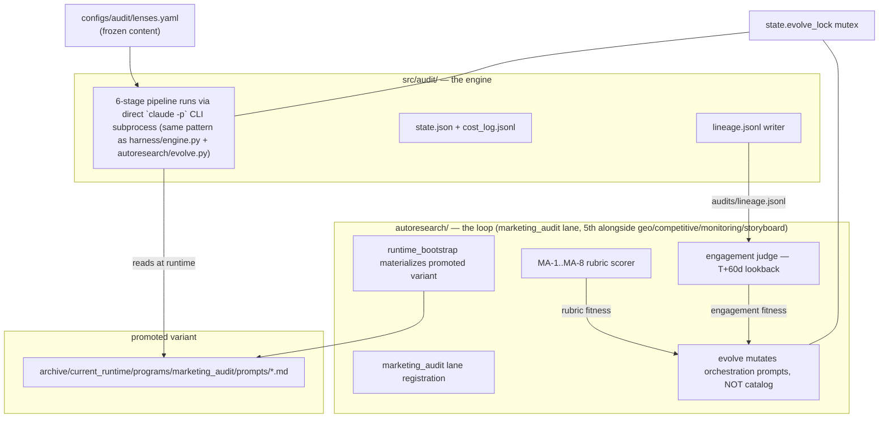

# Audit engine + autoresearch fusion — v1 requirements

## Problem Frame

JR runs a boutique marketing agency. The bottleneck on closing $15K+/mo retainer engagements is a credible opening pitch — prospects need to see depth before trusting the next sales conversation. Hand-producing that depth doesn't scale; generic audits are commodity and don't differentiate.

The bet: a **paid $1,000 marketing audit** serves as the engagement-anchor lead magnet for $15K+ retainers (credited back on signing within 60 days). A **free AI Visibility Scan** serves as top-of-funnel to qualify prospects into the paid audit. Both are produced by the same underlying pipeline, at different depth settings.

**Audit depth is defined by the 149-lens catalog** derived from 8 parallel research passes against the marketing-skills repo + established frameworks + emerging dimensions + verticals + adjacent disciplines + global compliance + channel sophistication + niche industries. Every lens is auditable from **public signals only** — no CRM / ESP / product-internal access. This catalog is the content substrate that makes the audit defensible vs commodity tools.

The moat: the audit pipeline **self-improves** across generations via an `autoresearch` lane that mutates the orchestration around the catalog (stage prompts, lens dispatch, synthesis logic), scores variants against an MA-1..MA-8 rubric, and closes the loop at T+60d with real engagement revenue. **The catalog content does not mutate**; only the orchestration that runs it does. This makes the audit quality compound over time — every paying prospect makes the next audit sharper. Static competitors can't match the curve.

## User Flow

## Content substrate

The audit pipeline exists to run a specific frozen catalog. The separation of **content** (frozen) from **orchestration** (evolvable) is the fusion contract and the anti-Goodhart boundary.

The catalog's 11 marketing areas: Discoverability & Organic Search, Content Assets & Authority, Paid Media, Earned Media & PR, Distribution/Community/Listings, Conversion Architecture, Activation & Product-Led, Lifecycle/Retention/CX, Brand & Authority, Sales/GTM/Enablement, MarTech/Measurement/Compliance. 9 Phase-0 meta-frames run above all areas (vertical detection, geo detection, segment detection, etc.). Bundle activation is conditional per prospect: typically 1–3 vertical + 0–2 geo + 1–2 segment bundles fire on top of the always-on 149.

SubSignal → ParentFinding aggregation collapses the 149-lens output into ~25–32 strategic findings in the deliverable — lens fan-out without finding-bloat.

## Architecture

**Marketing_audit is a native autoresearch lane with two wrappers around the same lane program.** The lane program (6-stage `claude -p` subprocess chain reading promoted stage prompts from `autoresearch/archive/current_runtime/programs/marketing_audit/prompts/`) is identical in both modes. The wrappers differ only in what they add around it.

| Wrapper | Entry point | Adds around the lane program |
|---|---|---|
| **Live** | `freddy audit run --client <slug>` | Commercial flow (invoice → mark-paid → 3 human gates → render HTML+PDF → publish to R2/Cloudflare → walkthrough-survey capture → engagement record at T+60d) |
| **Evolve** | `autoresearch evolve --lane marketing_audit --iterations N` | Variant mutation (per R28 mutation space) + fixture iteration + auto-approve all gates + MA-1..MA-8 rubric scoring + pre-promotion smoke-test + promote winner to lane-head |

Gates and commercial side-effects live in the live wrapper, not in the lane program. This is the same pattern the existing 4 lanes use — their promoted variants get consumed by downstream user workflows. Marketing_audit is just the first lane whose downstream consumer ships to paying customers.

Both systems read the frozen lens catalog. Live audit and offline evolution never run simultaneously (R16 evolve_lock).

## Requirements

### Commercial flow (product-facing)

- R1. **Free AI Visibility Scan** auto-runs on prospect form submission at ~$1–2 per scan; output = branded markdown email + shareable HTML at `reports.gofreddy.ai/scan/<client-name>-<uuid4>/`. Narrow teaser (2–3 AI-search findings) — shows the problem, doesn't give away the diagnosis. Implemented as the marketing_audit lane running at `depth=scan` (reuses the same pipeline infrastructure, not a separate product). Cloudflare Worker fronting the form enforces https-only scheme, DNS validation (reject RFC1918/loopback/link-local), per-IP + per-email rate limits, global daily cap.
- R2. **$1,000 paid audit** as lead-magnet for $15K+ engagements; credited to first invoice if prospect signs within 60d.
- R3. **Two-call model.** Sales call between scan and payment (hook: scan's visibility gap). Walkthrough call after delivery (pitch: 3-tier engagement proposal).
- R6. **HTML + PDF deliverable** at `reports.gofreddy.ai/<client-name>-<uuid4>/`, branded "Prepared by GoFreddy · gofreddy.ai" footer preserved on external share. UUID4 suffix (122 bits entropy) prevents URL enumeration. Single-column mobile-first layout — shareable links are forwarded and opened on mobile in B2B.

### Operational gates & controls

- R4. **Manual payment confirmation in v1.** `freddy audit invoice --email <addr>` emits an invoice; `freddy audit mark-paid <audit_id> --amount <n> --method <stripe|bank|wire> --ref <invoice-id>` toggles `state.paid = True` **and** appends an audit-trail row to `payments.jsonl` (date, audit_id, customer, amount, method, ref). Non-repudiable ledger protects the n=10 measurement integrity. Stripe Checkout + webhook deferred to v2.
- R5. **Three permanent gates.** Intake review (JR after Stage 1), payment gate (`state.paid = True` before Stage 2 fires), final publish (JR runs `freddy audit publish` after reviewing deliverable). First-5 calibration mode adds per-stage approval.
- R25. **Post-walkthrough leading-indicator survey.** After every walkthrough call, JR captures a 3-question prospect rating: (a) depth 1–5, (b) one specific finding that landed, (c) one objection or concern. Written to `clients/<slug>/audit/walkthrough-survey.json` and mirrored into `audits/lineage.jsonl`. Rationale: decouples audit quality from JR's sales-execution skill — if 2/10 fails on cold leads but depth ratings stay high, the pipeline works and sales motion is the bottleneck. Also gives the autoresearch evolve loop a faster non-lagging fitness signal while T+60d engagement data is still accumulating.

### Audit pipeline

- R7. **`freddy audit run --client <slug>`** executes 6 stages sequentially with per-stage checkpoints; all stages manually triggered by JR (no auto-fire).
- R8. **149-lens catalog is the content authority.** Locked v2 2026-04-23 at `docs/plans/2026-04-22-005-marketing-audit-lens-catalog.md`. 149 always-on lenses across 11 marketing areas (Discoverability & Organic Search, Content Assets & Authority, Paid Media, Earned Media & PR, Distribution/Community/Listings, Conversion Architecture, Activation & Product-Led, Lifecycle/Retention/CX, Brand & Authority, Sales/GTM/Enablement, MarTech/Measurement/Compliance) + 25 vertical bundles + 10 geo bundles + 5 segment bundles + 9 Phase-0 meta-frames. Ranking/cutoff in companion `docs/plans/2026-04-22-006-marketing-audit-lens-ranking.md`. Compiled to `configs/audit/lenses.yaml` as the machine-readable runtime form (Bundle B deliverable per design doc). **Every lens is auditable from public signals only** — no CRM / ESP / product-internal access. Attach commands (R9) are explicit enrichment exceptions that go beyond public-only scope when prospect grants access. Catalog content is frozen — additions/removals require a version bump, not variant mutation.
- R9. **Four attach commands in v1.** `attach-gsc`, `attach-budget`, `attach-winloss`, `attach-ads`. The `attach-ads` addition is the single depth-driver that meaningfully differentiates v1: CSV upload of Meta Ads Library / Google Ads Transparency exports (no OAuth), producing findings like "your top Meta creative has run 120 days with declining CTR; spend ~$47K/mo; 4 creative variants all use hook pattern X — refresh-fatigued." This is the kind of specific-spend-specific-creative observation that justifies a $15K/mo retainer anchor; pure public-signal audits can't produce it. Five others (`attach-esp`, `attach-survey`, `attach-assets`, `attach-demo`, `attach-crm`) deferred to v2; present as stubs that reject with "deferred" message.
- R10. **Cost ceilings (subscription-billing model).** Paid audit: soft-warn at the equivalent of ~$100 inferred-API-cost, hard-breaker at ~$150. Free scan: $2 equivalent hard ceiling. Enforcement is **telemetry-driven**: every `claude -p` invocation's `ResultMessage` JSON is parsed, token counts converted to inferred-API-cost, appended to `cost_log.jsonl`, and checked after each stage; breaker halts the pipeline and sets `pause_reason=cost_ceiling`. No SDK-level `max_budget_usd` cap exists at the CLI layer. Claude-subscription billing means absolute $ cost per audit is the subscription tier cost; the ceiling protects against runaway token burn within a 5h usage window (rate-limit exhaustion → pipeline stall + other agents blocked).
- R11. **3-tier proposal** (Fix-it / Build-it / Run-it) produced at Stage 4. V1 uses fixed pricing anchors (hard-coded in prompt); capability-registry-driven deterministic pricing deferred to v2.
- R12. **Findings schema is frozen content, not evolvable.** Every finding has severity + confidence + evidence citations. SubSignal (per-lens) → ParentFinding (per-section) aggregation. Pydantic schemas enforced; malformed SubSignals logged to `gap_report.md`, not raised. **The SubSignal + ParentFinding Pydantic schemas are part of the frozen content substrate** — alongside the 149-lens catalog. Schema changes require version bump, never variant mutation (meta-agent cannot change the shape it emits; only *what* it emits).
- R26. **Deliverable information architecture: consultant memo, not dashboard.** HTML + PDF organize by: (1) executive summary (top-level narrative + health score band), (2) top-3 actions ranked by cost-of-delay × effort-ratio, (3) findings grouped by marketing area with severity variation in visual weight (collapsed-by-default in HTML, expanded in PDF), (4) proposal tiers with fixed anchors, (5) methodology appendix naming the 149-lens catalog + attach commands used. No uniform 7-card grid, no score dials, no SaaS-template gradient hero. Tonal register: boutique-consultant prose, not tool-output. The deliverable's visual logic is the single biggest signal to prospects that the audit is worth $15K-retainer-level thinking; defaulting to the generic marketing-audit template actively undermines the $1K→$15K anchor.

### Self-improving loop (the moat)

- R13. **Lane-head variant used at runtime.** Every audit runs against the most recently promoted `marketing_audit` variant. `runtime_bootstrap.py` materializes the variant into `autoresearch/archive/current_runtime/programs/marketing_audit/` before audit start.
- R14. **Stage prompts externalized.** Prompts live under `autoresearch/archive/current_runtime/programs/marketing_audit/prompts/` — not hardcoded in `src/audit/`. Audit engine loads them via `prompts_loader.py`. Enables meta-agent mutation without touching engine code.
- R15. **Evolution runs offline.** `autoresearch evolve --lane marketing_audit` runs against fixture audits, mutates stage prompts + lens dispatch + synthesis logic (orchestration only — never catalog content), scores variants, promotes the winner. Never touches live audits.
- R16. **`state.evolve_lock` mutex.** Global lock file at `~/.local/share/gofreddy/state.evolve_lock`. Live audit refuses to start if evolve is active; evolve refuses if any audit is in flight. Prevents rate-limit thrash and state-machine corruption.
- R17. **MA-1..MA-8 rubric (gradient scoring).** 8-criterion evaluation for marketing-audit deliverables: observational grounding, recommendation actionability, competitive honesty, **cost discipline (gradient 0–5 based on token efficiency at fixed quality — a variant scoring 7/8 at 50% token cost beats a 8/8 at 100% cost under the composite fitness function)**, bundle applicability, deliverable polish, prioritization, data-gap recalibration. Critique manifest SHA256-frozen at ship time.
- R18. **Anti-Goodhart telemetry blindness.** MA-1..MA-8 scores + ship-gate edit counts + engagement signals are written to `autoresearch/metrics/marketing_audit/` and `audits/lineage.jsonl` — never into the variant workspace the meta-agent reads. Meta-agent cannot see how it's being scored.
- R19. **Engagement closes the loop.** At T+60d after deliverable ship, revenue outcome (engagement signed Y/N, amount) is recorded via `freddy audit record-engagement <audit_id>`. Engagement judge reads `audits/lineage.jsonl`, computes fitness. Weight = 0 for first 3 generations (60d lag means early variants have no engagement data); rebalance once ≥6 audits × 60d have passed.
- R20. **Autoresearch evaluator pinned at ship.** First paying audit runs against a tagged autoresearch commit (`autoresearch-audit-stable-YYYYMMDD`). Pin verified in CI. Rationale: autoresearch has 27 commits / 60d, 11% fix rate — don't rebuild audit on shifting sand.
- R27. **Composite fitness function.** `fitness = weighted_rubric_score − cost_penalty_weight × normalized_token_cost − latency_penalty_weight × normalized_wall_clock`. MA-1..MA-8 contribute the rubric score per their individual weights (engagement criterion weight = 0 for first 3 generations per R19, ramps up once T+60d data accumulates). Cost penalty and latency penalty weights specified in the critique manifest, tunable across generations but SHA256-frozen per ship. Token efficiency is a first-class optimization target, not a constraint — variants that deliver equal quality at lower cost win.
- R28. **Mutation space includes orchestration structure, not just prompt text.** The evolve loop may mutate: (a) stage prompts (the autoresearch default), (b) lens dispatch ordering within Stage 2, (c) Stage-2 agent batching (currently 7 agents covering ~21 lenses each — evolution may propose 4, 11, or adaptive batching), (d) parallelism semaphore size (currently 7 — evolution may propose 4 for rate-limit safety or 14 for speed), (e) prompt compression strategies (shared context vs per-agent, context-window tiering), (f) skip-conditions for always-on lenses keyed on Phase-0 signals (e.g., skip "OSS footprint correlation" for non-tech prospects after evolve discovers it's zero-signal for them). Catalog content (149-lens definitions, bundle membership) and SubSignal/ParentFinding Pydantic schemas remain frozen. The content/orchestration boundary is the mutation-space boundary.
- R29. **Subscription-window SLA.** One paid audit consumes ≤50% of a Claude subscription 5h usage window. Measured via `cost_log.jsonl` token totals + wall-clock duration. Soft-warn at 40% window-burn (Slack-alerts JR but proceeds), hard breaker at 50% (halts Stage 2+ fan-out, writes `pause_reason=subscription_window_ceiling`, resumes next window via `freddy audit resume`). Rationale: subscription billing means the effective cost constraint is rate-limit exhaustion (blocking the next audit for hours), not per-token dollars. This makes throughput of 10 v1 audits schedulable.

### Data, safety, hygiene

- R21. **Local-first storage, operational data git-committed, prospect content git-ignored.** Under `clients/<slug>/audit/<audit_id>/` the `state.json`, `cost_log.jsonl`, `events.jsonl`, and `walkthrough-survey.json` are git-committed per stage (operational telemetry, no prospect-identifying content). Under the same directory, `stage_outputs/`, `deliverable/`, `enrichments/`, and `transcripts/` are git-ignored (prospect findings, attach-command data, call transcripts — retention policy per R23 is enforceable without git-history rewrite). `payments.jsonl` (see R4) is git-committed as the non-repudiable payment ledger.
- R22. **Owned-provider first.** Prefer wired providers (DataForSEO, Cloro, Foreplay+Adyntel, 12 monitoring adapters, GSC) over new integrations. Adding an external dependency requires evidence that owned stack can't cover the signal.
- R23. **Data retention.** Workspace active 90d post-delivery, archived 1y, then deleted. Deliverable preserved full 1y. Pre-paid leads follow same retention. R21's git-commit boundary aligns with this — deletion of git-ignored directories is a simple filesystem op, not a git-history rewrite.
- R24. **PII hygiene.** VoC quotes only from public channels, source URL cited. CRM data (when `attach-crm` lands in v2) under `.gitignore` + OS-keychain storage for any ESP/ads credentials. Win-loss interviews redacted pre-output (names, company names, deal sizes) via a mandatory Sonnet redaction pass before findings ship in the deliverable. Ingested prospect-supplied content (win-loss transcripts, budget CSVs, ad exports) is treated as untrusted input to LLM agents — prompt-injection-hostile parsing guards in the enrichment modules.

## Success Criteria

**V1 ships successfully if and only if: ≥2 of the first 10 paid audits close a $15K+ engagement within 60 calendar days of their individual delivery date.**

Kill-criterion evaluation begins T+60d after the 10th audit ships — if <2 have converted by that date, revisit price point, qualification, and sales motion before scaling. Everything else (rubric scores, cost-per-audit, variant improvement, deliverable polish) is telemetry — informative, not a ship-criterion.

Rationale: the audit exists to convert prospects. A beautiful self-improving pipeline that doesn't convert is a failed product. Conversion is the only honest ground truth.

## Scope Boundaries

**Explicitly not in v1:**

- Stripe Checkout auto-fire on webhook. Payment confirmation is manual.
- Fireflies webhooks (sales + walkthrough). Transcripts uploaded manually when needed.
- Slack lead-notification integration.
- Capability registry YAML driving deterministic proposal pricing. V1 uses fixed price anchors in the Stage 4 prompt.
- Six attach commands: `attach-esp`, `attach-ads`, `attach-survey`, `attach-assets`, `attach-demo`, `attach-crm`. Present as stubs.
- Web UI / dashboard. CLI-only.
- Multi-tenant / white-label. Single operator (JR).
- Outbound prospecting. Inbound-only via scan form.
- Post-sign delivery execution. That's existing autoresearch + agency ops, out of scope here.
- Free-tier full audits. Only the $1–2 scan is free; the 6-stage pipeline is paid.
- 3-business-day SLA enforcement. Target only, not enforced.
- Engagement-invoice credit-note accounting. Manual at invoicing time.
- Auto-firing the full (paid) audit pipeline on form submission — stages 0–5 remain manual per R7. The free AI Visibility Scan continues to auto-run on form submission per R1.
- Any RAL-style generic runtime. `docs/plans/2026-04-23-004-ral-runtime-design.md` is informational only.

## Key Decisions

- **Autoresearch coupling is core product requirement, not architecture detail.** R9 from `docs/plans/2026-04-20-002` is retired — that requirement said "no autoresearch coupling" and reflected earlier scope. The self-improving loop is the moat and is pitched to prospects. Bundles D (rubric) + E (lane + glue) ship in v1.
- **Content/orchestration split is the fusion contract.** The 149-lens catalog (005) is the content authority and is frozen; the autoresearch lane mutates only the orchestration that runs the catalog (stage prompts, lens dispatch ordering, synthesis logic). Mutating content would break anti-Goodhart (meta-agent could farm easy lenses). Catalog changes are a version-bump decision, never an evolve-loop output.
- **Execution model: direct `claude -p` CLI subprocess, agentic multi-turn, subscription-billed.** No Python SDK wrapper (`claude-agent-sdk` / `ClaudeSDKClient`). Same pattern the existing autoresearch + harness use: `harness/engine.py:204`, `autoresearch/compute_metrics.py:231`, `autoresearch/evolve.py:504`, `autoresearch/program_prescription_critic.py:106` all `subprocess.run(["claude", "-p", ...])` with flags like `--model`, `--resume <session-id>`, `--output-format json`, `--allowedTools`, `--permission-mode`. Billing: JR's Claude subscription via logged-in CLI (not per-token API). Rate limiting: 5h usage windows, no programmatic rate-limit headers, output parsing is ours. Plan 002 line 416 ("add `claude-agent-sdk>=0.1.0`") is outdated and gets retired in planning. Marketing_audit becomes the 5th lane alongside geo/competitive/monitoring/storyboard — same invocation pattern, not a new one.
- **Engagement conversion is the only v1 success criterion.** Rubric scores, cost savings, quality proxies are telemetry. Keeping one number honest prevents scope-creep on secondary metrics.
- **V1 is the thin cut.** Paid audit core + free scan + 3 attach commands + manual invoicing. Defers 6 attach commands, Stripe webhook, Fireflies, Slack, capability-registry pricing. Ship, measure conversion, earn the right to expand.
- **Manual-fire philosophy stays.** All paid-audit stages require JR trigger. Only free scan auto-runs (volume matters, risk is low at $1–2). Matches R14 in the 2026-04-20 spec; unchanged.
- **Evolution runs offline against fixtures; live audits use the promoted variant.** Keeps evolution from destabilizing paying-customer audits while still letting orchestration quality compound.
- **Pin autoresearch evaluator at first ship** (R20). Don't rebuild a shipping product on a fast-moving upstream.
- **Autoresearch + harness primitives first.** Build audit-specific code only (stage runners, lens + bundle dispatch, cache-backed provider tools, preflight checks, render, publish, CLI). Reuse operational primitives (session tracking, event logging, cost tracking, resume, cleanup, graceful-stop, prompt-loader/runtime-bootstrap, evolve lock, rubric scoring, holdout suite, prescription critic, frontier tracking, replay) from existing `harness/` and `autoresearch/` — either by direct import or extend-in-place. Planning resolves the file-by-file reuse map; the principle is: if a usable primitive exists, bend the audit logic to match rather than duplicate. Rough estimate: ~10 of the 22 Bundle A files originally planned as new code become direct imports or thin shims. Coupling risk mitigated by R20 (pinned evaluator version).
- **Scan and paid audit share one lane at different depths.** The free AI Visibility Scan (R1) is not a separate product — it's the `marketing_audit` autoresearch lane run at `depth=scan` (subset of lenses, 1 Opus call, ~$1–2). The paid audit is the same lane at `depth=full`. Same catalog, same engine, same CLI command structure; operator parameter selects depth. Simpler mental model, shared infrastructure, one evolution loop improves both.
- **External "self-improving" pitch is gated on evidence.** Autoresearch runs operationally from day one (rubric-driven tuning automates work JR would otherwise do by hand). But the customer-facing claim "our audits compound across prospects" only enters sales-call framing once 2+ real audits have converted and there's measurable variant-over-variant improvement. V1 pitch leads with depth (149 lenses, 11 areas, public-signal rigor, `attach-ads` specificity); the compounding story unlocks when data backs it.
- **Marketing_audit is the first customer-facing autoresearch lane — pre-promotion smoke-test required.** Existing lanes (geo, competitive, monitoring, storyboard) have promoted variants consumed by internal workflows; a bad promotion is an internal quality hit. Marketing_audit's promoted variant ships to a paying customer. Before any new variant becomes lane-head, it runs against one holdout fixture and MA-1..MA-8 scores must not regress vs the current head. Uses Plan B MVP holdout-v1 infra. Cheap safety rail, prevents a regressive variant from reaching the next paying prospect. Enforced alongside R5 Gate 2 (human deliverable review) and R16 evolve_lock.

## Dependencies / Assumptions

- **149-lens catalog v2 locked 2026-04-23.** Content source: `docs/plans/2026-04-22-005-marketing-audit-lens-catalog.md`. Ranking + cutoff: `docs/plans/2026-04-22-006-marketing-audit-lens-ranking.md`. Upstream provenance: 8 parallel research passes (4 against the marketing-skills repo — 38 SKILL.md files + ~30 reference taxonomies + tools/integrations directory; 4 against established frameworks, emerging dimensions, verticals, adjacent disciplines, global compliance, channel sophistication, niche industries). Catalog is frozen at this snapshot; upstream changes in the marketing-skills repo do not auto-propagate.
- **`configs/audit/lenses.yaml` transcription** is ~4–6 hours **per entry** of careful (not mechanical) work — needs judgment on provider mapping per lens per design §11.1. Across ~198 total entries (149 always-on + 25 vertical + 10 geo + 5 segment + 9 Phase-0) this is a multi-day task; JR either owns it or delegates with per-section review. `configs/audit/` directory does not exist in the repo yet.
- **Cost-cap provisioning** (R10) follows the design doc §4.3 (`docs/plans/2026-04-24-003-audit-engine-implementation-design.md`); final per-stage budgets TBD after first 5 dogfood audits.
- **`claude` CLI (Claude Code, logged-in subscription)** is the agent runtime — no Python SDK dependency. `subprocess.run(["claude", "-p", ...])` with `--model`, `--resume`, `--output-format json`, `--allowedTools`, `--permission-mode` flags. Matches existing pattern at `harness/engine.py:204`, `autoresearch/compute_metrics.py:231`, `autoresearch/evolve.py:504`. Plan 002 line 416 ("add `claude-agent-sdk>=0.1.0`") is outdated — retire in planning. Tradeoff accepted: subscription billing (5h usage windows, no programmatic rate-limit headers, own output parsing) in exchange for no per-token API cost and no separate API-key management.
- **Autoresearch lane machinery** already ships 4 lanes (geo, competitive, monitoring, storyboard); marketing_audit slots in via the same pattern (5 files edited in `autoresearch/` per design §8.1 + 3 new files in `autoresearch/archive/current_runtime/programs/`).
- **Cloudflare Worker + R2 bucket** available for scan/audit hosting (credentials are an open item).
- **DataForSEO, Cloro, Adyntel, Foreplay credentials** provisioned.
- **`src/audit/` greenfield codebase** lives on `feat/fixture-infrastructure` branch; `main` was cleaned via PR #8 revert. Bundle A subsystem 1 (exceptions + state) shipped at commit `19a4778` but may be reverted per current working direction.
- **Existing primitives available for direct reuse** (per "Autoresearch + harness primitives first" Key Decision): `harness/sessions.py` (SessionsFile pattern), `harness/run.py:78-101` (resume viability check), `harness/run.py:344-350` (graceful-stop SIGTERM handler), `harness/worktree.py:236-254` (cleanup + signal.alarm(5)), `harness/engine.py:_build_claude_cmd` (CLI subprocess pattern), `autoresearch/events.py` (append-only event log), `autoresearch/runtime_bootstrap.py` (variant materialization), `autoresearch/evaluate_variant.py` (rubric scoring), `autoresearch/evolve.py` (evolve loop + prescription critic), `autoresearch/frontier.py` (Pareto-frontier tracking), `autoresearch/compute_metrics.py` (L1 validation + holdout). Planning resolves specific reuse-vs-extend per file.

## Outstanding Questions

### Resolve Before Planning

_See document-review findings (2026-04-24) for strategic/feasibility items surfaced during review — some may need resolution before planning proceeds._

### Deferred to Planning

- [Affects R10][Technical] Exact per-stage cost budgets to hit the $150 hard-breaker ceiling (design §4.3 gives provisional estimates; re-baseline after first 5 dogfood audits).
- [Affects R13–R14][Needs research] Fixture strategy for offline evolution: design §8.2 says "cap fixture count at 5" — which 5 synthetic prospects? Derived from what? Needs concrete list before Bundle E ships.
- [Affects R17][Technical] Fitness function weights for first 3 generations (engagement weight = 0 per design decision #12; what do MA-1..MA-8 weights and cost penalty weights look like instead?).
- [Affects R19][Technical] Exact lineage.jsonl schema — engagement_signed bool, engagement_amount_usd, signed_at, conversion_lag_days, so the engagement judge can read it without re-parsing.
- [Affects R20][User decision] Which autoresearch commit to pin at first ship. Called out as a JR decision in design §11 #6.
- [Affects R1][User decision] Scan subdomain: `reports.gofreddy.ai/scan/<slug>/` per R16 of 2026-04-20 spec, OR `audits.gofreddy.com/scan/<hash>` per design §11 #2. Pick one and confirm it's registered.
- [Affects R11][User decision] Fixed pricing anchors for v1 Stage-4 proposal prompt (e.g., Fix-it = $5K, Build-it = $15K/mo, Run-it = $30K/mo). Concrete numbers before Stage 4 ships.
- [Affects R2–R4][Technical] Payment confirmation CLI shape: `freddy audit mark-paid` + what it writes; does it require an invoice number + payment reference for audit trail?
- [Needs research] Kill-criterion timing: "10 paid audits within 60d" vs "10 paid audits" vs "60d elapsed." R10 of the 2026-04-20 spec says both conditions — confirm which gates the kill.

## Next Steps

→ `/ce:plan` for structured implementation planning (consumes this doc + `docs/plans/2026-04-24-003-audit-engine-implementation-design.md` as architecture reference)
