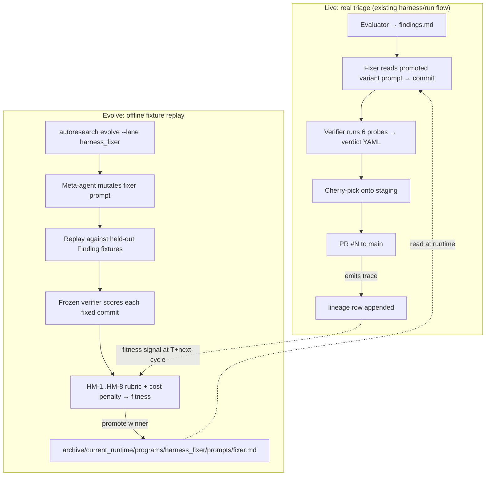
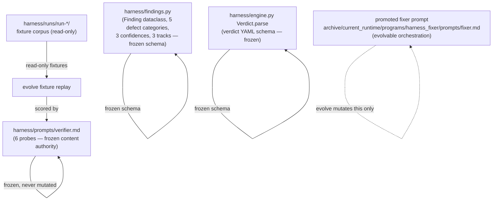

# Harness fixer/verifier + autoresearch fusion — v1 requirements

## Problem Frame

The harness (`harness/engine.py`, `harness/run.py`) is an internal debugging system. Its job: take triaged defects produced by an evaluator agent (`Finding` records — `harness/findings.py:31-67`) and ship verified fixes via a `fix → verify → cherry-pick → tip-smoke` pipeline. Today it ships measurable value (PR #11: 20 verified fixes of 33 actionable; per-worker isolation; graceful-stop resume), but every prompt revision in `harness/prompts/fixer.md` and `harness/prompts/verifier.md` is **iterated by JR by hand**: read agent.log, decide a probe missed, edit the prompt, re-run, repeat.

The bet: if the harness fixer agent could **self-improve via autoresearch's evolve loop**, every finding-fix-verify cycle would become training signal for the next fixer variant. The harness already produces structured fixtures as a side effect (one `harness/runs/run-<ts>/` directory per run, ~hundreds extant). Pairing those with a frozen verifier-as-judge gives autoresearch everything its evolve contract needs: a parent variant, a mutation space, fixtures, a rubric, a fitness signal. Stop hand-tuning the fixer — **let it evolve against its own historical corpus**.

This document tests that hypothesis. Recommendation: **YES — fit, with one explicit constraint** (the verifier MUST be frozen content, not orchestration). See §1.

## User Flow (operator view)



## Content substrate

The fusion contract is **what is frozen vs what evolves**. Get this wrong and the meta-agent farms the verifier (Goodhart) instead of getting better at fixing real defects.



The five frozen items above ARE the analog of marketing_audit's 149-lens catalog. The promoted fixer prompt is the analog of `archive/current_runtime/programs/marketing_audit/prompts/`.

---

## 1. DOES IT FIT?

**Recommendation: YES**, with one mandatory constraint.

The autoresearch lane contract (`autoresearch/lane_paths.py:36`, `autoresearch/lane_runtime.py:147-152`) is: a lane owns a path-prefix subtree under `archive/<variant_id>/programs/<lane>/`, evolve mutates files there, `lane_runtime.ensure_materialized_runtime` syncs the promoted variant into `archive/current_runtime/`, downstream consumers read from there. **Marketing_audit fits because its workflow consumes a content+prompt bundle and produces a markdown/PDF artifact that gets scored.** Harness fits the same way:

- **Variant-production surface = the fixer prompt.** Today `harness/prompts/fixer.md` is a single 89-line file. Externalize it under `archive/current_runtime/programs/harness_fixer/prompts/fixer.md`; have `harness/engine.py:render_fixer` load from there at runtime. That is the entire shape change on the live side.
- **Workflow output = `(commit_sha, verdict_yaml)` pair per finding.** Verifier emits `Verdict.verified: bool` + `reason` + `adjacent_checked`. This is already a structured score-able artifact — richer than marketing_audit's free-text deliverable.
- **Fixture = a Finding record + a known-good outcome from a past run.** The harness has hundreds of these on disk; see §5.

**The mandatory constraint: the verifier must be frozen.** If the meta-agent could evolve `verifier.md` and `fixer.md` together, it would discover that softer verifier probes let weaker fixer variants pass — Goodhart's law in one cycle. The marketing_audit plan handles this by freezing the catalog and the SubSignal/ParentFinding Pydantic schemas (see fusion plan R12 + R28). The exact analogue for harness:

- **Frozen content authority:** `verifier.md` (the 6 probes), the `Finding` schema (`harness/findings.py:31-67`), the `Verdict` schema (`harness/engine.py:103-153`), and the bug-type taxonomy (`DEFECT_CATEGORIES` at `harness/findings.py:17-23`).
- **Evolvable orchestration:** `fixer.md` only, in v1. (Possibly the evaluator prompt later — out of scope here, see §9 alt 4.)

With that constraint, the fit is structurally the same as marketing_audit. **Without it, the fusion is unsound.**

One asymmetry to note (not a blocker, but a planning concern): marketing_audit's evolve loop scores **content the variant writes**. Harness evolve's loop must score **code the variant generates by editing source files in a sandboxed worktree, then run the verifier's 6 probes against a real backend**. That is operationally heavier per fixture: each fixture replay needs a fresh worker worktree (`harness/worktree.py:87-143`), a backend on its own port, and a 30-min agent timeout. Cost: ≈ a single live-run finding's cost (~$0.50-2 in subscription burn) per (variant × fixture) pair. Plan accordingly.

---

## 2. CONTENT vs ORCHESTRATION BOUNDARY

Apply the same anti-Goodhart logic the marketing_audit plan uses (R28). The boundary IS the mutation space.

**FROZEN content authority (cannot mutate via evolve):**
- `harness/prompts/verifier.md` — the 6 probes (defect-gone, paraphrase, adjacent, surface-preserved, adversarial-state, symmetric-surface).
- The `Finding` Pydantic-equivalent dataclass at `harness/findings.py:31-67` (id, track, category, confidence, summary, evidence, reproduction, files).
- The `Verdict` schema at `harness/engine.py:103-153` (verified, reason, adjacent_checked, surface_changes_detected).
- The defect taxonomy at `harness/findings.py:17-23` (`crash`, `5xx`, `console-error`, `self-inconsistency`, `dead-reference` + `doc-drift`, `low-confidence`).
- The track partition at `harness/findings.py:26` (a/b/c = CLI/API/Frontend).
- The `_VERIFIED_TOKENS` / `_FAILED_TOKENS` set at `harness/engine.py:98-99` (otherwise meta-agent could mint new pass-tokens).

**EVOLVABLE orchestration (v1 mutation space):**
- The fixer system prompt — every section: preservation-first framing, "reproduce first" rule, "fix the producer not the consumer" doctrine, "minimal-change rule", scope-allowlist phrasing, "do not manage the stack", "when you are done" stopping condition.
- (Optional, separate evolution unit) The fixer's allowed-tools whitelist passed to `claude --dangerously-skip-permissions` — wider/narrower toolsets are an orchestration choice.
- (Optional, v2) Retry strategies in `engine._run_agent` — `_RETRY_DELAYS` tuple, `_AGENT_TIMEOUT`, the silent-hang-detection threshold. These are CODE not prompt; mutating them is a step harder than mutating a prompt file. Defer to v2.

**Out of scope (never evolved, never frozen-as-content — just normal code):**
- The orchestrator (`harness/run.py`) — worker pool, cherry-pick logic, lock discipline, leak detection. These are infrastructure.
- The evaluator prompts (`harness/prompts/evaluator-base.md`, `evaluator-track-{a,b,c}.md`) — evaluators produce the FIXTURES; if evaluators evolve, the fixture corpus drifts. Treat as a separate (later) lane: `harness_evaluator`.

This is the cleanest boundary. The fixer is the unit being optimized; the verifier is the rubric; everything else is plumbing.

---

## 3. RUBRIC AXES (HM-1..HM-8)

8 numbered criteria for scoring a fixer variant on fixture replay. All gradient 0–5 unless noted.

- **HM-1 Fix correctness (gradient 0–5)** — does the verifier emit `verdict: verified`? 0 = failed/error. 3 = verified after retry. 5 = verified on first attempt. (This is the most weighted axis.)
- **HM-2 Regression prevention (gradient 0–5)** — verifier's adjacent probe (probe 3 in `verifier.md`) AND symmetric-surface probe (probe 6) both pass? Tip-smoke (`harness/smoke.py`) doesn't fail post-fix? 0 = adjacent broken. 5 = clean.
- **HM-3 Change minimality (gradient 0–5)** — `git diff --stat HEAD~1 HEAD` line count. Anchor 1 = >300 lines or touches files outside finding's `files` list. 5 = ≤30 lines, all within implicated files. (Anti-feature-bloat — the `fixer.md` "minimal-change rule" exists for a reason.)
- **HM-4 Code quality (checklist, 4 binary YES/NO)**:
  - 1. No new public-API surface (no new exported symbols, no schema fields, no CLI flags) unless the finding explicitly required it?
  - 2. No new comments that describe WHAT the code does (only WHY-comments, per `CLAUDE.md` `# Doing tasks` instructions)?
  - 3. No "while I'm here" cleanup edits outside the finding's scope?
  - 4. No new tests written unless directly required by the fix (per `fixer.md` `tests/**` rule)?
- **HM-5 Verdict coherence (gradient 0–5)** — does the fixer's commit message subject match `harness: fix <finding.id>@c<n> — <summary>` (`harness/run.py` `_commit_fix`), and does the diff actually address the `summary` of the Finding (LLM-judged paraphrase match)? 0 = commit subject lies. 5 = subject + diff faithful.
- **HM-6 Time-to-fix (gradient 0–5, normalized)** — wall-clock seconds from prompt-render to verdict-write. 0 = >1800s (timeout). 5 = ≤300s. Normalized against current promoted variant's median.
- **HM-7 Cost-per-fix (gradient 0–5, normalized)** — total `claude -p` token usage from `cost_log.jsonl` per fixture. 0 = >100K output tokens. 5 = ≤20K. Same anti-Goodhart logic as marketing_audit R17 cost discipline (a 7/8 variant at 50% cost beats 8/8 at 100%).
- **HM-8 Human-decision-needed rate (gradient 0–5)** — over fixture batch, what fraction of fixtures end with the fixer writing `harness/blocked-<finding_id>.md` (the "I can't fix this without a product call" signal in `fixer.md`)? 0 = >50% blocked. 5 = ≤5%. (Subtle: high blocked-rate means timid fixer; near-zero may mean overconfident — calibration target ≈ 5–15%.)

8 criteria total, mirroring MA-1..MA-8's structure. Critique manifest SHA256-frozen at ship time per `autoresearch/critique_manifest.py:30-36`.

---

## 4. FITNESS SIGNAL

Marketing_audit's loop closes at T+60d on engagement-conversion (R19 in fusion plan); harness's loop can close **per evolve generation** because there's no human-decision lag. The signal IS the verifier's verdict over the held-out fixture suite, weighted by HM-1..HM-8 and the rubric/cost composite from R27 of the fusion plan.

**Fitness function shape (no final weights — that's plan-stage):**

```
fitness = w_correct * HM-1
        + w_regress * HM-2
        + w_min     * HM-3
        + w_quality * HM-4
        + w_coh     * HM-5
        + w_time    * HM-6 / latency_norm
        + w_cost    * HM-7 / token_norm
        + w_block   * HM-8
        - cost_penalty_weight   * normalized_token_cost
        - latency_penalty_weight * normalized_wall_clock
```

Same shape as fusion plan R27. HM-1 carries the highest weight in v1; HM-8 carries the lowest until calibrated. There is no T+lag engagement signal — replace it with a **production-trace signal**: at each evolve generation, also pull the last K live runs' verdicts and score the promoted variant against them. If the promoted variant's live HM-1 drops vs evolve-replay HM-1 by >0.5, that's a sign the fixture corpus is drifting from the live distribution and a fixture refresh is needed.

The signal is faster than marketing_audit's (no T+60d wait), but **noisier**: a single failed fixture can be a flake (Vite stale per Bug #18, silent rate-limit hang per Bug #11). Replay each fixture at least twice; treat HM-1 as a Bernoulli mean over replays.

---

## 5. FIXTURES

**Marketing_audit defers fixtures (fusion plan §"Outstanding Questions") because customer audits don't yet exist; harness has the opposite problem — too many candidate fixtures.** As of 2026-04-24:
- `harness/runs/run-20260424-131621/` alone has 90 findings, 33 actionable, 20 verified commits.
- 5+ prior runs visible at `harness/runs/run-2026042{2,3}-*/`. JR's memory file `project-harness-state-2026-04-24-evening.md` indicates the current branch (PR #11) carries 20 verified + 13 un-fixed actionable.

**v1 holdout suite proposal: ~30 fixtures, ~6 per axis.** Coverage requirement: at least 1 fixture per (defect-category × track) cell that has historical data:

| Track / Category | crash | 5xx | console-error | self-inconsistency | dead-reference |
|---|---|---|---|---|---|
| a (CLI) | 2 | 2 | — | 2 | 2 |
| b (API + autoresearch) | 2 | 3 | — | 2 | 2 |
| c (Frontend) | 1 | — | 3 | 2 | 2 |

Add 5–6 historically-failed-but-actionable findings (verifier emitted `failed reason=...`) so the rubric scores variants on their failures, not just successes. Total ≈ 30 fixtures.

**Canonicalization is the open question.** A fixture can't just be "the past Finding YAML" — replay needs the **pre-fix codebase state** too. Proposal: each fixture is `(Finding YAML, base_sha, golden_outcome)` where `base_sha` is the commit the historical evaluator ran against (recoverable from `harness/run.py`'s `_commit_fix` parent SHA), and `golden_outcome` is `verified | failed | blocked` from the historical verdict file. Replay = checkout `base_sha`, render fixer prompt with the historical Finding, run fixer on a worker worktree, run frozen verifier, compare `(verdict, golden_outcome)`.

**Fixture rotation.** Same anti-overfit discipline as autoresearch's existing holdout: 80% of fixtures stable across generations, 20% rotated each generation to detect overfitting. Rotated-out fixtures move to a `legacy/` partition for offline regression testing.

This is the largest planning unknown. See §10 Decision K-3.

---

## 6. LIVE WRAPPER vs EVOLVE WRAPPER

Same shape as fusion plan §Architecture. Both wrappers run the same lane program (the fixer prompt loaded from promoted variant); they differ in what they add around it.

| Wrapper | Entry point | Adds around the lane program |
|---|---|---|
| **Live** | `python -m harness --engine claude` (current) | Real evaluator → real findings → cherry-pick onto staging → real PR. Verdicts ship code to main. Pre-existing flow. |
| **Evolve** | `autoresearch evolve --lane harness_fixer --iterations N` | Variant mutation → replay against the 30-fixture holdout → frozen verifier scores each fixed commit → HM-1..HM-8 rubric + cost penalty → promote winner. Never touches main. Never opens PRs. |

Differences vs marketing_audit's wrapper contract:

- **No "human gate" in live.** Marketing_audit has Gate 1 (intake review), Gate 2 (deliverable review), payment gate. Harness's gating is implicit: PR review by JR before merge. The PR-review verdict IS the human gate; treat it as the live signal that flows back to evolve as a "production trace" supplement (§4).
- **No payment ledger.** Skip R4 of fusion plan. Subscription billing applies but there's no per-customer revenue attribution.
- **Downstream consumer = a PR review + merge**, not a paying prospect. The fitness loop closes when JR (or a future ce-review agent) reviews the staging branch. If reviews routinely catch verifier-passed defects, that's a strong signal the verifier needs new probes (a content-side change, not a fixer evolve).
- **`evolve_lock` works the same** as marketing_audit R16. A fixture-replay evolve must not race with a live `harness/run` (both want claude subscription rate-limit budget; both might write to overlapping worker ports).
- **No deliverable polish axis.** Marketing_audit's MA-6 doesn't apply — there's no "consultant memo prose quality" to score. HM-3 (minimality) and HM-4 (code quality) cover the analogous ground.
- **Pre-promotion smoke-test.** Same idea as fusion plan's "first customer-facing autoresearch lane" decision: before promoting a new fixer variant, replay it against 1–2 fresh fixtures (not from the holdout) and confirm HM-1 ≥ current promoted variant. Cheap safety rail.

---

## 7. INTEGRATION SITES

Don't write the actual edits — just enumerate. Cross-checked against `grep -l 'WORKFLOW_LANES\|geo.*competitive.*monitoring' autoresearch/`.

1. **`autoresearch/lane_paths.py:36`** — extend `LANES` tuple and add `harness_fixer` to `WORKFLOW_PREFIXES`. (The shim forwards to `src/shared/safety/tier_b`; that's where the source-of-truth lives.)
2. **`autoresearch/lane_runtime.py:12`** — extend the local `LANES = (...)` constant.
3. **`autoresearch/evolve.py:50`** — extend `ALL_LANES = (...)` tuple.
4. **`autoresearch/program_prescription_critic.py`** — add lane-specific prescription rules (file grep'd).
5. **`autoresearch/frontier.py`** — register harness_fixer's Pareto frontier (file grep'd).
6. **`autoresearch/evaluate_variant.py`** — register the HM-1..HM-8 scorer alongside GEO/CI/MON/SB (file grep'd; `src/evaluation/rubrics.py` is also a candidate edit site for the actual rubric prompts — see §10 K-7).
7. **`autoresearch/report_base.py`** — register lane-specific report templates (file grep'd).
8. **`autoresearch/test_lane_ownership.py`** — add ownership tests for the new path prefix.
9. **`src/evaluation/rubrics.py:949`** — add HM-1..HM-8 to the `RUBRICS` registry; the `RUBRIC_VERSION` hash auto-bumps. The `assert len(RUBRICS) == 32` at line 1001 → bump to 40.
10. **`autoresearch/archive/current_runtime/programs/`** — create `harness_fixer/prompts/fixer.md` directory + seed it with the current `harness/prompts/fixer.md` content (the "v0 promoted variant" — JR's hand-tuned prompt as today, treated as starting frontier).
11. **`harness/engine.py` `prompts_mod.render_fixer`** — load fixer prompt from `archive/current_runtime/programs/harness_fixer/prompts/fixer.md` instead of `harness/prompts/fixer.md`. (Verifier prompt path stays the same — frozen.)

That's 11 sites, mirroring the 11-site count in fusion plan Unit 17.

---

## 8. WHAT WOULD BREAK

Honest accounting of what JR loses (or could lose) by switching from manual iteration to evolve-loop variant rotation. JR's stated motivation ("an agent that fixes itself") is the hypothesis, not the conclusion.

**Risks worth naming:**

- **Loss of fast manual override.** Today JR can edit `harness/prompts/fixer.md` and re-run a single finding to see the effect inside ~5 minutes (one fixer + one verifier ≈ 10 min wall-clock). Under fusion, the fixer prompt is in `archive/current_runtime/programs/...`; ad-hoc tuning means either (a) hand-editing the promoted variant (which evolve will overwrite next promotion) or (b) running an evolve generation (~30 fixtures × ~5 min each ≈ 2.5 hours wall-clock at parallelism=3). **Mitigation:** keep a `--prompt-override <path>` flag on the live runner that bypasses the promoted variant, for emergency hand-tuning.
- **Evolve loop worse than manual when n is small.** First 3 generations have no good signal — the fixture corpus is small, the variants are guesses, the rubric weights aren't calibrated. Manual iteration may produce better fixers than evolve for the first month. **Mitigation:** treat first 3 generations as instrumentation bring-up; don't promote a variant unless HM-1 ≥ current head's HM-1 + 2σ noise.
- **Verifier-Goodhart risk if the boundary slips.** If anyone ever evolves the verifier alongside the fixer (even by accident), the loop becomes "fixer learns to satisfy whatever verifier says yes to" — exactly the failure mode marketing_audit's content/orchestration split exists to prevent. **Mitigation:** SHA256-freeze `verifier.md` in the critique manifest the same way `build_critique_prompt` is frozen at `autoresearch/critique_manifest.py:30-36`. Layer 1 validation rejects variants whose bundled manifest disagrees.
- **Fixture staleness / production drift.** The 30-fixture holdout reflects 2026-04 codebase reality. As the codebase evolves, fixtures' `base_sha` ages out (refs may be GC'd, files may be renamed). HM-1 on stale fixtures stops correlating with HM-1 on live findings. **Mitigation:** treat fixture rotation (§5, 20% per generation) as a hard schedule, and add a "live-trace divergence" alarm in §4.
- **Rate-limit thundering herd.** Live runs already burn 22M tokens / 5h-window for a 4-cycle 3-track run (per harness architecture memo). An evolve generation × 30 fixtures × 3 candidates ≈ 90 fixer runs ≈ 2× a live run. **Mitigation:** hard-enforce evolve_lock (no concurrent live + evolve), and run evolve overnight. Same as marketing_audit R16.
- **Catastrophic regression on promotion.** A new variant could be subtly worse on production-distribution findings even if it scores better on the holdout. **Mitigation:** pre-promotion smoke (§6) + canary live run (run new variant on 1 actionable finding live, gate promotion on verifier success).

**When evolve is worse than manual:** when (a) the fixture corpus is too small to discriminate variants, (b) the prompt change JR has in mind is a single targeted instruction rather than a structural rewrite (manual is faster), or (c) the production distribution has shifted enough that fixtures don't reflect it yet. JR should retain authority to skip evolve and ship a hand-edited prompt.

---

## 9. ALTERNATIVES CONSIDERED

Same scrutiny the marketing_audit brainstorm applies. Five alternatives.

- **Alt 1: Stay manual (do nothing).** JR continues hand-tuning `harness/prompts/fixer.md`. Cost: $0 in build time, 0 risk of Goodhart, full operator control. Loses: the compounding-quality property (every fix becomes training signal). **Verdict:** the right baseline, but JR's stated frustration with manual iteration is real — 33 actionable findings → 20 commits (~60% pass) suggests there's headroom the manual loop hasn't extracted. Don't pick this unless the fixture canonicalization (§5) or Goodhart risk (§8) blows up planning.
- **Alt 2: Build a harness-internal A/B framework without autoresearch.** Run two fixer prompts side-by-side on the same finding pool, score by verifier verdicts, ship the winner. Cost: ~1–2 weeks; reuses harness primitives. Loses: variant lineage (autoresearch's `lineage.jsonl`), Pareto-frontier tracking (`autoresearch/frontier.py`), prescription critic (`autoresearch/program_prescription_critic.py`), holdout discipline. **Verdict:** if the goal is "two prompts, pick one," this is faster. But the goal is *compounding* improvement across many generations; reinventing autoresearch's bookkeeping is wasted work — just plug in.
- **Alt 3: Full autoresearch lane (the recommended hypothesis).** §1–§7 above. Cost: ~3–5 weeks (lane registration + fixture canonicalization + HM-1..HM-8 wiring + first calibration generations). **Verdict:** recommended.
- **Alt 4: Subset — only evolve fixer prompt; freeze everything else (including evaluator).** This IS the recommended scope for v1. The evaluator (`harness/prompts/evaluator-*.md`) is also a candidate for evolution — but evaluators define the FIXTURE distribution; evolving them changes the corpus and corrupts the cross-generation comparison. Evolve evaluators only after the fixer loop is proven. **Verdict:** scope harness_fixer to fixer-only in v1; defer harness_evaluator lane to v2.
- **Alt 5: Multi-axis evolve — fixer prompt + fixer model selection + fixer tool whitelist together.** Treat the fixer's Claude model (Opus 4.7) and `--allowedTools` whitelist as part of the orchestration mutation space. Cost: bigger combinatorial search, but model choice is a major lever (Opus vs Sonnet at 1/5 cost). **Verdict:** worth considering — but model selection is currently locked at Opus 4.7 by JR's standing preference (`feedback-harness-model-opus.md`). v1 evolves prompt only; consider model as a v2 mutation axis once the rubric is calibrated and JR is comfortable letting a meta-agent pick models.

---

## 10. KEY DECISIONS TO LOCK BEFORE /ce:plan

Marketing_audit's brainstorm locked 13 Key Decisions. Below: **11 for harness fusion**, flagged JR-judgment vs derivable-from-code.

- **K-1 [JR judgment] Frozen-content-list confirmation.** Verifier prompt + Finding schema + Verdict schema + defect taxonomy + verified/failed token sets = frozen. Anything to add or remove? (Candidate to add: the `harness/safety.py` leak-detection regex — it shapes what the fixer can do.)
- **K-2 [JR judgment] Mutation-space scope for v1.** Confirm: ONLY `fixer.md`. No model selection, no allowed-tools whitelist, no retry-strategy code. (Alt 5 above.)
- **K-3 [Derivable from code, but needs JR sign-off] Fixture canonicalization rule.** §5 proposes `(Finding YAML, base_sha, golden_outcome)`. Does golden_outcome come from `harness/runs/run-*/verdicts/<id>.yaml` verbatim, or is JR re-judging the historical fixtures? Re-judging is ~30 × 5 min ≈ 2.5 hrs of JR time but corrects historical verifier flakes (Bugs #11, #17, #18 from `engine.py` comments). Recommend re-judge.
- **K-4 [JR judgment] Holdout size + coverage matrix.** §5 proposes 30 fixtures with the coverage table. Confirm or revise (Especially: track-c × console-error has 3 — is that enough?).
- **K-5 [JR judgment, urgent] HM-1..HM-8 weights for first 3 generations.** Suggested starting point: HM-1 = 0.40, HM-2 = 0.20, HM-3 = 0.10, HM-4 = 0.10, HM-5 = 0.10, HM-6 = 0.05, HM-7 = 0.04, HM-8 = 0.01. Confirm or revise. Cost penalty + latency penalty weights also TBD.
- **K-6 [Derivable from code] Lane name.** `harness_fixer` (recommended) vs `harness` (shorter but ambiguous — harness is the OUTER system; the lane is just the fixer). Code is grep-friendly either way.
- **K-7 [JR judgment] HM-rubric host.** Add to `src/evaluation/rubrics.py` (alongside GEO/CI/MON/SB) OR to a new `harness/rubrics.py`? `src/evaluation/rubrics.py` is the convention but means harness now imports from src/, breaking the harness-as-instrumentation isolation. Recommend new `harness/rubrics.py` with autoresearch importing it via the lane registration.
- **K-8 [Derivable] Prompt loader path.** Confirm `archive/current_runtime/programs/harness_fixer/prompts/fixer.md` (matches marketing_audit pattern) vs alt placement.
- **K-9 [JR judgment] Pre-promotion smoke gate.** §6 proposes 1–2 canary findings live before promoting. Live-canary is honest; offline canary is safe. Recommend offline (1 fixture not in holdout) for v1; revisit after first 3 promotions.
- **K-10 [JR judgment] Pin autoresearch evaluator at fusion ship.** Same as fusion plan R20. Marketing_audit will pin `autoresearch-audit-stable-YYYYMMDD`; harness fusion needs its own pin (`autoresearch-harness-stable-YYYYMMDD`) or shares marketing_audit's. Recommend share — simpler ops, both lanes ship downstream against the same evaluator commit.
- **K-11 [JR judgment, blocking] Order of operations vs marketing_audit fusion.** Marketing_audit fusion plan is 1,578 lines / 20 units / 6 phases; fusion plan estimated 7–9 weeks. Harness fusion should NOT ship in parallel — both touch the same lane registration sites (§7) and the same `evolve_lock`. Recommend serial: marketing_audit ships first (it's the customer-facing moat); harness fusion ships after, reusing the ground-truth that lane fusion works for at least one consumer. Alternatively: harness fusion ships first as a validation of the lane fusion mechanics on a no-customer-risk surface, then marketing_audit ships using the lessons. JR's call. **This decision blocks /ce:plan more than any other.**

---

## Success Criteria

V1 ships successfully if and only if: across **3 consecutive evolve generations**, the promoted fixer variant's HM-1 (fix-correctness) on a fresh 5-fixture canary set is **≥ baseline + 1σ** (where baseline = `harness/prompts/fixer.md` at 2026-04-26 SHA), AND HM-3 (minimality) does not regress, AND verifier-detected adversarial-state (probe 4) defects do not regress.

If after 3 generations no variant beats baseline by 1σ, kill the experiment — manual iteration was producing the right output and the fusion overhead isn't paying for itself.

## Scope Boundaries

**Explicitly not in v1:**
- Evolving the evaluator prompt. Defer to harness_evaluator v2.
- Evolving the verifier prompt. Frozen content authority — never evolved (Goodhart).
- Evolving model selection or `--allowedTools`. Prompt only.
- Evolving retry strategies / orchestrator code. Prompt only.
- Auto-promoting variants without operator review. Promotion stays a CLI command (`autoresearch evolve --lane harness_fixer promote <variant_id>`), not a cron.
- Customer-facing claims about self-improving fix quality. This is internal tooling; no marketing.
- Cross-lane mutation (e.g. evolving fixer + evaluator together to find a Pareto frontier). Single-lane in v1.

## Dependencies / Assumptions

- **`harness/prompts/fixer.md` baseline at 2026-04-26 commit `b3f05cc`** is the v0 promoted variant. Treat as frontier seed.
- **Fixture corpus on disk** at `harness/runs/run-202604*/` — assumed not deleted; tar+commit a snapshot before fusion ships.
- **`autoresearch evolve` machinery** ships 4 lanes today; harness_fixer slots in via the same pattern.
- **Subscription rate-limit budget.** A full evolve generation consumes ≤50% of a Claude subscription 5h window (mirrors fusion plan R29). Soft-warn at 40%, hard-breaker at 50%.
- **Marketing_audit fusion serial vs parallel** — see K-11. Blocks until JR decides.
- **Existing primitives reused:** `autoresearch/runtime_bootstrap.py` (variant materialization), `autoresearch/evaluate_variant.py` (rubric scoring), `autoresearch/frontier.py` (Pareto-frontier), `autoresearch/critique_manifest.py` (frozen-symbol SHA256 — extend to cover `verifier.md` + Finding/Verdict schema files), `harness/sessions.py` (session resume), `harness/worktree.py:create_workers` (per-fixture worker isolation during replay).

## Outstanding Questions

### Resolve Before Planning

- **K-11 (order of operations)** — must resolve. Affects whether /ce:plan for harness fusion can run before marketing_audit ships.
- **K-1 (frozen content list)** — affects critique_manifest extension and verifier-evolution prevention.
- **K-3 (fixture canonicalization)** — affects whether JR's calendar can absorb the re-judge time.

### Deferred to Planning

- [Affects HM-1] Should HM-1 score "verified on first attempt" higher than "verified after retry"? Implementation of `_RETRY_DELAYS` makes "after retry" possible; weighting is a judgment call.
- [Affects HM-7] Per-variant token-cost normalization — normalize against current promoted variant or against fixture-specific baseline?
- [Affects §5 fixture rotation] 80/20 split — exact rotation cadence (every generation? every 3?).
- [Affects §6 evolve_lock] Cross-lane evolve_lock — does marketing_audit's evolve block harness_fixer's evolve? Recommend yes (subscription rate budget is shared).
- [Affects §7 site 9] Bumping `assert len(RUBRICS) == 32` to `== 40` requires cross-checking with the eval harness in `autoresearch/evaluate_variant.py` — test impact unclear.

## Next Steps

→ `/ce:plan` for structured implementation planning (consumes this doc + `docs/plans/2026-04-24-005-feat-audit-engine-fusion-plan.md` as architecture reference + memory file `reference-harness-architecture-2026-04-24.md`). Blocked on K-1, K-3, K-11.
