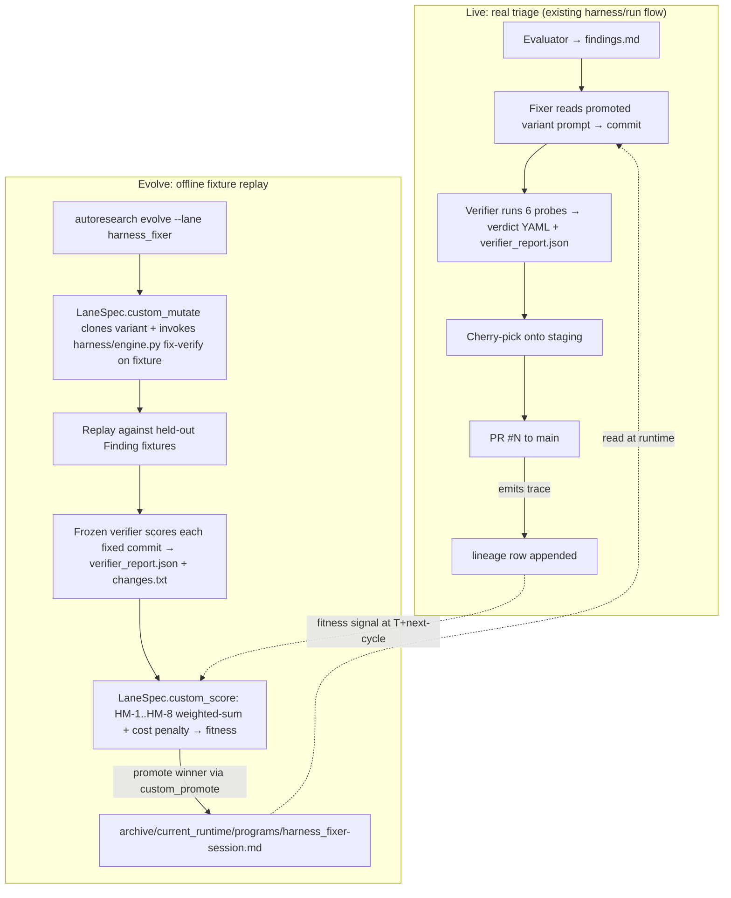
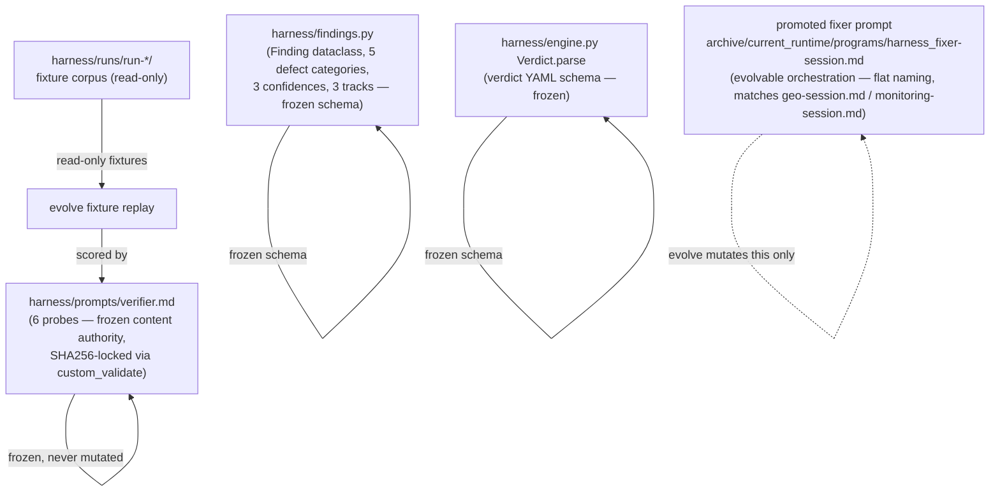

# Harness fixer/verifier + autoresearch fusion — v1 requirements

## Problem Frame

The harness (`harness/engine.py`, `harness/run.py`) is an internal debugging system. Its job: take triaged defects produced by an evaluator agent (`Finding` records — `harness/findings.py:31-67`) and ship verified fixes via a `fix → verify → cherry-pick → tip-smoke` pipeline. Today it ships measurable value (PR #11 / PR #25: 23 verified fixes; per-worker isolation; graceful-stop resume), but every prompt revision in `harness/prompts/fixer.md` is **iterated by JR by hand**: read agent.log, decide a probe missed, edit the prompt, re-run, repeat.

The bet: if the harness fixer agent could **self-improve via autoresearch's evolve loop**, every finding-fix-verify cycle would become training signal for the next fixer variant. The harness already produces structured fixtures as a side effect (one `harness/runs/run-<ts>/` directory per run; 21 extant). Pairing those with a frozen verifier-as-judge gives autoresearch everything its evolve contract needs: a parent variant, a mutation surface, fixtures, a rubric, a fitness signal. Stop hand-tuning the fixer — **let it evolve against its own historical corpus**.

This document tests that hypothesis. Recommendation: **YES — fit, with one explicit constraint** (the verifier MUST be frozen content, not orchestration). The lane_registry refactor shipped 2026-04-28 (HEAD `9549500`) provides the integration substrate: **harness_fixer becomes a divergent LaneSpec with `custom_mutate` + `custom_score` + `custom_validate` callables.** See §1.

## User Flow (operator view)



## Content substrate

The fusion contract is **what is frozen vs what evolves**. Get this wrong and the meta-agent farms the verifier (Goodhart) instead of getting better at fixing real defects.



The five frozen items above ARE the analog of marketing_audit's 149-lens catalog. The promoted fixer prompt is the analog of `archive/current_runtime/programs/marketing_audit-session.md`.

---

## 1. DOES IT FIT?

**Recommendation: YES**, with one mandatory constraint, and a fully provisioned integration substrate.

The lane_registry refactor (`autoresearch/lane_registry.py`, 242 LoC, shipped 2026-04-28 HEAD `9549500`) ships **exactly the substrate harness_fixer needs**:

- **`LaneSpec.custom_mutate`** is *explicitly provisioned for harness_fixer* (per `lane-registry.md` field reference: "Used by `harness_fixer` to invoke `harness/engine.py`'s fix-verify loop"). Instead of running the default meta-agent, the harness_fixer lane's `custom_mutate` callable invokes `harness/engine.py`'s existing `fix → verify` sequence against a fixture, captures the resulting `(commit_sha, verdict.yaml, verifier_report.json)` triple, and returns it for scoring. **No new "mutation engine" needed; the existing harness IS the mutation engine.**
- **`LaneSpec.custom_score`** carries the weighted-sum HM-1..HM-8 + cost/latency penalty (§3 + §4). Existing lanes' default geomean-of-LLM-judges aggregator stays untouched.
- **`LaneSpec.custom_validate`** runs the file-bytes manifest check using the **shared utilities `file_hash` / `compute_manifest` / `verify_manifest` already exported from `lane_registry.py`** (lines 224-243). E3 from the prior brainstorm draft (markdown freezing has no implementation) is **resolved** — the freezing primitives ship today.
- **`LaneSpec.custom_promote`** carries the optional pre-promotion smoke-test (K-9). No "brand-new infrastructure" — it's one callable in the LaneSpec, and the registry already wires `custom_promote` into `evolve.cmd_promote`.
- **`LaneSpec.custom_objective_score_from_entry`** stays `None` — harness_fixer's per-lineage selection signal is `domains[harness_fixer].score` (default behavior at `lane_registry.py:default_objective_score_from_entry`).

**The mandatory constraint: the verifier must be frozen.** If the meta-agent could evolve `verifier.md` and `fixer.md` together, it would discover that softer verifier probes let weaker fixer variants pass — Goodhart's law in one cycle. Mechanism: `custom_validate` calls `file_hash(variant_dir / "harness/prompts/verifier.md")` and compares to a hardcoded `EXPECTED_VERIFIER_SHA256` constant captured at v0 freeze. Variants whose verifier hash drifts are discarded before scoring.

- **Frozen content authority:** `harness/prompts/verifier.md` (the 6 probes), the `Finding` schema (`harness/findings.py:31-67`), the `Verdict` schema (`harness/engine.py:103-153`), and the bug-type taxonomy (`DEFECT_CATEGORIES` at `harness/findings.py:17-23`).
- **Evolvable orchestration:** `harness/prompts/fixer.md` only, in v1.

With the constraint enforced via `custom_validate` and the freezing utilities already shipped, the fit is structurally clean. **Without enforcement, the fusion is unsound.**

One asymmetry to note: marketing_audit's evolve loop scores **content the variant writes**. Harness evolve's loop must score **code the variant generates by editing source files in a sandboxed worktree, then run the frozen verifier against a real backend**. That is operationally heavier per fixture: each fixture replay needs a fresh worker worktree (`harness/worktree.py:87-143`), a backend on its own port, and a 30-min agent timeout. Cost: ≈ a single live-run finding's cost (~$0.50-2 in subscription burn) per (variant × fixture) pair. `custom_mutate` IS the integration boundary for this asymmetry.

---

## 2. CONTENT vs ORCHESTRATION BOUNDARY

Apply the same anti-Goodhart logic the marketing_audit plan uses. The boundary IS the mutation space.

**FROZEN content authority (cannot mutate via evolve):**
- `harness/prompts/verifier.md` — the 6 probes (defect-gone, paraphrase, adjacent, surface-preserved, adversarial-state, symmetric-surface). **Enforced via `custom_validate` calling `file_hash` (shipped utility at `lane_registry.py:223`) against `EXPECTED_VERIFIER_SHA256` constant.**
- The `Finding` Pydantic-equivalent dataclass at `harness/findings.py:31-67` (id, track, category, confidence, summary, evidence, reproduction, files). Frozen by Python source; meta-agent has no write access to harness infrastructure paths (see Divergence Lock #1 below).
- The `Verdict` schema at `harness/engine.py:103-153` (verified, reason, adjacent_checked, surface_changes_detected). Same protection as Finding.
- The defect taxonomy at `harness/findings.py:17-23` (`crash`, `5xx`, `console-error`, `self-inconsistency`, `dead-reference` + `doc-drift`, `low-confidence`).
- The track partition at `harness/findings.py:26` (a/b/c = CLI/API/Frontend).
- The `_VERIFIED_TOKENS` / `_FAILED_TOKENS` set at `harness/engine.py:98-99` (otherwise meta-agent could mint new pass-tokens).

**EVOLVABLE orchestration (v1 mutation space):**
- The fixer system prompt (`harness/prompts/fixer.md` → variant copy) — every section: preservation-first framing, "reproduce first" rule, "fix the producer not the consumer" doctrine, "minimal-change rule", scope-allowlist phrasing, "do not manage the stack", "when you are done" stopping condition. **As of K-12 patches (commit `04ae0a9`, 2026-04-29), the prompt also includes an "Anticipate the verifier" section + worktree-hygiene clause + [STABLE]/[EVOLVABLE] section markers** — meta-agent is restricted to mutating only [EVOLVABLE]-prefixed sections.
- (Optional, separate evolution unit) The fixer's allowed-tools whitelist passed to `claude --dangerously-skip-permissions` — wider/narrower toolsets are an orchestration choice.
- (Optional, v2) Retry strategies in `engine._run_agent` — `_RETRY_DELAYS` tuple, `_AGENT_TIMEOUT`, the silent-hang-detection threshold. These are CODE not prompt; mutating them is a step harder than mutating a prompt file. Defer to v2.

**Out of scope (never evolved, never frozen-as-content — just normal code):**
- The orchestrator (`harness/run.py`) — worker pool, cherry-pick logic, lock discipline, leak detection. These are infrastructure.
- The evaluator prompts (`harness/prompts/evaluator-base.md`, `evaluator-track-{a,b,c}.md`) — evaluators produce the FIXTURES; if evaluators evolve, the fixture corpus drifts. Treat as a separate (later) lane: `harness_evaluator`.

This is the cleanest boundary. The fixer is the unit being optimized; the verifier is the rubric; everything else is plumbing.

---

## 3. RUBRIC AXES (HM-1..HM-8)

8 numbered criteria for scoring a fixer variant on fixture replay.

> **Scoring convention.** All gradient axes use the **1/3/5 anchor scale** that `src/evaluation/rubrics.py:3-4` and `src/evaluation/judges/__init__.py:74-76 normalize_gradient` enforce. Existing rubrics (GEO-1, MON-2) ship 15-25-line anchor-rich prompts; the sketches below name the anchors but defer the production prose to /ce:plan. HM-4 is a 4-binary checklist matching `normalize_checklist`. **Normalized to `[0,1]` per existing convention so default `select_parent.plateau_threshold = 0.01` works** — see Divergence Lock #2.

- **HM-1 Fix correctness (gradient 1/3/5)** — does the verifier emit `verdict: verified`? **Scored from a `verifier_report.json` artifact emitted by `custom_mutate`** (the harness fix-verify wrapper writes this file alongside the verdict YAML). 1 = report missing OR `verdict: failed/error`. 3 = `verdict: verified` after retry. 5 = `verdict: verified` on first attempt. (Highest weighted axis.)
- **HM-2 Regression prevention (gradient 1/3/5)** — verifier's adjacent probe (probe 3) AND symmetric-surface probe (probe 6) both pass? Tip-smoke (`harness/smoke.py`) doesn't fail post-fix? Scored from `verifier_report.json:probes_passed`. 1 = adjacent OR symmetric broken. 3 = both probes pass on retry. 5 = both pass first try.
- **HM-3 Change minimality (gradient 1/3/5)** — **scored from a `changes.txt` artifact** (output of `git diff --stat HEAD~1 HEAD` emitted by `custom_mutate`; existing rubrics are text-only — `changes.txt` is the lane's domain-specific output, not a substrate change). 1 = >300 lines or touches files outside finding's `files` list. 3 = 30-100 lines. 5 = ≤30 lines, all within implicated files.
- **HM-4 Code quality (checklist, 4 binary YES/NO)**:
  1. No new public-API surface (no new exported symbols, no schema fields, no CLI flags) unless the finding explicitly required it?
  2. No new comments that describe WHAT the code does (only WHY-comments, per `CLAUDE.md` `# Doing tasks` instructions)?
  3. No "while I'm here" cleanup edits outside the finding's scope?
  4. No new tests written unless directly required by the fix (per `fixer.md` `tests/**` rule)?
- **HM-5 Verdict coherence (gradient 1/3/5)** — does the fixer's commit message subject match `harness: fix <finding.id>@c<n> — <summary>` (`harness/run.py` `_commit_fix`), and does the diff actually address the `summary` of the Finding (LLM-judged paraphrase match)? 1 = commit subject lies. 3 = subject matches but diff drift. 5 = subject + diff faithful.
- **HM-6 Time-to-fix (gradient 1/3/5, normalized)** — wall-clock seconds from prompt-render to verdict-write. Read from `verifier_report.json:wall_clock_s`. 1 = >1800s (timeout). 3 = ≤900s. 5 = ≤300s. Normalized against current promoted variant's median.
- **HM-7 Cost-per-fix (gradient 1/3/5, normalized)** — total `claude -p` token usage per fixture, read from `verifier_report.json:tokens_in + tokens_out`. 1 = >100K output tokens. 3 = ≤50K. 5 = ≤20K.
- **HM-8 Human-decision-needed rate (gradient 1/3/5)** — over fixture batch, what fraction of fixtures end with the fixer writing `harness/blocked-<finding_id>.md`? 1 = >50% blocked. 3 = 15-30% blocked. 5 = ≤5% blocked (calibration target ≈ 5–15%).

8 criteria total, mirroring MA-1..MA-8's structure. Production prompt prose deferred to /ce:plan.

---

## 4. FITNESS SIGNAL

Marketing_audit's loop closes at T+60d on engagement-conversion; harness's loop can close **per evolve generation** because there's no human-decision lag. The signal IS the verifier's verdict over the held-out fixture suite, weighted by HM-1..HM-8 and the cost composite.

**Fitness function shape (no final weights — that's plan-stage):**

```
fitness = w_correct * HM-1
        + w_regress * HM-2
        + w_min     * HM-3
        + w_quality * HM-4
        + w_coh     * HM-5
        + w_time    * HM-6 / latency_norm
        + w_cost    * HM-7 / token_norm
        + w_block   * HM-8
        - cost_penalty_weight    * normalized_token_cost
        - latency_penalty_weight * normalized_wall_clock
```

**Implementation:** lives entirely inside `LaneSpec.custom_score`. Existing lanes' default geomean-aggregator at `evaluate_variant.py` is untouched. **No new aggregator code in autoresearch substrate** (this resolves a worry from the prior draft).

**Aggregation note.** Existing lanes use **geometric-mean per fixture × geometric-mean across fixtures** (the default at `evaluate_variant.py`); harness_fixer's weighted-sum-with-penalties is **opt-in via `custom_score`**, not a substrate edit. The lane_registry contract was designed for this — `custom_score` is one of the 5 explicit divergence callables.

There is no T+lag engagement signal — replace it with a **production-trace signal**: at each evolve generation, also pull the last K live runs' verdicts and score the promoted variant against them. If the promoted variant's live HM-1 drops vs evolve-replay HM-1 by >0.5, that's a sign the fixture corpus is drifting from the live distribution and a fixture refresh is needed.

The signal is faster than marketing_audit's (no T+60d wait), but **noisier**: a single failed fixture can be a flake (Vite stale per Bug #18, silent rate-limit hang per Bug #11). Replay each fixture at least twice; treat HM-1 as a Bernoulli mean over replays.

---

## 5. FIXTURES

**21 historical runs on disk, 273 findings, ~110 high-confidence-actionable** after filtering `doc-drift` (30) + `low-confidence` (19).

**v1 holdout suite proposal: ~30 fixtures, ~6 per axis.** Coverage requirement: at least 1 fixture per (defect-category × track) cell that has historical data. Audit-confirmed cell counts (high-confidence-actionable):

| Track / Category | crash | 5xx | console-error | self-inconsistency | dead-reference |
|---|---|---|---|---|---|
| a (CLI) | 10 ✓ | 6 ✓ | — | 53 ✓ | 19 ✓ |
| b (API + autoresearch) | 8 ✓ | 24 ✓ | — | 34 ✓ | 10 ✓ |
| c (Frontend) | — | — | 8 ✓ | 24 ✓ | 28 ✓ |

Every cell with history has ≥6 candidates. Sampling 30 fixtures across the populated cells is comfortable. Add 5–6 historically-failed-but-actionable findings (verifier emitted `failed reason=...`) so the rubric scores variants on their failures, not just successes.

**Canonicalization.** Each fixture is `(Finding YAML, base_sha, golden_outcome)`. `base_sha` is the commit the historical evaluator ran against; `golden_outcome` is `verified | failed | blocked` from the historical verdict file.

> **base_sha capture gap.** The harness records commit SHAs in `harness.log` ("verify phase: <id> (commit <sha[:8]>)") but **NOT in verdict YAMLs or `sessions.json`**. v1 prerequisite: emit `verdicts/manifest.json` post-run mapping `{finding_id → {base_sha, commit_sha, verdict_status}}` by parsing `harness.log`. ~2-3 hours of new code in `harness/run.py`. This is a harness-side change, not an autoresearch-side change — the lane_registry doesn't constrain it.

**Fixture rotation.** 80% stable across generations, 20% rotated each generation to detect overfitting.

**Disk footprint:** 30 fixtures ≈ 210MB of run-dir snapshots. Commit to a separate fixture archive (or LFS); do not bloat main repo.

**Excluded runs:** `run-20260422-224908` is referenced in `engine.py:117` (Bug #17 YAML retry) and `:485-501` (silent rate-limit hang Bug #11) — its verdicts are partly flake-tainted. Mark legacy; prefer `run-20260424-131621`+ for the v1 holdout.

---

## 6. LIVE WRAPPER vs EVOLVE WRAPPER

Both wrappers run the same lane program (the fixer prompt loaded from promoted variant). Key change vs prior draft: **evolve doesn't need a separate wrapper module — `LaneSpec.custom_mutate` IS the wrapper.** `evolve.cmd_run` calls `spec.custom_mutate(variant_dir, fixture, ...)` and the harness lane returns scoreable artifacts.

| Wrapper | Entry point | Adds around the lane program |
|---|---|---|
| **Live** | `python -m harness --engine claude` (current) | Real evaluator → real findings → cherry-pick onto staging → real PR. Verdicts ship code to main. **Also emits `verifier_report.json` + `changes.txt` per finding** for evolve-loop consumption. |
| **Evolve** | `autoresearch evolve --lane harness_fixer --iterations N` | `custom_mutate` calls into harness/engine.py's fix-verify with the fixture's Finding + base_sha → emits `verifier_report.json` + `changes.txt` → `custom_score` runs HM-1..HM-8 weighted sum + cost penalty → `custom_promote` (optional pre-promotion smoke). Never touches main. Never opens PRs. |

The artifact-emission contract is **shared** between live and evolve — the same JSON/text shape on both sides — so every live run feeds the next evolve generation's "production-trace" signal (§4). One emission path, two consumers.

Differences vs marketing_audit's wrapper contract:

- **No "human gate" in live.** Marketing_audit has Gate 1, Gate 2, payment gate. Harness's gating is implicit: PR review by JR before merge. Treat as production-trace signal.
- **No payment ledger.** Subscription billing applies but no per-customer revenue attribution.
- **Downstream consumer = a PR review + merge**, not a paying prospect.
- **`evolve_lock` works the same** — a fixture-replay evolve must not race with a live `harness/run` (both want claude subscription rate-limit budget; both might write to overlapping worker ports). Existing `state.evolve_lock` mutex covers this.
- **No deliverable polish axis.** HM-3 (minimality) and HM-4 (code quality) cover the analogous ground.

---

## 7. INTEGRATION SITES

**Lane_registry collapsed the prior 13-site dance to 5 sites.** Cross-checked against shipped `lane_registry.py` (242 LoC) + `lane-registry.md` field reference + Known Divergence Points #1, #2, #4.

1. **`autoresearch/lane_registry.py:LANES`** — add one `LaneSpec` entry for `harness_fixer`. Fields: `name`, `is_workflow_lane=True`, `rubric_ids=_rubric_ids("HM")`, `path_prefixes=("harness/prompts/fixer.md", "programs/harness_fixer-session.md", ...)`, `session_md_filename="harness_fixer-session.md"`, `deliverables=("verifier_report.json", "changes.txt")`, `structural_doc_facts=(...)`, `structural_gate_functions=(...)`, **`custom_mutate=harness_fixer_mutate`**, **`custom_score=harness_fixer_score`**, **`custom_validate=harness_fixer_validate`** (optional `custom_promote=harness_fixer_promote` for K-9 smoke gate).
2. **`autoresearch/harness_fixer_lane.py`** (new file, ~200-300 LoC) — defines the 4 callables that get attached to the LaneSpec. `custom_mutate` shells into `harness/engine.py`'s `fix` + `verify` with the fixture's `(Finding, base_sha)` + emits `verifier_report.json` + `changes.txt`. `custom_score` does HM-1..HM-8 weighted sum + cost penalty (reads the two artifacts, applies the rubric — leveraging the existing `src/evaluation` rubric-call machinery for the LLM-judged parts: HM-4 checklist + HM-5 paraphrase match). `custom_validate` calls `compute_manifest` / `verify_manifest` (the shipped utilities) against `EXPECTED_VERIFIER_SHA256`. `custom_promote` runs one canary fixture (deferred K-9 design).
3. **`src/evaluation/rubrics.py`** — add 8 HM-* `RubricTemplate` entries and bump the `assert len(RUBRICS) == 32` assertion. The lane_registry's `_DOMAIN_CRITERIA` derived dict picks them up automatically — no `service.py` edit needed.
4. **`src/evaluation/models.py:160`** — extend the hardcoded `Literal["geo", "competitive", "monitoring", "storyboard"]` to include `"harness_fixer"`. Per lane-registry plan: this stays manually synced because `Literal` can't reference a runtime registry; the runtime assertion `_assert_models_literal_matches()` (already shipped in lane_registry.py) catches drift.
5. **`autoresearch/lane_paths.py:42 HARNESS_PREFIXES`** — granularize per Divergence Lock #1 below. Single change to one constant.

**That's 5 sites, including 1 new file.** The prior draft's 13 sites are now derived constants — `WORKFLOW_PREFIXES`, `DELIVERABLES`, `_INTERMEDIATE_ARTIFACTS`, `DOMAIN_FILENAMES`, `STRUCTURAL_DOC_FACTS`, `STRUCTURAL_GATE_FUNCTIONS`, `_DOMAIN_CRITERIA`, `ALL_LANES`, `WORKFLOW_LANES` are all generated from `LANES` via `lane_registry.py:225-243`. Touching them is forbidden by the refactor — they get rewritten as derived re-exports.

### Divergence Locks (per JR's instruction — Known Divergence Points to pick one option each)

**Divergence Lock #1 — `HARNESS_PREFIXES` carve-out (DP #4 in lane-registry-plan).**
JR explicitly assigned this. Pick **option (b): granularize `HARNESS_PREFIXES`**.

Reasoning: option (a) requires a new LaneSpec field (`excluded_path_overrides`), which violates JR's instruction "Do not propose new LaneSpec fields unless you can justify a 6th divergence axis." Option (c) (move harness files outside `harness/` prefix) is a cosmetic upheaval to the live harness for no semantic gain. Option (b) is a one-line constant edit that makes the boundary semantically explicit (infrastructure vs. lane-evolvable assets).

Concrete change at `lane_paths.py:42`:
```python
# Was: HARNESS_PREFIXES = ("harness",)
# Becomes:
HARNESS_PREFIXES = (
    "harness/engine.py", "harness/run.py", "harness/sessions.py",
    "harness/worktree.py", "harness/safety.py", "harness/config.py",
    "harness/findings.py", "harness/preflight.py", "harness/review.py",
    "harness/smoke.py", "harness/cli.py", "harness/__init__.py",
    "harness/__main__.py", "harness/runs/", "harness/INVENTORY.md",
    "harness/README.md", "harness/SEED.md", "harness/SMOKE.md",
    "harness/prompts/verifier.md", "harness/prompts/evaluator-base.md",
    "harness/prompts/evaluator-track-a.md", "harness/prompts/evaluator-track-b.md",
    "harness/prompts/evaluator-track-c.md",
)
# harness/prompts/fixer.md is NOT excluded — it's owned by the harness_fixer lane
# via path_prefixes in its LaneSpec.
```

The existing 4 lanes don't claim any `harness/*` paths, so granularization changes nothing for them. `harness_fixer` claims `harness/prompts/fixer.md` via its LaneSpec path_prefixes.

**Divergence Lock #2 — `plateau_threshold` (DP #1 in lane-registry-plan).**
Pick **option (c): score normalization brings to `[0,1]`** so default plateau_threshold doesn't need lane-awareness.

Reasoning: HM-1..HM-8 are 1/3/5 anchors that `judges/__init__.py:74-76 normalize_gradient` already maps to `[0,1]` via `(score - 1) / 4`. The HM weighted-sum aggregator in `custom_score` keeps its output in `[0,1]` (weights sum to 1; cost/latency penalties are bounded subtractions clamped at 0). No new LaneSpec field; existing `select_parent.plateau_threshold = 0.01` works unchanged.

**Divergence Lock #3 — Snapshot-at-clone for `verifier.md` (DP #2 in lane-registry-plan).**
Pick **option (c): `custom_validate` re-runs `compute_manifest` on every validate**, no separate clone-time snapshot needed.

Reasoning: `verifier.md` should NEVER change between clone and validate — it's frozen content. The "expected hash" is therefore a fixed-at-v0-freeze constant (`EXPECTED_VERIFIER_SHA256`), not a per-clone snapshot. Option (a) (`custom_clone`) requires a 6th LaneSpec callable just to record what's already a constant. Option (b) (`file_bytes_manifest_paths`) requires a new LaneSpec data field. Option (c) is the simplest:

```python
# autoresearch/harness_fixer_lane.py
from autoresearch.lane_registry import file_hash

EXPECTED_VERIFIER_SHA256 = "..."  # captured at v0 freeze; updated only via explicit lane release
EXPECTED_FINDINGS_PY_SHA256 = "..."
EXPECTED_ENGINE_PY_VERDICT_SECTION_SHA256 = "..."

def harness_fixer_validate(variant_dir: Path) -> bool:
    if file_hash(variant_dir / "harness/prompts/verifier.md") != EXPECTED_VERIFIER_SHA256:
        return False
    if file_hash(variant_dir / "harness/findings.py") != EXPECTED_FINDINGS_PY_SHA256:
        return False
    # ... other frozen-content checks
    return True
```

No new LaneSpec field; uses the shipped `file_hash` utility directly.

---

## 8. WHAT WOULD BREAK

Honest accounting of what JR loses (or could lose) by switching from manual iteration to evolve-loop variant rotation.

**Risks worth naming:**

- **Loss of fast manual override.** Today JR can edit `harness/prompts/fixer.md` and re-run a single finding inside ~5 minutes. Under fusion, the fixer prompt is in `archive/current_runtime/programs/harness_fixer-session.md`. **Mitigation:** the live runner accepts a `--prompts-dir` flag (still required new code in harness/cli.py — small) that bypasses the promoted variant for emergency hand-tuning.
- **Evolve loop worse than manual when n is small.** First 3 generations have no good signal. Manual iteration may produce better fixers than evolve for the first month. **Mitigation:** treat first 3 generations as bring-up; don't promote unless HM-1 ≥ current head's HM-1 + 2σ noise.
- **Verifier-Goodhart risk if the boundary slips.** **Mitigation:** `custom_validate` SHA256-checks `verifier.md` (and findings.py + the verdict-parsing section of engine.py) against `EXPECTED_*_SHA256` constants. Variants whose hashes drift are discarded before scoring.
- **Fixture staleness / production drift.** As the codebase evolves, fixtures' `base_sha` ages out. **Mitigation:** fixture rotation (§5, 20% per generation) + "live-trace divergence" alarm (§4) + the `verdicts/manifest.json` capture hook so `base_sha` isn't lost.
- **Verifier-as-judge dual-write surface.** `verifier_report.json` is a NEW artifact alongside the existing `verdict.yaml`. **Mitigation:** post-verify hook in `harness/engine.py:verify` translates from the verdict YAML + telemetry to the JSON; verifier subprocess still writes only one artifact (`verdict.yaml`). One LLM-side write contract.
- **Rate-limit thundering herd.** An evolve generation × 30 fixtures × 3 candidates ≈ 90 fixer runs ≈ 2× a live run. **Mitigation:** evolve_lock prevents concurrent live + evolve. Run evolve overnight.
- **Catastrophic regression on promotion.** A new variant could be subtly worse on production-distribution findings even if it scores better on the holdout. **Mitigation:** `custom_promote` smoke gate (K-9) — pre-promotion smoke runs 1-2 fresh fixtures.

**When evolve is worse than manual:** when (a) the fixture corpus is too small to discriminate variants, (b) JR's intended prompt change is a single targeted instruction (manual is faster), or (c) production distribution has shifted enough that fixtures don't reflect it. JR retains authority to skip evolve and ship a hand-edited prompt via `--prompts-dir`.

---

## 9. ALTERNATIVES CONSIDERED

- **Alt 1: Stay manual.** $0 build, full operator control. Loses compounding-quality. Evidence against: PR #25's 23-verified + 10-rolled-back rate shows manual leaves headroom. Don't pick unless K-12 (v0 prior weakness) blocks.
- **Alt 2: Harness-internal A/B framework.** ~1-2 weeks. Reinvents lineage/frontier/prescription-critic. Wasted work now that lane_registry exists.
- **Alt 3: Full autoresearch lane (recommended).** ~2-3 weeks of new code (lane_registry made this CHEAPER than the prior 13-site estimate): 1 LaneSpec entry + 1 callables module + harness-side `verifier_report.json` + `changes.txt` + `verdicts/manifest.json` capture hooks + 8 rubric prompts + Literal sync + HARNESS_PREFIXES granularization. **Verdict: recommended.**
- **Alt 4: Subset — only fixer prompt evolves, evaluator stays frozen.** This IS the v1 scope. Defer harness_evaluator lane to v2.
- **Alt 5: Multi-axis evolve — prompt + model + tool whitelist together.** Defer to v2. v1 evolves prompt only; model selection locked at Opus 4.7 per JR's standing preference.

---

## 10. KEY DECISIONS TO LOCK BEFORE /ce:plan

13 Key Decisions. K-12 SHIPPED 2026-04-29 as commit `04ae0a9`; K-7 + K-8 collapsed by lane_registry; K-1 freezing-mechanism portion resolved by shipped utilities.

- **K-1 [JR judgment, LOCKED 2026-04-29] Frozen-content list.** Six items frozen, two candidates rejected, mechanism uses snapshot-manifest pattern.
  **Frozen (6):** `harness/prompts/verifier.md`, `Finding` schema (`harness/findings.py:31-67`), `Verdict` schema (`harness/engine.py:103-153`), defect taxonomy (`harness/findings.py:17-23`), `_VERIFIED_TOKENS` set (`harness/engine.py:103`), `_FAILED_TOKENS` set (`harness/engine.py:104`).
  **Rejected — `harness/safety.py` leak-detection regex:** lives in the orchestrator (`run.py`), not the fixer's prompt-readable contract. Meta-agent cannot bypass it by mutating `fixer.md`. Adding it only creates v0-re-freeze burden when leak regex is tuned. NO.
  **Rejected — evaluator prompts (`evaluator-base.md`, `evaluator-track-{a,b,c}.md`):** §2 already declared evaluators out-of-scope for v1 (deferred to a separate `harness_evaluator` lane in v2). NO.
  **Mechanism:** v0-freeze emits a committed `harness/.frozen-content-manifest.json` via `compute_manifest`; `custom_validate` calls `verify_manifest(manifest_path, variant_dir)` on every validate. (Divergence Lock #3's inline `file_hash` example at lines 266-273 is illustrative; /ce:plan reconciles to the manifest-pattern production code per `lane-registry.md:99-110`.)
- **K-2 [JR judgment] Mutation-space scope for v1.** Confirm: ONLY `fixer.md`. No model selection, no allowed-tools whitelist, no retry-strategy code.
- **K-3 [LOCKED 2026-04-29] Fixture canonicalization + post-run manifest.**

  **(a) `golden_outcome` source — Option C (hybrid).** v1 reads disk verbatim. Run a "judge re-pass" against each fixture, compute pairwise disagreement vs the historical verdict, flag the top K=5 highest-disagreement fixtures for JR re-judge. Option A inherits Bugs #11/#17/#18 verifier flakes; Option B costs ~2.5 hrs of JR's time before any fitness signal exists; Option C ships v1 fast and surgically scrubs only the worst flakes. JR picks the K=5 after the disagreement pass.

  **(b) `verdicts/manifest.json` — schema + production path.** Brainstorm's "parse `harness.log`" path is wrong shape: `RunState.commits` (`run.py:60-83`) already holds commit data in memory; only `pre_sha` is captured-but-dropped at `run.py:1368`. **Production path:** add `base_sha: str = ""` to `review.CommitRecord` (`review.py:11-19`), populate from `pre_sha` at `run.py:1368`, emit JSON at the existing `_write_outputs` site (`run.py:1766-1779`). ~15 LoC, NOT log-grep. (§Dependencies item 4's "from harness.log" wording is stale; /ce:plan reconciles.)

  **Schema:**
  ```json
  {
    "run_id": "run-20260424-131621",
    "tainted": false,
    "manifest_format_version": "1",
    "findings": {
      "F-a-2-3": {
        "track": "a",
        "base_sha": "abc12345",
        "commit_sha": "def67890",
        "verdict_status": "verified|failed|blocked|error"
      }
    }
  }
  ```

  **Edge cases:**
  - `--fixers-only` resumes: each run emits its own manifest. Cross-run correlation by `finding_id` is the consumer's job (autoresearch fixture loader), not the emitter's.
  - Silent rate-limit hangs / verdict-YAML parse failures: `verdict_status: "error"`, no `commit_sha`.
  - Blocked findings: `verdict_status: "blocked"`, no `commit_sha`. `harness/blocked-<id>.md` is the human note.
  - Legacy `run-20260422-224908` (Bug #17 / #11 contamination): `tainted: true` at run level. Emitter checks `run_id` against a hardcoded legacy list; downstream consumers may exclude tainted runs from holdout.
- **K-4 [JR judgment] Holdout size + coverage matrix.** §5 proposes 30 fixtures; coverage matrix is audit-confirmed.
- **K-5 [JR judgment, urgent] HM-1..HM-8 weights for first 3 generations.** Suggested: HM-1=0.40, HM-2=0.20, HM-3=0.10, HM-4=0.10, HM-5=0.10, HM-6=0.05, HM-7=0.04, HM-8=0.01. Cost+latency penalty weights TBD.
- **K-6 [Derivable from code] Lane name.** `harness_fixer` (recommended).
- **K-7 [RESOLVED by lane_registry] HM-rubric host.** `src/evaluation/rubrics.py` — registered automatically via LaneSpec.rubric_ids; the prior trade-off (fork to harness/rubrics.py) is moot.
- **K-8 [Locked by lane_registry] Prompt loader path.** Flat naming `archive/current_runtime/programs/harness_fixer-session.md` per shipped convention.
- **K-9 [JR judgment] Pre-promotion smoke gate.** `custom_promote` callable (substrate-supported). Recommend offline canary (1 fixture not in holdout) for v1.
- **K-10 [JR judgment] Pin autoresearch evaluator at fusion ship.** Same as marketing_audit R20. Recommend share — `autoresearch-stable-YYYYMMDD` pin shared across both lanes.
- **K-11 [LOCKED 2026-04-29] Order of operations vs marketing_audit fusion. Pick: serial — harness_fixer first.**

  **Tested against three scenarios:**
  1. *Marketing_audit reveals a LaneSpec gap.* The substrate is locked: no 6th callable, no 10th data field. If marketing_audit reveals a missing primitive, that's a hard-stop for **both** lanes — not a "harness_fixer should wait" signal. Cannot defer harness_fixer for a constraint that, if it materializes, blocks both equally.
  2. *Parallel ship.* `LANES: dict[str, LaneSpec]` accepts additive entries; consumers receive both via the 7 derived re-exports. No mechanical conflict. Parallel IS viable — but doubles concurrent registry-debugging cost during bring-up.
  3. *Cross-lane dependencies.* Both lanes need `_INNER_PHASE_TAGS` allowlist extension (lane-registry-plan DP #6) — each is a 1-line addition; not a shared blocker. No other shared infrastructure.

  **Pick: serial-harness-first.** Smaller scope (1 lane, internal-only, no customer surface) + exercises 4-of-5 callables (`custom_mutate` / `_score` / `_validate` / `_promote`) — all of marketing_audit's callable integration points get real flight time before customer-facing rollout. Lessons feed marketing_audit's plan. Ordering cost ~1 week of serial dependency, paid back by lower integration-debug cost.
- **K-12 [SHIPPED 2026-04-29 as commit `04ae0a9`] v0 prior strength.** Patches P1 (Anticipate-the-verifier section), P2 (worktree-hygiene clause), P5 ([STABLE]/[EVOLVABLE] section markers) applied to `harness/prompts/fixer.md`. The 4-of-6 verifier-probe gap is closed; worktree-hygiene rollback class is named; meta-agent mutation surface is restricted to [EVOLVABLE] sections. v0 is now strong enough to freeze as the lane's seed variant.
- **K-13 [LOCKED 2026-04-29] `verifier_report.json` schema.**

  **Final schema:**
  ```json
  {
    "finding_id": "str",
    "verdict": "verified|failed|blocked|error",
    "probes_passed": {
      "defect_gone": "bool",
      "paraphrase": "bool",
      "adjacent": "bool",
      "surface_preserved": "bool",
      "adversarial_state": "bool",
      "symmetric_surface": "bool"
    },
    "reason": "str",
    "wall_clock_s": "float",
    "tokens_in": "int",
    "tokens_out": "int",
    "commit_sha": "str",
    "base_sha": "str"
  }
  ```

  **Decisions:**
  - *`probes_passed` → `dict[str, bool]`.* By-name beats by-position: HM-2 scores "adjacent + symmetric both pass" — by-name keys are more legible; adding/removing probes later doesn't break consumers; size cost (6 keys vs 6 ints) is irrelevant.
  - *Added `commit_sha` and `base_sha`.* Brainstorm omitted both; HM-3's `changes.txt` computation needs `commit_sha`, fixture-replay determinism needs `base_sha`. Per-finding storage avoids re-joining against `verdicts/manifest.json` on every score call.
  - *Added `error` to verdict enum.* Covers silent rate-limit hangs (`engine.py:485-501` Bug #11), malformed verdict YAML (Bug #17), `_AGENT_TIMEOUT` exceedance. Report stays emittable on these paths so post-hoc analysis works; `error` scores HM-1=1 (worst).
  - *Token telemetry is genuinely new code, not a "5-line hook".* `harness/_run_agent` does NOT capture `tokens_in`/`tokens_out` today (zero hits across the codebase for `usage`/`tokens_in`/`ResultMessage`). New parser mirrors `parse_rate_limit` shape at `engine.py:275-326` — extracts the final `result.usage` event from stream-json. ~40-60 LoC genuinely new in `_run_agent`. (§Dependencies item 2 undersells this cost; /ce:plan reconciles.)
  - *Emission site:* post-verify hook in `engine.py:verify`, alongside the existing `verdict.yaml` write. One LLM-side write contract preserved.

---

## Success Criteria

V1 ships successfully if and only if: across **3 consecutive evolve generations**, the promoted fixer variant's HM-1 (fix-correctness) on a fresh 5-fixture canary set is **≥ baseline + 1σ** (where baseline = `harness/prompts/fixer.md` post-K-12-patches at commit `04ae0a9`), AND HM-3 (minimality) does not regress, AND verifier-detected adversarial-state (probe 4) defects do not regress.

If after 3 generations no variant beats baseline by 1σ, kill the experiment.

## Scope Boundaries

**Explicitly not in v1:**
- Evolving the evaluator prompt. Defer to harness_evaluator v2.
- Evolving the verifier prompt. Frozen content authority — never evolved.
- Evolving model selection or `--allowedTools`. Prompt only.
- Evolving retry strategies / orchestrator code. Prompt only.
- Auto-promoting variants without operator review.
- Customer-facing claims about self-improving fix quality. Internal tooling; no marketing.
- Cross-lane mutation (e.g. evolving fixer + evaluator together).
- Adding new LaneSpec fields. The 9 data fields + 5 callables suffice; all three Divergence Locks above were chosen specifically to avoid 6th-callable / 10th-data-field expansion.

## Dependencies / Assumptions

**Required NEW infrastructure (down from prior draft's 9 items to 5; lane_registry resolved 4):**

1. **`autoresearch/harness_fixer_lane.py`** (new file, ~200-300 LoC). Defines the 4 callables — `custom_mutate`, `custom_score`, `custom_validate`, `custom_promote` — that get attached to the LaneSpec.
2. **`verifier_report.json` artifact emission** from `harness/engine.py:verify`. Post-verify hook translates the existing verdict YAML + telemetry into the K-13 schema. Required HM-1/HM-2/HM-6/HM-7 input.
3. **`changes.txt` artifact emission** during fixture replay (`git diff --stat HEAD~1 HEAD` per finding). Required HM-3 input.
4. **`verdicts/manifest.json` post-run hook** in `harness/run.py`. Captures `(finding_id → base_sha, commit_sha)` from `harness.log`. Required for fixture replay determinism.
5. **`--prompts-dir` CLI override** in `harness/cli.py` + `harness/prompts.py:render_fixer` rewiring so live and evolve wrappers can each point at the right prompt copy.

**RESOLVED by lane_registry refactor (vs prior draft's "required new infra"):**

- ~~`_file_hash(path)` extension to `critique_manifest.py`~~ → Shipped as `lane_registry.file_hash`/`compute_manifest`/`verify_manifest`.
- ~~`HARNESS_PREFIXES` carve-out~~ → Locked as Divergence Lock #1, single constant edit.
- ~~Weighted-sum aggregator in `evaluate_variant.py`~~ → Lives inside `custom_score`, no substrate edit.
- ~~Pre-promotion smoke-test infrastructure~~ → `custom_promote` callable, substrate-supported.

**v0-prior prerequisite (RESOLVED):**

- ~~`harness/prompts/fixer.md` audit patches P1+P2+P5~~ → SHIPPED 2026-04-29 as commit `04ae0a9`.

**Existing assumptions:**

- `autoresearch evolve` machinery (post-lane-registry HEAD `9549500`+) ships with 5 lanes; harness_fixer slots in via 1 LaneSpec entry.
- Subscription rate-limit budget: a full evolve generation consumes ≤50% of a Claude subscription 5h window. Evolve_lock prevents concurrent live + evolve.
- Marketing_audit fusion: see K-11. Both lanes are additive to the registry — no conflict.
- Existing primitives reused: `autoresearch/runtime_bootstrap.py`, `autoresearch/evaluate_variant.py` (reads `custom_score` from LaneSpec), `autoresearch/frontier.py` (reads `custom_objective_score_from_entry`), `lane_registry.py` (manifest utilities), `harness/sessions.py`, `harness/worktree.py:create_workers`.

## Outstanding Questions

### Resolve Before Planning

- **K-1, K-3, K-11, K-13 — LOCKED 2026-04-29.** See §10.
- **(NEW — surfaced during K-decision lock pass 2026-04-29) Lane-registry-plan KDP #3: `structural.py:38-46` if/if/if dispatch.** harness_fixer is a divergent lane that needs to pick option (a) "add an explicit `if domain == 'harness_fixer'` branch" or option (b) "data-driven dispatch via `STRUCTURAL_GATE_FUNCTIONS`". **Recommend option (b)** — pairs cleanly with the already-derived `STRUCTURAL_GATE_FUNCTIONS` dict at `lane_registry.py:172` and avoids hardcoding lane names in `structural.py`. Could become a 4th Divergence Lock; otherwise /ce:plan picks it up as a ~30-line refactor unit.

### Deferred to Planning

- [Affects HM-1] Should HM-1 score "verified on first attempt" higher than "verified after retry"?
- [Affects HM-7] Per-variant token-cost normalization — vs current promoted variant or vs fixture-specific baseline?
- [Affects §5 fixture rotation] 80/20 split — exact rotation cadence.
- [Affects §6 evolve_lock] Cross-lane evolve_lock — does marketing_audit's evolve block harness_fixer's evolve? Recommend yes.
- [Affects §3] HM-1..HM-8 production prompt prose. Sketches are anchor-only; production rubrics need GEO-1-comparable depth. /ce:plan unit deliverable.
- [Affects §7 site 3] Bumping `assert len(RUBRICS) == 32` and `SessionCritiqueRequest.criteria max_length=32 → 40` — cross-check no other code paths assume 32.

## Stale-reference scrub

Per JR's instruction, the prior draft's references to old constants are removed. The following are NOW DERIVED from `LANES` in `autoresearch/lane_registry.py:225-243` and must NOT be edited directly when adding harness_fixer:

- `ALL_LANES` (was at `evolve.py:44`) → derived from `LANES`
- `WORKFLOW_PREFIXES` (was at `lane_paths.py`) → derived
- `DELIVERABLES` (was at `evaluate_variant.py`) → derived
- `_INTERMEDIATE_ARTIFACTS` (was at `evaluate_variant.py`) → derived
- `DOMAIN_FILENAMES` (was at `regen_program_docs.py`) → derived
- `STRUCTURAL_DOC_FACTS` (was at `structural.py:405`) → derived
- `STRUCTURAL_GATE_FUNCTIONS` (was at `structural.py:444`) → derived
- `_DOMAIN_CRITERIA` (was at `service.py:36-41`) → derived

Touching any of them in the harness_fixer plan is wrong. They get the new lane automatically once the LaneSpec is registered.

## Next Steps

→ `/ce:plan` for structured implementation planning. Reads:
- This brainstorm
- `autoresearch/lane_registry.py` (the live contract — 242 LoC)
- `docs/plans/2026-04-27-002-feat-autoresearch-lane-registry-plan.md` (Known Divergence Points reference)
- `docs/architecture/lane-registry.md` (LaneSpec field reference)

**K-1/K-3/K-11/K-13 LOCKED 2026-04-29; no remaining K-blockers; lane-registry-plan KDP #3 surfaced for JR.**
