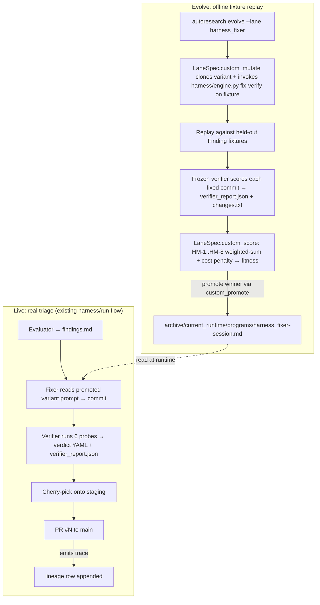
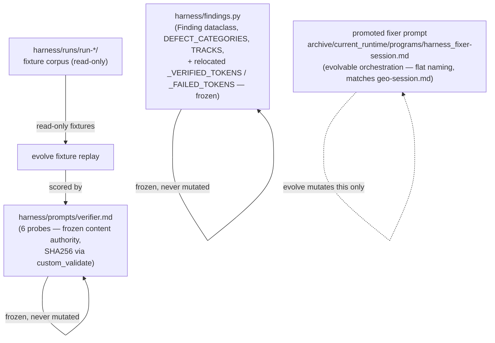

# Harness fixer/verifier + autoresearch fusion — v1 requirements

## Problem Frame

The harness (`harness/engine.py`, `harness/run.py`) is an internal debugging system. Its job: take triaged defects produced by an evaluator agent (`Finding` records — `harness/findings.py:31-67`) and ship verified fixes via a `fix → verify → cherry-pick → tip-smoke` pipeline. Today it ships measurable value (PR #11 / PR #25: 23 verified fixes; per-worker isolation; graceful-stop resume), but every prompt revision in `harness/prompts/fixer.md` is **iterated by JR by hand**: read agent.log, decide a probe missed, edit the prompt, re-run, repeat.

The bet: if the harness fixer agent could **self-improve via autoresearch's evolve loop**, every finding-fix-verify cycle would become training signal for the next fixer variant. The harness already produces structured fixtures as a side effect (one `harness/runs/run-<ts>/` directory per run; 21 extant). Pairing those with a frozen verifier-as-judge gives autoresearch everything its evolve contract needs: a parent variant, a mutation surface, fixtures, a rubric, a fitness signal. Stop hand-tuning the fixer — **let it evolve against its own historical corpus**.

This document tests that hypothesis. Recommendation: **YES — fit, with one explicit constraint** (the verifier MUST be frozen content, not orchestration). The lane_registry refactor shipped 2026-04-28 (HEAD `9549500`) provides the integration substrate: **harness_fixer becomes a divergent LaneSpec with `custom_mutate` + `custom_score` + `custom_validate` callables.** See §1.

## User Flow (operator view)



(Production-trace signal `LJ -. → E5` removed — deferred to v2 per §4. v1 has no `lineage.jsonl` write from `harness/run.py` and no production-trace consumer in autoresearch.)

## Content substrate

The fusion contract is **what is frozen vs what evolves**. Get this wrong and the meta-agent farms the verifier (Goodhart) instead of getting better at fixing real defects.



Two frozen files (verifier.md + findings.py) ARE the harness analog of marketing_audit's 149-lens catalog. The promoted fixer prompt is the analog of `archive/current_runtime/programs/marketing_audit-session.md`. Note: `Verdict.parse` (engine.py) is NOT frozen — it's consumer code; the contract IS the YAML key names declared by verifier.md (per K-1 reject).

---

## 1. DOES IT FIT?

**Recommendation: YES**, with one mandatory constraint, and a fully provisioned integration substrate.

The lane_registry refactor (`autoresearch/lane_registry.py`, 242 LoC, shipped 2026-04-28 HEAD `9549500`) ships **exactly the substrate harness_fixer needs**:

- **`LaneSpec.custom_mutate`** is *explicitly provisioned for harness_fixer* (per `lane-registry.md` field reference: "Used by `harness_fixer` to invoke `harness/engine.py`'s fix-verify loop"). Instead of running the default meta-agent, the harness_fixer lane's `custom_mutate` callable invokes `harness/engine.py`'s existing `fix → verify` sequence against a fixture, captures the resulting `(commit_sha, verdict.yaml, verifier_report.json)` triple, and returns it for scoring. **No new "mutation engine" needed; the existing harness IS the mutation engine.**
- **`LaneSpec.custom_score`** carries the weighted-sum HM-1..HM-8 + cost/latency penalty (§3 + §4). Existing lanes' default geomean-of-LLM-judges aggregator stays untouched.
- **`LaneSpec.custom_validate`** runs the file-bytes manifest check using the **shared utilities `file_hash` / `compute_manifest` / `verify_manifest` already exported from `lane_registry.py`** (lines 224-243). E3 from the prior brainstorm draft (markdown freezing has no implementation) is **resolved** — the freezing primitives ship today.
- **`LaneSpec.custom_promote`** carries the optional pre-promotion smoke-test (K-9). No "brand-new infrastructure" — it's one callable in the LaneSpec, and the registry already wires `custom_promote` into `evolve.cmd_promote`.
- **`LaneSpec.custom_objective_score_from_entry`** stays `None` — harness_fixer's per-lineage selection signal is `domains[harness_fixer].score` (default behavior at `lane_registry.py:default_objective_score_from_entry`).

**The mandatory constraint: the verifier must be frozen.** If the meta-agent could evolve `verifier.md` and `fixer.md` together, it would discover that softer verifier probes let weaker fixer variants pass — Goodhart's law in one cycle. Mechanism: `custom_validate` calls `verify_manifest(harness/.frozen-content-manifest.json, variant_dir)` against the K-1 manifest covering 2 frozen files (`verifier.md` + `findings.py`). Variants whose hash drifts on either file are discarded before scoring.

- **Frozen content authority (per K-1):** 2 whole files — `harness/prompts/verifier.md` (the 6 probes) and `harness/findings.py` (the `Finding` schema at `:31-67`, `DEFECT_CATEGORIES` at `:17-23`, `TRACKS` at `:26`, plus the relocated `_VERIFIED_TOKENS`/`_FAILED_TOKENS` frozensets — moved from `engine.py:103-104` as v0-freeze prerequisite).
- **Evolvable orchestration:** `harness/prompts/fixer.md` only, in v1.

With the constraint enforced via `custom_validate` and the freezing utilities already shipped, the fit is structurally clean. **Without enforcement, the fusion is unsound.**

One asymmetry to note: marketing_audit's evolve loop scores **content the variant writes**. Harness evolve's loop must score **code the variant generates by editing source files in a sandboxed worktree, then run the frozen verifier against a real backend**. That is operationally heavier per fixture: each fixture replay needs a fresh worker worktree (`harness/worktree.py:87-143`), a backend on its own port, and a 30-min agent timeout. Cost: ≈ a single live-run finding's cost (~$0.50-2 in subscription burn) per (variant × fixture) pair. `custom_mutate` IS the integration boundary for this asymmetry.

---

## 2. CONTENT vs ORCHESTRATION BOUNDARY

Apply the same anti-Goodhart logic the marketing_audit plan uses. The boundary IS the mutation space.

**FROZEN content authority (cannot mutate via evolve) — 2 whole files via K-1 manifest:**
- `harness/prompts/verifier.md` — the 6 probes (defect-gone, paraphrase, adjacent, surface-preserved, adversarial-state, symmetric-surface).
- `harness/findings.py` — `Finding` dataclass (`:31-67`), `DEFECT_CATEGORIES` (`:17-23`), `TRACKS` (`:26`), and the relocated `_VERIFIED_TOKENS` + `_FAILED_TOKENS` frozensets (moved from `engine.py:103-104` as v0-freeze prerequisite — see K-1).

Enforcement: `custom_validate` calls `verify_manifest(harness/.frozen-content-manifest.json, variant_dir)` per K-1. Variants whose hash drifts on either file are discarded before scoring. Meta-agent has no write access to harness infrastructure paths via the path_prefixes / `HARNESS_PREFIXES` boundary (Divergence Lock #1).

**NOT frozen (consumer code, not contract):**
- `Verdict.parse` at `engine.py:107-158` — parses verifier YAML output. The contract IS the YAML keys declared in `verifier.md`; the parser is normal infrastructure that legitimately evolves with engine.py improvements (e.g., K-13's new token-capture parser).

**EVOLVABLE orchestration (v1 mutation space):**
- The fixer system prompt (`harness/prompts/fixer.md` → variant copy) — every section: preservation-first framing, "reproduce first" rule, "fix the producer not the consumer" doctrine, "minimal-change rule", scope-allowlist phrasing, "do not manage the stack", "when you are done" stopping condition. **As of K-12 patches (commit `04ae0a9`, 2026-04-29), the prompt also includes an "Anticipate the verifier" section + worktree-hygiene clause + [STABLE]/[EVOLVABLE] section markers** — meta-agent is restricted to mutating only [EVOLVABLE]-prefixed sections.
- (Optional, separate evolution unit) The fixer's allowed-tools whitelist passed to `claude --dangerously-skip-permissions` — wider/narrower toolsets are an orchestration choice.
- (Optional, v2) Retry strategies in `engine._run_agent` — `_RETRY_DELAYS` tuple, `_AGENT_TIMEOUT`, the silent-hang-detection threshold. These are CODE not prompt; mutating them is a step harder than mutating a prompt file. Defer to v2.

**Out of scope (never evolved, never frozen-as-content — just normal code):**
- The orchestrator (`harness/run.py`) — worker pool, cherry-pick logic, lock discipline, leak detection. These are infrastructure.
- The evaluator prompts (`harness/prompts/evaluator-base.md`, `evaluator-track-{a,b,c}.md`) — evaluators produce the FIXTURES; if evaluators evolve, the fixture corpus drifts. Treat as a separate (later) lane: `harness_evaluator`.

This is the cleanest boundary. The fixer is the unit being optimized; the verifier is the rubric; everything else is plumbing.

---

## 3. RUBRIC AXES (HM-1..HM-8)

8 numbered criteria for scoring a fixer variant on fixture replay.

> **Scoring convention.** All gradient axes use the **1/3/5 anchor scale** that `src/evaluation/rubrics.py:4` and `src/evaluation/judges/__init__.py:74-76 normalize_gradient` enforce. Each HM-* axis is registered as a `RubricTemplate` in `src/evaluation/rubrics.py` per §7 site 3. HM-4 is a 4-binary checklist matching `normalize_checklist`. All anchors are **absolute** (not normalized against promoted-variant median — that path was rejected per K-5). Normalized to `[0,1]` via `(score-1)/4` per existing convention so default plateau-detection at `select_parent.py:97` (the inline `pstdev < 0.01` literal — NOT a named attribute) works unchanged.

- **HM-1 Fix correctness (gradient 1/3/5)** — does the verifier emit `verdict: verified`? Scored from `verifier_report.json:verdict` per K-13. 1 = `failed` OR `error`. 3 = `verified` after retry. 5 = `verified` on first attempt.
- **HM-2 Regression prevention (gradient 1/3/5)** — verifier's adjacent probe AND symmetric-surface probe both pass; tip-smoke (`harness/smoke.py`) doesn't fail post-fix. Scored from `verifier_report.json:probes_passed.adjacent` AND `:probes_passed.symmetric_surface`. 1 = either broken. 3 = both pass on retry. 5 = both pass first try.
- **HM-3 Change minimality (gradient 1/3/5)** — scored from `changes.txt` (output of `git diff --stat HEAD~1 HEAD` per fixture). 1 = >300 lines or touches files outside finding's `files` list. 3 = 30-100 lines. 5 = ≤30 lines, all within implicated files.
- **HM-4 Code quality (checklist, 4 binary YES/NO)**, normalized via `normalize_checklist(passed_count, total=4)`:
  1. No new public-API surface unless the finding explicitly required it?
  2. No new comments describing WHAT the code does (only WHY-comments per `CLAUDE.md`)?
  3. No "while I'm here" cleanup edits outside finding scope?
  4. No new tests unless directly required by the fix?
- **HM-5 Verdict coherence (gradient 1/3/5)** — registered as a `RubricTemplate` (`HM-5`) in `src/evaluation/rubrics.py` per §7 site 3 — NOT a separate judge type. Anchors: 1 = commit subject doesn't match `harness: fix <finding.id>@c<n> — <summary>` (`run.py:_commit_fix`) OR diff drifts from `Finding.summary`. 3 = subject matches but diff partial-drift. 5 = subject + diff faithful (LLM paraphrase-match against `Finding.summary`).
- **HM-6 Time-to-fix (gradient 1/3/5, ABSOLUTE)** — wall-clock seconds from prompt-render to verdict-write. Read from `verifier_report.json:wall_clock_s`. Anchors **derived from `_AGENT_TIMEOUT` constant** (currently `engine.py:58 = 1800`) — 1 = `> _AGENT_TIMEOUT` (timeout). 3 = `≤ _AGENT_TIMEOUT/2` (i.e., ≤900s). 5 = `≤ _AGENT_TIMEOUT/6` (i.e., ≤300s). Tied to constant so v2's optional `_AGENT_TIMEOUT` evolution doesn't strand the anchor.
- **HM-7 Cost-per-fix (gradient 1/3/5, ABSOLUTE — no normalization)** — total token usage from `verifier_report.json:tokens_in + tokens_out`. 1 = `tokens_out > 100K`. 3 = `tokens_out ≤ 50K`. 5 = `tokens_out ≤ 20K`. **No "vs current promoted variant" normalization** — that path was rejected (no Generation-1 baseline; double-counted with cost penalty).
- **HM-8 Human-decision-needed rate (gradient 1/3/5)** — over fixture batch, fraction of fixtures where fixer writes `harness/blocked-<finding_id>.md` (real file, written at `run.py:1447`). 1 = >50% blocked. 3 = 15-30% blocked. 5 = ≤5% blocked (calibration target ≈ 5–15%).

**Bernoulli replay aggregation.** Per §4, each fixture is replayed twice. The lane's `custom_score` aggregates: HM-1 = mean of 2 replays' HM-1 scores (1/3/5 → averaged → still in `[1,5]` for `normalize_gradient`); HM-2/HM-6/HM-7 same. K-13 schema unchanged — 2 separate `verifier_report.json` files per fixture, aggregation at score-time inside the lane callable.

8 criteria total. Production prompt prose at GEO-1-comparable depth is /ce:plan unit deliverable.

---

## 4. FITNESS SIGNAL

Marketing_audit's loop closes at T+60d on engagement-conversion; harness's loop closes **per evolve generation** because there's no human-decision lag. The signal IS the verifier's verdict over the held-out fixture suite, weighted by HM-1..HM-8 (locked in K-5).

**Fitness function (final shape — weighted-sum-only, no penalties):**

```
fitness = 0.40 * HM-1_norm
        + 0.20 * HM-2_norm
        + 0.10 * HM-3_norm
        + 0.10 * HM-4_norm
        + 0.10 * HM-5_norm
        + 0.05 * HM-6_norm
        + 0.04 * HM-7_norm
        + 0.01 * HM-8_norm
```

Each `HM-N_norm` is `(score - 1) / 4` from `judges/__init__.py:74-76 normalize_gradient` (or `normalize_checklist` for HM-4). Weights sum to 1.0; codomain is automatically `[0,1]`. **No `cost_penalty_weight` or `latency_penalty_weight`** — rejected per K-5 (HM-7 already encodes cost via absolute anchors; penalties on a normalized cost double-count and require a Generation-1 baseline that doesn't exist).

**Implementation:** lives entirely inside `LaneSpec.custom_score`. Existing lanes' default geomean aggregator at `evaluate_variant.py` is untouched. No new aggregator code in autoresearch substrate.

**Aggregation note.** Existing lanes use **geometric-mean per fixture × geometric-mean across fixtures**. harness_fixer's weighted-sum is opt-in via `custom_score`, not a substrate edit.

**Bernoulli replay.** Each fixture is replayed twice (per §3). HM-1 (and HM-2/HM-6/HM-7) is the **mean of the 2 replays' raw 1/3/5 scores** before normalization. A single failed fixture can be a flake (Vite stale per Bug #18, silent rate-limit hang per Bug #11); 2-replay mean halves single-flake variance. Two `verifier_report.json` files emit per fixture; aggregation at score-time inside the lane callable.

**Production-trace signal — DEFERRED to v2.** The prior draft proposed comparing live-run HM-1 vs evolve-replay HM-1 to detect fixture drift. No mechanism exists today: `harness/run.py` does NOT write to `lineage.jsonl`, no production-trace consumer exists in autoresearch. v1 ships with evolve-replay-only fitness. Live-trace divergence detection is a v2 lane (see Scope Boundaries).

---

## 5. FIXTURES

**24 historical runs on disk, 703 findings, ~380 high-confidence-actionable** after filtering `doc-drift` + `low-confidence`. (Counts re-derived from current `harness/runs/` 2026-04-29; the prior 21/273/110 figures were stale.)

**v1 holdout suite: N=30 fixtures (per K-4) + 5-fixture canary set (per K-9), carved at v0 split.** Coverage requirement: at least 1 fixture per (defect-category × track) cell with material historical data. Cell counts (high-confidence-actionable, current):

| Track / Category | crash | 5xx | console-error | self-inconsistency | dead-reference |
|---|---|---|---|---|---|
| a (CLI) | 16 ✓ | 6 ✓ | — | 108 ✓ | 22 ✓ |
| b (API + autoresearch) | 14 ✓ | 28 ✓ | 1 (drop) | 76 ✓ | 14 ✓ |
| c (Frontend) | — | — | 8 ✓ | 27 ✓ | 32 ✓ |

Every populated cell has ≥6 candidates (most have ≥14). Sampling 30 holdout + 5 canary across populated cells is comfortable. Cells with ≥10 candidates get 4-6 holdout fixtures each. Empty cells stay empty — no fabricated coverage.

≥6 historically-failed-but-actionable findings (verifier emitted `failed reason=...`) included so the rubric scores variants on their failures.

**Canonicalization.** Each fixture is `(Finding YAML, base_sha, golden_outcome)`. `base_sha` is the staging cherry-pick parent SHA captured per K-3. `golden_outcome` is `verified | failed | blocked | error` from the historical `verdicts/<track>/<id>.yaml` (per K-3 Option C: verbatim disk + top-K=5 disagreement re-judge).

**Fixture rotation.** 80% stable across generations, 20% rotated. **Cadence:** deterministic seeded RNG (`random.Random(generation_index)`) selects which 6 fixtures rotate; remaining 24 stay across generations until cell coverage shifts. Overfitting detection: a variant whose HM-1 drops >1.5σ on rotated-in fixtures vs stable fixtures is flagged for operator review.

**Disk footprint:** recent runs are 89-228 MB each. 30 fixtures ≈ **3-5 GB**, NOT 210 MB (prior estimate ~15-20× off). LFS or external archive is **mandatory**, not optional. Storage path: /ce:plan deliverable.

**Excluded runs:** `run-20260422-224908` (Bug #11/#17 contamination, `engine.py:118-122` + `:480-501`) — `tainted: true` at run level per K-3 schema. Downstream consumers MUST filter on tainted before sampling.

---

## 6. LIVE WRAPPER vs EVOLVE WRAPPER

Both wrappers run the same lane program (the fixer prompt loaded from the promoted variant). `LaneSpec.custom_mutate` IS the evolve wrapper — no separate wrapper module. `evolve.cmd_run` calls `spec.custom_mutate(rendered_path, meta_variant_dir, config, log_file=...)` and the harness lane (its fixture loop INSIDE the callable) returns scoreable artifacts.

| Wrapper | Entry point | Adds around the lane program |
|---|---|---|
| **Live** | `python -m harness --engine claude` (current) | Real evaluator → real findings → cherry-pick onto staging → real PR. Verdicts ship code to main. **Will emit `verifier_report.json` + `changes.txt` per finding** once §Dependencies items 2-3 ship (currently emits neither — these are required new infrastructure). |
| **Evolve** | `autoresearch evolve --lane harness_fixer --iterations N` | `custom_mutate` (fixture loop inside) calls `harness/engine.py`'s fix + verify per fixture → emits `verifier_report.json` + `changes.txt` per fixture → `custom_score` runs HM-1..HM-8 weighted sum (no penalties — see K-5) → `custom_promote` runs K-9 K=2 canary. Never touches main. Never opens PRs. |

The artifact-emission contract **will be shared** between live and evolve once both sides emit. Today only evolve will emit; live emission is §Dependencies items 2-3 (post-verify hook in `engine.py:verify` + per-finding `git diff --stat` capture).

Differences vs marketing_audit's wrapper contract:

- **No "human gate" in live.** Marketing_audit has Gate 1, Gate 2, payment gate. Harness's gating is implicit: PR review by JR before merge.
- **No payment ledger.** Subscription billing applies but no per-customer revenue attribution.
- **Downstream consumer = a PR review + merge**, not a paying prospect.
- **No `evolve_lock` mutex in v1.** No `state.evolve_lock` exists in the codebase today (zero hits). Operator runs evolve while no live `harness/run` is active — by policy, not by primitive. v1 ships without a mutex; building one is v2 if concurrent operation becomes routine. (See Scope Boundaries.)
- **No deliverable polish axis.** HM-3 + HM-4 cover analogous ground.

---

## 7. INTEGRATION SITES

**Lane_registry collapsed the prior 13-site dance to 5 sites.** Cross-checked against shipped `lane_registry.py` (242 LoC) + `lane-registry.md` field reference + Known Divergence Points #1, #2, #4.

1. **`autoresearch/lane_registry.py:LANES`** — add one `LaneSpec` entry for `harness_fixer`:
   ```python
   "harness_fixer": LaneSpec(
       name="harness_fixer",
       is_workflow_lane=True,
       rubric_ids=_rubric_ids("HM"),
       path_prefixes=(
           "harness/prompts/fixer.md",
           "programs/harness_fixer-session.md",
           "templates/harness_fixer",
           "workflows/harness_fixer.py",
           "workflows/session_eval_harness_fixer.py",
       ),
       session_md_filename="harness_fixer-session.md",
       deliverables=("*/verifier_report.json", "*/changes.txt"),
       intermediate_artifacts=("verdicts/*.yaml", "fix-diffs/*.diff"),
       structural_doc_facts=(
           "At least one `verifier_report.json` is present per fixture under `<finding_id>/`.",
           "Every `verifier_report.json` parses as valid JSON and contains all required keys: `finding_id`, `verdict`, `probes_passed`, `reason`, `wall_clock_s`, `tokens_in`, `tokens_out`, `commit_sha`, `base_sha`.",
           "Every `verifier_report.json:verdict` is one of `verified`, `failed`, `blocked`, `error` (the K-13 enum).",
           "At least one `changes.txt` is present per fixture and is non-empty.",
           "`verdicts/manifest.json` exists at the run root, parses as valid JSON, and has top-level keys `run_id`, `manifest_format_version`, `tainted`, `evaluator_pin`, `findings`.",
       ),
       structural_gate_functions=(
           "_validate_harness_fixer.verifier_report_present",
           "_validate_harness_fixer.verifier_report_schema_valid",
           "_validate_harness_fixer.verdict_enum_valid",
           "_validate_harness_fixer.changes_txt_non_empty",
           "_validate_harness_fixer.manifest_json_valid",
       ),
       custom_mutate=harness_fixer_mutate,
       custom_score=harness_fixer_score,
       custom_validate=harness_fixer_validate,
       custom_promote=harness_fixer_promote,
   ),
   ```
   `deliverables` uses `*/` per-finding-subdir globs (NOT root-level literals — the lane writes one report per fixture under a per-finding subdir). `intermediate_artifacts` covers mid-run artifacts that exist when fix-verify aborts mid-fixture. `structural_*` bullets/gates are 5-each (count parity per `tests/autoresearch/test_structural_doc_facts.py`); gate function bodies live in a new `_validate_harness_fixer` namespace in `src/evaluation/structural.py` (~50 LoC). No collision with sibling lanes' `path_prefixes` (verified against `lane_registry.py:51-128`).

2. **`autoresearch/harness_fixer_lane.py`** (new file, ~250-400 LoC). Defines 4 callables. **Live signature shapes (verified against `evolve.py`):**
   - `custom_mutate(rendered_path, meta_variant_dir, config, log_file=...)` — fixture loop INSIDE this callable (NOT per-fixture as earlier brainstorm pseudocode suggested). For each fixture: cache check, create worktree, restart backend, render Finding, call `engine.fix`, call `engine.verify`, parse Verdict, record HM measurements, kill backend. Returns int (meta exit code).
   - `custom_validate(variant_dir, parent)` — calls `verify_manifest(harness/.frozen-content-manifest.json, variant_dir)`. ~5 LoC.
   - `custom_score(config, str(variant_dir), parent_id)` — HM-1..HM-8 weighted sum (no penalties — see K-5). Reads per-finding `verifier_report.json` + `changes.txt`. Reuses `judges/__init__.py:74-90 normalize_gradient` + `normalize_checklist` + `geometric_mean`. ~50 LoC.
   - `custom_promote(archive_dir, variant_id, config.lane)` — K-9 K=2 canary, both-must-pass. ~30-50 LoC.

   **Hidden plumbing (caught during feasibility audit):** `worktree.create_workers` requires `Path.cwd() == main_repo` (see `worktree.py:97`). Lane callable runs with cwd = variant dir. Either explicit chdir inside `custom_mutate`, OR refactor `worktree.create_workers` to accept `main_repo` parameter. /ce:plan budgets this as a separate plumbing unit.

3. **`src/evaluation/rubrics.py`** — add 8 HM-* `RubricTemplate` entries. Cascade: bump `assert len(RUBRICS) == 32` at `:1001`, the docstring "32-criteria" at `:1`, the derived assertion at `:1014-1016` (`assert sum(len(spec.rubric_ids) for spec in _LANE_SPECS.values()) == len(RUBRICS)`), and the cost-comment math in `src/evaluation/judges/sonnet_agent.py:17-18` ("≈ 64 calls ≈ $0.32" → "≈ 80 calls ≈ $0.40"). The lane_registry's `_DOMAIN_CRITERIA` derived dict picks them up automatically — no `service.py` edit needed.
4. **`src/evaluation/models.py:160`** — extend the hardcoded `Literal["geo", "competitive", "monitoring", "storyboard"]` to include `"harness_fixer"`. Manual sync per lane-registry plan; runtime assertion `_assert_models_literal_matches()` (`lane_registry.py:202-214`) catches drift.
5. **`autoresearch/lane_paths.py:47 HARNESS_PREFIXES`** — granularize per Divergence Lock #1. Single constant edit. (Line corrected: actual is `:47`, prior brainstorm cited `:42`.)

**That's 5 sites, including 1 new file.** The prior draft's 13 sites are now derived constants — `WORKFLOW_PREFIXES`, `DELIVERABLES`, `_INTERMEDIATE_ARTIFACTS`, `DOMAIN_FILENAMES`, `STRUCTURAL_DOC_FACTS`, `STRUCTURAL_GATE_FUNCTIONS`, `_DOMAIN_CRITERIA`, `ALL_LANES`, `WORKFLOW_LANES` are all generated from `LANES` via `lane_registry.py:225-243`. Touching them is forbidden by the refactor — they get rewritten as derived re-exports.

### Divergence Locks (per JR's instruction — Known Divergence Points to pick one option each)

**Divergence Lock #1 — `HARNESS_PREFIXES` carve-out (DP #4 in lane-registry-plan).**
JR explicitly assigned this. Pick **option (b): granularize `HARNESS_PREFIXES`**.

Reasoning: option (a) requires a new LaneSpec field (`excluded_path_overrides`), which violates JR's instruction "Do not propose new LaneSpec fields unless you can justify a 6th divergence axis." Option (c) (move harness files outside `harness/` prefix) is a cosmetic upheaval to the live harness for no semantic gain. Option (b) is a one-line constant edit that makes the boundary semantically explicit (infrastructure vs. lane-evolvable assets).

Concrete change at `lane_paths.py:42`:
```python
# Was: HARNESS_PREFIXES = ("harness",)
# Becomes:
HARNESS_PREFIXES = (
    "harness/engine.py", "harness/run.py", "harness/sessions.py",
    "harness/worktree.py", "harness/safety.py", "harness/config.py",
    "harness/findings.py", "harness/preflight.py", "harness/review.py",
    "harness/smoke.py", "harness/cli.py", "harness/__init__.py",
    "harness/__main__.py", "harness/runs/", "harness/INVENTORY.md",
    "harness/README.md", "harness/SEED.md", "harness/SMOKE.md",
    "harness/prompts/verifier.md", "harness/prompts/evaluator-base.md",
    "harness/prompts/evaluator-track-a.md", "harness/prompts/evaluator-track-b.md",
    "harness/prompts/evaluator-track-c.md",
)
# harness/prompts/fixer.md is NOT excluded — it's owned by the harness_fixer lane
# via path_prefixes in its LaneSpec.
```

The existing 4 lanes don't claim any `harness/*` paths, so granularization changes nothing for them. `harness_fixer` claims `harness/prompts/fixer.md` via its LaneSpec path_prefixes.

**Divergence Lock #2 — `plateau_threshold` (DP #1 in lane-registry-plan).**
Pick **option (c): score normalization brings to `[0,1]`** so default plateau_threshold doesn't need lane-awareness.

Reasoning: HM-1..HM-8 are 1/3/5 anchors that `judges/__init__.py:74-76 normalize_gradient` already maps to `[0,1]` via `(score - 1) / 4`. The HM weighted-sum aggregator in `custom_score` keeps its output in `[0,1]` (weights sum to 1; cost/latency penalties are bounded subtractions clamped at 0). No new LaneSpec field; existing `select_parent.plateau_threshold = 0.01` works unchanged.

**Divergence Lock #3 — Snapshot-at-clone for `verifier.md` (DP #2 in lane-registry-plan).**
Pick **option (c): `custom_validate` re-runs `verify_manifest` on every validate** against the K-1 committed manifest. No separate clone-time snapshot needed.

Reasoning: `verifier.md` and `findings.py` should NEVER change between clone and validate — they're frozen content. The expected hashes live in a v0-freeze-time-committed `harness/.frozen-content-manifest.json` (per K-1), not in per-clone snapshots. Option (a) (`custom_clone`) requires a 6th LaneSpec callable. Option (b) (`file_bytes_manifest_paths`) requires a 10th LaneSpec data field. Option (c) is simplest:

```python
# autoresearch/harness_fixer_lane.py
from pathlib import Path
from autoresearch.lane_registry import verify_manifest

FROZEN_MANIFEST_REL = Path("harness/.frozen-content-manifest.json")

def harness_fixer_validate(variant_dir: Path, parent: str | None) -> bool:
    passed, failures = verify_manifest(variant_dir / FROZEN_MANIFEST_REL, variant_dir)
    return passed
```

No new LaneSpec field; uses the shipped `verify_manifest` utility directly. The manifest covers the 2 K-1 frozen files (`harness/prompts/verifier.md` + `harness/findings.py`) plus the K-10 `autoresearch_evaluator_pin` entries, all in one JSON.

**Divergence Lock #4 — `structural.py:38-46` if/if/if dispatch (KDP #3 in lane-registry-plan, locked 2026-04-29).**
Pick **option (b): data-driven dispatch via `STRUCTURAL_GATE_FUNCTIONS`** (the dict already derived at `lane_registry.py:172`).

Reasoning: option (a) ("each new lane adds a 1-line if branch") accumulates one hardcoded lane-name per added lane. Adding harness_fixer + queued marketing_audit via 2 hand-edits in one quarter is exactly the multi-site dispatch shape the lane_registry refactor was built to eliminate. Option (b) closes the last vestige.

Concrete refactor at `src/evaluation/structural.py:38-46` — replaces 9 LoC of if/if/if with ~14 LoC of dispatch table builder + thin dispatcher. Net **+5 LoC**, NOT the +30 originally estimated. Async asymmetry (`_validate_monitoring` is async; others are sync) handled by a 2-line `_sync_to_async` adapter.

```python
# Replacement at structural.py:38-46
_DISPATCH: dict[str, Callable[..., Awaitable[StructuralResult]]] | None = None

def _build_dispatch():
    async def _sync_to_async(fn, outputs):
        return fn(outputs)
    return {
        "geo":         lambda o: _sync_to_async(_validate_geo, o),
        "competitive": lambda o: _sync_to_async(_validate_competitive, o),
        "storyboard":  lambda o: _sync_to_async(_validate_storyboard, o),
        "monitoring":  _validate_monitoring,
        "harness_fixer": lambda o: _sync_to_async(_validate_harness_fixer, o),
    }

async def structural_gate(domain: str, outputs: dict[str, str]) -> StructuralResult:
    global _DISPATCH
    if _DISPATCH is None:
        _DISPATCH = _build_dispatch()
    validator = _DISPATCH.get(domain)
    if validator is None:
        return StructuralResult(passed=False, failures=[f"Unknown domain: {domain}"])
    return await validator(outputs)
```

**Circular-import sidestep:** dispatch table is local to `structural.py` — functions defined in the module dispatch to themselves. `STRUCTURAL_GATE_FUNCTIONS` (`lane_registry.py:172`) holds STRINGS, not callables, so consumers reading the registry don't trigger callable resolution at module-load. /ce:plan should NOT try to convert registry strings to callables at module-load time.

**Scope:** /ce:plan-side work, not a lane bring-up dependency. The lane can ship without this refactor (option a's 1-line edit suffices interim). Locking the SHAPE here removes ambiguity.

---

## 8. WHAT WOULD BREAK

Honest accounting of what JR loses (or could lose) by switching from manual iteration to evolve-loop variant rotation.

**Risks worth naming:**

- **Loss of fast manual override.** Today JR can edit `harness/prompts/fixer.md` and re-run a single finding inside ~5 minutes. Under fusion, the fixer prompt is in `archive/current_runtime/programs/harness_fixer-session.md`. **Mitigation:** `--prompts-dir` CLI flag in `harness/cli.py` mirroring autoresearch's `ARCHIVE_DIR` env-var pattern. ~13 LoC reusing path-resolution shape from `autoresearch/lane_runtime.py:resolve_runtime_dir()`.
- **Evolve loop worse than manual when n is small.** First 3 generations have no good signal. Manual iteration may produce better fixers than evolve for the first month. **Mitigation:** treat first 3 generations as bring-up; don't promote unless HM-1 ≥ current head's HM-1 + 2σ noise.
- **Verifier-Goodhart risk if the boundary slips.** **Mitigation:** `custom_validate` calls `verify_manifest` against the K-1 manifest (2 frozen files: `verifier.md` + `findings.py`). Variants with hash drift are discarded before scoring.
- **Fixture staleness / production drift.** As the codebase evolves, fixtures' `base_sha` ages out. **Mitigation:** 80/20 fixture rotation (§5, deterministic seeded RNG) + the K-3 `verdicts/manifest.json` capture so `base_sha` isn't lost. (Production-trace divergence alarm is v2 — see Scope Boundaries.)
- **Verifier-as-judge dual-write surface.** `verifier_report.json` is a NEW artifact alongside the existing `verdict.yaml`. **Mitigation:** `_run_agent` writes a `telemetry.json` sidecar; `engine.py:verify` reads it and combines with the parsed `Verdict` to emit one `verifier_report.json`. Verifier subprocess still writes only `verdict.yaml`. One LLM-side write contract.
- **Rate-limit thundering herd.** An evolve generation × 30 fixtures × 3 candidates ≈ 90 fixer runs ≈ 2× a live run. **Mitigation:** operator policy — run evolve while no live `harness/run` is active (no `evolve_lock` mutex in v1; see §6).
- **Catastrophic regression on promotion.** A new variant could be subtly worse on production-distribution findings even if it scores better on the holdout. **Mitigation:** K-9 K=2 canary smoke gate.

**When evolve is worse than manual:** when (a) the fixture corpus is too small to discriminate variants, (b) JR's intended prompt change is a single targeted instruction (manual is faster), or (c) production distribution has shifted enough that fixtures don't reflect it. JR retains authority to skip evolve and ship a hand-edited prompt via `--prompts-dir`.

---

## 9. ALTERNATIVES CONSIDERED

- **Alt 1: Stay manual.** $0 build, full operator control. Loses compounding-quality. Evidence against: PR #25's 23-verified + 10-rolled-back rate shows manual leaves headroom. Don't pick unless K-12 (v0 prior weakness) blocks.
- **Alt 2: Harness-internal A/B framework.** ~1-2 weeks. Reinvents lineage/frontier/prescription-critic. Wasted work now that lane_registry exists.
- **Alt 3: Full autoresearch lane (recommended).** ~2-3 weeks of new code (lane_registry made this CHEAPER than the prior 13-site estimate): 1 LaneSpec entry + 1 callables module + harness-side `verifier_report.json` + `changes.txt` + `verdicts/manifest.json` capture hooks + 8 rubric prompts + Literal sync + HARNESS_PREFIXES granularization. **Verdict: recommended.**
- **Alt 4: Subset — only fixer prompt evolves, evaluator stays frozen.** This IS the v1 scope. Defer harness_evaluator lane to v2.
- **Alt 5: Multi-axis evolve — prompt + model + tool whitelist together.** Defer to v2. v1 evolves prompt only; model selection locked at Opus 4.7 per JR's standing preference.

---

## 10. KEY DECISIONS — ALL LOCKED OR REJECTED 2026-04-29

13 Key Decisions. K-7 + K-8 collapsed by lane_registry; K-12 SHIPPED 2026-04-29 as commit `04ae0a9`. All other K-* are LOCKED. Plus Divergence Lock #4 (KDP #3) at §7 locks the structural-dispatch shape. Ready for /ce:plan.

- **K-1 [LOCKED 2026-04-29, REVISED 2026-04-29] Frozen-content list.** Two whole files frozen; engine.py freeze REJECTED (whole-file SHA256 conflicts with K-13's token-parser addition to engine.py); token sets relocated to findings.py as v0-freeze prerequisite.
  **Frozen (2 whole files):**
  - `harness/prompts/verifier.md` — the 6 probes.
  - `harness/findings.py` — `Finding` schema, `DEFECT_CATEGORIES`, `TRACKS`, plus the relocated `_VERIFIED_TOKENS` + `_FAILED_TOKENS` frozensets.
  **Rejected — engine.py freeze (Verdict schema, token sets at their old engine.py:103-104 home):** `compute_manifest` is whole-file granularity. Freezing engine.py blocks ANY legitimate engine.py edit — including K-13's new token-capture parser, which lives in `_run_agent` inside engine.py. Verdict is consumer code (parses verifier YAML); the contract is `verifier.md` (the prompt that names the YAML keys). Once `verifier.md` is frozen, the YAML keys are stable and `Verdict.parse` has no Goodhart surface. NO engine.py freeze.
  **Rejected — `harness/safety.py` leak-detection regex:** lives in the orchestrator (`run.py`), not in the fixer's prompt-readable contract. Meta-agent cannot bypass it by mutating `fixer.md`. NO.
  **Rejected — evaluator prompts:** §2 already declared evaluators out-of-scope for v1 (deferred to `harness_evaluator` v2 lane). NO.
  **Pre-v0-freeze prerequisite (~5 LoC refactor):** move `_VERIFIED_TOKENS` and `_FAILED_TOKENS` frozenset definitions from `harness/engine.py:103-104` to `harness/findings.py` (where they semantically belong — they're verdict-token sets paired with the verdict-emitting prompt's contract). Add `from harness.findings import _VERIFIED_TOKENS, _FAILED_TOKENS` at engine.py top. Single small refactor before v0-freeze; NOT a /ce:plan unit.
  **Mechanism:** v0-freeze emits committed `harness/.frozen-content-manifest.json` via `compute_manifest([Path("harness/prompts/verifier.md"), Path("harness/findings.py")], repo_root)`; `custom_validate` calls `verify_manifest(manifest_path, variant_dir)` on every validate (see Divergence Lock #3 in §7 for the implementation). Two-file whole-file SHA256, no section-granularity gymnastics. Manifest also carries the K-10 `autoresearch_evaluator_pin` entries — one manifest, one `verify_manifest` call.
- **K-2 [LOCKED 2026-04-29] Mutation-space scope for v1.** Evolve mutates ONLY `harness/prompts/fixer.md`, restricted to `[EVOLVABLE]`-marked sections per K-12 (commit `04ae0a9`). Anything else is frozen, code, or deferred to v2.

  **Enforcement:** `custom_mutate` post-processes the meta-agent's diff. Any hunk whose pre-image touches a `[STABLE]`-marked block rejects the mutation; the variant is discarded and the generation continues. Section-marker boundary check (parsing), not behavioral regex (per "trust the agent — drop regex guards" feedback).

  **v2 deferrals (not partial-implementations):** allowed-tools whitelist (`--allowedTools` set), retry strategies (`_RETRY_DELAYS`, `_AGENT_TIMEOUT`, silent-hang threshold), model selection (locked at Opus 4.7 high-thinking), evaluator prompts (separate `harness_evaluator` lane).

  **Dependencies:** K-12 markers already shipped; no other dependency.
- **K-3 [LOCKED 2026-04-29] Fixture canonicalization + post-run manifest.**

  **(a) `golden_outcome` source — Option C (hybrid).** v1 reads disk verbatim. Run a "judge re-pass" against each fixture, compute pairwise disagreement vs the historical verdict, flag the top K=5 highest-disagreement fixtures for JR re-judge. Option A inherits Bugs #11/#17/#18 verifier flakes; Option B costs ~2.5 hrs of JR's time before any fitness signal exists; Option C ships v1 fast and surgically scrubs only the worst flakes. JR picks the K=5 after the disagreement pass.

  **(b) `verdicts/manifest.json` — schema + production path.** Brainstorm's "parse `harness.log`" path is wrong shape: `RunState.commits` (`run.py:60-83`) already holds commit data in memory. **Production path:** add `base_sha: str = ""` AND `verified: bool | None = None` fields to `review.CommitRecord` (`review.py:11-19`); cache `verified` from `engine.Verdict.verified` at `_verify_one` (`run.py:818`); populate `base_sha` at `_commit_fix` (`run.py:1739-1742`) from staging-cherry-pick-parent SHA (NOT worker `pre_sha` — the latter is the worker-branch HEAD pre-fix, which differs from staging tip in multi-worker mode); emit JSON at the existing `_write_outputs` site (`run.py:1766-1779`). Resume path needs `_reconstruct_commit_record` (`run.py:1292`) updated for both new fields. ~25 LoC, NOT ~15. NOT log-grep. (§Dependencies item 4's "from harness.log" wording is stale; reconciled below.)

  **Schema:**
  ```json
  {
    "run_id": "run-20260424-131621",
    "tainted": false,
    "manifest_format_version": "1",
    "evaluator_pin": "<git_sha of autoresearch evaluator at v0 freeze>",
    "findings": {
      "F-a-2-3": {
        "track": "a",
        "base_sha": "abc12345",
        "commit_sha": "def67890",
        "verdict_status": "verified|failed|blocked|error"
      }
    }
  }
  ```

  `evaluator_pin` is the K-10 pin label; per-run capture lets fixture replays distinguish variant-driven HM-1 drift from evaluator-driven drift across generations.

  **Edge cases:**
  - `--fixers-only` resumes: each run emits its own manifest. Cross-run correlation by `finding_id` is the consumer's job (autoresearch fixture loader), not the emitter's.
  - Silent rate-limit hangs / verdict-YAML parse failures: `verdict_status: "error"`, no `commit_sha`.
  - Blocked findings: `verdict_status: "blocked"`, no `commit_sha`. `harness/blocked-<id>.md` is the human note.
  - Legacy `run-20260422-224908` (Bug #17 / #11 contamination): `tainted: true` at run level. Emitter checks `run_id` against a hardcoded legacy list; downstream consumers may exclude tainted runs from holdout.
- **K-4 [LOCKED 2026-04-29] Holdout size + coverage matrix.** N=30 fixtures + 5-fixture canary set (K-9) carved at v0 split. Coverage matrix re-derived 2026-04-29 against current corpus (24 runs / 703 findings / 380 high-confidence-actionable, NOT the stale 21/273/110 in pre-revision §5). ≥6 historically-failed-but-actionable findings included. ~3-5 GB to LFS-mandatory archive. Tainted runs excluded.

  **Sampling rule:** every populated cell gets ≥1 fixture; cells with ≥10 candidates get 4-6 fixtures. Empty cells (CLI console-error, API console-error, Frontend crash, Frontend 5xx) stay empty — no fabricated coverage.

  **Excluded run:** `run-20260422-224908` (Bug #11/#17 contamination). Per K-3, `tainted: true` at run level; downstream consumers MUST filter on tainted before sampling.

  **Disk footprint (corrected):** recent runs are 89-228 MB each. 30 fixtures ≈ **3-5 GB**, NOT 210 MB. LFS or external archive is **mandatory**, not optional.

  **Dependencies:** K-3 (`base_sha` capture for replay determinism) + corrected §5 corpus accounting.

- **K-5 [LOCKED 2026-04-29] HM-1..HM-8 weights for first 3 generations.** Sums to 1.0; **no penalty terms** (cost/latency penalties REJECTED — HM-7 was double-counted vs §3 absolute thresholds, and §4's "clamp at 0" claim was text-only with no expression). Sunset clause: re-tune required after Generation 3 calibration.

  | Axis | Weight | Reasoning |
  |---|---|---|
  | HM-1 fix-correctness | **0.40** | Highest. Fix-correctness is the load-bearing axis; a cheap minimal beautiful unverified variant is worse than a costly verified one. |
  | HM-2 regression-prevention | **0.20** | Adjacent + symmetric probes catch the failure modes behind the PR #25 rollbacks. |
  | HM-3 minimality | **0.10** | Code-quality proxy. Material but capped. |
  | HM-4 code-quality (4-binary) | **0.10** | Maps to `CLAUDE.md` invariants. Not load-bearing. |
  | HM-5 verdict-coherence | **0.10** | Catches "fixer lies in commit message" — rare but high-value to detect. |
  | HM-6 time-to-fix | **0.05** | Tie-break only. Capped because timeouts already penalize via HM-1=1. |
  | HM-7 cost-per-fix | **0.04** | Subscription billing means token cost is bounded per cycle. |
  | HM-8 human-decision-rate | **0.01** | Calibration target ≈ 5–15%; higher weight would discourage legitimate blocks. |

  **Penalty rejection rationale:** HM-7 already encodes cost via 1/3/5 absolute anchors (1=>100K out tokens; 5=≤20K). Adding `cost_penalty_weight` on a normalized cost double-counts and (per Subagent 1) introduces normalization-vs-promoted-median dependency that has no Generation-1 baseline. Drop both `cost_penalty_weight` and `latency_penalty_weight` from the formula. §4's formula collapses to weighted-sum-only; `[0,1]` codomain is automatic since weights sum to 1.

  **Sunset clause:** these weights are LOCKED for Generations 1-3 only. Generation 4 onward requires explicit re-tune using the actual cross-fixture variance data. Non-negotiable.

  **Carve-out:** §"Deferred to Planning" item "HM-1..HM-8 production prompt prose" still applies — anchor descriptions at GEO-1-comparable depth are /ce:plan unit deliverable. Weights are locked here; prose is implementation.

  **Dependencies:** K-13 schema (HM-1/HM-2/HM-6/HM-7 input source) + K-3 manifest (HM-3 `changes.txt` provenance).
- **K-6 [Derivable from code] Lane name.** `harness_fixer` (recommended).
- **K-7 [RESOLVED by lane_registry] HM-rubric host.** `src/evaluation/rubrics.py` — registered automatically via LaneSpec.rubric_ids; the prior trade-off (fork to harness/rubrics.py) is moot.
- **K-8 [Locked by lane_registry] Prompt loader path.** Flat naming `archive/current_runtime/programs/harness_fixer-session.md` per shipped convention.
- **K-9 [LOCKED 2026-04-29] Pre-promotion smoke gate.** Offline canary via `custom_promote(variant_dir)` callable on K=2 fixtures from a 5-fixture canary set held back at v0 corpus split. Pass criterion: HM-1 ≥ 3 on both canaries (i.e., `verified` after retry or first attempt). Failure: variant rejected; previous promoted variant stays current; logged to `archive/promote-rejections-<YYYYMMDD>.md`.

  **Why K=2, not K=1:** single-canary makes the gate flake-vulnerable per the §4 noise discussion (Bug #11/#17/#18 flakes). K=2 with both-must-pass cuts flake false-rejection roughly in half.

  **Canary set provenance (5 fixtures held back at v0 split):** when K-4's 30-fixture holdout is sampled, an adjacent 5-fixture canary set is sampled FIRST from the populated cells (biased toward cells with the largest pools so canary doesn't starve K-4 coverage), then K-4's 30 sampled from the remainder. Persisted to `harness/fixtures/holdout-v1.json` and `harness/fixtures/canary-v1.json` so subsequent generations sample the same sets.

  **Replay policy on canary:** each canary fixture replayed twice (matching §4's Bernoulli policy on holdout). HM-1 = better-of-two for the gate (testing "can the variant ship a verified fix here," not "is the variant noise-free" — that's the holdout's job).

  **Dependencies:** K-4 (canary carve happens at the same procedural step), K-13 (HM-1 source).

- **K-10 [LOCKED 2026-04-29] Pin autoresearch evaluator at fusion ship.** Pin lives **inside** `harness/.frozen-content-manifest.json` (same K-1 manifest, no parallel one). Cross-lane consensus advancement.

  **Pin format:**
  ```json
  {
    "manifest_format_version": "1",
    "frozen_at": "<v0-freeze ISO timestamp>",
    "autoresearch_evaluator_pin": {
      "git_sha": "<7-or-40-char autoresearch SHA>",
      "label": "autoresearch-stable-YYYYMMDD",
      "files": {
        "src/evaluation/judges/__init__.py": "<sha256>",
        "src/evaluation/rubrics.py": "<sha256>",
        "src/evaluation/structural.py": "<sha256>",
        "src/evaluation/service.py": "<sha256>"
      }
    },
    "harness_fixer_frozen_content": {
      "harness/prompts/verifier.md": "<sha256>",
      "harness/findings.py": "<sha256>"
    }
  }
  ```

  **Advancement (consensus-gated, NOT unilateral):** the pin advances ONLY when BOTH harness_fixer AND marketing_audit lanes validate against the candidate evaluator. Each lane's promote gate (K-9 here; marketing_audit's R20 equivalent) MUST pass. Either lane's failure blocks the advance for both. On dual-pass: both lanes' manifests update in a single atomic operation.

  **Why consensus-gated, not two pins:** both lanes import the same `src/evaluation/judges/*` + `RubricTemplate` registry; two pins would either require maintaining compatible forks or have the lanes scoring on divergent rubrics. Cost of consensus-gating IS the cost of evaluator-stability — paid for explicitly.

  **Mechanism:** `harness_fixer_validate` calls `verify_manifest(harness/.frozen-content-manifest.json, repo_root)` once. Autoresearch-pin entries and frozen-content entries share the manifest because they share the freezing mechanism.

  **Dependencies:** K-1 manifest (this lock co-locates).
- **K-11 [LOCKED 2026-04-29] Order of operations vs marketing_audit fusion. Pick: serial — harness_fixer first.**

  **Tested against three scenarios:**
  1. *Marketing_audit reveals a LaneSpec gap.* The substrate is locked: no 6th callable, no 10th data field. If marketing_audit reveals a missing primitive, that's a hard-stop for **both** lanes — not a "harness_fixer should wait" signal. Cannot defer harness_fixer for a constraint that, if it materializes, blocks both equally.
  2. *Parallel ship.* `LANES: dict[str, LaneSpec]` accepts additive entries; consumers receive both via the 7 derived re-exports. No mechanical conflict. Parallel IS viable — but doubles concurrent registry-debugging cost during bring-up.
  3. *Cross-lane dependencies.* Both lanes need `_INNER_PHASE_TAGS` allowlist extension (lane-registry-plan DP #6) — each is a 1-line addition; not a shared blocker. No other shared infrastructure.

  **Pick: serial-harness-first.** Smaller scope (1 lane, internal-only, no customer surface) + exercises 4-of-5 callables (`custom_mutate` / `_score` / `_validate` / `_promote`) — all of marketing_audit's callable integration points get real flight time before customer-facing rollout. Lessons feed marketing_audit's plan. Ordering cost ~1 week of serial dependency, paid back by lower integration-debug cost.
- **K-12 [SHIPPED 2026-04-29 as commit `04ae0a9`] v0 prior strength.** Patches P1 (Anticipate-the-verifier section), P2 (worktree-hygiene clause), P5 ([STABLE]/[EVOLVABLE] section markers) applied to `harness/prompts/fixer.md`. The 4-of-6 verifier-probe gap is closed; worktree-hygiene rollback class is named; meta-agent mutation surface is restricted to [EVOLVABLE] sections. v0 is now strong enough to freeze as the lane's seed variant.
- **K-13 [LOCKED 2026-04-29] `verifier_report.json` schema.**

  **Final schema:**
  ```json
  {
    "finding_id": "str",
    "verdict": "verified|failed|blocked|error",
    "probes_passed": {
      "defect_gone": "bool",
      "paraphrase": "bool",
      "adjacent": "bool",
      "surface_preserved": "bool",
      "adversarial_state": "bool",
      "symmetric_surface": "bool"
    },
    "reason": "str",
    "wall_clock_s": "float",
    "tokens_in": "int",
    "tokens_out": "int",
    "commit_sha": "str",
    "base_sha": "str"
  }
  ```

  **Decisions:**
  - *`probes_passed` → `dict[str, bool]`.* By-name beats by-position: HM-2 scores "adjacent + symmetric both pass" — by-name keys are more legible; adding/removing probes later doesn't break consumers; size cost (6 keys vs 6 ints) is irrelevant.
  - *Added `commit_sha` and `base_sha`.* Brainstorm omitted both; HM-3's `changes.txt` computation needs `commit_sha`, fixture-replay determinism needs `base_sha`. Per-finding storage avoids re-joining against `verdicts/manifest.json` on every score call.
  - *Added `error` to verdict enum.* Covers silent rate-limit hangs (`engine.py:485-501` Bug #11), malformed verdict YAML (Bug #17), `_AGENT_TIMEOUT` exceedance. Report stays emittable on these paths so post-hoc analysis works; `error` scores HM-1=1 (worst).
  - *Token telemetry is genuinely new code, not a "5-line hook".* `harness/_run_agent` does NOT capture `tokens_in`/`tokens_out` today (zero hits across the codebase for `usage`/`tokens_in`/`ResultMessage`). New parser is **read-backward-from-EOF until the first `{"type":"result"` JSON line** (NOT 32KB tail-read like `parse_rate_limit` — verifier logs can be MBs). Returns a `TokenUsage` dataclass with `input_tokens`, `output_tokens`, `cache_read_input_tokens`, `cache_creation_input_tokens`, `total_cost_usd`, `duration_ms` from the result event. ~30-50 LoC genuinely new in `_run_agent`.
  - *Emission site:* JSON sidecar write at `verify_dir/telemetry.json` from `_run_agent` exit; `engine.py:verify` reads it and combines with `Verdict` to produce the final `verifier_report.json`. Sidecar pattern avoids changing `_run_agent` return signature.
  - *Codex caveat:* Codex engine doesn't emit stream-json; the parser silently returns `None` for codex. harness_fixer is claude-only de facto.

---

## Success Criteria

V1 ships successfully if and only if: across **3 consecutive evolve generations**, the promoted fixer variant's HM-1 (fix-correctness) on a fresh **10-fixture** canary set is **≥ baseline + 2σ** (where baseline = `harness/prompts/fixer.md` post-K-12-patches at commit `04ae0a9`), AND HM-3 (minimality) does not regress, AND verifier-detected adversarial-state (probe 4) defects do not regress.

(N=10 + 2σ corrected from earlier 5/1σ. With Bernoulli HM-1 replays of 2 each, total trial count = 20 per axis; for p=0.7, σ ≈ √(p(1-p)/n) ≈ 0.10 over `[0,1]`, so 2σ = 0.20 is a discriminating gate. Earlier 1σ over 5 fixtures was statistically too loose given documented Bug #11/#17/#18 flakes.)

**Kill switch (written, not operator-judgment).** If after 3 generations no variant beats baseline by 2σ AND HM-1 mean-of-three is ≤ baseline, kill the experiment: revert to manual `--prompts-dir` operation; document in `archive/harness-fixer-v1-kill-<date>.md`.

## Scope Boundaries

**Explicitly not in v1:**
- Evolving the evaluator prompt. Defer to harness_evaluator v2.
- Evolving the verifier prompt. Frozen content authority — never evolved.
- Evolving model selection or `--allowedTools`. Prompt only.
- Evolving retry strategies / orchestrator code (`_RETRY_DELAYS`, `_AGENT_TIMEOUT`, silent-hang threshold). Prompt only.
- Freezing `harness/engine.py`. Engine is consumer code; whole-file SHA256 freeze conflicts with K-13 token-parser addition. Verifier YAML key contract is declared by `verifier.md`, not by `Verdict.parse`.
- `evolve_lock` mutex primitive. Operator runs evolve while no live `harness/run` is active — by policy, not by primitive. Build the mutex in v2 if concurrent operation becomes routine.
- Production-trace fitness signal (live HM-1 vs evolve-replay HM-1 drift detection). No `lineage.jsonl` write from `harness/run.py` and no consumer in autoresearch. v2.
- HM-6 / HM-7 normalization-vs-promoted-variant-median. No median storage exists; Generation 1 has no baseline. v1 uses absolute 1/3/5 anchors.
- `cost_penalty_weight` / `latency_penalty_weight` in the fitness formula. Double-counted with HM-6/HM-7 absolute anchors. v2 only if a separate calibration signal demands it.
- Auto-promoting variants without operator review.
- Customer-facing claims about self-improving fix quality. Internal tooling; no marketing.
- Cross-lane mutation (e.g. evolving fixer + evaluator together).
- Adding new LaneSpec fields. The 9 data fields + 5 callables suffice; all four Divergence Locks above were chosen specifically to avoid 6th-callable / 10th-data-field expansion.

## Dependencies / Assumptions

**Required NEW infrastructure (5 items + 1 prerequisite, with realistic LoC):**

0. **(Pre-v0-freeze prerequisite, ~5 LoC)** Move `_VERIFIED_TOKENS` + `_FAILED_TOKENS` frozenset definitions from `harness/engine.py:103-104` to `harness/findings.py`. Add `from harness.findings import _VERIFIED_TOKENS, _FAILED_TOKENS` at engine.py top. Per K-1 — enables 2-file whole-file freeze without engine.py conflict.
1. **`autoresearch/harness_fixer_lane.py`** (new file, **~250-400 LoC** — heavier than prior estimate due to fixture-loop + worktree plumbing). Defines 4 callables matching live signatures from `evolve.py` (NOT per-fixture pseudocode):
   - `custom_mutate(rendered_path, meta_variant_dir, config, log_file=...)` — fixture loop INSIDE
   - `custom_validate(variant_dir, parent)` — ~5 LoC, calls `verify_manifest`
   - `custom_score(config, str(variant_dir), parent_id)` — ~50 LoC, weighted sum (no penalties)
   - `custom_promote(archive_dir, variant_id, config.lane)` — ~30-50 LoC, K=2 canary
   Plus plumbing for `worktree.create_workers`'s `cwd == main_repo` assumption (chdir or refactor to accept `main_repo` param) — separate plumbing unit.
2. **`verifier_report.json` artifact emission** from `harness/engine.py:verify`. Read backward from EOF in stream-json log (NOT 32KB tail) to extract `result.usage` event. JSON sidecar via `_run_agent` writing `telemetry.json`; `verify` reads and combines with `Verdict`. **~30-50 LoC genuinely new** in `_run_agent` + `verify` + new `TokenUsage` dataclass.
3. **`changes.txt` artifact emission** per fixture (`git diff --stat HEAD~1 HEAD`). Extends existing `_capture_patch` (`harness/run.py:1660-1673`, which already runs `git diff HEAD --no-color`) with a parallel `--stat` write. **~3-5 LoC.**
4. **`verdicts/manifest.json` post-run hook** in `harness/run.py`. From in-memory `RunState.commits` (NOT log-grep). Add `base_sha: str = ""` + `verified: bool | None = None` fields to `review.CommitRecord` (`review.py:11-19`); cache `verified` from `Verdict.verified` at `_verify_one` (`run.py:818`); populate `base_sha` from staging-cherry-pick parent at `_commit_fix` (`run.py:1739-1742`); emit JSON at `_write_outputs` (`run.py:1766-1779`); update `_reconstruct_commit_record` (`run.py:1292`) for resume path. **~25 LoC.**
5. **`--prompts-dir` CLI override** in `harness/cli.py` + `harness/prompts.py` (`_PROMPTS_DIR` reads `HARNESS_PROMPTS_DIR` env var with module-relative fallback). Mirror autoresearch's `ARCHIVE_DIR` pattern. **~13 LoC.**

**Total v1 net new LoC: ~330-500.**

**RESOLVED by lane_registry refactor (vs prior draft's "required new infra"):**

- ~~`_file_hash(path)` extension to `critique_manifest.py`~~ → Shipped as `lane_registry.file_hash`/`compute_manifest`/`verify_manifest`.
- ~~`HARNESS_PREFIXES` carve-out~~ → Locked as Divergence Lock #1, single constant edit.
- ~~Weighted-sum aggregator in `evaluate_variant.py`~~ → Lives inside `custom_score`, no substrate edit.
- ~~Pre-promotion smoke-test infrastructure~~ → `custom_promote` callable, substrate-supported.

**v0-prior prerequisite (RESOLVED):**

- ~~`harness/prompts/fixer.md` audit patches P1+P2+P5~~ → SHIPPED 2026-04-29 as commit `04ae0a9`.

**Existing assumptions:**

- `autoresearch evolve` machinery (post-lane-registry HEAD `9549500`+) ships with 5 lanes; harness_fixer slots in via 1 LaneSpec entry.
- Subscription rate-limit budget: a full evolve generation consumes ≤50% of a Claude subscription 5h window. Operator runs evolve while no live `harness/run` is active (no `evolve_lock` mutex in v1 — see Scope Boundaries).
- Marketing_audit fusion: see K-11. Both lanes are additive to the registry — no conflict.
- Existing primitives reused: `autoresearch/runtime_bootstrap.py`, `autoresearch/evaluate_variant.py` (reads `custom_score` from LaneSpec), `autoresearch/frontier.py` (reads `custom_objective_score_from_entry`), `lane_registry.py` (manifest utilities), `harness/sessions.py`, `harness/worktree.py:create_workers`.

## Outstanding Questions

### Resolved 2026-04-29 (locked or rejected — no remaining brainstorm-stage decisions)

**Locked:** K-1 (revised), K-2, K-3, K-4, K-5, K-9, K-10, K-11, K-13. See §10. Plus Divergence Lock #4 (KDP #3 → option b data-driven dispatch). See §7.

**Rejected from v1 (see Scope Boundaries for full list):** engine.py whole-file freeze; `evolve_lock` primitive; production-trace fitness signal; HM-6/HM-7 normalization-vs-promoted-median; cost/latency penalty weights.

**Locked anchors for previously-deferred items:**
- HM-1 first-attempt vs retry: 5 = first-attempt verified; 3 = verified after retry (per K-13 enum + §3).
- HM-7 cost normalization: rejected; absolute 1/3/5 anchors via `tokens_out` (§3).
- Fixture rotation cadence: deterministic seeded RNG via `random.Random(generation_index)`, 80/20 split (§5).
- Cross-lane `evolve_lock`: moot (no `evolve_lock` in v1).
- `RUBRICS == 32 → 40` cascade enumeration: §7 site 3 lists 4 cascade sites (`rubrics.py:1`, `:1001`, `:1014-1016`, `judges/sonnet_agent.py:17-18`).

### Genuinely /ce:plan-deliverable (implementation, not decision)

- **HM-1..HM-8 production prompt prose at GEO-1-comparable depth.** Anchor descriptions are implementation work. Weights locked in K-5; prose is a /ce:plan unit.

## Stale-reference scrub

Per JR's instruction, the prior draft's references to old constants are removed. The following are NOW DERIVED from `LANES` in `autoresearch/lane_registry.py:225-243` and must NOT be edited directly when adding harness_fixer:

- `ALL_LANES` (was at `evolve.py:44`) → derived from `LANES`
- `WORKFLOW_PREFIXES` (was at `lane_paths.py`) → derived
- `DELIVERABLES` (was at `evaluate_variant.py`) → derived
- `_INTERMEDIATE_ARTIFACTS` (was at `evaluate_variant.py`) → derived
- `DOMAIN_FILENAMES` (was at `regen_program_docs.py`) → derived
- `STRUCTURAL_DOC_FACTS` (was at `structural.py:405`) → derived
- `STRUCTURAL_GATE_FUNCTIONS` (was at `structural.py:444`) → derived
- `_DOMAIN_CRITERIA` (was at `service.py:36-41`) → derived

Touching any of them in the harness_fixer plan is wrong. They get the new lane automatically once the LaneSpec is registered.

## Next Steps

→ `/ce:plan` for structured implementation planning. Reads:
- This brainstorm
- `autoresearch/lane_registry.py` (the live contract — 242 LoC)
- `docs/plans/2026-04-27-002-feat-autoresearch-lane-registry-plan.md` (Known Divergence Points reference)
- `docs/architecture/lane-registry.md` (LaneSpec field reference)

**All K-decisions LOCKED or REJECTED 2026-04-29. 4 Divergence Locks. No remaining brainstorm-stage decisions. Ready for /ce:plan.**
