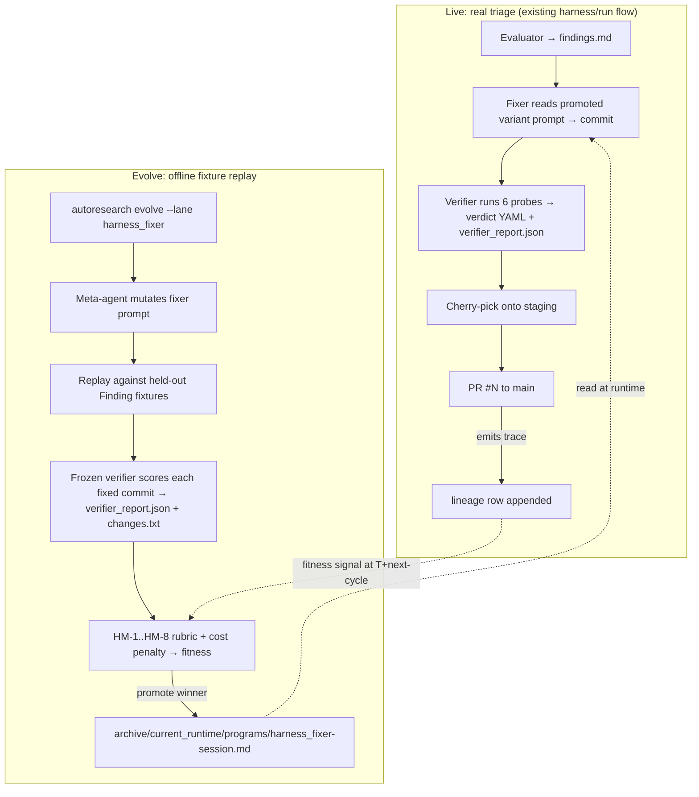

# Harness fixer/verifier + autoresearch fusion — v1 requirements

## Problem Frame

The harness (`harness/engine.py`, `harness/run.py`) is an internal debugging system. Its job: take triaged defects produced by an evaluator agent (`Finding` records — `harness/findings.py:31-67`) and ship verified fixes via a `fix → verify → cherry-pick → tip-smoke` pipeline. Today it ships measurable value (PR #11 / PR #25: 23 verified fixes; per-worker isolation; graceful-stop resume), but every prompt revision in `harness/prompts/fixer.md` is **iterated by JR by hand**: read agent.log, decide a probe missed, edit the prompt, re-run, repeat.

The bet: if the harness fixer agent could **self-improve via autoresearch's evolve loop**, every finding-fix-verify cycle would become training signal for the next fixer variant. The harness already produces structured fixtures as a side effect (one `harness/runs/run-<ts>/` directory per run; 21 extant). Pairing those with a frozen verifier-as-judge gives autoresearch everything its evolve contract needs: a parent variant, a mutation space, fixtures, a rubric, a fitness signal. Stop hand-tuning the fixer — **let it evolve against its own historical corpus**.

This document tests that hypothesis. Recommendation: **YES — fit, with one explicit constraint** (the verifier MUST be frozen content, not orchestration) and **a non-trivial new-infrastructure surface** (see §"Dependencies / Assumptions"). See §1.

## User Flow (operator view)



## Content substrate

The fusion contract is **what is frozen vs what evolves**. Get this wrong and the meta-agent farms the verifier (Goodhart) instead of getting better at fixing real defects.


The five frozen items above ARE the analog of marketing_audit's 149-lens catalog. The promoted fixer prompt is the analog of `archive/current_runtime/programs/marketing_audit/`.

---

## 1. DOES IT FIT?

**Recommendation: YES**, with one mandatory constraint and one non-trivial new-infra surface.

The autoresearch lane contract (`autoresearch/lane_paths.py:36`, `autoresearch/lane_runtime.py:147-152`) is: a lane owns a path-prefix subtree under `archive/<variant_id>/programs/`, evolve mutates files there, `lane_runtime.ensure_materialized_runtime` syncs the promoted variant into `archive/current_runtime/`, downstream consumers read from there. **Marketing_audit fits because its workflow consumes a content+prompt bundle and produces a markdown/PDF artifact that gets scored.** Harness fits the same way:

- **Variant-production surface = the fixer prompt.** Today `harness/prompts/fixer.md` is a single 89-line file. Externalize it under `archive/current_runtime/programs/harness_fixer-session.md` (flat naming — every existing lane uses `programs/<lane>-session.md`, NOT `programs/<lane>/prompts/<file>.md`); have `harness/engine.py:render_fixer` load from there at runtime. That is the entire shape change on the live side. (The runtime path injection is itself a small new piece of code — see §7 site 11.)
- **Workflow output = `(commit_sha, verdict_yaml, verifier_report.json)` triple per finding.** The first two exist today; `verifier_report.json` is **new infrastructure** the harness must emit so the autoresearch evaluator (which scores artifacts, not runtime gates) has something to read. See §"Dependencies / Assumptions".
- **Fixture = a Finding record + a known-good outcome from a past run.** The harness has 273 historical findings on disk across 21 runs (~110 high-confidence-actionable after filtering doc-drift / low-confidence); see §5.

**The mandatory constraint: the verifier must be frozen.** If the meta-agent could evolve `verifier.md` and `fixer.md` together, it would discover that softer verifier probes let weaker fixer variants pass — Goodhart's law in one cycle. The marketing_audit plan handles this by freezing the catalog and the SubSignal/ParentFinding Pydantic schemas (see fusion plan R12 + R28). The exact analogue for harness:

- **Frozen content authority:** `verifier.md` (the 6 probes), the `Finding` schema (`harness/findings.py:31-67`), the `Verdict` schema (`harness/engine.py:103-153`), and the bug-type taxonomy (`DEFECT_CATEGORIES` at `harness/findings.py:17-23`).
- **Evolvable orchestration:** `fixer.md` only, in v1.

> **Freezing-mechanism caveat (E3).** `autoresearch/critique_manifest.py:39-85` uses `inspect.getsource()` to hash Python module symbols — the existing `FROZEN_SYMBOLS` tuple at line 30 is Python-only. **There is no mechanism to SHA256-lock a markdown file like `verifier.md` today.** v1 must add a `_file_hash(path)` function (or wrap `verifier.md` as a Python string constant in a new `harness/_frozen.py` and add it to `FROZEN_SYMBOLS`). Either path is small (~30-50 LOC); neither exists. This is a v1 prerequisite, not a "use existing pattern" claim.

With both the constraint and the freezing-mechanism extension, the fit is structurally the same as marketing_audit. **Without them, the fusion is unsound.**

One asymmetry to note: marketing_audit's evolve loop scores **content the variant writes**. Harness evolve's loop must score **code the variant generates by editing source files in a sandboxed worktree, then run the frozen verifier against a real backend**. That is operationally heavier per fixture: each fixture replay needs a fresh worker worktree (`harness/worktree.py:87-143`), a backend on its own port, and a 30-min agent timeout. Cost: ≈ a single live-run finding's cost (~$0.50-2 in subscription burn) per (variant × fixture) pair. Plan accordingly.

---

## 2. CONTENT vs ORCHESTRATION BOUNDARY

Apply the same anti-Goodhart logic the marketing_audit plan uses (R28). The boundary IS the mutation space.

**FROZEN content authority (cannot mutate via evolve):**
- `harness/prompts/verifier.md` — the 6 probes (defect-gone, paraphrase, adjacent, surface-preserved, adversarial-state, symmetric-surface). *Note: SHA256-locking this requires the `_file_hash(path)` extension to `critique_manifest.py` — see §1 caveat.*
- The `Finding` Pydantic-equivalent dataclass at `harness/findings.py:31-67` (id, track, category, confidence, summary, evidence, reproduction, files).
- The `Verdict` schema at `harness/engine.py:103-153` (verified, reason, adjacent_checked, surface_changes_detected).
- The defect taxonomy at `harness/findings.py:17-23` (`crash`, `5xx`, `console-error`, `self-inconsistency`, `dead-reference` + `doc-drift`, `low-confidence`).
- The track partition at `harness/findings.py:26` (a/b/c = CLI/API/Frontend).
- The `_VERIFIED_TOKENS` / `_FAILED_TOKENS` set at `harness/engine.py:98-99` (otherwise meta-agent could mint new pass-tokens).

**EVOLVABLE orchestration (v1 mutation space):**
- The fixer system prompt — every section: preservation-first framing, "reproduce first" rule, "fix the producer not the consumer" doctrine, "minimal-change rule", scope-allowlist phrasing, "do not manage the stack", "when you are done" stopping condition.
- (Optional, separate evolution unit) The fixer's allowed-tools whitelist passed to `claude --dangerously-skip-permissions` — wider/narrower toolsets are an orchestration choice.
- (Optional, v2) Retry strategies in `engine._run_agent` — `_RETRY_DELAYS` tuple, `_AGENT_TIMEOUT`, the silent-hang-detection threshold. These are CODE not prompt; mutating them is a step harder than mutating a prompt file. Defer to v2.

**Out of scope (never evolved, never frozen-as-content — just normal code):**
- The orchestrator (`harness/run.py`) — worker pool, cherry-pick logic, lock discipline, leak detection. These are infrastructure.
- The evaluator prompts (`harness/prompts/evaluator-base.md`, `evaluator-track-{a,b,c}.md`) — evaluators produce the FIXTURES; if evaluators evolve, the fixture corpus drifts. Treat as a separate (later) lane: `harness_evaluator`.

This is the cleanest boundary. The fixer is the unit being optimized; the verifier is the rubric; everything else is plumbing.

---

## 3. RUBRIC AXES (HM-1..HM-8)

8 numbered criteria for scoring a fixer variant on fixture replay.

> **Scoring convention (E2).** All gradient axes use the **1/3/5 anchor scale** that `src/evaluation/rubrics.py:3-4` and `src/evaluation/judges/__init__.py:74-76 normalize_gradient` enforce — NOT 0–5. Existing rubrics (GEO-1, MON-2, etc.) ship 15-25-line anchor-rich prompts; the sketches below name the anchors but defer the production prose to /ce:plan. HM-4 is a 4-binary checklist matching `normalize_checklist` (`__init__.py:79-81`).

- **HM-1 Fix correctness (gradient 1/3/5)** — does the verifier emit `verdict: verified`? **Scored from a `verifier_report.json` artifact emitted by the harness fixture replay** (NEW INFRA — see §"Dependencies"; the autoresearch evaluator scores artifacts, not runtime gates). 1 = report missing OR `verdict: failed/error`. 3 = `verdict: verified` after retry. 5 = `verdict: verified` on first attempt. (Highest weighted axis.)
- **HM-2 Regression prevention (gradient 1/3/5)** — verifier's adjacent probe (probe 3) AND symmetric-surface probe (probe 6) both pass? Tip-smoke (`harness/smoke.py`) doesn't fail post-fix? Scored from `verifier_report.json:probes_passed`. 1 = adjacent OR symmetric broken. 3 = both probes pass on retry. 5 = both pass first try.
- **HM-3 Change minimality (gradient 1/3/5)** — **scored from a `changes.txt` artifact** (output of `git diff --stat HEAD~1 HEAD` emitted by the fixture replay; NEW INFRA — existing rubrics are text-only, no code-aware machinery exists today). 1 = >300 lines or touches files outside finding's `files` list. 3 = 30-100 lines. 5 = ≤30 lines, all within implicated files. (Anti-feature-bloat — the `fixer.md` "minimal-change rule" exists for a reason.)
- **HM-4 Code quality (checklist, 4 binary YES/NO)**:
  1. No new public-API surface (no new exported symbols, no schema fields, no CLI flags) unless the finding explicitly required it?
  2. No new comments that describe WHAT the code does (only WHY-comments, per `CLAUDE.md` `# Doing tasks` instructions)?
  3. No "while I'm here" cleanup edits outside the finding's scope?
  4. No new tests written unless directly required by the fix (per `fixer.md` `tests/**` rule)?
- **HM-5 Verdict coherence (gradient 1/3/5)** — does the fixer's commit message subject match `harness: fix <finding.id>@c<n> — <summary>` (`harness/run.py` `_commit_fix`), and does the diff actually address the `summary` of the Finding (LLM-judged paraphrase match)? 1 = commit subject lies. 3 = subject matches but diff drift. 5 = subject + diff faithful.
- **HM-6 Time-to-fix (gradient 1/3/5, normalized)** — wall-clock seconds from prompt-render to verdict-write. Read from `verifier_report.json:wall_clock_s`. 1 = >1800s (timeout). 3 = ≤900s. 5 = ≤300s. Normalized against current promoted variant's median.
- **HM-7 Cost-per-fix (gradient 1/3/5, normalized)** — total `claude -p` token usage per fixture, read from `verifier_report.json:tokens_in + tokens_out`. 1 = >100K output tokens. 3 = ≤50K. 5 = ≤20K. Same anti-Goodhart logic as marketing_audit R17 cost discipline (a 5/5 variant at 50% cost beats 5/5 at 100%).
- **HM-8 Human-decision-needed rate (gradient 1/3/5)** — over fixture batch, what fraction of fixtures end with the fixer writing `harness/blocked-<finding_id>.md` (the "I can't fix this without a product call" signal in `fixer.md`)? 1 = >50% blocked. 3 = 15-30% blocked. 5 = ≤5% blocked (calibration target ≈ 5–15% — high blocked-rate means timid fixer; near-zero may mean overconfident).

8 criteria total, mirroring MA-1..MA-8's structure. Critique manifest SHA256-frozen at ship time per `autoresearch/critique_manifest.py:30-36`. **Production prompt prose deferred to /ce:plan** — sketches above are anchor-only.

---

## 4. FITNESS SIGNAL

Marketing_audit's loop closes at T+60d on engagement-conversion (R19 in fusion plan); harness's loop can close **per evolve generation** because there's no human-decision lag. The signal IS the verifier's verdict over the held-out fixture suite, weighted by HM-1..HM-8 and the rubric/cost composite from R27 of the fusion plan.

**Fitness function shape (no final weights — that's plan-stage):**

```
fitness = w_correct * HM-1
        + w_regress * HM-2
        + w_min     * HM-3
        + w_quality * HM-4
        + w_coh     * HM-5
        + w_time    * HM-6 / latency_norm
        + w_cost    * HM-7 / token_norm
        + w_block   * HM-8
        - cost_penalty_weight    * normalized_token_cost
        - latency_penalty_weight * normalized_wall_clock
```

Same shape as fusion plan R27. HM-1 carries the highest weight in v1; HM-8 carries the lowest until calibrated.

> **Aggregation note.** Existing lanes (GEO/CI/MON/SB) use **geometric-mean per fixture × geometric-mean across fixtures** (per `geo-session.md` lines 8-9 + `evaluate_variant.py`). This brainstorm's weighted-sum-with-penalties is **NEW aggregation logic** to add to `evaluate_variant.py`, not code reuse from the existing lanes. Confirmed during 2026-04-26 audit.

There is no T+lag engagement signal — replace it with a **production-trace signal**: at each evolve generation, also pull the last K live runs' verdicts and score the promoted variant against them. If the promoted variant's live HM-1 drops vs evolve-replay HM-1 by >0.5, that's a sign the fixture corpus is drifting from the live distribution and a fixture refresh is needed.

The signal is faster than marketing_audit's (no T+60d wait), but **noisier**: a single failed fixture can be a flake (Vite stale per Bug #18, silent rate-limit hang per Bug #11). Replay each fixture at least twice; treat HM-1 as a Bernoulli mean over replays.

---

## 5. FIXTURES

**Marketing_audit defers fixtures (fusion plan §"Outstanding Questions") because customer audits don't yet exist; harness has the opposite problem — too many candidate fixtures.** As of 2026-04-26 (audit-confirmed): **21 historical runs on disk, 273 findings, ~110 high-confidence-actionable** after filtering `doc-drift` (30) + `low-confidence` (19).

**v1 holdout suite proposal: ~30 fixtures, ~6 per axis.** Coverage requirement: at least 1 fixture per (defect-category × track) cell that has historical data. Audit-confirmed cell counts (high-confidence-actionable):

| Track / Category | crash | 5xx | console-error | self-inconsistency | dead-reference |
|---|---|---|---|---|---|
| a (CLI) | 10 ✓ | 6 ✓ | — | 53 ✓ | 19 ✓ |
| b (API + autoresearch) | 8 ✓ | 24 ✓ | — | 34 ✓ | 10 ✓ |
| c (Frontend) | — | — | 8 ✓ | 24 ✓ | 28 ✓ |

Every cell with history has ≥6 candidates — sampling 30 fixtures across the populated cells is comfortable. Add 5–6 historically-failed-but-actionable findings (verifier emitted `failed reason=...`) so the rubric scores variants on their failures, not just successes. Total ≈ 30 fixtures.

**Canonicalization is the open question.** A fixture can't just be "the past Finding YAML" — replay needs the **pre-fix codebase state** too. Proposal: each fixture is `(Finding YAML, base_sha, golden_outcome)` where `base_sha` is the commit the historical evaluator ran against, and `golden_outcome` is `verified | failed | blocked` from the historical verdict file.

> **base_sha capture gap (audit finding).** The harness records commit SHAs in `harness.log` ("verify phase: <id> (commit <sha[:8]>)") but **NOT in verdict YAMLs or `sessions.json`**. Reconstruction from disk alone is not reliable. v1 prerequisite: emit `verdicts/manifest.json` post-run mapping `{finding_id → {base_sha, commit_sha, verdict_status}}` by parsing `harness.log`. ~2-3 hours of new code in `harness/run.py`. Without this, fixtures cannot be replayed deterministically.

Replay = checkout `base_sha`, render fixer prompt with the historical Finding, run fixer on a worker worktree, run frozen verifier, compare `(verdict, golden_outcome)`.

**Fixture rotation.** Same anti-overfit discipline as autoresearch's existing holdout: 80% of fixtures stable across generations, 20% rotated each generation to detect overfitting. Rotated-out fixtures move to a `legacy/` partition for offline regression testing.

**Disk footprint:** 30 fixtures ≈ 210MB of run-dir snapshots. Commit to a separate fixture archive (or LFS); do not bloat main repo.

**Excluded runs:** `run-20260422-224908` is referenced in `engine.py:117` (Bug #17 YAML retry) and `:485-501` (silent rate-limit hang Bug #11) — its verdicts are partly flake-tainted. Mark legacy; prefer `run-20260424-131621`+ for the v1 holdout.

---

## 6. LIVE WRAPPER vs EVOLVE WRAPPER

Same shape as fusion plan §Architecture. Both wrappers run the same lane program (the fixer prompt loaded from promoted variant); they differ in what they add around it.

| Wrapper | Entry point | Adds around the lane program |
|---|---|---|
| **Live** | `python -m harness --engine claude` (current) | Real evaluator → real findings → cherry-pick onto staging → real PR. Verdicts ship code to main. **Also emits `verifier_report.json` + `changes.txt` per finding** (NEW INFRA) for evolve-loop consumption. |
| **Evolve** | `autoresearch evolve --lane harness_fixer --iterations N` | Variant mutation → replay against the 30-fixture holdout → frozen verifier scores each fixed commit → emits same `verifier_report.json` + `changes.txt` artifacts → HM-1..HM-8 rubric + cost penalty → promote winner. Never touches main. Never opens PRs. |

Note that the artifact-emission contract is **shared** between live and evolve — the same JSON/text shape on both sides — so every live run feeds the next evolve generation's "production-trace" signal (§4). One emission path, two consumers.

Differences vs marketing_audit's wrapper contract:

- **No "human gate" in live.** Marketing_audit has Gate 1 (intake review), Gate 2 (deliverable review), payment gate. Harness's gating is implicit: PR review by JR before merge. The PR-review verdict IS the human gate; treat it as the live signal that flows back to evolve as a "production trace" supplement (§4).
- **No payment ledger.** Skip R4 of fusion plan. Subscription billing applies but there's no per-customer revenue attribution.
- **Downstream consumer = a PR review + merge**, not a paying prospect. The fitness loop closes when JR (or a future ce-review agent) reviews the staging branch.
- **`evolve_lock` works the same** as marketing_audit R16. A fixture-replay evolve must not race with a live `harness/run` (both want claude subscription rate-limit budget; both might write to overlapping worker ports).
- **No deliverable polish axis.** Marketing_audit's MA-6 doesn't apply — there's no "consultant memo prose quality" to score. HM-3 (minimality) and HM-4 (code quality) cover the analogous ground.
- **Pre-promotion smoke-test is brand-new infrastructure.** No existing lane does this; promotion is currently instant (`set_current_head` + manifest write at `lane_runtime.py:223-228`). The proposed K-9 smoke gate is novel — implement once, share with marketing_audit if it ships first.

---

## 7. INTEGRATION SITES

Don't write the actual edits — just enumerate. Cross-checked against `grep -l 'WORKFLOW_LANES\|geo.*competitive.*monitoring' autoresearch/`. **Audit raised the count from 11 to 13** — the brainstorm originally missed `models.py` + `service.py`.

1. **`autoresearch/lane_paths.py:36`** — extend `LANES` tuple. **Also: carve harness_fixer-owned paths out of `HARNESS_PREFIXES = ("harness",)` exclusion at line 42** — without this, harness_fixer can't own any files. The shim forwards to `src/shared/safety/tier_b`; that's where the source-of-truth lives.
2. **`autoresearch/lane_runtime.py:12`** — extend the local `LANES = (...)` constant.
3. **`autoresearch/evolve.py:50`** — extend `ALL_LANES = (...)` tuple.
4. **`autoresearch/program_prescription_critic.py`** — add lane-specific prescription rules.
5. **`autoresearch/frontier.py:15`** — change `DOMAINS = (...)` from 4 to 5 elements. (Pareto-frontier registration.)
6. **`autoresearch/evaluate_variant.py`** — register the HM-1..HM-8 scorer alongside GEO/CI/MON/SB. **Plus add the weighted-sum aggregator** (§4 note — geometric-mean machinery doesn't apply).
7. **`autoresearch/report_base.py`** — register lane-specific report templates.
8. **`autoresearch/test_lane_ownership.py`** — add ownership tests for the new path prefix.
9. **`src/evaluation/rubrics.py:949`** — add HM-1..HM-8 to the `RUBRICS` registry; bump `assert len(RUBRICS) == 32` at line 1001 to `== 40`. Also bump `SessionCritiqueRequest.criteria max_length=32` at `models.py:179` to 40.
10. **`autoresearch/archive/current_runtime/programs/`** — create `harness_fixer-session.md` (flat naming — matches `geo-session.md`/`monitoring-session.md`) seeded with the v0 fixer prompt (see K-12 — patches required first).
11. **`harness/engine.py`** + **`harness/prompts.py`** — `render_fixer` loads from `archive/current_runtime/programs/harness_fixer-session.md`. Add `--prompts-dir` CLI override (default to `harness/prompts/` for backwards compat in non-fusion runs); pass through from `python -m harness`. Live wrapper points at materialized runtime; evolve wrapper points at variant directory during replay.
12. **`src/evaluation/models.py:160`** — extend `EvaluateRequest.domain` `Literal["geo", "competitive", "monitoring", "storyboard"]` to include `"harness_fixer"`. *(Audit-discovered missing site.)*
13. **`src/evaluation/service.py:36-41`** — register `"harness_fixer": [f"HM-{i}" for i in range(1, 9)]` in `_DOMAIN_CRITERIA`. *(Audit-discovered missing site.)*

That's 13 sites.

---

## 8. WHAT WOULD BREAK

Honest accounting of what JR loses (or could lose) by switching from manual iteration to evolve-loop variant rotation. JR's stated motivation ("an agent that fixes itself") is the hypothesis, not the conclusion.

**Risks worth naming:**

- **Loss of fast manual override.** Today JR can edit `harness/prompts/fixer.md` and re-run a single finding to see the effect inside ~5 minutes (one fixer + one verifier ≈ 10 min wall-clock). Under fusion, the fixer prompt is in `archive/current_runtime/programs/`; ad-hoc tuning means either (a) hand-editing the promoted variant (which evolve will overwrite next promotion) or (b) running an evolve generation (~30 fixtures × ~5 min each ≈ 2.5 hours wall-clock at parallelism=3). **Mitigation:** the `--prompts-dir` flag on the live runner (§7 site 11) bypasses the promoted variant for emergency hand-tuning.
- **Evolve loop worse than manual when n is small.** First 3 generations have no good signal — the fixture corpus is small, the variants are guesses, the rubric weights aren't calibrated. Manual iteration may produce better fixers than evolve for the first month. **Mitigation:** treat first 3 generations as instrumentation bring-up; don't promote a variant unless HM-1 ≥ current head's HM-1 + 2σ noise.
- **Verifier-Goodhart risk if the boundary slips.** If anyone ever evolves the verifier alongside the fixer (even by accident), the loop becomes "fixer learns to satisfy whatever verifier says yes to" — exactly the failure mode marketing_audit's content/orchestration split exists to prevent. **Mitigation:** SHA256-freeze `verifier.md` via the `_file_hash(path)` extension to `critique_manifest.py` (§"Dependencies"). Layer 1 validation rejects variants whose bundled manifest disagrees.
- **Fixture staleness / production drift.** The 30-fixture holdout reflects 2026-04 codebase reality. As the codebase evolves, fixtures' `base_sha` ages out (refs may be GC'd, files may be renamed). HM-1 on stale fixtures stops correlating with HM-1 on live findings. **Mitigation:** treat fixture rotation (§5, 20% per generation) as a hard schedule, and add a "live-trace divergence" alarm in §4. Fix the `verdicts/manifest.json` capture gap (§5) so `base_sha` isn't lost.
- **Verifier-as-judge dual-write surface.** Today the verifier is a runtime gate that emits `verdict.yaml` for the orchestrator. Adding `verifier_report.json` as a separate artifact for autoresearch creates two write paths. **Mitigation:** emit ONLY `verdict.yaml` from the verifier subprocess (existing behavior); have a small post-verify hook in `harness/engine.py:verify` translate to `verifier_report.json` from the verdict YAML + telemetry already at hand. Don't add a second LLM-side write contract.
- **Rate-limit thundering herd.** Live runs already burn 22M tokens / 5h-window for a 4-cycle 3-track run (per harness architecture memo). An evolve generation × 30 fixtures × 3 candidates ≈ 90 fixer runs ≈ 2× a live run. **Mitigation:** hard-enforce evolve_lock (no concurrent live + evolve), and run evolve overnight. Same as marketing_audit R16.
- **Catastrophic regression on promotion.** A new variant could be subtly worse on production-distribution findings even if it scores better on the holdout. **Mitigation:** pre-promotion smoke (§6 — note: brand-new infra) + canary live run (run new variant on 1 actionable finding live, gate promotion on verifier success).

**When evolve is worse than manual:** when (a) the fixture corpus is too small to discriminate variants, (b) the prompt change JR has in mind is a single targeted instruction rather than a structural rewrite (manual is faster), or (c) the production distribution has shifted enough that fixtures don't reflect it yet. JR should retain authority to skip evolve and ship a hand-edited prompt via `--prompts-dir`.

---

## 9. ALTERNATIVES CONSIDERED

Same scrutiny the marketing_audit brainstorm applies. Five alternatives.

- **Alt 1: Stay manual (do nothing).** JR continues hand-tuning `harness/prompts/fixer.md`. Cost: $0 in build time, 0 risk of Goodhart, full operator control. Loses: the compounding-quality property (every fix becomes training signal). **Verdict:** the right baseline, but JR's stated frustration with manual iteration is real — PR #25's 23 verified + 10 rolled-back patches reveals headroom the manual loop hasn't extracted (the audit traced 7+ rollbacks to a single un-mentioned worktree-hygiene gap in v0). Don't pick this unless the new-infra surface (§"Dependencies") is too heavy for v1.
- **Alt 2: Build a harness-internal A/B framework without autoresearch.** Run two fixer prompts side-by-side on the same finding pool, score by verifier verdicts, ship the winner. Cost: ~1–2 weeks; reuses harness primitives. Loses: variant lineage (autoresearch's `lineage.jsonl`), Pareto-frontier tracking (`autoresearch/frontier.py`), prescription critic (`autoresearch/program_prescription_critic.py`), holdout discipline. **Verdict:** if the goal is "two prompts, pick one," this is faster. But the goal is *compounding* improvement across many generations; reinventing autoresearch's bookkeeping is wasted work — just plug in.
- **Alt 3: Full autoresearch lane (the recommended hypothesis).** §1–§7 above, with the audit corrections from 2026-04-26 review applied. Cost: ~3–5 weeks (lane registration + 13-site edits + new-infra surface + fixture canonicalization + HM-1..HM-8 wiring + first calibration generations). **Verdict:** recommended.
- **Alt 4: Subset — only evolve fixer prompt; freeze everything else (including evaluator).** This IS the recommended scope for v1. The evaluator (`harness/prompts/evaluator-*.md`) is also a candidate for evolution — but evaluators define the FIXTURE distribution; evolving them changes the corpus and corrupts the cross-generation comparison. Evolve evaluators only after the fixer loop is proven. **Verdict:** scope harness_fixer to fixer-only in v1; defer harness_evaluator lane to v2.
- **Alt 5: Multi-axis evolve — fixer prompt + fixer model selection + fixer tool whitelist together.** Treat the fixer's Claude model (Opus 4.7) and `--allowedTools` whitelist as part of the orchestration mutation space. Cost: bigger combinatorial search, but model choice is a major lever (Opus vs Sonnet at 1/5 cost). **Verdict:** worth considering — but model selection is currently locked at Opus 4.7 by JR's standing preference (`feedback-harness-model-opus.md`). v1 evolves prompt only; consider model as a v2 mutation axis once the rubric is calibrated and JR is comfortable letting a meta-agent pick models.

---

## 10. KEY DECISIONS TO LOCK BEFORE /ce:plan

Marketing_audit's brainstorm locked 13 Key Decisions. Below: **13 for harness fusion** (was 11 — audit added K-12 + K-13), flagged JR-judgment vs derivable-from-code.

- **K-1 [JR judgment] Frozen-content-list confirmation.** Verifier prompt + Finding schema + Verdict schema + defect taxonomy + verified/failed token sets = frozen. Anything to add or remove? (Candidate to add: the `harness/safety.py` leak-detection regex — it shapes what the fixer can do.) **AND** confirm the `_file_hash(path)` extension to `critique_manifest.py` — see §"Dependencies / Assumptions".
- **K-2 [JR judgment] Mutation-space scope for v1.** Confirm: ONLY `fixer.md`. No model selection, no allowed-tools whitelist, no retry-strategy code. (Alt 5 above.)
- **K-3 [Derivable from code, but needs JR sign-off] Fixture canonicalization rule.** §5 proposes `(Finding YAML, base_sha, golden_outcome)`. Two sub-decisions: (a) does golden_outcome come from `harness/runs/run-*/verdicts/<id>.yaml` verbatim, or is JR re-judging the historical fixtures? (Re-judging is ~30 × 5 min ≈ 2.5 hrs of JR time but corrects historical verifier flakes from Bugs #11/#17/#18.) (b) Confirm the `verdicts/manifest.json` post-run hook in `harness/run.py` — see §5 base_sha gap.
- **K-4 [JR judgment] Holdout size + coverage matrix.** §5 proposes 30 fixtures; coverage matrix is audit-confirmed fully populated. Confirm or revise.
- **K-5 [JR judgment, urgent] HM-1..HM-8 weights for first 3 generations.** Suggested starting point: HM-1 = 0.40, HM-2 = 0.20, HM-3 = 0.10, HM-4 = 0.10, HM-5 = 0.10, HM-6 = 0.05, HM-7 = 0.04, HM-8 = 0.01. Confirm or revise. Cost penalty + latency penalty weights also TBD.
- **K-6 [Derivable from code] Lane name.** `harness_fixer` (recommended) vs `harness` (shorter but ambiguous — harness is the OUTER system; the lane is just the fixer).
- **K-7 [JR judgment] HM-rubric host.** Add to `src/evaluation/rubrics.py` (alongside GEO/CI/MON/SB) — audit confirms this requires 4 coordinated edits: rubrics.py + models.py + service.py + frontier.py. OR new `harness/rubrics.py` to preserve harness-as-instrumentation isolation. Trade-off is now clear: src/evaluation route is 4 in-place edits; harness/rubrics.py route is 1 new file but still requires the same 3 registration edits in autoresearch (just imports from harness/ instead of src/). **Recommend src/evaluation route — fewer total edits, no new cross-module dependency for autoresearch.**
- **K-8 [Derivable from code] Prompt loader path.** Confirm flat naming: `archive/current_runtime/programs/harness_fixer-session.md` (matches existing 4 lanes, audit-confirmed convention). Earlier subdirectory proposal was wrong.
- **K-9 [JR judgment] Pre-promotion smoke gate.** §6 proposes 1–2 canary findings live before promoting. Live-canary is honest; offline canary is safe. Recommend offline (1 fixture not in holdout) for v1; revisit after first 3 promotions. Note: this is BRAND-NEW infrastructure for autoresearch (no existing lane has pre-promotion validation).
- **K-10 [JR judgment] Pin autoresearch evaluator at fusion ship.** Same as fusion plan R20. Marketing_audit will pin `autoresearch-audit-stable-YYYYMMDD`; harness fusion needs its own pin (`autoresearch-harness-stable-YYYYMMDD`) or shares marketing_audit's. Recommend share — simpler ops, both lanes ship downstream against the same evaluator commit.
- **K-11 [JR judgment, blocking] Order of operations vs marketing_audit fusion.** Marketing_audit fusion plan is 1,578 lines / 20 units / 6 phases; estimated 7–9 weeks. Harness fusion should NOT ship in parallel — both touch the same lane registration sites (§7) and the same `evolve_lock`. Recommend serial: marketing_audit ships first (it's the customer-facing moat); harness fusion ships after, reusing the ground-truth that lane fusion works for at least one consumer. Alternatively: harness fusion ships first as a validation of the lane fusion mechanics on a no-customer-risk surface, then marketing_audit ships using the lessons. JR's call.
- **K-12 [JR judgment, blocking — NEW from 2026-04-26 audit] v0 prior strength.** Today's `harness/prompts/fixer.md` (HEAD `b3f05cc`) has **4 of 6 verifier probes with no fixer-side instruction** (probes 2/3/4/6 — paraphrase, adjacent, adversarial, symmetric) AND a worktree-hygiene blind spot causing 10+ rolled-back patches in PR #11/#25. The v0 audit recommends 3 patches before freezing as the lane's seed variant: **P1** (Anticipate-the-verifier section listing all 6 probes with one-line guidance), **P2** (worktree-hygiene clause forbidding `freddy`/`uvicorn` invocations that create `.venv`/`backend.log`/`nohup.out` in worktree root), **P5** ([STABLE]/[EVOLVABLE] section delineation so meta-agent mutations don't break template variables or the track-allowlist table). Decide: (a) ship those patches first then freeze (recommended); (b) freeze as-is and let evolve discover the gaps (~$400/generation × 3 generations = ~$1.2K subscription burn to learn what's free if pre-written); (c) ship a different set of patches.
- **K-13 [Derivable from code, needs design sign-off — NEW from 2026-04-26 audit] verifier_report.json schema.** What does the JSON shape look like? Recommend `{"finding_id": str, "verdict": "verified|failed|blocked", "probes_passed": list[int], "reason": str, "wall_clock_s": float, "tokens_in": int, "tokens_out": int}`. The first 4 fields are derivable from the existing verdict YAML; the last 3 are new telemetry (HM-6/HM-7 inputs). Emission point: post-verify hook in `harness/engine.py:verify`.

---

## Success Criteria

V1 ships successfully if and only if: across **3 consecutive evolve generations**, the promoted fixer variant's HM-1 (fix-correctness) on a fresh 5-fixture canary set is **≥ baseline + 1σ** (where baseline = `harness/prompts/fixer.md` post-K-12-patches at 2026-04-26 SHA), AND HM-3 (minimality) does not regress, AND verifier-detected adversarial-state (probe 4) defects do not regress.

If after 3 generations no variant beats baseline by 1σ, kill the experiment — manual iteration was producing the right output and the fusion overhead isn't paying for itself.

## Scope Boundaries

**Explicitly not in v1:**
- Evolving the evaluator prompt. Defer to harness_evaluator v2.
- Evolving the verifier prompt. Frozen content authority — never evolved (Goodhart).
- Evolving model selection or `--allowedTools`. Prompt only.
- Evolving retry strategies / orchestrator code. Prompt only.
- Auto-promoting variants without operator review. Promotion stays a CLI command (`autoresearch evolve --lane harness_fixer promote <variant_id>`), not a cron.
- Customer-facing claims about self-improving fix quality. This is internal tooling; no marketing.
- Cross-lane mutation (e.g. evolving fixer + evaluator together to find a Pareto frontier). Single-lane in v1.

## Dependencies / Assumptions

**Required NEW infrastructure (audit surfaced — not "use existing pattern"):**

1. **`_file_hash(path)` extension to `autoresearch/critique_manifest.py`.** ~30-50 LOC. Required to SHA256-lock `verifier.md` (and Finding/Verdict schema files); without it the freezing constraint in §1 is unenforceable.
2. **`verifier_report.json` artifact emission** from `harness/engine.py:verify`. Post-verify hook translates the existing verdict YAML + telemetry into the schema named in K-13. The autoresearch evaluator scores artifacts, not runtime gates — this artifact is mandatory.
3. **`changes.txt` artifact emission** during fixture replay (`git diff --stat HEAD~1 HEAD` per finding). Required HM-3 input — existing rubrics are text-only; no code-aware scoring machinery exists.
4. **`verdicts/manifest.json` post-run hook** in `harness/run.py`. Captures `(finding_id → base_sha, commit_sha)` from `harness.log`. Required for fixture replay determinism (§5 base_sha gap).
5. **`HARNESS_PREFIXES` carve-out** at `lane_paths.py:42` — without lane-specific subset, `harness_fixer` cannot own any files.
6. **Weighted-sum aggregator with cost+latency penalties** in `evaluate_variant.py`. New aggregation logic — existing lanes use geometric-mean per-fixture × geometric-mean across; not code reuse.
7. **Pre-promotion smoke-test infrastructure** (K-9). No existing lane has this; promotion is currently instant.
8. **`--prompts-dir` CLI override + `harness/prompts.py:render_fixer` rewiring** so live and evolve wrappers can each point at the right prompt copy.

**v0-prior prerequisite (audit-blocking):**

9. **`harness/prompts/fixer.md` audit patches P1+P2+P5** (per 2026-04-26 audit findings) BEFORE freezing as the lane's seed variant. See K-12. Without these the first 3 evolve generations rediscover what's free to write into v0 (4-of-6 probe-coverage gap + worktree-hygiene blind spot).

**Existing assumptions:**

- **149-lens catalog v2 locked** (marketing_audit reference, not directly relevant here but informs the content/orchestration split pattern).
- **`autoresearch evolve` machinery** ships 4 lanes today; harness_fixer slots in via the same pattern with the 13-site edit set in §7.
- **Subscription rate-limit budget.** A full evolve generation consumes ≤50% of a Claude subscription 5h window (mirrors fusion plan R29). Soft-warn at 40%, hard-breaker at 50%.
- **Marketing_audit fusion serial vs parallel** — see K-11. Blocks until JR decides.
- **Existing primitives reused:** `autoresearch/runtime_bootstrap.py` (variant materialization), `autoresearch/evaluate_variant.py` (rubric scoring — extended with new aggregator), `autoresearch/frontier.py` (Pareto-frontier), `autoresearch/critique_manifest.py` (extended with `_file_hash`), `harness/sessions.py` (session resume), `harness/worktree.py:create_workers` (per-fixture worker isolation during replay).

## Outstanding Questions

### Resolve Before Planning

- **K-11 (order of operations)** — must resolve. Affects whether /ce:plan for harness fusion can run before marketing_audit ships.
- **K-1 (frozen content list + `_file_hash` extension)** — affects critique_manifest extension and verifier-evolution prevention.
- **K-3 (fixture canonicalization + `verdicts/manifest.json` hook)** — affects whether JR's calendar can absorb the re-judge time AND the required code change in `harness/run.py`.
- **K-12 (v0 prior strength — P1+P2+P5 patches before freeze)** — must resolve. Sequencing: ship the patches as a normal harness review-fix commit, re-run one finding live to confirm no regression, THEN freeze as v0.
- **K-13 (verifier_report.json schema)** — schema design needs sign-off; required to wire HM-1/HM-2/HM-6/HM-7.

### Deferred to Planning

- [Affects HM-1] Should HM-1 score "verified on first attempt" higher than "verified after retry"? Implementation of `_RETRY_DELAYS` makes "after retry" possible; weighting is a judgment call.
- [Affects HM-7] Per-variant token-cost normalization — normalize against current promoted variant or against fixture-specific baseline?
- [Affects §5 fixture rotation] 80/20 split — exact rotation cadence (every generation? every 3?).
- [Affects §6 evolve_lock] Cross-lane evolve_lock — does marketing_audit's evolve block harness_fixer's evolve? Recommend yes (subscription rate budget is shared).
- [Affects §3] HM-1..HM-8 production prompt prose. Sketches are anchor-only; production rubrics need 15-25-line anchor-rich text comparable to GEO-1 (`rubrics.py:47-67`). /ce:plan unit deliverable.
- [Affects §7 site 9] Bumping `assert len(RUBRICS) == 32` to `== 40` and `SessionCritiqueRequest.criteria max_length=32 → 40` — cross-check no other code paths assume 32.

## Next Steps

→ `/ce:plan` for structured implementation planning (consumes this doc + `docs/plans/2026-04-24-005-feat-audit-engine-fusion-plan.md` as architecture reference + memory file `reference-harness-architecture-2026-04-24.md`). **Blocked on K-1, K-3, K-11, K-12, K-13.**
