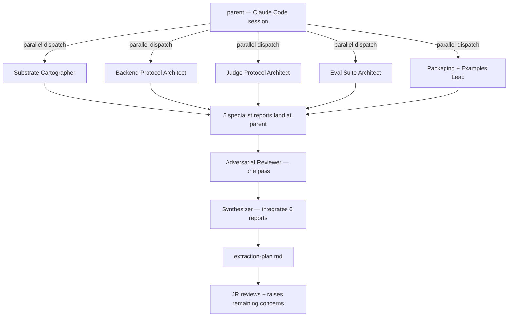

# Autoresearch OSS extraction — v1 requirements

## Problem Frame

gofreddy's autoresearch substrate (`autoresearch/` in this repo) is a working closed-source evolution + harness + judge engine that drives ~7 internal workflow lanes (marketing_audit, geo, monitoring, storyboard, competitive, x_engine, linkedin_engine). The substrate carries genuine technical assets that don't exist coherently in the OSS ecosystem: `LaneSpec` plug-in contract, three-way backend abstraction (claude / codex / opencode) honored at every dispatch site, HTTP judge service with calibration + drift detection, LLM-mediated promotion / rollback decisions, lineage-as-jsonl with Pareto frontier views, fixture pool + holdout-isolation framework.

The bet: an open-source release of *just the substrate* (not the workflows) wins the niche between "evolve agent prompts against benchmarks" tools (ShinkaEvolve, DSPy/MIPRO, OpenEvolve) and "agent harness with judges" tools (LangGraph, AutoGen, CrewAI), because it does both, with discipline neither category ships today. Lane content stays proprietary — it's the agency's moat. Substrate goes open because it's infrastructure, not differentiation.

**This document captures the scoping decisions + research-team architecture from the 2026-05-13 brainstorm.** Dispatch is deferred behind three load-bearing internal priorities (Content Engine Lanes v1, telemetry/audits portal, Phase 3 evolution). Realistic dispatch window: Q4-2026 / Q1-2027.

## Architecture

The OSS substrate exposes three first-class plug-in protocols. Internal workflows and outside contributors target them identically. When the dispatch gate clears, the research team has this topology:

## Requirements

**OSS scope**
- R1. The OSS release exposes the autoresearch substrate as an installable Python package plus a standalone CLI. The CLI is a thin wrapper over the Python API and is decoupled from `freddy`.
- R2. The codebase base is `autoresearch/` (v1) only. `autoresearch_v2/` is archived; no v2-based work goes into the OSS extraction. See [[project-autoresearch-v2-archived-2026-05-13]].
- R3. ~90%+ of `autoresearch/` modules ship as OSS substrate **(2026-05-13 snapshot — the ~90% number is an unverified estimate; the Substrate Cartographer's first deliverable at dispatch time is a measured re-inventory; see Dependencies/Assumptions kill-criterion)**: evolve loop (`evolve.py/sh`, `evolve_ops.py`, `evaluate_variant.py`), lineage + frontier + archive (`archive_index.py`, `frontier.py`, `archive_cli.py`), harness (`harness/agent.py`, `harness/backend.py`, `harness/session_evaluator.py`, `harness/telemetry.py`, `prompt_builder_entrypoint.py`), operational substrate (`concurrency.py`, `events.py`, `agent_retry.py`, `heartbeat.py`, `cycle_detectors.py`, `judge_calibration.py`, `novelty_check.py`, `critique_manifest.py`, `program_prescription_critic.py`, `compute_metrics.py`, `report_base.py`), the `LaneSpec` contract from `lane_registry.py`, promotion / rollback / drift agents at substrate-level only, **plus the top-level `judges/` tree** (specifically `judges/server.py`, `judges/invoke_cli.py`, and the substrate-level subset of `judges/session/`, `judges/evolution/`, `judges/deploy/` — exact subset determined by the Judge Protocol Architect at dispatch; the existing `autoresearch/judges/promotion_judge.py` + `quality_judge.py` are HTTP-client shims and depend on this top-level service being shipped together), a reference judge service with substrate-level rubrics only, the fixture + holdout + discriminate framework.
- R3a. **Pre-extraction refactors required before R3 can be honored** (each is a research-team deliverable, not assumed-done): (a) Untangle bidirectional `autoresearch/` ↔ `src/` coupling. Six known crossings: `lane_paths.py → src.shared.safety.tier_b`, `lane_registry.py → src.audit.validate` + `src.evaluation.models`, `evaluate_variant.py → src.evaluation.rubrics`, `report_base.py → src.shared.reporting`; reverse direction `src/evaluation/{service,rubrics}.py → autoresearch.lane_registry`. Each crossing is classified as substrate-bound (ships, may need renaming), workflow-bound (callers stub via protocol), or replaced (sub a generic alternative). (b) Split `src/evaluation/rubrics.py` (>1,500 LOC commingling substrate IDs `RND-1..5` with workflow-specific IDs `X-/LI-/MA-/GEO-/MON-/CI-/SB-`) into `substrate_rubrics.py` + a registration API workflow rubrics plug into. Precondition of R6. (c) Split `lane_registry.py` into substrate (LaneSpec dataclass + helpers + path-readonly contract + SHARED_WORKFLOW_READONLY constants) and proprietary (LANES dict population, `_wire_marketing_audit_callables`, FRAGILE_FIXTURES); remove the import-time `src.audit.validate` import. Substrate ships the contract; the OSS example lane registers its single LaneSpec via the published API.
- R4. The OSS release ships exactly one minimal example lane that exercises every plug-in protocol without leaking any proprietary workflow content. The example is a teaching artifact, not a real workflow.

**Plug-in seams (first-class)**
- R5. New agent backends — uniform `BackendProtocol` every dispatch site honors. Adding a backend is a 1-file plug-in. Ships with claude / codex / opencode reference impls.
- R6. New judge / evaluator services — `JudgeServiceProtocol` (HTTP contract + payload schemas + rubric registration + abstain semantics) plus an in-process Python protocol. Substrate ships a reference judge with substrate-level rubrics only (correctness, coherence, structure, render quality, hallucination, citation discipline).
- R7. New eval suites — schema for fixture pools + holdout manifests + freshness / discriminate metadata. Substrate handles rotation policy + saturation + the privacy invariant. **The privacy invariant is a protocol contract, not just a substrate guarantee**: third-party `EvalSuiteProtocol` impls MUST declare which fixture IDs are holdouts, MUST NOT expose holdout content via any return path other than the holdout-scoring channel, and MUST pass a `holdout-leakage` probe from the conformance suite. The substrate refuses to register a suite that fails the probe.
- R8. `LaneSpec` stays publicly exposed but is NOT the headline plug-in story. Internal workflows already use it; outside contributors *can* author lanes, but the substrate's messaging and example surface optimize for the backend / judge / eval-suite seams.

**Security & trust boundaries (first-class)**
- R24. Each plug-in seam is an explicit trust boundary with named security deliverables:
  - `BackendProtocol`: `BACKEND_TRUST.md` covers credential passing, subprocess isolation expectations, and the documented threat (backend impl = arbitrary code execution by design).
  - `JudgeServiceProtocol`: auth posture spec for the HTTP contract; substrate refuses to bind to a non-loopback interface unless auth is configured; DoS / rate-limiting behavior documented (evolution loops fan out across fixtures and can saturate a judge endpoint).
  - `EvalSuiteProtocol`: fixture-provenance + holdout-isolation invariant statement that survives third-party suite plug-ins (see R7 protocol contract + holdout-leakage probe).
- R25. **Plug-in trust model is explicit and documented.** v0.1 default posture: plug-ins run in-process with full substrate privileges. The README + contributor guide MUST carry a Security Posture section stating this. The CLI MUST emit a one-time warning when loading a plug-in not shipped with the substrate. Subprocess-isolation / capability-manifest is a post-v0.1 follow-up (see Outstanding Questions / Deferred to Planning).

**Closed (stays in gofreddy)**
- R9. All lane prose: `lanes/marketing_audit.md`, `geo.md`, `competitive.md`, `monitoring.md`, `storyboard.md`, `x_engine.md`, `linkedin_engine.md`, and any future client-driven lane prose.
- R10. Lane-specific judge prompts in `judges/session/prompts/` — the rubric language that makes a lane work. Lane-specific rubric IDs (e.g. `MA-1..MA-9`, `X-1..X-6`, `GEO-1..GEO-9`) appear in code references but are renamed to generic substrate categories per R19 (Bucket 2 scrub) before OSS release; the *content* (prompt language) stays closed.
- R11. Proprietary holdout fixtures (content). The substrate ships the fixture *framework* but no fixture *content*.
- R12. Every `archive/v00N/programs|templates|scripts` — evolved variants are workflow output.
- R13. `freddy autoresearch …` CLI integration — autoresearch's OSS CLI is its own thing.

**Research team architecture (Approach B)**
- R14. Investigation runs via 5 parallel specialists + 1 adversarial reviewer at synthesis + 1 synthesizer. No peer-to-peer agent chat; synthesis is parent-mediated via artifacts written to `docs/superpowers/research/<dispatch-date>-autoresearch-oss/<agent-name>/<artifact>.md`.
- R15. The five specialists are: **Substrate Cartographer** (subagent_type: `compound-engineering:research:repo-research-analyst`); **Backend Protocol Architect**, **Judge Protocol Architect**, **Eval Suite Architect**, **Packaging + Examples Lead** (each subagent_type: `general-purpose`; Packaging Lead additionally uses `find-docs` for current OSS-Python best practices).
- R16. **Adversarial Reviewer** (subagent_type: `compound-engineering:document-review:adversarial-document-reviewer`) runs exactly one pass after all 5 specialists return. **Synthesizer** (subagent_type: `general-purpose`) integrates all 6 reports into the final `extraction-plan.md`.
- R17. Per-agent investigation scopes + required artifacts are captured in [[project-autoresearch-oss-extraction-deferred-2026-05-13]]. **The memo is the authoritative briefing source** — this doc summarizes the architecture; the memo carries the per-agent detail (scope, required outputs, evidence bar).

**Leak mitigation (three buckets)**
- R18. **Bucket 1** — architectural patterns (META / INNER / CRITIQUE eval-model split via `LaneSpec.inner_backend/inner_model`; LLM-mediated promote / rollback via `is_promotable` + `check_and_rollback_regressions` POSTing to judge service; idempotent render scoring via `_ensure_render_score` in `evaluate_variant.py`; per-criterion judging in `judges/session/prompts/critique.md`). Accept the leak. These ARE the substrate's contribution; hiding them ships a worse framework.
- R19. **Bucket 2** — archaeology around the patterns (env-gate flag names that announce bugs, code comments naming specific incidents / PRs / postmortems, version markers, dated context, workflow-specific rubric IDs like `X-1..X-6` / `MA-1..MA-9`). Scrub before release. Assigned to Packaging + Examples Lead as `discipline-leak-scrub.md`. **Scope**: (a) archaeology cleanup as listed; (b) **secrets-scan pass** (`gitleaks` / `trufflehog`) across the carved-out tree AND its git history — production substrate has ~7 lanes of operational history and may contain hardcoded fallback tokens, test credentials, internal service URLs (OSS release is a one-way door; secrets can't be redacted retroactively after publication); (c) explicit decision: carve-out as **fresh repo with no history** vs. filtered subtree — default fresh-repo. Estimated 1.5–2 days total (was ~1 day for archaeology alone). Concrete scrub tasks captured in the deferred memo.
- R20. **Bucket 3** — timing. Automatic. Deferral to Q4-2026 / Q1-2027 means OSS captures "what we knew 6–9 months ago." Internal substrate stays N+1 ahead by then. No effort required.

**Dispatch gate (all conditions must hold)**
- R21. Content Engine Lanes v1 shipped AND ≥2 clients deriving production value. Matches `feedback-production-grade-v1-posture` ("generalize when value crosses next 2-3 clients").
- R22. Telemetry / audits client portal stable.
- R23. Phase 3 evolution stable post-redesign baseline confirmed.

## Success Criteria

- An outside developer can install + run the OSS substrate to first evolution cycle on the shipped example lane in under 10 minutes from `git clone`.
- The three plug-in protocols (`BackendProtocol`, `JudgeServiceProtocol`, `EvalSuiteProtocol`) each have conformance test suites a third-party implementation can run unmodified. `EvalSuiteProtocol` conformance includes a **holdout-leakage probe** (per R7); `BackendProtocol` conformance documents the trust-boundary expectations (per R24).
- At least one outside developer wires a third-party backend (direct Anthropic SDK, OpenRouter raw, Ollama, etc.) using only the published protocol within 60 days of v0.1 — proof the plug-in story works for non-shipped impls.
- The repo README + contributor guide are clear enough that a developer familiar with ShinkaEvolve or DSPy can read the differentiator in under 5 minutes.
- No proprietary lane content (prose, rubrics, fixtures, evolved variants) appears in the OSS repo or its git history.

## Scope Boundaries

- No managed-hosted judge service. OSS ships the contract + reference impl, not infrastructure.
- No multi-tenant or SaaS-ification of the substrate (Counter-4 reframe; see Outstanding Questions).
- No adoption of every Stream C external research idea (ShinkaEvolve novelty judge, UCB1, Verdict). Only port what's needed for protocol completeness.
- No Plan D peripheral simplification work — orthogonal cleanup, not extraction.
- The example lane is NOT a real workflow. It exercises every plug-in protocol with minimal content (2 paragraphs of prose, 3–4 rubric IDs, 3 fixtures, **2 holdouts** — 2 minimum to demonstrate rotation policy and saturation signals; 1 holdout cannot exercise R7's rotation/saturation/freshness mechanisms).

## Key Decisions

- **Goal = "win the substrate niche"**, chosen over credibility / forcing-cleanup / standardize-contracts framings. Implies stable plug-in API + reference-grade protocol specs + contributor flow + well-shaped example.
- **v1 base; v2 archived.** v1 carries production-tested fixes (lane_registry, render_judge wiring, drift detection, promotion / rollback agents, axis-collapse fix). See [[project-autoresearch-v2-archived-2026-05-13]].
- **Backends + judges + eval suites are the headline plug-in seams; LaneSpec demoted from headline.** Internal workflows still use LaneSpec; outside contributors mostly bring backends, judges, and benchmarks.
- **Approach B research team architecture**, chosen over Lean Trio (under-stresses protocol design) and Adversarial Pair-up (slower, higher orchestration cost, equivalent outcomes). Parallelism is real because the four protocol-design jobs are largely orthogonal.
- **Dispatch deferred, not killed.** Sequencing rationale: Content Engine Lanes v1, telemetry portal, Phase 3 evolution all carry higher near-term value. Deferral also lets Content Engine Lanes v1 pressure-test the substrate's plug-in design across 3 new lanes — exactly the empirical signal the research team needs.
- **No requirements-doc-then-plan-then-dispatch chain today.** A plan written today would be stale by Q4-2026. This brainstorm doc IS the durable artifact for now; `/ce:plan` runs at dispatch time, against then-current evidence.

## Dependencies / Assumptions

- **Assumption:** gofreddy's moat is lane content + clients + operational discipline, NOT framework licenses. Substrate OSS doesn't directly compete with the agency's business model.
- **Assumption:** by Q4-2026 / Q1-2027, ≥3 new lanes (Content Engine Lanes v1: article / image / ad) will have pressure-tested the substrate plug-in design across diverse workflows, surfacing leaks the current 7 lanes don't expose.
- **Assumption (UNMEASURED — flagged by adversarial review):** ~90% of `autoresearch/` is extractable as substrate. This is an unverified 2026-05-13 estimate. **Kill criterion:** if the Substrate Cartographer's measured separability at dispatch falls below 75%, the OSS thesis is re-opened before protocol design begins. R3a (pre-extraction refactors) addresses known coupling but assumes the refactors are tractable.
- **Assumption (REQUIRES GATE CHECK — flagged by adversarial review):** Content Engine Lanes v1 is implemented through existing plug-in seams (no new `domain == "X"` branches, no new lane-specific dispatch hardcoding). If the build pressure of v1 forces shortcuts that DEEPEN coupling, dispatch may need to be preceded by a decoupling pass — the deferral could deliver MORE coupling, not less. Memory already records ≥5 hardcoded `domain == "X"` branches in `run.py` / runtime / scripts from prior lanes; check whether v1 added more or fewer at gate R21.
- **Assumption (acknowledged trade-off — flagged by adversarial review):** Discipline-pattern lead-time is shorter than substrate-technical lead-time. A competent reader can internalize the META / INNER / CRITIQUE split, per-criterion judging, and LLM-mediated promotion in 1–2 weeks. gofreddy's defensible advantage is therefore lane content + client trust + operational tempo, NOT pattern obscurity. If this assumption is wrong, Bucket 1 leak is more costly than modeled.
- **Dependency:** Content Engine Lanes v1 plan execution (`docs/plans/2026-05-13-001-feat-content-engine-lanes-v1-plan.md`).
- **Dependency:** telemetry / audits client portal build (see [[project-telemetry-audits-client-portal-2026-05-13]]).
- **Dependency:** Phase 3 evolution stabilization (see [[project-phase3-postmortem-handoff-2026-05-13]], [[project-evolution-redesign-plan-2026-05-13]]).

## Alternatives Considered

- **Approach A (Lean Executor Trio)** — 3 sequential agents, ~1 week investigation. Rejected: under-stresses protocol design; "win the niche" requires reference-grade artifacts, not just a clean extraction.
- **Approach C (Adversarial Pair-up)** — 2 builders + 2 reviewers + synthesizer, ~3 weeks. Rejected: slowest, easiest to rathole; equivalent outcome to Approach B + one adversarial gate at much higher orchestration cost.
- **Standardize contracts only (no implementation)** — ship the protocols as the OSS thing, keep impls closed. Rejected on JR's framing ("involving both prompt and harness as we are currently doing"): the OSS needs both the protocols AND reference impls to win the niche.
- **SaaS-first reframe (Counter-4)** — substrate as marketing for hosted SaaS. Tabled, not rejected; see Outstanding Questions.
- **Write doc + plan + dispatch in one session today.** Rejected: gate conditions don't hold; a plan written today would be stale at dispatch time.

## Outstanding Questions

### Resolve Before Planning

- [Affects R18-R20] [JR decision at dispatch time] **Counter-4 revisit.** By Q4-2026 / Q1-2027, has multi-client Content Engine Lanes v1 made it clearer whether the natural product shape is "OSS framework" (proceed as designed) or "SaaS with OSS framework as marketing artifact" (substantially redesign — OSS thins to protocols + reference impls; bigger build is the SaaS)? This must be re-answered before the research team is dispatched; the answer reshapes the team architecture itself.
- [Affects R3, R3a] [Dispatch-time check] **Internal substrate may have evolved.** Re-run substrate cartography against then-current `autoresearch/` HEAD; the OSS-scope list in R3 is a 2026-05-13 snapshot.
- [Affects Problem Frame premise + Goal in Key Decisions] [Dispatch-time check] **Competitive landscape refresh.** Re-survey ShinkaEvolve, DSPy/MIPRO, OpenEvolve, LangGraph, AutoGen, CrewAI at dispatch time. Confirm the "evolve + harness + judge with discipline" gap the substrate claims to fill still exists. If any named tool has closed it (e.g., DSPy ships native judge calibration + drift detection + lineage), reconsider niche-win premise before dispatching the research team.

### Deferred to Planning

- [Affects R14-R16] [Technical] Exact dispatch order: Cartographer first (so the 4 architects + packager get the inventory) OR all 5 parallel (each architect re-cartographs their slice). Default in the deferred memo is "all 5 parallel" — the planning pass should re-evaluate given how much the substrate has evolved.
- [Affects R6] [Needs research] Whether the OSS reference judge service is a single multi-rubric endpoint or per-rubric microservices. Defer to Judge Protocol Architect.
- [Affects R5] [Needs research] Whether `BackendProtocol` exposes telemetry as a separate `TelemetryProtocol` or inline. Defer to Backend Protocol Architect.
- [Affects R4] [Needs design] Specific content of the shipped example lane — must exercise every protocol without leaking any proprietary workflow shape. Defer to Packaging + Examples Lead.
- [Affects R1, R13] [Needs design] OSS CLI's command surface relative to existing `freddy fixture` and `freddy autoresearch` subcommands. The OSS CLI is its own thing, but the *vocabulary* (subcommand names, flag conventions) needs design work. Defer to Packaging + Examples Lead.
- [Affects R5, R24] [Needs research] **Credential passing seam for `BackendProtocol`**: env-var inheritance vs. explicit `Credentials` arg vs. callback-based `CredentialProvider` (least-privilege; backend receives only its own credential, not the host env). Defer to Backend Protocol Architect; default should be least-privilege.
- [Affects R25] [Needs research] **Capability-manifest / subprocess-isolation mode**: is this a post-v0.1 follow-up, or required at v0.1? Defer to Packaging + Examples Lead.
- [Affects R1, R13, R25] [Needs research] **Plug-in discovery model**: explicit-config (plug-ins listed in `autoresearch.toml`) vs. entry-point autoload vs. CLI flag. Default should be explicit-config to bound the attack surface; entry-point autoload is opt-in. Defer to Packaging + Examples Lead.
- [Affects R6, R24] [Needs research] **Judge HTTP auth posture**: bearer token / mTLS / no-auth-localhost-only — required decision before v0.1; affects schema and reference impl. Defer to Judge Protocol Architect.

## Next Steps

This brainstorm is **paused** pending the dispatch gate (R21-R23). Resume path:

1. When all three gate conditions hold (realistic window Q4-2026 / Q1-2027), open this doc + the deferred memo ([[project-autoresearch-oss-extraction-deferred-2026-05-13]]).
2. Re-run `/ce:brainstorm` to resolve the three `Resolve Before Planning` questions against then-current evidence.
3. Run `/ce:plan` to produce the dispatch plan (now appropriate because gate conditions hold).
4. Invoke `superpowers:dispatching-parallel-agents` to fire the 5 specialists in parallel per R14-R16.
5. After all 5 specialist reports return, dispatch the Adversarial Reviewer for one pass.
6. After the Adversarial Reviewer returns, dispatch the Synthesizer with all 6 reports.
7. JR reviews `extraction-plan.md` from the Synthesizer + raises remaining concerns.
8. Execution: protocol implementations + repo carve-out + Bucket-2 scrub (R19) + first OSS commit.

→ Resume `/ce:brainstorm` when the dispatch gate clears.
