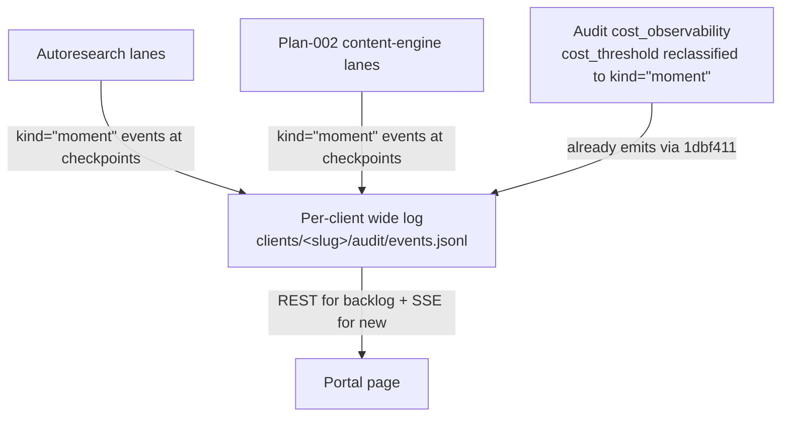

# Client Portal — Moments Redesign

## Revision history

- **v1 (2026-05-15)** — initial draft from brainstorm.
- **v2 (2026-05-15)** — after 7-reviewer document-review surfaced 8 P0
  findings: cut LLM moment-derivation, active-sessions card, dedicated
  awaiting-input pane; inverted attribution precedence to env-first;
  added redaction, threat model, falsifiable SCs.
- **v3 (2026-05-15)** — operator further reduced scope: cut LLM
  narrative intro, filter chips, inline accordion expand, load-more /
  archive, cross-client soft warning. v1 collapses to ~3 days.
- **v3.1 (2026-05-16)** — no-deferrals pass. Every "v1.5" reference
  replaced with an explicit Reject / Owned elsewhere / Architecture /
  Accepted limitation. SSE auth `?token=` migrated from accepted
  limitation to cookie-auth FIX. Runbook update added as explicit v1
  deliverable. Net scope: ~3.75 days.
- **v3.2 (2026-05-18)** — plan-002 coordination closed (main commit
  `9876fec`). Plan-002 now owns the `emit_moment` helper (U6b), the
  KNOWN_KINDS + CANONICAL_FIELDS extensions, U7's canonical-event
  audit emission, and the Phase B/C cross-cutting moment-emission
  requirement. The single Resolve-Before-Planning blocker on the
  portal redesign is cleared. Status flips to READY FOR /ce:plan.

## Problem Frame

gofreddy is a generic AI-native marketing agency. Clients are
tech-savvy founders / early-stage operators whose marketing work is
mostly done by AI agents (autoresearch lanes, interactive Claude Code
sessions, Codex CLI sessions) under human oversight.

The Phase 2 portal page at `/portal/<slug>` shipped in PR #61 commit
`f602092` renders the per-client event log as a flat list of
`tool_call · Bash` rows. The display is technically correct but useless
to a non-engineer reviewer.

**Evidence basis (honest):** no client has used the current page in
production. JR (operator) opened it on 2026-05-15 and reported it was
too noisy to be a useful client surface. This redesign acts on
operator observation; v1 success is re-evaluated against ONE real
client interaction (SC4) before declaring the redesign successful.

The redesign reframes the page around **"moments"** — meaningful
client-visible units of work — instead of raw operational events. Raw
events remain the storage substrate (PR #61 P1–P4 + audit-pipeline
mirrors); they become evidence beneath each moment, surfaced via a
transcript drill-down on click.

## Core Concept: Moments

A **moment** is a single client-visible unit of activity. Examples:

- "Marketing audit started — 4 landing pages against SE-1..SE-8"
- "Drafted 4 LinkedIn posts in your voice"
- "Found 3 SEO gaps on `/pricing`"
- "Cost milestone: $50 spent this week"
- "Marketing audit completed — see full report"

A moment carries: timestamp, kind (`kind="moment"`, added to
`KNOWN_KINDS`), source session id, one-line title, optional body,
citations to the raw events it was derived from. The moment subtype
lives in `metadata.moment_kind`.

## Moment sources — TWO in v1



1. **Lane-emitted (primary).** Autoresearch + plan-002 lanes emit
   `kind="moment"` events at meaningful checkpoints (session_start,
   decision_logged, deliverable_ready, review_required,
   session_completed). **Requires plan-002 to adopt the
   moment-emission contract — hard pre-planning coordination.**

2. **System-emitted.** Audit-pipeline cost milestones (today
   `cost_threshold_crossed`, reclassified to `kind="moment"` with
   `metadata.moment_kind="cost_milestone"`). Already reaches the wide
   log via the `1dbf411` mirror.

**LLM moment-derivation is NOT in scope.** We are not building it.
Rationale: the document-review pass surfaced determinism, citation,
precedence, failure-mode, and unbounded-cost concerns we could not
resolve to a confident design. Sessions without explicit lane-emitted
moments produce zero portal moments — the transcript is still
available via drill-down from any other moment, but the timeline only
shows what's been explicitly emitted. Accepted tradeoff: empty
beats hallucinated. If a future client need surfaces — measured, with
concrete data on what lane-emission missed — we revisit then; v1 does
not pre-build the capability.

## User Flow

```mermaid
flowchart TB
    L[Client logs in at /login] --> P[/portal/&lt;slug&gt; loads]
    P --> H[Header: cost ledger renders &lt;300ms]
    P --> M[Moments REST returns most recent ~50 &lt;2s]
    M --> S[SSE subscribes; new moments arrive &lt;250ms]
    M --> X[Client clicks a moment row]
    X --> D[Drill-down /portal/&lt;slug&gt;/transcript/&lt;session_id&gt;?event_id=...<br/>auto-scrolls + highlights producing event]
```

## Requirements

### Page Layout

- R1. `/portal/<slug>` renders a single page, top→bottom: cost-ledger
  header (thin strip) → moments timeline (dominant region). Nothing
  else above the fold.
- R1.1 Cost-ledger header is a single row, three numerics
  (today / this week / this month) in JetBrains Mono with lime accent
  on "this month".
- R1.2 No narrative intro, no active-sessions card, no awaiting-input
  pane, no filter chips, no load-more controls. v1 is deliberately
  spare; future additions opt in based on real client feedback.

### Moments Timeline

- R2. Timeline shows the most recent ~50 moments, newest-first. Scroll
  forever; no window control. Older history is not surfaced in v1.
- R3. Each moment row is a single line:
  `HH:MM:SS · <session-tag> · <title>`. The kind drives the row's
  accent colour (see Design Language). Session-tag is short
  (e.g. `marketing_audit·v007`) in dim ink-500 Mono. Title is up to
  one terminal-width line — overflow is truncated with ellipsis.
- R4. Click a row → navigates to the drill-down route at
  `/portal/<slug>/transcript/<session_id>?event_id=<producing_event_id>`.
  No inline expand, no accordion. One click, one outcome.

### Per-Client Attribution

- R5. **Precedence (env-first, fail-closed on conflict):**
  - **R5.1** `GOFREDDY_CLIENT_ID=<slug>` set in the launching shell is
    the primary attribution signal. The shipped CC hook reads this;
    the unified tailer (R8) does the same.
  - **R5.2** If `GOFREDDY_CLIENT_ID` is unset, cwd-under-`clients/<slug>/`
    is a fallback attribution path.
  - **R5.3** If both are set and disagree, log a `kind="moment"` with
    `metadata.moment_kind="attribution_conflict"` to operator-internal
    `~/.local/share/gofreddy/events.jsonl` and REFUSE attribution. Fail
    closed; the events from this session land in operator-internal, not
    in either client's log.
  - **R5.4** Slug is validated against the `clients` table at ingest.
    Unknown slug → `400 invalid_client`.
- R6. Unattributed sessions never appear in any client portal. They
  land in operator-internal `~/.local/share/gofreddy/events.jsonl`.
- R7. **Testable cross-tenant invariant.** Unit tests cover: (a) env A
  + cwd A → A, (b) env unset + cwd A → A, (c) env A + cwd B → conflict
  (operator-internal), (d) env A + cwd unset → A, (e) env unset + cwd
  unset → operator-internal, (f) env = unknown slug → 400.

### Unified Transcript Tailer (CC + Codex)

- R8. A new background service watches BOTH `~/.claude/projects/` AND
  `~/.codex/sessions/` for newly-appended lines in session JSONLs.
  On each new line: (a) determine `client_id` via R5 attribution, (b)
  if attributed AND the line represents a moment-worthy checkpoint,
  emit `kind="moment"` to the per-client wide log; (c) otherwise no-op
  (raw transcript bytes never reach the wide log).
- R8.1 The tailer runs as a single Python service alongside the
  FastAPI app process. The existing CC PostToolUse hook stays for
  sub-second live updates during interactive CC sessions; the tailer
  is the source of truth for Codex (no hook mechanism) and for any CC
  sessions where the hook missed.
- R8.2 v1 emission policy: the tailer emits a `kind="moment"` for
  CC/Codex session_start and session_end only. Other moments come
  from lane-emit (R-Lane-1). This keeps the tailer simple and
  deterministic; it does not try to infer meaning from raw tool calls.

### Transcript Drill-Down Renderer

- R9. Route: `GET /portal/<slug>/transcript/<session_id>?event_id=<id>`.
- R9.1 Auth: `resolve_client_access(...)` AND a server-controlled
  mapping confirming `session_id` belongs to `<slug>` (no
  attacker-controlled path interpolation). IDOR guard returns 404, not
  403, when session doesn't belong to the slug.
- R9.2 Reads CC project JSONLs (`~/.claude/projects/<encoded-cwd>/<session_id>.jsonl`)
  and Codex CLI rollout JSONLs
  (`~/.codex/sessions/<YYYY>/<MM>/<DD>/rollout-*<session_id>*.jsonl`)
  directly from the operator host's local filesystem. v1 deployment
  topology is single-host; see Scope Boundaries.
- R9.3 Display: user messages, agent text (markdown), agent reasoning
  (collapsed by default, click-to-expand), tool calls one-lined with
  tool name + short args summary, expanded reveals full args AND tool
  result. Token counts + cache info behind a per-turn "details" toggle.
- R9.4 `?event_id` anchor auto-scrolls to and highlights the event
  that produced the originating moment.

### Transcript Content Security

- R-Sec-1. **Server-side redaction pass before any transcript content
  reaches the browser.** Regex match on common secret patterns
  (Anthropic/OpenAI/Supabase API keys, JWTs, AWS keys, GitHub tokens,
  generic `*_API_KEY=`, `password=`, DB URLs with embedded credentials).
  Redacted values render as `<redacted:secret_kind>`.
- R-Sec-2. Bash tool inputs/outputs and Read tool outputs of files
  matching `*.env`, `*.envrc`, `.git/credentials`, `id_rsa*` are
  rendered as redacted summaries
  (`Read /path/to/.env (87 lines — contents redacted)`) unless an
  explicit operator-only allow flag is set per-event. Default-deny.
- R-Sec-3. Every redaction is logged to operator-internal
  `~/.local/share/gofreddy/events.jsonl` with
  `metadata.redaction_kind` for audit.
- R-Sec-4. The redaction pass is versioned; redactor version is
  stamped on each rendered transcript so future improvements can
  re-scan already-served content.

### Cost Ledger

- R-Cost-1. Today / this-week / this-month rollups derived from
  `kind="cost"` events in the wide log. Provider costs via
  `cost_recorder` (`b0b0c6b`); claude subprocess costs via the
  cost_ledger bridge (`1dbf411`).
- R-Cost-2. `audit/cost_observability.py` emits today as
  `kind="cost_threshold_crossed"`. Reclassify to `kind="moment"` with
  `metadata.moment_kind="cost_milestone"` so these surface in the
  moments timeline.

### Live Updates

- R-Live-1. Initial page load fetches the recent ~50 moments via a NEW
  REST endpoint `GET /v1/portal/<slug>/moments?limit=50`. (The existing
  SSE backlog of 50 raw events is not useful for sparse moments.)
- R-Live-2. After REST load, the page subscribes to the existing SSE
  endpoint at `/v1/portal/<slug>/stream` from PR #61 P4 (`29a947f`)
  and filters client-side for `kind="moment"` events. New moments
  appear within ~250ms.
- R-Live-3. SSE disconnect + reconnect → re-fetch the REST endpoint
  for any moments missed since the last-received `moment_id`.

### Schema Extensions Required

- R-Schema-1. Add `moment` and `review_required` to
  `autoresearch/events.py:KNOWN_KINDS`. Update the lock-contract drift
  tests in `tests/autoresearch/test_events.py`.
- R-Schema-2. Update the frontend kind→colour mapping (per the lock
  contract docstring) to assign moment a primary lime accent
  (`#c4fa0d`) and review_required a warm accent (`#f4b95b`).
- R-Schema-3. Canonical moment payload fields added to
  `CANONICAL_FIELDS`: `moment_kind`, `source_event_ids` (array of
  citations), `title`, `body` (optional). Other moment data in
  `metadata`.
- R-Schema-4. `cost_threshold_crossed` retires as a top-level kind;
  re-emitted as `kind="moment"` with `metadata.moment_kind="cost_milestone"`.
  Update `audit/cost_observability.py` accordingly. Backward-compat
  shim NOT needed (the previous emitter is internal, not external).

### Lane-Emission Contract

- R-Lane-1. New helper: `events.emit_moment(client_id, moment_kind,
  title, *, source_event_ids=None, body=None, **metadata)`. Lanes call
  this directly at meaningful checkpoints. The helper sets
  `kind="moment"`, fills required fields, and emits via `log_event(...)`
  to `client_events_path(client_id)`.
- R-Lane-2. Minimum moment kinds plan-002 lanes MUST emit (subject to
  R-Lane-3 coordination): `session_start`, `session_completed`,
  `deliverable_ready`, `review_required`. Optional: `decision_logged`,
  `error_recovered`.
- R-Lane-3. **Plan-002 owner agreement on R-Lane-2** is hard
  pre-planning coordination — see Outstanding Questions.

### Auth

- R-Auth-1. Supabase JWT via `/login`; `resolve_client_access(...)`
  membership check on all authed routes:
  `/v1/portal/<slug>/summary`, `/v1/portal/<slug>/moments`,
  `/v1/portal/<slug>/stream`, `/v1/portal/<slug>/transcript/...`,
  `/v1/portal/<slug>/reports/...`.
- R-Auth-2. **Cookie auth for browser clients (NEW in v3.1).** `/login`
  sets an httpOnly, SameSite=Strict cookie containing the Supabase JWT.
  The SSE endpoint `/v1/portal/<slug>/stream` reads the cookie via the
  standard `Cookie` header (which `EventSource` always sends for
  same-origin requests). The previous `?token=<jwt>` query-param
  fallback is REMOVED for browser flows — JWT no longer appears in
  URLs, access logs, or browser history.
- R-Auth-3. Non-browser clients (curl, scripts, integration tests)
  continue to use the standard `Authorization: Bearer <jwt>` header.
  `?token=<jwt>` is removed entirely; only Cookie or Authorization
  headers authenticate.

### Runbook Update (v1 deliverable)

- R-Runbook-1. The existing operator runbook at
  `docs/runbooks/portal-client-onboarding.md` describes the
  pre-redesign Phase 2 page. Update it to reflect the redesigned
  portal: new attribution precedence (R5 env-first), the
  transcript-tailer service install steps, cookie-auth flow, and the
  retention/erasure manual workaround (see Accepted Limitations).
  Without this update, new-client onboarding falls back to tribal
  knowledge.

## Design Language (anchored to `landing/index.html`)

- Background `#0a0a0c`, ink scale `#fafaf9` → `#57534e`
- Lime accent `#c4fa0d` for: agent activity, completed work, "this
  month" cost numeric, moment kind=deliverable_ready/session_completed
- Warm accent `#f4b95b` for: human-action moments (review_required,
  attribution_conflict, sla_breach)
- Dim ink-500 `#78716c` for: system/cost moments, session-tags,
  timestamps, metadata
- Inter Tight for prose, JetBrains Mono for numerics + session-tags +
  timestamps, Fraunces variable available for one optional serif moment
  if needed (page title only)
- Reuse `.log-stream`, `.log-line`, `.caret-blink` classes from
  `landing/index.html` verbatim for the moments timeline
- Restrained motion: line-reveal on new SSE moments, caret-blink on
  in-progress sessions, no bouncy curves, no AI-slop gradient meshes

## Interaction States

- **Cost-ledger header** — populated / zero-spend / ledger-bridge-down
- **Moments timeline** — populated / empty-new-client
  ("No moments yet. Activity will appear here as agents work for you.") /
  loading-from-REST (skeleton lines) / SSE-disconnected (small
  "reconnecting" indicator at the bottom, non-blocking) / partial-load
  (rare; surface as a single muted row)
- **Transcript drill-down** — loading / large-transcript-paginating /
  file-not-found / parse-error / redaction-applied (small footer note
  indicating N values were redacted)

## Threat Model

| Scenario | Likelihood | Impact | Mitigation |
|---|---|---|---|
| **(T1) Bash tool reveals `.env` to client** — agent runs `cat .env`; raw output reaches transcript renderer | High | High | R-Sec-1 + R-Sec-2 default-deny on Bash/Read of `.env`-pattern files; secret-regex pass |
| **(T2) Prompt-injection spoofs client_id** — adversarial tool result causes the agent to export `GOFREDDY_CLIENT_ID=<other-slug>` mid-session | Low | Critical | R5.3 fail-closed on env-vs-cwd conflict + R5.4 slug validated against `clients` table + ingest-side audit logging |
| **(T3) Cross-tenant transcript route IDOR** — attacker guesses another client's session_id | Low | High | R9.1 server-side mapping requires session_id-belongs-to-slug check; 404 (not 403) to avoid existence disclosure |

## Success Criteria (falsifiable)

- **SC1 (latency).** First-paint <2s on cold load. Cost-ledger renders
  in <300ms. Moments REST returns in <2s (50 rows, indexed). Verified
  via page-load instrumentation captured in operator-internal events.
- **SC2 (signal density).** A 2-hour Claude Code session producing
  ~500 tool calls produces 2–5 moments (session_start +
  session_completed from the tailer, plus any lane-emitted moments).
  No raw tool calls leak into the timeline.
- **SC3 (cross-tenant isolation).** All 6 unit test cases from R7
  pass. Integration test: outsider JWT with no membership requests a
  transcript drill-down with any session_id → 404.
- **SC4 (comprehension test, one real client).** Once the redesign is
  staged, JR runs the portal past ONE real client (Klinika OR DWF) and
  asks: "Without scrolling past 10 entries, can you name 3 things the
  agency did this week?" Target: yes. This is the redesign's actual
  exit criterion.
- **SC5 (Codex parity).** A Codex session running in a per-client
  worktree produces session_start + session_completed moments in the
  same timeline as a Claude Code session, with the same drill-down
  quality.

## Scope Boundaries (no deferrals — every cut is explicit)

### Reject (we are not building these)

These are not in v1 and not planned for any future iteration of this
portal. If a real client need surfaces with measured evidence, we
revisit then — but we do not pre-build placeholder slots or carry
implicit promises forward.

- **LLM moment-derivation.** Unresolved invariants (determinism,
  citations, precedence vs lane-emit, failure mode, unbounded cost).
  Lane-emit + system-emit is the architecture.
- **LLM narrative intro.** 30s test (SC4) met by moment titles alone.
  If operators want curated weekly summaries, they emit them as
  `kind="moment"` events with operator-authored body — human-curated
  capability already exists.
- **Dedicated active-sessions card.** Session-tag on each moment +
  most-recent moment naturally rising to the top covers the
  "what's running now" need.
- **Dedicated awaiting-input pane.** `review_required` is a moment
  kind with a warm-accent badge inline in the timeline. No separate
  pane.
- **Filter chip UI.** The moments REST endpoint accepts
  `?kind=...&session=...` query params (preserved for URL-based
  filtering by operators); no chip UI rendered in the page.
- **Inline accordion expand on moment rows.** Each row is one line
  (`HH:MM:SS · session-tag · title`). Click navigates directly to
  drill-down.
- **Load-more UI, archive page, paginated history controls.** REST
  endpoint accepts `?limit=` and `?before=` for power users; no UI.
  Recent ~50 moments is the v1 surface.
- **Cross-client reference soft warning.** Attribution + redaction
  prevent the actual leak; the warning is paranoia without value.
- **Plain-text Codex logs** at `harness/runs/.../codex.log`. Structured
  `~/.codex/sessions/.../rollout-*.jsonl` is the source. One parser.
- **Mobile / responsive.** Desktop-only. The page is not tested or
  designed for mobile; it may accidentally work via the landing
  page's CSS but we make no claim.
- **Performance analytics** (impressions, conversions, channel KPIs)
  — a different product (marketing-ops), not this portal.
- **Calendar / scheduling, comment threads on moments, ask-the-agent
  feedback channels.** Out.
- **Multi-client operator overview** (one dashboard listing all
  clients). Operators navigate per-client URLs. If we eventually need
  it, it's a separate page, not added complexity to this one.

### Owned elsewhere

- **Approval/reject/comment UI for `review_required`.** Plan-002 U7
  owns this. The portal surfaces `review_required` moments and
  deep-links into U7's UI for the actual interaction.

### Architecture (design choices, not limitations)

- **Single-host operator deployment.** The portal runs on the
  operator's host and reads transcripts from `~/.claude/projects/` +
  `~/.codex/sessions/` directly. This is the architecture, not a
  deferred capability. A hosted-portal (operator transcripts on host
  A, portal on Fly) is a different product; building one would
  require a mirror-and-ship pipeline (not planned).
- **Tenant model: per-client URL, no operator dashboard.** Each
  client has a dedicated `/portal/<slug>` page accessed via membership;
  operators navigate by URL. No aggregate view.

### Accepted limitations (acknowledged, documented in runbook)

These are real limitations we choose to live with rather than build
around. The runbook (R-Runbook-1) documents the manual workaround for
each.

- **No automated retention or right-to-erasure.** The per-client wide
  log retains indefinitely. If a client invokes a GDPR right-to-erasure
  request, the operator manually deletes
  `clients/<slug>/audit/events.jsonl` (and rotated segments). Runbook
  documents the procedure. Sufficient for current client volume.

## Key Decisions

- **Moments-over-events** as the primary primitive. Raw events remain
  storage substrate; portal renders derived moments only.
- **TWO moment sources** (lane-emit + system-emit). LLM derivation
  REJECTED — see Scope Boundaries.
- **Env-var first attribution** (matches shipped CC hook), cwd as
  fallback, fail-closed on conflict.
- **Unified transcript-tailer service** as v1 deliverable. Single
  daemon for CC + Codex JSONLs.
- **Keep PR #61 P5 as-is.** Don't strip from PR #61; the redesign is a
  separate follow-up PR. Main always has a working `/portal/<slug>`.
- **Direct file-read on transcript drill-down.** Operator-host
  single-tenant deployment is the architecture (see Scope Boundaries
  → Architecture), not a v1 limitation.
- **No LLM anywhere in v1.** Cost cap, hallucination, failure modes,
  identity bet — all removed by rejecting both LLM moment-derivation
  and LLM narrative intro.
- **Filterless minimal timeline.** Click row → drill-down. No
  accordion, no filter chips, no load-more controls. REST endpoint
  supports filter/limit/before query params; no UI built.
- **Cookie auth for SSE (new v3.1).** `/login` sets httpOnly cookie;
  EventSource sends it automatically. `?token=<jwt>` URL fallback is
  removed entirely (browser uses cookie, non-browser uses
  `Authorization: Bearer`).
- **Runbook update is part of v1 (R-Runbook-1).** New-client
  onboarding documentation reflects the redesigned portal, the new
  attribution rule, the cookie-auth flow, and the retention manual
  workaround.
- **Falsifiable success criteria.** SC1–5 are measurable or testable;
  redesign cannot ship green by self-declaration.

## Dependencies / Assumptions

### Hard pre-planning coordination — RESOLVED 2026-05-18

- **Plan-002 owner adopted the moment-emission contract** in commit
  `9876fec` on `main`. Plan-002 now contains: new shared-infra unit
  **U6b** (the `emit_moment` helper, KNOWN_KINDS + CANONICAL_FIELDS
  extensions); **U7** audit emission migrated to canonical
  `events.log_event(kind="review_required"|"review_approve"|"review_reject"|"sla_breach", ...)`;
  and a **cross-cutting requirement at the top of Phase B + Phase C**
  that every lane emit `session_start`/`deliverable_ready`/`session_completed`
  moments at the U6b checkpoints. Lane-emitted moments are now a
  load-bearing plan-002 deliverable, not a coordination ask.

### Standard assumptions

- PR #61 plumbing lands on `main` (P1–P4 + P6 + commit `1dbf411`)
  before the redesign branch starts.
- Existing Supabase JWT auth machinery continues to work.
- v1 portal runs on the operator's host (single-operator topology).

## Outstanding Questions

### Resolve Before Planning

(none — plan-002 coordination resolved 2026-05-18 via main commit
`9876fec`; see Dependencies / Assumptions → Hard pre-planning
coordination)

### Deferred to Planning

- **[Affects R8][Technical]** Tailer implementation — `watchdog` +
  asyncio vs native `inotify`/`fsevents`.
- **[Affects R-Live-1][Technical]** Moments REST endpoint persistence
  shape — derived-on-read from `events.jsonl` (filter `kind="moment"`)
  vs separate `moments.jsonl`. Derived-on-read likely simpler; measure
  during planning.
- **[Affects R-Sec-1][Needs research]** Secret-regex set — start with
  a vetted open-source list (e.g. trufflehog rules); planning picks
  the specific source.
- **[Affects R9.3][Needs research]** Best practice for rendering long
  agent reasoning blocks — prototype 2–3 options against real CC
  transcripts.

## Next Steps

→ `/ce:plan` for structured implementation planning. No remaining
pre-planning blockers (plan-002 coordination closed 2026-05-18).
