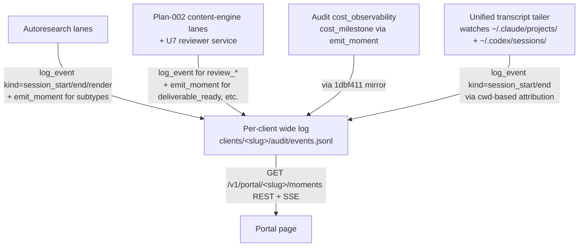

# Client Portal — Moments Redesign

## Revision history

- **v1 (2026-05-15)** — initial draft from brainstorm.
- **v2 (2026-05-15)** — after 7-reviewer document-review surfaced 8 P0
  findings: cut LLM moment-derivation, active-sessions card, dedicated
  awaiting-input pane; inverted attribution precedence to env-first;
  added redaction, threat model, falsifiable SCs.
- **v3 (2026-05-15)** — operator further reduced scope: cut LLM
  narrative intro, filter chips, inline accordion expand, load-more /
  archive, cross-client soft warning. v1 collapses to ~3 days.
- **v3.1 (2026-05-16)** — no-deferrals pass. Every "v1.5" reference
  replaced with an explicit Reject / Owned elsewhere / Architecture /
  Accepted limitation. SSE auth `?token=` migrated from accepted
  limitation to cookie-auth FIX. Runbook update added as explicit v1
  deliverable. Net scope: ~3.75 days.
- **v3.2 (2026-05-18)** — plan-002 coordination closed (main commit
  `9876fec`). Plan-002 now owns the `emit_moment` helper (U6b), the
  KNOWN_KINDS + CANONICAL_FIELDS extensions, U7's canonical-event
  audit emission, and the Phase B/C cross-cutting moment-emission
  requirement. The single Resolve-Before-Planning blocker on the
  portal redesign is cleared. Status flips to READY FOR /ce:plan.
- **v3.3 (2026-05-18)** — full gap pass surfaced 15 issues (3 P0,
  5 P1, 7 P2). All fixed inline:
  P0-1 `kind` vs `moment_kind` ambiguity — dual-shape reality stated
    explicitly; lanes use `log_event` for kinds in KNOWN_KINDS,
    `emit_moment` for moment-shaped subtypes; frontend kind→display
    mapping covers both shapes.
  P0-2 tailer can't read env-var (different process) — attribution
    paths split: CC hook uses env-var primary, cwd fallback; tailer
    uses cwd only.
  P0-3 moments REST persistence shape was deferred — promoted to
    Key Decisions, locked at derived-on-read from `events.jsonl`.
  P1-4 session boundary detection rules now in R8.2.
  P1-5 cookie auth flow flesh-out — new `POST /v1/auth/cookie` endpoint.
  P1-6 session_id → file-path registry defined at
    `clients/<slug>/audit/sessions.jsonl`.
  P1-7 `moment_id` clarified as `event_id`; `?since=` added to REST.
  P1-8 redaction scope expanded to moment titles + bodies + metadata.
  P2 fixes: tailer in-process asyncio task; session-tag format with
    variant-optional; "scroll forever" wording; mermaid diagram adds
    tailer; JWT expiry → 401 redirect; PR #61 P5 stays as-is in
    Dependencies; T4 added to Threat Model (HTML injection in titles).

## Problem Frame

gofreddy is a generic AI-native marketing agency. Clients are
tech-savvy founders / early-stage operators whose marketing work is
mostly done by AI agents (autoresearch lanes, interactive Claude Code
sessions, Codex CLI sessions) under human oversight.

The Phase 2 portal page at `/portal/<slug>` shipped in PR #61 commit
`f602092` renders the per-client event log as a flat list of
`tool_call · Bash` rows. The display is technically correct but useless
to a non-engineer reviewer.

**Evidence basis (honest):** no client has used the current page in
production. JR (operator) opened it on 2026-05-15 and reported it was
too noisy to be a useful client surface. This redesign acts on
operator observation; v1 success is re-evaluated against ONE real
client interaction (SC4) before declaring the redesign successful.

The redesign reframes the page around **"moments"** — meaningful
client-visible units of work — instead of raw operational events. Raw
events remain the storage substrate (PR #61 P1–P4 + audit-pipeline
mirrors); they become evidence beneath each moment, surfaced via a
transcript drill-down on click.

## Core Concept: Moments

A **moment** is a single client-visible unit of activity. Examples:

- "Marketing audit started — 4 landing pages against SE-1..SE-8"
- "Drafted 4 LinkedIn posts in your voice"
- "Found 3 SEO gaps on `/pricing`"
- "Cost milestone: $50 spent this week"
- "Marketing audit completed — see full report"

A moment carries: timestamp, source session id, one-line title,
optional body, citations to the raw events it was derived from. Every
moment is renderable in the timeline regardless of how it was emitted.

### The two emission shapes (resolved 2026-05-18, v3.3)

Moments reach the wide log in TWO mechanically distinct shapes. Both
render identically in the portal; the split exists to avoid
proliferating top-level kinds for every concept while still using
top-level kinds where they're already meaningful in the substrate.

**Shape A — top-level kind** (use when the kind is already in
`KNOWN_KINDS` or warrants a dedicated kind for semantic / drift-test /
audit-grep reasons):

```python
log_event(
    kind="session_start",        # or session_end, render, promotion,
                                  # review_required, review_approve,
                                  # review_reject, sla_breach
    client_id="klinika-melitus",
    action="marketing_audit started",
    metadata={"title": "Marketing audit started — 4 pages"},
    path=client_events_path("klinika-melitus"),
)
```

**Shape B — `kind="moment"` with `moment_kind` subtype** (use for
moment-shaped events that don't have a dedicated top-level kind):

```python
emit_moment(
    client_id="klinika-melitus",
    moment_kind="deliverable_ready",   # or decision_logged, error_recovered,
                                        # cost_milestone, attribution_conflict
    title="Drafted 4 LinkedIn posts in your voice",
    source_event_ids=["evt_abc"],
)
# helper writes kind="moment", metadata={moment_kind, title, source_event_ids, ...}
```

**Frontend mapping covers both shapes uniformly:** the portal's
timeline-eligible kind set is
`{moment, session_start, session_end, review_required, review_approve, review_reject, sla_breach, render, promotion}`.
For `kind="moment"`, the row's accent colour and label come from
`metadata.moment_kind`. For other kinds, accent + label come from the
kind itself per R-Schema-2.

**Decision logic** (lane authors / planning): use Shape A when the
event already has a top-level kind; use Shape B (emit_moment) for new
moment-shaped concepts. Don't proliferate top-level kinds beyond the
set above without a substrate-level reason.

## Moment sources — THREE producers in v1



1. **Lane-emitted (primary for plan-002 content lanes).** Autoresearch
   + plan-002 lanes emit at meaningful checkpoints using the
   appropriate shape per Core Concept §"two emission shapes":
   `log_event(kind="session_start"|"session_end"|"review_required"|...)`
   for top-level kinds, `emit_moment(client_id, moment_kind, ...)` for
   subtypes (deliverable_ready, decision_logged, error_recovered).
   Plan-002 owner adopted the contract in main `9876fec`.

2. **System-emitted.** Audit-pipeline cost milestones — currently
   `kind="cost_threshold_crossed"` from `audit/cost_observability.py`,
   reclassified per R-Schema-4 to `emit_moment(client_id,
   moment_kind="cost_milestone", ...)`. Already reaches the wide log
   via the `1dbf411` mirror; the kind reclassification is part of v1.

3. **Tailer-emitted (interactive CC + Codex coverage).** The unified
   transcript-tailer service (R8) watches `~/.claude/projects/` and
   `~/.codex/sessions/`. On new-session detection (first JSONL line in
   a previously-unseen file under the watched roots), the tailer emits
   `log_event(kind="session_start", ...)` with cwd-derived attribution
   (R5.2). On session-end detection (R8.2 rules), emits
   `log_event(kind="session_end", ...)`. The tailer does NOT try to
   infer mid-session moments from raw tool calls — those would be lane-
   emitted by an autoresearch lane wrapper if needed, not by the
   tailer's introspection.

**LLM moment-derivation is NOT in scope.** We are not building it.
Rationale: the document-review pass surfaced determinism, citation,
precedence, failure-mode, and unbounded-cost concerns we could not
resolve to a confident design. Sessions without explicit lane-emitted
moments produce only `session_start` + `session_end` portal moments
(from the tailer) — the full transcript is still available via
drill-down, but the timeline doesn't synthesize intermediate moments.
Accepted tradeoff: empty beats hallucinated. If a future client need
surfaces — measured, with concrete data on what lane-emission missed
— we revisit then; v1 does not pre-build the capability.

## User Flow

```mermaid
flowchart TB
    L[Client logs in at /login] --> P[/portal/&lt;slug&gt; loads]
    P --> H[Header: cost ledger renders &lt;300ms]
    P --> M[Moments REST returns most recent ~50 &lt;2s]
    M --> S[SSE subscribes; new moments arrive &lt;250ms]
    M --> X[Client clicks a moment row]
    X --> D[Drill-down /portal/&lt;slug&gt;/transcript/&lt;session_id&gt;?event_id=...<br/>auto-scrolls + highlights producing event]
```

## Requirements

### Page Layout

- R1. `/portal/<slug>` renders a single page, top→bottom: cost-ledger
  header (thin strip) → moments timeline (dominant region). Nothing
  else above the fold.
- R1.1 Cost-ledger header is a single row, three numerics
  (today / this week / this month) in JetBrains Mono with lime accent
  on "this month".
- R1.2 No narrative intro, no active-sessions card, no awaiting-input
  pane, no filter chips, no load-more controls. v1 is deliberately
  spare; future additions opt in based on real client feedback.

### Moments Timeline

- R2. Timeline shows the 50 most recent moments, newest-first. **50 is
  a hard cap** — the page renders 50 and stops. No load-more, no
  infinite scroll, no archive page in v1. Older history is queryable
  via the moments REST endpoint's `?before=` query param for power
  users (no UI built; documented in runbook).
- R3. Each moment row is a single line:
  `HH:MM:SS · <session-tag> · <title>`. The kind/moment_kind drives
  the row's accent colour per R-Schema-2 + Design Language. Title is
  rendered HTML-escaped (Threat Model T4) and truncated at one
  terminal-width line (overflow → ellipsis).
- R3.1 **Session-tag format:** `<lane>` when no variant is present
  (interactive Claude Code / Codex sessions; plan-002 lanes without a
  promoted variant); `<lane>·<variant>` when a variant exists
  (e.g. `marketing_audit·v007`). Tag rendered in dim ink-500 Mono.
- R4. Click a row → navigates to the drill-down route at
  `/portal/<slug>/transcript/<session_id>?event_id=<producing_event_id>`.
  No inline expand, no accordion. One click, one outcome.

### Per-Client Attribution

Attribution paths differ between the CC PostToolUse hook (which inherits
env vars from the CC process) and the unified tailer (a separate
process that can only see filesystem cues). Both must converge on the
same `client_id` for the same session.

- R5. **CC PostToolUse hook (in-process; env-var primary):**
  - **R5.1** Hook reads `GOFREDDY_CLIENT_ID=<slug>` from its inherited
    env. If set, that's the attribution.
  - **R5.2** If `GOFREDDY_CLIENT_ID` is unset, the hook reads CC's
    `cwd` from the stdin JSON payload and checks for a
    `clients/<slug>/...` segment. If matched, attribute to that slug.
  - **R5.3** If both are set and disagree (env says slug A, cwd path
    contains `clients/<slug-B>/`), emit
    `emit_moment(client_id=None, moment_kind="attribution_conflict",
    title="env-vs-cwd disagree", ...)` to operator-internal
    `~/.local/share/gofreddy/events.jsonl` and REFUSE attribution. Fail
    closed.
- R5.4 **Unified tailer (out-of-process; cwd-only):**
  - The tailer cannot read another process's env. It uses CWD ONLY:
    CC sessions via the encoded-cwd in `~/.claude/projects/<encoded>/`
    (decoded back to a real path); Codex sessions via the `cwd` field
    inside the `session_meta` JSONL entry.
  - If the resulting cwd contains `clients/<slug>/`, attribute. Else
    operator-internal.
  - The tailer does NOT attempt to read `GOFREDDY_CLIENT_ID` from
    anywhere; if the operator wants env-only attribution, the CC hook
    handles it in real-time and the tailer's later session_start
    emission is a no-op (deduplicated against the hook's earlier
    write — see R8.3).
- R5.5 **Slug validation (both paths).** Slug must match
  `^[a-z0-9-]{1,64}$` AND exist in the `clients` table at ingest.
  Unknown slug → emit `attribution_conflict` to operator-internal,
  refuse attribution. Hook caller receives `400 invalid_client`.
- R6. Unattributed sessions never appear in any client portal. They
  land in operator-internal `~/.local/share/gofreddy/events.jsonl`.
- R7. **Testable cross-tenant invariants.** Unit tests cover:
  HOOK PATH: (a) env A + cwd A → A; (b) env unset + cwd A → A;
  (c) env A + cwd B → conflict (operator-internal); (d) env A + cwd
  unset → A; (e) env unset + cwd unset → operator-internal; (f) env
  = unknown slug → 400.
  TAILER PATH: (g) cwd under clients/A/ → A; (h) cwd elsewhere →
  operator-internal; (i) cwd matches but slug not in `clients` table
  → conflict (operator-internal).
  INTEGRATION: (j) hook attributes session X to A in real-time AND
  tailer later sees the same session — tailer's emission deduplicates
  against the existing session_start in the per-client log (see R8.3).

### Unified Transcript Tailer (CC + Codex)

- R8. A new background service watches BOTH `~/.claude/projects/` AND
  `~/.codex/sessions/` (recursively) for newly-created session JSONL
  files AND appended lines on existing ones. Per R5.4 (tailer path),
  attribution is cwd-only.
- R8.1 **Lifecycle.** The tailer runs as an **in-process asyncio task
  started by the FastAPI app's lifespan**. Same uvicorn worker, same
  process, same event loop. Restart-safe via the session registry
  (R8.4) — on lifespan startup, the tailer reconciles the registry
  against the watched roots and resumes from the last-known position
  per session file. No separate process; no IPC.
- R8.2 **Session boundary detection.**
  - **session_start** = a new JSONL file appears under the watched
    roots that the registry has never seen before. Tailer reads the
    first ~10 lines to confirm it's a valid session file (Codex:
    `session_meta` event present; CC: at least one `{"type":...}` line
    parseable), derives cwd, applies R5.4 attribution, and emits
    `log_event(kind="session_start", client_id, action=<lane or
    "claude_code"|"codex">, metadata={session_id, source, file_path,
    started_at, title="<lane> session started"}, path=client_events_path(client_id))`.
  - **session_end** = whichever fires first:
    (i) the session file's mtime hasn't advanced in 10 minutes AND
        size hasn't grown across 3 consecutive tailer ticks, OR
    (ii) Codex `task_completed` / `task_aborted` event observed in
        the JSONL (Codex-only; CC has no formal end marker).
    On detection, emit `log_event(kind="session_end", client_id,
    metadata={session_id, source, ended_at, reason="idle_timeout"|
    "task_completed"|"task_aborted"}, path=client_events_path(client_id))`.
  - Other JSONL lines are ignored. The tailer does NOT introspect
    tool calls, agent text, or reasoning to generate moments — that's
    explicitly out of scope (would re-introduce LLM-derivation risks).
- R8.3 **Deduplication with the CC hook.** Both the hook and the
  tailer can observe the same CC session. Convention: the hook (when
  installed + env var set) writes a `session_start` for the session
  immediately. The tailer, when it notices the file later, checks the
  per-client log for an existing `kind="session_start"` event with the
  same `session_id` in metadata. If found, skip emission. The hook's
  emission wins; the tailer's is a backstop. session_end is emitted
  by whichever observer detects it first; same dedup.
- R8.4 **Session registry.** The tailer maintains
  `clients/<slug>/audit/sessions.jsonl` (append-only). On
  session_start emission, the tailer appends:
  `{session_id, client_id, source: "cc"|"codex", file_path,
  started_at, hook_emitted: bool}`. On session_end: append a row with
  `ended_at` + reason. The registry serves TWO purposes:
  (a) the IDOR guard in R9.1 (drill-down route reads the registry to
      verify session_id belongs to slug AND to resolve file_path —
      attackers cannot manipulate the path);
  (b) tailer crash-recovery on restart (reconcile registry against
      watched files and resume from last-known position).

### Transcript Drill-Down Renderer

- R9. Route: `GET /portal/<slug>/transcript/<session_id>?event_id=<id>`.
- R9.1 **Auth + IDOR guard.** Two checks:
  (a) `resolve_client_access(pool, user_id, <slug>)` — membership;
  (b) `<session_id>` MUST appear in `clients/<slug>/audit/sessions.jsonl`
      (the registry from R8.4). If absent, return 404 (NOT 403, to
      avoid existence disclosure across tenants). The registry also
      provides the file_path; the route never constructs paths from
      user-supplied input.
- R9.2 Reads CC project JSONLs (`~/.claude/projects/<encoded-cwd>/<session_id>.jsonl`)
  and Codex CLI rollout JSONLs
  (`~/.codex/sessions/<YYYY>/<MM>/<DD>/rollout-*<session_id>*.jsonl`)
  directly from the operator host's local filesystem. v1 deployment
  topology is single-host; see Scope Boundaries.
- R9.3 Display: user messages, agent text (markdown), agent reasoning
  (collapsed by default, click-to-expand), tool calls one-lined with
  tool name + short args summary, expanded reveals full args AND tool
  result. Token counts + cache info behind a per-turn "details" toggle.
- R9.4 `?event_id` anchor auto-scrolls to and highlights the event
  that produced the originating moment.

### Content Security (redaction)

- R-Sec-1. **Server-side redaction pass on every piece of
  agent-produced content before it reaches the browser.** Scope:
  (a) transcript bodies (user/agent messages, reasoning, tool args, tool
      results) — rendered by the drill-down route
  (b) moment titles
  (c) moment bodies
  (d) moment `metadata` fields (action, args, args_summary,
      reviewer_note, reason_text — anything LLM- or agent-authored)
  Regex match on common secret patterns: Anthropic/OpenAI/Supabase API
  keys, JWTs, AWS access keys, GitHub tokens, generic
  `[A-Z0-9_]*_(API_)?KEY=`, `password=`, DB URLs with embedded
  credentials. Redacted values render as `<redacted:secret_kind>`.
- R-Sec-2. Bash tool inputs/outputs and Read tool outputs of files
  matching `*.env`, `*.envrc`, `.git/credentials`, `id_rsa*`, `*.pem`,
  `*.key` are rendered as redacted summaries
  (`Read /path/to/.env (87 lines — contents redacted)`) unless an
  explicit operator-only allow flag is set per-event. Default-deny.
- R-Sec-3. Every redaction is logged to operator-internal
  `~/.local/share/gofreddy/events.jsonl` with
  `metadata.redaction_kind` + `metadata.source` (which content surface
  was redacted: transcript, moment_title, moment_body, moment_meta) for
  audit.
- R-Sec-4. The redaction pass is versioned; redactor version is
  stamped on each rendered output so future improvements can re-scan
  already-served content.
- R-Sec-5. **HTML-escape on render.** Moment titles and bodies are
  HTML-escaped at render time (Threat Model T4). The redaction pass
  runs BEFORE escape; escape runs on the redacted output.

### Cost Ledger

- R-Cost-1. Today / this-week / this-month rollups derived from
  `kind="cost"` events in the wide log. Provider costs via
  `cost_recorder` (`b0b0c6b`); claude subprocess costs via the
  cost_ledger bridge (`1dbf411`).
- R-Cost-2. `audit/cost_observability.py` emits today as
  `kind="cost_threshold_crossed"`. Reclassify to `kind="moment"` with
  `metadata.moment_kind="cost_milestone"` so these surface in the
  moments timeline.

### Live Updates

- R-Live-1. Initial page load fetches the recent 50 moments via a NEW
  REST endpoint `GET /v1/portal/<slug>/moments`. Query params:
  `?limit=<int, default 50, max 200>`, `?since=<event_id>`,
  `?before=<event_id>`, `?kind=<comma-separated>`,
  `?session=<session_id>`. Endpoint filters the per-client wide log
  server-side for kinds in the timeline-eligible set (Core Concept).
  Response shape:
  `{moments: [...], oldest_event_id, newest_event_id, has_more: bool}`.
- R-Live-2. After REST load, the page subscribes to the existing SSE
  endpoint at `/v1/portal/<slug>/stream` from PR #61 P4 (`29a947f`)
  and filters client-side for timeline-eligible kinds. New moments
  appear within ~250ms.
- R-Live-3. **SSE disconnect + reconnect.** On reconnect, the page
  re-fetches `GET /v1/portal/<slug>/moments?since=<last_seen_event_id>`
  to backfill anything missed during the disconnect window. The
  canonical identifier on a moment is `event_id` (existing
  CANONICAL_FIELDS member); the page tracks `event_id` of the last
  rendered row, not a separate `moment_id`.

### Schema Extensions Required

- R-Schema-1. Add `moment` and `review_required` to
  `autoresearch/events.py:KNOWN_KINDS` (`review_required` is a
  top-level kind because U7 in plan-002 emits it via
  `log_event(kind="review_required", ...)` for audit-grep symmetry
  with `review_approve` / `review_reject` / `sla_breach`). Update the
  lock-contract drift tests in `tests/autoresearch/test_events.py`.
- R-Schema-2. **Frontend kind→display mapping covers both shapes:**
  - Top-level kinds: `session_start` → lime, `session_end` → lime,
    `review_required` → warm, `review_approve` → lime,
    `review_reject` → warm, `sla_breach` → warm, `render` → lime,
    `promotion` → lime
  - `kind="moment"` rows colour by `metadata.moment_kind`:
    `deliverable_ready` / `session_completed` / `decision_logged` /
    `error_recovered` → lime; `attribution_conflict` → warm;
    `cost_milestone` → dim ink-500
  - Default fallback (any unrecognized kind / moment_kind) → dim
    ink-500
- R-Schema-3. Canonical moment payload fields added to
  `CANONICAL_FIELDS`: `moment_kind`, `source_event_ids` (array of
  citations), `title`, `body` (optional). Other moment data lives in
  `metadata`.
- R-Schema-4. `cost_threshold_crossed` retires as a top-level kind;
  re-emitted as `kind="moment"` via `emit_moment(client_id,
  moment_kind="cost_milestone", ...)`. Update
  `audit/cost_observability.py` accordingly. No backward-compat shim
  needed (previous emitter is internal-only).

### Lane-Emission Contract

Lanes emit moments via TWO mechanisms per Core Concept §"two emission
shapes." This section specifies which mechanism each minimum checkpoint
uses.

- R-Lane-1. **New helper:** `events.emit_moment(client_id, moment_kind,
  title, *, source_event_ids=None, body=None, **metadata)`. Writes
  `kind="moment"` with `metadata.moment_kind=<subtype>` + canonical
  fields, via `log_event(...)` to `client_events_path(client_id)`.
  Title is mandatory; HTML-unsafe characters are NOT escaped by the
  helper (escape is a render-time concern, R-Sec-5). Use for any
  moment-shaped event whose subtype is NOT already a top-level kind
  in `KNOWN_KINDS`.
- R-Lane-2. **Minimum lane emissions at standard checkpoints.** The
  table below names the checkpoint, the emission mechanism, and the
  exact kind/moment_kind:

  | Checkpoint | Mechanism | Kind / moment_kind |
  |---|---|---|
  | Lane begins for a client | `log_event` (Shape A) | `kind="session_start"` |
  | Lane ends (success or terminal failure) | `log_event` | `kind="session_end"` |
  | Artifact ready for review (draft / audit / brief / post / section) | `emit_moment` (Shape B) | `moment_kind="deliverable_ready"` |
  | Reviewer hand-off | `log_event` | `kind="review_required"` (added to KNOWN_KINDS, R-Schema-1) |
  | Reviewer approves | `log_event` | `kind="review_approve"` (existing) |
  | Reviewer rejects | `log_event` | `kind="review_reject"` (existing) |
  | SLA breached at 2× | `log_event` | `kind="sla_breach"` (existing) |
  | Cost threshold ($200/$400) crossed | `emit_moment` | `moment_kind="cost_milestone"` |

  **Optional emissions** (lane-author discretion, both via
  `emit_moment`): `moment_kind="decision_logged"` (notable agent
  rationale), `moment_kind="error_recovered"` (recovery from a known
  failure mode).
- R-Lane-3. **Plan-002 already adopted R-Lane-1 + R-Lane-2** in main
  commit `9876fec` — see Dependencies / Assumptions.

### Auth

- R-Auth-1. Supabase JWT via `/login`; `resolve_client_access(...)`
  membership check on all authed routes:
  `/v1/portal/<slug>/summary`, `/v1/portal/<slug>/moments`,
  `/v1/portal/<slug>/stream`, `/v1/portal/<slug>/transcript/...`,
  `/v1/portal/<slug>/reports/...`.
- R-Auth-2. **Cookie auth flow for browser clients.**
  - `/login` HTML page continues to perform client-side Supabase
    sign-in via the JS SDK (unchanged from PR #61).
  - After Supabase signs the user in, the JS POSTs the resulting JWT
    to a NEW endpoint `POST /v1/auth/cookie` with body
    `{access_token: <jwt>}`. The endpoint validates the JWT (same
    `verify_supabase_token` machinery used elsewhere), then sets an
    httpOnly + SameSite=Strict + Secure cookie named `sb_session`
    containing the JWT, with `Max-Age` matching the JWT exp claim.
  - Subsequent browser requests (including `EventSource` for SSE)
    automatically send the cookie via the standard `Cookie` header.
    Authed routes check the cookie first; fall back to
    `Authorization: Bearer` for non-browser callers.
  - Logout: `DELETE /v1/auth/cookie` clears the cookie
    (`Max-Age=0`). The JS `/login` page also calls Supabase
    `signOut()` to clear localStorage.
- R-Auth-3. **Non-browser clients** (curl, scripts, integration tests)
  use the standard `Authorization: Bearer <jwt>` header. The previous
  `?token=<jwt>` query-param mechanism from PR #61 is REMOVED entirely
  — no URL-borne JWT in v1.
- R-Auth-4. **JWT expiry → redirect.** When any portal API returns
  `401` (cookie expired or invalidated), the browser page handlers
  catch it and redirect to `/login`. The `EventSource` `onerror`
  handler also redirects on auth-failure events.

### Runbook Update (v1 deliverable)

- R-Runbook-1. The existing operator runbook at
  `docs/runbooks/portal-client-onboarding.md` describes the
  pre-redesign Phase 2 page. Update it to reflect the redesigned
  portal: new attribution precedence (R5 env-first), the
  transcript-tailer service install steps, cookie-auth flow, and the
  retention/erasure manual workaround (see Accepted Limitations).
  Without this update, new-client onboarding falls back to tribal
  knowledge.

## Design Language (anchored to `landing/index.html`)

- Background `#0a0a0c`, ink scale `#fafaf9` → `#57534e`
- Lime accent `#c4fa0d` for: agent activity, completed work, "this
  month" cost numeric, moment kind=deliverable_ready/session_completed
- Warm accent `#f4b95b` for: human-action moments (review_required,
  attribution_conflict, sla_breach)
- Dim ink-500 `#78716c` for: system/cost moments, session-tags,
  timestamps, metadata
- Inter Tight for prose, JetBrains Mono for numerics + session-tags +
  timestamps, Fraunces variable available for one optional serif moment
  if needed (page title only)
- Reuse `.log-stream`, `.log-line`, `.caret-blink` classes from
  `landing/index.html` verbatim for the moments timeline
- Restrained motion: line-reveal on new SSE moments, caret-blink on
  in-progress sessions, no bouncy curves, no AI-slop gradient meshes

## Interaction States

- **Cost-ledger header** — populated / zero-spend / ledger-bridge-down
- **Moments timeline** — populated / empty-new-client
  ("No moments yet. Activity will appear here as agents work for you.") /
  loading-from-REST (skeleton lines) / SSE-disconnected (small
  "reconnecting" indicator at the bottom, non-blocking) / partial-load
  (rare; surface as a single muted row)
- **Transcript drill-down** — loading / large-transcript-paginating /
  file-not-found / parse-error / redaction-applied (small footer note
  indicating N values were redacted)
- **Auth expiry (any route, any time)** — On 401 from any portal API
  (REST or SSE), the page handler clears local UI state and redirects
  to `/login`. `EventSource.onerror` does the same on auth-failure
  events. After re-login, the user returns to `/portal/<slug>` and
  cold-loads.

## Threat Model

| Scenario | Likelihood | Impact | Mitigation |
|---|---|---|---|
| **(T1) Bash tool reveals `.env` to client** — agent runs `cat .env`; raw output reaches transcript renderer | High | High | R-Sec-1 + R-Sec-2 default-deny on Bash/Read of `.env`-pattern files; secret-regex pass on all rendered content |
| **(T2) Prompt-injection spoofs client_id** — adversarial tool result causes the agent to export `GOFREDDY_CLIENT_ID=<other-slug>` mid-session | Low | Critical | R5.3 fail-closed on env-vs-cwd conflict + R5.5 slug validated against `clients` table + ingest-side audit logging |
| **(T3) Cross-tenant transcript route IDOR** — attacker guesses another client's session_id | Low | High | R9.1 session registry lookup requires session_id-belongs-to-slug check; 404 (not 403) to avoid existence disclosure |
| **(T4) HTML / script injection in moment title or body** — adversarial tool output or prompt-injected agent reasoning produces `<script>` in a moment title that's emitted to the wide log | Medium | High | R-Sec-5 server-side HTML-escape on render; redaction pass runs before escape; CSP header on portal pages forbids inline scripts |

## Success Criteria (falsifiable)

- **SC1 (latency).** First-paint <2s on cold load. Cost-ledger renders
  in <300ms. Moments REST returns in <2s (50 rows, indexed). Verified
  via page-load instrumentation captured in operator-internal events.
- **SC2 (signal density).** A 2-hour Claude Code session producing
  ~500 tool calls produces 2–5 moments per session in the wide log
  (session_start + session_end from the tailer, plus any lane-emitted
  moments). The timeline display aggregates across ALL sessions for
  the slug — typical weekly volume for an active client should be
  ~20–60 moments across 5–15 sessions. No raw tool calls (kind in
  `{tool_call, model_call, edit}`) leak into the timeline.
- **SC3 (cross-tenant isolation).** All 6 unit test cases from R7
  pass. Integration test: outsider JWT with no membership requests a
  transcript drill-down with any session_id → 404.
- **SC4 (comprehension test, one real client).** Once the redesign is
  staged, JR runs the portal past ONE real client (Klinika OR DWF) and
  asks: "Without scrolling past 10 entries, can you name 3 things the
  agency did this week?" Target: yes. This is the redesign's actual
  exit criterion.
- **SC5 (Codex parity).** A Codex session running in a per-client
  worktree produces session_start + session_completed moments in the
  same timeline as a Claude Code session, with the same drill-down
  quality.

## Scope Boundaries (no deferrals — every cut is explicit)

### Reject (we are not building these)

These are not in v1 and not planned for any future iteration of this
portal. If a real client need surfaces with measured evidence, we
revisit then — but we do not pre-build placeholder slots or carry
implicit promises forward.

- **LLM moment-derivation.** Unresolved invariants (determinism,
  citations, precedence vs lane-emit, failure mode, unbounded cost).
  Lane-emit + system-emit is the architecture.
- **LLM narrative intro.** 30s test (SC4) met by moment titles alone.
  If operators want curated weekly summaries, they emit them as
  `kind="moment"` events with operator-authored body — human-curated
  capability already exists.
- **Dedicated active-sessions card.** Session-tag on each moment +
  most-recent moment naturally rising to the top covers the
  "what's running now" need.
- **Dedicated awaiting-input pane.** `review_required` is a moment
  kind with a warm-accent badge inline in the timeline. No separate
  pane.
- **Filter chip UI.** The moments REST endpoint accepts
  `?kind=...&session=...` query params (preserved for URL-based
  filtering by operators); no chip UI rendered in the page.
- **Inline accordion expand on moment rows.** Each row is one line
  (`HH:MM:SS · session-tag · title`). Click navigates directly to
  drill-down.
- **Load-more UI, archive page, paginated history controls.** REST
  endpoint accepts `?limit=` and `?before=` for power users; no UI.
  Recent ~50 moments is the v1 surface.
- **Cross-client reference soft warning.** Attribution + redaction
  prevent the actual leak; the warning is paranoia without value.
- **Plain-text Codex logs** at `harness/runs/.../codex.log`. Structured
  `~/.codex/sessions/.../rollout-*.jsonl` is the source. One parser.
- **Mobile / responsive.** Desktop-only. The page is not tested or
  designed for mobile; it may accidentally work via the landing
  page's CSS but we make no claim.
- **Performance analytics** (impressions, conversions, channel KPIs)
  — a different product (marketing-ops), not this portal.
- **Calendar / scheduling, comment threads on moments, ask-the-agent
  feedback channels.** Out.
- **Multi-client operator overview** (one dashboard listing all
  clients). Operators navigate per-client URLs. If we eventually need
  it, it's a separate page, not added complexity to this one.

### Owned elsewhere

- **Approval/reject/comment UI for `review_required`.** Plan-002 U7
  owns this. The portal surfaces `review_required` moments and
  deep-links into U7's UI for the actual interaction.

### Architecture (design choices, not limitations)

- **Single-host operator deployment.** The portal runs on the
  operator's host and reads transcripts from `~/.claude/projects/` +
  `~/.codex/sessions/` directly. This is the architecture, not a
  deferred capability. A hosted-portal (operator transcripts on host
  A, portal on Fly) is a different product; building one would
  require a mirror-and-ship pipeline (not planned).
- **Tenant model: per-client URL, no operator dashboard.** Each
  client has a dedicated `/portal/<slug>` page accessed via membership;
  operators navigate by URL. No aggregate view.

### Accepted limitations (acknowledged, documented in runbook)

These are real limitations we choose to live with rather than build
around. The runbook (R-Runbook-1) documents the manual workaround for
each.

- **No automated retention or right-to-erasure.** The per-client wide
  log retains indefinitely. If a client invokes a GDPR right-to-erasure
  request, the operator manually deletes
  `clients/<slug>/audit/events.jsonl` (and rotated segments). Runbook
  documents the procedure. Sufficient for current client volume.

## Key Decisions

- **Moments-over-events** as the primary primitive. Raw events remain
  storage substrate; portal renders derived moments only.
- **Two emission shapes (Shape A + Shape B).** Top-level kinds via
  `log_event`, moment-shaped subtypes via `emit_moment`. Frontend
  kind→display mapping covers both shapes uniformly per R-Schema-2.
- **THREE moment producers** (lane-emit + system-emit + tailer). LLM
  derivation REJECTED — see Scope Boundaries.
- **Attribution paths split (v3.3).** CC PostToolUse hook uses env-var
  primary (R5.1) with cwd fallback (R5.2). Unified tailer uses
  cwd-only (R5.4) because it's a different process and can't read
  env. Conflict between either path → operator-internal, fail closed
  (R5.3). Both paths converge on the same `client_id` for the same
  session; deduplicated via the session registry (R8.4).
- **Unified transcript-tailer as in-process asyncio task.** Started by
  FastAPI lifespan in the same uvicorn worker. Persistent session
  registry at `clients/<slug>/audit/sessions.jsonl` makes it
  restart-safe.
- **Moments REST persistence: derived-on-read** (v3.3 promotion). The
  `GET /v1/portal/<slug>/moments` endpoint scans the per-client
  `events.jsonl` (and rotated segments) server-side filtering on
  timeline-eligible kinds. Acceptable cost at v1 volume (~100ms for
  100K events). Materialized `moments.jsonl` is an operational
  upgrade trigger if any client crosses 10K events/day — not a v1
  build.
- **Keep PR #61 P5 as-is.** Don't strip from PR #61; the redesign is a
  separate follow-up PR. Main always has a working `/portal/<slug>`
  while the redesign is in progress.
- **Direct file-read on transcript drill-down.** Operator-host
  single-tenant deployment is the architecture (see Scope Boundaries
  → Architecture), not a v1 limitation.
- **No LLM anywhere in v1.** Cost cap, hallucination, failure modes,
  identity bet — all removed by rejecting both LLM moment-derivation
  and LLM narrative intro.
- **Filterless minimal timeline.** Click row → drill-down. No
  accordion, no filter chips, no load-more controls. REST endpoint
  supports `?kind=`, `?session=`, `?limit=`, `?before=`, `?since=`
  query params for URL-based filtering by operators; no UI built.
- **Cookie auth via new `/v1/auth/cookie` endpoint (v3.3 fleshed-out).**
  Client-side Supabase JS continues to sign in; JWT is POSTed to the
  new endpoint which sets an httpOnly + SameSite=Strict + Secure
  cookie. `?token=<jwt>` URL mechanism removed entirely.
- **Runbook update is part of v1 (R-Runbook-1).** New-client
  onboarding documentation reflects the redesigned portal, the new
  attribution rules, the cookie-auth flow, the tailer install, and
  the retention manual workaround.
- **Falsifiable success criteria.** SC1–5 are measurable or testable;
  redesign cannot ship green by self-declaration.

## Dependencies / Assumptions

### Hard pre-planning coordination — RESOLVED 2026-05-18

- **Plan-002 owner adopted the moment-emission contract** in commit
  `9876fec` on `main`. Plan-002 now contains: new shared-infra unit
  **U6b** (the `emit_moment` helper, KNOWN_KINDS + CANONICAL_FIELDS
  extensions); **U7** audit emission migrated to canonical
  `events.log_event(kind="review_required"|"review_approve"|"review_reject"|"sla_breach", ...)`;
  and a **cross-cutting requirement at the top of Phase B + Phase C**
  that every lane emit `session_start`/`deliverable_ready`/`session_completed`
  moments at the U6b checkpoints. Lane-emitted moments are now a
  load-bearing plan-002 deliverable, not a coordination ask.

### Standard assumptions

- PR #61 plumbing lands on `main` (P1–P4 + P6 + commit `1dbf411`)
  before the redesign branch starts. **PR #61 P5 (the bad Phase 2
  frontend) stays as-is in PR #61** — it's not stripped on merge; the
  redesign replaces it in a follow-up PR so main always has a working
  `/portal/<slug>` route during the transition.
- Existing Supabase JWT auth machinery continues to work; the new
  `/v1/auth/cookie` endpoint reuses `verify_supabase_token`.
- v1 portal runs on the operator's host (single-operator topology;
  see Scope Boundaries → Architecture).

## Outstanding Questions

### Resolve Before Planning

(none — plan-002 coordination resolved 2026-05-18 via main commit
`9876fec`; see Dependencies / Assumptions → Hard pre-planning
coordination)

### Deferred to Planning

- **[Affects R8][Technical]** Tailer implementation library —
  `watchdog` (cross-platform, polling fallback) vs native
  `inotify`/`fsevents` (kernel-level, no polling). Pick during
  planning based on uvicorn deployment target.
- **[Affects R-Sec-1][Needs research]** Specific secret-regex set —
  start with a vetted open-source list (trufflehog rules /
  detect-secrets / gitleaks); planning picks the source and any
  gofreddy-specific additions.
- **[Affects R9.3][Needs research]** Best practice for rendering long
  agent reasoning blocks — prototype 2–3 options against real CC
  transcripts during planning (collapsed-by-default with markdown
  body, summary line + expand-to-modal, or syntax-highlighted code
  block).

## Next Steps

→ `/ce:plan` for structured implementation planning. No remaining
pre-planning blockers (plan-002 coordination closed 2026-05-18).
