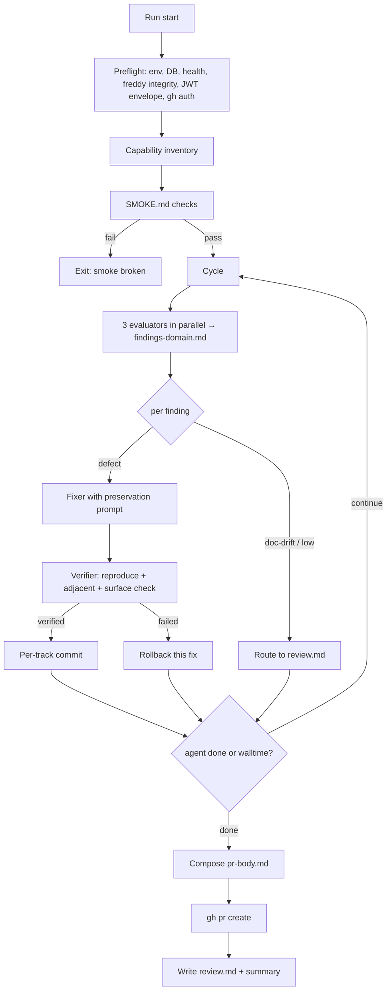

# Redesign QA Harness — Free-Roaming Preservation-First Agents, Per-Track Commits

## Overview

Replace the prescriptive test matrix with free-roaming agents that find narrowly defined defects (crashes, 5xx, console errors, self-inconsistencies, dead references) and preserve the app's existing surfaces. No external description — docstring, README, openapi, seed — has authority over app behaviour. When app and docs disagree, that's `doc-drift` for a human to reconcile, never a fix. Land verified fixes as per-track commits bundled into one auto-opened PR per run. Drop all agent-level caps; full tool access; `HARNESS_MAX_WALLTIME` is the only backstop. Ship the infra bugs from the 2026-04-19 session alongside so the redesign starts stable.

## Problem Frame

The matrix treats external expectations as authoritative spec → the fixer rewrites the app to match → "verified" fixes are contract rewrites. Removing the matrix alone doesn't fix this: any external description (docstring, openapi, seed, README) can play the same authoritative role, and the fixer will rewrite the app to match it instead. The redesign strips all external descriptions of authoritative status. The app is its own spec; the agent keeps it running and internally consistent; it never rewrites the app to match a document.

The same 2026-04-19 run also surfaced infra bugs (`git clean` deleting `.venv` symlink, stale console script, codex sandbox stripping PATH, per-cycle rollback nullifying verified work across tracks) which need to ship as Phase 1.

## Requirements

1. Delete `harness/test-matrix.md`. No external doc replaces it as spec.
2. `harness/SEED.md` — enumerative inventory of product surfaces, never prescriptive.
3. `harness/SMOKE.md` — 5–10 must-work flows used only as an abort gate; fixer never reads it.
4. Evaluator flags only five defect categories: crash, 5xx, console-error, self-inconsistency, dead-reference. App-vs-doc disagreement is `doc-drift`, never a defect.
5. Fixer is preservation-first: articulates what surrounding code / tests / git history expect, restores that, and never changes public surfaces (signatures, response shapes, endpoint contracts, CLI flags) to match any external doc. Discipline lives in the prompt, not in audit scaffolding.
6. Verifier reproduces the original defect (must no longer reproduce), exercises 2–3 adjacent capabilities (must be unchanged), and treats any change to a public surface adjacent to the fix as a regression.
7. Per-track commit gate. Each verified fix is its own commit on a per-run staging branch. One PR per run at the end. No auto-merge.
8. No agent-level caps. Full tool access (Playwright, curl, filesystem). Agent self-terminates via a stdout sentinel; `HARNESS_MAX_WALLTIME` is the only hard backstop.
9. Phase 1 infra must-fixes: preserve `.venv` / `node_modules` symlinks on rollback; regenerate `.venv/bin/freddy` and preflight it; append backend log; JWT envelope preflight; gitignore `harness/runs/`; drop the machine-local `/opt/homebrew/bin/{freddy,uvicorn}` shims.
10. Drop `max_cycles`, the convergence detector, and `--resume-*` flags.

## Scope Boundaries

**In scope:** `harness/` code and tests; `harness/SEED.md`; `harness/SMOKE.md`; `.gitignore`; codex profile docs under `docs/prompts/`.

**Out of scope (follow-on work):** app-level defects the redesigned harness will surface (live telemetry, billing API endpoints, stubbed route cleanup, portal/dashboard unify). Multi-engine fan-out. `docs/solutions/` scaffolding. A new root `AGENTS.md` or `CLAUDE.md`.

## Context

- Harness code: `harness/{run,engine,preflight,worktree,config,scorecard,prompts}.py`, `harness/prompts/*.md`, `harness/test-matrix.md` (to remove).
- Agent reading sources (for orientation, never spec): `README.md`, `CLAUDE.md` / `AGENTS.md` if present, `harness/SEED.md`, `cli/freddy/main.py` (Typer tree), `src/api/main.py` openapi, `frontend/src/lib/routes.ts`, `autoresearch/`.
- Agent must-not-read: `harness/runs/` (prior run artifacts would bias current findings), `node_modules/`, `.venv/`.
- Invariants from the prior harness migration plan (`docs/plans/2026-04-18-001-feat-harness-migration-plan.md`): codex profile contract (`sandbox_mode="danger-full-access"`, `shell_environment_policy.inherit="all"`), 3-track decomposition (A=CLI, B=API, C=Frontend), protected-files snapshot/restore over `harness/`, `tests/harness/`, `scripts/`.
- No prior `docs/solutions/` learnings — greenfield from a documented-learning perspective.

## Key Technical Decisions

**Preservation is the discipline; the prompts are the enforcement.** The fixer prompt tells the agent: identify the defect category from a closed list of five; articulate what the surrounding code expects; restore that; never change a function signature, response shape, endpoint contract, or CLI flag surface to match an external description; if app and docs disagree, record `doc-drift` and stop. We trust a well-written prompt. We do not add audit layers, classifiers, or confidence-tier machinery to enforce what the prompt already says.

**No limits; full freedom.** Playwright, curl, filesystem, process control. No token budgets, no per-domain wall-clock, no cycle count, no convergence detector. `HARNESS_MAX_WALLTIME` (4h default) is the only hard backstop. The agent self-terminates by emitting `HARNESS_SIGNAL: done reason=<x>` as its last stdout line; the orchestrator reads this from the evaluator log (same way it already extracts codex `thread_id`).

**Per-track commits, one PR.** Each verified fix commits independently to a per-run staging branch. At run end, `gh pr create` opens a single PR summarising all tracks. No squash. No auto-merge. Operator reviews and merges.

**SEED is inventory, not spec.** Lists product surfaces by area. Never says "should." The one exception is live session telemetry on the dashboard — user-decided to flag as must-work-today because the product needs it and it's currently absent.

**SMOKE is an abort gate.** Runs at preflight and each cycle start. Any failure = hard-abort with `exit_reason="smoke broken"`. Fixer never reads SMOKE.md.

## Open Questions

**Resolved:** preservation-first discipline lives in prompts; five-category defect enum; doc-drift as non-defect; no caps; per-track commits; PR per run; SEED = inventory; SMOKE = abort gate; engine = codex; resume semantics dropped.

**Deferred to implementation:** exact finding YAML shape (evolves with prompt tuning); adjacent-capability heuristic for verifier; frontend `routes.ts` parser (regex vs ts-morph); PR body template wording.

## High-Level Technical Design

## Implementation Units

### Phase 1 — Infra foundation

- [ ] **Unit 1.1: Commit session infra fixes + environment cleanup**

**Goal:** Ship the uncommitted bug fixes from the 2026-04-19 session plus hygiene.

**Files:**
- Modify: `harness/engine.py`, `harness/run.py`, `harness/worktree.py` (uncommitted fixes already in the working tree)
- Modify: `.gitignore` (add `harness/runs/`)
- Modify: `harness/worktree.py` (backend log open mode `"w"` → `"a"`)
- Delete: `/opt/homebrew/bin/{freddy,uvicorn}` (machine-local shims)
- Test: `tests/harness/test_run.py`, `test_worktree.py`

**Approach:** Commit the diffs already in the working tree (`_rollback_worktree` with `-e .venv …` excludes, `_commit_or_rollback` graceful-fail, `restart_backend` diagnostics, PATH-prepend in `engine.py`). Change the backend log mode in `worktree.py`. `rm -f` the shims.

**Test scenarios:**
- Existing `tests/harness/` suite passes (baseline 310 green).
- Rollback preserves `.venv` symlink (`git clean -fd -e .venv …`).
- Backend log survives across restart cycles (append).

**Verification:** `python -m pytest tests/harness/` green; `which freddy` resolves to `.venv/bin/freddy`.

---

- [ ] **Unit 1.2: Console-script integrity + preflight checks**

**Goal:** Regenerate `.venv/bin/freddy` (currently imports non-existent `freddy.main`) and add preflight checks for CLI integrity, JWT envelope, and `gh auth`.

**Files:**
- Modify: `harness/preflight.py` (add `validate_cli_integrity`, JWT envelope comparison, `gh auth status` check)
- Modify: `harness/README.md` (bootstrap note: `uv pip install -e .`)
- Test: `tests/harness/test_preflight.py`

**Approach:** `validate_cli_integrity` runs `.venv/bin/freddy --help`; on non-zero or missing binary, raise `PreflightError` with `uv pip install -e .` guidance. JWT envelope: compare `check_jwt_expiry(token)` vs `max_walltime + 600s` padding; shortfall → `PreflightError`. `gh auth status` check — shortfall → `PreflightError` (Unit 4.2 depends on a working gh).

**Test scenarios:**
- `freddy --help` exits 0 → CLI integrity passes.
- Simulated stale script → raises with actionable message.
- JWT TTL < max_walltime + 600s → raises with both values.
- `gh` not authenticated → raises with guidance.

**Verification:** Running harness against a fresh clone produces clean preflight errors when any prereq is missing, instead of silent mid-run failures.

---

- [ ] **Unit 1.3: Rollback isolation for `clients/`**

**Goal:** Replace the `clients/` main-repo symlink with a per-worktree directory so fixer-created state dies with the worktree.

**Files:**
- Modify: `harness/worktree.py` (`_symlink_if_exists` → `mkdir -p` for `clients/`)
- Test: `tests/harness/test_worktree.py`

**Approach:** Worktree starts with empty `clients/`. If SMOKE needs a seed client, the smoke runner creates it (Unit 2.2). Previously-symlinked main-repo state is no longer visible to the agent.

**Test scenarios:**
- Worktree `clients/` is a directory, not a symlink.
- Writing a client inside the worktree does not appear in the main repo's `clients/`.

**Verification:** Main repo `clients/` is untouched by any run.

---

### Phase 2 — Replace the matrix

- [ ] **Unit 2.1: Capability inventory generator**

**Goal:** Auto-derive a markdown inventory of app surfaces per-run; feed to evaluator context.

**Files:**
- Create: `harness/inventory.py`
- Create: `tests/harness/test_inventory.py`
- Modify: `harness/preflight.py` (invoke after health checks)

**Approach:** Four sections. CLI via Typer introspection, recursing into `app.registered_groups` for subgroup leaves. API via in-process `from src.api.main import create_app; create_app().openapi()` (reuse `scripts/export_openapi.py`'s `_ensure_env_defaults`). Frontend via regex parse of `ROUTES` and `LEGACY_PRODUCT_ROUTES` in `frontend/src/lib/routes.ts`. Autoresearch via `autoresearch/` scan for subdirs containing `run.py`. Writes to `harness/runs/<ts>/inventory.md`. Regenerates every run.

**Test scenarios:**
- Inventory contains `client new` (a Typer subgroup leaf — forces recursion), `POST /v1/sessions`, `/dashboard/sessions`, an autoresearch session.
- Missing `routes.ts` → section gracefully marked absent; inventory still produced.

**Verification:** Generated file < 50KB, valid markdown, consumed by evaluator prompt without parse errors.

---

- [ ] **Unit 2.2: `SEED.md` + `SMOKE.md` + smoke runner**

**Goal:** Author the two anchor documents and the abort-gate runner.

**Files:**
- Create: `harness/SEED.md`, `harness/SMOKE.md`
- Create: `harness/smoke.py`, `tests/harness/test_smoke.py`
- Modify: `harness/run.py` (smoke at cycle start) and `harness/preflight.py` (smoke post-preflight)

**Approach:** SEED lists product surfaces by area (agency workflows, research/intelligence, platform, client plane) with one line per surface — enumerative, never "should." Explicit preservation-first principle statement and the five defect categories at the top. SMOKE lists 5–10 deterministic flows (`freddy --help` exits 0, `GET /health` 200, `POST /v1/api-keys` returns a key, frontend `/` loads without console errors, `freddy client new …` exits 0). `smoke.py` parses SMOKE.md, runs each check, raises `SmokeError` on any failure. `run.py` and `preflight.py` catch it and exit with `exit_reason="smoke broken"`.

**Test scenarios:**
- All checks pass → smoke runner returns clean.
- One fails → `SmokeError` with failing id; orchestrator aborts cleanly.
- Empty SMOKE.md → treated as pass.

**Verification:** Killing the backend mid-run between cycles produces a loud `smoke broken` abort with the failing check named.

---

### Phase 3 — Free-roaming preservation-first agents

- [ ] **Unit 3.1: Rewrite all agent prompts + finding schema**

**Goal:** One coherent rewrite of evaluator / fixer / verifier prompts. The agents carry preservation discipline through their prompts; the harness orchestrates without enforcement scaffolding.

**Files:**
- Rewrite: `harness/prompts/evaluator-base.md`, `evaluator-track-{a,b,c}.md`, `fixer.md`, `verifier.md`
- Modify: `harness/prompts.py` (render functions feed SEED + inventory + docs; drop all matrix references)
- Modify: `harness/scorecard.py` (remove matrix-dependent helpers `parse_flow4_capabilities`, `parse_track_capabilities`)
- Modify: `harness/run.py` (drop matrix-loading code paths; findings read directly from the file the evaluator writes)
- Delete at end of this unit: `harness/test-matrix.md`
- Update: `tests/harness/` (adjust affected suites)

**Approach — evaluator:** instruct the agent to explore freely with full tool access; enumerate the five defect categories (crash, 5xx, console-error, self-inconsistency, dead-reference); enumerate explicitly what is NOT a defect (disagreement with docstring / README / openapi / SEED = `doc-drift`, route to review); emit findings in markdown with YAML front-matter including `category`, `confidence`, `evidence`, `reproduction`. When the cycle is complete, end output with `HARNESS_SIGNAL: done reason=<x>`.

**Approach — fixer:** only act on findings with defect categories (skip `doc-drift` and low-confidence, record them to `disputed-<domain>.md`). Before any change: articulate what the surrounding code / tests / git history expect and show how the proposed fix restores that. Never change a function signature, response shape, endpoint contract, or CLI flag surface to match any external description. If app and docs disagree, record `doc-drift` and stop. Scope allowlist: `src/`, `cli/`, `frontend/src/`, `autoresearch/`. Never touch `tests/`, `harness/`, `pyproject.toml`, `package.json`. The harness manages the stack; do not run uvicorn/vite yourself.

**Approach — verifier:** reproduce the original finding (must no longer reproduce); exercise 2–3 adjacent capabilities (must be unchanged); flag as FAILED if any adjacent surface changed shape. One verifier per track (not per finding) — matches existing concurrency shape. Emits per-finding verdicts.

**Test scenarios:**
- Evaluator on a deliberately-crashed router surfaces `category: crash` with a traceback.
- Evaluator on a docstring-vs-code disagreement surfaces `category: doc-drift` (never routed to fixer).
- Fixer on a null-deref fixes it preserving the function signature.
- Fixer tempted to add a `--name` flag to match a docstring records `doc-drift` instead.
- Verifier catches an adjacent regression introduced by an otherwise-successful fix.

**Verification:** No prompt file references `test-matrix.md`. A dry-run produces findings of all three routes (defect → fixer, doc-drift → review, low → review) correctly.

---

- [ ] **Unit 3.2: Remove cycle caps, convergence, resume**

**Goal:** Drop explicit termination mechanisms. Agent self-terminates via stdout sentinel; walltime and no-progress safety net handle edge cases.

**Files:**
- Modify: `harness/config.py` (remove `max_cycles`, `resume_branch`, `resume_cycle`)
- Modify: `harness/run.py` (loop runs until sentinel / walltime / no-progress)
- Modify: `harness/engine.py` (scan evaluator logs post-exit for `HARNESS_SIGNAL: done`, matching existing `thread_id` extraction)
- Delete/trim: `tests/harness/test_convergence.py`

**Approach:** Orchestrator inspects each cycle's evaluator log after the evaluator exits. Any `HARNESS_SIGNAL: done` line → loop breaks with `exit_reason="agent-signaled-done"`. No sentinel AND two consecutive cycles with zero new `high` findings → break with `no-progress`. `HARNESS_MAX_WALLTIME` breaks at any point.

**Test scenarios:**
- Sentinel present → clean termination.
- No sentinel, 2 cycles of zero new highs → `no-progress` termination.
- No sentinel, walltime reached → `wall-time cap` termination.

**Verification:** A run self-terminates without a cycle count; loop cannot run forever.

---

### Phase 4 — Commit pipeline

- [ ] **Unit 4.1: Per-track commit gate**

**Goal:** Replace all-or-nothing per-cycle commits with per-fix commits on a per-run staging branch.

**Files:**
- Modify: `harness/run.py` (rewrite `_commit_or_rollback` for per-fix commits applied serially within a track)
- Tests: update `tests/harness/test_run.py`

**Approach:** Within a track, apply verified fixes serially against a monotonically advancing HEAD. Each fix captures `pre_fix_sha`, `git add -- <files>`, `git commit -m "harness: fix F-<id> — <capability> (<surface>)"`. On `git apply`/commit conflict for a later fix, rollback only that fix and record `conflict-deferred` in review. Cross-track application stays parallel-safe because tracks have disjoint allow-list paths. Reuse `_rollback_worktree` from Unit 1.1. No squash. After the last per-finding commit across all tracks lands, re-run SMOKE.md once against the staging-branch tip — serial-applied stacked fixes can leave the tip unbuildable even when each fix verified in isolation. Record the result in review.md's tip-smoke status; do not block PR creation on tip-smoke failure, but flag it prominently so reviewers don't merge something that worked per-fix but not in aggregate.

**Test scenarios:**
- 3 verified in Track A, 1 in C → 4 commits, no rollbacks.
- 2 verified + 1 failed in Track A → 2 commits, per-fix rollback of the failed one.
- Stacked fixes collide → earlier wins, later rolled back as `conflict-deferred`.

**Verification:** `git log --oneline <staging>` shows one commit per verified finding, in dispatch order.

---

- [ ] **Unit 4.2: PR per run**

**Goal:** Compose a PR body and open a single PR for the run.

**Files:**
- Modify: `harness/run.py` (add `_open_pr` helper — not a separate module)
- Write at run-end: `harness/runs/<ts>/pr-body.md`

**Approach:** At run end, compose markdown PR body with run metadata and per-track sections (verified findings with summary, files touched, verifier evidence). Write to `pr-body.md` BEFORE invoking `gh` — if `gh` fails, operator has a ready-to-use body. Invoke `gh pr create --title "harness: run <ts> — <N> fixes" --body-file harness/runs/<ts>/pr-body.md --head <staging>`. `gh auth` is preflight-checked (Unit 1.2). Optional `--prune-stale-branches` CLI flag: at run start, iterate local `harness/run-*` branches authored by the current user and delete those with no corresponding open PR (`gh pr list --head <branch>` empty). Never pushes to remote; never deletes branches whose worktree still exists on disk (respects the keep-on-failure guarantee in Unit 5.1). Off by default.

**Test scenarios:**
- 3 verified findings → `gh pr create` called successfully; PR URL returned.
- Zero verified → no PR, staging branch deleted, log "nothing to PR".
- `gh` error → exit with `gh failed`; pr-body.md preserved.

**Verification:** A run produces a reviewable PR on GitHub with finding/fix/evidence sections rendering correctly.

---

### Phase 5 — Observability

- [ ] **Unit 5.1: Run artifacts + review.md**

**Goal:** Capture the forensic data that makes the harness debuggable.

**Files:**
- Modify: `harness/run.py` (capture `git diff pre_fix_sha HEAD -- <files>` as `fix-diffs/F-<id>.patch` before each rollback; compose `review.md` at run end as an inline helper function — not a separate module)
- Modify: `harness/worktree.py` (`cleanup_staging_worktree` skips on non-success; new `chmod 0700` on worktree create to prevent cross-user leakage)
- Modify: `harness/config.py` (`keep_worktree: bool = False`)

**Approach:** `review.md` sections: run metadata; documentation drift (doc-drift findings aggregated from all tracks); disputed (fixer preservation-uncertain); low-confidence; rolled-back fixes with patch links; scope violations; tip-smoke status. End-of-run stdout summary is 10 lines: commits, findings by category, PR URL, exit reason, duration. Regex-scrub JWTs / bearer tokens / API-key-shaped strings before writing either review.md or pr-body.md.

**Test scenarios:**
- Rolled-back fix produces a readable `.patch` file.
- Failed run preserves worktree; operator sees path in stderr.
- `--keep-worktree` on success preserves anyway.
- API-key-shaped string in evidence is scrubbed before `review.md` / `pr-body.md`.

**Verification:** Post-run, `harness/runs/<ts>/review.md` + `fix-diffs/` contain everything needed to understand what happened without replaying logs.

---

## System-Wide Impact

- `harness/run.py` grows: per-track commits, PR composition, review composition, smoke integration, sentinel-based loop termination. No new scaffolding modules for PR/review work — inline helpers.
- `harness/engine.py` small addition: sentinel parsing (post-exit log scan).
- `harness/preflight.py` adds: CLI integrity, JWT envelope, `gh auth`, post-preflight SMOKE.
- New modules: `harness/inventory.py`, `harness/smoke.py` (both genuinely reusable).
- Deleted: `harness/test-matrix.md`, `parse_flow4_capabilities`, `parse_track_capabilities`, `max_cycles` + `resume_*` config fields.
- Prompt files fully rewritten — discipline lives here, not in audit code.
- Unchanged invariants: codex profile contract, 3-track decomposition, protected-files snapshot/restore, JWT minting via GoTrue, worktree pattern.

## Risks

| Risk | Mitigation |
|---|---|
| Fixer warps app to match external docs | Preservation discipline in the fixer prompt; verifier regression check catches surface changes. First PR is human-reviewed. If runs keep landing warped fixes, the prompt is wrong — tune the prompt. |
| Evaluator over-reports doc-drift | Category enum is closed; doc-drift routes to review, never fixer. Low operational cost. |
| Agent never emits termination sentinel | No-progress safety net (2 cycles zero new highs → terminate); walltime backstop. |
| Fixer writes outside worktree | Scope allowlist in prompt; `git status` post-fix audit. Optional `find $HOME -newer` sweep if this becomes an observed issue. |
| `gh pr create` fails mid-run | `pr-body.md` written first; operator PRs manually. `gh auth status` preflight catches unconfigured gh. |
| SEED drifts from product | Low impact — SEED is inventory, not spec. Stale SEED misses exploration but doesn't warp fixes. |

## Phased Delivery

- **Phase 1** (3 units) — infra foundation. Ships first, single PR.
- **Phase 2** (2 units) — inventory generator + SEED/SMOKE authoring. Ships second.
- **Phase 3** (2 units) — preservation prompts + cap removal. Biggest risk; validate with at least one dry-run before merging.
- **Phase 4** (2 units) — per-track commits + PR flow. Depends on Phase 3.
- **Phase 5** (1 unit) — observability. Ships last.

10 units total.

## Documentation

Update `harness/README.md` after each phase to reflect new concepts. Rewrite `docs/prompts/harness-bootstrap-agent.md` at the end of Phase 3 to match the new run shape (no matrix, no cycle count, SEED + SMOKE present).

## Operational Notes

- Internal tooling only; no production deploy, no user-visible impact.
- Operators on other machines: `uv pip install -e .`, verify `gh auth status` returns 0, remove any stale `/opt/homebrew/bin/{freddy,uvicorn}` shims they may have.
- First full run after Phase 3 will likely surface real product defects (live telemetry absent, billing endpoints 404, stubbed routes). That PR is product work, separate from harness work.

## Sources

- Session context (2026-04-19, 2026-04-20): the working conversation that produced this design, including capability audit, design decisions, and reviewer deepening.
- Prior plan: `docs/plans/2026-04-18-001-feat-harness-migration-plan.md` — defines invariants this redesign preserves.
- Related code: `harness/*`, `cli/freddy/main.py`, `src/api/main.py`, `src/api/routers/*.py`, `scripts/export_openapi.py`, `frontend/src/lib/routes.ts`, `autoresearch/`.
