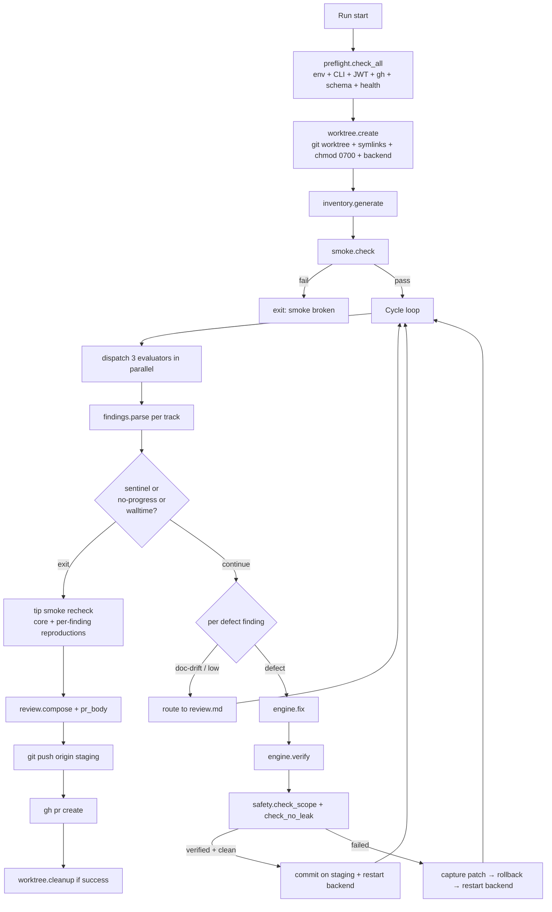

# Rewrite QA Harness Greenfield — Preservation-First Agents, ~1,350 LOC Target

## Overview

Replace `harness/` with a rewritten-from-scratch version: ~1,350 production lines across 13 focused modules, down from 4,839 lines across 9 files. Implements the free-roaming preservation-first design from the prior plan as a greenfield build. Every safety net and invariant is preserved; the reduction comes from removing dead matrix scaffolding and pristine-Freddy-copy code that a six-agent audit identified as inherited weight.

Delivery model: **one PR**. The prior plan's Phase 1 (infra foundation) is absorbed into the rewrite — those nine behaviours get built into the new modules directly, not patched into the old harness first. See the Phase 1 section under Implementation Units for the pre-commit gate that verifies every Phase 1 invariant is present in the rewrite before cut-over.

## Problem Frame

The prior plan was framed as a refactor — "Modify `harness/X.py`" per unit — which systematically underestimates bloat. An audit confirmed ~1,688 lines are dead or vestigial (matrix-dependent utilities, duplicated subprocess machinery, never-reaped process groups, heavy snapshot/restore scaffolding). Three of the largest files (`scorecard.py`, `prompts.py`, `engine.py`) are pristine Freddy copies with ≤2% GoFreddy adaptation. Surgical cuts leave that weight in place; greenfield does not.

Surgical application of the prior plan produces ~14% reduction. Greenfield produces ~72% with the same safety profile. The greenfield approach is also cleaner: writing to GoFreddy's shape from scratch produces code that matches the app, instead of a hybrid of Freddy scaffolding and GoFreddy edits.

## Scope

**In scope:** all of `harness/` (production code, prompt markdown, SEED, SMOKE, README), `tests/harness/` (delete old, minimal new suite), `.gitignore` entries, `docs/prompts/harness-bootstrap-agent.md` rewrite.

**Out of scope:** product defects the new harness will surface (live telemetry, billing 404s, stubbed routes, portal/dashboard unify) — separate product PRs; multi-engine fan-out; `docs/solutions/` scaffolding; top-level `AGENTS.md`/`CLAUDE.md`.

**Blast radius:** this plan touches no code under `src/`, `cli/`, `frontend/`, or `autoresearch/`. Outside `harness/` and `tests/harness/`, the only file modified is `docs/prompts/harness-bootstrap-agent.md`.

## Requirements

All requirements from the prior plan carry forward; greenfield adds six more:

- Delete `harness/test-matrix.md`. No external doc replaces it as spec.
- `harness/SEED.md` is enumerative inventory of product surfaces, never prescriptive.
- `harness/SMOKE.md` is an abort gate: 5–10 deterministic must-work flows. Fixer never reads it.
- Evaluator flags only five defect categories: crash, 5xx, console-error, self-inconsistency, dead-reference. App-vs-doc disagreement is `doc-drift`, never a defect.
- Fixer preservation-first: articulates what surrounding code / tests / git history expect, restores that, never changes public surfaces (signatures, response shapes, endpoint contracts, CLI flags) to match an external doc. Discipline lives in the prompt.
- Verifier reproduces the original defect, exercises 2–3 adjacent capabilities, treats any adjacent surface shape change as a regression.
- Per-track commit gate: each verified fix is its own commit on a per-run staging branch; one PR per run; no auto-merge.
- No agent-level caps: full tool access (Playwright, curl, filesystem, CLI). Three termination backstops — agent sentinel (written to `run_dir/track-<x>/cycle-<n>/sentinel.txt`, not stdout), `HARNESS_MAX_WALLTIME` (4h), no-progress detector (two consecutive cycles with zero new high-confidence defect findings AND zero commits landed).
- Drop `max_cycles`, the convergence detector, and `--resume-*` flags.
- Rewrite greenfield to the 13-module layout below. Every existing invariant maps explicitly; no silent loss.
- Embody every Phase 1 infra behaviour in the rewritten modules from first write: symlink-preserving rollback, CLI integrity preflight, JWT envelope check, `chmod 0700`, per-worktree `clients/`, graceful rollback, backend log append, `gh auth` preflight, no Vite JWT refresh code.
- Replace heavyweight outcome scaffolding (protected-files snapshot/restore, main-repo leak guard, `ProcessTracker`) with lightweight equivalents (`git diff` scope check, `git status` leak check, inline atexit+signal handlers).
- Codex engine only. No claude branching. Strategy pattern if multi-engine is ever needed.
- Tests are not a blocker. Target ~500–800 test lines focused on state-corruption paths (worktree lifecycle, rollback, safety checks, findings parse, preflight fail-loud). Orchestrator integration, prompt rendering, and engine subprocess tests are out of scope.

## Key Technical Decisions

1. **Greenfield over surgical refactor.** Audit showed surgical cuts leave ~1,000+ lines of Freddy scaffolding in pristine files. Writing fresh to GoFreddy's shape is clearer and cheaper.
2. **Discipline in prompts, not scaffolding.** Fixer prompt enumerates what never to change. No classifiers, audit layers, or confidence-tier machinery. Trust the agent; verify outcomes via lightweight post-fix checks.
3. **Closed five-defect enum.** `crash`, `5xx`, `console-error`, `self-inconsistency`, `dead-reference` go to fixer. `doc-drift` and `low-confidence` route to `review.md` for human judgement.
4. **Full tool access, three termination paths.** Sentinel + walltime + no-progress. No cycle counts, no convergence detection, no token budgets.
5. **Per-track commits, one PR.** Each verified fix is its own commit on `harness/run-<ts>` staging branch. `gh pr create --head <staging>` at run end. No auto-merge. Tip-smoke recheck runs once against staging HEAD; failure flags prominently but does not block PR creation.
6. **Three-track decomposition preserved** (A=CLI, B=API, C=Frontend). Parallelism, blast-radius isolation via per-track path allowlists, domain-specialised evaluator prompts. Collapse to one agent is revisitable but not undertaken here.
7. **Lightweight post-fix outcome checks** in `safety.py`: `git diff --name-only <pre_sha> HEAD` against per-track allowlist (scope), `git status --porcelain` on main repo (leak). Same coverage as current 177-line snapshot/restore machinery.
8. **Unconditional backend restart post-fix.** Replaces SHA-1 snapshot-and-diff conditional restart. Adds 3–5s per fix; removes ~50 lines of fragile hashing.
9. **Codex only.** Drops ~50 lines of engine dispatch across engine.py and prompts.py.
10. **SEED is inventory, not spec; SMOKE is abort gate.** SEED has no "should" language. SMOKE runs at preflight + cycle start. Any SMOKE failure hard-aborts with `exit_reason="smoke broken"`.
11. **Findings are YAML-front-matter markdown written by the evaluator directly.** No intermediate scorecard aggregation, no multi-cycle grade-delta tracking, no escalation attempt counter. No-progress detector handles "agent can't make progress."
12. **Tests targeted, not comprehensive.** State-corruption paths only. ~400–600 lines total across 5 files (findings, worktree, safety, preflight, smoke). Integration is validated by running the real harness.
13. **Drop `cleanup_harness_state`.** Not carried into the rewrite. Reintroduce only if DB accumulation becomes a real operational problem; rewrite with parameterised queries at that point.
14. **Serial fixer execution within a track.** Start serial; add parallelism only if cycle wall-time becomes an issue in real runs.
15. **Regex parser for `frontend/src/lib/routes.ts`.** Start with regex in `inventory.py`; upgrade to `ts-morph` only if fragility shows in practice.

## Deferred to Implementation

- Exact content of rewritten prompt files — evolve with real runs; ship first version in Unit 2D.
- Exact SEED.md contents — ship first version in Unit 2E covering agency workflows / research & intelligence / platform / client plane.
- Exact SMOKE.md check set — start with 5 checks (CLI help, backend /health, API key mint, frontend load without console errors, CLI client-new), expand as needed.
- PR-body wording — start minimal in `review.py`, evolve with operator feedback.

## Module Layout

```
harness/
├── __main__.py          ~10 lines   entry point
├── cli.py               ~40 lines   argparse
├── config.py            ~60 lines   Config dataclass
├── run.py               ~250 lines  orchestrator
├── preflight.py         ~200 lines  env + CLI + JWT + gh + DB setup
├── worktree.py          ~140 lines  git worktree + backend lifecycle + atexit
├── inventory.py         ~170 lines  auto-generate app surface doc
├── smoke.py             ~90 lines   SMOKE.md parser + runner
├── engine.py            ~210 lines  codex subprocess wrapper + transient-error retry
├── findings.py          ~80 lines   Finding dataclass + YAML parse/route
├── prompts.py           ~50 lines   template substitution
├── review.py            ~80 lines   review.md + pr-body.md composition
├── safety.py            ~40 lines   post-fix scope + leak checks
├── SEED.md                          app inventory (markdown)
├── SMOKE.md                         must-work flows (markdown)
├── README.md                        rewrite to match new shape
└── prompts/
    ├── evaluator-base.md
    ├── evaluator-track-{a,b,c}.md
    ├── fixer.md
    └── verifier.md
```

Target: ~1,420 production LOC. No module >250 lines.

## Runtime Flow



## Safety Net Preservation

Every safety property from the current harness has a mapped location in the new structure:

| Safety concern | New location |
|---|---|
| Fixer edits `harness/`, `tests/`, `pyproject.toml` | `safety.check_scope` — git diff against per-track allowlist |
| Fixer writes outside worktree | `safety.check_no_leak` — git status on main repo |
| Fixer introduces regression in adjacent capability | Verifier prompt (unchanged) |
| Fixer changes public surface shape | Verifier prompt (unchanged) |
| Run never terminates | Sentinel + `max_walltime` + no-progress (inline in `run.py`) |
| App-vs-docs disagreement warps app | Fixer prompt preservation-first + five-defect enum + `doc-drift` route |
| Orphan processes on Ctrl+C | Inline atexit + signal handlers in `worktree.create` |
| Backend serves stale code after fix | Unconditional `worktree.restart_backend` post-fix |
| Staging-branch tip unbuildable in aggregate | `smoke.check` on staging HEAD before PR |

New checks added by Phase 1 (JWT envelope, CLI integrity, gh auth, per-run DB cleanup) live in `preflight.py`.

## Implementation Units

Organised by dependency layer. Each unit is one logical commit.

### Phase 1 — Phase 1 behaviours absorbed into the rewrite (no separate PR)

The prior plan's Phase 1 (`docs/plans/2026-04-20-001-...md` Units 1.1–1.3) described nine infra fixes that were intended to ship as a standalone PR against the old harness. Because this rewrite replaces the old harness wholesale in one PR, Phase 1 **does not ship separately** — the nine behaviours are embodied directly in the new modules from first write. They remain hard invariants of the rewrite; an implementer must confirm all are present before declaring Unit 6A ready.

Behaviours that must be in the new code:
- Symlink-preserving rollback (`git clean -fd -e .venv -e node_modules -e clients`) — in `worktree.rollback_to` (Unit 3B)
- `chmod 0700` on worktree creation — in `worktree.create` (Unit 3B)
- Per-worktree `clients/` as a directory (not a symlink) — in `worktree.create` (Unit 3B)
- Backend log opened in append mode (`"a"`) — in `worktree.restart_backend` (Unit 3B)
- Graceful rollback (no `check=True` on git subprocess calls that may legitimately fail) — throughout `worktree.py` and `run.py` (Units 3B, 5A)
- CLI integrity preflight (`.venv/bin/freddy --help` exits 0 else `uv pip install -e .` guidance) — in `preflight._check_cli_integrity` (Unit 4A)
- JWT envelope preflight (TTL ≥ `max_walltime + 600`) — in `preflight._check_jwt_envelope` (Unit 4A)
- `gh auth status` preflight — in `preflight._check_gh_auth` (Unit 4A)
- No Vite JWT refresh code anywhere — enforced by never writing it into the new `preflight.py` (Unit 4A)

Pre-commit gate for Unit 6A, run against the rewrite branch before the atomic cut-over commit:

```
grep -q 'git clean.*-e \.venv.*-e node_modules.*-e clients' harness/worktree.py
grep -q "chmod.*0o700" harness/worktree.py
grep -q "mkdir.*clients" harness/worktree.py
grep -q 'open.*backend\.log.*"a"' harness/worktree.py
grep -q "_check_cli_integrity" harness/preflight.py
grep -q "_check_jwt_envelope" harness/preflight.py
grep -q "_check_gh_auth" harness/preflight.py
! grep -rq "refresh_vite_jwt\|check_vite_jwt_freshness" harness/  # no Vite code
grep -q "harness/runs/" .gitignore
```

### Phase 2 — Foundation

- [ ] **Unit 2A: `harness/findings.py`** — Create the Finding type and YAML parser. Frozen dataclass with fields `id`, `track` (a/b/c), `category` (five defect types + `doc-drift` + `low-confidence`), `confidence` (high/medium/low), `summary`, `evidence`, `reproduction`, `files`. Module constant `DEFECT_CATEGORIES`. `parse(path, sentinel=None) -> list[Finding]` reads YAML-front-matter markdown, one finding per block. `route(findings) -> (actionable, review)` partitions by category + confidence (actionable = DEFECT_CATEGORIES ∩ confidence="high"). PyYAML. Target ~80 lines. Test: happy-path parse round-trip + edge cases (empty, malformed YAML); `route` partition disjoint against mixed fixture.

- [ ] **Unit 2B: `harness/config.py`** — Create the new Config dataclass. Frozen. Fields: `codex_eval_profile` (default `"harness-evaluator"`), `codex_fixer_profile` (default `"harness-fixer"`), `codex_verifier_profile` (default `"harness-verifier"`) — matching the profile names in `~/.codex/config.toml`; `max_walltime` (14400), `tracks` (["a","b","c"]), `backend_port`, `backend_cmd`, `backend_url`, `frontend_url`, `staging_root`, `keep_worktree` (False), `jwt_envelope_padding` (600). `from_cli_and_env(args, env) -> Config` builder: calls `python-dotenv` to load `.env` into process env before reading, then env overrides defaults. Module constant `REQUIRED_ENV_VARS = ("DATABASE_URL", "SUPABASE_URL", "SUPABASE_ANON_KEY", "SUPABASE_JWT_SECRET", "GEMINI_API_KEY")` — `GEMINI_API_KEY` is the actual name the app reads (not `GOOGLE_API_KEY`); no `HARNESS_TOKEN` required up-front (minted by preflight). Target ~60 lines. Test: defaults + env override + missing required var raises `ConfigError` with key name + frozen assignment raises.

- [ ] **Unit 2C: `harness/prompts.py`** — Template substitution only. Three public functions: `render_evaluator(track, cycle, run_dir, wt_path)`, `render_fixer(finding, run_dir)`, `render_verifier(finding, run_dir)`. Each reads corresponding markdown under `harness/prompts/`, applies `{placeholder}` substitution with `str.replace`, writes rendered prompt to a tempfile under `run_dir`, returns path. SEED + inventory appended to evaluator prompts only. No cycle branching, no scope blocks, no grade-delta, no attempt-tracker. Target ~50 lines. No tests required per R15.

- [ ] **Unit 2D: Prompt content — `evaluator-*.md`, `fixer.md`, `verifier.md`** — Author the six prompt files that carry preservation-first discipline.
  - `evaluator-base.md`: preservation-first preamble; full tool access; five-defect enum; finding YAML schema; self-terminate by writing one line (`done reason=<x>`) to `{sentinel_path}` — the harness reads this file, not stdout. Placeholders: `{track}`, `{cycle}`, `{worktree}`, `{findings_output}`, `{sentinel_path}`, `{seed}`, `{inventory}`.
  - `evaluator-track-{a,b,c}.md`: one short section per track naming primary surfaces (CLI / API / Frontend) and investigation tools. No prescribed flows.
  - `fixer.md`: scope allowlist per track (A → `cli/freddy/` plus `pyproject.toml` for console-script fixes; B → `src/` and `autoresearch/` at repo root; C → `frontend/` including `package.json`, `vite.config.ts`, `package-lock.json`; never `tests/` or `harness/`); act on five-defect enum only; articulate surrounding-code expectations before any change; never change signatures/shapes/contracts/flags to match external docs; do not manage stack.
  - `verifier.md`: **reproduction gate** — first reproduce the defect against `pre_sha` state (check out the fix's `pre_sha` in an ephemeral worktree or `git stash` the fix) and confirm the defect manifests; if the reproduction does not fail on `pre_sha`, the finding's reproduction is broken — emit `verdict=reproduction-broken` and route to `review.md`. Then reproduce on HEAD (with the fix applied) — if the defect still manifests, `verdict=failed`. Then exercise 2–3 adjacent capabilities; if any public surface shape changed, `verdict=failed`. Verdict YAML: `verdict` (verified|failed|reproduction-broken), `reason`, `adjacent_checked`, `surface_changes_detected`.
  - Verification: grep confirms no prompt references `test-matrix.md`, `phase`, `scope_override`, `grade-delta`, `escalation`, or `max_cycles`; fixer has explicit preservation paragraph; verifier has pre_sha reproduction gate + adjacent + surface-change paragraphs.

- [ ] **Unit 2E: `harness/SEED.md` + `harness/SMOKE.md`** — Author the two anchor documents.
  - SEED.md: preamble ("inventory, not spec; never prescriptive; fixer never reads this"). Four sections (Agency workflows, Research/intelligence, Platform, Client plane), surfaces enumerated one-per-line, no "should"/"must"/"required" language. One documented exception: live session telemetry on the dashboard, flagged as must-work-today (product need, currently absent — first real run will surface this correctly).
  - SMOKE.md: preamble ("abort gate only; any failure = hard abort; fixer never reads this"). 5 checks in YAML-block-per-check format — `smoke-cli` (`.venv/bin/freddy --help` exits 0), `smoke-api-health` (`GET /health` 200), `smoke-api-key` (`POST /v1/api-keys` returns JSON with `key` field), `smoke-frontend` (Playwright loads `/` without console errors), `smoke-cli-client-new` (`.venv/bin/freddy client new smoke-check-<ts>` exits 0).

### Phase 3 — Infrastructure

- [ ] **Unit 3A: `harness/engine.py`** — Thin codex subprocess wrapper with transient-error retry. ~210 lines.

**Public surface:** `evaluate(config, track, wt, cycle, run_dir) -> list[Finding]`, `fix(config, finding, wt, run_dir) -> Path`, `verify(config, finding, wt, run_dir) -> Verdict`. `Verdict` dataclass with `verified: bool`, `reason`, `adjacent_checked`, `surface_changes_detected`; `Verdict.parse(path)` reads the YAML the verifier wrote.

**Internals:** `_run_codex(profile, prompt_path, sentinel_path, wt, output_path)` assembles env with `PATH=<wt>/.venv/bin:${PATH}`, invokes `codex exec --profile <profile>` with the prompt piped via stdin (`stdin=open(prompt_path)`, matching current working code), captures stdout+stderr to `output_path.with_suffix(".log")`, timeout=None (walltime is global). `_read_sentinel(sentinel_path)` returns the reason string if the file exists and contains `done reason=<x>`, else None. `_extract_thread_id(output)` pulls codex thread id from log.

**Transient-error retry.** Single retry loop shared by all three public functions. After `_run_codex`, if exit is non-zero AND log contains any of `429`, `stream disconnected`, `Reconnecting`, `overloaded`, `rate limit`, `503`, `502`, retry up to 3 times with exponential backoff (5s, 30s, 120s). All other non-zero exits bubble up immediately. ~30 LOC for the retry helper.

**Test:** `_read_sentinel` finds `done reason=agent-signaled-done` in a file; returns None if file missing; `_run_codex` assembles command with correct profile + PATH prefix and pipes stdin from prompt file; retry helper retries 3× on synthetic "429" log then gives up.

**Verification:** `engine.py` ~210 lines. No claude branching. No duplicate retry logic between evaluate/fix (single shared helper).

- [ ] **Unit 3B: `harness/worktree.py`** — Git worktree + backend lifecycle + exit cleanup. ~140 lines.

**Dataclass:** `Worktree(path, branch, backend_proc)`.

**Functions:**
- `create(ts, config) -> Worktree` — `git worktree add -b harness/run-<ts> <path> HEAD`; symlink `.venv` and `node_modules` from main repo; `mkdir clients/`; `chmod 0700`; call `restart_backend`; register atexit + SIGTERM + SIGINT handlers.
- `cleanup(wt)` — terminate backend, `git worktree remove --force`, `git branch -D`.
- `restart_backend(wt, config) -> Popen` — terminate old if any, `_kill_port(backend_port)`, spawn uvicorn with `cwd=wt.path`, `PATH=<wt>/.venv/bin:...`, `start_new_session=True`, log to `wt.path/backend.log` in append mode; poll `/health` for 40s.
- `rollback_to(wt, sha)` — `git reset --hard <sha>` + `git clean -fd -e .venv -e node_modules -e clients`.
- `_kill_port(port)` — lsof -ti + SIGTERM → 5s grace → SIGKILL.

**Test:** `create` produces dir with symlinks + clients/ dir + mode 0700; `rollback_to` preserves `.venv`/`node_modules`/`clients` symlinks (regression catcher); `cleanup` removes worktree + branch; backend termination uses SIGTERM+grace+SIGKILL cascade.

**Verification:** `worktree.py` < 160 lines. No protected-files code. No main-repo-leak-guard code. No `ProcessTracker` class.

- [ ] **Unit 3C: `harness/safety.py`** — Post-fix scope + leak checks. ~40 lines.

Module constant `SCOPE_ALLOWLIST: dict[str, re.Pattern]` — a→`^(cli/freddy/|pyproject\.toml$)` (CLI plus console-script entry); b→`^(src/|autoresearch/)` (app code plus the repo-root autoresearch directory); c→`^frontend/` (full frontend tree including `package.json`, `vite.config.ts`, `package-lock.json`). Never `tests/` or `harness/` for any track. `check_scope(wt, pre_sha, track) -> list[str] | None` runs `git diff --name-only <pre_sha> HEAD` inside worktree, returns paths not matching the track's allow regex (None if all match). `check_no_leak(pre_dirty_set) -> list[str] | None` runs `git status --porcelain` on main repo, returns new dirty files since `pre_dirty_set` captured once at orchestrator startup. Essential tests (this is the safety net): track-A fix touching `cli/freddy/commands/client.py` → None; track-A fix touching `pyproject.toml` → None; track-A fix touching `tests/...` or `harness/...` → path returned; track-B fix touching `autoresearch/evolve.py` → None; track-C fix touching `frontend/package.json` → None; main repo unchanged → None; main repo leak → path returned.

### Phase 4 — Bootstrap

- [ ] **Unit 4A: `harness/preflight.py`** — Fail-loud pre-run checks. ~200 lines. Returns the minted JWT (threaded into SMOKE checks).

**`check_all(config) -> str`** runs sequentially and returns the minted JWT token: `_check_env_vars`, `_check_safety_guards` (reject production / non-localhost DB), `_check_codex_profiles` (profiles exist AND each has `shell_environment_policy.inherit = "all"` in its TOML body — parse the profile file, not just check for its presence; PATH prepend survival depends on this), `_check_cli_integrity` (`.venv/bin/freddy --help` exits 0; else raise with `uv pip install -e .` guidance), `_check_gh_auth` (`gh auth status` exits 0), `_apply_db_schema` (walk Supabase migrations), `_mint_jwt` (GoTrue signup/signin, seed harness user/client/membership rows, returns token), `_check_jwt_envelope(token, config)` (token TTL ≥ `max_walltime + jwt_envelope_padding`), `_wait_stack_healthy` (poll `/health` 200, `/` 200).

**`PreflightError`** with single-sentence actionable message per failure. Orchestrator catches and exits cleanly.

**Test:** all checks pass on valid env; missing `DATABASE_URL` → actionable error; stale freddy → guidance; gh unauthenticated → guidance; JWT TTL short → both values in error; production detected → refuse; codex profile missing `inherit = "all"` → refuse with guidance.

**Verification:** `preflight.py` ≤ 220 lines. No Vite code. No `cleanup_harness_state`. All Phase 1 checks present. Returns the JWT token for smoke-check use.

- [ ] **Unit 4B: `harness/inventory.py`** — Auto-generate per-run markdown listing of app surfaces. ~170 lines.

`generate(wt, out_path)` calls four section generators and concatenates. Every section uses subprocess-based introspection to avoid main-process import pollution (the CLI's `cli/freddy/config.py` calls `load_dotenv()` at import and every command module imports eagerly with API-key reads; importing into the orchestrator process would mutate `os.environ` for every downstream codex subprocess).

- `_cli_section(wt)`: invokes `python -c "from cli.freddy.main import app; <recurse-and-print>"` as a subprocess inside the worktree. Parses stdout, emits `- freddy <group> <cmd> — <summary>`. Subgroup recursion via Typer's `registered_groups` + `registered_commands`.
- `_api_section(wt)`: invokes `scripts/export_openapi.py` as a subprocess (reuses its `_ensure_env_defaults` pattern), parses JSON, emits `- <METHOD> <path> — <summary>`.
- `_frontend_section(wt)`: regex-parses `frontend/src/lib/routes.ts` for `ROUTES` and `LEGACY_PRODUCT_ROUTES`, emits `- <path> — <name>`; placeholder section if file missing.
- `_autoresearch_section(wt)`: lists top-level Python entry points under `autoresearch/` (`*.py` files at depth 1, excluding `__init__.py` and `__pycache__`), emits `- autoresearch/<file> — <docstring summary>`. If `autoresearch/archive/current_runtime/programs/` exists, appends its `*.md` session programs too. Gracefully emits an "no autoresearch programs detected" note if both empty.

Total output target <50KB; if any section's per-item summary exceeds 200 chars, truncate.

**Test:** inventory contains `freddy client new` (forces subgroup recursion), `POST /v1/sessions`, `/dashboard/sessions`, ≥1 autoresearch program; missing routes.ts → placeholder; empty autoresearch → empty section (not a failure); subprocess invocation does not mutate orchestrator's `os.environ`.

- [ ] **Unit 4C: `harness/smoke.py`** — SMOKE.md parser + runner + tip-smoke expansion. ~90 lines.

`Check` dataclass (id, type: shell/http/playwright, command/url, expected). `parse(smoke_text) -> list[Check]` splits on YAML blocks. `run_check(check, wt, config, token) -> Result` dispatches by type (subprocess for shell, urllib.request for http with `Authorization: Bearer <token>` injected, Playwright via node subprocess one-liner for frontend). `check(wt, config, token, extra_checks=None)` parses `harness/SMOKE.md`, appends any `extra_checks` (used by tip-smoke to include each landed finding's reproduction), runs each, raises `SmokeError(f"smoke broken: {check.id} — {detail}")` on first failure. Token is threaded through from `preflight.check_all`'s return value; every smoke call (preflight, cycle-start, tip-smoke) passes it.

**Test:** all core checks pass → clean return; one shell check fails → `SmokeError` with failing id; empty SMOKE.md → pass; http check with 200 returns ok; http check receives auth header; `extra_checks` list is appended and executed; failure in an extra check surfaces with its id.

**Verification:** killing backend mid-run between cycles produces loud `smoke broken` abort with failing check named. Tip-smoke expansion executes each landed finding's reproduction as an additional check.

### Phase 5 — Orchestration

- [ ] **Unit 5A: `harness/run.py` + `harness/cli.py` + `harness/__main__.py`** — Single orchestrator plus argparse entry point. Target: run.py ~260, cli.py ~30, __main__.py ~2.

**`run(config) -> int`** top-level flow: mkdir `run_dir` and `run_dir/fix-diffs/`; capture `pre_dirty_set` via `safety.check_no_leak` baseline (`git status --porcelain` on main repo) before anything else; `token = preflight.check_all(config)` (returns minted JWT); `worktree.create(ts, config)` → `inventory.generate(wt, run_dir/"inventory.md")` → `smoke.check(wt, config, token)` → create staging branch (`git checkout -b harness/run-<ts>` inside worktree); cycle loop; tip-smoke recheck with per-finding reproductions as `extra_checks`; `review.compose` + `review.pr_body`; `git push --set-upstream origin harness/run-<ts>` then `_gh_pr_create`; `worktree.cleanup`.

**Cycle loop** per iteration: `smoke.check(wt, config, token)`; dispatch 3 evaluators in parallel (`ThreadPoolExecutor(max_workers=3)`, one `engine.evaluate` per track, `as_completed` collects); per-track engine failures are caught and recorded as a failed track for this cycle only — other tracks continue and the run does not abort; check each track's `sentinel.txt` file for `done reason=<x>` → if all three tracks signal done, `exit_reason="agent-signaled-done"`; check no-progress counter (two consecutive cycles with zero new high-confidence defects **AND** zero commits landed) → `exit_reason="no-progress"`; check walltime → `exit_reason="walltime"`. Distinct `exit_reason="zero-first-cycle"` if cycle 1 produces zero findings across all three tracks — almost always a prompt/inventory bug, not a clean app.

**Per defect finding:** capture `pre_sha` via `git rev-parse HEAD` in worktree; `engine.fix`; `engine.verify`; compute `scope_violations = safety.check_scope(wt, pre_sha, finding.track)` and `leak_violations = safety.check_no_leak(pre_dirty_set)`; `violations = (scope_violations or []) + (leak_violations or [])`; if `verdict.verified` AND not `violations` → `_commit_fix(wt, staging, finding)` → `worktree.restart_backend(wt, config)`; else `_capture_patch(wt, pre_sha, "HEAD", finding.id, run_dir/"fix-diffs")` → `worktree.rollback_to(wt, pre_sha)` → `worktree.restart_backend(wt, config)`. Restart-after-commit and restart-after-rollback both happen unconditionally (KTD #8). Patch capture happens before rollback so the diff survives for `review.md`.

**`_commit_fix`:** `git add <files>`; `git commit -m "harness: fix <id> — <summary>"`; return SHA.

**`_capture_patch(wt, pre_sha, head, fid, out_dir) -> Path`:** inline helper. `git diff <pre_sha> <head> -- <files>` captured to `out_dir/F-<fid>.patch`. Lives in `run.py` because its only caller is the rollback path in this unit.

**`_gh_pr_create`:** subprocess `gh pr create --title "harness: run <ts> — <N> fixes" --body-file <run_dir>/pr-body.md --head <staging>`. On failure: log path to `pr-body.md` and the push state; exit with actionable error pointing at manual recovery (`gh pr create --body-file <path> --head <branch>`).

**End-of-run stdout summary (≤10 lines):** total commits, findings grouped by category, PR URL (or "no PR — zero verified fixes"), exit reason, wall-clock duration, path to run_dir. One line per metric.

**`cli.py`** provides `--keep-worktree`, `--max-walltime`, `--backend-port`, `--staging-root` flags; `main()` builds Config, invokes `run.run`. `__main__.py` is `from harness.cli import main; main()`.

**Test:** mocked happy-path end-to-end (3 defects, 3 commits, `git push` succeeds, PR created, sentinel exit); zero defects two cycles → `no-progress`; cycle 1 zero findings → `zero-first-cycle`; walltime → `walltime`; scope violation → rollback + patch captured + no commit + backend restarted; leak violation → rollback + patch captured + no commit; `git push` failure → actionable exit + pr-body.md preserved; `gh pr create` failure → actionable exit + pr-body.md preserved.

**Verification:** `run.py` ~260 lines. One top-level function, short helpers. All four termination paths exercised (sentinel, no-progress, walltime, zero-first-cycle).

- [ ] **Unit 5B: `harness/review.py`** — Compose `review.md` and `pr-body.md`. ~80 lines.

`compose(run_dir, commits, all_findings, tip_smoke_ok) -> str` — markdown with sections: run metadata; doc-drift findings aggregated across tracks; disputed (fixer-skipped); low-confidence; rolled-back fixes with `fix-diffs/F-<id>.patch` links; scope violations; tip-smoke status. `pr_body(run_dir, commits, tip_smoke_ok) -> str` — per-track sections listing verified findings with summary, files touched, verifier evidence. `_scrub(text) -> str` regex-scrubs JWTs / bearer tokens / API-key-shaped strings before writing either artifact. Patch capture lives in `run.py` (inlined; sole caller is the rollback path).

**Test:** three commits → compose lists them; zero commits → "nothing to PR" note, `pr_body` not generated; API-key-shaped string → scrubbed; tip-smoke failure → prominent first section after metadata.

### Phase 6 — Cut-over

- [ ] **Unit 6A: Delete old + install new, atomic commit** — One commit removing the old harness and landing the new one.

**Delete:** all old `harness/*.py` (run, engine, worktree, prompts, preflight, scorecard, config, __main__, conftest), `harness/test-matrix.md`, old `harness/prompts/*.md`, old `harness/README.md`. All old `tests/harness/test_*.py` + old conftest.

**Preserve/regenerate:** `harness/__init__.py` minimal (docstring + empty `__all__`, or empty). Package must remain importable.

**Create:** all new files from Phases 2–5.

**Update:** `.gitignore` ensures `harness/runs/` is present.

**Atomicity:** one commit — intermediate half-old-half-new state is worse than either. Verify no lingering imports of deleted modules anywhere in `scripts/`, `src/`, etc. before committing.

**Verification (post-commit):** `python -c "from harness import run"` succeeds; `grep -rn "test-matrix\|max_cycles\|resume_branch\|resume_cycle\|parse_flow4" harness/` empty; `python -m harness --help` prints new flags.

- [ ] **Unit 6B: New minimal test suite** — ~400–600 lines focused on state-corruption paths.

Files: `test_findings.py` (~80 lines — parse + route); `test_worktree.py` (~120 lines — create, rollback preserving symlinks, cleanup, atexit); `test_safety.py` (~100 lines — scope + leak per track, includes the updated allowlist regexes); `test_preflight.py` (~150 lines — fail-loud per check, includes `inherit = "all"` profile parsing); `test_smoke.py` (~90 lines — parse + run_check + JWT threading + extra_checks + abort).

Explicitly out of scope per R15 and KTD #12: orchestrator integration (`test_run.py`), engine subprocess (`test_engine.py`), prompt rendering (`test_prompts.py`), config defaults (`test_config.py` — trivial dataclass), review composition (`test_review.py`), inventory introspection (`test_inventory.py`). First real harness run is the integration test.

**Verification:** `python -m pytest tests/harness/` green. Total test LOC 400–600.

- [ ] **Unit 6C: Rewrite docs** — `harness/README.md` (bootstrap + running + reading output + troubleshooting, ~150–200 lines; no `max_cycles`/`test-matrix`/`resume-branch` references) and `docs/prompts/harness-bootstrap-agent.md` (matches new run shape, no matrix/cycle/resume semantics).

## System-Wide Impact

- **State lifecycle:** worktree cleanup on normal exit via `worktree.cleanup`; on abnormal exit via atexit + signal handlers. Backend process killed SIGTERM+grace+SIGKILL. Per-run DB rows accumulate (no `cleanup_harness_state` in rewrite) — deferred.
- **CLI surface change:** old flags removed (`--cycles`, `--resume-*`, `--only`, `--skip`, `--phase`, `--engine`, `--dry-run`, `--eval-only`, `--fixer-workers`, `--fixer-domains`); new flags added (`--keep-worktree`, `--max-walltime`, `--backend-port`, `--staging-root`). Operator shell aliases / scripts need updating.
- **Unchanged invariants:** codex profile contract (`sandbox_mode="danger-full-access"`, `shell_environment_policy.inherit="all"`), 3-track decomposition (A/B/C), worktree pattern, GoTrue JWT minting, `.venv`/`node_modules` symlinks, `.venv/bin` explicit PATH prepend.

## Risks

| Risk | Mitigation |
|---|---|
| Rewrite misses a load-bearing edge case from current code | Safety-net preservation table enumerates every invariant and its new home; first real run surfaces any gap; old `harness/` stays in git history for reference. |
| Fixer warps app to match external docs despite prompt discipline | Preservation-first fixer prompt; verifier surface-change check; first PR human-reviewed; tune prompt if warping persists — don't add audit code. |
| Cut-over creates a broken intermediate state | Unit 6A lands delete + install as one atomic commit. |
| Reduced test coverage introduces regressions | Focused coverage on state-corruption paths; first real run is the integration test. |

## Operational Notes

- Internal tooling only. No production deploy, no user-visible impact.
- Operators on other machines, post-cut-over: `uv pip install -e .`, verify `gh auth status` returns 0, remove any stale `/opt/homebrew/bin/{freddy,uvicorn}` shims.
- First post-cut-over run takes 2–4 hours and likely produces a PR with many findings routed to `review.md`. Those findings are the first real product-defect surface — separate product PRs, not harness work.
- Keep pre-rewrite harness in git history (no force-push). If a later run surfaces missing behaviour, the old version is there for reference.

## Sources

- **Origin plan (supersedes Phases 2–5):** `docs/plans/2026-04-20-001-feat-harness-free-roaming-redesign-plan.md`
- **Pre-origin plan (invariants preserved):** `docs/plans/2026-04-18-001-feat-harness-migration-plan.md`
- **Related code preserved/referenced:** `cli/freddy/main.py` (Typer tree), `src/api/main.py` (openapi), `scripts/export_openapi.py` (env pattern), `frontend/src/lib/routes.ts` (inventory source), `autoresearch/` (session programs).
- **Audit findings (2026-04-21):** six parallel Explore-agent audits of the current harness + git archaeology from Freddy copy to present. Captured in session context; key numbers reproduced in Problem Frame.
