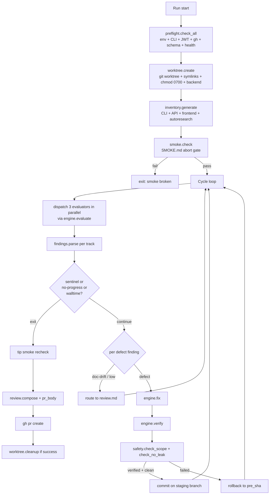

# Rewrite QA Harness Greenfield — Preservation-First Agents, ~1,350 LOC Target

## Overview

Replace `harness/` with a rewritten-from-scratch version, ~1,350 production lines across 13 focused modules (current: 4,839 lines across 9 files). The rewrite implements the free-roaming preservation-first design from the prior plan but as a greenfield build rather than a surgical refactor, because a six-agent parallel audit found ~60% of the current harness is dead, vestigial, matrix-coupled, or oversized — and three of the largest files (`scorecard.py`, `prompts.py`, `engine.py`) are pristine Freddy copies with 0–2% adaptation to GoFreddy. Surgical cuts inside those files would leave ~1,000–1,700 lines of inherited weight in place. This plan preserves every safety net and invariant from the prior plan while reducing the codebase ~72% and replacing scaffolding-based discipline with prompt-based discipline.

Phase 1 of the prior plan (infra foundation: symlink-preserving rollback, CLI integrity preflight, JWT envelope check, per-worktree `clients/`, graceful rollback, `chmod 0700`) ships first as a standalone PR off current `main`. This plan builds on top of that landed state. Every Phase 1 behavior change must survive into the rewritten modules; this plan treats them as hard invariants.

## Problem Frame

The prior plan (`2026-04-20-001`) was written as a refactor: "Modify `harness/X.py`" for each unit. A deep audit pass run after plan review revealed that the refactor framing systematically underestimates how much of the current harness has no reason to exist post-redesign:

- **`scorecard.py` (532 lines, 0% adapted from Freddy):** 70% is matrix-dependent utilities (`parse_flow4_capabilities`, `parse_track_capabilities`, `resolve_scope_caps`, `check_convergence`) that die when `test-matrix.md` is deleted. The useful core — `Finding` dataclass + YAML I/O — is ~130 lines.
- **`prompts.py` (594 lines, <1% adapted):** 70% is matrix-aware scope banners, grade-delta rendering, attempt-tracker blocks, cycle-1-vs-2+ branching — all matrix-coupled. Residual rendering ("read markdown, substitute placeholders, concat SEED/inventory") is ~50 lines.
- **`engine.py` (615 lines, 1.6% adapted):** `evaluate()` and `fix()` are 85% duplicated 88-line methods. Process-group machinery is created but never reaped. Failure-scorecard template is 52 lines of string concatenation.
- **`worktree.py` (719 lines, 8.5% adapted):** Protected-files snapshot/restore (92 lines) and main-repo leak guard (85 lines) are never-exercised in tests and duplicate what prompt discipline already enforces. `ProcessTracker` is 105 lines of state machinery around what could be a 40-line atexit+signal handler.
- **`run.py` (991 lines, 12.5% adapted):** 57% of the file is matrix-driven cycle management, convergence detection, escalation tracking, resume logic, ALL-PASS decision trees, and all-or-nothing per-cycle commits — all explicitly removed by the redesign.
- **`preflight.py` (569 lines, 28.8% adapted):** Contains vestigial Vite JWT introspection (~120 lines) and an ambiguous `cleanup_harness_state` with an SQL-injection vector.

A surgical application of the prior plan's directives (Tier A deletions + Tier B lightweight safety-net replacements + Tier C in-place refactors) produces roughly 14% reduction. A greenfield rewrite applying the same directives produces ~72% reduction with the same safety profile. The difference is effort, not safety.

The greenfield approach is also cleaner: three of the largest files are 98% Freddy code that was never read carefully during the GoFreddy migration. Surgical cuts inside them produce a weird hybrid. Writing them fresh produces code that matches GoFreddy's shape from the start.

## Requirements Trace

All requirements from the prior plan carry forward. Numbering preserved for traceability.

- R1. Delete `harness/test-matrix.md`. No external doc replaces it as spec. *(see origin)*
- R2. `harness/SEED.md` — enumerative inventory of product surfaces, never prescriptive. *(see origin)*
- R3. `harness/SMOKE.md` — 5–10 must-work flows used only as an abort gate; fixer never reads it. *(see origin)*
- R4. Evaluator flags only five defect categories: crash, 5xx, console-error, self-inconsistency, dead-reference. App-vs-doc disagreement is `doc-drift`, never a defect. *(see origin)*
- R5. Fixer is preservation-first: articulates what surrounding code / tests / git history expect, restores that, and never changes public surfaces (signatures, response shapes, endpoint contracts, CLI flags) to match any external doc. Discipline lives in the prompt, not in audit scaffolding. *(see origin)*
- R6. Verifier reproduces the original defect, exercises 2–3 adjacent capabilities, treats any change to a public surface adjacent to the fix as a regression. *(see origin)*
- R7. Per-track commit gate. Each verified fix is its own commit on a per-run staging branch. One PR per run at the end. No auto-merge. *(see origin)*
- R8. No agent-level caps. Full tool access (Playwright, curl, filesystem). Agent self-terminates via a stdout sentinel; `HARNESS_MAX_WALLTIME` is the only hard backstop. *(see origin)*
- R9. Drop `max_cycles`, the convergence detector, and `--resume-*` flags. *(see origin, prior plan Unit 3.2)*
- R10 (new). Rewrite `harness/` greenfield to target layout below. Every existing invariant must map to a location in the new structure. No silent loss.
- R11 (new). Target total production size: ~1,350 lines across 13 modules. No module >250 lines. Every module has one obvious reason to exist.
- R12 (new). Preserve every Phase 1 infra fix from the prior plan (symlink-preserving rollback, CLI integrity preflight, JWT envelope check, `chmod 0700`, per-worktree `clients/`, graceful rollback, backend log append, `gh auth` preflight) as starting behaviour in the rewritten modules.
- R13 (new). Replace heavyweight outcome-verification scaffolding (protected-files snapshot/restore, main-repo leak guard, `ProcessTracker` state machine) with lightweight equivalents (`git diff` post-fix scope check, `git status` post-fix leak check, inline atexit+signal handlers). Safety coverage preserved; implementation shrinks ~80%.
- R14 (new). Drop claude-engine branching; codex is the only supported engine (already reflected in current practice; codify it in the structure).
- R15 (new). Tests are not a blocker. The new test suite targets ~500–800 lines focused on "can-corrupt-state" code (worktree lifecycle, rollback, safety checks, findings parsing, preflight). Orchestrator integration tests are not required; prompt-rendering tests are not required; engine subprocess tests are not required.

## Scope Boundaries

**In scope:**
- All of `harness/` (production code, prompt markdown, SEED, SMOKE, README)
- `tests/harness/` — delete old suite, write minimal new suite
- `.gitignore` entries the new layout needs
- `docs/prompts/harness-bootstrap-agent.md` — rewrite to match new run shape

**Out of scope (follow-on work):**
- Product defects the new harness will surface (live telemetry, billing 404s, stubbed routes, portal/dashboard unify). First full run after cut-over produces a separate PR for product work.
- Multi-engine fan-out (claude + other engines).
- `docs/solutions/` institutional-learnings scaffolding.
- New top-level `AGENTS.md` / `CLAUDE.md`.
- Phase 1 infra fixes from the prior plan — those ship as a standalone PR off current `main` and are a prerequisite for this plan, not a deliverable of it.

## Context & Research

### Relevant Code and Patterns

- **Prior plan:** `docs/plans/2026-04-20-001-feat-harness-free-roaming-redesign-plan.md` — defines the free-roaming preservation-first design this plan implements greenfield.
- **Pre-prior plan:** `docs/plans/2026-04-18-001-feat-harness-migration-plan.md` — defines the invariants this plan preserves (codex profile contract, 3-track decomposition, protected-files snapshot/restore now being lightened, JWT minting via GoTrue, worktree pattern).
- **Files being replaced:** `harness/run.py` (991), `harness/worktree.py` (719), `harness/engine.py` (615), `harness/prompts.py` (594), `harness/preflight.py` (569), `harness/scorecard.py` (532), `harness/config.py` (185), `harness/test-matrix.md` (127 — delete outright), `harness/prompts/*.md` (405 combined — rewrite in place at new shape), `harness/README.md` (rewrite).
- **Tests being replaced:** `tests/harness/*` (4,632 lines) — delete all, write a minimal new suite.
- **Reference endpoints for orientation (never spec):** `README.md`, `cli/freddy/main.py` (Typer tree), `src/api/main.py` (openapi), `frontend/src/lib/routes.ts`, `autoresearch/` directory.
- **Codex profile contract (preserved invariant):** `sandbox_mode="danger-full-access"`, `shell_environment_policy.inherit="all"`, `.venv/bin` explicitly prepended to PATH to survive sandbox stripping.
- **Phase 1 infra fix commits (must land before this plan starts):** symlink-preserving `git clean -e .venv -e node_modules -e clients`, `uv pip install -e .` CLI integrity check, JWT envelope preflight, `gh auth status` preflight, per-worktree `clients/` directory (not symlink), `chmod 0700` on worktree, backend log append mode, graceful rollback instead of `check=True`, Vite JWT refresh removal.

### Institutional Learnings

No `docs/solutions/` learnings — greenfield from a documented-learning perspective.

### External References

- `codex` CLI behaviour and profile contract — already encoded in prior plan and preserved as invariant.
- `gh` CLI `pr create` contract — standard GitHub CLI usage, no research needed.
- GoTrue (Supabase) auth flow for harness JWT minting — already implemented, preserved as invariant.

### Audit Findings Underpinning This Plan

Six parallel Explore agents audited the current harness on 2026-04-21. Consolidated findings:

- **Production code: ~1,540 load-bearing / ~1,688 dead-or-vestigial / ~1,000 over-engineered-but-load-bearing.** Bare-minimum estimate: 1,150–1,750 lines.
- **Test code: 56% survival, 44% dies with removed features.** `test_convergence.py` (287 lines) is entirely dead on arrival.
- **Freddy adaptation audit:** `scorecard.py` 0%, `prompts.py` <1%, `engine.py` 1.6%, `worktree.py` 8.5%, `run.py` 12.5%, `config.py` 15%, `preflight.py` 28.8%. The three lowest-adapted files contain the most vestigial bulk.
- **Zero residual Freddy SaaS references remain** — all "freddy" occurrences in the current codebase legitimately reference GoFreddy's CLI binary or `cli/freddy/` directory. No Stripe, no old endpoints, no stale service names.

## Key Technical Decisions

1. **Greenfield rewrite over surgical refactor.** Audit showed that surgical cuts leave ~1,000+ lines of Freddy-shaped scaffolding in place inside pristine files. Writing those files from scratch at GoFreddy's shape is clearer and cheaper than carving them.

2. **Preservation-first discipline lives in prompts, not code.** The fixer prompt enumerates what never to change (function signatures, response shapes, endpoint contracts, CLI flags). The harness does not run classifiers, audit layers, or confidence-tier machinery to enforce what the prompt already says. Trust the agent; verify outcomes via lightweight post-fix checks.

3. **Five defect categories only, closed list.** `crash`, `5xx`, `console-error`, `self-inconsistency`, `dead-reference` are the only categories the fixer acts on. `doc-drift` and `low-confidence` route to `review.md` for human judgement, never to the fixer.

4. **Full tool access, no caps.** Playwright, curl, filesystem, process control. No token budgets, no per-domain wall-clock, no cycle count, no convergence detector. Three termination mechanisms: agent sentinel (`HARNESS_SIGNAL: done reason=<x>`), `HARNESS_MAX_WALLTIME` backstop (4h default), no-progress detector (2 consecutive cycles with zero new high-confidence defect findings).

5. **Per-track commits, one PR.** Each verified fix commits independently to a per-run staging branch named `harness/run-<ts>`. At run end, `gh pr create --head <staging>` opens a single PR summarising all tracks. No auto-merge. Operator reviews and merges. Tip-smoke re-check runs once against staging-branch HEAD after all fixes land; failure flags prominently in `review.md` but does not block PR creation.

6. **Three-track decomposition preserved** (A=CLI, B=API, C=Frontend). Rationale: parallelism (3× faster runs), blast-radius isolation (per-track path allowlists for fixer), domain-specialized evaluator prompts. Collapse to one free-roaming agent with full tool access is a future consideration but not undertaken in this plan — it would ripple through every module and the prior plan's invariants.

7. **Lightweight outcome verification replaces heavyweight snapshot/restore.** Two ~10-line post-fix checks in `safety.py`: `git diff --name-only <pre_sha> HEAD` intersected against per-track path allowlists (catches scope violations), and `git status --porcelain` on main repo (catches worktree leaks). Failing a check rolls back the fix and records `scope-violation` in `review.md`. Same safety coverage as the current 177-line `snapshot_protected_files` + main-repo leak guard machinery.

8. **Unconditional backend restart post-fix.** Replaces the current SHA-1 snapshot-and-diff mechanism that decides whether to restart. Adds 3–5s per fix in exchange for removing ~50 lines of fragile filesystem hashing. Simpler is correct.

9. **Codex engine only.** No claude branching in command builders. Removes ~50 lines of engine-choice dispatch across `engine.py` and `prompts.py`. If multi-engine is ever needed, introduce via strategy pattern at that point, not speculatively now.

10. **SEED is inventory, not spec; SMOKE is an abort gate.** SEED lists product surfaces with no "should" language. SMOKE runs at preflight and at each cycle start. Any SMOKE failure hard-aborts with `exit_reason="smoke broken"`. Fixer never reads SMOKE.

11. **Findings are markdown files with YAML front-matter, written directly by the evaluator.** The harness reads them with `findings.parse()`. No intermediate scorecard aggregation layer; no multi-cycle grade-delta tracking; no escalation attempt counter. If a finding recurs across cycles, it recurs — the no-progress detector catches "agent can't make progress."

12. **No matrix coupling anywhere.** Eliminates `test-matrix.md`, `parse_flow4_capabilities`, `parse_track_capabilities`, `resolve_scope_caps`, `check_convergence`, scope banners, grade-delta rendering, attempt-tracker rendering, phase filters, capability-id normalisation, `only`/`skip`/`phase` config fields.

13. **Tests are not a blocker; coverage is targeted.** New test suite focuses on code that can corrupt state (worktree lifecycle, rollback, safety.py scope checks, findings YAML parsing, preflight fail-loud behavior). Orchestrator integration tests, prompt-rendering tests, engine subprocess tests all out of scope. Target ~500–800 test lines.

14. **Phase 1 infra fixes ship separately as prerequisite.** This plan assumes they have landed. The rewrite does not re-introduce or re-engineer the bugs Phase 1 fixed — it embodies the fixed behaviour from the start.

## Open Questions

### Resolved During Planning

- **Refactor or rewrite?** Rewrite. The audit's bare-minimum estimate (1,150–1,750 LOC) versus surgical-cut estimate (~4,150 LOC) makes the effort difference clearly worth it.
- **Three tracks or one agent?** Three tracks (preserves prior plan's invariant). Revisitable in a follow-on plan if experience with the new harness suggests one free-roaming agent would serve better.
- **Scorecard module or inline?** Separate module (`findings.py`, ~80 lines). Cohesive enough to warrant isolation; small enough to stay readable.
- **Prompts module or inline?** Separate module (`prompts.py`, ~50 lines). Template substitution benefits from isolation for future prompt-evolution work.
- **Backend restart strategy?** Unconditional restart post-fix. Simpler than conditional; acceptable cost.
- **Claude engine support?** Dropped. Codex only. Strategy pattern if ever needed.
- **Test coverage target?** ~500–800 lines, focused on state-corruption paths. No orchestrator integration tests.

### Deferred to Implementation

- Exact content of rewritten prompt files (`evaluator-base.md`, `evaluator-track-{a,b,c}.md`, `fixer.md`, `verifier.md`). These evolve with real runs; ship a first version in Unit 2D and iterate.
- Exact SEED.md contents — ship a first version in Unit 2E covering the four product areas (agency workflows, research/intelligence, platform, client plane) and iterate.
- Exact SMOKE.md check set — start with 5 checks in Unit 2E (`freddy --help` exits 0, `GET /health` 200, `POST /v1/api-keys` returns a key, frontend `/` loads without console errors, `freddy client new <slug>` exits 0), expand as needed.
- `cleanup_harness_state` fate — not carried into the rewrite unless the first run surfaces DB accumulation as a real problem. If needed later, rewrite with parameterized queries at that point.
- Inventory parser for `frontend/src/lib/routes.ts` — regex vs `ts-morph`. Start with regex; upgrade if fragility shows up.
- PR-body template wording — start minimal in `review.py`, evolve with operator feedback.
- Whether to keep `fixer_workers` parallelism (one fixer per track in parallel vs serial). Start serial for simplicity; add parallelism if cycle wall-time becomes an issue.

## High-Level Technical Design

> *This illustrates the intended approach and is directional guidance for review, not implementation specification. The implementing agent should treat it as context, not code to reproduce.*

### Module layout

```
harness/
├── __main__.py          ~10 lines   entry point
├── cli.py               ~40 lines   argparse
├── config.py            ~60 lines   Config dataclass
├── run.py               ~250 lines  orchestrator (single function + small helpers)
├── preflight.py         ~180 lines  env + CLI + JWT + gh + DB setup
├── worktree.py          ~140 lines  git worktree + backend lifecycle + atexit
├── inventory.py         ~150 lines  auto-generate app surface doc
├── smoke.py             ~70 lines   SMOKE.md parser + runner
├── engine.py            ~180 lines  codex subprocess wrapper
├── findings.py          ~80 lines   Finding dataclass + YAML parse/route
├── prompts.py           ~50 lines   template substitution
├── review.py            ~100 lines  review.md + pr-body.md composition
├── safety.py            ~40 lines   post-fix scope + leak checks
├── SEED.md                          app inventory (markdown)
├── SMOKE.md                         must-work flows (markdown)
├── README.md                        rewrite to match new shape
└── prompts/
    ├── evaluator-base.md
    ├── evaluator-track-{a,b,c}.md
    ├── fixer.md
    └── verifier.md
```

Target: ~1,350 production LOC. No module >250 lines.

### Runtime flow



### Safety-net mapping

Every safety property preserved from the current harness lives somewhere in the new structure:

| Safety concern | Current location | New location |
|---|---|---|
| Fixer edits `harness/`, `tests/`, `pyproject.toml` | `worktree.snapshot_protected_files` + `verify_and_restore_protected_files` (92 lines) | `safety.check_scope` (git diff against per-track allowlist, ~15 lines) |
| Fixer writes outside worktree | `worktree._porcelain_dirty_set` + restore (85 lines) | `safety.check_no_leak` (git status on main repo, ~10 lines) |
| Fixer introduces regression in adjacent capability | Verifier prompt (already in markdown) | Verifier prompt (unchanged) |
| Fixer changes public surface shape | Verifier prompt | Verifier prompt (unchanged) |
| Run never terminates | `max_cycles` + convergence detector (~80 lines) | Sentinel + `max_walltime` + no-progress (inline in `run.py`, ~20 lines) |
| App vs docs disagreement warps app | Nothing | Fixer prompt preservation-first discipline + five-category defect enum + `doc-drift` route |
| Stack goes down mid-run | Cycle-start stack health check | `smoke.check` at cycle start |
| Orphan processes on Ctrl+C | `ProcessTracker` class (105 lines) | inline atexit + signal handlers in `worktree.create` (~20 lines) |
| Backend serves stale code after fix | `snapshot_backend_tree` + `detect_backend_changes` + conditional restart (~50 lines) | Unconditional `worktree.restart_backend` post-fix (~5 call site, logic already exists) |
| Staging-branch tip unbuildable in aggregate | Not currently checked | `smoke.check` on staging HEAD before PR (tip-smoke recheck) |
| JWT expires mid-run | Not currently checked | `preflight._check_jwt_envelope` (Phase 1 fix) |
| Stale CLI console script | Not currently checked | `preflight._check_cli_integrity` (Phase 1 fix) |
| `gh` not authenticated | Not currently checked | `preflight._check_gh_auth` (Phase 1 fix) |
| Fixer fails repeatedly on same finding | Escalation counter + max_fix_attempts (~64 lines) | No-progress detector (2 cycles zero new highs → terminate) inline in `run.py` |
| Rate limit mid-run | Orchestrator sentinel file + retry | Codex engine's internal retry (unchanged, already in subprocess layer) |
| Per-run DB accumulation | `cleanup_harness_state` (45 lines, ambiguous, SQL-injection) | Deferred — address if ever surfaces as a real problem |

## Implementation Units

Organised into phases by dependency layer. Each unit is one logical commit.

### Phase 1 — Prerequisite (reference only; ships from prior plan)

Phase 1 of `docs/plans/2026-04-20-001-feat-harness-free-roaming-redesign-plan.md` (Units 1.1–1.3) must land on `main` before this plan begins. Those units ship the infra must-fixes: symlink-preserving `git clean` excludes, `uv pip install -e .` CLI integrity, JWT envelope preflight, `gh auth status` preflight, `chmod 0700` on worktree, per-worktree `clients/` directory, backend log append, graceful rollback, Vite JWT refresh removal. This plan assumes those changes are present and codifies them as starting behaviour in the rewritten modules.

### Phase 2 — Foundation (data types + content)

- [ ] **Unit 2A: `harness/findings.py` — Finding dataclass + YAML parse + defect routing**

**Goal:** Data type for findings the evaluator writes. Parse YAML-front-matter markdown into `Finding` objects. Route by category.

**Requirements:** R4, R11

**Dependencies:** None

**Files:**
- Create: `harness/findings.py`
- Test: `tests/harness/test_findings.py`

**Approach:**
- `@dataclass(frozen=True) Finding` with fields: `id`, `track` (a/b/c), `category` (crash/5xx/console-error/self-inconsistency/dead-reference/doc-drift/low-confidence), `confidence` (high/medium/low), `summary`, `evidence`, `reproduction`, `files`.
- `parse(path: Path, sentinel: str | None = None) -> list[Finding]` — reads markdown with YAML front-matter blocks; one finding per front-matter block.
- `route(findings: list[Finding]) -> tuple[actionable, review]` — actionable = category ∈ DEFECT_CATEGORIES AND confidence == "high"; rest → review.
- `DEFECT_CATEGORIES = {"crash", "5xx", "console-error", "self-inconsistency", "dead-reference"}` module constant.
- YAML library: PyYAML, already in deps.

**Patterns to follow:**
- Frozen dataclass with explicit Literal types for enum fields (clarity + type-check help).

**Test scenarios:**
- Happy path: parse a fixture with two findings, each category/confidence distinct, assert correct field population.
- Edge case: empty file → empty list.
- Edge case: malformed YAML front-matter → raise `FindingParseError` with line number.
- Happy path: `route` splits a mixed list correctly (3 defects, 2 doc-drifts, 1 low-confidence → 3 actionable, 3 review).

**Verification:** `findings.parse()` round-trips against a hand-written fixture. `route` partition is disjoint and exhaustive.

---

- [ ] **Unit 2B: `harness/config.py` — slimmed Config dataclass**

**Goal:** Configuration surface for the new harness. ~60 lines, down from 185.

**Requirements:** R9, R11, R12, R14

**Dependencies:** None

**Files:**
- Create: `harness/config.py` (replaces current file)
- Test: `tests/harness/test_config.py`

**Approach:**
- `@dataclass(frozen=True) Config` with fields: `codex_eval_profile`, `codex_fixer_profile`, `codex_verifier_profile`, `max_walltime` (default 14400), `tracks` (default ["a","b","c"]), `backend_port`, `backend_cmd`, `backend_url`, `frontend_url`, `staging_root`, `keep_worktree` (default False), `jwt_envelope_padding` (default 600).
- `from_cli_and_env(args, env) -> Config` — builds from CLI + env, env overrides.
- Module constant `REQUIRED_ENV_VARS` — only the env vars actually consumed (DATABASE_URL, SUPABASE_URL, SUPABASE_ANON_KEY, SUPABASE_JWT_SECRET, GOOGLE_API_KEY, HARNESS_TOKEN or equivalent).

**Deleted from current config:** `max_cycles`, `resume_branch`, `resume_cycle`, `eval_model`, `fixer_model`, `codex_eval_model`, `codex_fixer_model`, `codex_verifier_model` (5 never-wired fields), `phase`, `skip`, `only`, `max_fix_attempts`, `max_retries`, `retry_delay`, `fixer_workers`, `fixer_domains`, `dry_run`, `eval_only`, `auto_cleanup`, `keep_state`, `backend_log`, `jwt_ttl`. Plus `normalize_id()` — matrix-only helper, not needed.

**Test scenarios:**
- Happy path: defaults match documented values.
- Happy path: env override beats default for `max_walltime`.
- Edge case: missing required env var → `ConfigError` with the missing key name.
- Happy path: frozen — attempting to assign raises `FrozenInstanceError`.

**Verification:** New Config has 10–12 fields (was 42). Frozen. Required env vars list matches what the rest of the new code actually reads.

---

- [ ] **Unit 2C: `harness/prompts.py` — template substitution**

**Goal:** Read prompt markdown files, substitute placeholders, concat SEED + inventory when appropriate. ~50 lines, down from 594.

**Requirements:** R11, R5

**Dependencies:** Unit 2A (Finding), Unit 2B (Config)

**Files:**
- Create: `harness/prompts.py` (replaces current file)
- Test: `tests/harness/test_prompts.py` *(optional per R15; skip unless prompts gain non-trivial conditional logic)*

**Approach:**
- Three public functions: `render_evaluator(track, cycle, run_dir, wt_path) -> Path`, `render_fixer(finding, run_dir) -> Path`, `render_verifier(finding, run_dir) -> Path`.
- Each reads the corresponding markdown file(s) under `harness/prompts/`, applies `{placeholder}` substitution using `str.replace`, writes the rendered prompt to a tempfile under `run_dir`, returns the path.
- SEED + inventory content appended to evaluator prompts only. Fixer and verifier prompts take finding-specific context (finding id, category, evidence, reproduction).
- No cycle-1-vs-2+ branching, no scope blocks, no grade-delta blocks, no attempt-tracker blocks, no scope override banners. Deleted: all ~540 lines of matrix-coupled rendering.

**Test scenarios:** None required. If added: one happy-path test per render function with a fixture prompt.

**Verification:** All three render functions produce paths to files with `{placeholder}` substitutions applied. No reference to `test-matrix.md`, `parse_track_caps`, `resolve_scope_caps`, `render_scope_block`, or `render_grade_delta_block` anywhere in the new module.

---

- [ ] **Unit 2D: Prompt content — `evaluator-*.md`, `fixer.md`, `verifier.md`**

**Goal:** Rewrite all six prompt markdown files to carry preservation-first discipline. This is where the "trust the agent" philosophy materialises.

**Requirements:** R4, R5, R6, R8

**Dependencies:** None (content-only)

**Files:**
- Rewrite: `harness/prompts/evaluator-base.md`, `harness/prompts/evaluator-track-a.md`, `harness/prompts/evaluator-track-b.md`, `harness/prompts/evaluator-track-c.md`, `harness/prompts/fixer.md`, `harness/prompts/verifier.md`

**Approach — evaluator-base.md:**
- Preservation-first preamble (2–3 short paragraphs): the app is its own spec; doc-drift is not a defect; five defect categories are the closed list.
- Explicit instruction: use full tool access (Playwright, curl, filesystem, CLI). No budgets, no caps. Self-terminate by emitting `HARNESS_SIGNAL: done reason=<x>` as the final stdout line.
- Finding schema: YAML front-matter with `id`, `track`, `category`, `confidence`, `summary`, `evidence`, `reproduction`, `files`. Write to `{findings_output}`.
- Placeholders: `{track}`, `{cycle}`, `{worktree}`, `{findings_output}`, `{seed}`, `{inventory}`.

**Approach — evaluator-track-{a,b,c}.md:** one short section per track naming the primary surfaces for that track (CLI for A, API for B, Frontend for C) and the investigation tools best suited (`freddy --help`, `curl`, Playwright). Do not prescribe specific flows.

**Approach — fixer.md:**
- Scope allowlist: track A → `cli/freddy/` only; track B → `src/` (except `src/api/main.py` factory plumbing); track C → `frontend/src/` only. Never `tests/`, `harness/`, `pyproject.toml`, `package.json`.
- Only act on findings with categories in the five-defect enum. For `doc-drift` and `low-confidence` findings, write a one-line note and stop.
- Before any change: articulate what surrounding code / tests / git history expect, and how the proposed fix restores that expectation. Never change function signatures, response shapes, endpoint contracts, or CLI flag surfaces to match any external document.
- Do not run uvicorn or Vite; the harness manages the stack.
- Placeholders: `{finding_id}`, `{track}`, `{category}`, `{evidence}`, `{reproduction}`, `{fix_report_path}`.

**Approach — verifier.md:**
- Reproduce the original defect using the exact reproduction from the finding. If the defect still reproduces, verdict = FAILED.
- Exercise 2–3 adjacent capabilities in the same track (list them; confirm unchanged).
- Check public surfaces adjacent to the fix — if a function signature, response shape, endpoint contract, or CLI flag changed shape, verdict = FAILED.
- Emit verdict as YAML: `verdict: verified|failed`, `reason`, `adjacent_checked`, `surface_changes_detected`.

**Test scenarios:**
- Test expectation: none — content-only markdown; verify via first real harness run.

**Verification:** Grep confirms no prompt file references `test-matrix.md`, `phase`, `scope_override`, `grade-delta`, `escalation`, or `max_cycles`. Fixer prompt contains explicit "never change signatures/shapes/contracts/flags" paragraph. Verifier prompt contains "adjacent capabilities" and "surface-change regression" paragraphs.

---

- [ ] **Unit 2E: `harness/SEED.md` + `harness/SMOKE.md` content**

**Goal:** Author the two anchor documents.

**Requirements:** R2, R3

**Dependencies:** None (content-only)

**Files:**
- Create: `harness/SEED.md`, `harness/SMOKE.md`

**Approach — SEED.md:**
- Preamble explaining: "this is inventory, not spec; never prescriptive; fixer never reads this."
- Four sections: Agency workflows, Research/intelligence, Platform, Client plane. Each section lists surfaces one-per-line. Enumerative language only ("the CLI has a `client new` subcommand", never "the CLI should support client creation").
- One documented exception: live session telemetry on the dashboard, flagged as must-work-today because product needs it and it is currently absent — the first real run will surface this as a finding, correctly.

**Approach — SMOKE.md:**
- Preamble explaining: "abort gate only; any failure = hard abort; fixer never reads this."
- 5 deterministic checks with IDs, shell commands, and expected outcomes:
  - `smoke-cli`: `.venv/bin/freddy --help` exits 0
  - `smoke-api-health`: `GET {backend_url}/health` returns 200
  - `smoke-api-key`: `POST {backend_url}/v1/api-keys` returns JSON with a `key` field
  - `smoke-frontend`: Playwright loads `{frontend_url}/` without console errors
  - `smoke-cli-client-new`: `.venv/bin/freddy client new smoke-check-$(date +%s)` exits 0
- Parseable format (YAML block per check).

**Test scenarios:**
- Test expectation: none — content-only markdown; exercised by Unit 4C's smoke runner tests.

**Verification:** SEED.md has zero "should" / "must" / "required" language. SMOKE.md parses cleanly with the Unit 4C parser.

---

### Phase 3 — Infrastructure (subprocess + git + safety)

- [ ] **Unit 3A: `harness/engine.py` — codex subprocess wrapper**

**Goal:** Thin wrapper around codex CLI invocation. ~180 lines, down from 615.

**Requirements:** R8, R11, R14

**Dependencies:** Unit 2B (Config), Unit 2C (prompts render functions)

**Files:**
- Create: `harness/engine.py` (replaces current file)
- Test: `tests/harness/test_engine.py` *(minimal — cover command assembly + sentinel scan)*

**Approach:**
- Three public functions: `evaluate(config, track, wt, cycle, run_dir) -> list[Finding]`, `fix(config, finding, wt, run_dir) -> Path`, `verify(config, finding, wt, run_dir) -> Verdict`.
- Internal: `_run_codex(profile, prompt_path, wt, output_path) -> CompletedProcess` — assembles env with `PATH=<wt>/.venv/bin:${PATH}`, invokes `codex exec --profile <profile> --prompt-file <prompt_path>`, captures stdout+stderr to `output_path.with_suffix(".log")`. Timeout=None (walltime is global).
- Internal: `_scan_sentinel(output) -> str | None` — regex scan last 50 lines for `HARNESS_SIGNAL: done reason=<x>`.
- Internal: `_extract_thread_id(output) -> str | None` — regex scan for codex `"type":"thread.started"` + `"thread_id":"<id>"`.
- `Verdict` dataclass: `verified: bool`, `reason: str`, `adjacent_checked: list[str]`, `surface_changes_detected: list[str]`. `Verdict.parse(path)` reads the YAML the verifier wrote.
- No retry loop at engine level; codex handles its own rate limits. If the subprocess exits non-zero, bubble up; orchestrator decides next step.

**Deleted from current engine:** 88-line duplicate `evaluate`/`fix` methods, 4-way retry decision tree, failure-scorecard YAML template, process-group state machine (never reaped), claude branching, `_extract_rate_limit_reset` (unused). The `_supports_process_groups` helper duplicated between the current `engine.py` and `worktree.py` is not re-introduced anywhere — with `ProcessTracker` gone (Unit 3B) and no process-group reaping, the helper has no caller in the new structure.

**Patterns to follow:**
- Subprocess.run with `cwd`, `env`, explicit `PATH` prepend, log capture via file handle.

**Test scenarios:**
- Happy path: `_scan_sentinel` finds `HARNESS_SIGNAL: done reason=agent-signaled-done` in the last 50 lines of mock output → returns "agent-signaled-done".
- Edge case: no sentinel in output → returns None.
- Happy path: `_run_codex` assembles command with correct profile + prompt path; PATH includes `<wt>/.venv/bin` prefix.

**Verification:** `engine.py` < 200 lines. No claude branching. No duplicate retry logic between evaluate/fix.

---

- [ ] **Unit 3B: `harness/worktree.py` — git worktree + backend lifecycle**

**Goal:** Create and tear down isolated git worktrees; start and restart the backend; clean up on exit. ~140 lines, down from 719.

**Requirements:** R8, R11, R12, R13

**Dependencies:** Unit 2B (Config)

**Files:**
- Create: `harness/worktree.py` (replaces current file)
- Test: `tests/harness/test_worktree.py` *(cover create, rollback_to, restart_backend, atexit cleanup)*

**Approach:**
- `Worktree` dataclass: `path: Path`, `branch: str`, `backend_proc: Popen | None`.
- `create(ts, config) -> Worktree` — `git worktree add -b harness/run-<ts> <path> HEAD`; symlink `.venv` and `node_modules` from main repo; `mkdir clients/`; `chmod 0700` on worktree path; `restart_backend` to start stack; register atexit + SIGTERM + SIGINT handlers for cleanup.
- `cleanup(wt)` — terminate backend, `git worktree remove --force`, `git branch -D harness/run-<ts>`.
- `restart_backend(wt, config) -> Popen` — terminate old if any, `_kill_port(backend_port)`, spawn new uvicorn with `cwd=wt.path`, `PATH=<wt>/.venv/bin:...`, `start_new_session=True`, log to `wt.path/backend.log` in append mode; poll `/health` for 40s.
- `rollback_to(wt, sha)` — `git reset --hard <sha>` + `git clean -fd -e .venv -e node_modules -e clients`.
- `_kill_port(port)` — lsof -ti + SIGTERM → 5s grace → SIGKILL.
- `_wait_healthy(url, timeout)` — poll with 1s sleep.

**Deleted from current worktree:** `snapshot_protected_files` / `verify_and_restore_protected_files` (92 lines — replaced by `safety.check_scope`), `_porcelain_dirty_set` / `snapshot_main_repo_working_dir` / `verify_and_restore_main_repo_working_dir` (85 lines — replaced by `safety.check_no_leak`), `ProcessTracker` class (105 lines — replaced by inline atexit + signal handlers), `snapshot_backend_tree` + `detect_backend_changes` (50 lines — replaced by unconditional restart), `_files_equal` (6 lines — orphan).

**Patterns to follow:**
- Context-manager-ish atexit registration at construction time for deterministic cleanup.

**Test scenarios:**
- Happy path: `create` produces a directory with `.venv` and `node_modules` symlinks, `clients/` as dir not symlink, mode 0700.
- Edge case: `rollback_to` preserves `.venv`/`node_modules`/`clients` symlinks (regression catcher for the Phase 1 fix).
- Happy path: `cleanup` removes the worktree dir and deletes the branch.
- Edge case: if backend started, `cleanup` terminates it with SIGTERM+grace+SIGKILL cascade.

**Verification:** `worktree.py` < 160 lines. No protected-files code. No main-repo-leak-guard code. No `ProcessTracker` class. `.venv` symlink survives `rollback_to`.

---

- [ ] **Unit 3C: `harness/safety.py` — post-fix scope + leak checks**

**Goal:** Lightweight outcome verification: did the fixer stay in its lane? New module, ~40 lines.

**Requirements:** R5, R13

**Dependencies:** Unit 3B (Worktree type)

**Files:**
- Create: `harness/safety.py`
- Test: `tests/harness/test_safety.py` *(essential — this is the safety net)*

**Approach:**
- Module constant `SCOPE_ALLOWLIST: dict[str, re.Pattern]` — track "a" → `^cli/freddy/`, "b" → `^src/(api|core|db|autoresearch)/`, "c" → `^frontend/src/`.
- `check_scope(wt, pre_sha, track) -> list[str] | None` — `git diff --name-only <pre_sha> HEAD` inside worktree; return paths that don't match the track's allow regex (`None` if all match).
- `check_no_leak(pre_dirty_set) -> list[str] | None` — `git status --porcelain` on main repo (not worktree); return list of new dirty files (`None` if same as pre-set). `pre_dirty_set` captured by orchestrator once at startup.

**Patterns to follow:**
- Subprocess git invocations with explicit `cwd`, `text=True`, `check=True`.

**Test scenarios:**
- Happy path: fixer edits `cli/freddy/commands/client.py` on track A → `check_scope` returns None.
- Error path: fixer edits `tests/test_client.py` on track A → `check_scope` returns `["tests/test_client.py"]`.
- Error path: fixer edits `harness/fixer.md` on any track → `check_scope` returns that path.
- Happy path: main repo unchanged pre/post → `check_no_leak` returns None.
- Error path: fixer writes `src/main.py` on main repo → `check_no_leak` returns it.

**Verification:** Both checks produce a list of offending paths or `None`. Orchestrator uses these to decide rollback.

---

### Phase 4 — Bootstrap (preflight + inventory + smoke)

- [ ] **Unit 4A: `harness/preflight.py` — env + CLI + JWT + gh + DB setup**

**Goal:** Fail-loud pre-run checks. ~180 lines, down from 569.

**Requirements:** R11, R12

**Dependencies:** Unit 2B (Config)

**Files:**
- Create: `harness/preflight.py` (replaces current file)
- Test: `tests/harness/test_preflight.py` *(cover fail-loud behaviour per check)*

**Approach:**
- `check_all(config)` — sequential: `_check_env_vars`, `_check_safety_guards` (reject production/non-localhost), `_check_codex_profiles`, `_check_cli_integrity` (`.venv/bin/freddy --help` exits 0; else raise with `uv pip install -e .` guidance), `_check_gh_auth` (`gh auth status` exits 0), `_apply_db_schema` (walk Supabase migrations), `_mint_jwt` (GoTrue signup/signin, seed harness user/client/membership rows), `_check_jwt_envelope` (token TTL ≥ max_walltime + jwt_envelope_padding), `_wait_stack_healthy` (poll `/health` 200, `/` 200).
- `PreflightError` exception with actionable message per failure.

**Deleted from current preflight:** All Vite introspection (`_find_vite_pid`, `_get_process_env`, `_extract_env_var`, `check_vite_jwt_freshness`, `refresh_vite_jwt` — ~120 lines), `cleanup_harness_state` with its SQL injection (45 lines), `verify_frontend_bypass` Vite portion (40 lines), standalone `validate_cors` (28 lines — covered by SMOKE via real requests).

**Patterns to follow:**
- Each check raises `PreflightError` with a single-sentence actionable message; orchestrator catches and exits cleanly.

**Test scenarios:**
- Happy path: all checks pass on a valid local environment.
- Error path: missing `DATABASE_URL` → `PreflightError("missing env: DATABASE_URL")`.
- Error path: stale `freddy` console script (returncode != 0) → raise with `uv pip install -e .` guidance.
- Error path: `gh auth status` returncode != 0 → raise with guidance.
- Error path: JWT TTL < max_walltime + 600s → raise with both values.
- Error path: production env detected → raise refusing to run.

**Verification:** `preflight.py` < 200 lines. No Vite functions. No `cleanup_harness_state`. All new Phase 1 checks present.

---

- [ ] **Unit 4B: `harness/inventory.py` — auto-generate app surface doc**

**Goal:** Produce a per-run markdown listing of app surfaces: CLI, API, frontend, autoresearch. ~150 lines, new module.

**Requirements:** R2 (SEED consumer), R11

**Dependencies:** Unit 3B (Worktree type)

**Files:**
- Create: `harness/inventory.py`
- Test: `tests/harness/test_inventory.py` *(cover each section generator)*

**Approach:**
- `generate(wt, out_path) -> None` — calls four section generators, concatenates, writes to `out_path`.
- `_cli_section(wt) -> str` — import `cli.freddy.main:app`, recurse into Typer app `registered_groups` / `registered_commands`, emit "- `freddy <group> <cmd> — <help summary>`" lines.
- `_api_section(wt) -> str` — invoke `scripts/export_openapi.py` in a subprocess (avoid main-process import pollution), parse resulting JSON, emit "- `<METHOD> <path> — <summary>`" lines.
- `_frontend_section(wt) -> str` — regex-parse `frontend/src/lib/routes.ts` for `ROUTES` and `LEGACY_PRODUCT_ROUTES` entries, emit "- `<path> — <name>`" lines. If the file is missing, emit a placeholder "_routes.ts not found; section absent this run_".
- `_autoresearch_section(wt) -> str` — scan `autoresearch/` for subdirectories containing `run.py`, emit "- `<dirname>` — session program" lines.
- Each section wrapped in a markdown heading; total output target < 50KB.

**Patterns to follow:**
- `scripts/export_openapi.py` already has `_ensure_env_defaults()` — reuse its env setup pattern.

**Test scenarios:**
- Happy path: inventory contains `freddy client new` (forces Typer subgroup recursion), `POST /v1/sessions`, `/dashboard/sessions`, at least one autoresearch program.
- Edge case: missing `routes.ts` → placeholder section; overall inventory still produced.
- Edge case: autoresearch dir empty → empty section; not a failure.

**Verification:** Generated file parses as markdown, < 50KB, consumed by evaluator prompt without error.

---

- [ ] **Unit 4C: `harness/smoke.py` — SMOKE.md parser + runner**

**Goal:** Parse SMOKE.md, run checks, raise on any failure. ~70 lines, new module.

**Requirements:** R3, R11

**Dependencies:** Unit 2B (Config), Unit 3B (Worktree)

**Files:**
- Create: `harness/smoke.py`
- Test: `tests/harness/test_smoke.py`

**Approach:**
- `Check` dataclass: `id`, `type` (shell/http/playwright), `command` or `url`, `expected`.
- `parse(smoke_text) -> list[Check]` — split on YAML blocks.
- `run_check(check, wt, config) -> Result` — dispatch by type; subprocess for shell, `urllib.request` for http, Playwright for frontend.
- `check(wt, config)` — parse `harness/SMOKE.md`, run each `Check`, on first failure raise `SmokeError(f"smoke broken: {check.id} — {detail}")`.

**Patterns to follow:**
- Don't over-engineer Playwright — invoke via subprocess with a one-liner node script if no Python Playwright is present.

**Test scenarios:**
- Happy path: all checks pass → `check` returns cleanly.
- Error path: one shell check returns non-zero → `SmokeError` raised with failing id.
- Edge case: empty SMOKE.md → treated as pass.
- Happy path: http check parses 200 response correctly.

**Verification:** Killing the backend mid-run between cycles causes a loud `smoke broken` abort with the failing check named.

---

### Phase 5 — Orchestration + artifacts

- [ ] **Unit 5A: `harness/run.py` — the orchestrator**

**Goal:** Single orchestrator function tying everything together. ~250 lines, down from 991.

**Requirements:** R7, R8, R9, R11

**Dependencies:** Units 2A–2E (data + content), 3A (engine), 3B (worktree), 3C (safety), 4A (preflight), 4B (inventory), 4C (smoke), 5B (review)

**Files:**
- Create: `harness/run.py` (replaces current file)
- Test: `tests/harness/test_run.py` *(minimal — one happy-path end-to-end with heavy mocking; orchestrator integration coverage is explicitly not a goal)*

**Approach:**
- `run(config) -> int` — top-level orchestrator. Flow: mkdir run_dir → preflight.check_all → worktree.create → inventory.generate → smoke.check → staging branch → cycle loop → tip smoke → review.compose → gh pr create → worktree.cleanup.
- Cycle loop: `smoke.check`; dispatch 3 evaluators in parallel (`concurrent.futures`, one subprocess per track); collect findings; check `HARNESS_SIGNAL: done` across all tracks → exit_reason="agent-signaled-done"; check no-progress counter → exit_reason="no-progress"; check walltime → exit_reason="walltime".
- For each defect finding: capture `pre_sha`; `engine.fix`; `engine.verify`; `safety.check_scope(wt, pre_sha, finding.track)`; if verdict.verified AND not violations → `_commit_fix(wt, staging, finding)`; else capture patch via `review._capture_patch(wt, pre_sha, HEAD, finding.id)` → write `run_dir/fix-diffs/F-<id>.patch` → `_rollback_to(wt, pre_sha)`. Patch capture happens before rollback so the diff survives for `review.md` inspection.
- `_commit_fix`: `git add <files>`; `git commit -m "harness: fix <id> — <summary>"`; return commit SHA.
- `_rollback_to`: `worktree.rollback_to(wt, pre_sha)`.
- `_dispatch_evaluators`: `ThreadPoolExecutor(max_workers=3)` submitting `engine.evaluate` per track; `as_completed` collects.
- `_create_staging_branch`: `git checkout -b harness/run-<ts>` inside worktree.
- `_gh_pr_create`: subprocess `gh pr create --title "harness: run <ts> — <N> fixes" --body-file <run_dir>/pr-body.md --head <staging>`; on failure, log the path to pr-body.md for manual recovery.
- Post-loop: `smoke.check` one more time (tip-smoke); record result in review metadata but do not block PR creation on failure.
- Write `review.md` and `pr-body.md` via `review` module.
- Print end-of-run stdout summary (≤10 lines): total commits, findings grouped by category, PR URL (or "no PR — zero verified fixes"), exit reason, wall-clock duration, path to run_dir. One line per metric, no decoration. This is the operator's at-a-glance result.
- Cleanup: `worktree.cleanup(wt)` unless exit was abnormal or `config.keep_worktree`.

**Deleted from current run:** `attribute_file` + `_DOMAIN_PREFIXES` (22 lines), resume logic (9 lines), convergence check (10 lines), escalation logic (50 lines), ALL-PASS decision tree (16 lines), rate-limit detection sentinel (9 lines), overlap warning section in write_summary (15 lines), `_commit_or_rollback` all-or-nothing (119 lines — replaced by per-fix `_commit_fix`).

**Patterns to follow:**
- Single top-level function; helpers are short and one-purpose. No deep class hierarchies.
- Exit-reason string is set before `break`, surfaced in review metadata.

**Test scenarios:**
- Happy path: mock evaluators return 1 defect per track; mock fixers succeed; mock verifiers verify; assert 3 commits created, PR created, exit_reason="agent-signaled-done".
- Edge case: zero defects two cycles in a row → exit_reason="no-progress".
- Edge case: walltime expires → exit_reason="walltime".
- Error path: fixer fixes file in wrong scope → `safety.check_scope` non-None → rollback, commit not created.
- Error path: `gh pr create` returns non-zero → `pr-body.md` still written; orchestrator exits with pointer to it.

**Verification:** `run.py` < 270 lines. One top-level function, short helpers. All three termination paths exercised in tests.

---

- [ ] **Unit 5B: `harness/review.py` — review.md + pr-body.md composition**

**Goal:** Compose post-run artifacts. ~100 lines, new module.

**Requirements:** R7, R11

**Dependencies:** Unit 2A (Finding), Unit 3A (Verdict)

**Files:**
- Create: `harness/review.py`
- Test: `tests/harness/test_review.py` *(optional — content-assembly, no state risk)*

**Approach:**
- `compose(run_dir, commits, all_findings, tip_smoke_ok) -> str` — markdown with sections: run metadata, doc-drift findings aggregated across tracks, disputed (fixer-skipped), low-confidence, rolled-back fixes with `fix-diffs/F-<id>.patch` links, scope violations, tip-smoke status.
- `pr_body(run_dir, commits, tip_smoke_ok) -> str` — per-track sections listing verified findings with summary, files touched, verifier evidence.
- `_scrub(text) -> str` — regex scrub JWTs / bearer tokens / API-key-shaped strings before writing either artifact.
- `_capture_patch(wt, pre_sha, head_sha, finding_id) -> Path` — helper used by `run.py` to save `git diff <pre_sha> HEAD -- <files>` as `fix-diffs/F-<id>.patch` before rollback.

**Patterns to follow:**
- Markdown with `##` section headers, clean bullet lists.
- Scrub sensitive patterns before writing — both review and PR body go through `_scrub`.

**Test scenarios:**
- Happy path: compose with 3 commits → review has a "commits" section listing all three.
- Edge case: zero commits → review has "nothing to PR" note; `pr_body` not generated.
- Edge case: API-key-shaped string in evidence → scrubbed to `<redacted>`.
- Happy path: tip-smoke failure flagged prominently (first section after metadata).

**Verification:** Generated `review.md` and `pr-body.md` render correctly on GitHub. Sensitive strings not present.

---

- [ ] **Unit 5C: `harness/cli.py` + `harness/__main__.py` — entry point**

**Goal:** argparse wrapping `run.run(config)`. ~50 lines combined.

**Requirements:** R11

**Dependencies:** Unit 2B (Config), Unit 5A (run)

**Files:**
- Create: `harness/cli.py`, `harness/__main__.py`

**Approach — `cli.py`:**
- `parse_args() -> argparse.Namespace` — flags: `--keep-worktree`, `--max-walltime`, `--backend-port`, `--staging-root`, `--prune-stale-branches`.
- `main()` — `args = parse_args()`; if `args.prune_stale_branches` → call `_prune_stale_branches()` before constructing Config; `config = Config.from_cli_and_env(args, os.environ)`; `sys.exit(run.run(config))`.
- `_prune_stale_branches()`: iterate local branches matching `harness/run-*` authored by current user (`git for-each-ref --format='%(refname:short) %(authoremail)'`); for each, check `gh pr list --head <branch>` — if empty AND no worktree on disk references the branch (`git worktree list --porcelain`) → `git branch -D <branch>`. Never pushes to remote. Never deletes a branch whose worktree still exists (respects keep-on-failure). Off by default; only runs when the flag is set.

**Approach — `__main__.py`:**
- `from harness.cli import main; main()` — 2 lines.

**Deleted:** Per-flag parsing for `--cycles`, `--resume-branch`, `--resume-cycle`, `--only`, `--skip`, `--phase`, `--engine`, `--dry-run`, `--eval-only`, `--fixer-workers`, `--fixer-domains` — all matrix/resume/engine-choice era.

**Test scenarios:**
- Test expectation: none — trivial passthrough.

**Verification:** `python -m harness` invokes `run.run()`.

---

### Phase 6 — Cut-over

- [ ] **Unit 6A: Delete old `harness/` and `tests/harness/`, install new layout**

**Goal:** Remove old files, add new files, land as one commit.

**Requirements:** R10, R11, R15

**Dependencies:** All Phase 2–5 units complete on a feature branch.

**Files:**
- Delete: `harness/run.py`, `harness/engine.py`, `harness/worktree.py`, `harness/prompts.py`, `harness/preflight.py`, `harness/scorecard.py`, `harness/config.py`, `harness/test-matrix.md`, `harness/__main__.py`, `harness/conftest.py` (if unused), old `harness/prompts/*.md`, old `harness/README.md`.
- Delete: `tests/harness/test_run.py`, `test_engine.py`, `test_worktree.py`, `test_prompts.py`, `test_preflight.py`, `test_scorecard.py`, `test_convergence.py`, `test_config.py`, `tests/harness/conftest.py` (if being replaced).
- Create: all new files from Phase 2–5 units.
- Preserve/regenerate: `harness/__init__.py` — keep minimal (module docstring + empty `__all__`, or empty file). Package must remain importable after cut-over.
- Update: `.gitignore` — ensure `harness/runs/` is present (from prior Phase 1).

**Approach:**
- Do this as one commit for atomicity; the intermediate state of "half old half new" is not useful.
- Preserve `harness/runs/` directory (gitignored) — don't delete by accident.
- Verify no lingering imports of deleted modules anywhere in the codebase (`scripts/`, `src/`, etc.) before committing.

**Test scenarios:**
- Post-cut-over: `python -c "from harness import run"` succeeds.
- Post-cut-over: the new test suite runs and passes.
- Post-cut-over: `grep -rn "test-matrix" harness/` is empty.
- Post-cut-over: `grep -rn "max_cycles\|resume_branch\|resume_cycle\|parse_flow4" harness/` is empty.

**Verification:** A dry-run harness invocation (`python -m harness --dry-run` or equivalent) completes preflight without crashing.

---

- [ ] **Unit 6B: New minimal test suite**

**Goal:** ~500–800 lines of focused tests on state-corruption paths. Not comprehensive coverage.

**Requirements:** R15

**Dependencies:** Unit 6A (new files installed)

**Files:**
- Create: `tests/harness/test_findings.py` — parse + route (~80 lines)
- Create: `tests/harness/test_config.py` — defaults + env overrides + required-vars (~60 lines)
- Create: `tests/harness/test_worktree.py` — create, rollback_to preserving symlinks, cleanup, atexit (~120 lines)
- Create: `tests/harness/test_safety.py` — scope + leak checks per track (~100 lines)
- Create: `tests/harness/test_preflight.py` — fail-loud per check (~150 lines)
- Create: `tests/harness/test_engine.py` — command assembly + sentinel scan (~80 lines)
- Create: `tests/harness/test_smoke.py` — parse + run_check + abort behaviour (~80 lines)
- Create: `tests/harness/test_run.py` — one happy-path end-to-end with heavy mocking (~100 lines; minimal)
- Optional, not required: `test_prompts.py`, `test_review.py`, `test_inventory.py`.

**Approach:**
- Focus on code that can corrupt state: worktree, rollback, safety checks, findings parse, preflight fail-loud.
- Skip: orchestrator integration tests (brittle, high-mock, low-value), prompt rendering tests (eyeball markdown), engine subprocess tests that spawn real processes (slow, duplicates real runs).
- `conftest.py`: minimal — tmpdir fixtures, mock Config factory.

**Test scenarios:**
- (Per-unit scenarios defined in the Phase 2–5 units above.)

**Verification:** `python -m pytest tests/harness/` green. Total test LOC between 500 and 900.

---

- [ ] **Unit 6C: Rewrite `harness/README.md` + `docs/prompts/harness-bootstrap-agent.md`**

**Goal:** Documentation reflects the new shape.

**Requirements:** R10

**Dependencies:** Unit 6A

**Files:**
- Rewrite: `harness/README.md` — new shape, concepts (SEED, SMOKE, preservation-first, five categories, per-track commits, PR per run, termination mechanisms). No matrix, no max_cycles, no resume. Include bootstrap steps (`uv pip install -e .`, `gh auth login`).
- Rewrite: `docs/prompts/harness-bootstrap-agent.md` — match new run shape.

**Approach:**
- README sections: What it does · Bootstrap · Running · Reading the output · Troubleshooting. ~150–200 lines.
- Bootstrap agent prompt: condensed to the new flow. The prior bootstrap prompt references matrix + cycle count + resume semantics; all gone.

**Test scenarios:**
- Test expectation: none — content-only.

**Verification:** Grep confirms README has no `max_cycles`, `test-matrix`, `resume-branch` references.

---

## System-Wide Impact

- **Interaction graph:** The rewrite stays within `harness/` and `tests/harness/`. No impact on `src/`, `cli/`, `frontend/`, `autoresearch/`. The only non-harness file touched is `docs/prompts/harness-bootstrap-agent.md`.
- **Error propagation:** Preflight errors exit before worktree creation. Smoke errors exit before or during cycle loop. Engine subprocess failures bubble up per-track; a failed track does not abort the run. Fixer or verifier failure triggers rollback of that one fix; orchestrator continues. `gh pr create` failure preserves `pr-body.md` for manual recovery.
- **State lifecycle risks:** Worktree cleanup on normal exit via `worktree.cleanup`; on abnormal exit via atexit + signal handlers. Backend process killed with SIGTERM+grace+SIGKILL cascade. Per-run DB rows accumulate (no `cleanup_harness_state` in the rewrite) — deferred concern; address if observed as a real problem.
- **API surface parity:** CLI surface of the harness itself changes: `--cycles`, `--resume-branch`, `--resume-cycle`, `--only`, `--skip`, `--phase`, `--engine`, `--dry-run`, `--eval-only`, `--fixer-workers`, `--fixer-domains` are all removed. New flags: `--keep-worktree`, `--prune-stale-branches`, `--max-walltime`. Anyone with a shell alias or script invoking the current harness needs to update it.
- **Integration coverage:** The new test suite does not include an orchestrator-level integration test. Integration is validated by running the real harness end-to-end against the GoFreddy app. First real run after cut-over is the integration test.
- **Unchanged invariants:** Codex profile contract (`sandbox_mode="danger-full-access"`, `shell_environment_policy.inherit="all"`), 3-track decomposition (A=CLI, B=API, C=Frontend), worktree pattern, GoTrue JWT minting flow, per-worktree symlinks for `.venv` and `node_modules`, `.venv/bin` explicit PATH prepend to survive codex sandbox stripping.

## Risks & Dependencies

| Risk | Likelihood | Impact | Mitigation |
|------|-----------|--------|------------|
| Rewrite misses a load-bearing edge case from current code | Med | Med | Safety-net mapping table (above) enumerates every invariant and its new home. First real run surfaces any gap. Keep the old `harness/` around in git history for reference during the first few runs. |
| Fixer warps app to match external docs despite prompt discipline | Low | High | Preservation-first discipline in fixer prompt; verifier regression check catches surface changes; first PR is human-reviewed. If warping persists, the prompt is wrong — tune the prompt, not add audit code. |
| Evaluator over-reports `doc-drift` | Low | Low | Category enum is closed; doc-drift routes to review, never fixer. Low operational cost. |
| Agent never emits termination sentinel | Low | Med | Two backstops — no-progress detector (2 cycles zero new highs) and `max_walltime` (4h). |
| Fixer writes outside scope | Low | Med | `safety.check_scope` rolls back; `safety.check_no_leak` rolls back for main-repo leaks. Failed fix recorded in `review.md`. |
| `gh pr create` fails mid-run | Low | Low | `pr-body.md` written before invoking `gh`; operator has ready-to-use body for manual PR creation. `gh auth status` preflight catches unconfigured gh. |
| SEED drifts from product reality | Med | Low | SEED is inventory, not spec. Stale SEED misses some exploration but doesn't warp fixes. Regenerate periodically. |
| Cut-over creates a broken intermediate state | Low | Med | Unit 6A lands the full rewrite + deletions as one atomic commit. No "half old half new" state. |
| Phase 1 prerequisite hasn't landed when this plan starts | Low | High | Plan explicitly gated on Phase 1; don't start implementation here until Phase 1 PR is merged to main. |
| First real run surfaces many real product defects at once | Med | Low | Expected and desirable — those are real bugs. First post-rewrite PR is harness infrastructure; product defect PRs are separate follow-on work, explicitly out of scope for this plan. |
| Reduction in test coverage introduces regressions | Low | Med | Focused coverage on state-corruption paths mitigates the main risk. Orchestrator integration tests have low signal-to-noise in harness work; first real run is the real integration test. |

## Phased Delivery

- **Prerequisite:** Prior plan Phase 1 ships as its own PR off `main`. This plan cannot start until that PR is merged.
- **Phase 2** (5 units) — Foundation: findings, config, prompts module, prompt markdown content, SEED + SMOKE content. Ships as one PR.
- **Phase 3** (3 units) — Infrastructure: engine, worktree, safety. Ships as one PR.
- **Phase 4** (3 units) — Bootstrap: preflight, inventory, smoke. Ships as one PR.
- **Phase 5** (3 units) — Orchestration: run, review, cli+`__main__`. Ships as one PR.
- **Phase 6** (3 units) — Cut-over: delete old + install new (atomic), new minimal test suite, docs. Ships as one PR.
- **Post-cut-over:** First real harness run against a live GoFreddy backend. Expect it to surface real product defects (live telemetry absent, billing endpoints 404, stubbed routes, portal/dashboard duplication). Those defects become follow-on product work, not harness work.

Each phase PR is reviewable in isolation because Phase N depends on Phases 1..N-1 being complete. No cross-phase circular dependencies.

## Documentation Plan

- `harness/README.md` — rewritten in Unit 6C to match new shape. Covers bootstrap (`uv pip install -e .`, `gh auth login`), running, reading artifacts, troubleshooting.
- `docs/prompts/harness-bootstrap-agent.md` — rewritten in Unit 6C to reflect new flow.
- Inline module docstrings — each new module has a ≤3-sentence docstring describing its one responsibility.
- No new `docs/solutions/` entry until the first real run surfaces a learning worth capturing.

## Operational / Rollout Notes

- Internal tooling only. No production deploy. No user-visible impact.
- Operators on other machines: after the cut-over PR lands, run `uv pip install -e .`, verify `gh auth status` returns 0, remove any stale `/opt/homebrew/bin/{freddy,uvicorn}` shims they may have.
- Expect the first post-cut-over run to take 2–4 hours and produce a PR with many findings routed to `review.md`. Those findings are the first real product-defect surface; they become separate product PRs.
- Keep the pre-rewrite harness in git history (do not force-push). If a field-worker run surfaces missing behaviour in the rewrite, the pre-rewrite version is there for reference.

## Sources & References

- **Origin document:** [docs/plans/2026-04-20-001-feat-harness-free-roaming-redesign-plan.md](docs/plans/2026-04-20-001-feat-harness-free-roaming-redesign-plan.md) — the redesign this plan implements greenfield. Phase 1 of the origin plan ships as a standalone prerequisite PR.
- **Pre-origin plan:** [docs/plans/2026-04-18-001-feat-harness-migration-plan.md](docs/plans/2026-04-18-001-feat-harness-migration-plan.md) — original Freddy→GoFreddy migration, defines invariants preserved here.
- **Related code being replaced:** `harness/*.py`, `harness/*.md`, `harness/prompts/*.md`, `tests/harness/*.py`.
- **Related code preserved / referenced:** `cli/freddy/main.py` (Typer tree), `src/api/main.py` (openapi source), `scripts/export_openapi.py` (env setup pattern), `frontend/src/lib/routes.ts` (inventory source), `autoresearch/` (session programs source).
- **Audit findings (2026-04-21):** Six parallel Explore-agent audits covering `run.py`, `worktree.py` + `engine.py`, `prompts.py` + `scorecard.py`, `preflight.py` + `config.py`, `tests/harness/*`, and git archaeology of `harness/` from Freddy copy to present. Findings captured in conversation context; key numbers reproduced in Problem Frame above.
- **Session context (2026-04-19 through 2026-04-21):** working conversation that produced the redesign, the surgical plan, the audit, the Tier A/B/C triage, and the greenfield decision.
