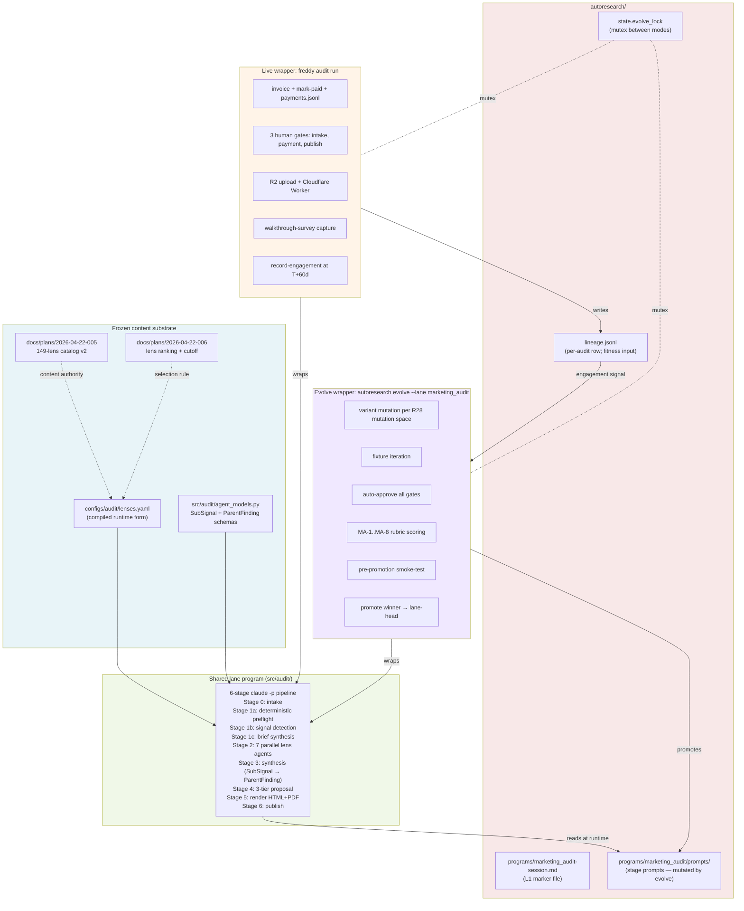

# Marketing Audit engine + autoresearch fusion v1

## Overview

Implementation plan for gofreddy's v1 Marketing Audit engine, fused with `autoresearch/` as the **5th workflow lane** (alongside geo, competitive, monitoring, storyboard; `core` is the 6th non-workflow lane in `lane_runtime.LANES`, used for autoresearch-internal evolve targets, not customer workflows). The audit pipeline runs as **agentic multi-session** `claude -p` CLI subprocesses (≥13 distinct invocations per audit chained via filesystem state — distinct from the single-session `--max-turns` pattern the existing 4 lanes use; see Key Decision §Multi-session orchestration), subscription-billed, no Python SDK. It reads a frozen 149-lens content catalog and self-improves across generations via the autoresearch evolve loop mutating orchestration (stage prompts, lens dispatch, batching, skip conditions). V1 ships as a thin cut — paid audit core + free AI Visibility Scan + 4 attach commands + manual invoicing — optimized for validating conversion (≥2/10 paid audits convert to $15K+ engagements in 60d) before expanding.

**Target ship time:** ~7–9 weeks foundation through first paying audit, ~9–11 weeks including full Bundle E autoresearch loop. (Updated +1 week from prior estimate after rolling back Worker / Unit 16 / attach-ads simplifications and adding R2DocumentStorage, INPUT_HASH plumbing, --gate-status + verify-lineage flags, audit-start preflight.)

## Problem Frame

JR runs a boutique marketing agency. The bottleneck on closing $15K+/mo retainer engagements is a credible opening pitch — prospects need to see depth before trusting the next sales conversation. Hand-producing that depth doesn't scale; generic audits are commodity and don't differentiate.

The bet: a paid $1,000 marketing audit serves as the engagement-anchor lead magnet for $15K+ retainers (credited back on signing within 60 days). A free AI Visibility Scan serves as top-of-funnel to qualify prospects. Both are produced by the same underlying pipeline at different depth settings. Audit depth is defined by the locked 149-lens catalog; self-improvement is the moat that makes audit quality compound over time.

See origin: `docs/brainstorms/2026-04-24-audit-engine-fusion-requirements.md` §Problem Frame.

## Requirements Trace

This plan implements v1 scope against origin requirements:

- **R1–R6** — Commercial flow (free scan, $1K paid audit, two-call model, HTML+PDF deliverable, UUID4-suffix URL slugs)
- **R4, R5, R25** — Operational gates, payment ledger, walkthrough survey leading indicator
- **R7–R12, R26** — Audit pipeline (6 stages, 149-lens catalog, 4 attach commands, cost ceilings, 3-tier proposal, findings schema, deliverable IA)
- **R13–R20, R27, R28** — Self-improving loop (lane-head variant runtime, externalized prompts, offline evolution, evolve_lock mutex, MA-1..MA-8 gradient rubric, anti-Goodhart, engagement judge, evaluator pin, composite fitness, orchestration mutation space)
- **R21–R24** — Data, safety, hygiene (local-first with git-split, owned-provider first, retention, PII hygiene)
- **R29** — Subscription-window SLA (≤50% of 5h window per audit, soft-warn at 40%)

## Scope Boundaries

Per origin doc Scope Boundaries — v1 **explicitly does not ship**:

- Stripe Checkout auto-fire on webhook (payment manual via `mark-paid` + `payments.jsonl` ledger)
- Fireflies webhooks (sales + walkthrough transcripts uploaded manually if needed)
- Slack lead-notification integration
- Capability-registry pricing engine (Stage 4 uses fixed pricing anchors in prompt)
- 5 of 9 attach commands: `attach-esp`, `attach-survey`, `attach-assets`, `attach-demo`, `attach-crm`
- Web UI / dashboard (CLI-only)
- Multi-tenant / white-label
- Outbound prospecting
- Post-sign delivery execution
- Free-tier full audits (only $1–2 scan is free)
- 3-business-day SLA enforcement
- Engagement-invoice credit-note accounting (manual)
- Auto-firing the full paid audit pipeline on form submission (scan still auto-runs per R1)
- Any RAL-style generic runtime (`docs/plans/2026-04-23-004-ral-runtime-design.md` is informational only)

## Context & Research

### Relevant Code and Patterns

**Existing `src/audit/` (feat/fixture-infrastructure branch, 14 files — NOT on main):**

- `src/audit/agent_models.py` (290 lines) — Pydantic `SubSignal`, `ParentFinding`, `AgentOutput`, `HealthScore`, `SectionScoreBreakdown`, `ReportSection` Literal. Matches R12 frozen schema exactly. **Treat as near-frozen content substrate.**
- `src/audit/checkpointing.py` (102 lines) — `write_atomic`, `read_json`, `write_json`, `atomic_update`. Thin, stdlib-only, explicitly no cross-process lock (v1 serializes at worker level per LHR D3).
- `src/audit/preflight/runner.py` (136 lines) — Stage-1a scaffold with `PreflightConfig`, `PreflightResult`, asyncio fan-out with per-check timeouts.
- `src/audit/preflight/checks/{dns,wellknown,schema,badges,headers,social,assets,tooling}.py` — 8 stubs; `dns.py` (128 lines with real dnspython) + `wellknown.py` (154 lines functional) are production-ready, other 6 return `{"implemented": False}`.
- `src/audit/__init__.py` — 22 lines, docstring only.
- `tests/audit/test_agent_models.py`, `tests/audit/test_checkpointing.py` — existing test coverage.

**Autoresearch primitives for direct reuse:**

- `autoresearch/events.py` — `log_event(kind, **data)` + `read_events(kind, path)`. 98-line module, per-write exclusive flock, 100 MB rotation. Raises `EventLogCorruption` on malformed JSON. **Direct-import fit**; needs `path=` param on `log_event` (currently only on `read_events`) for per-audit local log. ~10 LOC + 2 tests (thread `path` through `_ensure_parent` / `_maybe_rotate` / append-with-flock; decide rotation policy when `path=` overrides default `EVENTS_LOG`).
- `autoresearch/runtime_bootstrap.py` — 21-line execv shim. Use `lane_runtime.resolve_runtime_dir(archive_dir)` to resolve the materialized variant directory; skip the `os.execv` swap (doesn't match audit's in-process model).
- `autoresearch/lane_runtime.py` — `LANES` tuple at `:12`, `ensure_materialized_runtime()` at `:117`, `current.json` manifest writer at `:157–159`. Per-lane file copy loop at `:147`.
- `autoresearch/lane_paths.py:36–77` — deprecated shim (fwd to `src/shared/safety/tier_b.py` with DeprecationWarning at import). **Data (`LANES`, `WORKFLOW_PREFIXES`) still defined here**; tier_b module is lane-agnostic, takes these as kwargs. Edit the shim for now; removal target is 4 weeks from 2026-04-23.
- `autoresearch/evolve.py` (1199 lines) — `ALL_LANES` at `:44`, `_build_meta_command` at `:500–521` (Pattern B subprocess), env sanitization at `:58–69`. Hardcoded lane list consumed by `run_all_lanes` at `:453`.
- `autoresearch/evaluate_variant.py` (2507 lines) — `DELIVERABLES` dict at `:44–49` (single-glob-per-lane; extension needed), `_has_deliverables` consumer at `:432–436` (single consumer!), `layer1_validate` at `:544–593` with **hard L1 gate** at `:588` requiring `programs/{domain}-session.md` for every `DOMAINS` entry, `evaluate_single_fixture` at `:1832–1962` (clean per-fixture entry point). `_score_env` at `:638`.
- `autoresearch/frontier.py` — `LANES`/`DOMAINS` at `:15–16`, `objective_score` at `:76–86` (hardcodes `core` vs workflow-lane branching), `best_variant_in_lane` at `:102`. 123 lines total.
- `autoresearch/compute_metrics.py` — `_run_claude_json` at `:224–253` (Pattern C short-shot JSON subprocess), `compute_generation_metrics` at `:91` (lane-agnostic, takes `lane` param — works as-is for marketing_audit). **No `total_cost_usd` parsing anywhere** — new capability required.
- `autoresearch/program_prescription_critic.py:97–117` — Pattern C short-shot, prescription critic.
- `autoresearch/critique_manifest.py` — SHA256 hash freeze for autoresearch internals via `inspect.getsource(getattr(session_evaluator, FROZEN_SYMBOL))` symbol-introspection across `FROZEN_SYMBOLS = ('DEFAULT_PASS_THRESHOLD', 'HARD_FAIL_THRESHOLD', 'GRADIENT_CRITIQUE_TEMPLATE', 'build_critique_prompt', 'compute_decision_threshold')`. **Note:** this mechanism hashes Python symbols, NOT arbitrary file paths. R17 MA-1..MA-8 manifest needs a separate file-bytes hashing module (Unit 18) — symbol introspection won't ingest .md prompt files.
- `autoresearch/regen_program_docs.py:41–44` — domain→program filename mapping (`{"competitive": "competitive-session.md", ...}`). Needs `"marketing_audit"` entry.
- `autoresearch/program_prescription_critic.py:41` — `DOMAINS` tuple. Needs `"marketing_audit"` entry.

**Harness primitives for direct reuse:**

- `harness/sessions.py:55–157` — `SessionsFile(path)` with `.get`/`.all`/`.begin`/`.finish` methods. Frozen dataclasses, threading.Lock for atomic writes. Direct-import fit.
- `harness/sessions.py:129–140` — `claude_session_jsonl(wt_path, sid)` derives claude projects path via `str(wt_path).replace("/", "-")`. Audit uses `clients/<slug>/audit/<audit_id>/` as equivalent of `wt_path`.
- `harness/run.py:115–138` — `_viable_resume_id(record, wt_path) -> str | None`. Free function, importable. Pattern handles "claude silent-hung before first token" case.
- `harness/run.py:347–370` + `:441/502/523/611/633/677/737` — `graceful_stop_requested: bool` + `graceful_stop_reason: str` flags checked at 8 loop points. Not SIGTERM-hooked on main process (only on worktree cleanup).
- `harness/worktree.py:229–245` — `cleanup(wt)` coupled to `Worktree` dataclass. **Don't direct-import**; port the SIGTERM→5s→SIGKILL escalation pattern (`_terminate_backend:349–363`, `_kill_port:366–379`).
- `harness/worktree.py:396–414` — `_install_exit_handlers()` registers atexit + SIGTERM + SIGINT → `os._exit(143)`. Portable pattern.
- `harness/engine.py:192–217` — `_build_claude_cmd` Pattern A (long-form streaming with resume). Specifies `--output-format stream-json --include-partial-messages --verbose --resume <sid>` or `--session-id <sid>`, `--dangerously-skip-permissions`.
- `harness/engine.py:239–290` — `parse_rate_limit` reads stream-json events for `"type": "rate_limit_event"`. Portable for R10/R29 subscription-window tracking.

**Customer-facing prior art:**

- `src/competitive/pdf.py:1–80` — `render_brief_pdf(brief_markdown, client_name) -> bytes` with `markdown` → HTML, `nh3.clean()` sanitization (allowed tags/attrs at `:14–30`), Jinja2 `PackageLoader`, WeasyPrint `_safe_url_fetcher` SSRF guard at `:33–40` (blocks non-data-URI URLs), `asyncio.Semaphore(2)` for CPU-bound concurrency. **Directly portable** — copy skeleton to `src/audit/render.py`, swap template path to `src/audit/templates/`.
- `src/storage/r2_storage.py` + `src/storage/r2_media_storage.py` — `aioboto3`-backed R2 upload infrastructure. `VideoStorage` Protocol is domain-specific but the client factory + key validation + upload/download/delete/list surface is reusable.
- `src/common/cost_recorder.py` (102 lines) — provider-call JSONL logger (Gemini + 3rd-party APIs). **No Claude rate table**; no `extract_claude_usage` helper. Bundle A layer's `cost_ledger.py` on top of it for Claude-specific parsing + per-stage gate.
- `src/common/url_validation.py` — URL validation primitives (exists; verify exact surface during Unit 13).

**Deps in `pyproject.toml`** (verified present): `weasyprint>=62.0`, `markdown>=3.5.0`, `nh3>=0.2.14`, `jinja2>=3.1.0`, `PyYAML>=6.0`, `typer>=0.12.0`, `pydantic>=2.6.0`, `aioboto3>=13.0.0`, `httpx`, `tenacity`, `aiolimiter`, `asyncpg`, `fastapi>=0.115.0`. **No `claude-agent-sdk` dependency** — confirmed. **Python `>=3.13,<3.14`**, uv-managed.

### Institutional Learnings

No `docs/solutions/` directory exists. Institutional knowledge lives in `docs/plans/` and `autoresearch/GAPS.md` + inline comments. Relevant findings:

- **`docs/plans/2026-04-24-001-audit-pipeline-research-record.md`** (860 lines) — yesterday's hand-off doc with file:line citations for every borrowable primitive. **Caveat: written before the CLI-subprocess decision locked**; any citation of `ClaudeSDKClient`, `max_budget_usd`, or SDK hooks needs reinterpretation.
- **`docs/plans/2026-04-23-002-marketing-audit-lhr-design.md`** (469 lines) — pressure-test-revised design. Locks D1 CLI-only v1, D2 mandatory ship gate, D3 serialize at worker (no per-audit worktrees). Recommends starting with 4 broad Stage-2 agents; R28 mutation space allows evolve loop to propose alternatives.
- **`autoresearch/GAPS.md`** — 4 P0 gaps in-flight (Gap 2: meta-agent blind to eval traces; Gap 6: `regression_floor` never enforced; Gap 18: single-run variance; Gap 30: L1 import check). Reinforces R20 pin rationale.
- **`autoresearch/deep-research/cluster-5-autoresearch.md`** F5.3 — honor-system gap in two-evaluator architecture. Mitigation: SHA256-hash-freeze MA-1..MA-8 rubric + judge prompts via existing `autoresearch/critique_manifest.py`.
- **`autoresearch/deep-research/cluster-5-autoresearch.md`** F5.4 — inner-vs-outer correlation telemetry gap. Ship ~30 LOC before first evolve run to detect evaluator drift before holdout failure.
- **`docs/plans/2026-04-23-006-holdout-v1-composition-expansion.md`** — holdout-v1 shipped as 16 fixtures (4 per existing lane) at `~/.config/gofreddy/holdouts/holdout-v1.json`. Marketing_audit holdout authoring deferred until 5+ real audits exist (Bundle 10 §7.6).

### External References

External research not run — the origin doc + design doc 003 + research record 001 + pressure-tested LHR design 2026-04-23-002 already cover the external landscape. Key explicit references:

- `docs/plans/2026-04-24-003-audit-engine-implementation-design.md` (1426 lines) — architecture reference. §2 12 locked decisions, §3 module map, §4–§8 per-bundle detail, §11 JR-owned open decisions.
- `docs/plans/2026-04-22-005-marketing-audit-lens-catalog.md` (2235 lines) — 149-lens content authority (frozen v2 2026-04-23).
- `docs/plans/2026-04-22-006-marketing-audit-lens-ranking.md` (641 lines) — ranking + cutoff (selector).
- `docs/plans/2026-04-20-002-feat-automated-audit-pipeline-plan.md` (1607 lines) — original product spec; **line 416 `claude-agent-sdk>=0.1.0` explicitly retired** per origin doc Key Decision.

## Key Technical Decisions

- **Execution model: direct `claude -p` CLI subprocess, subscription-billed, no Python SDK.** Reuses the per-invocation envelope shape from 4 existing sites (`harness/engine.py:204`, `autoresearch/compute_metrics.py:231`, `autoresearch/evolve.py:504`, `autoresearch/program_prescription_critic.py:106`) — same `--output-format json`, same `total_cost_usd` parsing, same env sanitization. Subscription billing (5h usage windows) traded for no API-key management and no per-token dollar accounting at the CLI layer. **Note:** the per-invocation envelope is reused; the *orchestration* pattern (chained multi-session, see next decision) is net-new. (see origin: `docs/brainstorms/2026-04-24-audit-engine-fusion-requirements.md` Key Decision §Execution model)

- **Multi-session orchestration is a NEW pattern (not multi-turn).** "Multi-turn" describes ONE `claude -p` session with many turns (the harness's `--max-turns 100` agentic mode + autoresearch's `_build_meta_command` are both single-session multi-turn). The audit pipeline is structurally different: 6 stages × ≥7 lens agents in Stage 2 = ≥13 distinct `claude -p` invocations per audit, each with its own `session_id`, each handing context to the next via filesystem state (`brief.md`, `signals.json`, `stage2_subsignals/L*_*.json`, `synthesis.md`, `proposal.md`). This pattern does not exist in autoresearch or harness today — the audit engine is the first instance. Three derived consequences: **(a) Cross-session input fingerprints required.** Each Stage-N session's first-turn prompt must include a deterministic SHA256 of consumed inputs (e.g., Stage 2's prompt header includes `INPUT_HASH=sha256(brief.md + signals.json + lenses_assigned.yaml)`) so cross-stage poisoning (Stage 1b emits a vertical mis-classification → Stages 2–4 silently produce wrong-vertical output) is detectable post-hoc by re-deriving the hash from a known-good input. **(b) Per-lens resume granularity needs an explicit write-ahead-log primitive.** Resuming a 21-lens agent mid-flight (already 11 lenses written) has no precedent in harness (which is whole-task-granular). The atomic-per-lens write pattern (`stage2_subsignals/L<id>_<slug>.json` + `completed_lenses: list[str]` in `AuditState`, written before each lens-call returns) IS the WAL — Unit 10 owns the implementation. **(c) Stage 2's 7-parallel-sessions vs 1-long-session question is explicit.** v1 ships 7 parallel agents per the design doc (justification: per-lens resume + per-agent token-window isolation + parallel wall-clock); R28 mutation space allows the evolve loop to propose 1-long-session or N-broad-agents alternatives if Stage 2 cost dominates. Locked in v1, evolvable post-v1. (see origin: §Architecture, §Stages 0-6 contract)

- **Content/orchestration split is the fusion contract.** 149-lens catalog + SubSignal/ParentFinding Pydantic schemas are frozen content; stage prompts + lens dispatch + batching + skip conditions + synthesis logic are evolvable orchestration. Anti-Goodhart boundary: meta-agent cannot change what it's scored on, only how it produces the output. (see origin: Key Decisions §Content/orchestration split)

- **Marketing_audit is a hybrid object: a lane-tracked variant-producer AND a paid customer-facing service.** The variant-production surface (Stages 0-6 driven by `claude -p` against a frozen catalog + evolvable orchestration) IS the 5th-lane shape — peer to geo/competitive/monitoring/storyboard. The live wrapper (`freddy audit run`) is NOT a peer-of-peer-lane wrapper: it adds commercial flow + 3 human gates + payment ledger + R2 publish + T+60d feedback closure — a net-new object class that none of the 4 existing lanes have. Evolve wrapper (`autoresearch evolve --lane marketing_audit`) IS a peer to other lanes' evolve runs. Same `claude -p` subprocess + same stage prompts + same catalog drives both wrappers' variant-production. The asymmetry is named honestly here so future readers understand "5th lane" applies to the variant-production surface, not to the customer-flow surface — see line 155 fidelity-contract asymmetry for the operational consequence. (see origin: §Architecture)

- **Reuse harness + autoresearch primitives first.** Build audit-specific code only (stage runners, lens dispatch, cache-backed provider tools, preflight, render, publish, CLI). Direct-import or extend-in-place for session tracking, event logging, cost tracking, resume, cleanup, graceful-stop, prompt-loader, evolve lock, rubric scoring. Coupling risk mitigated by R20 (pin evaluator at ship). (see origin: Key Decisions §Autoresearch + harness primitives first)

- **Customer-facing lane = first of its kind.** Pre-promotion smoke-test required before any new variant becomes lane-head. Runs against one holdout fixture; MA-1..MA-8 scores must not regress vs current head. Uses Plan B MVP holdout-v1 infra. (see origin: Key Decisions §Customer-facing lane risk class)

- **Cost-weighted fitness function.** `fitness = weighted_rubric_score − cost_penalty × normalized_token_cost − latency_penalty × normalized_wall_clock`. MA-1..MA-8 contribute rubric score per individual weights (engagement weight = 0 for first 3 generations per R19, ramps up as T+60d data accumulates). Token efficiency is first-class optimization target, not a constraint. (see origin: R27)

- **Subscription-window SLA (R29).** One paid audit consumes ≤50% of a 5h window. Soft-warn at 40% (Slack-alerts JR but proceeds), hard breaker at 50% (halts Stage 2+ fan-out, sets `pause_reason=subscription_window_ceiling`, resumes next window via `freddy audit resume`). Protects multi-audit throughput on subscription billing.

- **`configs/audit/lenses.yaml` is a JR-coordinated content work-stream, not greenfield code.** ~4–6h per entry × ~198 entries = multi-day task. Python loader is trivial (~50 LOC); the content transcription is the real cost. Decouple this from Bundle B code work so Stage-2 fan-out can be tested against a small subset of lenses before the full catalog lands.

- **SubSignal failures score as `null/excluded`, not `0`.** Zero compounds through geometric mean and tanks the domain score for one bad block. `null` is excluded from the geomean, counted separately in `gap_report.md`. (institutional learning from cluster-5 F5.3)

- **`asyncio.gather(return_exceptions=True)`, not `TaskGroup`.** TaskGroup is fail-fast by default — one lens exception kills sibling lens tasks. `return_exceptions=True` preserves partial completion. (institutional learning from LHR design §v1)

- **`src/audit/claude_subprocess.py` ships three factories** for the three CLI invocation patterns already in the codebase:
  - `build_cmd_streaming(prompt, model, session_id, resume=False)` — Pattern A, Stage 2 lens agents (multi-turn, filesystem-writing)
  - `build_cmd_meta(model, max_turns, allowed_tools)` — Pattern B, Stage 1b brief-gen, Stage 3 synthesis, Stage 4 proposal (one-shot but long-form, writes files)
  - `build_cmd_short_json(prompt, model)` — Pattern C, critic calls, redaction pass per R24, MA-1..MA-8 rubric judges (short, returns JSON envelope)

- **Start Stage-2 with 7 lens agents per design doc**; let the evolve loop propose alternatives via R28 mutation space. The LHR design's "4 broad agents" advice is valid but R28 subsumes it — structure is evolvable, not a v1 lock-in.

- **Lens-dispatch coverage invariant (anti-Goodhart at dispatch level).** Frozen content (Pydantic schemas + catalog) closes the *schema* gaming surface but not the *dispatch* gaming surface. MA-5 (Bundle applicability) and MA-8 (Data-gap recalibration) could be gamed by narrowing lens dispatch — fewer lenses fire = fewer gap-flags = inflated MA-8; dispatched-bundles-match-detection is trivially true if we only dispatch easy-match bundles. Mitigation: Stage 1b emits an auditable **dispatch rationale log** alongside SubSignals; MA-5 and MA-8 judges score *the decision to skip* against that log, not just the results of lenses that fired. Minimum-coverage floor: every audit must dispatch ≥80% of always-on lenses unless Phase-0 signals justify skip per logged rule.

- **Live-wrapper contract differs from evolve-wrapper contract.** The "shared lane program" framing (marketing_audit is the 5th lane) is structurally accurate but under-states a fidelity-contract asymmetry: (a) live path requires deterministic reproducibility from a frozen variant snapshot — a promoted variant must be live-safe (no net-new tool surface, no net-new external hostname); (b) cost-penalty term in composite fitness (R27) has a floor below which it stops contributing, preventing token-optimization from cannibalizing customer-facing deliverable quality (a $5 token saving that degrades MA-6 polish is a bad trade on a $1K deliverable); (c) any variant promotion must pass a "live-safe" pre-check in addition to the pre-promotion smoke-test (Unit 18). This decision is the real content of "customer-facing lane is new risk class."

- **Payment ledger compound idempotency.** The `payments.jsonl` ledger is **operator-attested** (not cryptographically non-repudiable) in v1. Idempotency key is `(audit_id, normalized_ref)` compound — not `ref` alone. `normalized_ref = lower(trim(ref))` so typo cases collapse correctly. Empty/whitespace ref is rejected, not defaulted. Duplicate attempts append their own event type `mark-paid-duplicate-attempted` to the ledger, preserving non-repudiation of the attempt (not just the first successful write). Future Stripe integration (v2) signs each entry with HMAC keyed on server secret + chain-hash of prior entry for tamper-evidence; pre-design in v1 by including `chain_hash_sha256` field in schema but leaving null until v2 signing ships. Related: `record-engagement` requires a `--ref <invoice-id-or-contract-id>` cross-referencing payments.jsonl so engagement signal is auditable against actual commercial records.

- **Pre-promotion smoke-test fail-closed policy: X.a is the v1 default (locked).** Marketing_audit holdout fixtures do not exist at v1 ship time; Bundle 10 §7.6 defers them until "5+ real audits exist." Therefore: **No variant promotion permitted in v1.** Lane ships without evolve-loop-driven variant rotation. Manual head-selection only — JR commits a single variant before first paying audit and the lane-head stays put for the entire 10-audit measurement window. The pre-promotion smoke-test infrastructure (Unit 18) ships as plumbing for v1.5; the gate enforces nothing in v1 because no promotion happens. X.b (smoke-test on cross-lane fixtures + `--manual-promote` flag) is **rejected** as a design flaw — passes MA-5/MA-6 degenerate cases and provides false assurance on the exact regression surface we need to catch. Missing fixture or smoke-test failure → **fail-closed** (halt promotion), never silent-skip. Fixtures land post-audit-3 (with prospect consent — see Open Question §Reader-readability + holdout-fixture sourcing); v1.5 unlocks variant rotation once ≥1 fixture exists.

- **DELIVERABLES shape: flat tuple with judge-vs-publish discrimination split.** Migrate `DELIVERABLES` dict to uniform `tuple[str, ...]` (minimal blast radius — one consumer at `evaluate_variant.py:433`). Keep judge-vs-publish discrimination in the separate `_JUDGE_PRIMARY_DELIVERABLE` map (already present in `src/evaluation/service.py:49–56`). Accept that a future 3rd discriminator (e.g., analytics export, third-party distribution) forces a second migration toward a structured `{'primary', 'artifacts', 'analytics'}` dict. Deferred cost is ~half a day of one additional migration vs saving ~2 days now.

- **Execution model ResultMessage field semantics (Unit 3/4 correctness).** Claude CLI `--output-format json` envelope fields:
  - `total_cost_usd` — Anthropic's estimated API cost (populated on subscription too — no fallback-to-tokens math needed)
  - `duration_ms` — wall-clock including local tool execution (Bash, Read, Edit, WebFetch)
  - `duration_api_ms` — API-call-only time (the quantity that counts against the 5h subscription window)
  - `subtype` gates `result` field presence: `"success"` → read `result`; error subtypes → read `errors: string[]`
  - `usage.{input,output,cache_creation_input,cache_read_input}_tokens` — nested under `usage`
  - `num_turns` — top-level
  R29 subscription-window SLA uses `duration_api_ms` (not `duration_ms`) to avoid false positives on tool-heavy stages. Wall-clock `duration_ms` still logged for UX + graceful-stop wall-clock bound.

- **Claude CLI version pin.** `claude` Node binary is an external dependency not under repo version control. Unit 19 pins autoresearch but must also pin the `claude` CLI version (via a preflight assertion at audit start: fail fast if running CLI version ≠ pinned). If the CLI output format drifts (e.g., envelope field shape change), parse_result_message silently returns wrong values; pinning CLI version prevents that.

- **URL slug drops client-name prefix.** R6 origin doc specifies `reports.gofreddy.ai/<client-name>-<uuid4>/`. Competitive-confidentiality concern: the prefix advertises JR's engagement with a specific client to anyone scraping referrers or search engines. Change slug format to `reports.gofreddy.ai/<uuid4>/` (no prefix). Combined with `X-Robots-Tag: noindex` on deliverable responses + `Referrer-Policy: no-referrer` + `robots.txt` disallow-all, this closes the identity-leak surface. **This amends origin doc R1 + R6 slug specification** — a narrow, defensible deviation grounded in security review.

- **Engagement signal cross-validation.** `record-engagement` writes the sole ground-truth fitness input. Three validation rails: (a) requires `--ref <invoice-id-or-contract-id>` cross-referencing `payments.jsonl` — signal is auditable against commercial records; (b) fitness engagement judge emits `low_confidence=true` for entries recorded <24h after audit (likely test data) or >90d after audit (likely memory-based estimate); (c) amounts >$15K require separate JR-signed confirmation CLI flow (`--confirm-high-value`). `record-engagement --dry-run` prints intended lineage.jsonl change without writing.

- **Two distinct lineage files: `audits/lineage.jsonl` vs `autoresearch/archive/lineage.jsonl`.** These are SEPARATE concerns and must not be unified: (a) **`audits/lineage.jsonl`** — customer-facing audit record. One row per paying audit. Schema includes `audit_id, variant_id, client_slug, prospect_domain, published_at, engagement_recorded_at, engagement_signed_usd, ref, low_confidence, high_value_confirmed, walkthrough_survey`. Written by Stage 6 publish + `record-engagement` CLI. Consumed by engagement judge (Unit 18) at T+60d. Lives outside autoresearch tree. (b) **`autoresearch/archive/lineage.jsonl`** — variant lineage. One row per scored variant. Schema includes `id, lane, parent, scores, search_metrics, holdout_metrics, suite_versions, changed_files, campaign_ids, promotion_summary` (per existing `evaluate_variant._lineage_entry:1177-1249`). Written by autoresearch evolve loop. Consumed by frontier selection. Lives in autoresearch tree. **Join key: `audits/lineage.jsonl.variant_id == autoresearch/archive/lineage.jsonl.id`** — engagement signal flows from customer record into variant lineage via this join, computed in the engagement judge before writing the per-variant signal JSONL. Without this explicit split, the two paths drift; reviewers see "lineage.jsonl" referenced and can't tell which file is meant.

## Open Questions

### Resolved During Planning

- **Branch starting state for `src/audit/`.** Research-analyst confirmed `feat/fixture-infrastructure` has 14 files (agent_models.py, checkpointing.py, preflight scaffold); `main` is empty. Bundle A subsystem 1 (exceptions + state at commit `19a4778`) may have been reverted per working direction. **Resolution:** Unit 1 reconciles state at plan-execution start — merge `feat/fixture-infrastructure` into a new working branch, verify the 14 existing files against the plan's Bundle A file list, confirm `agent_models.py` + `checkpointing.py` + `preflight/runner.py` survive, proceed from that baseline.

- **`lane_paths.py` deprecated shim target.** Research confirmed the data (`LANES`, `WORKFLOW_PREFIXES`) still lives in the shim at `:36–77`; `tier_b.py` is lane-agnostic and takes these as kwargs. **Resolution:** Edit the shim for now — shim-removal clock is 4 weeks from 2026-04-23 (started when refactor 007 merged). If shim is removed mid-project, re-route edits to whatever replaces it; this is a maintenance window, not a v1 design question.

- **4 vs 7 Stage-2 agents.** LHR design recommends 4 broad; design doc 003 specifies 7. **Resolution:** Start at 7 per design; R28 mutation space allows evolve to discover optimal batching. Not a lock-in.

- **Deliverable IA pattern.** R26 specifies consultant-memo: (1) executive summary + health score, (2) top-3 actions by cost-of-delay × effort-ratio, (3) findings by marketing area with severity weighting (collapsed HTML, expanded PDF), (4) proposal tiers, (5) methodology appendix. **Resolution:** Lock in Bundle C templates; no further product-level iteration needed.

- **Free scan implementation.** Unified with paid audit at `depth=scan` per origin Key Decisions. Same lane, same pipeline, parameterized. **Resolution:** Unit 14 CLI handles `--depth scan` vs `--depth full`.

- **DELIVERABLES dict migration.** Research confirmed single consumer at `evaluate_variant.py:433`. **Resolution:** Migrate value type uniformly to `tuple[str, ...]` — one-line change for existing lanes, 5-tuple for marketing_audit (findings.md, report.md, report.json, report.html, report.pdf). Call site becomes `any(list(session_dir.glob(g)) for g in DELIVERABLES[domain])`.

- **L1 validation gate marker file.** `evaluate_variant.py:588` requires `programs/{domain}-session.md` exact path for every `DOMAINS` entry. **Resolution:** Ship `autoresearch/archive/current_runtime/programs/marketing_audit-session.md` as a thin marker file pointing to `programs/marketing_audit/prompts/` subdirectory. Satisfies L1 without needing validator extension. Marker file is one of the 3 new autoresearch files in Bundle E.

### Deferred to Implementation

- **`configs/audit/lenses.yaml` transcription ownership + timeline.** Per origin doc Dependencies — ~4–6h per entry × ~198 entries = multi-day JR-coordinated task. Can partially proceed before the YAML is complete (Stage-2 fan-out can be tested against a minimal 10–20 lens subset). Full catalog required before Bundle E evolve runs have meaningful signal.

- **MA-1..MA-8 rubric prompt transcription (Unit 15 deliverable).** Each of the 8 criteria needs a ~50-100 LOC prompt template matching the quality bar of existing `_GEO_1..._GEO_8` in `src/evaluation/rubrics.py` (rubric anchors + scoring band examples per integer step + edge cases + JSON output schema). Estimate: ~2-4h per criterion × 8 = ~16-32 hours JR-coordinated content authoring. Embedded in the prompts: (a) MA-5 + MA-8 must score against Stage 1b's `dispatch_rationale.md` per anti-Goodhart Key Decision, not just dispatched-lens output; (b) MA-4 must surface token-count from variant context. The 8 prompt strings are SHA256-frozen via `marketing_audit_prompt_manifest.py` (Unit 18) so any post-ship rubric drift is caught by L1. Bundle D ships scaffolding + tests against placeholder prompts; rubric correctness is gated on the transcription, which is the v1 critical-path content dependency analogous to the 149-lens YAML. Partial transcription (e.g., MA-1+MA-3+MA-7 first, since they drive most of the deliverable quality signal) unblocks early evolve dry-runs against fixtures once fixtures exist.

- **Stage prompt + critic prompt transcription (Bundle B + Unit 18 deliverables).** Adjacent content-authoring dependency: `stage_1b_signals.md`, `stage_1c_brief.md`, `stage_2_lens_meta.md`, `stage_3_synthesis.md`, `stage_4_proposal.md`, `inner_loop_critic.md`, `stage_0_intake.md`, `stage_1a_preflight.md`. Each is ~100-200 LOC of structured agent guidance (role, objective, lens assignment for stage_2_lens_meta, rubric checklist, output contract). Estimate: ~4-8h per stage prompt × 8 = ~32-64 hours JR-coordinated. Stage prompts are also SHA256-frozen in the manifest so evolve loop mutations are explicit promotion events, not silent drift.

- **Total content-authoring critical path:** ~800-1200h (149-lens YAML) + ~16-32h (rubric prompts) + ~32-64h (stage prompts) = roughly **850-1300 hours of JR-coordinated content work** runs parallel to the ~7-9 weeks of code work. Stage-2 dev unblocks at 10-20 lenses + minimal stage prompts; Bundle E evolve runs gate on full catalog + full rubric prompts + holdout fixtures.

- **Autoresearch pin commit selection.** Per R20, pin at first ship. Planning-phase decision owned by JR; trivial to implement (add `.github/workflows/` CI check that verifies `autoresearch/` tree SHA matches the tagged commit). Target: `autoresearch-audit-stable-YYYYMMDD` tag format.

- **Fixed pricing anchors for Stage-4 proposal prompt.** Specific numbers for Fix-it / Build-it / Run-it tiers. JR-owned content decision; Stage-4 prompt file stays as a template until anchors land.

- **5 synthetic prospect fixtures for marketing_audit eval suite.** Research indicates this is deferred per Bundle 10 §7.6 until 5+ real audits exist. Bundle E can ship the lane registration + evolve_lock + engagement judge infrastructure before this lands; first evolve run waits on fixtures.

- **Cloudflare Worker deployment + R2 bucket + DNS.** Operator-side ops task. v1 ships **two Worker concerns split**: (a) **deliverable-serving Worker (v1)** — single-purpose ~20 LOC response-path mediator on reports.gofreddy.ai/* that injects `X-Robots-Tag: noindex` + `Referrer-Policy: no-referrer` + `X-Content-Type-Options: nosniff` + `Cache-Control: private, no-store`. Required because R2 cannot set arbitrary response headers at upload time; the noindex header is a security requirement (R6), not a nice-to-have. (b) **intake-form Worker (deferred to v1.5)** — handles scan form intake, rate-limits, SSRF guard, etc. Deferred because operator-fired scan via `freddy audit run --depth scan` covers v1 intake. JR-owned pre-Unit-13: R2 bucket creation, DNS for reports.gofreddy.ai, deliverable Worker deploy + R2 binding (or origin-proxy fallback). Intake-form Worker awaits 2/10 conversion gate.

- **Reader-readability + holdout-fixture sourcing (149-lens v1 ship).** Premise C from re-review: 149 always-on + 25 vertical + 10 geo + 5 segment + 9 Phase-0 = ~198 catalog entries × ~4-6h transcription = ~800-1200 hours JR-coordinated content authoring on the critical path. v1 keeps the full 149-lens scope (catalog is locked content authority — shrinking changes brand promise of "comprehensive 149-lens marketing audit"), but two open validations gate density/IA choices: (a) **Reader-readability validation** — has any human read a 30+ page marketing audit deliverable end-to-end? Decide: validate via dogfood read of fixture deliverable PDF before audit 1 ships, OR validate live with audit-1 prospect (with consent) and adjust IA between audit 1 and audit 5. (b) **Holdout-fixture sourcing** — Bundle 10 §7.6 defers fixtures until "5+ real audits exist." Decide: synthesize fixtures (faster but synthetic regression surface ≠ real-input variability) OR author fixtures from first 3 paying audits with prospect NDA + consent (slower but real-input distribution). Recommendation: live IA validation + consent-based fixture sourcing — collapses wait time and uses real-input variability the synthetic fixtures can't capture.

- **Claude subscription tier selection.** R29 50% ceiling assumes a single 5h window; if JR is on a higher tier (e.g., Team), the ceiling math scales. Defer sizing until first 5 dogfood audits produce real token-count data.

- **Exact Mermaid render strategy for HTML deliverable.** R26 mentions diagrams indirectly (severity visualization); no explicit Mermaid requirement. Defer — if Bundle C deliverable IA calls for diagrams, decide client-side JS render vs server-side PNG during implementation.

## High-Level Technical Design

> *This illustrates the intended approach and is directional guidance for review, not implementation specification. The implementing agent should treat it as context, not code to reproduce.*

The audit engine is a native autoresearch lane with two wrappers around a shared lane program. The wrappers differ only in what they add around the 6-stage `claude -p` subprocess chain.



The key insight: gates and commercial side-effects live in the live wrapper, not in the lane program itself. The variant-production surface (Stages 0-6) is identical in both modes — that part DOES match the existing 4-lane pattern. **The asymmetry that "5th lane" framing hides:** existing lanes (geo/competitive/monitoring/storyboard) have NO commercial wrapper, NO payment ledger, NO human gates, NO R2 publish, NO downstream consumer outside autoresearch — their promoted variants get consumed by other autoresearch machinery (fitness scoring, fixture eval), not by paying customers. Marketing_audit's live wrapper is therefore a net-new object class, not a thin shell around a peer lane. The fidelity-contract asymmetry below (live-safe pre-check, cost-penalty floor, deterministic reproducibility from frozen variant snapshot) is the operational consequence.

## Implementation Units

### Phase 1 — Foundation (Bundle A)

- [ ] **Unit 1: Reconcile `src/audit/` branch state + verify deps**

**Goal:** Establish the working-branch baseline for v1 implementation. Merge existing `feat/fixture-infrastructure` audit files into a new working branch, verify deps, confirm no drift from the plan.

**Requirements:** Enables all subsequent units.

**Dependencies:** None.

**Files:**
- Verify: `src/audit/agent_models.py` (existing, 290 lines; R12-aligned — keep as-is)
- Verify: `src/audit/checkpointing.py` (existing, 102 lines; keep as-is)
- Verify: `src/audit/preflight/runner.py` + 8 check stubs (existing)
- Verify: `tests/audit/test_agent_models.py`, `tests/audit/test_checkpointing.py` (existing)
- Verify: `pyproject.toml` deps present (weasyprint, nh3, jinja2, markdown, PyYAML, aioboto3, typer, pydantic, tenacity, aiolimiter)
- Modify: create working branch `feat/audit-engine-v1` off `feat/fixture-infrastructure`

**Approach:**
- Survey existing `src/audit/` state; flag any drift from origin doc R8, R12, R14
- Confirm no `claude-agent-sdk` references in pyproject.toml or code (per origin Key Decision)
- If `src/audit/exceptions.py` or `src/audit/state.py` exist from reverted subsystem 1 (commit `19a4778`), delete before Unit 4 rebuilds them cleanly from the plan
- Tests pass on baseline before Unit 2 starts

**Patterns to follow:**
- Existing branch layout (single `feat/audit-engine-v1`, no per-audit worktrees per LHR D3)

**Test scenarios:**
- Test expectation: none — reconciliation unit, no behavioral change. `pytest tests/audit/` must still pass on baseline (smoke).

**Verification:**
- `pytest tests/audit/test_agent_models.py tests/audit/test_checkpointing.py` passes
- `grep -rn claude_agent_sdk src/ harness/ autoresearch/ pyproject.toml uv.lock` returns no matches
- Working branch has all 14 existing `src/audit/` files present

---

- [ ] **Unit 2: Foundation primitives batch 1 — exceptions, state, sessions**

**Goal:** Ship the three primitives every other Bundle A file imports from. Port session tracking from harness; add audit-specific exception hierarchy and state machine.

**Requirements:** R7 (per-stage checkpoints), R20 (local-first storage).

**Dependencies:** Unit 1.

**Files:**
- Create: `src/audit/exceptions.py` (typed errors: `AuditError` base + `CostCeilingReached`, `SubscriptionWindowExceeded`, `RateLimitHit`, `ViableResumeFailed`, `MalformedSubSignalError`, `LaneRegistrationError`, `EvolveLockHeld`)
- Create: `src/audit/state.py` (`AuditState` dataclass wrapping `checkpointing.atomic_update`; fields: `audit_id`, `client_slug`, `prospect_domain`, `status`, `total_cost_usd`, `graceful_stop_requested`, `graceful_stop_reason`, `completed_lenses`, `failed_lenses`, `bundles_activated`, `pause_reason`, `sessions` dict, `stage2_pids: list[int]` for Stage 2 fan-out cleanup defense per Unit 10 sync/async boundary contract)
- Create: `src/audit/sessions.py` (thin wrapper around `harness/sessions.SessionsFile` scoped to an audit directory)
- Create: `tests/audit/test_state.py`
- Create: `tests/audit/test_sessions.py`
- Test: `tests/audit/test_exceptions.py` (exception hierarchy + `isinstance` checks)

**Approach:**
- `state.py`: use `checkpointing.atomic_update` for all mutations (no new file-lock primitive); mirror the frozen-dataclass convention (`@dataclass(frozen=True)`, `replace()` for transitions)
- `sessions.py`: direct-import `harness.sessions.SessionsFile`, re-export scoped to `clients/<slug>/audit/<audit_id>/sessions.json`
- `exceptions.py`: flat hierarchy; all typed errors inherit from `AuditError`; add docstrings naming which pipeline stage raises each

**Execution note:** Start with a failing test for `AuditState.mutate()` concurrency — two threads calling `.mutate` must serialize without lost writes.

**Patterns to follow:**
- Frozen dataclass convention: `harness/sessions.py:45`, `autoresearch/evaluate_variant.py:91–113`, existing `src/audit/agent_models.py`
- `os.replace` atomic pattern: `src/audit/checkpointing.py:36–64`

**Test scenarios:**
- Happy path: AuditState init → mutate status → persist → reload → verify fields round-trip intact
- Happy path: SessionsFile `.begin(agent_key, session_id, engine="claude")` → `.finish(agent_key, "complete")` → status transitions correctly
- Edge case: concurrent `AuditState.mutate()` from 2 threads (200 increments each) — no lost writes, final count = 400
- Edge case: AuditState load from corrupt JSON → raises typed error, original file preserved
- Error path: `ViableResumeFailed` raised when session_id recorded but claude JSONL missing from `~/.claude/projects/`
- Integration: state.json + sessions.json in same audit dir; audit resume reads both

**Verification:**
- AuditState persist + reload round-trips cleanly
- Concurrent writes under threading.Lock produce no lost updates
- `isinstance(CostCeilingReached(...), AuditError)` is True; pytest confirms exception hierarchy

---

- [ ] **Unit 3: `claude_subprocess.py` — shared CLI invocation helper**

**Goal:** Consolidate the three existing claude CLI invocation patterns behind a single helper module. Everything else in Bundle A+B that invokes `claude -p` uses these factories.

**Requirements:** R7 (CLI subprocess execution), R10 (token parsing for cost enforcement).

**Dependencies:** Unit 2 (uses `AuditState`, `exceptions`).

**Files:**
- Create: `src/audit/claude_subprocess.py` (three factories + stream-json tail parser)
- Create: `tests/audit/test_claude_subprocess.py`

**Approach:**
- All three factories accept a required `cwd: Path` argument and pass it to `subprocess.Popen(..., cwd=cwd, ...)`. **`cwd` MUST be the audit directory** (`clients/<slug>/audit/<audit_id>/`) so that `harness/sessions.claude_session_jsonl(cwd, session_id)` resolves correctly to the JSONL `claude` writes at `~/.claude/projects/<cwd-encoded>/<session_id>.jsonl`. Without this, `--resume <session_id>` errors out (see `harness/sessions.py:135-137`). Add `assert cwd.is_dir()` precondition at function entry.
- `build_cmd_streaming(prompt, model, session_id, cwd, resume=False, max_turns=None)` → Pattern A for Stage 2 lens agents. Mirrors `harness/engine.py:_build_claude_cmd` shape; mirrors the `--resume`-vs-`--session-id` exclusivity convention from `harness/engine.py:_build_claude_cmd` (when `resume=True`, prepends `_RESUME_PROMPT` continue-string to `prompt`; never passes both flags).
- `build_cmd_meta(model, max_turns, cwd, allowed_tools=None)` → Pattern B for Stage 1b brief-gen + Stage 3 synthesis + Stage 4 proposal. Prompt fed via stdin. Mirrors `autoresearch/evolve.py:_build_meta_command`.
- `build_cmd_short_json(prompt, model, cwd, session_id=None)` → Pattern C for critic calls, MA-1..MA-8 rubric judges, R24 redaction pass. Mirrors `autoresearch/compute_metrics.py:_run_claude_json`.
- `parse_rate_limit(stream_json_tail)` → port `harness/engine.py:239–290` verbatim.
- `parse_result_message(json_envelope)` → **net-new**. Extracts (all top-level except `usage.*`): `total_cost_usd`, `duration_ms` (wall-clock including tools), **`duration_api_ms` (API-only time for R29 SLA)**, `subtype` (success/error_max_turns/error_during_execution/error_max_budget_usd/error_max_structured_output_retries), `result` (success subtype only), `errors` (error subtypes), `num_turns`, `session_id`, `is_error`, `stop_reason`, and nested `usage.{input,output,cache_creation_input,cache_read_input}_tokens`. Returns typed `ResultMessage` dataclass with subtype-based dispatch (success path populates `result`; error path populates `errors`).
- Env sanitization via **13-key allowlist** copied from `autoresearch/evolve.py:58–69`: PATH, HOME, USER, SHELL, TERM, LANG, TMPDIR, SSH_AUTH_SOCK, ANTHROPIC_API_KEY, CLAUDE_CODE_OAUTH_TOKEN, FREDDY_API_URL, FREDDY_API_KEY, OPENAI_API_KEY. **Subscription-only billing is the v1 default per Key Decision §Execution model.** ANTHROPIC_API_KEY retention in the allowlist is **defensive** (preserves the option to fall back to API mode if subscription is unavailable mid-run); production `freddy audit run` invocations MUST run with `ANTHROPIC_API_KEY` unset in JR's production env and `CLAUDE_CODE_OAUTH_TOKEN` set. If both happen to be set, the claude CLI prefers OAuth (verified empirically). Unit 4 cost_ledger asserts at audit-start that `CLAUDE_CODE_OAUTH_TOKEN` is set, raising `MissingSubscriptionToken` if not — this is the policy enforcement point, not the env allowlist.

**Execution note:** Test-first for `parse_result_message` — claude's envelope shape is the novel capability, write tests against captured fixture envelopes before implementing.

**Patterns to follow:**
- `harness/engine.py:192–217` for Pattern A signature
- `autoresearch/evolve.py:500–521` for Pattern B
- `autoresearch/compute_metrics.py:224–253` for Pattern C
- `harness/engine.py:239–290` for rate-limit tail parsing

**Test scenarios:**
- Happy path: Pattern A cmd has correct flag order (`-p`, `--output-format stream-json`, `--resume <sid>`, `--model`, `--dangerously-skip-permissions`)
- Happy path: Pattern C cmd includes `--session-id <uuid>` + `--output-format json`
- Happy path: `parse_result_message` extracts cost + tokens from fixture envelope; returns `ResultMessage` dataclass
- Edge case: envelope missing `total_cost_usd` (subscription-billed case) — returns 0.0, still parses tokens
- Edge case: malformed JSON envelope raises typed error
- Edge case: `parse_rate_limit` detects `"type": "rate_limit_event"` in stream-json tail
- Error path: env sanitization strips `ANTHROPIC_API_KEY`, retains `CLAUDE_CODE_OAUTH_TOKEN` (subscription auth)
- Integration: end-to-end Pattern A cmd construction + env setup for a fixture call (smoke-only, not actually invoking claude)

**Verification:**
- All 3 factories return `list[str]` commands matching the existing-site patterns byte-for-byte on fixture inputs
- `parse_result_message` round-trips all fields from a captured fixture envelope
- `parse_rate_limit` detects rate-limit events in fixture stream-json

---

- [ ] **Unit 4: `cost_ledger.py` — claude cost parsing + per-stage gate enforcement**

**Goal:** Ship the net-new capability the codebase doesn't have: parse claude's `total_cost_usd` from every `ResultMessage`, accumulate per-stage, enforce R10 soft/hard breakers, enforce R29 subscription-window SLA.

**Requirements:** R10 (cost ceilings), R29 (subscription-window SLA).

**Dependencies:** Unit 2 (state.py), Unit 3 (claude_subprocess parse_result_message).

**Files:**
- Create: `src/audit/cost_ledger.py` (`CostLedger(state_file, mode)` — `mode` in `{audit, scan}`; `.record(role, result_message, metadata)` appends to `cost_log.jsonl` + updates state + enforces breakers; soft-warn/hard-breaker thresholds from R10)
- Modify: `src/common/cost_recorder.py` — add `claude_rates(model)` helper matching existing `_gemini_rates` shape (for inferred-API-cost conversion when subscription billing produces `total_cost_usd=0`)
- Create: `tests/audit/test_cost_ledger.py`

**Approach:**
- Audit mode: soft-warn at $100 (Slack stub — deferred, emits stderr log only), hard breaker at $150
- Scan mode: $2 hard breaker
- Subscription-window tracking (R29): use **`duration_api_ms`** (NOT `duration_ms`) for SLA math — the subscription bucket is API-time, not wall-clock. Soft-warn at 40% of 5h API-time (72 min of API-time), hard at 50% (90 min); halts Stage 2+ fan-out and sets `pause_reason=subscription_window_ceiling`. Wall-clock `duration_ms` still tracked for UX + graceful-stop wall-clock bound.
- On subscription billing: `total_cost_usd` is Anthropic's *estimated* API cost for the work done — typically populated, no fallback to tokens × rates needed. Verify this assumption against a real subscription call during Unit 4 testing; if `total_cost_usd` is 0 on subscription, fall back to token-count × `claude_rates(model)` inferred cost.

**Execution note:** Test-first. The parse → ledger → gate flow is the novel capability; define expected behavior via fixture envelopes before implementing the ledger class.

**Patterns to follow:**
- `src/common/cost_recorder.py` for JSONL append pattern (aiofiles, no flock — single-process v1 per LHR D3 serialization)
- `autoresearch/events.py` per-write flock (consider adopting for multi-process safety if Bundle E evolve loop ever runs parallel to a live audit — but R16 evolve_lock mutex prevents that)

**Test scenarios:**
- Happy path: record 3 calls, total_cost_usd sums correctly, cost_log.jsonl has 3 rows
- Happy path: audit mode hard breaker at $150 raises `CostCeilingReached`, sets `state.pause_reason=cost_ceiling`
- Happy path: scan mode ceiling at $2 triggers at $2.01
- Edge case: subscription billing (envelope total_cost_usd=0) — falls back to token × rate inferred cost, ceiling math still works
- Edge case: R29 subscription-window soft-warn at 40% wall-clock budget; hard breaker at 50%
- Error path: malformed cost_log.jsonl → `CostLedger.load_history` raises typed error
- Error path: `CostCeilingReached` exception caught by pipeline runner, persists state, allows resume
- Integration: cost_ledger + state → pause_reason flows through resume path correctly

**Verification:**
- Fixture-driven test suite covering audit + scan modes, subscription + API billing, soft-warn + hard-breaker transitions
- `cost_log.jsonl` in realistic audit directory has one row per stage with tokens + cost + model + metadata

---

- [ ] **Unit 5: Foundation primitives batch 2 — graceful_stop, resume, cleanup**

**Goal:** Port the three harness primitives the audit pipeline needs for resumability and clean shutdown. Thin ports, no new functionality.

**Requirements:** R7 (resumable 6-stage pipeline), R10/R29 (graceful halt on cost/window breach).

**Dependencies:** Unit 2 (state.py).

**Files:**
- Create: `src/audit/graceful_stop.py` (dict-based flag on `AuditState`; set by cost_ledger on breach or external signal)
- Create: `src/audit/resume.py` (`_viable_resume_id(record, audit_dir) -> str | None`; `build_resume_plan(state) -> ResumePlan` listing must_restart + can_resume + completed_lenses to skip)
- Create: `src/audit/cleanup.py` (`atexit` + SIGTERM + SIGINT handlers with wait(5s) + SIGKILL escalation)
- Create: `tests/audit/test_resume.py`
- Create: `tests/audit/test_graceful_stop.py`
- Create: `tests/audit/test_cleanup.py`

**Approach:**
- `graceful_stop`: `AuditState.graceful_stop_requested: bool` + `.graceful_stop_reason: str`; checked between stages and inside Stage-2 fan-out; no SIGTERM hook on main process (the audit runs under JR's terminal)
- `resume.py`: port `harness/run.py:115–138` `_viable_resume_id` verbatim. For each recorded session in state.sessions, check the claude projects JSONL exists at `~/.claude/projects/<encoded-audit-dir>/<sid>.jsonl`. **`encoded-audit-dir` derives from the audit directory the original `claude -p` was invoked with `cwd=clients/<slug>/audit/<audit_id>/`** — Unit 3 factories assert this cwd; `resume.py` mirrors the derivation by calling `harness.sessions.claude_session_jsonl(audit_dir, sid)`. Missing JSONL → force restart of that session. **Before reaching the JSONL derivation, `build_resume_plan` validates `audit_dir.is_dir()` and raises `ViableResumeFailed(audit_id)` if missing** — this prevents Unit 3's `assert cwd.is_dir()` from firing downstream with an opaque AssertionError when JR runs `freddy audit resume <id>` against a deleted directory. `build_resume_plan` also flags `stage_2_skip` with completed lenses. Add a happy-path test that round-trips `audit_dir → encoded → existing JSONL` plus a test that `--resume <id>` against a deleted directory raises `ViableResumeFailed`, not `AssertionError`.
- `cleanup.py`: atexit + signal handlers port `harness/worktree.py:_install_exit_handlers:396–414` but simpler (no backend process group — audit has one `claude -p` subprocess per call, cleaned up by the caller's with-block). Wait-then-kill escalation pattern from `harness/worktree.py:349–363`.

**Patterns to follow:**
- `harness/run.py:115–138` for resume viability
- `harness/worktree.py:396–414` for exit handlers
- `harness/worktree.py:349–379` for wait+SIGKILL escalation

**Test scenarios:**
- Happy path: graceful_stop flag set → pipeline runner breaks between stages cleanly
- Happy path: build_resume_plan with 3 completed lenses + 1 failed → plan.can_resume lists 3 lens sessions, must_restart lists the failed one, stage_2_skip has 3 lens IDs
- Happy path: cleanup atexit handler fires on normal exit (pytest captures the handler call)
- Edge case: `_viable_resume_id` returns None when claude projects JSONL is missing (simulated by unlinking fixture file)
- Edge case: SIGTERM handler triggers graceful stop — state flushed, exit 0
- Error path: cleanup handler wait exceeds 5s → SIGKILL escalation
- Integration: graceful_stop + resume + cleanup chain during simulated mid-Stage-2 breach

**Verification:**
- Pipeline runner respects graceful_stop between stages
- Resume plan correctly identifies must_restart vs can_resume vs skip
- SIGTERM during pytest fixture leaves state.json valid

---

- [ ] **Unit 6: Foundation primitives batch 3 — events + evolve_lock** (prompts_loader inlined as Stage ABC method)

**Goal:** Port events logging + implement the `state.evolve_lock` mutex between live and evolve modes. Stage-prompt loading is inlined into the Stage ABC (Unit 9 `src/audit/stages/_base.py`) as a `_load_prompt(self, name)` method that calls `lane_runtime.resolve_runtime_dir(...)` directly — no standalone `prompts_loader.py` module needed (one consumer = no abstraction).

**Requirements:** R14 (stage prompts externalized, loaded at runtime — implemented in Stage ABC, see Unit 9), R16 (evolve_lock mutex), R21 (events logged per audit).

**Dependencies:** Unit 2.

**Files:**
- Create: `src/audit/events.py` (direct-import wrapper around `autoresearch/events.log_event` with optional `path=` param for per-audit log; extend autoresearch/events.log_event to accept path — ~10 LOC + 2 tests covering rotation behavior under `path=audit_dir/events.jsonl` and `path=None` default)
- Modify: `autoresearch/events.py` — accept optional `path=` in `log_event` (currently only `read_events` has it). **Backward-compat:** existing call sites pass no `path=` argument; add integration test in `tests/autoresearch/test_events.py` exercising both old (no path) and new (per-audit path) call paths to lock the contract before any in-tree caller migrates.
- Create: `autoresearch/evolve_lock.py` (`EvolveLock` context manager using `fcntl.flock` on `~/.local/share/gofreddy/state.evolve_lock`; ~15 LOC; lives next to `autoresearch/evolve.py` since both wrappers — live and evolve — import it). **No `ActiveRunLock(client_slug)`** — multi-tenant is out of v1 scope; single-operator pipeline doesn't need per-slug concurrency.
- Create: `tests/audit/test_events.py`
- Create: `tests/autoresearch/test_evolve_lock.py`

**Approach:**
- `events.py`: thin module. `log_event(kind, **data)` writes to per-audit `clients/<slug>/audit/<audit_id>/events.jsonl`. For global lifecycle events (audit start/end), also write to the default `autoresearch/events.jsonl`.
- Stage-prompt loading: inlined into Stage ABC `_load_prompt(self, name)` method at `src/audit/stages/_base.py` (Unit 9). Implementation = `(lane_runtime.resolve_runtime_dir(archive_dir) / "programs/marketing_audit/prompts" / f"{name}.md").read_text()`; missing prompt → raise `LaneRegistrationError`. One method, one consumer, no separate module.
- `autoresearch/evolve_lock.py`: `EvolveLock` uses `fcntl.flock` with non-blocking `LOCK_EX | LOCK_NB`; `EvolveLockHeld` raised if already held. Lives next to `autoresearch/evolve.py` — imported by both `freddy audit run` (acquires lock at start, raises if evolve active) and `autoresearch evolve --lane marketing_audit` (acquires same lock, raises if any live audit in flight). Audit-side imports as `from autoresearch.evolve_lock import EvolveLock`.

**Patterns to follow:**
- `autoresearch/events.py` for log structure + rotation (100 MB)
- `autoresearch/events.py:51` for flock pattern
- `autoresearch/lane_runtime.py` for `resolve_runtime_dir` call

**Test scenarios:**
- Happy path: `log_event("stage_start", stage="stage_1b", audit_id="x")` writes one JSON line to per-audit events.jsonl
- Happy path: Stage ABC `_load_prompt("stage_2_lens_meta")` reads from materialized variant dir; returns markdown string (test lives in `tests/audit/stages/test_base.py` once Unit 9 ships)
- Happy path: `EvolveLock()` acquires + releases cleanly
- Edge case: events.jsonl rotates at 100 MB; rotation preserves data
- Edge case: missing `programs/marketing_audit/prompts/stage_X.md` → `LaneRegistrationError` (Stage ABC test, Unit 9)
- Error path: `EvolveLock.__enter__` raises `EvolveLockHeld` when held by another process (simulated via subprocess)
- Integration: `EvolveLock` held during simulated evolve run blocks concurrent `freddy audit run`

**Verification:**
- Per-audit events.jsonl written with correct structure
- Prompts loaded from promoted variant dir
- evolve_lock mutex correctly blocks concurrent live audit vs evolve run

---

- [ ] **Unit 7: Preflight retrofit — 6 stub checks get real HTTP I/O**

**Goal:** Extend the 6 stub preflight checks (`assets`, `badges`, `headers`, `schema`, `social`, `tooling`) with real httpx-based detection, matching the `dns.py` and `wellknown.py` pattern.

**Requirements:** R7 (Stage 1a deterministic preflight), R21 (owned-provider first — use httpx directly, no new deps).

**Dependencies:** Unit 2 (exceptions).

**Files:**
- Modify: `src/audit/preflight/checks/schema.py` (parse homepage JSON-LD via httpx GET + BeautifulSoup; extract org + product schema; return structured dict)
- Modify: `src/audit/preflight/checks/trust_badges.py` (alias `badges.py`) (regex scan for trust-signal badges in page HTML: PCI, HIPAA, SOC 2, GDPR badges; security/privacy/compliance links)
- Modify: `src/audit/preflight/checks/headers.py` (evaluate response headers: CSP, HSTS, X-Content-Type-Options, X-Frame-Options, Referrer-Policy; grade per Mozilla Observatory rubric)
- Modify: `src/audit/preflight/checks/social.py` (extract OG + Twitter card tags; validate presence + image URLs + dimensions)
- Modify: `src/audit/preflight/checks/assets.py` (detect logo URL, favicon, apple-touch-icon, manifest.json PWA presence)
- Modify: `src/audit/preflight/checks/tooling.py` (fingerprint analytics, CDP, CRM, marketing tools from DOM script tags + HTTP headers; lightweight subset of wappalyzer-next patterns)
- Modify: `tests/audit/preflight/test_*.py` for each retrofitted check

**Approach:**
- Each check: `async def run(ctx: PreflightContext) -> dict[str, Any]`. Signature matches existing stub shape at `runner.py:91–99`.
- httpx client with 10s timeout per request; share client via `PreflightContext` to avoid connection churn
- Return `{implemented: True, signals: {...}, evidence_urls: [...]}` on success; `{implemented: False, error: "<reason>"}` on failure (preflight continues — R12 skip-not-raise)
- No external APIs — all checks use the prospect's own domain responses

**Patterns to follow:**
- `src/audit/preflight/checks/dns.py` (existing, 128 lines, real dnspython)
- `src/audit/preflight/checks/wellknown.py` (existing, 154 lines, real httpx)

**Test scenarios:**
- Happy path (schema.py): mock JSON-LD response with Organization + Product schema → parsed dict returned
- Happy path (headers.py): fixture response with strict CSP + HSTS → grade A
- Happy path (social.py): fixture OG + Twitter tags → both detected with image URLs
- Happy path (badges.py): HTML with SOC 2 badge → detected
- Edge case: 404 on homepage → `{implemented: False, error: "homepage unreachable"}` — no raise
- Edge case: timeout → graceful fallback
- Edge case: malformed JSON-LD → skip, log warning, don't raise
- Integration: `PreflightRunner.run_all` with all 8 checks → returns `PreflightResult` with 8 signal entries

**Verification:**
- All 8 preflight checks return real data on a fixture site (mocked httpx responses)
- `PreflightRunner.run_all` on fixture produces a complete result dict
- No raises on 4xx/5xx; all failures logged + counted

---

### Phase 2 — Stage pipeline (Bundle B)

- [ ] **Unit 8: `configs/audit/lenses.yaml` transcription + Python loader**

**Goal:** Transcribe the 149-lens catalog from `docs/plans/2026-04-22-005-marketing-audit-lens-catalog.md` into machine-readable YAML. Ship the Python loader that feeds Stage 2 dispatch.

**Requirements:** R8 (149-lens catalog is content authority, compiled to `configs/audit/lenses.yaml`).

**Dependencies:** Unit 2 (exceptions).

**Files:**
- Create: `configs/audit/lenses.yaml` (the big content file — JR-coordinated transcription, ~198 entries, multi-day)
- Create: `src/audit/lenses.py` (YAML loader + `Lens` dataclass + `select_applicable(phase_0_signals) -> list[Lens]` dispatcher)
- Create: `src/audit/bundles.py` (conditional-bundle activation: `activate_bundles(phase_0_signals) -> list[str]` returning which of the 25 vertical + 10 geo + 5 segment bundles fire for this prospect)
- Create: `tests/audit/test_lenses.py`
- Create: `tests/audit/test_bundles.py`

**Approach:**
- **Execution split:** Python loader + schema + tests land first with a **minimal 10-lens sample YAML** so Unit 9–13 can be built against it. Full 198-entry transcription is a JR-coordinated parallel task (see Dependencies / Assumptions in origin doc).
- YAML schema per lens (one entry):
  ```yaml
  - id: "L-A-01"
    name: "Technical SEO health"
    area: "Discoverability & Organic Search"
    tier: 1
    rank: 1
    stage_phase: 2  # which 6-stage pipeline stage runs this lens. 0=Phase-0 signals, 1a=preflight, 1b=signal-det, 2=lens fan-out, 3=synthesis. (Distinct from project Phases 1-6 in §Phased Delivery — those track implementation milestones; this tracks pipeline stage at runtime.)
    providers: ["dataforseo"]
    detection_signals: []  # empty = always-on
    bundle_membership: []  # empty = always-on; else bundle-id like "v-b2b-saas"
    cost_est_usd: 0.45
    timeout_s: 45
    subsignal_schema_ref: "src.audit.agent_models.SubSignal"
    rubric_anchors:
      high: "..."
      medium: "..."
      low: "..."
  ```
- `Lens` dataclass is frozen. Loader validates schema on read; raises typed error on malformed entries.
- `bundles.py`: dispatches bundles via Phase-0 signals map (`{vertical: "b2b_saas", geo: "us", segment: "enterprise"}` → `["v-b2b-saas", "g-us", "s-enterprise"]`)

**Execution note:** Full lens transcription is JR-coordinated multi-day content work; schedule separately. Python side can proceed against the 10-lens sample.

**Patterns to follow:**
- No existing YAML-driven config in `configs/` — this is the first real YAML configuration file
- Frozen dataclass + schema validation: `src/audit/agent_models.py`

**Test scenarios:**
- Happy path: load 10-lens sample YAML → returns 10 frozen Lens dataclasses
- Happy path: `select_applicable({phase_0: always-on})` returns all 149 always-on lenses
- Happy path: `activate_bundles({vertical: "b2b_saas", geo: "us"})` returns expected 2 bundle IDs
- Edge case: malformed lens entry (missing `id`) → `LaneRegistrationError`
- Edge case: duplicate lens IDs → raise
- Edge case: conditional lens fires only when `detection_signals` match
- Integration: lenses.yaml + bundles.py + Phase-0 signals produce the expected lens dispatch set for a B2B SaaS US enterprise fixture

**Verification:**
- Loader parses a valid YAML without warnings
- `select_applicable` + `activate_bundles` together produce the expected dispatch set for each of 3 fixture prospect profiles

---

- [ ] **Unit 9: Stages 0–1 (intake + preflight + pre-discovery + brief)**

**Goal:** Implement Stages 0–1a–1b–1c per the 6-stage pipeline spec. Intake initializes workspace; 1a runs deterministic preflight; 1b detects bundle-activation signals via one Pattern-B claude session; 1c synthesizes brief via one short claude call.

**Requirements:** R7 (6 stages manual-fire), R1 (scan at `depth=scan` runs a subset).

**Dependencies:** Units 2, 3, 4, 5, 6, 7, 8.

**Files:**
- Create: `src/audit/stages/__init__.py`
- Create: `src/audit/stages/_base.py` (`Stage` ABC with `__init__(self, state: AuditState, archive_dir: Path)`; `StageResult` TypedDict with `stage`, `outputs`, `cost_usd`, `duration_s`, `error`, `input_hash`; helpers `_load_prompt(name)`, `_compute_input_hash(*paths)` for cross-session integrity per Key Decision §Multi-session orchestration)
- Create: `src/audit/stages/stage_0_intake.py` (reads intake form data; initializes state + workspace)
- Create: `src/audit/stages/stage_1a_preflight.py` (wraps `preflight/runner.run_all`)
- Create: `src/audit/stages/stage_1b_signals.py` (one Pattern-B claude session with audit MCP server; detects Phase-0 signals: vertical, geo, segment)
- Create: `src/audit/stages/stage_1c_brief.py` (one Pattern-C short claude call synthesizing stage 1a + 1b into brief.md)
- Create: `autoresearch/archive/current_runtime/programs/marketing_audit/prompts/stage_1b_signals.md` (prompt)
- Create: `autoresearch/archive/current_runtime/programs/marketing_audit/prompts/stage_1c_brief.md` (prompt)
- Create: `tests/audit/stages/test_stage_0_intake.py`
- Create: `tests/audit/stages/test_stage_1a_preflight.py`
- Create: `tests/audit/stages/test_stage_1b_signals.py`
- Create: `tests/audit/stages/test_stage_1c_brief.py`

**Approach:**
- Stage ABC has `__init__(self, state: AuditState, archive_dir: Path)` storing both as instance attrs (`archive_dir` defaults to `Path(os.environ['ARCHIVE_DIR'])` at lane-runner construction time, matching `autoresearch/lane_runtime.py:232` convention; lane runner constructs each stage with this value), `run() -> StageResult`, `_load_prompt(self, name) -> str` helper that calls `lane_runtime.resolve_runtime_dir(self.archive_dir)` and reads `programs/marketing_audit/prompts/<name>.md` (raises `LaneRegistrationError` if missing), and `_compute_input_hash(self, *paths) -> str` helper that returns `sha256(b"\n".join(Path(p).read_bytes() for p in paths)).hexdigest()`. Each stage loads its prompt via `self._load_prompt("stage_N_xxx")` and prepends an `INPUT_HASH=<hex>` header line to the prompt body before invoking claude — consumers can re-derive the hash post-hoc to detect cross-stage poisoning per Key Decision §Multi-session orchestration consequence (a). The hash is also persisted into `StageResult.input_hash` and into `state.sessions[stage_name].input_hash` for `freddy audit verify-lineage <id>` (Unit 14c) to recompute and compare. (Replaces the standalone `src/audit/prompts_loader.py` module previously specified in Unit 6 — one consumer, no abstraction needed.)
- Stage 0 is Python-only (no LLM). **First action: `audit_dir.mkdir(parents=True, exist_ok=True)`** — this is the precondition for Unit 3's `cwd=audit_dir` factory assertions and Unit 5's `_viable_resume_id` JSONL derivation; if Stage 0 doesn't run before any subprocess factory call, the assertions fire with opaque AssertionError. After mkdir: reads intake fields, initializes `state.sessions = {}`, `state.status = "stage_0_done"`.
- Stage 1a dispatches `preflight/runner.PreflightRunner.run_all` and persists results under `clients/<slug>/audit/<id>/stage1a/`.
- Stage 1b opens one `claude -p` Pattern-B session with `--allowedTools Bash,Read,Write,WebFetch`; reads the warm cache from 1a + intake; emits bundle-activation signals to `stage1b/signals.json` AND a structured `stage1b/dispatch_rationale.md` + `stage1b/dispatch_rationale.json` sidecar that MA-5 + MA-8 judges read at evaluation time. Session_id persisted via `sessions.begin`.

**`stage1b/dispatch_rationale.md` schema (locked):**
```markdown
# Dispatch Rationale — audit_id <id>

## Phase-0 Signals Detected
- vertical: <slug> (confidence: 0.NN)
- geo: <slug> (confidence: 0.NN)
- segment: <slug> (confidence: 0.NN)

## Bundles Activated
- v-<vertical>: <count> lenses [L###, L###, ...]
- geo-<geo>: <count> lenses
- seg-<segment>: <count> lenses

## Lenses Fired
<count>/149 always-on + <count>/<bundle-total> bundle lenses

## Lenses Skipped
| lens_id | reason_code | rationale |
|---------|-------------|-----------|
| L042    | bundle_not_active | v-b2c-ecom not detected |
| L087    | phase_0_signal_excludes | enterprise segment doesn't apply to L087 |
| L121    | enrichment_unavailable | attach-ads not provided; lens depends on creative-pull |

## Coverage Summary
- always-on: <fired>/149 (<pct>%)  — must be ≥80% per anti-Goodhart Key Decision
- vertical bundles: <fired>/<total> (<pct>%)
- geo bundles: <fired>/<total> (<pct>%)
- segment bundles: <fired>/<total> (<pct>%)
```

**`stage1b/dispatch_rationale.json` schema (machine-readable companion for judges):**
```json
{
  "audit_id": "<uuid>",
  "phase_0_signals": {"vertical": "<slug>", "geo": "<slug>", "segment": "<slug>",
                      "vertical_confidence": 0.85, "geo_confidence": 0.95, "segment_confidence": 0.70},
  "bundles_activated": ["v-b2b-saas", "geo-us", "seg-enterprise"],
  "lenses_fired": ["L001", "L002", "..."],
  "lenses_skipped": [
    {"lens_id": "L042", "reason_code": "bundle_not_active", "rationale": "v-b2c-ecom not detected"}
  ],
  "coverage": {"always_on": 0.953, "vertical": 0.48, "geo": 0.20, "segment": 0.40}
}
```

**Closed-enum reason codes** for `lenses_skipped[].reason_code`:
- `bundle_not_active` — lens belongs to a vertical/geo/segment bundle that didn't activate
- `phase_0_signal_excludes` — phase-0 signal explicitly excludes this lens
- `enrichment_unavailable` — lens depends on an attach-* enrichment that wasn't provided
- `cost_ceiling_exceeded` — cost cap reached before lens dispatched
- `evolve_skip_rule` — variant's evolve mutation specifies skip per orchestration mutation space (R28)

Any other reason → reject Stage 1b output as malformed; no implicit skip categories.
- Stage 1c loads 1a + 1b outputs; one Pattern-C short-JSON claude call synthesizes `brief.md` + `brief.json`. Cost ~$0.50-1 per R10.
- `depth=scan` mode: Stages 0 + 1a (subset) + 1c (narrow scan prompt) only — skips 1b and Stage 2+.

**Execution note:** Start with a failing integration test for `stage_1a_preflight` reading a mocked preflight runner — stage orchestration + state transitions are the novel integration, not the individual check logic.

**Patterns to follow:**
- `src/audit/preflight/runner.py` existing pattern
- Pattern B + Pattern C from `src/audit/claude_subprocess.py`
- Stage result persistence via `checkpointing.atomic_update`

**Test scenarios:**
- Happy path: Stage 0 → state.status transitions to "stage_0_done", workspace created
- Happy path: Stage 1a runs 8 preflight checks, writes 8 result files under stage1a/
- Happy path: Stage 1b detects "b2b_saas", "us", "enterprise" from mock claude response; writes signals.json
- Happy path: Stage 1c produces brief.md + brief.json with expected structure
- Edge case: intake missing required field → Stage 0 raises typed error; state unchanged
- Edge case: Stage 1a has 4 preflight checks fail → Stage 1a succeeds with partial signals, skip-not-raise
- Edge case: Stage 1b claude session fails with rate-limit → pause_reason set, resumable
- Error path: Stage 1c cost exceeds $5 ceiling → CostCeilingReached raised, state flushed
- Integration: Stage 0 → 1a → 1b → 1c chain with fixture intake produces brief.md; session_ids persisted per stage; state transitions match expected
- Integration: `depth=scan` runs Stage 0 + 1a subset + 1c in <$2 total cost

**Verification:**
- Full Stage 0-1c chain on fixture intake produces `brief.md` + state.status="stage_1c_done"
- Each stage's session_id recorded in sessions.json
- `depth=scan` produces a scan deliverable in <$2 on fixture

---

- [ ] **Unit 10: Stage 2 — parallel lens fan-out**

**Goal:** Implement Stage 2 per R28 mutation space — 7 parallel `claude -p` Pattern-A sessions, `asyncio.gather(return_exceptions=True)`, Semaphore(7), inner-loop critique optional per role. Each agent handles ~21 lenses.

**Requirements:** R7, R12 (SubSignal → ParentFinding), R27 (cost-weighted fitness makes orchestration evolvable), R28 (mutation space).

**Dependencies:** Units 2–9.

**Files:**
- Create: `src/audit/stages/stage_2_lenses.py`
- Create: `src/audit/subsignals.py` (SubSignal parsing with skip-not-raise per R12; null/excluded not zero per institutional learning)
- Create: `src/audit/inner_loop.py` (critic → revise-once-on-fail → skip-not-raise; opt-in per agent role via variant config)
- Create: `autoresearch/archive/current_runtime/programs/marketing_audit/prompts/stage_2_lens_meta.md` (shared prompt skeleton for Stage-2 agents; includes role, objective, lens assignment, rubric checklist, output contract)
- Create: `autoresearch/archive/current_runtime/programs/marketing_audit/prompts/inner_loop_critic.md` (critic prompt for opt-in inner loop)
- Create: `tests/audit/stages/test_stage_2_lenses.py`
- Create: `tests/audit/test_subsignals.py`
- Create: `tests/audit/test_inner_loop.py`

**Approach:**
- 7 agent roles (per design doc §5.4): Findability, Brand/Narrative, Conversion-Lifecycle, Distribution, MarTech-Attribution, Monitoring, Competitive
- Each agent gets ~21 lenses from `configs/audit/lenses.yaml` via `select_applicable` + `activate_bundles` dispatch
- Per agent: one `claude -p` Pattern-A session with `tools={"type":"preset","preset":"claude_code"}` + audit MCP server (cache-backed wired providers from existing code); reads stage_2_lens_meta.md prompt + agent-specific reference file + brief.md; produces SubSignals per lens
- Fan-out: `asyncio.gather(*tasks, return_exceptions=True)` with `asyncio.Semaphore(7)`. Each agent result wrapped in try/except so one failure doesn't cascade.
- Graceful-stop check between agent dispatches (per `harness/run.py` pattern)
- SubSignals persist to `stage2_subsignals/L<id>_<slug>.json` — per-lens atomic write enables per-lens resume (R28 mutation space point)
- Inner loop (opt-in per role): after agent output, critic evaluates; if fails rubric-coverage check, agent revises once; if still fails, mark `rubric_coverage[lens_id] = "gap_flagged"` and continue

**Inner-loop critic pass/fail criteria (locked):**

```python
# Pass criteria — critic accepts agent output if BOTH hold:
COVERAGE_FLOOR = 0.80  # ≥80% of assigned lenses have valid SubSignals
                       # (matches the dispatch coverage floor at Key Decision §Lens-dispatch coverage invariant)
SCORE_FLOOR = 5.0       # mean SubSignal `quality_score` (0-10) across produced SubSignals

def critic_evaluates(agent_output: AgentOutput) -> CriticVerdict:
    """Pattern-C short-JSON claude call (~$0.10-0.30 per invocation)."""
    valid_count = sum(1 for s in agent_output.subsignals if is_valid(s))
    coverage = valid_count / len(agent_output.assigned_lenses)
    mean_quality = mean(s.quality_score for s in agent_output.subsignals if is_valid(s)) if valid_count > 0 else 0.0

    if coverage < COVERAGE_FLOOR:
        return CriticVerdict(pass_=False, reason="coverage_below_floor",
                             missing_lens_ids=[l for l in agent_output.assigned_lenses
                                                  if l not in {s.lens_id for s in agent_output.subsignals if is_valid(s)}])
    if mean_quality < SCORE_FLOOR:
        return CriticVerdict(pass_=False, reason="quality_below_floor",
                             low_quality_lens_ids=[s.lens_id for s in agent_output.subsignals
                                                       if s.quality_score < SCORE_FLOOR])
    return CriticVerdict(pass_=True)

# Revise-once shape — fed to the same agent session (--resume <session_id>)
REVISE_PROMPT = """\
Your previous output covered {valid_count}/{total} assigned lenses with mean quality {mean_quality:.1f}/10.
Critic flagged: {reason}.
{detail_block}
Revise by emitting valid SubSignals for as many of the flagged lens_ids as possible.
Output JSON only, no prose. Same SubSignal schema as before.
"""

# Final fall-back — if revise also fails:
def gap_flag_unfilled(agent_output: AgentOutput, critic_verdict: CriticVerdict) -> AgentOutput:
    """Mark missing lenses as gap_flagged in rubric_coverage; do NOT raise."""
    for lens_id in critic_verdict.missing_lens_ids or []:
        agent_output.rubric_coverage[lens_id] = "gap_flagged"
    for lens_id in critic_verdict.low_quality_lens_ids or []:
        agent_output.rubric_coverage[lens_id] = "low_quality_gap_flagged"
    return agent_output
```

**Opt-in defaults (variant config):**

```yaml
# default in v1: opt-in for high-SubSignal-density roles; opt-out for low-density
stage_2:
  inner_loop:
    Findability: true            # high lens density (~25 lenses); revise pays back
    Brand: true                  # narrative coherence benefits from critic pass
    Conversion-Lifecycle: true   # downstream of MA-2 actionability — drives conversion gate
    Distribution: false          # ~12 lenses; revise cost > benefit
    MarTech-Attribution: true    # technical accuracy critical
    Monitoring: false            # observational, lower critic-revise upside
    Competitive: false           # MA-3 honesty axis is judged at outer loop, not Stage 2
```

**Cost ceiling:** Total inner-loop critic calls ≤ 2 × 7 = 14 LLM calls per audit (one critic + one optional revise per agent). At ~$0.20 per call, max ~$2.80 of inner-loop overhead per audit. R28 mutation space lets evolve toggle which roles opt-in based on observed score deltas across generations.
- Malformed SubSignals: logged to `gap_report.md`, `score=null` in fitness (not zero per institutional learning)

**Execution note:** Test-first for `subsignals.parse` — malformed-input handling is the most error-prone path and the null-vs-zero semantics are novel.

**Technical design:** *(directional guidance, not implementation specification)*

Stage 2 has no direct asyncio-subprocess precedent in the codebase (autoresearch's evolve runs meta agents sequentially via `subprocess.Popen + select.select`; harness uses `ThreadPoolExecutor + threading.Lock` for parallel work). This is part of the multi-session orchestration pattern named in Key Tech Decisions — Stage 2's choice to fan out 7 parallel `claude -p` subprocesses (vs 1 long agentic session) is justified by per-lens resume granularity, per-agent token-window isolation, and parallel wall-clock; R28 reserves the right to evolve toward N-broad-agents or 1-long-session if Stage 2 cost dominates.

**Sync/async boundary contract:** the `marketing_audit` lane runner exposes a sync entrypoint (`run_audit_sync(audit_id, archive_dir) -> int`) that wraps `asyncio.run(run_audit(audit_id, archive_dir))`. **The actual sync caller is `autoresearch/evaluate_variant.py` (~`:698` Popen)** — that's the lane-program scoring path that evolve runs route through, not `evolve.py` directly. The live wrapper `freddy audit run` invokes `run_audit_sync` directly (no subprocess; runs in the freddy process).

**Cleanup contract** (replaces prior overstated "atomically" claim):
1. Stage 2's asyncio child spawns use **`asyncio.create_subprocess_exec(..., start_new_session=False)`** (the asyncio default) so children stay in the parent's process group. This means SIGTERM-of-parent propagates via the kernel's process-group delivery semantics — children receive SIGTERM and Stage 2's `_run_agent` wrapper catches the signal-driven cancellation, writing partial state.
2. The lane runner registers atexit + SIGTERM/SIGINT handlers per Unit 5 (`SIGTERM → wait 5s → SIGKILL` escalation borrowed from `harness/worktree.py:349-379`). Wait-and-escalate is NOT atomic — it's the explicit non-atomic pattern Unit 5 already specifies; orphan-leak risk is bounded to the 5s wait window, not silent.
3. When `evaluate_variant.py` ran the lane via `subprocess.Popen`, its `os.killpg` cleanup reaches the lane runner's process group **only** because (1) holds — children share the group. If any future Stage 2 spawn opts into `start_new_session=True`, that child becomes a session leader and `killpg(parent_pid)` does NOT propagate; track all in-flight Stage-2 PIDs in `AuditState.stage2_pids: list[int]` and explicitly killpg each on shutdown as defense-in-depth.

This contract is **consistent with Unit 5's "no backend process group" framing** — Unit 5 describes the per-call `claude -p` cleanup (one subprocess per stage call, cleaned up by the caller's with-block); Unit 10's process-group story is about Stage 2's parallel fan-out, which Unit 5 doesn't model. Both are true at their respective scopes; together they specify the full cleanup picture.

The net-new coordination pattern needs three layers beyond a naive `asyncio.gather`:

```
subscription_burst_lock  (asyncio.Lock, single-slot)
   ↓  stagger spawns by ≥10s
dispatch_semaphore       (asyncio.Semaphore, size=7)
   ↓  caps in-flight agents
agent_task wrapper       (catches exceptions + records name alongside result)

async def _run_agent(name, lens_assignment):
    async with subscription_burst_lock:
        await asyncio.sleep(STAGGER_SECONDS)  # 10s between spawns
    async with dispatch_semaphore:
        if state.pause_reason or state.graceful_stop_requested:
            return (name, _SkippedReason(state.pause_reason or "graceful_stop"))
        try:
            return (name, await agent_runner.run(agent_name=name, ...))
        except RateLimitHit as e:
            state.mutate(lambda s: setattr(s, "pause_reason", "rate_limit"))
            return (name, e)
        except Exception as e:
            return (name, e)

tasks = [_run_agent(a.name, a.lenses) for a in agents]
results = await asyncio.gather(*tasks)  # NOT return_exceptions; _run_agent catches internally
```

Re-implements the stagger-spawn idiom from `harness/run.py:661-678` (threading: `threading.Lock()` + `time.sleep(gap)`) in asyncio (`asyncio.Lock` + `await asyncio.sleep`) — distinct concurrency primitive, not a literal port. Validate cross-event-loop semantics under the single `asyncio.run()` entrypoint. (Subscription-burst avoidance — 7 concurrent claude subprocesses on 1 subscription account trip 1-allowed + 6-rejected on first-second burst.) The `_invoke`-style wrapper borrows from `src/audit/preflight/runner.py:100-110` so one agent's exception never cascades through peers. Per-lens resume uses the atomic-per-lens write pattern (`stage2_subsignals/L<id>_<slug>.json`) + a `completed_lenses: list[str]` field in `AuditState` — Stage 2 skips any lens ID already in that set when resuming.

**Patterns to follow:**
- Pattern A from `src/audit/claude_subprocess.py`
- `autoresearch/evolve.py:_build_meta_command` shape for long-form claude invocation
- `asyncio.gather(return_exceptions=True)` pattern — NOT `TaskGroup` (fail-fast)
- Skip-not-raise pattern: `harness/findings.py:68–90` if it exists (otherwise custom)

**Test scenarios:**
- Happy path: 7 agents run in parallel, each producing SubSignals for its ~21 lenses; all write to stage2_subsignals/
- Happy path: Semaphore(7) limits concurrent subprocesses
- Edge case: one agent fails with rate-limit exception → other 6 complete, partial state preserved, pause_reason set
- Edge case: one agent outputs malformed SubSignal → logged to gap_report.md, score=null, other SubSignals from same agent preserved
- Edge case: graceful_stop set mid-fan-out → remaining agents not dispatched, current agents allowed to finish
- Edge case: lens-level resume — restart Stage 2 after 14 of 147 lenses completed → only 133 dispatched
- Error path: SubSignal missing required field → `MalformedSubSignalError` logged, NOT raised
- Error path: agent exceeds per-call token cap → cost_ledger halts at threshold, state preserved
- Integration: Stage 2 end-to-end on fixture brief produces N SubSignals across 7 agents; gap_report.md has 0–K entries depending on rubric-coverage
- Integration: inner loop opt-in for role "Competitive" revises once on critic fail; persists

**Verification:**
- Fixture run produces correct SubSignal count per agent (sum ≈ 149 for always-on)
- Malformed inputs logged to gap_report.md, not in stage2_subsignals/
- `asyncio.gather(return_exceptions=True)` preserves partial completion on 1-agent failure
- Per-lens resume correctly skips completed lenses

---

- [ ] **Unit 11: Stages 3–4 — synthesis + proposal**

**Goal:** Stage 3 aggregates SubSignals → ParentFindings (~25–32 strategic findings). Stage 4 produces 3-tier proposal (Fix-it/Build-it/Run-it) with fixed pricing anchors.

**Requirements:** R7, R11 (3-tier proposal with fixed pricing), R12 (SubSignal → ParentFinding aggregation).

**Dependencies:** Units 2–10.

**Files:**
- Create: `src/audit/synthesis.py` (SubSignal → ParentFinding aggregation logic; severity rollup = max of children, confidence = floor)
- Create: `src/audit/stages/stage_3_synthesis.py` (one Pattern-B claude session producing findings.md + report.md + report.json)
- Create: `src/audit/stages/stage_4_proposal.py` (one Pattern-B claude session producing proposal.md with 3-tier structure + fixed pricing anchors)
- Create: `autoresearch/archive/current_runtime/programs/marketing_audit/prompts/stage_3_synthesis.md`
- Create: `autoresearch/archive/current_runtime/programs/marketing_audit/prompts/stage_4_proposal.md`
- Create: `tests/audit/test_synthesis.py`
- Create: `tests/audit/stages/test_stage_3_synthesis.py`
- Create: `tests/audit/stages/test_stage_4_proposal.py`

**Approach:**
- Synthesis: group SubSignals by `ReportSection` (9 sections from `agent_models.ReportSection` Literal); aggregate via severity=max + confidence=floor rollup already in `agent_models.py`; cluster related SubSignals into ParentFindings ranked by cost-of-delay × effort-ratio (per R26 deliverable IA)
- Stage 3 claude session reads SubSignals + brief; produces `findings.md` (structured), `report.md` (narrative), `report.json` (machine-readable schema)
- Stage 4 claude session reads findings + capability hints; produces `proposal.md` with Fix-it/Build-it/Run-it tiers + fixed pricing anchors (pricing anchors are a template variable; JR supplies specific numbers)
- Cost ~$5-10 Stage 3 + $1-2 Stage 4 per R10

**`findings.md` 9-section schema (locked; matches `agent_models.ReportSection` Literal):**

```markdown
# Marketing Audit — <prospect-domain>
**Audit ID:** <uuid> | **Generated:** <iso-timestamp> | **Variant:** <variant_id>

## 1. Executive Summary
**Health Score:** <0-100>/100 (color: <Green|Amber|Red>)

**Top-3 Actions** (ranked by cost-of-delay × effort-ratio):
1. <action title> — Section: <name>; Severity: <S0-S3>; CoD×Effort: <score>
2. <action title> — ...
3. <action title> — ...

**Audit metadata:** lenses fired: <count>/149 always-on + <count> bundle; subscription window used: <NN>%; cost: $<amount>

## 2. Findability (SEO + GEO + LLM-Optimization)
**Section health:** <Green|Amber|Red> (<score 0-10>)
### Findings (<count>)
<for each ParentFinding:>
#### <Finding title>
- **Severity:** <S0|S1|S2|S3>
- **Supporting evidence:** <count> SubSignals from lenses [L###, L###, ...]
- **Recommended action:** <one-line action>
- **Cost-of-delay × effort-ratio:** <numerical priority score>
- **Confidence:** <high|medium|low> [(if low: rationale)]
- **Detail:** <2-3 paragraphs of evidence-grounded explanation>

## 3. Brand & Narrative
[same per-section schema]

## 4. Conversion & Lifecycle
[same]

## 5. Distribution & Channels
[same]

## 6. MarTech & Attribution
[same]

## 7. Monitoring & Operational
[same]

## 8. Competitive Intelligence
[same — note: per MA-3, must name prospect's losses, not puff-piece]

## 9. Data Gaps & Confidence Calibration
**Lenses skipped:** <count> (see `dispatch_rationale.md` for full list)
**Failed enrichments:** <list of attach-* enrichments unavailable>
**Confidence-lowered findings:** <list of finding IDs where confidence was floored due to gap>

[per MA-8, this section MUST exist even if empty — explicitly state "no data gaps" rather than omit]
```

**Structural validator (Unit 15) checks:**
- All 9 H2 section headers present in exact order
- Section 1 has Health Score (0-100), Top-3 Actions (exactly 3), audit metadata
- Sections 2-8 each have at least a Section health line + Findings sub-header (zero findings is acceptable; section is not omitted)
- Section 9 always present (even if "no data gaps")
- ParentFindings cite SubSignal lens_ids; severity ∈ {S0, S1, S2, S3}; confidence ∈ {high, medium, low}
- Section names match `agent_models.ReportSection` Literal exactly (drift = structural reject)

**`proposal.md` 3-tier schema (locked):**

```markdown
# Proposed Engagement — <prospect-domain>
**Audit ID:** <uuid> | **Generated:** <iso-timestamp>

Based on the audit findings, three engagement options are sized for different commitment levels and outcomes:

## Fix-it (One-shot, 30 days)
- **Engagement:** 30-day fixed-scope sprint
- **Investment:** $<from-pricing-anchor-Fix-it>
- **Best for:** <prospect-profile-fragment, e.g., "teams with 1-2 named priorities">
- **What this tier delivers:**
  - Addresses Findings #<id>, #<id>, #<id> (typically S0/S1 highest CoD×Effort)
  - <specific outcome>
  - <specific deliverable shape>
- **What we won't do at this tier:**
  - <explicit exclusion 1 — to make Build-it differentiated>
  - <explicit exclusion 2>

## Build-it (60-90 days)
- **Engagement:** Multi-sprint engagement, named outcomes
- **Investment:** $<from-pricing-anchor-Build-it>
- **Best for:** <prospect-profile-fragment, e.g., "teams ready to invest in 3-4 systemic improvements">
- **What this tier delivers:**
  - <typically 3-5 findings spanning 2-3 sections>
  - <named integration / build outputs>
  - <named handoff to in-house team>
- **What we won't do at this tier:**
  - <exclusion 1 — to differentiate from Run-it>

## Run-it (Ongoing, 6+ months)
- **Engagement:** Embedded ongoing partnership; quarterly review cycles
- **Investment:** $<from-pricing-anchor-Run-it>/month
- **Best for:** <prospect-profile-fragment, e.g., "teams without senior in-house marketing leadership">
- **What this tier delivers:**
  - Continuous monitoring + adaptation per Section 7 findings
  - Quarterly priority resets
  - Embedded in roadmap planning
- **What we won't do at this tier:**
  - <exclusion: scope-creep guards — what does NOT belong in retainer>

---

## Notes for prospect
- Pricing reflects scope, not hourly billing. If your situation differs from these tiers, we can size a custom engagement.
- All tiers include a kickoff call and a final readout; Build-it and Run-it include named in-flight checkpoints.
```

**Pricing-anchor template variables:** Stage 4 prompt includes `<from-pricing-anchor-Fix-it>`, `<from-pricing-anchor-Build-it>`, `<from-pricing-anchor-Run-it>` placeholders. JR supplies values via `configs/audit/pricing_anchors.yaml` (per-vertical or default). If the file is missing or values are placeholders, Stage 4 fails with `MissingPricingAnchors` — never ships a proposal with `$TBD`.

**Structural validator (Unit 15) proposal.md checks:**
- 3 H2 headers in exact order: "Fix-it", "Build-it", "Run-it"
- Each tier has all 5 sub-fields (Engagement, Investment, Best for, What this tier delivers, What we won't do at this tier)
- Investment value is a parsed dollar amount, NOT `$TBD` or `$<placeholder>` (regex check)
- Each tier references at least one finding ID from `findings.md` Section 2-9 (not just Section 1 Top-3)

**Patterns to follow:**
- Pattern B from `src/audit/claude_subprocess.py`
- `src/competitive/brief.py` synthesis pattern if it exists
- Severity rollup from `src/audit/agent_models.ParentFinding.validate_rollup`

**Test scenarios:**
- Happy path: 100 SubSignals across 9 sections → ~25 ParentFindings, severity rollup correct, confidence=floor
- Happy path: Stage 3 produces findings.md with 3 sections (executive summary, findings, methodology) per R26
- Happy path: Stage 4 proposal has 3 distinct tiers with pricing anchors substituted from template
- Edge case: SubSignals with null score (from malformed inputs in Stage 2) excluded from ParentFinding aggregation
- Edge case: empty SubSignals for a section → section omitted from findings.md, not crashed
- Error path: Stage 3 claude session fails mid-synthesis → state preserved, resumable
- Integration: Stage 2 → 3 → 4 chain on fixture produces findings.md + report.md + report.json + proposal.md
- Integration: top-3 actions in findings.md ranked correctly per cost-of-delay × effort formula

**Verification:**
- Fixture synthesis produces expected ParentFinding count + severity rollup
- Proposal tiers match R11 structure
- No crashes on null-score SubSignals

---

### Phase 3 — Deliverable + publish (Bundle C; deliverable-serving Worker in v1; intake-form Worker deferred to v1.5)

- [ ] **Unit 12: `render.py` + consultant-memo templates**

**Goal:** Render HTML + PDF deliverables from Stage 3 findings.md + Stage 4 proposal.md per R26 deliverable IA (consultant-memo, not dashboard). Port the sanitization + template pattern from `src/competitive/pdf.py`.

**Requirements:** R6 (HTML+PDF deliverable with branded footer + mobile single-column + UUID4 suffix), R26 (consultant-memo deliverable IA).

**Dependencies:** Unit 11.

**Files:**
- Create: `src/audit/render.py` (port of `src/competitive/pdf.py:render_brief_pdf` for audit shape)
- Create: `src/audit/templates/deliverable.html.j2` (consultant-memo layout per R26)
- Create: `src/audit/templates/deliverable_print.css` (print-specific CSS for PDF rendering)
- Create: `src/audit/templates/free_scan.html.j2` (narrow teaser for scan depth per R1)
- Create: `tests/audit/test_render.py`

**Approach:**
- `render.py`: `render_audit_deliverable(findings_md, proposal_md, brief_json, client_name, uuid_slug) -> tuple[str, bytes]` returning HTML + PDF bytes
- Markdown → HTML via `markdown` package with `["tables", "fenced_code", "toc"]` extensions
- `nh3.clean()` sanitization with explicit allowed tags/attrs from `src/competitive/pdf.py:14–30`
- Jinja2 `PackageLoader("src.audit", "templates")` with `StrictUndefined` + `autoescape=select_autoescape(["html","j2"])`
- WeasyPrint `_safe_url_fetcher` SSRF guard from `src/competitive/pdf.py:33–40`; `base_url="about:blank"`
- `asyncio.Semaphore(2)` for CPU-bound concurrency cap
- Deliverable structure per R26:
  1. Executive summary + health score band (top)
  2. Top-3 actions by cost-of-delay × effort-ratio
  3. Findings grouped by marketing area, severity visual weight, collapsed-by-default in HTML, expanded in PDF
  4. Proposal tiers with fixed anchors
  5. Methodology appendix
- Mobile-first single-column layout per R6 (B2B shareable links opened on mobile)
- "Prepared by GoFreddy · gofreddy.ai" branded footer preserved on external share

**Patterns to follow:**
- `src/competitive/pdf.py` line-by-line — directly portable
- Jinja2 autoescape + StrictUndefined (fail loud on missing template vars)

**Test scenarios:**
- Happy path: fixture findings + proposal → HTML rendered correctly, nh3 sanitization strips script tags
- Happy path: PDF rendered via WeasyPrint, includes branded footer, mobile-friendly layout
- Edge case: findings.md with malicious inline script/iframe → stripped by nh3
- Edge case: missing template variable → `StrictUndefined` raises (fail loud, not silent blank)
- Edge case: external image URL in findings.md → `_safe_url_fetcher` blocks, fallback placeholder
- Error path: WeasyPrint render failure → propagates; does NOT silently skip PDF
- Integration: full audit fixture → HTML + PDF pair rendered, both include all 9 marketing areas
- Integration: free_scan template renders narrow teaser (2-3 findings) at depth=scan

**Verification:**
- Fixture findings produce valid HTML + PDF
- `nh3` strips unsafe tags; Jinja2 fails loud on missing vars
- PDF renders without external resource fetches

---

- [ ] **Unit 13: `publish.py` + R2 document storage + UUID slug + minimal deliverable-serving Worker**

**Goal:** Ship Stage 6 publish logic. Upload HTML+PDF to R2 via a new `R2DocumentStorage` class (existing `src/storage/r2_storage.py` is video-shape and incompatible); generate UUID4 slug; serve via a minimal Cloudflare Worker on the response path that injects `X-Robots-Tag: noindex` (R2 cannot set arbitrary response headers at upload time — `S3.upload_file ExtraArgs` only takes `ContentType`, and `Metadata={...}` only sets `x-amz-meta-*` user metadata, not the `X-Robots-Tag` response header that crawlers consume). **The intake-form Worker is deferred to v1.5** (operator-fired scan via `freddy audit run --depth scan` covers v1 intake), but the deliverable-serving Worker is v1 because R6 noindex is a security requirement, not a nice-to-have.

**Requirements:** R6 (public URL at reports.gofreddy.ai/<uuid4>/ with UUID enumeration defense + `X-Robots-Tag: noindex`; ≥122 bits entropy), R1 (scan via operator-fired `freddy audit run --depth scan`; auto-fire scan + intake-form Worker deferred to v1.5).

**Dependencies:** Unit 12.

**Files:**
- Create: `src/audit/publish.py` (UUID4 slug gen, R2 upload helpers — uploads via R2DocumentStorage; **does NOT attempt to set X-Robots-Tag at upload time** — header injection happens on the Worker response path)
- Create: `src/storage/r2_document_storage.py` (~40 LOC; `R2DocumentStorage` class with `upload(slug, filename, content_type, body) -> str` for uploading `.html` + `.pdf` to `documents/<uuid4>/<filename>` paths; aioboto3-based; sibling to existing `r2_storage.py` (video-shape) and `r2_media_storage.py`)
- Create: `src/audit/stages/stage_5_deliverable.py` (wraps render.py)
- Create: `src/audit/stages/stage_6_publish.py` (wraps publish.py + writes lineage.jsonl row)
- Create: `cloudflare-worker/wrangler.toml` (minimal Worker config — only the deliverable-serving Worker; intake-form Worker NOT included in v1)
- Create: `cloudflare-worker/src/deliverable.ts` (~20 LOC: fetches R2 object via Worker bindings or origin proxy; injects `X-Robots-Tag: noindex` + `Referrer-Policy: no-referrer` + `Cache-Control` into response headers; serves under reports.gofreddy.ai/*)
- Create: `cloudflare-worker/README.md` (deployment instructions for JR — only the deliverable Worker in v1)
- Create: `tests/audit/test_publish.py`
- Create: `tests/storage/test_r2_document_storage.py`
- Create: `tests/audit/stages/test_stage_5_deliverable.py`
- Create: `tests/audit/stages/test_stage_6_publish.py`

**Approach:**
- `R2DocumentStorage`: `upload(slug, filename, content_type, body) -> str` validates slug as UUID4, validates filename in `{report.html, report.pdf, findings.md, report.md, report.json}`, uploads to `documents/<slug>/<filename>` with `ExtraArgs={"ContentType": content_type}`. Returns `f"https://reports.gofreddy.ai/{slug}/{filename}"`. Mirrors `r2_storage.py` aioboto3 patterns but with document-shape paths.
- `publish.py`: `generate_slug() -> str` produces a bare `<uuid4>` (no client-name prefix per Key Decision security/competitive-intel reasoning); `upload_deliverable(slug, html_bytes, pdf_bytes, findings_md, report_md, report_json) -> str` uploads all 5 deliverable files to R2 via R2DocumentStorage; returns the public URL `reports.gofreddy.ai/<slug>/`. **No header-setting at upload time** — the Worker handles that.
- Stage 5 calls `render.render_audit_deliverable`, writes files to `deliverable/` (git-ignored per R21 split)
- Stage 6 uploads + writes `audits/lineage.jsonl` row with audit_id, client_slug, prospect_domain, published_at, deliverable_url, ma_scores (placeholder — filled by evolve), engagement_signal (null until T+60d)
- Cloudflare Worker (deliverable-serving only): single-purpose response-path mediator. Bound to `reports.gofreddy.ai/*` route. On every request, fetches the R2 object via Worker bindings (or via origin proxy if R2 binding unavailable in v1 setup), then mutates response headers to inject `X-Robots-Tag: noindex`, `Referrer-Policy: no-referrer`, `X-Content-Type-Options: nosniff`, `Cache-Control: private, no-store`. ~20 LOC of TypeScript.
- Scan path in v1: JR fires `freddy audit run --depth scan --client <slug> --domain <host>` after Calendly intake. No public intake form in v1.

**Execution note:** R2 cannot set the `X-Robots-Tag` response header at upload time (verified against `src/storage/r2_storage.py` and S3 API surface — `ExtraArgs` only takes `ContentType`; `Metadata` sets `x-amz-meta-*` user metadata, not response headers). The deliverable-serving Worker is therefore the v1 mechanism for satisfying R6's noindex requirement. The Worker is intentionally minimal (~20 LOC, no rate-limit, no SSRF guard, no scan-form handling) — that machinery lives in the v1.5 intake-form Worker. JR ships R2 bucket + DNS + minimal deliverable Worker before Unit 13's Python code first runs end-to-end.

**Patterns to follow:**
- `src/storage/r2_storage.py` aioboto3 patterns (for R2DocumentStorage class shape)
- Cloudflare Workers + R2 binding docs for response-path header injection
- `src/common/url_validation.py` for any URL validation needed at scan-time

**Test scenarios:**
- Happy path: R2DocumentStorage uploads HTML+PDF to `documents/<uuid4>/{report.html,report.pdf}` paths, returns public URLs
- Happy path: Stage 5 render → Stage 6 upload chain; deliverable accessible at reports.gofreddy.ai/<uuid4>/
- Happy path: lineage.jsonl row written with all required fields
- Happy path: response from `reports.gofreddy.ai/<uuid4>/report.html` includes `X-Robots-Tag: noindex` (verified via curl against deployed Worker, not at upload time)
- Edge case: R2 upload fails → retried with exponential backoff via tenacity; state persisted
- Edge case: slug collision (UUID4 collision — astronomical) → regenerate
- Edge case: filename outside allowlist → `R2DocumentStorage.upload` rejects with `InvalidDeliverableFilename`
- Integration: full audit → publish chain → deliverable fetchable via public URL with correct security headers; browser renders correctly

**Verification:**
- Fixture deliverable uploaded, accessible via public URL
- UUID slug has ≥122 bits entropy, no enumeration
- Worker-mediated response headers include `X-Robots-Tag: noindex` (no search-engine indexing) + `Referrer-Policy: no-referrer`
- R2DocumentStorage rejects non-document filenames

---

- [ ] **Unit 14: `cli/freddy/commands/audit.py` full surface — split into 14a critical (5 cmds), 14b attach (4 cmds per R9), 14c hygiene (lazy)**

**Goal:** Extend the existing `cli/freddy/commands/audit.py` (111 lines, provider-call CLIs) with the marketing_audit orchestration surface, sequenced by criticality. **First paying audit needs 14a only**; 14b attach commands (all 4 v1 attach commands per R9) ship between audit 1 and audit 5 as prospects bring data; 14c hygiene commands ship lazily as operational pain warrants.

**Requirements:** R4 (invoice + mark-paid + payments.jsonl ledger), R7 (freddy audit run --client), R9 (**4 attach commands in v1: gsc + budget + winloss + ads**), R19 (record-engagement at T+60d, with optional walkthrough-survey flag at the same call), R25 (walkthrough-survey capture as `record-engagement --depth N --landed "..." --objection "..."` flag, not a separate subcommand).

**Dependencies:** Units 2–13.

**Files:**
- Modify: `cli/freddy/commands/audit.py` — three tiers, structurally:
  - **14a critical (5 commands, ~3 days, BLOCKS first paying audit):** `run`, `invoice`, `mark-paid`, `publish`, `record-engagement` (with optional `--depth N --landed "..." --objection "..."` flags for walkthrough-survey capture per R25, collapsing into one command). These 5 are the minimum surface for the audit-to-engagement loop.
  - **14b attach (4 commands, ~1.5-2 weeks, ships as prospects bring data):** `attach-gsc`, `attach-budget`, `attach-winloss`, `attach-ads` (Meta Ads Library + Google Ads Transparency ingest; ~1 week per origin R9). All 4 ship in v1 per origin R9 — no sub-deferral.
  - **14c hygiene (~7 commands, lazy ship between audit 1 and audit 5):** `verify-payments`, `verify-deliverables`, `verify-lineage` (recomputes per-stage `INPUT_HASH` from persisted inputs and compares to `state.sessions[stage].input_hash` per Key Decision §Multi-session orchestration consequence (a) — surfaces cross-stage poisoning if Stage 1b's brief.md is accidentally rewritten between Stage 1c and Stage 2), `archive-expired`, `pin-preview`, `window-budget`, `config` (with `--calibration-audits-remaining` flag), `status` (with `--engagement-due` and `--gate-status` flags — `--gate-status` computes the sequential-stop rule triggers (early-kill on first 5 zeros, early-expand on 3 conversions in trailing 5, leading-indicator gate average across walkthrough-survey ratings) so JR can run it weekly without manual spreadsheet math), `costs`, `resume` (operational; `republish` dropped — Tier 1 rollback can be a 5-line script when needed, doesn't earn a CLI command).
- Create: `src/audit/cli_entrypoints.py` (thin wrappers delegating to the stage runners + state management)
- Create: `src/audit/payments.py` (`payments.jsonl` append-only ledger, non-repudiable per R4)
- Create: `src/audit/enrichments/gsc.py` (attach-gsc: OAuth service-account credential validation + import)
- Create: `src/audit/enrichments/budget.py` (attach-budget: CSV/JSON parse into canonical `BudgetRollup` Pydantic model; validation; write to enrichments/budget.json)
- Create: `src/audit/enrichments/winloss.py` (attach-winloss: PDF/MD/CSV/DOCX parse; **mandatory Sonnet redaction pass** per R24 before persist; prompt-injection-hostile parsing)
- Create: `src/audit/enrichments/ads.py` (**attach-ads** the single v1 depth-driver: Meta Ads Library / Google Ads Transparency CSV ingest; normalize to canonical `AdCreativeSignals` schema; ~1 week of work per origin R9)
- Create: `tests/audit/test_cli.py`
- Create: `tests/audit/test_payments.py`
- Create: `tests/audit/enrichments/test_gsc.py`
- Create: `tests/audit/enrichments/test_budget.py`
- Create: `tests/audit/enrichments/test_winloss.py`
- Create: `tests/audit/enrichments/test_ads.py`

**Approach:**
- Typer subcommand group `app = typer.Typer(...)`; match existing style in `cli/freddy/commands/audit.py`
- `freddy audit run --client <slug> --domain <host> [--depth {scan,full}] [--resume <audit_id>]` — fires Stages 0–6 (scan = subset)
- `freddy audit invoice --email <addr>` — records invoice intent in state
- `freddy audit mark-paid <audit_id> --amount <n> --method {stripe,bank,wire} --ref <invoice-id>` — toggles state.paid=True + appends to `payments.jsonl` with all fields (non-repudiable)
- `freddy audit publish <audit_id>` — runs Stage 6 if not already
- `freddy audit record-engagement <audit_id> --usd <n> [--depth <1-5> --landed "<finding>" --objection "<txt>"]` — fills lineage.jsonl engagement field; if `--depth/--landed/--objection` flags supplied (R25 walkthrough-survey capture), writes `walkthrough-survey.json` in the same call. One command, two related signals — collapses what was previously a separate `walkthrough-survey` subcommand.
- 4 v1 attach commands (14b): `attach-gsc`, `attach-budget`, `attach-winloss`, `attach-ads` — each takes `--client <slug> [--file <path>]` and writes to `clients/<slug>/audit/<audit_id>/enrichments/<type>.json`
- Other deferred attach commands (per origin R9): stub commands rejecting with "deferred to v2" message

**Execution note:** Test-first for `payments.jsonl` ledger semantics — idempotency on double-mark-paid and the audit-trail schema are the non-obvious correctness requirements.

**Patterns to follow:**
- Existing typer style in `cli/freddy/commands/audit.py`
- `@handle_errors` decorator if present
- `from ..providers import emit` for output
- `autoresearch/events.py` flock pattern for `payments.jsonl` writes

**Test scenarios:**
- Happy path: `freddy audit run` end-to-end on fixture → Stages 0-6 complete, deliverable published
- Happy path: `freddy audit mark-paid` appends one row to payments.jsonl, toggles state.paid=True
- Happy path: `freddy audit record-engagement <id> --usd 15000` updates lineage.jsonl
- Happy path: `freddy audit record-engagement <id> --usd 15000 --depth 4 --landed "..." --objection "..."` writes both the lineage.jsonl engagement field AND walkthrough-survey.json (one command, two related signals per Unit 14 collapse)
- Happy path: each of 4 v1 attach commands writes structured enrichment file
- Edge case: `mark-paid` twice with same `--ref` → second call idempotent (no duplicate row, warning logged)
- Edge case: `freddy audit run --resume` on half-completed audit → resumes from `state.status`, skips completed lenses
- Edge case: `mark-paid` missing `--amount` → rejects with helpful error
- Edge case: 5 deferred attach commands → reject with "deferred to v2" message
- Edge case: attach-winloss on PDF with PII → Sonnet redaction pass strips names/companies/deal-sizes before persist
- Error path: attach-ads on malformed CSV → logs parse errors, rejects (doesn't silently accept partial)
- Integration: full scan flow — form submit → Worker → `freddy audit run --depth scan` → email sent
- Integration: full paid flow — invoice → mark-paid → run --client → publish → record-engagement (with --depth/--landed/--objection flags writing walkthrough-survey.json in same call)

**Verification:**
- All 14a + 14b commands (5 + 4 = 9) exist with help text in v1 ship; 14c hygiene commands (~7) ship lazily between audit 1 and audit 5
- payments.jsonl is valid append-only ledger (no duplicate refs, all rows parse as JSON)
- v2-deferred commands reject cleanly
- Redaction pass strips PII from win-loss before persist

---

### Phase 4 — Evaluation (Bundle D)

- [ ] **Unit 15: `src/evaluation/` extension + MA-1..MA-8 rubric + structural validator**

**Goal:** Register `marketing_audit` as an evaluation domain in `src/evaluation/`. Add the MA-1..MA-8 rubric (gradient scoring for MA-4 per R17). Ship the structural validator.

**Requirements:** R17 (MA-1..MA-8 rubric, gradient MA-4), R12 (structural validation: findings + report + proposal must exist).

**Dependencies:** Unit 1 (reconciled deps).

**Files:**
- Modify: `src/evaluation/models.py:160` — add `"marketing_audit"` to `domain` Literal
- Modify: `src/evaluation/service.py` — add `_DOMAIN_CRITERIA["marketing_audit"] = ["MA-1", "MA-2", ..., "MA-8"]`; add `_JUDGE_PRIMARY_DELIVERABLE["marketing_audit"] = ("findings.md",)` — **single primary deliverable, NOT a tuple-of-two**. The previous plan version specified `("findings.md", "report.md")` but `_build_judge_output_text` at `service.py:59-66` concatenates listed files via `\n\n`, and report.md is the narrative summary that cites findings.md content — concatenating both produces duplication that distorts MA-1..MA-3 judge scoring (existing monitoring lane was bitten by this exact pattern in 2026-04-17 per `service.py:43-48` comment). findings.md is the structured 9-section source; the judges score that. report.md ships in the deliverable bundle but is NOT a judge input.
- Modify: `src/evaluation/rubrics.py` — add 8 `RubricTemplate` instances MA-1..MA-8 with **8 transcribed prompt-string definitions** (`_MA_1 = """..."""` through `_MA_8 = """..."""` in the existing pattern; each ~50-100 LOC of rubric anchors + scoring band examples + edge cases + JSON output schema, matching the `_GEO_1..._GEO_8` quality bar already in the file). MA-4 has `kind="gradient"` and a custom `band=(0,5)` parameter (extend RubricTemplate dataclass to accept optional band; default `(0,10)` preserves existing semantics) OR — if RubricTemplate extension is undesirable — keep MA-4 as `kind="gradient"` band 0-10 internally and apply a `×0.5` weight in the composite fitness function so MA-4's contribution caps at half the others. **Pick one; specify in Unit 15 implementation.** **Also update `assert len(RUBRICS) == 32` at `:1001` → `== 40`** — without this fix, adding 8 MA-N rubrics fires the assertion at module import and bricks the entire `src/evaluation/` package.
- Modify: `src/evaluation/structural.py` — add `_validate_marketing_audit` per the 9-section findings.md schema and 3-tier proposal.md schema locked in Unit 11. **Also add paired entries** to `STRUCTURAL_DOC_FACTS` at `:405` (the dict that `regen_program_docs.py:166-172` cross-checks against `DOMAIN_FILENAMES`) AND to `STRUCTURAL_GATE_FUNCTIONS` at `:444` (named gate functions inside `_validate_marketing_audit`). Without both entries, `tests/evaluation/test_structural.py`'s paired-test fails CI on first run. **findings.md checks:** all 9 H2 headers present in exact order matching `agent_models.ReportSection`; Section 1 has Health Score (0-100) + exactly 3 Top-Actions + audit metadata; Sections 2-8 have section-health line + Findings sub-header; Section 9 always present; ParentFindings cite lens_ids; severity ∈ {S0,S1,S2,S3}; confidence ∈ {high,medium,low}. **proposal.md checks:** 3 H2 tier headers (Fix-it / Build-it / Run-it) in exact order; per-tier sub-sections (Engagement, Investment, Best-for, What-this-tier-delivers, What-we-won't-do-at-this-tier); each tier references at least one finding ID. **deliverables:** report.md exists (narrative), report.json exists + parses (machine-readable), report.html exists, report.pdf exists.
- Create: `src/evaluation/judges/marketing_audit.py` — audit-specific judge orchestration. **3-backend ensemble decision:** marketing_audit reuses the existing `GeminiJudge + OpenAIJudge + SonnetAgent` ensemble (consistency with GEO/CI/SB/MO; preserves robustness against single-backend failure modes). Cost compounds: 3 backends × 8 criteria × N variants × M fixtures per evolve generation (~$X per generation; sized empirically once first variants run). If post-calibration cost data shows ensemble dominates Bundle E budget, drop to 2-of-3 (Sonnet + one other) or single Sonnet — but DEFAULT to 3-backend in v1 ship to inherit existing infrastructure unchanged. Marketing_audit-specific handling needed: (a) MA-5 + MA-8 prompts must include explicit instruction to score "the decision to skip lenses against the dispatch rationale log written by Stage 1b, not just the results of lenses that fired" per Key Decision §Lens-dispatch coverage invariant — embed this in the `_MA_5` and `_MA_8` prompt strings, not as runtime logic; **also pass the full `configs/audit/lenses.yaml` catalog (or a compiled summary listing always-on lens IDs + bundle membership) into MA-5 and MA-8 judge context** so judges can independently flag obvious skipped-bundle cases without trusting the dispatch rationale (anti-Goodhart hardening: the rationale is written by the same agent stack producing the audit; without an independent reference, a self-justifying rationale could pass scoring); (b) MA-4 cost-discipline judge needs token-count input as part of judge context (existing GEO judges don't get this) — extend `_build_judge_output_text` for marketing_audit only.
- Create: `tests/evaluation/test_marketing_audit_rubric.py`
- Modify: `tests/evaluation/test_structural.py` — add marketing_audit cases

**Approach:**
- MA-1..MA-8 rubric criteria per R17 (one-line summaries below; **the actual ~50-100-line prompt content per criterion is JR-coordinated content authoring**, see Open Question §MA-1..MA-8 rubric prompt transcription):
  - MA-1 Observational grounding (gradient 0-10): every finding cites specific observation
  - MA-2 Recommendation actionability (gradient 0-10): named action + target + effort + timeframe
  - MA-3 Competitive honesty (gradient 0-10): prospect's losses named
  - MA-4 Cost discipline (**gradient 0-5**, distinct band — see Files for normalization): token efficiency at fixed quality
  - MA-5 Bundle applicability (gradient 0-10): dispatched bundles match detection signals — **prompt MUST instruct judge to read Stage 1b's `dispatch_rationale.md` and score the SKIP DECISIONS, not just dispatched-lens output, per anti-Goodhart Key Decision**
  - MA-6 Deliverable polish (gradient 0-10): HTML/PDF render cleanly with branding
  - MA-7 Prioritization (gradient 0-10): top-3 actions unmistakably separated by cost-of-delay × effort-ratio
  - MA-8 Data gap recalibration (gradient 0-10): failed enrichments named, confidence lowered accordingly — **prompt MUST instruct judge to score against the dispatch rationale log per anti-Goodhart Key Decision**
- 3-backend ensemble (Gemini + OpenAI + Sonnet) scores each variant: 24 LLM calls per variant × M fixtures per evolve generation; existing `_run_judges` orchestration in `service.py` handles fan-out + ensemble aggregation
- Structural validator checks file existence + parses + schema conformance; uses SubSignal/ParentFinding Pydantic schemas from `src/audit/agent_models.py`

**Execution note:** Test-first. Rubric correctness is the most-important v1 correctness property and fixtures-driven testing is the right pattern.

**Patterns to follow:**
- Existing RubricTemplate instances in `src/evaluation/rubrics.py` for GEO-1..GEO-8, etc.
- Existing structural validators in `src/evaluation/structural.py`
- Judge orchestration in `src/evaluation/judges/`

**Test scenarios:**
- Happy path: rubric scoring on fixture findings produces expected MA-1..MA-8 values
- Happy path: structural validator accepts valid marketing_audit deliverable
- Happy path: MA-4 gradient — variant with 50% token cost at 7/8 quality beats variant with 100% token cost at 8/8 under composite fitness
- Edge case: missing findings.md → structural validator rejects with specific error
- Edge case: findings.md with only 8 of 9 sections → structural warns, doesn't reject (skip-not-raise per R12)
- Edge case: proposal.md missing one of 3 tiers → structural rejects
- Error path: malformed SubSignal in findings.md → rubric scoring excludes that section (null), not zero
- Integration: end-to-end `src/evaluation/service.evaluate` on fixture audit → returns DomainResult with 8 criteria scored

**Verification:**
- Rubric produces expected scores on 3 fixture audits (ground-truth set)
- Structural validator catches 5 representative failure modes
- MA-4 gradient correctly favors token-efficient variants in composite fitness

---

- [ ] **Unit 16: Composite fitness function (R27) + inner-vs-outer correlation telemetry**

**Goal:** Ship the composite fitness function per R27 and the inner-vs-outer correlation telemetry per institutional learning (F5.4). Makes token efficiency first-class and catches evaluator drift pre-holdout-failure. Ships in v1 as **plumbing**: it has nothing to score against until marketing_audit holdout fixtures land (Bundle 10 §7.6, post-audit-3 with prospect consent), but shipping it in v1 means v1.5 doesn't need to ship Unit 16 + activate the evolve loop simultaneously — when fixtures land, the loop closes immediately. Cost ~3-4 days for v1; benefit = de-risked v1.5 ramp.

**Bind to existing infra:** Inner-vs-outer correlation telemetry binds to existing `autoresearch/evaluate_variant.py:1099-1132` aggregator (which already computes `mean_pass_rate_delta` / `mean_inner_pass_rate` / `mean_outer_pass_rate`). Stage 2 results writer must emit per-fixture inner/outer signals so the existing aggregator picks them up — no new `correlation.py` module needed; replace the planned new module with a Stage 2 emission contract + reuse of `evaluate_variant.py` aggregation.

**Requirements:** R27 (composite fitness), R17 (MA-4 gradient contributing), R29 (latency penalty in fitness).

**Dependencies:** Unit 15.

**Files:**
- Create: `src/evaluation/fitness/__init__.py`
- Create: `src/evaluation/fitness/marketing_audit.py` (composite fitness: `weighted_rubric_score − cost_penalty × cost_penalty_effective − latency_penalty × normalized_wall_clock + engagement_weight × normalized_engagement`); writes computed fitness into `search_metrics.domains["marketing_audit"]["score"]` AND populates the full search_metrics shape Plan B promotion agents expect: `{score, fixture_sd, fixtures, fixtures_detail, wall_time_seconds, results, active}` — the same fields existing-lane aggregator at `evaluate_variant.py:1095-1119` writes for geo/competitive/monitoring/storyboard. **Without `fixtures_detail` populated, Plan B's `is_promotable` agent sees empty per-fixture data for marketing_audit and cannot consume marketing_audit results consistently with existing lanes.** Frontier `objective_score` `domain_score` branch picks up the score field unmodified — no edit to `frontier.py:82-86` needed (the function is already lane-agnostic; the prior plan claim of "extend objective_score branch at :82-86" was a phantom edit per re-review §Lane registration, removed).
- Modify: `autoresearch/evaluate_variant.py` Stage 2 results writer — emit per-fixture inner_pass_rate / outer_pass_rate / pass_rate_delta into existing aggregator at `:1099-1132`; **drop the planned new `src/evaluation/fitness/correlation.py` module** (existing aggregator already does the math). **ALSO extend `_INNER_PHASE_TAGS` at `:744-756`** — currently a closed allowlist `(analyze, analyze_patterns, synthesize, verify, session_eval, session_evaluator_guard, evaluate, plan_story, ideate, optimize, generate_frames)`. Add marketing_audit's stage event tags: `stage_2_lens, inner_critic, revise, stage_3_synthesis, stage_4_proposal`. Without this extension, marketing_audit's `results.jsonl` phase events are silently filtered → `inner_pass_rate=None` for all fixtures → Unit 16's correlation telemetry produces zero signal (per re-review §Lane shape contract).
- Create: `tests/evaluation/fitness/test_marketing_audit.py`

**Approach:**
- Fitness weights sourced from critique manifest (see Unit 18); tunable across generations, SHA256-frozen per ship
- First 3 generations: engagement weight = 0 (per R19 60d-lag concession), MA-1..MA-8 drives rubric score, cost + latency penalties applied
- After 3rd generation with ≥6 audits aged past 60d: engagement weight ramps to non-zero per tuning curve
- Correlation telemetry: compares inner-loop critic's per-agent score with outer MA-1..MA-8 score; delta logged to `autoresearch/metrics/marketing_audit/inner_outer_delta.jsonl`; large deltas flag evaluator drift
- Normalized token cost: `variant_tokens / median_variant_tokens`; normalized wall-clock: `variant_seconds / median_variant_seconds`

**v1 starting weights (locked; tunable post-calibration via critique manifest):**

```python
# Composite fitness formula
weighted_rubric_score = (
    0.15 * MA_1_score      # Observational grounding (0-10)
  + 0.20 * MA_2_score      # Recommendation actionability (0-10) — drives conversion
  + 0.10 * MA_3_score      # Competitive honesty (0-10)
  + 0.10 * (MA_4_raw * 2)  # Cost discipline (raw 0-5 × 2 = normalized 0-10)
  + 0.10 * MA_5_score      # Bundle applicability (0-10)
  + 0.10 * MA_6_score      # Deliverable polish (0-10)
  + 0.15 * MA_7_score      # Prioritization (0-10) — top-3 actions clarity
  + 0.10 * MA_8_score      # Data gap recalibration (0-10)
)
# weights sum = 1.00; max weighted_rubric_score = 10.0

ENGAGEMENT_TARGET_USD = 5000  # median expected paid engagement; tunable via critique manifest

# Normalize engagement_signal to [0, 1] BEFORE weighting (P0 fix per re-review §Fitness steering)
# Without this, raw USD ($5K-$15K) overwhelms weighted_rubric_score (max 10.0) by 500-1500×
normalized_engagement = min(1.0, mean_signed_usd_per_variant / ENGAGEMENT_TARGET_USD)

fitness = (
    weighted_rubric_score
  − cost_penalty * cost_penalty_effective       # cost_penalty starts at 0.0 in v1; tunable via critique manifest
  − latency_penalty * normalized_wall_clock      # latency_penalty starts at 0.0 in v1; tunable via critique manifest
  + engagement_weight * normalized_engagement    # 0.0 in v1; ramps to 0.5 max in v1.5
)
```

**Weight rationale:**
- MA-2 (0.20) is highest because recommendation actionability is what makes the deliverable VALUABLE to prospects — drives the 2/10 conversion gate
- MA-1 + MA-7 (0.15 each) — observational grounding + top-3 prioritization are the readability anchors
- MA-3 + MA-8 (0.10 each) — honesty axes (competitive losses named, data gaps recalibrated)
- MA-4 + MA-5 + MA-6 (0.10 each) — efficiency, applicability, polish (important but not differentiators against the conversion target)

**Cost / latency penalty starting values: 0.0 in v1, tunable via critique manifest.** Existing 4 autoresearch lanes (geo/competitive/monitoring/storyboard) do NOT use cost or latency in selection — `wall_time_seconds` is observability only per `frontier.py:71-73` ("NOT a selection input after Phase 2"). Marketing_audit is the first lane to bake cost+latency into fitness. Without empirical variant cost/latency variance data, the proposed 0.5 / 0.3 coefficients are guesses that could either drown in judge noise (variance < 20%) or dominate rubric (variance > 100%). **Default `cost_penalty = 0.0` and `latency_penalty = 0.0` for first 5 generations**; ramp via critique manifest only after observing actual variance across promoted variants. This matches existing-lane convention (cost/latency observable, not selection-input).

**Cost-penalty floor (per Key Decision §Live-wrapper contract; reformulated):** When cost_penalty is non-zero (post-calibration), only penalize OVER-median variants — `cost_penalty_effective = max(0, normalized_token_cost − 1.0)`. Original formulation (`max(0, normalized_token_cost − 0.7)`) had a perverse incentive: it capped the *bonus* for going below 70% but did nothing to prevent a variant from going to 50% cost while dropping rubric by 1 point (that variant would still win on cost dimension). Reformulated, under-median variants pay zero penalty and over-median variants pay proportionally — preserves intent ("don't reward cannibalizing quality for token savings") more cleanly.

**Engagement signal normalization (P0 fix per re-review §Fitness steering):** Raw `engagement_signal = mean(engagement_signed_usd) × (1 − 0.5 × low_confidence_pct)` is in raw USD ($5K-$15K typical). Multiplying by `engagement_weight ≤ 0.5` gives +2,500 to +7,500 fitness contribution vs. weighted_rubric_score max of 10.0 — a 500-1500× scale dominance that would make v1.5 evolve lock onto whichever variant first earned a paid engagement, regardless of MA quality. Fix: normalize to [0, 1] via `min(1.0, mean_signed_usd / ENGAGEMENT_TARGET_USD)` where target ≈ $5000. This caps engagement contribution at `0.5 × 1.0 = 0.5` matching plan's stated intent.

**Engagement weight ramp (v1.5+):**
```python
def engagement_weight(generation: int, audits_aged_past_60d: int) -> float:
    if generation < 3 or audits_aged_past_60d < 6:
        return 0.0
    gen_ramp = min(1.0, (generation - 3) / 3)        # 0.0 → 1.0 over generations 3-6
    audit_ramp = min(1.0, (audits_aged_past_60d - 6) / 14)  # 0.0 → 1.0 from 6 to 20 aged audits
    return 0.5 * gen_ramp * audit_ramp                # max contribution to fitness = 0.5
```

**Execution note:** Test-first. Fitness function correctness determines which variants promote; a bug silently produces bad variants for paying customers.

**Patterns to follow:**
- Existing fitness patterns in autoresearch if any (check `autoresearch/evolve.py` select_parent + sigmoid curves)
- JSONL append pattern from `autoresearch/events.py`

**Test scenarios:**
- Happy path: variant A (8/8 rubric, 100% cost, 100% wall-clock) vs variant B (7/8 rubric, 50% cost, 60% wall-clock) → variant B wins under tuned weights per R27
- Happy path: engagement weight = 0 first 3 generations; MA-1..MA-8 + cost + latency only
- Edge case: all variants have equal rubric score → cost-penalty breaks tie
- Edge case: inner-vs-outer delta > threshold → logged as drift event
- Edge case: no inner-loop data for a variant (opt-out role) → correlation entry omitted, not zeroed
- Error path: malformed rubric output → fitness returns None (excluded from promotion), not zero
- Integration: 3 variants × 3 fixtures on fixture suite → fitness ranking matches expected
- Integration: inner_outer_delta.jsonl rotates + persists across generations

**Verification:**
- Fitness ranking on fixture variants matches hand-calculated expected values
- Correlation telemetry catches synthetic drift event (manually injected)

---

### Phase 5 — Lane + loop (Bundle E)

- [ ] **Unit 17: Lane registration (11 lane-list edits + supporting creates) + programs/ files + eval_suites JSON**

**Goal:** Register `marketing_audit` as the 5th autoresearch lane. Touch **11 lane-list registration sites** (7 core + 4 additional surfaced during deepening: `_INTERMEDIATE_ARTIFACTS` in `evaluate_variant.py`, `archive/current_runtime/scripts/evaluate_session.py:402`, `tests/autoresearch/conftest.py:43`, `src/evaluation/structural.py:23-46` dispatch branch) **plus 6 supporting creates** (marker file, eval-scope yaml, 2 stage prompts, eval suite JSON, test file) **plus 1 supporting modify** (`test_lane_ownership.py` extension). Total file operations: **12 modify + 6 create = 18 ops**; the "11 files" headline refers strictly to the lane-list registration surface.

**Requirements:** R13 (lane-head variant at runtime), R14 (stage prompts externalized), R15 (evolution against fixtures).

**Dependencies:** Units 2–16 (Unit 17 depends on stage prompts existing from Units 9–11).

**Files:** (11 lane-list registration edits + 6 supporting creates + 1 supporting modify = 18 ops; the "11" in the unit title refers to lane-list edits only)
- Modify: `autoresearch/lane_runtime.py:12` — add `"marketing_audit"` to LANES tuple
- Modify: `autoresearch/lane_paths.py:36–77` — add `"marketing_audit"` to LANES + WORKFLOW_PREFIXES mapping (owned paths: `programs/marketing_audit/` + ref files). Note: `lane_paths.py` is a deprecated shim with 4-week removal target from 2026-04-23; if shim removes mid-project, re-route edits to the replacement.
- Modify: `autoresearch/evolve.py:44` — add `"marketing_audit"` to ALL_LANES
- Modify: `autoresearch/frontier.py:15–16` — add `"marketing_audit"` to DOMAINS + LANES; extend `objective_score` branch at `:82-86`
- Modify: `autoresearch/evaluate_variant.py:44–49` — migrate DELIVERABLES to uniform `tuple[str, ...]`; add marketing_audit entry `("findings.md", "report.md", "report.json", "report.html", "report.pdf")`. **Also modify `_INTERMEDIATE_ARTIFACTS` at `:53-56`** — add marketing_audit entry (empty tuple or intermediate-stage globs); preserve fallback semantics for monitoring + storyboard
- Modify: `autoresearch/regen_program_docs.py:40–45` — add `"marketing_audit": "marketing_audit-session.md"` (note: actual line range is `:40-45`, not `:41-44`)
- Modify: `autoresearch/program_prescription_critic.py:41` — add `"marketing_audit"` to DOMAINS
- Modify: `autoresearch/archive/current_runtime/scripts/evaluate_session.py:402` — extend `--domain` argparse choices from `["geo", "competitive", "monitoring", "storyboard"]` to include `"marketing_audit"`. This file is part of the materialized current-runtime; verify regeneration flow covers it or edit directly
- Modify: `tests/autoresearch/conftest.py:43` — pytest conftest stubs `frontier.DOMAINS`; add `"marketing_audit"` so tests see the full 5-lane set
- Modify: `src/evaluation/structural.py:38-46` — extend `structural_gate` dispatch with marketing_audit branch routing to `_validate_marketing_audit` (defined in Unit 15). Note: existing dispatch is `if/if/if` chain (not `if/elif`), and the new validator is sync — no `await` keyword. (`STRUCTURAL_DOC_FACTS` + `STRUCTURAL_GATE_FUNCTIONS` paired entries land in Unit 15 alongside the validator function itself.)
- Modify: `src/evaluation/service.py:30-33` — extend `_DOMAIN_PREFIXES` with `"marketing_audit": MA_PREFIX` if marketing_audit rubric prompts use a prefix template; OR explicitly note prompts are self-contained (no prefix entry needed)
- Create: `autoresearch/archive/current_runtime/programs/marketing_audit-session.md` (L1 marker file + pointer to prompts/ subdir; satisfies L1 validation at `evaluate_variant.py:588`)
- Create: `autoresearch/archive/current_runtime/programs/marketing_audit-evaluation-scope.yaml` — must match the canonical schema used by all 4 existing lanes' eval-scope yamls: `{domain: "marketing_audit", outputs: [<glob list of scoreable artifacts>], source_data: [<glob list of evidence inputs the judge consults>], transient: [<glob list of scratch/log paths ignored by scorer>], notes: "<free-text>"}`. Reference: `geo-evaluation-scope.yaml` (517 bytes), `competitive-evaluation-scope.yaml` (817 bytes). For marketing_audit: `outputs` includes `findings.md`, `report.md`, `report.json`, `report.html`, `report.pdf`; `source_data` includes `brief.md`, `signals.json`, `dispatch_rationale.md`, `stage2_subsignals/L*_*.json`; `transient` includes `events.jsonl`, `state.json`, intermediate stage logs.
- Create: `autoresearch/archive/current_runtime/programs/marketing_audit/prompts/stage_0_intake.md` (Stage 0 agent prompt — Python-only stage, minimal)
- Create: `autoresearch/archive/current_runtime/programs/marketing_audit/prompts/stage_1a_preflight.md` (Stage 1a orchestrator prompt)
- Verify: stage_1b_signals.md, stage_1c_brief.md, stage_2_lens_meta.md, stage_3_synthesis.md, stage_4_proposal.md, inner_loop_critic.md (from Units 9–11)
- Create: `autoresearch/eval_suites/marketing-audit-v1.json` (5-fixture seed suite)
- Modify: `autoresearch/test_lane_ownership.py` — extend for marketing_audit
- Modify: `autoresearch/select_parent.py:93` — make the plateau-detection threshold lane-aware. Existing logic uses `pstdev < 0.01` calibrated for existing-lane 0-1 geomean scores; marketing_audit's 0-10 weighted-arithmetic-sum scale needs `pstdev < 0.1` (or normalized as `pstdev / lane_max_score < 0.01`). Without this, marketing_audit variants will be classified "exploited" rather than "plateau" because deltas are larger by construction. Add comment in `frontier.py` near `objective_score` documenting cross-lane scale asymmetry: existing lanes ∈ [0, 1]; marketing_audit ∈ [−2, 10] depending on cost/latency penalty calibration.
- Create: `tests/autoresearch/test_marketing_audit_lane.py`

**Approach:**
- **Two-commit structure recommended:** Commit 1 = the 11 lane-list edits (small tuple + dict additions across 7 lane-list registration sites; trivially reviewable in one diff). Commit 2 = the 6 supporting creates + 1 supporting modify (marker file, eval-scope yaml, 2 stage prompts, eval suite JSON, test file, test_lane_ownership.py extension). "Single-commit" was misleading at 18 ops; split it cleanly so reviewers can verify lane-list correctness independently of supporting-asset creation.
- DELIVERABLES migration to uniform tuple: existing lanes get their single glob wrapped (`("optimized/*.md",)`, `("brief.md",)`, etc.); marketing_audit gets full 5-tuple
- `_has_deliverables` consumer at `evaluate_variant.py:433` becomes `any(list(session_dir.glob(g)) for g in DELIVERABLES[domain])`
- L1 marker file `marketing_audit-session.md` is thin (≤20 lines) — docstring + pointer to prompts/ subdirectory; satisfies L1 without validator extension
- eval_suites/marketing-audit-v1.json initially has 5 fixture placeholders (per origin Deferred-to-Planning item 2); JR supplies actual fixture data before first evolve run

**Patterns to follow:**
- Existing lane registration patterns (geo/competitive/monitoring/storyboard)
- `autoresearch/lane_runtime.py:147` per-lane file copy loop

**Test scenarios:**
- Happy path: `autoresearch/lane_runtime.LANES` contains 5 entries including "marketing_audit"
- Happy path: `evaluate_variant.layer1_validate` passes for marketing_audit variant (marker file present)
- Happy path: `DELIVERABLES["marketing_audit"]` returns 5-tuple; `_has_deliverables` accepts tuple shape
- Happy path: all existing lanes (geo/competitive/monitoring/storyboard) still pass `_has_deliverables` with migrated single-entry tuple
- Edge case: missing `marketing_audit-session.md` marker file → L1 validation fails with specific error
- Edge case: `regen_program_docs` iterates all 5 lanes without crashing
- Error path: malformed eval_suites/marketing-audit-v1.json → parse error at load
- Integration: `autoresearch evolve --lane marketing_audit --iterations 1 --candidates-per-iteration 1` on 5 fixtures runs end-to-end (smoke)

**Verification:**
- All 5 lanes pass L1 validation (existing 4 continue working)
- `test_lane_ownership.py` passes for marketing_audit
- Smoke evolve run produces one candidate variant + scores

---

- [ ] **Unit 18: Engagement judge + critique manifest SHA256 freeze + pre-promotion smoke-test**

**Goal:** Ship the three evolve-loop safety rails per origin Key Decisions: engagement judge reading lineage.jsonl for T+60d fitness; SHA256-frozen MA-1..MA-8 rubric + judge prompts + stage prompts via a NEW `autoresearch/marketing_audit_prompt_manifest.py` module (file-bytes hashing — distinct from `autoresearch/critique_manifest.py` which does symbol-introspection on autoresearch internals; the existing module CANNOT hash .md prompt files); pre-promotion smoke-test preventing regressive variants from reaching customers.

**Requirements:** R17 (critique manifest SHA256 frozen), R18 (anti-Goodhart telemetry blindness), R19 (engagement judge T+60d), plus Customer-Facing Lane Key Decision (pre-promotion smoke-test).

**Dependencies:** Units 15, 16, 17. Unit 18 engagement_signal.jsonl output is consumed by Unit 16's fitness function once T+60d-aged audits exist; in the v1 measurement window the signal is written but read only by v1.5 evolve runs.

**Files:**
- Create: `src/audit/judges/__init__.py`
- Create: `src/audit/judges/engagement.py` (long-loop judge: reads audits/lineage.jsonl for T+60d-aged audits; computes engagement fitness signal; writes to autoresearch/metrics/marketing_audit/engagement_signal.jsonl)
- Create: `autoresearch/marketing_audit_prompt_manifest.py` (NEW module — file-bytes hashing via `sha256(Path(p).read_bytes())` for each path in a configured list; emits `{path: sha256}` map; provides `compute_marketing_audit_manifest()` + `verify_marketing_audit_manifest(expected_path)` functions; distinct from `autoresearch/critique_manifest.py` which does Python symbol introspection)
- Create: `autoresearch/critique_manifest_marketing_audit.json` (output of `compute_marketing_audit_manifest()` — SHA256 hash of MA-1..MA-8 rubric + judge prompts + inner-loop critic prompt **+ all stage prompts** at `programs/marketing_audit/prompts/stage_*.md`; freezing the stage prompts mechanically enforces the content/orchestration boundary — the evolve loop literally cannot smuggle catalog-content language into stage prompts without bumping the manifest, which forces a deliberate ship + smoke-test pass; frozen per ship)
- Modify: `autoresearch/evolve.py` — add marketing_audit-specific pre-promotion smoke-test hook in `cmd_promote` path (runs current lane-head + proposed winner against holdout fixture; proposed winner must not regress on MA-1..MA-8)
- Modify: `autoresearch/evaluate_variant.py:_check_critique_manifest` (`:442-541`) — extend to ALSO invoke the new marketing_audit prompt manifest verifier alongside the existing one. Currently the function is hardcoded to one bootstrap (`compute_expected_hashes()` from `autoresearch.critique_manifest`); add a second bootstrap call after it: `python3 -I -c "from autoresearch.marketing_audit_prompt_manifest import verify_marketing_audit_manifest; verify_marketing_audit_manifest('autoresearch/critique_manifest_marketing_audit.json')"`. Both must pass for L1 to pass. **Without this edit, the new manifest is computed at clone-time but never re-verified at L1 — silently defeating the anti-Goodhart goal.** This is a P0 fix per re-review §Lane shape contract.
- Create: `src/audit/smoke_test.py` (runs one fixture audit against lane-head variant; returns pass/regress)
- Create: `tests/audit/judges/test_engagement.py`
- Create: `tests/audit/test_smoke_test.py`
- Create: `tests/autoresearch/test_marketing_audit_prompt_manifest.py` (covers both the module and the JSON freeze)

**Approach:**
- `engagement.py`: reads `audits/lineage.jsonl`; filters rows where `(now - published_at).days >= 60`; for each such row, reads `engagement_signed_usd` field; aggregates by variant_id; writes per-variant engagement signal JSONL
- Per R19, engagement weight = 0 for first 3 generations; this judge writes the signal but the fitness function (Unit 16) weights it

**Engagement judge thresholds (locked):**

```python
# Aging threshold for fitness inclusion
T_PLUS_AGING_DAYS = 60   # row included only if (now - published_at).days >= 60

# Confidence flagging — set low_confidence=True in signal output
LOW_CONFIDENCE_RECORDED_TOO_EARLY_HOURS = 24   # recorded <24h after audit = likely test data
LOW_CONFIDENCE_RECORDED_TOO_LATE_DAYS = 90     # recorded >90d after audit = memory-based estimate

def compute_confidence_flag(audit_published_at: datetime, recorded_at: datetime) -> bool:
    """True = low confidence; signal still aggregated but downweighted in fitness."""
    delta_hours = (recorded_at - audit_published_at).total_seconds() / 3600
    if delta_hours < LOW_CONFIDENCE_RECORDED_TOO_EARLY_HOURS:
        return True   # likely test data — flag and aggregate at half weight
    if delta_hours > LOW_CONFIDENCE_RECORDED_TOO_LATE_DAYS * 24:
        return True   # memory-based estimate — flag and aggregate at half weight
    return False

# High-value confirm threshold
HIGH_VALUE_USD = 15000   # amounts >= this require --confirm-high-value flag at record-engagement time

# Per-variant aggregation (when engagement signal feeds fitness)
def aggregate_variant_engagement(rows: list[LineageRow]) -> dict:
    """Groups by variant_id; computes mean usd, count, low_confidence_pct."""
    by_variant = {}
    for r in rows:
        by_variant.setdefault(r.variant_id, []).append(r)
    return {
        variant_id: {
            "mean_signed_usd": mean(r.engagement_signed_usd for r in vrows),
            "count": len(vrows),
            "low_confidence_pct": sum(r.low_confidence for r in vrows) / len(vrows),
            # signal contribution to fitness = mean_signed_usd × (1 - 0.5 × low_confidence_pct)
            # — so 100% low-confidence rows = half-weighted; 0% low-confidence = full-weighted
            "fitness_signal": mean(r.engagement_signed_usd for r in vrows)
                              * (1 - 0.5 * (sum(r.low_confidence for r in vrows) / len(vrows))),
        }
        for variant_id, vrows in by_variant.items()
    }
```

**Schema for `lineage.jsonl` engagement row** (locked):

```json
{
  "audit_id": "<uuid>",
  "variant_id": "<sha-of-promoted-variant-at-publish-time>",
  "client_slug": "<slug>",
  "published_at": "<iso-timestamp>",
  "engagement_recorded_at": "<iso-timestamp or null>",
  "engagement_signed_usd": <number or null>,
  "ref": "<invoice-id or contract-id>",
  "low_confidence": <bool>,
  "high_value_confirmed": <bool, true if usd >= HIGH_VALUE_USD>,
  "walkthrough_survey": {
    "depth_rating": <1-5 or null>,
    "landed": "<short string or null>",
    "objection": "<short string or null>"
  }
}
```

`record-engagement` CLI writes this row and refuses to overwrite existing engagement_signed_usd unless `--force` flag passed; a non-null value transitioning to a different non-null value emits `engagement-amend-attempted` event for audit-trail.
- `marketing_audit_prompt_manifest.py`: NEW module providing `compute_marketing_audit_manifest()` that returns `{relative_path: sha256_hex}` for a hardcoded list of MA-1..MA-8 rubric prompt files + judge system prompt files + inner-loop critic prompt + stage prompts (`programs/marketing_audit/prompts/stage_*.md`). Also provides `verify_marketing_audit_manifest(expected_json_path)` that recomputes and compares; raises `ManifestDrift` on mismatch. L1 verification gate hooks into `autoresearch/evaluate_variant.py:layer1_validate` via subprocess invocation `python3 -I -c "from autoresearch.marketing_audit_prompt_manifest import verify_marketing_audit_manifest; verify_marketing_audit_manifest('autoresearch/critique_manifest_marketing_audit.json')"` — same isolation pattern as the existing `critique_manifest.py` `python3 -I` hook at `:491-492`, but operating on file bytes instead of symbol introspection.
- `critique_manifest_marketing_audit.json`: output of `compute_marketing_audit_manifest()`; frozen in CI check; verification prevents drift. Including stage prompts in the freeze mechanically blocks the evolve loop from migrating content authority out of `lenses.yaml` into stage-prompt text (catalog-content drift via prompt expansion) — closes the gaming surface flagged in re-review §Premise D.
- Pre-promotion smoke-test: hook inserted into `autoresearch/evolve.py` `cmd_promote` — before lane-head swap, run proposed winner against 1 holdout fixture; compare MA-1..MA-8 scores vs current head; regress on any criterion → reject promotion with loud error
- Uses Plan B MVP holdout-v1 infra. **No cross-lane placeholder fixtures** — line 161 X.a fail-closed lock means smoke-test does not run in v1 (zero promotions; nothing to gate). When marketing_audit holdout fixtures land post-audit-3 (Open Question §Reader-readability + holdout-fixture sourcing), smoke-test activates against those fixtures only. Cross-lane fixture placeholder is X.b (rejected as design flaw at line 161 — passes MA-5/MA-6 degenerate cases).

**Execution note:** Test-first. Pre-promotion smoke-test is the primary customer-facing safety rail and characterization-test it against known-bad variants early.

**Patterns to follow:**
- `autoresearch/critique_manifest.py` `python3 -I` subprocess-isolation pattern at `:491-492` (the new `marketing_audit_prompt_manifest.py` mirrors this isolation but hashes file bytes, not Python symbols)
- `autoresearch/evolve.py:_search_promotion_summary` + `cmd_promote` for promote-hook placement
- `autoresearch/compute_metrics.py:_run_claude_json` for short-shot judge calls

**Test scenarios:**
- Happy path: 5 audits in lineage.jsonl, 3 aged past 60d → engagement judge computes signal for each
- Happy path: critique manifest SHA256 frozen; verification catches any rubric prompt edit
- Happy path: pre-promotion smoke-test passes for a proposed winner with equal-or-better scores; promotion proceeds
- Happy path: pre-promotion smoke-test rejects a proposed winner with regressive MA-1..MA-8 scores on holdout
- Edge case: engagement_signed_usd = null (forgot to record) → excluded from aggregation, not counted as 0
- Edge case: critique manifest SHA256 mismatch → CI fails with clear error identifying which file drifted
- Edge case: pre-promotion smoke-test runs with missing holdout fixture → **fail-closed**: promotion halted with `missing_smoke_test_fixture` error. JR manually resolves (add fixture back OR pass `--force-promote` flag with rationale logged to `autoresearch/evolve_log.jsonl`). Never silent-skip (false assurance on the regression surface we specifically need to catch).
- Error path: smoke-test claude session fails → exception, promotion halted with state preserved
- Integration: full evolve cycle — variants generated → scored → smoke-tested → promoted (or rejected)
- Integration: T+60d engagement signal flows back to fitness function; variants weighted accordingly after 3rd generation

**Verification:**
- Engagement judge correctly signals for T+60d-aged audits
- SHA256 manifest freezes rubric + prompts; CI catches drift
- Pre-promotion smoke-test rejects regressive variants

---

- [ ] **Unit 19: Pin autoresearch evaluator + claude CLI in CI + docs**

**Goal:** Pin autoresearch evaluator at a specific commit per R20; pin claude CLI version per Key Decision (added during deepening); add CI checks that fail on drift; ship the pin documentation. **R29 subscription-window enforcement lives in Unit 4 (cost_ledger), not here** — Unit 4's Approach already specifies `duration_api_ms`-based SLA math, soft-warn at 40%, hard at 50%, halt-and-set-pause_reason. Unit 19 ships only the CI pins + docs, not the SLA code.

**Requirements:** R20 (autoresearch evaluator pinned at first ship), claude CLI version pin (Key Decision §Pinning, added during deepening for reproducibility on subscription-billed CLI).

**Dependencies:** Unit 17 (lane registration). (Unit 4 owns R29 — see `src/audit/cost_ledger.py` for the `duration_api_ms`-based SLA enforcement code, soft-warn at 40%, hard at 50% halt logic; Unit 19 ships independently of Unit 4.)

**Files:**
- Create: `.github/workflows/pins.yml` (single workflow with two jobs: `autoresearch-pin` verifies `autoresearch/` tree SHA matches pinned tag; `claude-cli-pin` verifies `claude` CLI version matches pinned version in `pyproject.toml`. Both fail on drift; failure messages include the pin-bump runbook URL.)
- Create: `docs/version-pins.md` (running doc: what's pinned, when, why; pin-bump runbook covers both autoresearch + claude CLI)
- Modify: `pyproject.toml` — add `autoresearch_pin_tag` + `claude_cli_pin_version` project metadata fields for ops visibility

**Approach:**
- Pin tag format: `autoresearch-audit-stable-YYYYMMDD`
- Autoresearch pin CI check: computes `git rev-parse HEAD:autoresearch/`; compares to pinned tag; fails if diverged (forces manual pin bump + smoke-test)
- Claude CLI pin CI check: parses `claude --version` output via `claude --version | awk '{print $1}'` (strips the trailing ` (Claude Code)` product-name suffix — verified against installed CLI which returns `2.1.120 (Claude Code)`); compares to `claude_cli_pin_version` in `pyproject.toml` via shell `==` test; fails if diverged
- **Audit-start preflight assertion (per Key Decision line 174):** `freddy audit run` first action is to invoke `claude --version`, parse via the same `awk '{print $1}'` shape, and compare to `pyproject.toml`'s `claude_cli_pin_version`. Mismatch raises `ClaudeCLIVersionMismatch` and aborts the audit before any subprocess fires. This is what protects against silent envelope drift on JR's local machine (CI alone protects PRs, not running audits)
- Pin-bump runbook (`docs/version-pins.md`): bump tag → re-run pre-promotion smoke-test (Unit 18) on fixtures → if green, commit new pin tag → CI passes
- Subscription-window enforcement is **NOT shipped here** — see Unit 4 (cost_ledger) which owns the `duration_api_ms`-based SLA math, soft-warn at 40%, hard at 50%, halt-and-set-pause_reason logic.

**Patterns to follow:**
- Existing CI workflows in `.github/workflows/`
- Pin-pattern in `harness/runs/` if any (otherwise greenfield CI)

**Test scenarios:**
- Happy path: pin tag matches → CI green
- Edge case: autoresearch drift detected in CI → fails with clear pin-bump instructions
- Edge case: claude CLI version mismatch → fails with version-pin instructions
- Error path: pin tag malformed → CI fails, blocks merge
- Integration: pin-bump runbook executes end-to-end on a synthetic drift event

**Verification:**
- CI check catches autoresearch drift
- CI check catches claude CLI version drift
- Pin tags visible to ops team via `pyproject.toml` metadata

---

- [ ] **Unit 20: v1 smoke-test + documentation + onboarding**

**Goal:** End-to-end v1 smoke-test confirming the full pipeline ships. Update documentation for the new audit CLI. Refresh ONBOARDING.md for the new module.

**Requirements:** All.

**Dependencies:** Units 1–19.

**Files:**
- Create: `tests/audit/test_smoke_end_to_end.py` (full `freddy audit run --client test-fixture --domain example.com --depth scan` + `--depth full` integration test; mocks external providers; validates deliverable)
- Modify: `docs/plans/2026-04-24-005-feat-audit-engine-fusion-plan.md` — mark units complete as they ship
- Modify: `ONBOARDING.md` (if exists) — add audit engine section
- Modify: `README.md` — add v1 marketing audit usage example
- Create: `docs/audit-engine-user-guide.md` (operator guide: run an audit end-to-end, record engagement, troubleshoot)
- Create: `docs/audit-engine-ops-guide.md` (ops guide: deploy Cloudflare Worker, rotate R2 creds, tune subscription-window ceiling, pin autoresearch)

**Approach:**
- Smoke test covers full happy path + one representative error path (cost ceiling)
- User guide is concise (1-2 pages); targets JR running audits solo
- Ops guide captures the operator-side tasks not visible in user guide (Worker deploy, creds, autoresearch pin bumps)

**Patterns to follow:**
- Existing smoke tests in the repo
- Existing ONBOARDING.md shape if present

**Test scenarios:**
- Happy path: full paid audit from `freddy audit run` to deliverable upload
- Happy path: full scan from form submit to email
- Edge case: audit hits cost ceiling mid-Stage-2 → resumable, state preserved
- Edge case: resume after rate-limit → completes successfully
- Edge case: pre-promotion smoke-test rejects a bad variant in a follow-up evolve run

**Verification:**
- Smoke test passes in CI
- User + ops guides cover the documented workflows
- ONBOARDING.md reflects new module

---

## System-Wide Impact

- **Interaction graph:** New `src/audit/` module interacts with: `autoresearch/` (lane registration, variant materialization, evolve loop, fitness function, engagement judge), `src/evaluation/` (MA-1..MA-8 rubric, structural validator, composite fitness), `src/storage/r2_storage.py` (deliverable upload), `src/common/cost_recorder.py` (layered cost tracking), `src/common/url_validation.py` (Cloudflare Worker intake), `harness/` (direct-import of sessions, resume, graceful-stop primitives). New Cloudflare Worker interacts with: R2 bucket (public-read via Worker-mediated auth), external scan form submissions (public HTTPS endpoint).

- **Error propagation:** Typed exceptions from `src/audit/exceptions.py` bubble up through stage runners; each stage catches and persists state before re-raising. Preflight checks use skip-not-raise (failures become gap-flags, don't crash pipeline). SubSignals with malformed data log to `gap_report.md` as `score=null` (not zero, to avoid geomean corruption). Stage 2 parallel fan-out uses `asyncio.gather(return_exceptions=True)` so one lens failure doesn't cascade. Cloudflare Worker returns 4xx on intake validation failures; Python side never sees those.

- **State lifecycle risks:** `state.json` atomic writes via `checkpointing.atomic_update` prevent partial writes. `state.evolve_lock` mutex prevents concurrent live audit + evolve run. Per-lens SubSignal files under `stage2_subsignals/` enable per-lens resume without clobbering completed work. `payments.jsonl` append-only ledger with idempotency on `--ref` prevents double-mark-paid. `lineage.jsonl` populated incrementally (audit start → publish → engagement record); null engagement signal distinguishable from zero conversion.

- **API surface parity:** New CLI commands on `freddy audit`: **14a critical (5):** run, invoice, mark-paid, publish, record-engagement (with optional `--depth/--landed/--objection` flags collapsing R25 walkthrough-survey capture). **14b attach (4 per R9):** attach-gsc, attach-budget, attach-winloss, attach-ads. **14c hygiene (~7, lazy):** verify-payments, verify-deliverables, verify-lineage (input-hash recompute per Key Decision §Multi-session orchestration), archive-expired, pin-preview, window-budget, config (--calibration-audits-remaining), status (--engagement-due, --gate-status), costs, resume. Existing `freddy audit seo/competitive/...` provider-call commands unchanged (different namespace semantically — these are the low-level provider wrappers). Stable Cloudflare Worker endpoints in v1: GET /<uuid4>/* (deliverable-serving Worker, response-path `X-Robots-Tag: noindex` injection). v1.5 adds intake-form Worker endpoints (POST /scan/intake, GET /scan/<slug>/). No API version bumps needed; entirely additive.

- **Integration coverage:** Cross-layer tests required:
  - `cost_ledger` + `state` + pipeline runner → cost-breaker halt is resumable
  - Stage 1b → Stage 2 bundle dispatch → expected lens count per prospect profile
  - Stage 2 → Stage 3 SubSignal → ParentFinding aggregation
  - Render → R2 upload → Worker serve → browser renders correctly
  - `mark-paid` + `record-engagement` → lineage.jsonl → engagement judge → fitness signal
  - `autoresearch evolve` → smoke-test → promote → live audit uses new variant
  - evolve_lock mutex correctly blocks concurrent live + evolve

- **Unchanged invariants:** Existing autoresearch lanes (geo, competitive, monitoring, storyboard) continue to work post-DELIVERABLES-migration (single-element tuples preserve consumer behavior). Existing `src/evaluation/` consumers unchanged for geo/competitive/monitoring/storyboard domains. Existing `harness/` untouched (audit imports but doesn't modify). Existing `src/competitive/pdf.py` unchanged (audit ports pattern to `src/audit/render.py`). Claude subscription billing model + existing token-usage patterns in harness unchanged; audit adds its own cost_ledger layer on top of existing `src/common/cost_recorder.py`.

## Risks & Dependencies

| Risk | Likelihood | Impact | Mitigation |
|------|-----------|--------|------------|
| Autoresearch P0 gaps (Gap 2/6/18/30) land mid-project and change evaluator behavior | Medium | High | R20 pin evaluator at first ship; CI check (Unit 19) catches drift; mid-project pin bumps are explicit events with smoke-test requirement |
| 5h subscription window exhausts during multi-audit day | Medium | Medium | R29 50% ceiling per audit schedules ≤2 audits per window; soft-warn at 40% gives JR reaction time; `resume` after window reset |
| Deliverable-serving Worker (~20 LOC, v1) deploy delays Unit 13 ship | Low | Medium | Worker is minimal (no rate-limit, no SSRF, no scan-form); Python can ship + test via mocked R2 + curl-verified header injection while Worker deploys; JR's ops task on critical path. Intake-form Worker (v1.5) doesn't block v1. |
| Lens YAML transcription incomplete at Bundle B ship time | High | Medium | 10-lens sample unblocks Stage-2 dev; JR-coordinated multi-day content work; audits can run against partial catalog until fully transcribed |
| Variant regresses in production before smoke-test catches it | Low | Critical | Unit 18 pre-promotion smoke-test + evolve_lock mutex + 3 human gates all defend; variant promotion is rare event, not per-audit |
| Rubric SHA256 frozen but prompt updates lose CI-pin | Low | Medium | Unit 18 CI check on manifest + Unit 19 CI check on autoresearch pin both fail loud |
| Customer-facing deliverable has rendering bug visible to prospects | Medium | High | Unit 12 test suite + Unit 20 smoke test; manual review at R5 Gate 2 per audit; templates SHA256-frozen via critique manifest |
| Engagement signal never materializes (JR forgets to record) | Medium | Low | `record-engagement --depth/--landed/--objection` flags (Unit 14a) capture R25 walkthrough-survey leading indicator immediately at the same call as engagement recording; T+60d engagement recorded lazily; missing data excluded (null), not zeroed |
| Claude `total_cost_usd` envelope shape changes upstream | Low | Medium | Unit 3 parse function is the only dependency; upstream change is a claude CLI release event, not a repo change; pin CLI version in CI |
| Prospect PII leaks via git-committed state.json | Low | High | R21 git-split + `.gitignore` entries + Unit 1 verification; state.json contains operational telemetry only (audit_id, status, costs, sessions); prospect content lives in git-ignored dirs |
| Inner-vs-outer correlation telemetry misses drift | Low | Medium | Unit 16 threshold tunable; drift events logged but not gating; JR reviews weekly (ops guide) |
| Customer-facing deliverable has defect discovered post-publish | Medium | High | 3-tier rollback plan in Operational Notes (`republish` CLI for template fixes, `resume --from-stage` for content fixes, manual refund for unrecoverable); Tier 1 command exercised in Unit 20 smoke-test |
| Promoted variant degrades in production before next smoke-test cycle | Low | High | `autoresearch lane-head revert` mechanism + revert reason logged to `evolve_log.jsonl`; variant rollback exercised once on fixture before v1 ship |
| Smoke-test silently skips due to missing holdout fixture | Medium | High | Unit 18 changed to fail-closed (not silent-skip); fixture-presence check runs in Unit 19 CI |
| Python merges but deliverable-serving Worker deploys later; deliverables miss noindex header in gap | Medium | High | Unit 13 acceptance criterion requires Worker + Python lockstep E2E test (curl -vI verifies `X-Robots-Tag: noindex` on deployed Worker before first paying audit). Deferred intake-form Worker (v1.5) is NOT in this risk — operator-fired scan covers v1 intake. |
| Claude CLI auto-updates mid-project; `parse_result_message` silently wrong | Low | High | Pin `claude` CLI version in Unit 19 CI + preflight assertion at audit start; pin documented alongside autoresearch pin |
| Subscription window exhausted with customer audit in flight | Medium | Medium | R29 50% per-audit ceiling; soft-warn at 40%; `pause_reason=subscription_window_ceiling` + `resume` after window reset; post-calibration decision matrix determines if Pro tier is sufficient |
| R2 public-read vs private-Worker-signed-URL unresolved leaves auth gap | Medium | High | **Resolved post-refinement:** Unit 13 ships with R2 origin behind the deliverable-serving Worker; UUID4 slug (≥122 bits entropy) is the access-control mechanism; Worker injects `X-Robots-Tag: noindex` + `Referrer-Policy: no-referrer` + `Cache-Control: private, no-store`. Signed-URL upgrade path documented for v1.5 if URL leakage becomes a real risk post-conversion-gate. |
| SSRF defense is single-layer (Worker only) | Medium | High | Unit 13 adds Python-side URL re-validation + IP pinning + IPv6/cloud-metadata deny list; claude Stage 1b/2 sessions run with WebFetch host allowlist + no Bash tool for prospect-content fetching |
| Prompt injection via prospect-supplied content (win-loss PDF, ad CSV) | High | High | Unit 14 adds explicit prompt-injection guards: deterministic regex redaction before LLM pass, content-isolation delimiters, output-schema validation; test suite includes known injection payloads |
| `CLAUDE_CODE_OAUTH_TOKEN` leak → arbitrary claude consumption on JR's account | Low | Critical | Token stored in OS keychain only (no repo `.env`, no shell history); 90d rotation matching Cloudflare token cadence; subscription-consumption anomaly alert tied to `cost_log.jsonl` baseline |
| Prospect PII in git-committed operational data (state.json, lineage.jsonl) | Medium | Medium | `client_slug` + `prospect_domain` are identifying; document as business decision with prospect notice (engagement letter); git-history rotation (rebase-squash post-retention) OR separate private-telemetry repo split |
| Engagement signal tampered (JR records $15K for $5K actual) | Low | High | `record-engagement` requires `--ref` cross-referencing payments.jsonl; fitness engagement judge flags `low_confidence=true` for entries recorded <24h or >90d after audit; amounts >$15K require `--confirm-high-value` flag |
| Client-name prefix in public URL leaks competitive intelligence | High | Medium | Slug format changed from `<client-name>-<uuid4>/` to `<uuid4>/` (no prefix); combined with `X-Robots-Tag: noindex` + `robots.txt` disallow-all on deliverable paths |
| Redaction pass fails silently on win-loss; PII reaches deliverable | Medium | High | Deterministic regex redaction (names, emails, phones, URLs) THEN LLM redaction — not LLM alone; human review gate before Stage 2 consumes redacted content; original + redacted diff captured for audit |
| Autoresearch pin has no security-patch escape hatch | Low | High | Ops guide documents emergency-patch process: security-tagged pin bump skips monthly cadence but still runs smoke-test; fallback strategy if smoke-test fails (halt live audits vs proceed with workaround) |

## Alternative Approaches Considered

**Alt 1: Defer autoresearch fusion (R13–R20) to v1.5, contingent on 2/10 gate pass.**

Rejected. Pressure-tested during brainstorm (see origin §Key Decisions). Short version: building the autoresearch lane machinery in v1.5 vs v1 saves ~2 weeks but loses the automated-tuning value. Manual tuning of stage prompts across 10 audits costs ~20 hours; Bundle E costs ~2 weeks; net-positive to ship Bundle E in v1. Also: operational autoresearch (internal tuning) vs customer-facing self-improving pitch are separable concerns; shipping the machinery doesn't force the external pitch until engagement data earns it.

**Alt 2: Use `claude-agent-sdk` (Python wrapper) instead of direct `claude -p` subprocess.**

Rejected. Origin doc Key Decision §Execution model. Short version: SDK doesn't exist in codebase; adding it would break the existing pattern (4 invocation sites use direct subprocess); subscription billing via SDK would require API key management; no operational benefit over direct subprocess. Plan 002 line 416 retired.

**Alt 3: Single-variant marketing_audit lane without evolve loop (content-only v1).**

Rejected. Foregoes the compounding moat. Also: the lane-registration cost is low (~1 week for Unit 17), and the evolve loop is what makes marketing_audit a first-class autoresearch lane (not just a runtime consumer). Half-shipping here would ship more technical debt than it saves.

**Alt 4: Decompose marketing_audit into 10+ fine-grained lanes (per stage).**

Rejected. Adds orchestration complexity (chaining 10+ lanes per audit), fragments lineage, and each lane evolves toward its local rubric without global coherence. Current 5-lane design preserves the coherent optimization target (one composite audit fitness).

**Alt 5: 4 broad Stage-2 agents (per LHR design pressure-test) instead of 7.**

Partially adopted. Design doc specifies 7; R28 mutation space allows evolve to propose 4 or other batchings. Start at 7 (follow the design doc baseline), let the evolve loop discover optimal batching.

**Alt 6: Build marketing_audit as a harness consumer (no autoresearch lane registration in v1).**

Rejected. Surface: rather than copying-and-adapting harness primitives (graceful_stop, resume, cleanup, sessions wrapper, evolve_lock — 5 ports per Phase 1 description), the audit pipeline could consume harness's existing multi-session orchestration capability and register as a lane only in v1.5 once first holdout fixtures land. Three reasons rejected: (a) **harness primitives are coupled to its `Worktree` dataclass + harness-specific runtime model** — refactoring them into a shared `src/shared/multi_session/` library would touch 3+ files in `harness/` and require Worktree-vs-AuditState adapters; refactor cost ≥ duplication cost. (b) **Lane registration is the cheaper path even under JR's "no deferrals" framing** — the 11 lane-list edits + 6 supporting creates (Unit 17) plus the variant-production primitives are ~1-2 weeks of mostly-mechanical work; deferring them to v1.5 trades ~2 weeks now for ~3 weeks then (lane registration + activate evolve loop simultaneously, doubling v1.5 risk). (c) **The lane-frame is the right shape for the variant-production surface** even though the live wrapper is asymmetric (per Key Decision §Marketing_audit is a hybrid object) — registering as a lane in v1 means evolve can score variants the moment fixtures exist, not after a refactor. Documented as rejected so future readers see the alternative was considered, not path-dependent silence.

## Success Metrics

**V1 ship-gate (from origin R2 success criterion, with sequential-stop refinement):** Baseline target preserved — ≥2 of first 10 paid audits close $15K+ engagement within 60 calendar days of individual delivery date. **Sequential-stop rule** added to address binary-gate noise (95% CI on 2/10 is [0.025, 0.556] — equally consistent with viable business and noise):

- **Early kill:** First 5 audits with 0 conversions (T+60d aged) → **halt program** = pause new audit dispatch, retune (price/qualification/sales motion/deliverable IA), require explicit JR resume signal before audit 6 ships. Resume criterion: at least one of (a) pricing structure changed (e.g., $1K → $1.5K or tiered), (b) qualification filter changed (e.g., min-revenue threshold added), (c) sales motion changed (e.g., walkthrough format restructured), (d) deliverable IA changed (e.g., page count cut, exec-summary expanded). Saves 5 audits of effort if signal is clearly absent.
- **Early expand:** 3 conversions across any trailing 5 audits (T+60d aged) → strong signal; activate v1.5 work (intake-form Worker, full lens evolve loop with first holdout fixtures, attach-ads expansion if not yet shipped) without waiting for the full 10.
- **Default measurement:** absent early kill or early expand, measurement runs full 10. 2/10 baseline outcome = ambiguous → run 5 more. ≥4/10 = strong signal. 0/10 = clear kill.
- **Leading-indicator gate (R25 elevated):** if first 5 audits' walkthrough-survey depth rating averages <3.5/5 with ≥4 ratings collected, treat as soft kill signal even if T+60d data hasn't landed yet — the audit isn't reading well to prospects, so the conversion lag is unlikely to surprise positively. **Min-N: gate is inactive if fewer than 4 walkthrough ratings collected from first 5 audits** (B2B walkthrough completion runs 60-80%; with <4 ratings one prospect's outlier rating dominates the average). **Null-handling: prospects who didn't take the walkthrough call have null depth and are excluded from the average**, not zeroed.

**Evolutionary health indicators (telemetry, not gates):**
- MA-1..MA-8 rubric scores trend positive across generations (inner-vs-outer correlation stays high)
- Per-audit cost (inferred-API-cost) trends down as evolve optimizes orchestration
- Per-audit wall-clock trends down
- Subscription-window SLA breaches trend to zero

**Operational health indicators:**
- Pre-promotion smoke-test catches ≥1 regressive variant across evolve runs (if 0 caught, manifest/smoke-test may not be sensitive enough)
- autoresearch pin bump events are rare (<1/month) and each one passes smoke-test
- No prospect PII in git history (post-hoc audit)
- No URL enumeration events in Cloudflare logs

## Phased Delivery

**Phase 1 (Units 1–7): Foundation** — ~2 weeks
Primitives everything else imports from. Ships no user-visible functionality but unblocks all subsequent phases. Can be reviewed end-to-end via test suite without any lens execution. **Reuse-vs-port breakdown** (corrects re-review finding that "~10 of 22 Bundle A files are direct imports/extends" overstates the reuse): roughly **~3-4 direct extends** (`harness/sessions.SessionsFile` wrapped, `autoresearch/events.log_event` extended with `path=`, `autoresearch/lane_runtime.resolve_runtime_dir` imported, `src/common/cost_recorder` extended with claude rates) **+ ~5 ports** (graceful_stop, resume, cleanup, sessions wrapper, evolve_lock — all copy-and-adapt from harness patterns to AuditState dataclass shape, NOT direct imports) **+ ~14 net-new** (audit-specific exceptions, state, claude_subprocess factories, cost_ledger, preflight retrofit, etc.). Net-new ports = net-new bugs and test surface, not glue — budget the test load accordingly.

**Phase 2 (Units 8–11): Stage pipeline** — ~2 weeks
Full 6-stage pipeline executable on a fixture prospect with mocked providers. Ships the audit engine core. Bundle B in design doc terms. Lens YAML transcription runs parallel (JR-coordinated multi-day).

**Phase 3 (Units 12–14): Deliverable + CLI** — ~1–2 weeks
Renders and publishes deliverables; tiered CLI surface (14a critical → 14b attach → 14c hygiene). **Deliverable-serving Cloudflare Worker (~20 LOC) ships in v1** for `X-Robots-Tag: noindex` response-header injection (R2 cannot set this header at upload time; R6 security requirement). Intake-form Worker deferred to v1.5 — operator-fired scan covers v1 intake. End of Phase 3 = first paying audit can ship (Bundle C in design doc terms).

**Phase 4 (Units 15–16): Evaluation** — ~1 week
MA-1..MA-8 rubric + structural validator (Unit 15) for human-in-the-loop quality check on deliverables; composite fitness + correlation telemetry (Unit 16) shipped as **plumbing** for v1.5 — binds when holdout fixtures land post-audit-3. Correlation telemetry reuses existing `evaluate_variant.py:1099-1132` aggregator via Stage 2 per-fixture inner/outer signal emission (no new `correlation.py` module). Bundle D.

**Phase 5 (Units 17–19): Autoresearch lane + safety rails** — ~1–2 weeks
Lane registration, engagement judge, critique manifest, pre-promotion smoke-test, autoresearch + claude CLI pins. **End of Phase 5 = full fusion plumbing wired + unit-tested; first end-to-end variant rotation in v1.5 once ≥1 marketing_audit holdout fixture lands** (per X.a fail-closed policy at line 159, locked as v1 default). v1 ships as a hand-promoted single-variant pipeline with all evolve infrastructure as plumbing — explicitly NOT a self-improving loop until smoke-test fixtures exist (post-audit-3 with prospect consent, per Open Question §Reader-readability + holdout-fixture sourcing). **First-generation local-minimum risk** (placeholder stage prompts → all v1.5 first-gen mutations score similarly → meta-agent locks onto arbitrary direction) is **structurally mitigated** by this v1 no-promotion lock: there are no v1 generations, so the local-minimum risk only materializes at v1.5 when fixtures land, by which point JR will have completed the ~32-64h stage-prompt content authoring per Open Question §Stage prompt + critic prompt transcription. Pre-Bundle-E ship gate: smoke-test rubric calibration on 5-10 hand-graded fixture audits to verify MA-1..MA-8 spread is at least ±2 points across "obviously good" vs "obviously weak" deliverables; if rubric collapses to 7-8/10 universally, re-author anchors before Unit 18 manifest freeze. Bundle E.

**Phase 6 (Unit 20): v1 ship** — ~2–3 days
Smoke-test + docs + onboarding. V1 ready for first paying customer.

**Total: 7–9 weeks foundation to first paying audit; 9–11 weeks including full Bundle E.** (+1 week vs prior estimate after rollbacks of Worker/Unit 16/attach-ads + new corrections.)

## Documentation Plan

- `docs/audit-engine-user-guide.md` — operator guide (JR)
- `docs/audit-engine-ops-guide.md` — ops tasks (Worker deploy, creds rotation, pin bumps)
- `docs/version-pins.md` — pin rationale + bump history
- `ONBOARDING.md` — updated with audit module overview
- `README.md` — v1 usage example
- `CHANGELOG.md` — v1 release notes
- Plan doc (this file) — status updates as units ship

## Go/No-Go Checklist — First Paying Audit

Pre-flight for v1 ship. Every item must be green before `freddy audit run --client <first-paying-prospect>` executes. Unit 20 ships this checklist alongside the smoke-test.

### Infrastructure — v1 (JR-ops, blocks first paying audit)
- [ ] **Deliverable-serving Cloudflare Worker** deployed to `reports.gofreddy.ai` (~20 LOC, response-path `X-Robots-Tag: noindex` injection only — no rate-limit, no SSRF guard, no scan-form handling; intake-form Worker on `scan.gofreddy.ai` is v1.5)
- [ ] DNS CNAME live for `reports.gofreddy.ai`, TLS issued + verified via `curl -vI`; response includes `X-Robots-Tag: noindex` + `Referrer-Policy: no-referrer`
- [ ] R2 bucket `gofreddy-audits` provisioned; deliverable-serving Worker has R2 binding (or origin-proxy fallback); access path tested end-to-end against fixture deliverable
- [ ] R2 API token loaded into Worker secrets; scoped to `documents/<uuid>/*` prefix (`scan/*` prefix deferred to v1.5 alongside intake-form Worker)
- [ ] Cloudflare API token for cache purge loaded; purge tested against fixture URL
- [ ] Claude subscription active + tier documented (`docs/version-pins.md` — affects R29 ceiling math)
- [ ] Python + Worker deployment locked-step — Python merge SHA recorded alongside deployed Worker version; rollback runbook pairs both
- [ ] `CLAUDE_CODE_OAUTH_TOKEN` stored in OS keychain only (not in repo `.env`, shell history, or CI)
- [ ] Audit-start preflight assertion catches CLI version drift on JR's machine (Unit 19 + Key Decision §Pinning)

### Infrastructure — v1.5 (gated on 2/10 conversion gate, NOT v1 ship-blockers)
- [ ] Intake-form Cloudflare Worker on `scan.gofreddy.ai` (rate-limit, SSRF guard, scan-form POST handling)
- [ ] DNS CNAME for `scan.gofreddy.ai`, TLS issued
- [ ] R2 token scope expanded to include `scan/*` prefix

### Code readiness (verified in CI)
- [ ] Unit 20 smoke-test green (full `--depth scan` + `--depth full` on fixture)
- [ ] `pins.yml` CI workflow green (both `autoresearch-pin` and `claude-cli-pin` jobs pass)
- [ ] Critique manifest SHA256 pinned; CI catches drift
- [ ] 149-lens YAML transcription complete; loader validates all entries parse
- [ ] **MA-1..MA-8 rubric prompts transcribed** to `src/evaluation/rubrics.py` (8 × ~50-100 LOC each); reviewed against existing `_GEO_1..._GEO_8` quality bar; SHA256-frozen via `marketing_audit_prompt_manifest.py`; MA-5 + MA-8 prompts include explicit dispatch-rationale-log scoring instruction per anti-Goodhart Key Decision; MA-4 prompt surfaces token-count from variant context
- [ ] **Stage prompts transcribed** to `autoresearch/archive/current_runtime/programs/marketing_audit/prompts/` (8 × ~100-200 LOC: stage_0..stage_4 + stage_2_lens_meta + inner_loop_critic + stage_1a_preflight); SHA256-frozen via the same prompt manifest
- [ ] Deliverable template visual QA: render 1 fixture to HTML + PDF; JR eyeball-reviews against R26 IA
- [ ] **Reader-readability validation:** JR reads the fixture deliverable PDF end-to-end (not just visual QA scan). Rubric: page count fits stated "comprehensive but scannable" framing; exec summary lands top-3 actions in <2 minutes; severity-weighted findings are skimmable; methodology appendix collapsed by default. If JR can't finish reading the fixture in <30 minutes without losing focus, IA needs tightening before audit 1 ships
- [ ] `nh3` + `StrictUndefined` verified via malicious-fixture test
- [ ] Security headers (CSP, `X-Content-Type-Options: nosniff`, `Referrer-Policy: no-referrer`, `X-Robots-Tag: noindex`, `Cache-Control: private, no-store`) verified on deliverable-serving Worker responses (curl -vI against fixture URL)

### Operational workflow (JR-owned)
- [ ] First-5 calibration mode flag enabled in config; transition criterion documented (see below)
- [ ] Payment ledger schema documented; `payments.jsonl` idempotency key is `(audit_id, normalized_ref)` compound
- [ ] Redaction-pass human-review checkpoint decided for `attach-winloss` — resolve before Unit 14 merges
- [ ] Human-gate workflow documented in user guide: Gate 1 (intake review), Gate 2 (deliverable review pre-publish), Gate 3 (post-publish within 1h)
- [ ] `freddy audit record-engagement` T+60d reminder mechanism chosen (iCal auto-write at publish time)

### Rollback readiness
- [ ] Rollback runbook tested on mock deliverable — Tier 1 `republish`, Tier 2 `resume --from-stage`, Tier 3 manual refund
- [ ] `autoresearch lane-head revert <lane> <prior_variant_id>` exercised once on fixture before ship
- [ ] Variant kill-switch (`autoresearch evolve --pause marketing_audit`) exercised once

### Monitoring wired
- [ ] Weekly `freddy audit verify-payments` scheduled (detects duplicate refs, missing amounts, parse errors)
- [ ] Weekly `freddy audit verify-deliverables` scheduled (detects 404/403 on published audits)
- [ ] Weekly `freddy audit status --engagement-due` scheduled (JR records aged audits)
- [ ] Monthly PII-in-git grep scheduled
- [ ] All 7 incident response playbooks exist as ≥5-line skeletons in `docs/incident-response/`

## Operational / Rollout Notes

### Rollback tiers (customer-facing deliverable)

Three rollback tiers depending on defect scope:
- **Tier 1 (seconds):** Template-only fix — `freddy audit republish <audit_id>` re-renders from persisted Stage 3 findings.md + Stage 4 proposal.md with patched template; re-uploads to same R2 UUID slug; purges Cloudflare cache.
- **Tier 2 (hours):** Prompt regression — `freddy audit resume --from-stage <n>` re-runs affected stage(s) with patched prompt. State.json preserves prior stage outputs; engagement clock + lineage row unchanged.
- **Tier 3 (ops intervention):** Unrecoverable — refund + hand-tuned deliverable. Payments ledger row with `method=refund` and `amount=-<original>`; `ref=<original-invoice-id>:refund` crosslinks. Document in incident log.

**Rollback triggers (paging):** structural validator fails post-publish; prospect reports visible rendering bug; PII leak detected in served HTML; MA-1..MA-8 score <4 on any criterion in post-publish audit.

### Variant rollback (autoresearch lane)

If a promoted variant degrades quality in production, revert lane-head via `autoresearch lane-head revert <lane> <prior_variant_id>`. Writes revert reason to `autoresearch/evolve_log.jsonl`. Variant-revert differs from template-rollback — variant-revert affects all *future* audits; template-rollback affects one past audit.

### First-5 calibration transition gate

- **Toggle:** `calibration_mode: true` in `~/.local/share/gofreddy/audit_config.json`; decrements on each completed audit; transitions to `false` when counter hits 0.
- **Manual override:** `freddy audit config --calibration-audits-remaining <n>` extends calibration.
- **Calibration artifacts:** every per-stage approval writes to `clients/<slug>/audit/<audit_id>/calibration_log.jsonl`. After audit 5, JR writes calibration debrief to `docs/audit-engine-calibration-debrief-<date>.md`.
- **Transition criteria (all must pass):** all 5 audits completed without Tier 2/3 rollback; cost burn ≤55% of R29 ceiling on every audit; MA-1..MA-8 average ≥6/10 per audit; JR explicit sign-off.
- **Failure mode:** stay in calibration +5 more audits; do not silently transition.

### Subscription-window decision matrix (post-calibration)

Based on real token burn from first 5 audits:

| Median / max window burn | Action |
|---|---|
| Median ≤40%, max ≤50% | Ship as-is; R29 ceiling stays 50% |
| Median 40–55%, max ≤60% | Tighten Stage-2 fan-out (reduce lens parallelism); re-measure after +3 audits |
| Median >55% OR max >60% | Two-audit-per-window throughput at risk; (a) upgrade Claude tier, OR (b) reduce lens count via selector cutoff, OR (c) split Stage-2 across two window boundaries by design |
| Any audit hits 100% | Immediate halt; wall-clock tracking OR stage decomposition broken; incident review before continuing |

Second-order risk: evolve loop runs add window consumption. `freddy audit window-budget` CLI shows `remaining_window_minutes / queued_audits + queued_evolve`.

### Autoresearch pin bump process

- **Cadence:** monthly (first Monday); also triggered by `autoresearch/GAPS.md` Gap-2/6/18/30 closure, `autoresearch/evolve.py` breaking change, `autoresearch/evaluate_variant.py` rubric semantics change, or a security advisory against the pinned tree.
- **Process:** `freddy audit pin-preview` diffs current tag vs HEAD → `autoresearch smoke-test --lane marketing_audit --autoresearch-ref <candidate-sha>` against holdout fixture → if pass, bump tag + update `docs/version-pins.md` with rationale + diff summary + smoke-test scores; if fail, stay on current pin + file follow-up issue.
- **Staging proxy:** v1 has no staging env; holdout-fixture smoke-test is the de facto gate. The next live audit after a bump is an implicit canary — flag this in the user guide.
- **Security patch escape hatch:** security-tagged pin bump skips monthly cadence but still runs smoke-test. If smoke-test fails on a security patch, halt live audits and decide: (a) proceed with known-vulnerable evaluator while working around, OR (b) pause the lane until patch is smoke-test-clean. Ops guide documents the decision tree.

### Worker + Python deployment lockstep

Unit 13 completion criterion: Worker deployed **and** Python deployed **and** end-to-end path `POST /scan/intake` → Worker → Python scan pipeline → email → R2-served URL works on a real submit. If Python merges first and Worker blocked, `freddy audit run --depth scan` returns `"scan intake not yet available"` rather than pretending functional.

### Engagement signal recording reminder

- At publish time (Stage 6), `freddy audit publish` writes an iCal entry to `~/Library/Calendars/` (macOS) or prints a `gcal` reminder command for JR to copy-paste. Calendar event body contains the exact `record-engagement` invocation.
- `freddy audit status --engagement-due` lists all audits where `(now - published_at).days >= 60 AND engagement_signal IS null` — runnable weekly hygiene check.
- User guide: "Weekly workflow — run `freddy audit status --engagement-due` every Monday."

### Evolve loop kill-switch (first 3 generations)

Because engagement weight = 0 for generations 1–3 (per R19), the loop optimizes against MA-1..MA-8 + cost + latency only. If real-world audit quality (JR subjective + prospect feedback) trends down while rubric scores trend up → Goodhart.

- **Detection:** JR records 1–5 subjective quality rating per audit in `clients/<slug>/audit/<audit_id>/jr_quality_rating.json`. If subjective trends down over 5+ consecutive audits while composite fitness trends up, **pause** the evolve loop.
- **Kill-switch:** `autoresearch evolve --pause marketing_audit` sets a lane-level flag preventing `run_all_lanes` from advancing marketing_audit; variant promotions halted; live audits continue on current lane-head.
- **Resume criteria:** rubric refinement in critique manifest, OR engagement signal accumulates enough to re-weight fitness, OR JR explicit resume with rationale logged.

### Post-launch monitoring (first 30 days)

| Signal | Source | Alert threshold | Cadence |
|---|---|---|---|
| Subscription window burn | `cost_log.jsonl` stderr + `freddy audit costs <id>` | Soft 40% warn; Hard 50% halt (auto) | Auto halts; JR reads warning post-audit |
| Payment ledger integrity | `payments.jsonl` | Duplicate `ref`; row without `amount`; parse error | `freddy audit verify-payments` daily |
| Deliverable URL accessibility | R2 + Worker | 404/403 on status=published audit | `freddy audit verify-deliverables` weekly |
| Cloudflare Worker rate-limit hits | Cloudflare analytics | >10/day | JR weekly |
| Autoresearch pin drift | `pins.yml` (`autoresearch-pin` job) | CI fails on PR | Blocks PR; JR resolves |
| Per-variant fitness trend | `autoresearch/metrics/marketing_audit/composite_fitness.jsonl` | Trend down across 3 consecutive generations | JR monthly; trigger kill-switch per above |
| Inner-vs-outer correlation drift | Unit 16 correlation log | Correlation <0.6 | JR monthly |
| PII leak in git history | `git log -p \| grep -E '(@\|phone\|ssn)'` | Any match | JR monthly |
| Engagement signal backfill | `freddy audit status --engagement-due` | Any 60d+ null entry | JR weekly |

### Incident response playbooks

Each is a 1-page runbook in `docs/incident-response/`. All 7 exist as ≥5-line skeletons before Unit 20 marks v1 ready:

- `pii-leak.md` — prospect PII in public R2 or git history
- `variant-regression.md` — regressive variant promoted; revert lane-head, reach out to affected audits
- `subscription-window-exhausted.md` — audit halted with customer waiting; resume schedule + customer communication template
- `claude-cli-breaking-change.md` — CLI release changes envelope; detection via smoke-test; pin-rollback command
- `r2-creds-leaked.md` — R2 token in git/log/Slack; rotation + object re-ACL verification
- `payments-ledger-integrity-breach.md` — duplicate `ref`, parse error, suspicious amount; ledger reconciliation runbook
- `deliverable-bug-post-publish.md` — rollback tier decision tree (see above)

### Infrastructure + credential lifecycle

- **Cloudflare Worker credential rotation:** every 90 days; Worker API tokens scoped to R2 write-only for scan + deliverable prefixes; rotation tested in staging.
- **`CLAUDE_CODE_OAUTH_TOKEN` lifecycle:** OS keychain only (no repo `.env`); 90d rotation matching Cloudflare cadence; subscription-consumption anomaly alert tied to cost_ledger baseline (e.g., 2× daily-median consumption triggers warning).
- **Third-party provider credentials** (DataForSEO, Cloro, Foreplay, Adyntel, GSC): 90d rotation; log-scrubbing guards prevent API keys from entering `cost_log.jsonl` or `events.jsonl` (both git-committed).
- **R2 retention policy:** per R23, active 90d → archived 1y → deleted. `freddy audit archive-expired` (see Unit 14a) runs weekly; moves R2 objects from `active/` to `archived/` prefix, deletes past 1y.

### PII incident playbook (summary; full runbook at `docs/incident-response/pii-leak.md`)

If prospect PII leaks (public URL enumeration, git-history leak, deliverable misrender):
1. Purge Cloudflare cache on affected slug(s)
2. Rotate the UUID slug (410 the old one, serve new) — purge alone doesn't clear downstream CDN/browser caches
3. Delete R2 objects under old slug
4. `git filter-repo` for history rewrite if PII reached git-committed state (operational data only — prospect content is git-ignored per R21 split)
5. Notify affected prospect per engagement-letter policy
6. Incident log entry; post-mortem within 1 week

## Sources & References

- **Origin document:** [`docs/brainstorms/2026-04-24-audit-engine-fusion-requirements.md`](../brainstorms/2026-04-24-audit-engine-fusion-requirements.md) — 29 requirements, 13 key decisions
- **Architecture reference:** [`docs/plans/2026-04-24-003-audit-engine-implementation-design.md`](2026-04-24-003-audit-engine-implementation-design.md) — 1426-line design doc (§2 decisions, §3 module map, §4–§8 bundle detail)
- **Research record:** [`docs/plans/2026-04-24-001-audit-pipeline-research-record.md`](2026-04-24-001-audit-pipeline-research-record.md) — 860-line primitives hand-off
- **Content authority:** [`docs/plans/2026-04-22-005-marketing-audit-lens-catalog.md`](2026-04-22-005-marketing-audit-lens-catalog.md) — 149-lens catalog v2 (frozen 2026-04-23)
- **Selector:** [`docs/plans/2026-04-22-006-marketing-audit-lens-ranking.md`](2026-04-22-006-marketing-audit-lens-ranking.md)
- **Original product spec:** [`docs/plans/2026-04-20-002-feat-automated-audit-pipeline-plan.md`](2026-04-20-002-feat-automated-audit-pipeline-plan.md) — 1607 lines (line 416 SDK requirement retired)
- **LHR pressure-tested design:** [`docs/plans/2026-04-23-002-marketing-audit-lhr-design.md`](2026-04-23-002-marketing-audit-lhr-design.md) — D1/D2/D3 locked decisions
- **Institutional learnings:** `autoresearch/GAPS.md`, `autoresearch/deep-research/cluster-5-autoresearch.md` (F5.3, F5.4)
- **Related prior art in repo:**
  - `src/competitive/pdf.py` — WeasyPrint + nh3 + Jinja2 pattern (directly portable to `src/audit/render.py`)
  - `src/storage/r2_storage.py` — aioboto3 R2 upload infrastructure
  - `harness/sessions.py`, `harness/run.py`, `harness/worktree.py` — session, resume, cleanup primitives
  - `autoresearch/events.py`, `autoresearch/lane_runtime.py`, `autoresearch/evaluate_variant.py`, `autoresearch/evolve.py`, `autoresearch/frontier.py`, `autoresearch/compute_metrics.py`, `autoresearch/critique_manifest.py` — lane machinery
