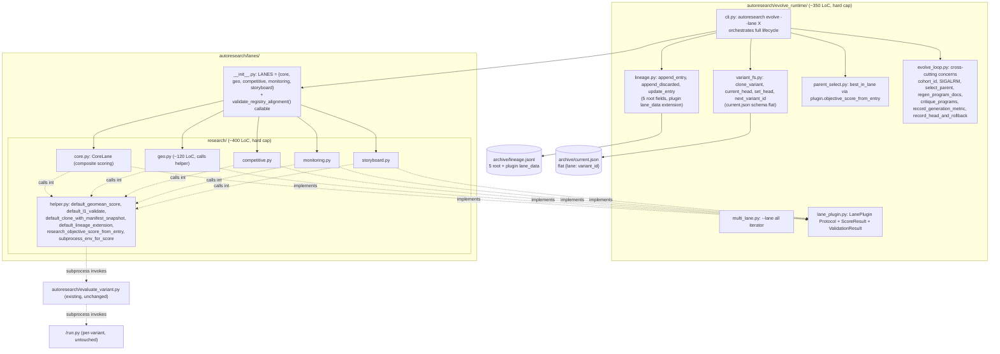

# feat: Autoresearch evolve substrate + plugin architecture

> **⚠️ SUPERSEDED 2026-04-27.** This plan over-engineered the problem. JR's original ask was "bare-bones, configurable for different-nature pipelines." This plan delivered a 14-16-day substrate refactor with `evolve_runtime/` package, `LanePlugin` Protocol, `ResearchLaneHelper` module, wrap-then-extract migration, and 7 cross-cutting substrate utilities. The replacement plan at `docs/plans/2026-04-27-002-feat-autoresearch-lane-registry-plan.md` is a 5-7-day `LaneSpec` dataclass + `LANES` dict + 4 optional callable hooks for divergent lanes. Use that plan; this one is preserved for context only.

> **Revision note (2026-04-27):** This plan was reviewed by 5 parallel reviewer agents (coherence, feasibility, adversarial, product-lens, scope-guardian). The review surfaced 4 architectural blockers and 12 high-impact issues in the original plan. This revision addresses every blocker and high-impact finding in §"Open Questions / Resolved During Planning". The original draft (commit `5028351`) is superseded.

## Overview

Refactor autoresearch's evolve framework from a hardcoded 5-lane shape (`core` + 4 workflow lanes: `geo`, `competitive`, `monitoring`, `storyboard`) into a thin substrate (~350 LoC, owns variant lifecycle: filesystem, CLI, lineage, parent selection, plus cross-cutting evolve-loop concerns) plus a `LanePlugin` Protocol (4 required methods + 2 attributes) implemented per-lane. The 5 existing lanes consolidate into plugin modules that compose against a shared `ResearchLaneHelper` utility module. **Existing test suite is the contract** — observable behavior matches today's runs on golden fixtures.

This unblocks two pending consumers without forcing them into the existing-lane shape: marketing_audit (full plan at `origin/plan/audit-engine-fusion-v1`) and harness_fixer (brainstorm at `git show 7bd6b0b:docs/brainstorms/2026-04-26-harness-fixer-autoresearch-fusion-requirements.md`). Both migrate as separate work after this lands.

## Problem Frame

Today's evolve framework has lane-name dispatch baked into ~24 sites with hardcoded assumptions about score scale, deliverable shape, gate sequence, status markers, and session-dir hierarchy. The first refactor attempt (data-only `LaneRegistry` at `docs/plans/2026-04-26-001-autoresearch-lane-registry-refactor-handoff.md`) centralizes lane-name *data* but leaves per-lane *behavior* leaking into 5+ files for any structurally-divergent lane. Marketing_audit's 19-file footprint and harness_fixer's 16-file footprint both confirm this: they don't share the existing-lane shape, they share the variant *lifecycle*.

This plan implements a substrate + plugin architecture (specified in `docs/superpowers/specs/2026-04-27-autoresearch-evolve-substrate-design.md`). Substrate owns lifecycle. Plugins own behavior. Adding a research-shaped lane becomes one registration line + one plugin module. Adding a structurally divergent lane requires its own plugin module + any new infrastructure it specifically needs (no substrate edits).

**Crucial clarification on what is and isn't extracted (per feasibility review):** The variant's session runner (`<variant_dir>/run.py`) is *frozen-mutable variant content* — every variant snapshot has its own `run.py`, and the meta-agent edits it as part of mutation. **`run.py` is NOT being lifted into the substrate.** What gets extracted is the evolve-loop orchestration code that lives in `autoresearch/evolve.py` + `autoresearch/evolve_ops.py` + `autoresearch/evaluate_variant.py` (the *invocation* of variant runners, not the runners themselves).

## Requirements Trace

- **R1.** Existing 5 lanes' observable behavior matches today's runs per the existing test suite. Golden-fixture lineage entries match modulo timestamp.
- **R2.** Adding a new research-shaped lane requires only one entry in `lanes/__init__.py:LANES` + one plugin module + lane-specific runtime artifacts (typically 1-3 files for prompts/configs).
- **R3.** Adding a structurally divergent lane (different score scale, different gates, different frozen-content) requires its own plugin module + new infrastructure for its divergent concerns; no substrate edits.
- **R4.** Lane plugins implement a small Protocol surface (4 required methods + 2 attrs). Optional behaviors are implemented via substrate helper functions plugins call when needed, NOT via Protocol slots requiring decoy implementations.
- **R5.** Lineage schema migration: 5 substrate-required root fields enforced (id, lane, parent, children, timestamp). `objective_score` is **derived on read** by parent_select via a plugin hook (`plugin.objective_score_from_entry(entry)`) — NOT stored at root, preserving today's storage shape and avoiding 43-row backfill. Per-plugin extension data goes in `lane_data` sub-dict.
- **R6.** Within-lane parent selection is generic numeric comparison on `plugin.objective_score_from_entry(entry)` (computed at read time); no `if lane == "core"` dispatch anywhere in substrate.
- **R7.** Plugin registration is explicit dict (no auto-discovery); greppable, no import side-effects beyond plugin class definition.
- **R8.** No class hierarchy: `ResearchLaneHelper` is a utility module of free functions, not a base class. Lanes implement Protocol independently and call into the helper.
- **R9.** Existing duplication of *lane-name tuples and per-lane policy dicts* across 13 files collapses to one `LANES` dict + per-plugin attributes. Per-lane *policies* (DELIVERABLES, structural validators, rubric IDs) move from module-level constants to plugin attributes — same data count, single ownership locus per plugin.
- **R10.** Subprocess isolation for scoring is preserved for the existing 5 lanes (ResearchLaneHelper invokes `evaluate_variant.py` as subprocess inside its `score()` defaults; full env-var contract preserved).
- **R11.** Plugin authoring is documented sufficiently for an unfamiliar developer to add a plugin by reading the authoring guide + decision table without needing to read substrate source.

## Scope Boundaries

- **Out of scope:** marketing_audit plugin implementation (separate work, post-substrate-merge).
- **Out of scope:** harness_fixer plugin implementation (separate work, post-substrate-merge).
- **Out of scope:** marketing_audit's customer-facing audit pipeline (R2/Worker, payment ledger, audit-lineage at `src/audit/`).
- **Out of scope:** harness wrappers (`harness/engine.py`, `harness/run.py`, `harness/prompts.py`).
- **Out of scope:** evolve's variant lifecycle phases themselves (clone → mutate → score → validate → promote stay; only their per-lane bindings change).
- **Out of scope:** scoring semantics changes for existing 5 lanes.
- **Out of scope:** writing the marketing_audit plan rewrite or harness_fixer plan; sequencing of those rewrites is acknowledged in §"Documentation / Operational Notes" but not in-scope work.
- **Out of scope:** plugin auto-discovery via entry points or import-time side effects.
- **Out of scope:** rubric prompt text reorganization (`src/evaluation/rubrics.py` stays).
- **Out of scope:** archive snapshots (`autoresearch/archive/v001/...`, `autoresearch/archive/v006/...`).
- **Out of scope:** lifting variants' `run.py` files into substrate. Each variant has its own `run.py` (verified at `archive/v001/run.py`, `archive/v006/run.py`). The meta-agent edits this file as part of mutation; it stays per-variant.

## Context & Research

### Relevant Code and Patterns

- **Substrate locus today (scattered):**
  - `autoresearch/evolve.py:888-1097 cmd_run()` — main evolve loop with cohort tracking, SIGALRM ceiling, select_parent agent invocation, regen_program_docs, meta workspace prep, program_prescription_critic, compute_metrics, _record_head_and_check_rollback. **Substrate must absorb all of these cross-cutting concerns** (per feasibility F5).
  - `autoresearch/evolve.py:680-698 _score_variant_search()` — invokes `evaluate_variant.py` as `subprocess.run(...)` with env vars EVOLUTION_PARENT_ID, EVOLUTION_LANE, EVOLUTION_META_BACKEND, EVOLUTION_META_MODEL.
  - `autoresearch/evaluate_variant.py:596-627 _runner_env()` — injects 12+ env vars (EVAL_BACKEND_OVERRIDE, AUTORESEARCH_SESSION_*, FREDDY_FIXTURE_*, plus 3 holdout-key scrubs). Full env-var contract must be preserved by the helper (per feasibility F7).
  - `autoresearch/evaluate_variant.py:685` — invokes `<variant_dir>/run.py` as subprocess. **The variant's run.py is the session runner; not lifted into substrate.**
  - `autoresearch/evaluate_variant.py:1057-1146` — lane-aware aggregation (geomean × geomean). Stays in `evaluate_variant.py`; helper invokes the existing subprocess pattern.
  - `autoresearch/evolve_ops.py` — variant lifecycle helpers, finalize, rollback, prepare_meta_workspace, set_current_head.
  - `autoresearch/select_parent.py:38-41` — parent picking (today: `if lane == "core" → composite_score, else domain_score`). Replaced by `plugin.objective_score_from_entry(entry)`.
  - `autoresearch/frontier.py:76-86 objective_score()` — derives from search_metrics (today). Becomes a per-plugin hook.
  - `autoresearch/lane_runtime.py:12, 35-45, 141-145` — LANES tuple, `current.json` reader (today: `dict[str, str]` = `{lane: variant_id}`), runtime materialization. **`current.json` schema stays flat** (per feasibility F2).

- **Existing partial-registry pattern:** `autoresearch/archive/current_runtime/workflows/__init__.py:10` (`WORKFLOW_SPECS`), `…/session_eval_registry.py:10` (`SESSION_EVAL_SPECS`). Substrate cross-checks alignment via callable `validate_registry_alignment()`, NOT module-load side effect (per feasibility F4).

- **`core` lane reality** (per adversarial ADV-08 + feasibility F10): `core` is a real lane that runs against all 4 workflow domains, scored by composite (geomean across workflow lane composites). `lane_runtime.py:141-145` raises `FileNotFoundError` if `current.json` is missing the `core` head. Under the new architecture, `CoreLane` is a plugin with its own composite scoring policy and `path_prefixes` covering everything outside the 4 workflow lanes' prefixes.

- **Lineage schema today** (verified by reading `archive/lineage.jsonl`): root keys are `id, lane, parent, children, timestamp, backend, model, eval_target, scores, search_metrics, holdout_metrics, suite_versions, changed_files, campaign_ids, promotion_summary, promoted_at` (plus `status, reason` on discarded). **`objective_score` is NOT at root.** Substrate's parent_select calls `plugin.objective_score_from_entry(entry)` to derive it on demand; no backfill (per feasibility F3).

### Institutional Learnings

- **Cascade-grep audit before claiming multi-edit completion** (`docs/solutions/feedback-cascading-edit-grep-audit.md`): Unit 9 budget doubled (1 → 2 days) per recent feedback about JR catching 7 cascade-grep gaps in another plan.
- **Trust the agent — drop regex guards** (`docs/solutions/feedback-trust-agent-drop-regex-guards.md`): Protocol contract is the boundary.
- **Simplification scope discipline** (`docs/solutions/feedback-simplification-scope-discipline.md`): substrate-extraction net-reductions only; lane plugin migrations sequence after.
- **Verify diagnoses with investigator agents** (`docs/solutions/feedback-verify-diagnosis-with-investigator-agent.md`): 8 brainstorming + 5 reviewer agents informed this plan.

### External References

External research skipped — pattern is well-established Python in this repo. Pydantic 2.13.2 + Python 3.13.3 verified for `Literal[*expr]` unpacking during brainstorming, BUT the plan does NOT use `Literal[*lanes.workflow_lane_names()]` in `src/evaluation/models.py` to avoid the circular import (`src.evaluation.models` → `autoresearch.lanes` → `src.evaluation.*` → `src.evaluation.models`). Instead, `models.py:160` keeps a hardcoded `Literal["geo", "competitive", "monitoring", "storyboard"]` plus a runtime assertion in `lanes/__init__.py` that the literal matches `workflow_lane_names()`.

## Key Technical Decisions

- **Substrate boundary:** services (variant FS, CLI dispatcher, lineage append, parent selection, cohort tracking, SIGALRM ceiling, regen_program_docs invocation, program_prescription_critic invocation, compute_metrics emission, _record_head_and_check_rollback), not policies (scoring, gates, manifest). Cross-cutting evolve-loop concerns are substrate utilities the CLI dispatcher uses, not Protocol methods.

- **Variants' `run.py` stays per-variant.** *Rationale:* `run.py` is frozen-mutable variant content the meta-agent edits during mutation. Lifting it would break (a) meta-agent mutation surface, (b) historical variant reproducibility, (c) L1 critique-manifest hash gate, (d) every prior archive's ability to score itself.

- **Composition over inheritance:** `ResearchLaneHelper` is a utility module of free functions (no base class). 5 lanes implement `LanePlugin` Protocol independently and call into the helper. *Tradeoff acknowledged:* composition shifts cognitive load to "remember which helper functions exist." Mitigation: plugin files stay short (~120 LoC); reading shows the full call pattern.

- **`objective_score` derived on read, not stored at root:** plugin's `objective_score_from_entry(entry: dict) -> float` reads from wherever the plugin stores its score (root for legacy; `lane_data` for new). *Rationale:* (a) avoids 43-row lineage backfill + 4 historical archive backfill, (b) supports time-varying fitness (marketing_audit's engagement-weighted score that updates at T+60d), (c) keeps existing test suite passing.

- **`current.json` schema stays flat (`{lane: variant_id_string}`):** No "extended schema" with head_score / promoted_at. *Rationale:* changing schema breaks `lane_runtime.py:35-45` reader; behavior cannot remain bit-identical.

- **`CoreLane` is a plugin:** scored by composite, no rubric IDs, owns paths outside workflow lane prefixes. Registered in `LANES["core"]`. *Rationale:* `core` is a real lane (`lane_runtime.py:141-145` raises if missing); silently dropping breaks runtime materialization.

- **Engagement signal bridge for marketing_audit (substrate-level, NOT deferred):** Substrate provides `lineage.update_entry(archive_dir, variant_id, lane_data_patch: dict) -> None` for plugins needing retroactive updates. Mutation restricted to `lane_data` sub-dict; root fields stay immutable. *Rationale:* marketing_audit's T+60d engagement signal updates require this hook; without it, marketing_audit reimplements lineage management per-plugin.

- **Wrap-then-extract for existing 5 lanes**, not rewrite-from-scratch (per product-lens PL-3): Phase 4 ships thin Protocol adapters wrapping existing per-lane code; subsequent (out-of-scope) work refactors each lane to native Protocol implementations as separate PRs. *Rationale:* bit-identical rewrite is the riskiest refactor mode; wrap-first validates Protocol API against real code with low blast radius. ~150 LoC of throwaway adapter saves 2-3 days of bit-diff investigation.

- **Lineage schema split:** 5 substrate-required root fields; everything else in per-plugin `lane_data` sub-dict. ResearchLaneHelper's plugins write search_metrics/scores/etc. into `lane_data` (NOT at root) — write-side migration. Read-side: per-lane scripts that do `entry["scores"]` get a one-time migration to `entry["lane_data"]["scores"]` in Unit 9. ResearchLaneHelper's `objective_score_from_entry` provides legacy fallback.

- **Module-load alignment is a callable check, not a side effect:** `lanes/__init__.py` does NOT auto-validate at import. `lanes.validate_registry_alignment()` is callable on demand (CLI dispatcher startup or pytest fixture). *Rationale:* `archive/current_runtime/` is materialized at runtime; module-load checks fail in test contexts.

- **Explicit dict registration** in `lanes/__init__.py:LANES`. Greppable, single source of truth. Risk of key/`name`-attribute drift mitigated by callable `validate_registry_alignment()` asserting key == `plugin.name` for every entry.

- **Big-bang substrate + wrap migration in one PR series**, but split by phase boundary: Phase 1-2 (substrate + cross-cutting + helper) lands as commit cluster A; Phase 4 (5 lane wraps) as cluster B; Phase 5 (cleanup) as cluster C; Phase 6 (verification + docs) as cluster D. CI gates each cluster.

## Open Questions

### Resolved During Planning

- **Cross-lane comparability at substrate level?** No — parent selection is always within-lane.
- **Frontier file format — global or per-lane?** One `current.json`, flat schema preserved.
- **Migration approach: big-bang vs incremental?** Big-bang substrate, wrap-then-extract for existing 5 lanes.
- **Plugin registration: explicit dict vs auto-discovery?** Explicit dict.
- **Existing 5 lanes: rewrite vs wrap?** Wrap (per product-lens PL-3 review).
- **Should marketing_audit's multi-stage pipeline be substrate-aware?** No — its `mutate()` internally chains stages.
- **Does substrate know about marketing_audit's commercial wrapper?** No — wrapper lives in `src/audit/`. Substrate provides `lineage.update_entry()` hook for engagement-signal bridge; wrapper uses it.
- **`core` lane fate?** CoreLane plugin. Composite scoring across workflow lanes. Registered in LANES.
- **`objective_score` as stored field or derived?** Derived via plugin hook (`objective_score_from_entry`). No backfill needed.
- **`current.json` schema change?** No change. Flat `{lane: variant_id}`.
- **Engagement signal bridge mechanism?** Substrate provides `lineage.update_entry(variant_id, lane_data_patch)`. Marketing_audit's plan rewrite owns the *use* of this hook.
- **Subprocess score exception policy?** Propagate (today's `subprocess.run(check=True)` semantics).
- **`src/evaluation/models.py:160` Literal handling?** Hardcoded `Literal["geo", "competitive", "monitoring", "storyboard"]` + runtime assertion in `lanes/__init__.py`. Avoids circular import.
- **Module-load alignment check: import-time or callable?** Callable. CLI dispatcher invokes at startup.
- **Helper LoC cap?** Hard cap 400 LoC for ResearchLaneHelper. Substrate hard cap 350 LoC. If exceeded, stop and revise.

### Deferred to Implementation

- **Per-lane helper-function fit:** verify per-lane during Phase 4 wrapping. If a lane breaks the helper pattern, that lane's wrapper provides a small override.
- **Final test file paths for substrate components:** `tests/autoresearch/evolve_runtime/test_<component>.py` likely. Final structure depends on existing test layout.
- **Lineage non-code consumers** (dashboards, alerting, manual scripts): unknown. Unit 9 includes non-code grep across broader monorepo + GitHub Actions for `lineage.jsonl` references; if found, decide migrate-vs-shim per-consumer.
- **Smoke-test duplication risk between marketing_audit and harness_fixer:** keep per-plugin in v1; extract to substrate utility if a 3rd consumer wants the same shape.

## High-Level Technical Design

> *This illustrates the intended approach and is directional guidance for review, not implementation specification. The implementing agent should treat it as context, not code to reproduce.*



**Lifecycle dispatched by `cli.py`** (expanded per feasibility F5 to include cross-cutting concerns):

```python
def evolve(lane_name: str, candidates: int, iterations: int, ...) -> None:
    plugin = lanes.LANES[lane_name]
    lanes.validate_registry_alignment()  # callable, not module-load side effect

    for iteration in range(iterations):
        # SUBSTRATE: SIGALRM wall-time ceiling
        with substrate.generation_alarm(config.max_wall_time):
            cohort_id = substrate.make_cohort_id()
            os.environ["EVOLUTION_COHORT_ID"] = cohort_id

            for candidate in range(candidates):
                # SUBSTRATE: select_parent agent (Claude/Codex) returns rationale
                parent_id, rationale = substrate.select_parent_with_rationale(plugin.name)
                os.environ["EVOLUTION_SELECTION_RATIONALE"] = rationale
                os.environ["EVOLUTION_PARENT_ID"] = parent_id

                child_id = substrate.next_variant_id(archive_dir)
                # PLUGIN: clone (default: copy + filter + manifest snapshot)
                plugin.clone(parent_dir, child_dir)
                # SUBSTRATE: regen_program_docs (per-clone)
                substrate.regen_program_docs(child_dir, plugin.name)

                # PLUGIN: mutate (invoke meta-agent)
                plugin.mutate(child_dir)

                # SUBSTRATE: program_prescription_critic (post-mutate)
                substrate.critique_programs(child_dir, plugin.name)

                # PLUGIN: validate
                validation = plugin.validate(child_dir)
                if not validation.passed:
                    lineage.append_discarded(...)
                    continue

                # PLUGIN: score (subprocess to evaluate_variant.py for research)
                score = plugin.score(child_dir, fixtures)

                # SUBSTRATE: lineage append + cohort metric emission
                lineage.append_entry(
                    child_id, parent_id, plugin.name,
                    lane_data=plugin.lineage_entry_extension(child_dir, score),
                )
                substrate.record_generation_metric(plugin.name, iteration, candidate, score)

        # SUBSTRATE: select head + rollback check
        parent_id = parent_select.best_in_lane(archive_dir, plugin.name, plugin.objective_score_from_entry)
        substrate.record_head_and_check_rollback(plugin.name, parent_id)

    if config.require_holdout:
        finalist = substrate.best_finalist_in_lane(plugin.name)
        # PLUGIN: promote
        plugin.promote(archive_dir / finalist)
```

The 7 substrate utilities (`generation_alarm`, `make_cohort_id`, `select_parent_with_rationale`, `regen_program_docs`, `critique_programs`, `record_generation_metric`, `record_head_and_check_rollback`) are NOT Protocol methods. They live in `evolve_runtime/evolve_loop.py` and are called by `cli.py`. Plugins are unaware of them.

## Implementation Units

### Phase 1 — Substrate skeleton (Days 1-4)

- [ ] **Unit 1: Substrate core types — `lane_plugin.py`**

**Goal:** Define `LanePlugin` Protocol with **4 required methods + 2 attrs** (no optional Protocol slots). Define `ScoreResult` + `ValidationResult`.

**Requirements:** R4, R5, R10.

**Dependencies:** None.

**Files:**
- Create: `autoresearch/evolve_runtime/__init__.py`
- Create: `autoresearch/evolve_runtime/lane_plugin.py`
- Test: `tests/autoresearch/evolve_runtime/test_lane_plugin.py`

**Approach:**
- `LanePlugin` Protocol: 2 required attrs (`name`, `path_prefixes`) + 4 required methods (`mutate`, `score`, `objective_score_from_entry`, `lineage_entry_extension`).
- The "default-able" behaviors from the original draft (`clone`, `validate`, `promote`) are NOT Protocol slots. They're substrate helpers (e.g. `evolve_runtime.helpers.default_clone(plugin)`) that the CLI dispatcher calls. Plugins that want custom behavior register callables via composition: `MarketingAuditLane(custom_clone=my_clone)`.
- `ScoreResult`: frozen dataclass with `objective_score: float | None` + `details: dict[str, object]`.
- `ValidationResult`: frozen dataclass with `passed: bool` + `failures: list[str]`.

**Execution note:** Test-first.

**Patterns to follow:**
- `autoresearch/archive/current_runtime/workflows/specs.py:33` — `WorkflowSpec` frozen dataclass.

**Test scenarios:**
- Happy path: a stub class with 2 attrs + 4 methods satisfies `runtime_checkable Protocol` check.
- Edge case: stub missing `mutate` fails `isinstance(stub, LanePlugin)`.
- Happy path: `ScoreResult(objective_score=0.85, details={})` constructs and is frozen.
- Happy path: `ScoreResult(objective_score=None, details={"composite": 0.85})` for derive-on-read plugins.
- Happy path: `ValidationResult(passed=True, failures=[])` and `ValidationResult(passed=False, failures=[...])`.

**Verification:**
- Tests pass.
- `mypy --strict autoresearch/evolve_runtime/lane_plugin.py` passes.

---

- [ ] **Unit 2: Variant filesystem service — `variant_fs.py`**

**Goal:** Variant-directory operations. **`current.json` schema stays flat.**

**Requirements:** R3, R6.

**Dependencies:** Unit 1.

**Files:**
- Create: `autoresearch/evolve_runtime/variant_fs.py`
- Test: `tests/autoresearch/evolve_runtime/test_variant_fs.py`

**Approach:**
- `clone_variant(parent_dir, child_dir, included_paths) -> None`.
- `current_head(archive_dir, lane: str) -> str | None` — reads flat `archive/current.json` (`{lane: variant_id_string}`).
- `set_head(archive_dir, lane: str, variant_id: str) -> None` — atomic write preserving flat schema.
- `next_variant_id(archive_dir) -> str`.
- **No schema change to current.json.** Auxiliary metadata (head_score, promoted_at) lives in lineage entries.

**Patterns to follow:**
- `autoresearch/evolve.py:_next_variant_id` (747-755).
- `autoresearch/evolve_ops.py:set_current_head` (223-228).
- `autoresearch/lane_runtime.py:35-45 load_current_manifest` — exact reader contract to preserve.

**Test scenarios:**
- Happy path: `clone_variant` copies `included_paths` only; empty list copies all.
- Edge case: parent_dir missing → `FileNotFoundError`.
- Happy path: `current_head(archive_dir, "geo")` returns "v015" string.
- Happy path: `current_head(archive_dir, "core")` returns "v006" on existing fixture.
- Edge case: lane not in current.json → returns None.
- Happy path: `set_head` writes flat JSON; `current_head` returns it.
- Integration: existing `lane_runtime.load_current_manifest` reads what `set_head` writes without modification.
- Edge case: concurrent `set_head` calls produce one valid file (atomic rename).

**Verification:**
- Test suite passes.
- `archive/current.json` schema unchanged.
- `lane_runtime.ensure_materialized_runtime` works against substrate-written manifest.

---

- [ ] **Unit 3: Lineage append + update — `lineage.py`**

**Goal:** Append-only writes with **5 substrate-required root fields + plugin's `lane_data`**. Plus `update_entry()` for engagement-signal bridge.

**Requirements:** R5, R6.

**Dependencies:** Unit 1.

**Files:**
- Create: `autoresearch/evolve_runtime/lineage.py`
- Test: `tests/autoresearch/evolve_runtime/test_lineage.py`

**Approach:**
- `append_entry(archive_dir, id, parent, lane, children, timestamp, lane_data: dict) -> None` — substrate fills 5 root fields; `lane_data` plugin-owned. Atomic via `fcntl.flock`.
- `append_discarded(archive_dir, id, parent, lane, failures) -> None`.
- `update_entry(archive_dir, variant_id, lane_data_patch: dict) -> None` — retroactive `lane_data` patch. Root fields immutable; raises if patch attempts root modification.
- `read_lineage(archive_dir) -> Iterator[dict]` — yields entries in append order.
- **`objective_score` is NOT required at root.** Substrate's parent_select derives via `plugin.objective_score_from_entry(entry)`.
- **No data backfill required for legacy lineage entries.** Existing entries have root-level fields; helper provides legacy fallback.

**Patterns to follow:**
- `autoresearch/evaluate_variant.py:2310 append_lineage_entries`.
- `autoresearch/archive_index.py` — atomic JSONL writes.

**Test scenarios:**
- Happy path: `append_entry` writes one JSONL line with 5 root fields + `lane_data`.
- Error path: missing root field → `ValueError`.
- Edge case: `append_discarded` writes entry with `status="discarded"`.
- Happy path: `update_entry` patches `lane_data.engagement` on existing entry; root fields unchanged.
- Error path: `update_entry` with patch attempting `id` modification → `ValueError`.
- Edge case: `update_entry` on non-existent variant_id → `KeyError`.
- Happy path: `read_lineage` yields legacy entries (root scores/search_metrics, no lane_data) without errors.

**Verification:**
- Test suite passes.
- Existing `archive/lineage.jsonl` (43 entries) reads cleanly.

---

- [ ] **Unit 4: Within-lane parent selection — `parent_select.py`**

**Goal:** Pick highest-`objective_score` non-discarded variant via `plugin.objective_score_from_entry(entry)`.

**Requirements:** R3, R5, R6.

**Dependencies:** Units 1, 3.

**Files:**
- Create: `autoresearch/evolve_runtime/parent_select.py`
- Test: `tests/autoresearch/evolve_runtime/test_parent_select.py`

**Approach:**
- `best_in_lane(archive_dir, lane, score_fn: Callable[[dict], float | None]) -> str | None` — filter lineage by lane + non-discarded; sort by `score_fn`; return id of max.
- `score_fn` is `plugin.objective_score_from_entry`; substrate doesn't dispatch on lane name.
- Returns None on empty.

**Patterns to follow:**
- `autoresearch/frontier.py:89-124 best_variant_in_lane` — preserve filtering pattern. Replace dispatched `objective_score()` with passed-in `score_fn`.

**Test scenarios:**
- Happy path: `best_in_lane` with mixed entries returns highest-scoring within lane.
- Edge case: no entries → None.
- Edge case: all discarded → None.
- Edge case: tie on score → deterministic (latest timestamp wins; document).
- Edge case: `score_fn` returns None → entry excluded.
- Integration: ResearchLaneHelper's `objective_score_from_entry` reads root-level search_metrics for legacy entries; same value as today's `frontier.objective_score()`.

**Verification:**
- Tests pass.
- No `if lane == "core"` branches in `evolve_runtime/`.
- `parent_select.best_in_lane` produces same head selection as today's `frontier.best_variant_in_lane` on existing lineage.

---

### Phase 2 — Cross-cutting evolve-loop services (Days 5-6)

- [ ] **Unit 5: Cross-cutting concerns + CLI dispatcher — `evolve_loop.py` + `cli.py` + `multi_lane.py`**

**Goal:** Substrate utilities for cross-cutting concerns the CLI uses (per feasibility F5: cohort_id, SIGALRM, select_parent agent, regen_program_docs, program_prescription_critic, compute_metrics, _record_head_and_check_rollback). Plus the CLI dispatcher.

**Requirements:** R2, R3, R7.

**Dependencies:** Units 1-4.

**Files:**
- Create: `autoresearch/evolve_runtime/evolve_loop.py`
- Create: `autoresearch/evolve_runtime/cli.py`
- Create: `autoresearch/evolve_runtime/multi_lane.py`
- Test: `tests/autoresearch/evolve_runtime/test_evolve_loop.py`
- Test: `tests/autoresearch/evolve_runtime/test_cli.py`
- Test: `tests/autoresearch/evolve_runtime/test_multi_lane.py`

**Approach:**
- `evolve_loop.generation_alarm(seconds)` context manager wraps `signal.SIGALRM` (extracted from `evolve.py:901-902`).
- `evolve_loop.make_cohort_id() -> str` (extracted from `evolve.py:914-915`).
- `evolve_loop.select_parent_with_rationale(lane: str) -> tuple[str, str]` invokes existing select_parent agent (Claude/Codex), returns (parent_id, rationale_text).
- `evolve_loop.regen_program_docs(variant_dir, lane: str) -> None` (extracted from `evolve.py:955`).
- `evolve_loop.critique_programs(variant_dir, lane: str) -> None` (from `evolve.py:1037-1050`).
- `evolve_loop.record_generation_metric(lane, iteration, candidate, score)` (from `evolve.py:1074-1085`).
- `evolve_loop.record_head_and_check_rollback(lane: str, head_id: str)` (from `evolve.py:819`).
- `cli.py` parses argparse, drives lifecycle from §"High-Level Technical Design".
- `multi_lane.py:run_all_lanes(config)` iterates `lanes.LANES`.

**Patterns to follow:**
- `autoresearch/evolve.py:cmd_run` (888-1097) — full lifecycle to extract.
- `autoresearch/evolve.py:225-326 load_config` — argparse pattern.
- `autoresearch/evolve.py:451-468 run_all_lanes` — multi-lane iteration.

**Test scenarios:**
- Happy path: `generation_alarm` raises `TimeoutError` after seconds elapsed.
- Edge case: `generation_alarm` exits cleanly when work completes early.
- Happy path: `make_cohort_id` returns unique id across calls.
- Happy path: `select_parent_with_rationale` returns valid (variant_id, non-empty rationale) on existing lineage.
- Happy path: `autoresearch evolve --lane geo --iterations 1 --candidates 1` with stub plugin produces lineage entry + cohort metric.
- Error path: unknown lane → CLI exits with `Unknown lane: X. Registered: [core, geo, ...]`.
- Happy path: `--lane all` iterates all 5 plugins.
- Edge case: plugin's `mutate` raises → caught, lineage NOT appended for that candidate, loop continues.
- Edge case: plugin's `validate` returns `passed=False` → `append_discarded`.
- Integration: env vars EVOLUTION_COHORT_ID, EVOLUTION_PARENT_ID, EVOLUTION_SELECTION_RATIONALE all set.
- Integration: full lifecycle on stub plugin produces expected lineage shape.

**Verification:**
- Tests pass.
- `autoresearch evolve --help` shows lane choices populated dynamically from `lanes.LANES`.

---

### Phase 3 — ResearchLaneHelper extraction (Days 7-9)

- [ ] **Unit 6: ResearchLaneHelper utility module — `lanes/research/helper.py`**

**Goal:** Free functions the 5 research lane plugins call into. **Does NOT extract `run.py`.** Hard cap 400 LoC.

**Requirements:** R8, R10.

**Dependencies:** Units 1-5.

**Files:**
- Create: `autoresearch/lanes/__init__.py` (placeholder; populated in Unit 10)
- Create: `autoresearch/lanes/research/__init__.py`
- Create: `autoresearch/lanes/research/helper.py`
- Test: `tests/autoresearch/lanes/research/test_helper.py`

**Approach (rescoped per feasibility F1, F7):**
- `helper.default_geomean_score(variant_dir, fixtures, lane_name) -> ScoreResult` — invokes `evaluate_variant.py` as `subprocess.run(...)` (preserving pattern at `evolve.py:680-698`). Builds full env-var contract: 4 from evolve.py (EVOLUTION_PARENT_ID, EVOLUTION_LANE, EVOLUTION_META_BACKEND, EVOLUTION_META_MODEL) + 12+ from `evaluate_variant.py:_runner_env` (EVAL_BACKEND_OVERRIDE, AUTORESEARCH_SESSION_*, FREDDY_FIXTURE_*) — preserved verbatim. Holdout-key scrubbing (`_CODEX_HOLDOUT_KEYS`) preserved.
- `helper.default_l1_validate(variant_dir, lane_name, session_md_filename) -> ValidationResult` — gate sequence: critique manifest, `run.py` exists in variant_dir, `*.py` compile, `programs/<lane>-session.md` exists.
- `helper.default_clone_with_manifest_snapshot(parent_dir, child_dir, path_prefixes) -> None` — clone-and-filter + critique_manifest.json snapshot.
- `helper.default_lineage_extension(variant_dir, score) -> dict` — returns existing-shape dict (search_metrics, domains, inner_metrics, etc.) computed from `score.details`. Becomes `lane_data` (NOT root fields).
- `helper.research_objective_score_from_entry(entry) -> float | None` — for ResearchLaneHelper plugins. Reads from `entry["lane_data"]["search_metrics"]["composite"]` (core) or `entry["lane_data"]["search_metrics"]["domains"][lane]["score"]` (workflow). **Falls back to root-level `entry["search_metrics"][...]` for legacy entries.** Backward compat without backfill.
- `helper.subprocess_env_for_score(variant_dir, lane_name, parent_id) -> dict[str, str]` — env-var construction (consolidates F7 contract).
- **Does NOT extract `<variant_dir>/run.py` logic.** Per-variant, mutated by meta-agent.
- **Does NOT extract `evaluate_variant.py:1057-1146` aggregator.** Stays in evaluate_variant.py.

**Execution note:** Test-first. Each helper function golden-tested against existing fixture.

**Patterns to follow:**
- `autoresearch/evolve.py:_score_variant_search` (680-698) — subprocess pattern.
- `autoresearch/evaluate_variant.py:layer1_validate` (544-587) — gate sequence.
- `autoresearch/evaluate_variant.py:_runner_env` (596-627) — env vars to preserve.

**Test scenarios:**
- Happy path: `default_geomean_score` on known fixture returns same value as today's `evaluate_variant.py` output (golden, 5 fixtures across geo/competitive/monitoring/storyboard/core).
- Error path: `default_geomean_score` when subprocess raises `CalledProcessError` → propagates (today's `subprocess.run(check=True)` semantics).
- Happy path: `default_l1_validate` passes on known-good variant_dir.
- Error path: `default_l1_validate` fails when critique_manifest mismatches; failures list specific.
- Error path: `default_l1_validate` fails when `programs/geo-session.md` missing.
- Happy path: `default_clone_with_manifest_snapshot` produces variant with critique_manifest.json bit-identical to today's clone.
- Happy path: `default_lineage_extension` produces dict with all today's fields.
- Happy path: `research_objective_score_from_entry` on legacy entry (root search_metrics) returns same value as `frontier.objective_score()`.
- Happy path: `research_objective_score_from_entry` on new entry (lane_data.search_metrics) returns same value.
- Integration: `subprocess_env_for_score` produces env dict containing all 12+ env vars `evaluate_variant.py:_runner_env` reads.

**Verification:**
- Tests pass.
- Helper LoC ≤ 400 (hard cap).
- Subprocess invocation pattern bit-identical to today (env-var diff test).
- No `run.py` content in helper.

---

### Phase 4 — Existing lane wraps (Days 10-12)

- [ ] **Unit 7: Wrap CoreLane + GeoLane + CompetitiveLane**

**Goal:** Implement `CoreLane`, `GeoLane`, `CompetitiveLane` as Protocol implementations using **wrap-then-extract**: thin Protocol adapters around existing per-lane code.

**Requirements:** R1, R8.

**Dependencies:** Unit 6.

**Files:**
- Create: `autoresearch/lanes/research/core.py`
- Create: `autoresearch/lanes/research/geo.py`
- Create: `autoresearch/lanes/research/competitive.py`
- Test: `tests/autoresearch/lanes/research/test_core.py`
- Test: `tests/autoresearch/lanes/research/test_geo.py`
- Test: `tests/autoresearch/lanes/research/test_competitive.py`

**Approach:**
- `CoreLane`: name="core", path_prefixes covers everything outside `WORKFLOW_PREFIXES`. `score()` invokes `default_geomean_score(variant_dir, fixtures, "core")` (composite across all workflow domains). `objective_score_from_entry` returns search_metrics composite with legacy fallback. `mutate` invokes meta-agent (preserves `evolve.py:986-1010`).
- `GeoLane`: name="geo", path_prefixes from existing `WORKFLOW_PREFIXES["geo"]`. score/validate/clone/lineage_entry_extension delegate to ResearchLaneHelper. Geo's specific quirk — `build_geo_report.py` post-summary hook (today at `workflows/geo.py:13-19`) — runs as part of `mutate()` post-meta-agent step.
- `CompetitiveLane`: same pattern.
- **Wrap pattern:** ~120 LoC per plugin. The "wrapping" is that mutate invokes existing meta-agent code rather than rewriting.

**Execution note:** Test-first. Bit-identical via golden-fixture tests.

**Patterns to follow:**
- `autoresearch/lane_paths.py:WORKFLOW_PREFIXES` — path_prefixes content.
- `autoresearch/archive/current_runtime/workflows/{geo,competitive}.py` — per-lane workflow files.

**Test scenarios:**
- Happy path: `CoreLane().score()` returns same composite as today's `_score_variant_search(core, ...)`.
- Happy path: `CoreLane().objective_score_from_entry(legacy_entry)` returns same value as `frontier.composite_score(legacy_entry)`.
- Happy path: `GeoLane().score()` returns same `objective_score` as today.
- Happy path: `GeoLane().validate()` passes on known-good geo variant.
- Happy path: `GeoLane().clone()` produces same file set as today.
- Happy path: `CompetitiveLane().score()` matches today.
- Integration: `autoresearch evolve --lane geo --iterations 1 --candidates 1` produces lineage entry + frontier head identical to today's run on same fixtures (golden test).
- Integration: same for `--lane core` and `--lane competitive`.

**Verification:**
- Existing test suites for core/geo/competitive pass unchanged.
- Bit-identical lineage entries for golden-fixture runs (modulo timestamp + lane_data nesting).
- Each plugin file ≤ 150 LoC.

---

- [ ] **Unit 8: Wrap MonitoringLane + StoryboardLane**

**Goal:** Implement `MonitoringLane` + `StoryboardLane`. Bit-identical behavior.

**Requirements:** R1, R8.

**Dependencies:** Unit 6.

**Files:**
- Create: `autoresearch/lanes/research/monitoring.py`
- Create: `autoresearch/lanes/research/storyboard.py`
- Test: `tests/autoresearch/lanes/research/test_monitoring.py`
- Test: `tests/autoresearch/lanes/research/test_storyboard.py`

**Approach:**
- Same wrap pattern as Unit 7.
- Monitoring's quirks: digest semantics, `_INTERMEDIATE_ARTIFACTS["monitoring"]` populated.
- Storyboard's quirks: frame generation, `_INTERMEDIATE_ARTIFACTS["storyboard"]`.

**Execution note:** Test-first.

**Patterns to follow:** Unit 7 + `autoresearch/archive/current_runtime/workflows/{monitoring,storyboard}.py`.

**Test scenarios:**
- Same as Unit 7 (happy/integration) for monitoring + storyboard.
- Edge case: monitoring's `_INTERMEDIATE_ARTIFACTS` glob preserved.
- Edge case: storyboard's frame generation produces same output.

**Verification:**
- Existing test suites pass unchanged.
- Bit-identical lineage for golden runs.

---

### Phase 5 — Cleanup + registration (Days 13-14)

- [ ] **Unit 9: Cascade-grep cleanup + consumer updates** (2-day budget per feasibility F6)

**Goal:** Replace lane-name dispatch in 13 consumer files with substrate calls.

**Requirements:** R5, R6, R9.

**Dependencies:** Units 1-8.

**Files:**
- Modify: `autoresearch/evolve.py` — remove `ALL_LANES`, replace `cmd_run` with import from `evolve_runtime.cli`.
- Modify: `autoresearch/lane_runtime.py` — remove `LANES` tuple. Replace with shim if external imports use it. **Preserve `core_id = manifest.get("core", "")` raise behavior** at lines 141-145.
- Modify: `autoresearch/lane_paths.py` — already deprecation shim. Remove `LANES`/`WORKFLOW_LANES` if not externally imported.
- Modify: `autoresearch/frontier.py` — remove `DOMAINS`, `LANES`, `objective_score()`, `composite_score()`, `domain_score()`. Consumers migrate to `plugin.objective_score_from_entry(entry)`. Keep `entry_lane`, `has_search_metrics`.
- Modify: `autoresearch/select_parent.py` — remove `_objective_score()` dispatch (38-41). Use passed-in `score_fn`.
- Modify: `autoresearch/evaluate_variant.py` — replace hardcoded `for domain in DOMAINS` and lane-specific score dispatch with calls to `LANES[lane_name]`. **Preserve `:1057-1146` aggregator unchanged.**
- Modify: `autoresearch/program_prescription_critic.py` — replace `DOMAINS` with `[name for name, p in LANES.items() if not isinstance(p, CoreLane)]`.
- Modify: `autoresearch/regen_program_docs.py` — `DOMAIN_FILENAMES` → `LANES[name].session_md_filename` attribute lookup.
- Modify: `autoresearch/archive/current_runtime/scripts/evaluate_session.py:402` — `choices=list(lanes.workflow_lane_names())`.
- Modify: `tests/autoresearch/conftest.py:43` — **leave hardcoded.** Add comment: `# intentionally NOT migrated to read live LANES (R9 known exception; preserves test-isolation contract)`.
- Modify: `src/evaluation/structural.py:38-46` — keep if/if/if dispatch but populate `STRUCTURAL_DOC_FACTS` + `STRUCTURAL_GATE_FUNCTIONS` from `lanes.LANES` plugin attributes.
- Modify: `src/evaluation/service.py:30-58` — replace `_DOMAIN_PREFIXES`, `_DOMAIN_CRITERIA`, `_JUDGE_PRIMARY_DELIVERABLE` with substrate calls OR leave (rubric-prompt-coupled; decide during implementation per Gap 1 research).
- Modify: `src/evaluation/models.py:160` — **keep hardcoded `Literal["geo", "competitive", "monitoring", "storyboard"]`** (per feasibility F4 on circular imports). Add module-level assertion in `lanes/__init__.py` that literal matches `workflow_lane_names()`.
- Modify: `src/evaluation/rubrics.py:1001` — `assert len(RUBRICS) == 32 == sum(len(p.rubric_ids) for p in lanes.LANES.values() if hasattr(p, 'rubric_ids') and p.rubric_ids)` (chains both invariants).

**Execution note:** Test-first. Run full suite before this unit. Migrate one consumer at a time; tests stay green after each.

**Cascade-grep verification:**
- `grep -rn "ALL_LANES\|WORKFLOW_LANES\|^LANES = (\|^DOMAINS = (\|_DOMAIN_CRITERIA\|_JUDGE_PRIMARY_DELIVERABLE\|^DELIVERABLES = \|_INTERMEDIATE_ARTIFACTS\|_INNER_PHASE_TAGS\|DOMAIN_FILENAMES\|STRUCTURAL_DOC_FACTS\|STRUCTURAL_GATE_FUNCTIONS" --include="*.py"` returns zero outside `autoresearch/lanes/`, `autoresearch/evolve_runtime/`, and the documented conftest.py exception.
- Non-code grep: `git grep -l "lineage.jsonl"` outside autoresearch tree + `.github/workflows/`. Any consumer found gets migrated or shimmed.

**Test scenarios:**
- Happy path: full existing test suite passes after each consumer migration.
- Edge case: external (non-code) imports → deprecation re-export shim with `DeprecationWarning`.
- Verification: cascade-grep clean.
- Integration: smoke run on each lane post-cleanup matches pre-cleanup output.

**Verification:**
- Cascade-grep returns clean.
- Full test suite passes.
- No regressions in `pytest -k lane`.

---

- [ ] **Unit 10: Plugin registration — `lanes/__init__.py`**

**Goal:** Populate explicit registry with 5 plugins; expose `validate_registry_alignment()` + `workflow_lane_names()` callables.

**Requirements:** R7, R11.

**Dependencies:** Units 6, 7, 8.

**Files:**
- Modify: `autoresearch/lanes/__init__.py`

**Approach:**
- Import 5 plugin classes; define `LANES: dict[str, LanePlugin] = {"core": CoreLane(), "geo": GeoLane(), ...}`.
- `def workflow_lane_names() -> tuple[str, ...]` returns workflow lanes (excludes core).
- `def validate_registry_alignment() -> None` — **callable**. Asserts: (a) `LANES["X"].name == "X"`, (b) every workflow plugin has matching `WORKFLOW_SPECS` + `SESSION_EVAL_SPECS` entries, (c) hardcoded `Literal` in `models.py:160` matches `workflow_lane_names()`. Raises descriptive RuntimeError on misalignment.
- CLI dispatcher invokes at startup.

**Test scenarios:**
- Happy path: `set(LANES.keys()) == {"core", "geo", "competitive", "monitoring", "storyboard"}`.
- Happy path: `validate_registry_alignment()` passes.
- Happy path: `workflow_lane_names()` returns `("geo", "competitive", "monitoring", "storyboard")`.
- Error path: a plugin with `name="X"` registered under key `"Y"` → raises with descriptive message.
- Error path: literal-vs-LANES mismatch → raises.

**Verification:**
- `python -c "from autoresearch.lanes import LANES, validate_registry_alignment; validate_registry_alignment(); print(list(LANES.keys()))"` prints all 5.
- No module-load side effects beyond plugin class definitions.

---

### Phase 6 — Verification + handoff (Days 15-16)

- [ ] **Unit 11: End-to-end smoke run + supersede old handoff**

**Goal:** Full evolve cycle on each of 5 lanes (1 iteration, 1 candidate). Mark old handoff superseded.

**Requirements:** R1.

**Dependencies:** Units 1-10.

**Files:**
- Modify: `docs/plans/2026-04-26-001-autoresearch-lane-registry-refactor-handoff.md` (on `refactor/autoresearch-lane-registry`) — SUPERSEDED notice referencing this plan.

**Approach:**
- Smoke run each lane: core, geo, competitive, monitoring, storyboard.
- Verify lineage entry + frontier update + cohort metric.
- Mark old handoff superseded.

**Test scenarios:**
- Integration: smoke run for each of 5 lanes completes without error.
- Verification: 5 new lineage entries with 5 root fields + `lane_data` sub-dict.
- Verification: legacy entries still readable; head selection works on mixed legacy + new entries.
- Verification: `archive/current.json` still flat schema.

**Verification:**
- All 5 smoke runs pass.
- Old handoff has SUPERSEDED notice committed.

---

- [ ] **Unit 12: Documentation — authoring guide + decision table**

**Goal:** Document plugin authoring path (R11).

**Requirements:** R11.

**Dependencies:** Units 1-11.

**Files:**
- Create: `docs/architecture/lane-plugin-authoring-guide.md`
- Create: `docs/architecture/substrate-vs-plugin-decision-table.md`

**Approach:**
- Authoring guide: ~1-2 pages with worked example using fictitious "code_review" lane. Sections: (1) research-shaped lane authoring, (2) structurally-divergent lane authoring.
- Decision table: copy from spec §13 with cross-references to actual files.

**Test scenarios:**
- Test expectation: none — documentation. Manual: worked example Python compiles.

**Verification:**
- Both docs exist; linked from this plan + spec.

---

## System-Wide Impact

- **Interaction graph:** evolve substrate (`evolve_runtime/`) is invoked by `autoresearch evolve` CLI. CLI dispatcher invokes plugin Protocol methods + substrate cross-cutting utilities. Plugins call into `ResearchLaneHelper`. Helper invokes `evaluate_variant.py` as subprocess; `evaluate_variant.py` invokes `<variant_dir>/run.py` as subprocess (unchanged). Lineage append + update are substrate-managed.

- **Error propagation:** Plugin's `mutate` exceptions caught by CLI dispatcher, candidate skipped. Plugin's `validate` returning `passed=False` → `append_discarded`. Plugin's `score` exceptions **propagate** (today's `check=True` semantics). Substrate's cross-cutting utilities propagate their own exceptions; retries logic mirrors today.

- **State lifecycle risks:** `archive/current.json` writes atomic. Lineage append uses `fcntl.flock`. `lineage.update_entry` is the only mutation surface; restricted to `lane_data`. Cleanup if `mutate` partial: existing behavior preserved.

- **API surface parity:** `autoresearch evolve --lane <name>` argparse compatible. `frontier.objective_score()` removed; consumers migrate to `plugin.objective_score_from_entry()`. Read-side compat for legacy entries via `research_objective_score_from_entry` fallback.

- **Integration coverage:** Unit 11 smoke run on 5 lanes. Bit-identical lineage entries verified via golden-fixture tests in Units 7-8.

- **Unchanged invariants:**
  - `<variant_dir>/run.py` — per-variant; not lifted into substrate.
  - `evaluate_variant.py` subprocess interface (CLI args, env vars, output) unchanged.
  - `archive/<variant_id>/` directory layout unchanged.
  - `archive/current.json` flat schema unchanged.
  - `archive/lineage.jsonl` JSONL format unchanged at line level. Field shape changes for *new* entries (lane_data); legacy entries readable.
  - `WorkflowSpec` and `SESSION_EVAL_SPECS` partial registries unchanged; substrate cross-checks via callable.
  - `src/evaluation/rubrics.py` RUBRICS dict unchanged in content; assert chains both invariants.
  - `harness/` wrappers untouched.
  - `src/audit/` (marketing_audit's customer-facing pipeline) untouched.
  - `tests/autoresearch/conftest.py:43` `frontier.DOMAINS` stub stays hardcoded (R9 documented exception).

## Risks & Dependencies

| Risk | Likelihood | Impact | Mitigation |
|------|-----------|--------|------------|
| **R1: ResearchLaneHelper doesn't fit one of 5 existing lanes cleanly** | Med | Med | Helper is utility functions, not base class — if 1-2 don't fit, lane provides override. Plugins always have escape hatches. ~1 day per misfit. |
| **R2: Substrate API turns out wrong mid-implementation** (re-rated High per adversarial ADV-09 + product-lens PL-4) | Med | High | Substrate built first (Phase 1-2, Days 1-6), tested in isolation. Phase 3 wraps existing 5 lanes — first real-API consumer. If migration in Phase 4 reveals gap, fix before Phase 5. ALSO: substrate API validated only against template-shaped lanes here. Marketing_audit / harness_fixer will reveal divergent-shape gaps post-merge; budget 2-3 days reactive fix in those plans. |
| **R3: Subprocess isolation breaks** | Low | High | Helper preserves subprocess pattern; full env-var contract documented in Unit 6 + verified in tests. |
| **R4: Lineage schema migration breaks downstream non-code consumers** | Med | Med | Unit 9 includes non-code grep across monorepo + GitHub Actions. Read-side compatibility (legacy at root, new in lane_data) preserves bit-equivalence; only write-side changes. |
| **R5: Lifecycle pseudocode missed concerns surface during implementation** | Med | Med | §HLTD pseudocode now explicitly includes 7 cross-cutting substrate utilities. Unit 5 provides them. If 8th surfaces in Phase 1, fix before Phase 2. |
| **R6: `current.json` schema kept flat means substrate has no place for head_score / promoted_at** | Low | Low | Auxiliary metadata lives in lineage entries (already there for promoted variants). |
| **R7: `core` lane CoreLane plugin behaves differently from 4 workflow lanes** | Low | Low | CoreLane uses `default_geomean_score` with `lane_name="core"`. Behavior preserved. |
| **R8: Engagement signal bridge requires substrate API change after marketing_audit ships** | Low | Med | `lineage.update_entry()` provided in Unit 3 as the bridge API. Marketing_audit's plan owns the *use*. |
| **R9: Existing tests assume root-level `scores`/`search_metrics` and break** | Med | Med | Unit 9's consumer migration includes test verification after each change. Helper provides legacy fallback. |
| **R10: External (CI, downstream tools) imports of removed constants** | Low | Med | Unit 9 cascade-grep surveys outside autoresearch tree + `.github/workflows/`. Found imports get deprecation re-export shim. |
| **R11: Wrap-then-extract adapter code becomes permanent (never extracted)** | Low | Low | Adapter ~30 LoC per lane; bounded. Future native rewrites are separate PRs. Adapter labeled `# THROWAWAY: replace with native impl in follow-up PR`. |

## Documentation / Operational Notes

- **Documentation deliverables:** Unit 12 produces `docs/architecture/lane-plugin-authoring-guide.md` + `docs/architecture/substrate-vs-plugin-decision-table.md`. Spec at `docs/superpowers/specs/2026-04-27-autoresearch-evolve-substrate-design.md` requires companion revision for full alignment.
- **Old handoff supersession:** Unit 11.
- **Branch strategy:** new branch off main (e.g., `refactor/autoresearch-evolve-substrate`). PR series of 4 commit clusters (substrate+helper, lane wraps, cleanup, verification). Each cluster CI-gated.
- **Smoke run as rollout gate:** Unit 11's smoke run on all 5 lanes is the merge criterion.
- **Sequencing post-merge:** marketing_audit plan rewrite + harness_fixer plan-writing happen post-substrate-merge as separate work.

## Effort Estimate

**Original estimate: 10 days. Revised estimate: 14-16 days** (per feasibility F6 on Unit 9 budget + product-lens PL-3 on wrap-then-extract sequencing + buffer for cross-cutting evolve-loop concerns from feasibility F5).

- **Days 1-4 (Phase 1):** Substrate skeleton — Units 1-4. Each tested in isolation.
- **Days 5-6 (Phase 2):** Cross-cutting evolve-loop services + CLI dispatcher — Unit 5. Extract 7 substrate utilities from `evolve.py:cmd_run`.
- **Days 7-9 (Phase 3):** ResearchLaneHelper extraction — Unit 6. 3 days for hard-cap-400-LoC helper extraction + golden-fixture verification + env-var contract preservation.
- **Days 10-12 (Phase 4):** Wrap 5 existing lanes — Units 7-8. CoreLane + GeoLane + CompetitiveLane (Days 10-11), MonitoringLane + StoryboardLane (Day 12).
- **Days 13-14 (Phase 5):** Cascade-grep cleanup — Unit 9. 2 days for 13 files of breaking changes (per feasibility F6). Unit 10 plugin registration (small).
- **Days 15-16 (Phase 6):** Smoke run + supersede + docs — Units 11, 12.

Hard caps: substrate ≤ 350 LoC, ResearchLaneHelper ≤ 400 LoC, each plugin ≤ 150 LoC. If any module exceeds its hard cap, **stop and revise** before continuing.

## Sources & References

- **Origin document:** `docs/superpowers/specs/2026-04-27-autoresearch-evolve-substrate-design.md` (companion revision required for full alignment)
- **Superseded handoff:** `docs/plans/2026-04-26-001-autoresearch-lane-registry-refactor-handoff.md`
- **Marketing_audit plan (downstream):** `git show origin/plan/audit-engine-fusion-v1:docs/plans/2026-04-24-005-feat-audit-engine-fusion-plan.md`
- **Harness_fixer brainstorm (downstream):** `git show 7bd6b0b:docs/brainstorms/2026-04-26-harness-fixer-autoresearch-fusion-requirements.md`
- **Existing partial registries:** `autoresearch/archive/current_runtime/workflows/__init__.py:10`, `autoresearch/archive/current_runtime/workflows/session_eval_registry.py:10`
- **Cascade-grep discipline:** `docs/solutions/feedback-cascading-edit-grep-audit.md`
- **Document-review findings (this revision pass):** addressed in §"Resolved During Planning" — feasibility F1, F2, F3, F4, F5, F6, F7, F8, F9, F10; adversarial ADV-01..ADV-10; product-lens PL-1..PL-11; scope-guardian SG-1..SG-11; coherence C-1..C-9.

End of plan.
