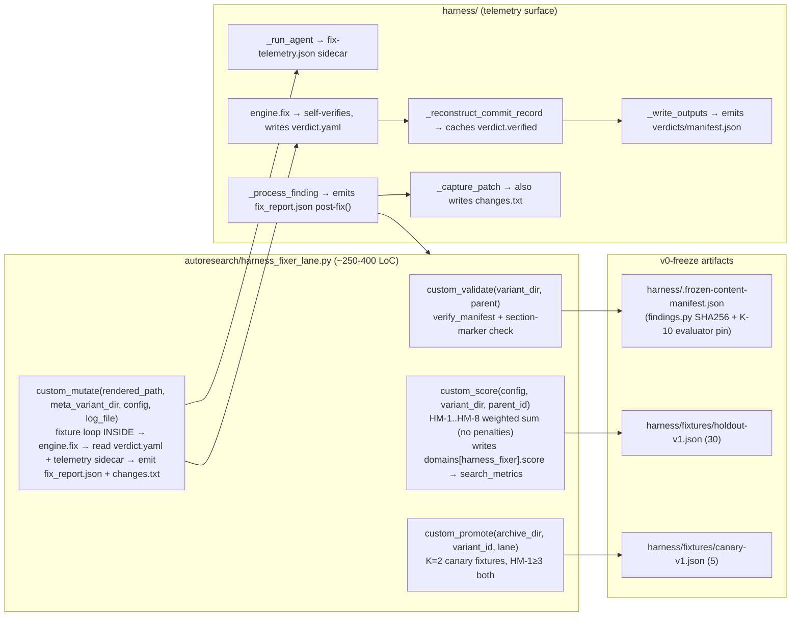

# feat — harness_fixer autoresearch lane (post-73bb887 self-verify architecture)

> **2026-04-30 cross-plan review against marketing audit lane plans**
> (`/Users/jryszardnoszczyk/Documents/GitHub/gofreddy/.worktrees/audit-v1/docs/plans/2026-04-30-001-marketing-audit-v1-pipeline-plan.md`
> + dormant-v3 `2026-04-24-005-marketing-audit-v3-fusion-roadmap.md`)
> + JR triage 2026-04-30:
>
> - **CORRECTED**: 4 wrong evolve.py call-site citations (off by ~245
>   lines). Real sites: `:1543, :1596-:1597, :1608-:1609, :1739-:1740`.
>   Fixed in §Relevant Code line 52 + §Sources line 892.
> - **CORRECTED**: `archive_dir: Path` → `str` in `harness_fixer_promote`
>   signature (Unit 6 line 522). evolve.py:1740 passes a string from
>   `cmd_promote`.
> - **CORRECTED**: LoC claim recharacterized from "~330-500" (Unit-6-
>   callables-only) to honest "~1,000-1,500 LoC code + tests" total
>   (line 13-15).
> - **9 LOCKED items** folded into plan body — see §Cross-pollination
>   §A bucket. Includes K-1b manifest enumeration test, K-10b telemetry
>   blindness invariant, K-5 sunset trigger spec, K-9 phased gate
>   (scalar HM-1 Gen 1-3 → Pareto post-Gen-3), Unit 5 fixture timeout,
>   Unit 6 meta-agent telemetry, Unit 8 `_PROBE_NAMES` validator, Unit 9
>   step 5b legacy-YAML normalization (~30 LoC), Risks evolve_lock
>   forward-promise.
> - **1 REJECTED item** explicitly resolved in §Cross-pollination §B:
>   HM-2 cross-references canonical probe list (skipped — `_PROBE_NAMES`
>   validator already covers structural case; depth-not-coverage; the
>   uncovered-by-validator case requires independent probe execution
>   which would re-add the AI-verifier-loop architecture `73bb887`
>   removed).

## Overview

Add a new autoresearch lane `harness_fixer` that evolves `harness/prompts/fixer.md` against the historical fixture corpus from `harness/runs/run-*/`. The lane registers as the first divergent `LaneSpec` (4 of 5 callables wired) under the shipped lane-registry contract. Anti-Goodhart honesty for the self-scoring fixer (post-`73bb887` "fixer self-verifies; drop AI verifier loop") is enforced via K-2 section markers + orchestrator-side deterministic gates + `golden_outcome` cross-check + Bernoulli replay variance — not via a separate verifier subprocess.

**Realistic scope** (corrected 2026-04-30 cross-review): ~1,000-1,500 LoC code + tests across `autoresearch/`, `harness/`, and `src/evaluation/` (the original "~330-500 LoC" claim counted only Unit 6's 4 callables; Phase 1 telemetry foundation is ~235-375 LoC, Unit 8 rubrics ~180-260 LoC, Unit 9 fixture authoring ~120-180 LoC, Unit 11 e2e tests ~150 LoC; sum is honestly above the original claim). No new LaneSpec fields; no new substrate; reuses shipped `compute_manifest`/`verify_manifest`/`file_hash` utilities. **Realistic time**: ~3-4 weeks code + 16-32h JR-coordinated rubric anchor authoring + Gen-1 dry-run.

## Problem Frame

`harness/prompts/fixer.md` is iterated by JR by hand: read agent.log, decide a probe missed, edit prompt, re-run. The harness already produces structured fixtures as a side effect (~24 runs / 380 high-confidence-actionable findings on disk). Pairing those with the fixer's own self-verify output (post-`73bb887`) plus the orchestrator's deterministic revert/surface_check/tip_smoke gates gives autoresearch what its evolve contract needs: parent variant + mutation surface + fixtures + rubric + fitness signal. Stop hand-tuning; let the fixer evolve against its own historical corpus. (See origin: `docs/brainstorms/2026-04-26-harness-fixer-autoresearch-fusion-requirements.md`.)

## Requirements Trace

- **R1.** Register `harness_fixer` as a new workflow lane in `autoresearch/lane_registry.py:LANES` with `is_workflow_lane=True`, 8 HM-* `rubric_ids`, and 4 of 5 divergence callables wired (origin §1, §7).
- **R2.** Freeze `harness/findings.py` whole-file via SHA256 manifest + `[STABLE]` blocks of `harness/prompts/fixer.md` via K-2 section-marker contract (origin §K-1).
- **R3.** Emit `fix_report.json` per-finding (K-13 schema) and `verdicts/manifest.json` per-run (K-3 schema) from harness side — both currently absent (origin §Dependencies items 2-4).
- **R4.** Ship `--prompts-dir` CLI override mirroring autoresearch's `ARCHIVE_DIR` env-var pattern (origin §Dependencies item 5).
- **R5.** Build a holdout (N=30) + canary (5) split at v0; persist to `harness/fixtures/holdout-v1.json` + `canary-v1.json`; LFS-mandatory fixture archive (origin §K-4 + §K-9).
- **R6.** Establish K=2 canary smoke gate via `custom_promote` callable, both-must-pass HM-1≥3 (origin §K-9).
- **R7.** Co-locate K-10 autoresearch evaluator pin inside the K-1 manifest; consensus-gated advancement (origin §K-10).
- **R8.** Success criterion: across 3 consecutive evolve generations, promoted variant's HM-1 on a fresh 10-fixture canary set is ≥ baseline + 2σ (origin Success Criteria, post-3rd-pass tightened from N=5/+1σ).

## Scope Boundaries

**Explicitly NOT in v1** (origin Scope Boundaries):
- Evolving evaluator prompts (deferred to `harness_evaluator` v2 lane)
- Evolving the verifier (no separate verifier exists post-`73bb887`; the 6 probes are `[STABLE]` content)
- Evolving model selection or `--allowedTools` whitelist
- Evolving retry strategies / orchestrator code
- Freezing `harness/engine.py` (whole-file freeze conflicts with K-13 token-parser addition)
- `evolve_lock` mutex primitive (operator runs evolve while no live `harness/run` is active — by policy, not primitive)
- Production-trace fitness signal (no `lineage.jsonl` write from `harness/run.py`; no consumer in autoresearch — v2)
- HM-6/HM-7 normalization-vs-promoted-median (no Generation-1 baseline)
- `cost_penalty_weight` / `latency_penalty_weight` in fitness formula (double-counted with HM-6/HM-7 absolute anchors)
- Auto-promoting variants without operator review
- Adding new LaneSpec fields (substrate is locked; all 4 Divergence Locks chosen specifically to avoid expansion)

## Context & Research

### Relevant Code and Patterns

- **Lane registry contract:** `autoresearch/lane_registry.py:22-38` (LaneSpec dataclass), `:45-146` (5 existing entries), `:167-173` (derived re-exports), `:217-242` (file_hash / compute_manifest / verify_manifest).
- **LaneSpec callable call sites in `evolve.py`** (corrected 2026-04-30 cross-plan review — repo-research-analyst's earlier numbers were ~245 lines off): `custom_mutate` at `:1543-1544`, `custom_validate` at `:1596-1597`, `custom_score` at `:1608-1609`, `custom_promote` at `:1739-1740`.
- **First divergent-lane test pattern:** `tests/autoresearch/test_lane_registry_lifecycle_wraps.py:38-119` — registers a synthetic divergent lane via `LANES["fake_divergent"] = LaneSpec(...)` in try/finally; harness_fixer's tests should mirror this shape.
- **LaneSpec invariants test:** `tests/autoresearch/test_lane_registry.py` — must update `:42-47` (lane name lists) and ensure `_assert_models_literal_matches` passes via `models.py:160` Literal extension.
- **Structural validator pattern:** `src/evaluation/structural.py:285-385` (`_validate_storyboard`) — sync function returning `StructuralResult(passed, failures, dqs_score)`. Bidirectional drift test: `tests/autoresearch/test_structural_doc_facts.py:45-54`.
- **Harness test pattern:** `tests/harness/test_run.py:22-33` (`_init_repo` real subprocess + real git), `tests/harness/conftest.py:9-13` (env scrubber). No mocks for git/filesystem; ad-hoc `monkeypatch` only for subprocess fault injection.
- **CLI flag pattern:** `harness/cli.py:11-38` argparse + `harness/config.py:113-136` `HARNESS_<UPPER>` env-var fallback resolved in `Config.from_cli_and_env`. Mirror `--staging-root` exactly.
- **Harness post-`73bb887` self-verify shape:** `harness/engine.py:180-193` `fix(...)` writes verdict YAML in-process; `harness/run.py:362-387` `_reconstruct_commit_record` already calls `engine.Verdict.parse(verdict_path)` at `:381` — natural cache site for the new `verified` field.
- **Token stream-json shape (verified from `harness/runs/run-20260428-105643/verifies/c/F-c-8-1/agent.log`):** final event is `{"type":"result","subtype":"success","duration_ms":...,"total_cost_usd":2.220037,"usage":{"input_tokens":55,"cache_creation_input_tokens":64422,"cache_read_input_tokens":2856999,"output_tokens":15545,...}}`. Read backward from EOF, NOT 32KB tail.

### Institutional Learnings

`docs/solutions/` does not exist in this repo (confirmed by learnings-researcher). Institutional knowledge for this plan lives in:
- The origin brainstorm (3rd-pass revised, all decisions locked).
- `docs/plans/2026-04-27-002-feat-autoresearch-lane-registry-plan.md` (registry refactor + 7 Known Divergence Points).
- `docs/architecture/lane-registry.md` (LaneSpec field reference + worked example).
- Auto-memory entries: harness fixer-self-verifies confirmation (2026-04-29), evaluator-bias-and-verifier-roi, lane-registry-shipped state.

### External References

External research skipped — autoresearch + harness are internal infrastructure with no external doc surface. The relevant patterns are all in-repo.

## Key Technical Decisions

- **K-1 (revised 3rd pass):** Freeze 1 whole file (`harness/findings.py`) via SHA256 manifest + `[STABLE]` blocks of `fixer.md` via K-2 section-marker contract. **No `verifier.md` freeze** (file deleted by `73bb887`). **No `engine.py` freeze** (whole-file SHA256 conflicts with K-13). Manifest also carries K-10 evaluator pin entries (flat dict format — see Unit 9 for the FLAT-vs-wrapped reconciliation; the shipped `verify_manifest` utility at `lane_registry.py:227-242` iterates `manifest.items()` and requires flat `{rel_path: sha256}` shape, so K-10's nested wrapper from the brainstorm is replaced with a flat manifest + git tag for metadata).
- **K-1b (added 2026-04-30 cross-plan review):** Manifest enumeration test. New `tests/harness/test_frozen_manifest_complete.py` diffs `harness/prompts/*.md` directory contents against the K-1 manifest keyset + an `[EVOLVABLE]`-only allowlist; FAILS on any unlisted file. Closes the porous-guard gap a future variant could exploit by introducing a new prompt file (e.g. `harness/prompts/aux.md`) outside K-2 enforcement. Mirrors marketing-audit fusion plan §Unit 18's manifest enumeration test pattern. ~30 LoC test.
- **K-2:** Evolve mutates ONLY `[EVOLVABLE]`-marked sections of `fixer.md`. Section-marker enforcement runs inside `custom_mutate` as a diff post-processor.
- **K-3:** Hybrid golden_outcome (verbatim disk + top-K=5 disagreement re-judge); `verdicts/manifest.json` schema with `evaluator_pin` field; production path uses in-memory `RunState.commits`, NOT log-grep. Cache `verified` at `_reconstruct_commit_record` (`run.py:362-387`).
- **K-4:** N=30 holdout + 5 canary; corrected matrix (24 runs / 703 findings / 380 actionable); 3-5 GB to LFS-mandatory archive.
- **K-5 (sunset trigger spec'd 2026-04-30):** Weights HM-1=0.40 / HM-2=0.20 / HM-3..5=0.10 each / HM-6=0.05 / HM-7=0.04 / HM-8=0.01 (sum=1.0); **no penalty terms**. **Sunset trigger (concrete):** after Generation 3, if HM-1 single-shot variance across 30 fixtures < 0.5σ, weights are degenerate → re-tune required (operator runs `harness/regen_frozen_manifest.py` for K-10 pin update + edits weights in lane spec). Without an explicit trigger, "re-tune required after Generation 3" is a TODO without an actor.
- **K-9 (LOCKED 2026-04-30 cross-plan review):** K=2 canary fixtures from 5-fixture set. **Phased gate:** Generations 1-3 use scalar HM-1≥3 on both canaries (lets variants flow during bootstrapping when there's no empirical variance baseline). **Post-Gen-3, upgrade to Pareto-dominance across all 8 HM-* axes** (no axis regresses vs current head; at least one strictly better) IF empirical data shows variants gaming HM-1 specifically (HM-3/HM-7 dropping while HM-1 stays high). Otherwise keep scalar — simpler. The K-9 gate decision lives in `harness_fixer_promote` (Unit 6 line ~481-487); both phases ship in v1, the upgrade is a configuration toggle not a code change.
- **K-10:** Pin co-located in K-1 manifest; consensus-gated advancement.
- **K-10b (added 2026-04-30 cross-plan review):** **Telemetry blindness invariant.** Meta-agent prompt context (the `claude -p` invocation inside `custom_mutate`) MUST NOT receive any `fix_report.json` or `verdicts/manifest.json` content from prior generations. Currently enforced physically via worktree isolation (meta-agent runs in scratch worktree without access to `verdicts/`); this Key Decision documents the policy invariant so future refactors do not accidentally pass `fix_report.json` paths into the meta-agent's prompt — that would Goodhart HM-2 directly.
- **K-11:** Serial — harness_fixer first, then marketing_audit.
- **K-13:** `fix_report.json` (renamed from `verifier_report.json`); `dict[str, bool]` probes; `verified|failed|blocked|error` enum; emission via post-`fix()` orchestrator hook in `_process_finding`. **Probes source:** Unit 1b updates the fixer.md `[STABLE]` self-verify block to instruct the fixer to write a `probes_passed:` mapping in the verdict YAML; `Verdict.parse` reads it; orchestrator passes through to `fix_report.json`. (Without Unit 1b, the current verdict YAML has no per-probe data — only `verdict + reason + adjacent_checked`.)
- **Divergence Lock #1:** Granularize `HARNESS_PREFIXES` at `lane_paths.py:47` (drop `verifier.md` per `73bb887`).
- **Divergence Lock #2:** Score normalization to `[0,1]` keeps default plateau-detection (inline `pstdev < 0.01` at `select_parent.py:97`) unchanged.
- **Divergence Lock #3:** `custom_validate` re-runs `verify_manifest` + section-marker check on every validate. No clone-time snapshot.
- **Divergence Lock #4:** `structural.py:38-46` data-driven dispatch via `STRUCTURAL_GATE_FUNCTIONS` (option b). +5 LoC.

## Open Questions

### Resolved During Planning

- **LaneSpec ordering in `LANES` dict?** Add `harness_fixer` after `storyboard` per repo-research-analyst recommendation. Insertion order is preserved by `dict`; consumers iterate in registration order.
- **Should `harness_fixer` appear in `test_lane_registry_lifecycle_wraps.py:26-35` parametrize?** No — that test enforces "no callable wired"; scope to original 5 lanes.
- **`HM_PREFIX` for service.py?** Existing imports (`GEO_PREFIX`, `SB_PREFIX`) are domain-specific rubric-prose preambles. HM rubrics use the same 1/3/5 anchor scale as GEO/SB; if HM rubrics need a domain-specific preamble (judging code-quality vs content quality), add `HM_PREFIX` to `rubrics.py` exports + `service.py:24` import. **Decision:** add `HM_PREFIX` for symmetry with existing prefix exports; preamble content TBD during Unit 8 implementation (the prose is /ce:plan deliverable per origin).
- **Where does `domains["harness_fixer"].score` get populated in `search_metrics`?** Inside `evaluate_variant.py`'s aggregator after `custom_score` writes `scores.json`. Per `default_objective_score_from_entry` at `lane_registry.py:180-199`, the workflow-lane path reads `metrics["domains"][lane_name]["score"]` — `custom_score` must write this key.
- **Manifest regeneration when frozen content legitimately needs to evolve?** Add a small operator script `harness/regen_frozen_manifest.py` (~20 LoC) that calls `compute_manifest([Path("harness/findings.py")], repo_root)` and writes to `harness/.frozen-content-manifest.json`. Mirrors how `regen_program_docs.py` regenerates structural-doc-facts blocks.

### Deferred to Implementation

- **Exact `HM_PREFIX` prose** — anchor descriptions at GEO-1-comparable depth are /ce:plan-deliverable per origin §"Genuinely /ce:plan-deliverable". Implementation-time work, not a planning decision.
- **Exact disagreement-replay tooling shape** — Unit 10 builds a one-off operator script; the script details belong with the implementation since they depend on actual fixture corpus shape at v0-freeze time.
- **K-9 canary fixture selection algorithm** — described in origin §K-9 ("biased toward cells with the largest pools"); the seeded RNG implementation details emerge during Unit 9.
- **Cwd handling for `worktree.create_workers`** — explicit `os.chdir(main_repo)` inside `custom_mutate` vs. refactor `create_workers` to accept `main_repo` parameter. Both work; pick at implementation time after seeing the call shape. Lean toward chdir (single-line addition) over refactor (touches 60-LoC function + all callers).
- **Backend port allocation across concurrent variants** — not a v1 concern (operator runs evolve while no live harness, per K-11). v2 if concurrent operation becomes routine.

## High-Level Technical Design

> *This illustrates the intended approach and is directional guidance for review, not implementation specification. The implementing agent should treat it as context, not code to reproduce.*

**Lane integration shape (post-`73bb887`):**



**Self-scoring honesty mechanism stack (per origin §3a):**

| Mechanism | What it does | Where enforced |
|---|---|---|
| K-2 section markers | Probe definitions in `[STABLE]` blocks of `fixer.md` cannot mutate | `custom_mutate` diff post-processor |
| Orchestrator gates | `revert_phase` + `surface_check` + `tip_smoke` (non-LLM) catch lying fixers | `harness/run.py` (existing infrastructure) |
| `golden_outcome` cross-check | Top-K=5 disagreement fixtures get JR re-judge | `holdout-v1.json` builder + operator step |
| Bernoulli replay | 2-replay mean detects self-report bias variance | `custom_score` aggregation |

## Implementation Units

### Phase 1 — Harness telemetry foundation (5 units)

- [ ] **Unit 1: Relocate `_VERIFIED_TOKENS` / `_FAILED_TOKENS` to `harness/findings.py`**

**Goal:** Pre-v0-freeze prerequisite enabling whole-file freeze of `findings.py` without engine.py conflict (per K-1 reject).

**Requirements:** R2.

**Dependencies:** None. Must land before Unit 9 (manifest commit). Must land before Unit 1b (which co-locates with the relocated frozensets).

**Files:**
- Modify: `harness/engine.py` (delete `_VERIFIED_TOKENS` / `_FAILED_TOKENS` definitions at `:104-105`; add `from harness.findings import _VERIFIED_TOKENS, _FAILED_TOKENS` at top imports)
- Modify: `harness/findings.py` (add the two frozensets after `CONFIDENCES` at `:25`)
- Test: `tests/harness/test_engine.py` (existing verdict-parsing tests at `:38-49` continue passing — only the import location changes)

**Approach:**
- The two frozensets are parsed orchestrator-side by `Verdict.parse` to classify YAML output. They semantically belong with the `Finding` schema in `findings.py`.
- Keep frozenset contents identical: `_VERIFIED_TOKENS = frozenset({"verified", "pass", "passed", "ok", "yes", "true", "confirmed"})`, `_FAILED_TOKENS = frozenset({"failed", "fail", "no", "false", "blocked", "rejected"})`.
- engine.py keeps `Verdict.parse` (consumer code); just imports the two sets.

**Patterns to follow:**
- `harness/findings.py:24-26` — existing module-level tuples (`ALL_CATEGORIES`, `CONFIDENCES`, `TRACKS`).

**Test scenarios:**
- Happy path: `from harness.findings import _VERIFIED_TOKENS, _FAILED_TOKENS` succeeds; `from harness.engine import _VERIFIED_TOKENS, _FAILED_TOKENS` ALSO succeeds (re-export via import).
- Integration: existing `tests/harness/test_engine.py:38-49` verdict parsing tests pass unchanged.
- Edge case: confirm `Verdict.parse` still classifies `"verified"` / `"failed"` strings correctly post-relocation.

**Verification:**
- `pytest tests/harness/test_engine.py` passes with no test changes needed.
- `grep -rn "_VERIFIED_TOKENS\|_FAILED_TOKENS" harness/ src/ tests/ autoresearch/` shows definitions in findings.py and import-only references everywhere else.

---

- [ ] **Unit 1b: Update fixer.md `[STABLE]` self-verify to emit `probes_passed` + extend `Verdict` dataclass + update `Verdict.parse`**

**Goal:** Make the K-13 schema's `probes_passed: dict[str, bool]` populatable. Current fixer.md `[STABLE] Writing the verdict YAML` block (`harness/prompts/fixer.md:120-130`) only instructs the fixer to write `verdict + reason + adjacent_checked + surface_changes_detected` — no per-probe breakdown exists in the verdict YAML today. Without this unit, Unit 4's `fix_report.json` cannot populate `probes_passed`, breaking HM-2 (which scores per-probe).

**Requirements:** R3 (HM-2 scoring depends on per-probe data).

**Dependencies:** Unit 1 (token relocation lands first; both share v0-freeze prerequisite framing).

**Files:**
- Modify: `harness/prompts/fixer.md` (extend the `[STABLE] Writing the verdict YAML` block at `:120-130` to emit a `probes_passed` mapping)
- Modify: `harness/engine.py` (add `probes_passed: dict[str, bool] = field(default_factory=dict)` field to `Verdict` dataclass at `:108-159`; update `Verdict.parse` classmethod to read the new YAML key with backward-compatible default `{}`)
- Test: `tests/harness/test_engine.py` (new: `test_verdict_parse_reads_probes_passed`; new: `test_verdict_parse_handles_legacy_yaml_without_probes_passed`)

**Approach:**
- New verdict YAML shape (extend existing; do NOT replace):
  ```yaml
  verdict: passed   # or: failed
  reason: |
    <one or two sentences. for failed: WHICH probe failed and why. for passed: which siblings + adversarial state you confirmed.>
  probes_passed:
    defect_gone: true
    paraphrase: true
    adjacent: true
    adversarial_state: true
    surface_preserved: true
    symmetric_surface: true
  adjacent_checked:
    - <sibling 1 you exercised>
    - <sibling 2 you exercised>
  ```
- The `probes_passed` mapping has the 6 probe names exactly matching K-13 schema (`defect_gone`, `paraphrase`, `adjacent`, `surface_preserved`, `adversarial_state`, `symmetric_surface`). Boolean per probe.
- For `verdict: failed`, at least one probe is `false`. For blocked probes (no Playwright, no fixture), boolean is `false` AND `reason` documents the block per existing fixer.md instruction.
- `Verdict.parse` reads the new field; if YAML lacks `probes_passed` (legacy), defaults to `{}`. Backward-compatible — historical verdicts in `harness/runs/run-*` continue to parse.
- This is a v0-freeze-time edit (operator change, not meta-agent mutation). The fixer.md change becomes part of the v0-frozen `[STABLE]` content; meta-agent cannot soften it post-K-2 enforcement.

**Patterns to follow:**
- `harness/prompts/fixer.md:120-130` — existing `[STABLE] Writing the verdict YAML` block (extend, don't rewrite).
- `harness/engine.py:108-159` `Verdict` dataclass — frozen + `field(default_factory=dict)` pattern for the new field.

**Test scenarios:**
- Happy path: `Verdict.parse` reads a YAML with full `probes_passed` mapping → returns `Verdict` with `probes_passed={defect_gone: True, paraphrase: True, ...}`.
- Backward compat: `Verdict.parse` reads a legacy YAML (no `probes_passed` key) → returns `Verdict` with `probes_passed={}` and `verified` derived from the `verdict` field as today.
- Edge case: YAML with `probes_passed: {defect_gone: true, adjacent: false, ...}` → `verdict: failed` is consistent (at least one `false` probe).
- Edge case: malformed `probes_passed` (string instead of dict) → `Verdict.parse` raises ValueError clearly (no silent default to `{}` — that would mask bugs).
- Integration: regenerate one historical verdict via the new fixer.md instruction; confirm parse roundtrip.

**Verification:**
- `pytest tests/harness/test_engine.py::test_verdict_parse_reads_probes_passed tests/harness/test_engine.py::test_verdict_parse_handles_legacy_yaml_without_probes_passed` passes.
- Existing verdict YAML files in `harness/runs/run-*/verdicts/` continue to parse without modification (backward compat verified).
- `grep -A 8 "Writing the verdict YAML" harness/prompts/fixer.md` shows the new `probes_passed` block in the canonical fixer.md.

---

- [ ] **Unit 2: Token telemetry parser + `TokenUsage` dataclass + sidecar write in `_run_agent`**

**Goal:** Capture per-call token usage / cost / wall-clock from Claude stream-json `result.usage` event; write JSON sidecar at `_run_agent` exit. Required input for HM-6 / HM-7 / fix_report.json.

**Requirements:** R3.

**Dependencies:** None.

**Files:**
- Modify: `harness/engine.py` (add `TokenUsage` dataclass; add `parse_token_usage(log_path: Path) -> TokenUsage | None` mirroring `parse_rate_limit` shape at `:242-293`; call from `_run_agent` at exit; write sidecar to `<output_path>.parent / "fix-telemetry.json"`)
- Test: `tests/harness/test_engine.py` (new: `test_parse_token_usage_reads_result_event_from_stream_json`; new: `test_run_agent_writes_telemetry_sidecar_on_success`)

**Approach:**
- **Read backward from EOF** (NOT 32KB tail like `parse_rate_limit` — verifier logs run MBs); scan lines until first `{"type":"result"...}` JSON. Returns `None` for codex (no stream-json) and for failed runs (no result event written).
- `TokenUsage` dataclass fields: `input_tokens`, `output_tokens`, `cache_creation_input_tokens`, `cache_read_input_tokens`, `total_cost_usd`, `duration_ms`. All optional with `None` defaults.
- Sidecar location: `<output_path>.parent / "fix-telemetry.json"` — colocated with `agent.log`. JSON dump of `dataclasses.asdict(token_usage)`.
- `_run_agent` returns `None` (unchanged signature). The sidecar is the sole telemetry hand-off; no return-type churn.
- `Role` is `Literal["eval", "fix"]` post-`73bb887` (no `"verify"`); telemetry doesn't discriminate by role.

**Technical design:** *(directional guidance, not implementation specification)*

```python
# pseudocode shape only
@dataclass(frozen=True)
class TokenUsage:
    input_tokens: int | None = None
    output_tokens: int | None = None
    cache_creation_input_tokens: int | None = None
    cache_read_input_tokens: int | None = None
    total_cost_usd: float | None = None
    duration_ms: int | None = None

def parse_token_usage(log_path: Path) -> TokenUsage | None:
    # read log backward by line until first {"type":"result"...} JSON
    # extract usage subobject + total_cost_usd + duration_ms
    # return None if not found (codex / failure / partial log)
    ...
```

**Patterns to follow:**
- `harness/engine.py:242-293` `parse_rate_limit` (existing reverse-tail JSON parser).
- `harness/engine.py:108-159` `Verdict` dataclass (frozen + classmethod parse pattern).

**Test scenarios:**
- Happy path: synthetic stream-json log with result event → parser returns populated `TokenUsage`.
- Edge case: log with NO result event (e.g., timeout) → parser returns `None`.
- Edge case: log with multi-MB body and result event in last 1KB → parser finds it (regression test for backward-from-EOF correctness).
- Edge case: codex log shape (no `{"type":"result"}`) → returns `None`.
- Error path: malformed JSON in result event line → returns `None`, no exception.
- Integration: `_run_agent` writes `fix-telemetry.json` sidecar on success; sidecar parses as valid JSON with expected keys.
- Integration: `_run_agent` does NOT write sidecar on early failure (rate limit raised pre-result-event).

**Verification:**
- All new tests pass.
- Run `harness/cli.py` against one real fixture; confirm `fix-telemetry.json` lands next to `agent.log` with non-zero token counts.

---

- [ ] **Unit 3: `CommitRecord` field additions + verdict caching at `_reconstruct_commit_record` + `verdicts/manifest.json` emission at `_write_outputs`**

**Goal:** Persist `(finding_id → base_sha, commit_sha, verdict_status)` per K-3 schema. Required input for fixture-replay determinism.

**Requirements:** R3.

**Dependencies:** None (independent of Unit 2).

**Files:**
- Modify: `harness/review.py` (add `base_sha: str = ""` and `verified: bool | None = None` to `CommitRecord` dataclass at `:11-19`)
- Modify: `harness/run.py` (`_reconstruct_commit_record` at `:362-387` — add `verified=verdict.verified` to the returned `CommitRecord`; `_commit_fix` at `:1524-1554` — populate `base_sha` from staging-cherry-pick parent SHA; `_write_outputs` at `:1578-1591` — add manifest emission)
- Test: `tests/harness/test_run.py` (new: `test_commit_record_carries_base_sha_and_verified`; new: `test_write_outputs_emits_verdicts_manifest_json`; update `tests/harness/test_review.py` if it exists)

**Approach:**
- `base_sha` semantics: **staging-cherry-pick parent SHA** (NOT worker `pre_sha` at `run.py:1057` — that's the worker-branch HEAD, which differs from staging tip in multi-worker mode). Captured inside `_commit_fix` after the cherry-pick lands by reading the staging worktree's `HEAD~1`.
- `verified` cache point: `_reconstruct_commit_record` already calls `engine.Verdict.parse(verdict_path)` at `:381` — single-line addition `verified=verdict.verified` to the returned `CommitRecord`. Resume path inherits this automatically.
- Manifest schema (per K-3 lock):
  ```json
  {
    "run_id": "<basename of run_dir>",
    "tainted": false,
    "manifest_format_version": "1",
    "evaluator_pin": "<git_sha from harness/.frozen-content-manifest.json>",
    "findings": {
      "F-a-2-3": {
        "track": "a",
        "base_sha": "abc12345",
        "commit_sha": "def67890",
        "verdict_status": "verified|failed|blocked|error"
      }
    }
  }
  ```
- `tainted: true` for legacy `run-20260422-224908` (Bug #11/#17 contamination); emitter checks `run_id` against a hardcoded list constant.
- Findings without commits (blocked, error): emit with `verdict_status: "blocked"` or `"error"`, no `commit_sha`.
- Resume case (per `54ade91`): stale verdict YAML is purged at `_process_finding` start; manifest emitter runs at `_write_outputs` AFTER all `_commit_fix` returns, NOT eagerly per-attempt.

**Technical design:** *(directional guidance, not implementation specification)*

```python
# in harness/run.py shape sketch:
TAINTED_RUN_IDS = frozenset({"run-20260422-224908"})

def _emit_verdicts_manifest(run_dir: Path, state: RunState) -> None:
    payload = {
        "run_id": run_dir.name,
        "tainted": run_dir.name in TAINTED_RUN_IDS,
        "manifest_format_version": "1",
        "evaluator_pin": _read_evaluator_pin(),  # from harness/.frozen-content-manifest.json
        "findings": _build_findings_map(state),
    }
    (run_dir / "verdicts" / "manifest.json").write_text(json.dumps(payload, indent=2))
```

**Patterns to follow:**
- `harness/review.py:11-19` — `CommitRecord` dataclass shape (mutable fields with defaults).
- `harness/run.py:1578-1591` — existing `_write_outputs` writes `review.md` + `pr-body.md`; manifest is the third sibling write.

**Test scenarios:**
- Happy path: `_reconstruct_commit_record` returns `CommitRecord` with `verified=True` after parsing a `verified: true` YAML.
- Happy path: `_write_outputs` emits `verdicts/manifest.json` with all `state.commits` mapped + correct schema.
- Edge case: blocked finding (no commit) → manifest entry has `verdict_status: "blocked"`, no `commit_sha`.
- Edge case: error finding (silent rate-limit hang) → `verdict_status: "error"`, no `commit_sha`.
- Edge case: legacy `run-20260422-224908` → `tainted: true` at run level.
- Integration: full harness run end-to-end against synthetic finding; manifest exists, parses, has expected keys.
- Integration: resume path — initial run + `--fixers-only` rerun → second run emits a fresh manifest with the same finding_id.

**Verification:**
- `verdicts/manifest.json` exists post-run and matches K-3 schema.
- `jq '.findings | keys' verdicts/manifest.json` lists all attempted finding IDs.

---

- [ ] **Unit 4: `changes.txt` extension + `fix_report.json` orchestrator hook in `_process_finding`**

**Goal:** Emit per-finding `changes.txt` (git diff --stat) + per-finding `fix_report.json` (combines verdict YAML + telemetry sidecar). Required HM-3 input + K-13 deliverable.

**Requirements:** R3.

**Dependencies:** Unit 1b (probes_passed in verdict YAML + Verdict.probes_passed field) + Unit 2 (telemetry sidecar source) + Unit 3 (CommitRecord shape for verdict_status).

**Files:**
- Modify: `harness/run.py` (extend `_capture_patch` at `:1463-1486` with parallel `git diff --stat HEAD~1 HEAD` writing `<run_dir>/fix-diffs/<track>/<finding_id>.stat`; add `_emit_fix_report` post-`fix()` hook in `_process_finding` that combines `Verdict.parse(verdict_path)` + reads `fix-telemetry.json` sidecar + writes `<run_dir>/fix-reports/<track>/<finding_id>/fix_report.json`)
- Test: `tests/harness/test_run.py` (new: `test_capture_patch_writes_stat_alongside_diff`; new: `test_process_finding_emits_fix_report_json`)

**Approach:**
- `_capture_patch` already runs `git diff HEAD --no-color` and writes `<run_dir>/fix-diffs/<track>/<finding_id>.patch` (verified at `run.py:1463-1486`). Add a parallel `git diff --stat HEAD~1 HEAD` writing `.stat` alongside. ~3-5 LoC.
- `_emit_fix_report` runs after `engine.fix()` returns, before `_commit_fix`. Reads `verdict.yaml` (the fixer's self-verify output) + `fix-telemetry.json` sidecar (Unit 2) + computes `probes_passed` dict by parsing `Verdict.reason` (the YAML body lists each probe's status inline post-`73bb887`). Writes the K-13-shaped JSON to per-finding directory.
- K-13 schema fields: `finding_id`, `verdict`, `probes_passed: dict[str, bool]`, `reason`, `wall_clock_s`, `tokens_in`, `tokens_out`, `commit_sha`, `base_sha`.
- For `probes_passed`: read `Verdict.probes_passed` directly (populated from the YAML `probes_passed:` mapping per Unit 1b). Backward compat: if `Verdict.probes_passed == {}` (legacy verdict YAML predating Unit 1b), emit `probes_passed: {}` in `fix_report.json` — HM-2 then defaults to using only the top-level `verdict` field.
- Error case (no commit, verdict-parse failure): emit fix_report with `verdict: "error"`, omit `commit_sha`. Sidecar may be missing — `tokens_in`/`tokens_out`/`wall_clock_s` are `0`.

**Patterns to follow:**
- `harness/run.py:1463-1486` `_capture_patch` (existing git diff capture pattern).
- `harness/engine.py:108-159` `Verdict.parse` (YAML field extraction).

**Test scenarios:**
- Happy path: `_capture_patch` writes both `.patch` and `.stat` files post-fix.
- Happy path: `_emit_fix_report` writes `fix_report.json` with all 9 K-13 schema keys after a successful `verified` fix.
- Edge case: failed verdict → `fix_report.json` has `verdict: "failed"`, `probes_passed` has at least one `false`.
- Edge case: blocked finding → `fix_report.json` has `verdict: "blocked"`, no `commit_sha`.
- Edge case: missing telemetry sidecar (codex run or early failure) → fix_report has `tokens_in: 0`, `tokens_out: 0`, `wall_clock_s: 0`.
- Integration: full pipeline (fix → self-verify → emit fix_report) against synthetic finding; report parses, schema matches.

**Verification:**
- `fix_report.json` exists per finding under `fix-reports/<track>/<finding_id>/`.
- `jq '.verdict, .probes_passed' fix_report.json` returns the K-13 enum + 6-key dict.

---

### Phase 2 — Harness CLI override (1 unit)

- [ ] **Unit 5: `--prompts-dir` CLI flag + `HARNESS_PROMPTS_DIR` env var + `--fixture-timeout-seconds` flag**

**Goal:** Allow live runner to point at a non-default prompts directory (e.g., a variant directory during evolve, or JR's hand-edited copy during emergency hand-tuning). Mitigates "loss of fast manual override" risk per origin §8. **Also (added 2026-04-30 cross-plan review):** add per-fixture deadline so one hung `engine.fix()` does not back up all 30 holdout × 2 replays inside `harness_fixer_mutate`.

**Requirements:** R4.

**Dependencies:** None.

**Files:**
- Modify: `harness/cli.py` (add `--prompts-dir` argparse argument; add `--fixture-timeout-seconds` argparse argument, default 600)
- Modify: `harness/config.py` (add `prompts_dir: Path = field(default_factory=lambda: Path.cwd() / "harness" / "prompts")` to `Config`; add `fixture_timeout_seconds: int = 600` to `Config`; resolve in `Config.from_cli_and_env` mirroring `staging_root` block at `:131-135`)
- Modify: `harness/prompts.py` (`_PROMPTS_DIR` at `:15` reads `HARNESS_PROMPTS_DIR` env var with module-relative fallback; `render_fixer` and other render functions use the resolved path)
- Test: new `tests/harness/test_config.py` if absent (`test_config_resolves_prompts_dir_from_cli`; `test_config_resolves_prompts_dir_from_env`; `test_config_falls_back_to_default`; `test_config_fixture_timeout_seconds_default`)

**Approach:**
- Mirror autoresearch's `ARCHIVE_DIR` pattern (`autoresearch/lane_runtime.py:250-252` env-only; `autoresearch/evolve.py:295-302` CLI flag overrides env).
- Resolution order: `--prompts-dir` arg > `HARNESS_PROMPTS_DIR` env var > module-relative default.
- ~13 LoC across the three files.
- Add `HARNESS_PROMPTS_DIR` to the `tests/harness/conftest.py:9-13` autouse env scrubber so tests don't inherit the operator's setting.

**Patterns to follow:**
- `harness/cli.py:37` `--staging-root` argparse line.
- `harness/config.py:131-135` `staging_root` resolution block.
- `autoresearch/lane_runtime.py:resolve_runtime_dir()` (env+default resolution helper).

**Test scenarios:**
- Happy path: `--prompts-dir /tmp/xyz` overrides env + default.
- Happy path: `HARNESS_PROMPTS_DIR=/tmp/abc` env var sets default when CLI flag absent.
- Happy path: neither flag nor env → falls back to `<cwd>/harness/prompts`.
- Edge case: `--prompts-dir` points at non-existent directory → `Config.from_cli_and_env` accepts it (validation deferred to render time, where the actual file-not-found error surfaces).
- Integration: `harness/prompts.py:render_fixer` reads from the resolved path; smoke-test by running `python -m harness --prompts-dir /tmp/xyz --eval-only` and confirming fixer.md is read from the override.

**Verification:**
- `python -m harness --help` shows `--prompts-dir` flag.
- All three resolution paths tested.

---

### Phase 3 — Autoresearch lane wiring (3 units)

- [ ] **Unit 6: `autoresearch/harness_fixer_lane.py` — 4 callables (~250-400 LoC)**

**Goal:** Implement the divergence callables that connect the lane_registry contract to the harness's existing `engine.fix()` + `_process_finding` machinery.

**Requirements:** R1, R5, R6, R7.

**Dependencies:** Unit 4 (fix_report.json emission must work); Unit 9 (manifest must exist for `custom_validate` AND holdout/canary lists must exist for `custom_mutate`/`custom_promote`).

**Files:**
- Create: `autoresearch/harness_fixer_lane.py`
- Test: `tests/autoresearch/test_harness_fixer_lane.py` (mirror `test_lane_registry_lifecycle_wraps.py:38-119` synthetic-LANES pattern)

**Approach:**
- **`harness_fixer_validate(variant_dir, parent)` (~10 LoC):**
  - Call `verify_manifest(variant_dir / "harness/.frozen-content-manifest.json", variant_dir)` for findings.py + K-10 evaluator pin.
  - Call `_check_stable_sections_unchanged(variant_dir / "harness/prompts/fixer.md")` (parses `[STABLE]` markers; returns `True` if all `[STABLE]` blocks match the v0-freeze copy).
  - Returns `True` iff both pass.
- **`harness_fixer_mutate(rendered_path, meta_variant_dir, config, log_file=...)` (~150-250 LoC):**
  - Load `harness/fixtures/holdout-v1.json` from variant_dir.
  - For each fixture: `os.chdir(main_repo)` (or refactor — see Open Questions); call `worktree.create_workers` to provision worker + backend + Vite (per `c3fd6a7`); render `Finding` from fixture YAML; call `engine.fix(config, finding, wt, run_dir)` **wrapped in `signal.alarm(config.fixture_timeout_seconds)` (default 600s); on timeout, emit `fix_report.json` with `verdict: "error"` + `reason: "fixture_timeout"` and continue**; read verdict YAML + telemetry sidecar; emit `fix_report.json` + `changes.txt`; teardown via `worktree.cleanup`.
  - Bernoulli replay: each fixture replays twice (per §4); both reports written under `<variant_dir>/runs/<run_id>/fix-reports/<track>/<finding_id>/replay-{0,1}/fix_report.json`.
  - **Meta-agent telemetry (added 2026-04-30):** at end of fixture loop, write `<variant_dir>/runs/meta-telemetry.json` with `{fixtures_attempted, fixtures_completed, fixtures_timed_out, total_cost_usd, total_wallclock_seconds}`. Without this, the "Generation 1 cost ≤ 50% of 5h Claude window" claim cannot be retrospectively verified.
  - Returns int (exit code).
- **`harness_fixer_score(config, variant_dir, parent_id)` (~50 LoC):**
  - Read all `fix_report.json` + `changes.txt` files under `<variant_dir>/runs/`.
  - Aggregate per-fixture: HM-1 = mean of 2 replays' raw 1/3/5; HM-2/HM-6/HM-7 same. HM-3 from changes.txt line counts. HM-4 from LLM-judged code-quality checklist (use existing `judges/__init__.py:74-76 normalize_gradient` + `normalize_checklist`).
  - Apply K-5 weights: `0.40*HM1 + 0.20*HM2 + 0.10*(HM3+HM4+HM5) + 0.05*HM6 + 0.04*HM7 + 0.01*HM8`. Each HM normalized via `(score-1)/4`.
  - Geomean across fixtures (lane convention).
  - Write `<variant_dir>/scores.json` with shape compatible with `evaluate_variant.py`'s aggregator: `{"domains": {"harness_fixer": {"score": <fitness>, ...per-axis breakdowns...}}}`.
- **`harness_fixer_promote(archive_dir, variant_id, lane)` (~30-50 LoC):**
  - Load `harness/fixtures/canary-v1.json` (5 fixtures).
  - Sample K=2 (operator-deterministic — first 2, since canary set is small and stable).
  - Run each canary fixture through the same mutate → score path (single replay each).
  - Pass criterion: HM-1 ≥ 3 on both canaries. (Per K-9.)
  - On failure: log to `archive/promote-rejections-<YYYYMMDD>.md` with finding_ids + HM-1 scores + reason; return `False`.
  - Returns `True` iff pass.

**Execution note:** Use real subprocess + real git per harness test convention; do NOT mock `engine.fix()` or `worktree.create_workers`. Tests run synthetic LaneSpec inserts via try/finally.

**Technical design:** *(directional guidance, not implementation specification)*

```python
# harness_fixer_lane.py shape
import os
from pathlib import Path
from autoresearch.lane_registry import verify_manifest

FROZEN_MANIFEST_REL = Path("harness/.frozen-content-manifest.json")
HOLDOUT_REL = Path("harness/fixtures/holdout-v1.json")
CANARY_REL = Path("harness/fixtures/canary-v1.json")

def harness_fixer_validate(variant_dir: Path, parent: str | None) -> bool:
    passed, _ = verify_manifest(variant_dir / FROZEN_MANIFEST_REL, variant_dir)
    if not passed:
        return False
    return _check_stable_sections_unchanged(variant_dir / "harness/prompts/fixer.md")

def harness_fixer_mutate(rendered_path, meta_variant_dir, config, log_file=None) -> int:
    holdout = json.loads((meta_variant_dir / HOLDOUT_REL).read_text())
    for fixture_id in holdout["fixtures"]:
        for replay_idx in (0, 1):
            _replay_fixture(fixture_id, replay_idx, meta_variant_dir, config, log_file)
    return 0

def harness_fixer_score(config, variant_dir: str, parent_id: str | None) -> None:
    reports = _load_all_fix_reports(Path(variant_dir))
    aggregated = _aggregate_replays(reports)  # 2-replay mean per fixture
    fitness = _weighted_sum_no_penalties(aggregated)  # K-5 weights
    _write_scores_json(Path(variant_dir), fitness, aggregated)

def harness_fixer_promote(archive_dir: str, variant_id: str, lane: str) -> bool:
    # evolve.py:1740 passes archive_dir as str (from cmd_promote);
    # resolve to Path internally if needed via Path(archive_dir).
    canary = json.loads((archive_dir / CANARY_REL).read_text())
    chosen = canary["fixtures"][:2]  # K=2
    results = [_run_canary(fid, archive_dir) for fid in chosen]
    if all(r.hm1 >= 3 for r in results):
        return True
    _log_rejection(archive_dir, variant_id, results)
    return False
```

**Patterns to follow:**
- `tests/autoresearch/test_lane_registry_lifecycle_wraps.py:38-119` for the synthetic LaneSpec insertion test pattern.
- `harness/run.py:_process_finding` for the engine.fix → verdict-parse → fix_report.json sequence.
- `src/evaluation/judges/__init__.py:74-90` `normalize_gradient` + `normalize_checklist` + `geometric_mean` helpers.

**Test scenarios:**
- Happy path: synthetic LANES insert + `custom_validate(variant_dir, None)` returns `True` for an unmodified findings.py + intact `[STABLE]` blocks.
- Edge case: hash-modified `findings.py` → `custom_validate` returns `False`.
- Edge case: meta-agent edits a `[STABLE]` block of fixer.md → `custom_validate` returns `False`.
- Happy path: `custom_score` reads two replay reports per fixture, computes 2-replay mean, applies K-5 weights, writes `scores.json` with `domains.harness_fixer.score` populated.
- Edge case: `custom_score` with one missing replay (only replay-0 exists) → log warning, use single-replay value, do NOT silently fail.
- Edge case: `custom_score` with all-error fixtures (HM-1=1 across the board) → fitness ≈ 0; lane still produces a valid `scores.json`.
- Integration: full lane lifecycle through `evolve.cmd_run` against a stub LaneSpec → all 4 callables invoked in order; promote-pass triggers `custom_promote`; reject triggers logged rejection.
- Edge case: `custom_promote` with K=2 canaries, one passes one fails → returns `False`, logs rejection.
- Edge case: `custom_promote` with both canaries passing → returns `True`, no rejection log.

**Verification:**
- New test file passes.
- A dry-run `python -m autoresearch evolve --lane harness_fixer --iterations 1 --dry-run` reaches `custom_mutate` invocation (verifies wiring).

---

- [ ] **Unit 7: LaneSpec entry + cascade edits**

**Goal:** Register `harness_fixer` lane in the live registry; sync the manually-maintained Literal at `models.py:160`; granularize `HARNESS_PREFIXES`; extend `_INNER_PHASE_TAGS`.

**Requirements:** R1.

**Dependencies:** Unit 6 (callables must exist for the LaneSpec to reference).

**Files:**
- Modify: `autoresearch/lane_registry.py` (add `harness_fixer` LaneSpec entry to `LANES` dict at `:45-146`, after `storyboard`)
- Modify: `src/evaluation/models.py` (extend Literal at `:160` from `Literal["geo", "competitive", "monitoring", "storyboard"]` to include `"harness_fixer"`)
- Modify: `autoresearch/lane_paths.py` (granularize `HARNESS_PREFIXES` at `:47` per Divergence Lock #1; **drop `harness/prompts/verifier.md`** since file was deleted by `73bb887`)
- Modify: `autoresearch/evaluate_variant.py` (add `"fix"` to `_INNER_PHASE_TAGS` frozenset at `:858-870`)
- Modify: `tests/autoresearch/test_lane_registry.py` (update `:42-47` lane-name assertions to include `harness_fixer`)
- Test: existing `tests/autoresearch/test_lane_registry.py` covers most invariants; add `test_harness_fixer_lanespec_validates_models_literal` if absent.

**Approach:**
- LaneSpec literal (origin §7 site 1):
  ```python
  "harness_fixer": LaneSpec(
      name="harness_fixer",
      is_workflow_lane=True,
      rubric_ids=_rubric_ids("HM"),
      path_prefixes=(
          "harness/prompts/fixer.md",
          "programs/harness_fixer-session.md",
          "templates/harness_fixer",
          "workflows/harness_fixer.py",
          "workflows/session_eval_harness_fixer.py",
      ),
      session_md_filename="harness_fixer-session.md",
      deliverables=("*/fix_report.json", "*/changes.txt"),
      intermediate_artifacts=("verdicts/*.yaml", "fix-diffs/*.diff"),
      structural_doc_facts=( ... 5 bullets ... ),  # see Unit 8
      structural_gate_functions=( ... 5 names ... ),
      custom_mutate=harness_fixer_mutate,
      custom_score=harness_fixer_score,
      custom_validate=harness_fixer_validate,
      custom_promote=harness_fixer_promote,
  ),
  ```
- `HARNESS_PREFIXES` granularization (Divergence Lock #1, line corrected from `:42` to `:47`): drop `harness/prompts/verifier.md` (file no longer exists).
- `_INNER_PHASE_TAGS`: add `"fix"` to the frozenset; `"verify"` is already present (no change).
- `models.py:160` Literal: shipped runtime check `_assert_models_literal_matches()` at `lane_registry.py:202-214` catches drift at evolve startup.

**Patterns to follow:**
- `autoresearch/lane_registry.py:45-146` for LaneSpec entry shape.
- `tests/autoresearch/test_lane_registry.py:42-47` for the lane-name assertion update pattern.

**Test scenarios:**
- Happy path: `from autoresearch.lane_registry import LANES; LANES["harness_fixer"]` returns a valid LaneSpec.
- Happy path: `_assert_models_literal_matches()` passes after the Literal update.
- Happy path: derived re-exports (`WORKFLOW_PREFIXES`, `DELIVERABLES`, etc.) include `harness_fixer` after registration.
- Edge case: omit Literal update → `_assert_models_literal_matches()` raises (regression test for the manual-sync invariant).
- Integration: `python -m autoresearch evolve --lane harness_fixer --help` succeeds (lane is registered and discoverable).

**Verification:**
- `pytest tests/autoresearch/test_lane_registry.py` passes.
- `pytest tests/autoresearch/test_structural_doc_facts.py` passes (bidirectional drift test sees the new lane's gates + facts).

---

- [ ] **Unit 8: 8 HM-* `RubricTemplate` entries + cascade + `_validate_harness_fixer` + dispatch (Divergence Lock #4)**

**Goal:** Add the 8 rubric templates the lane scores against; bump `len(RUBRICS) == 32 → 40`; cascade-update all references to `32`; add structural validator with 5 gate functions; refactor structural dispatch per Divergence Lock #4 option (b).

**Requirements:** R1.

**Dependencies:** Unit 7 (LaneSpec must declare `rubric_ids=_rubric_ids("HM")` for the cross-check at `rubrics.py:1009-1016` to pass).

**Files:**
- Modify: `src/evaluation/rubrics.py` (add 8 HM-* `RubricTemplate` entries at `:949-985`; bump `assert len(RUBRICS) == 32` at `:1001` to `40`; update docstring "32-criteria" at `:1`; add `HM_PREFIX` constant for symmetry with `GEO_PREFIX`/`SB_PREFIX`)
- Modify: `src/evaluation/service.py` (extend imports at `:24` to include `HM_PREFIX` if added)
- Modify: `src/evaluation/judges/sonnet_agent.py` (update cost-comment math at `:17-18` from "≈ 64 calls ≈ $0.32" to "≈ 80 calls ≈ $0.40" — accounts for 8 new rubrics)
- Modify: `src/evaluation/structural.py` (add `_validate_harness_fixer` function with 5 gate functions; refactor dispatch at `:38-46` per Divergence Lock #4 option (b) data-driven dispatch via `STRUCTURAL_GATE_FUNCTIONS`)
- Modify: `tests/autoresearch/test_structural_doc_facts.py` (no changes needed — bidirectional drift test auto-covers new lane's gates/facts)
- Test: new `tests/src/evaluation/test_harness_fixer_rubrics.py` (`test_hm_rubrics_registered`; `test_rubrics_count_is_40`; `test_lane_rubric_ids_match_registry`)

**Approach:**
- 8 HM-* `RubricTemplate` entries follow the existing GEO/CI/MON/SB pattern (8 each = 32; +8 HM = 40). HM-4 is a 4-binary checklist (use `normalize_checklist`); HM-1/2/3/5/6/7/8 are 1/3/5 gradients (use `normalize_gradient`).
- HM-* anchor descriptions are /ce:plan-deliverable per origin "Genuinely /ce:plan-deliverable" — this unit drafts them at GEO-1-comparable depth (~15-25 lines per rubric). Reference origin §3 for the locked anchors.
- `_validate_harness_fixer(outputs)` (~50 LoC in `src/evaluation/structural.py`): 5 gate functions matching the 5 `structural_doc_facts` bullets. **`_PROBE_NAMES` enforcement (added 2026-04-30):** validator must enforce key-set equality of `probes_passed` against the canonical 6 probe names — without it, a future fixer.md mutation could silently drop a probe (e.g. `symmetric_surface`) and the validator passes while only HM-2 score drops. Pseudocode shape:
  ```python
  _PROBE_NAMES = frozenset({
      "defect_gone", "paraphrase", "adjacent",
      "surface_preserved", "adversarial_state", "symmetric_surface",
  })

  def _validate_harness_fixer(outputs: dict[str, str]) -> StructuralResult:
      failures = []
      reports = {k: v for k, v in outputs.items() if k.endswith("/fix_report.json")}
      if not reports:
          failures.append("No fix_report.json found per fixture")
      for path, content in reports.items():
          try:
              data = json.loads(content)
              required = {"finding_id", "verdict", "probes_passed", "reason", "wall_clock_s",
                          "tokens_in", "tokens_out", "commit_sha", "base_sha"}
              missing = required - data.keys()
              if missing:
                  failures.append(f"{path}: missing keys {missing}")
              if data.get("verdict") not in {"verified", "failed", "blocked", "error"}:
                  failures.append(f"{path}: verdict not in K-13 enum")
              # Probe key-set equality (added 2026-04-30 cross-plan review)
              probes = data.get("probes_passed", {})
              if probes and set(probes.keys()) != _PROBE_NAMES:
                  diff = set(probes.keys()) ^ _PROBE_NAMES
                  failures.append(f"{path}: probes_passed key-set drift: {diff}")
          except json.JSONDecodeError as e:
              failures.append(f"{path}: invalid JSON: {e}")
      # ... changes.txt + manifest.json checks ...
      return StructuralResult(passed=len(failures) == 0, failures=failures)
  ```
- **Divergence Lock #4 — structural dispatch refactor:** replace if/if/if at `structural.py:38-46` with a dispatch table builder. Net +5 LoC. Sidesteps circular-import risk by keeping the dispatch table local to `structural.py` (functions defined in module dispatch to themselves). See origin Divergence Lock #4 for the concrete shape.

**Patterns to follow:**
- `src/evaluation/rubrics.py:949-985` (8-per-domain RubricTemplate registration shape).
- `src/evaluation/structural.py:285-385` `_validate_storyboard` (sync validator pattern with `failures: list[str]` + `StructuralResult` return).
- `src/evaluation/judges/__init__.py:74-90` `normalize_gradient` / `normalize_checklist` / `geometric_mean`.

**Test scenarios:**
- Happy path: `len(RUBRICS) == 40` after 8 HM-* entries added.
- Happy path: `_DOMAIN_CRITERIA["harness_fixer"]` returns the 8 HM-* IDs (derived re-export auto-includes after LaneSpec.rubric_ids declares them).
- Happy path: `structural_gate("harness_fixer", outputs)` returns `passed=True` for a valid set of fix_report.json + changes.txt + verdicts/manifest.json.
- Edge case: `fix_report.json` missing required key → `failures` lists the missing key; `passed=False`.
- Edge case: `fix_report.json:verdict` is `"unknown"` (not in K-13 enum) → `failures` reports enum violation.
- Edge case: `verdicts/manifest.json` is invalid JSON → `failures` reports parse error.
- Edge case: Divergence Lock #4 refactor — `structural_gate("nonexistent_lane", outputs)` returns `passed=False, failures=["Unknown domain: nonexistent_lane"]` (matches pre-refactor behavior).
- Integration: `tests/autoresearch/test_structural_doc_facts.py` bidirectional drift test passes for the new lane.

**Verification:**
- `pytest tests/src/evaluation/test_harness_fixer_rubrics.py` passes.
- `python -c "from src.evaluation.rubrics import RUBRICS; assert len(RUBRICS) == 40"` succeeds.
- `python -c "from src.evaluation.structural import structural_gate; print(structural_gate('harness_fixer', {}))"` returns a `StructuralResult`.

---

### Phase 4 — V0 freeze + fixtures (2 units)

- [ ] **Unit 9: Generate + commit `harness/.frozen-content-manifest.json`; build holdout-v1.json + canary-v1.json + LFS archive setup**

**Goal:** Lock the v0 frozen content (findings.py + K-10 evaluator pin) into a committed manifest; sample N=30 holdout + 5 canary fixtures from the historical corpus; configure LFS for the fixture archive.

**Requirements:** R2, R5, R6, R7.

**Dependencies:** Unit 1 (token sets relocated → findings.py is final shape) + Unit 7 (LaneSpec exists so manifest schema is meaningful).

**Files:**
- Create: `harness/.frozen-content-manifest.json` (v0 snapshot via `compute_manifest`)
- Create: `harness/regen_frozen_manifest.py` (~20 LoC operator script for legitimate re-freeze)
- Create: `harness/fixtures/holdout-v1.json` (30 fixtures, audit-confirmed coverage matrix)
- Create: `harness/fixtures/canary-v1.json` (5 fixtures held back at split)
- Create: `harness/fixtures/build_v1_split.py` (~80 LoC operator script for the v0 split — seeded RNG, biased toward populated cells)
- Modify: `.gitattributes` (LFS rules for `harness/fixtures/*.tar.gz` per K-4 mandate)
- Create: `harness/fixtures/README.md` (operator runbook: how to regenerate split; LFS archive download)

**Approach:**
- **Manifest format: FLAT `{rel_path: hash}` dict** to satisfy the shipped `verify_manifest(manifest_path, root_dir)` utility at `autoresearch/lane_registry.py:227-242` — that utility iterates `manifest.items()` and expects each value to be a SHA256 hex string. The wrapped JSON example in the brainstorm K-10 lock (with `frozen_at` / `label` / `autoresearch_evaluator_pin` nested keys) was aspirational; in practice the manifest body must be flat.
- Manifest payload (FLAT — both K-1 frozen findings.py and K-10 evaluator pin entries co-located):
  ```json
  {
    "harness/findings.py": "<sha256>",
    "src/evaluation/judges/__init__.py": "<sha256>",
    "src/evaluation/rubrics.py": "<sha256>",
    "src/evaluation/structural.py": "<sha256>",
    "src/evaluation/service.py": "<sha256>"
  }
  ```
- **Metadata (frozen_at timestamp, evaluator label, git SHA, manifest_format_version) lives OUTSIDE the manifest body**:
  - `frozen_at` + `git_sha`: encoded in the freeze commit message (e.g., `freeze(harness-fixer): v0 evaluator pin = autoresearch-stable-20260430 @ <git SHA>`) plus a git tag `harness-fixer-v0-freeze` pointing at that commit.
  - `manifest_format_version`: optional first-line comment in a sidecar `harness/.frozen-content-manifest.json.about` (NOT in the JSON body — `verify_manifest` would treat it as a non-existent path and fail).
  - `label`: derived from the git tag at lookup time (`git describe --tags --match 'harness-fixer-v0-freeze*'`).
  - This keeps the shipped `verify_manifest` utility usable as-is; no custom verifier needed; no new substrate.
- Holdout/canary split algorithm (per K-9 + origin §5):
  1. Apply K-4 cell-counts table (corrected: 24 runs / 380 actionable).
  2. Filter `tainted: true` runs (excludes `run-20260422-224908`).
  3. Compute target counts per `(track × category)` cell.
  4. Draw 5 canary fixtures FIRST from populated cells (biased toward cells with largest pools so canary doesn't starve K-4 coverage). Seeded RNG: `random.Random(0)`.
  5. From remaining pool, draw 30 holdout fixtures matching the cell-count table.
  5b. **Legacy verdict.yaml normalization (LOCKED 2026-04-30 after empirical format-drift verification, ~30 LoC):** before persisting fixture lists, walk every selected fixture's `harness/runs/run-*/verdicts/**/*.yaml`; for each YAML missing the `probes_passed:` field (all pre-Unit-1b fixtures), write an empty `probes_passed: {}` mapping. Pre-`73bb887` reasons are short single-paragraph; post-`73bb887` reasons have implicit probe-by-probe sections inside the prose. Both formats land in `probes_passed: {}` for HM-2 default-handling. HM-2 then uses only the top-level `verdict` field for legacy fixtures (per Unit 4 line ~412 backward-compat path); new fixtures (Unit 1b-and-after) contribute granular probe data. **Prose-extraction approach (~150 LoC, parsing implicit probe sections from `reason` text) explicitly REJECTED 2026-04-30:** parser fragility outweighs the marginal HM-2 signal gain on legacy fixtures.
  6. Persist both lists in `harness/fixtures/holdout-v1.json` and `canary-v1.json` with shape `{"fixtures": ["F-a-1-3", ...], "metadata": {...}}`.
- LFS setup:
  - `.gitattributes`: `harness/fixtures/*.tar.gz filter=lfs diff=lfs merge=lfs -text`
  - Pack each fixture's run-dir snapshot into `harness/fixtures/archive/<fixture_id>.tar.gz` (~100-230 MB each); commit via `git lfs track`.
  - Total: 35 fixtures × ~150 MB avg ≈ 5 GB.
- Manifest regeneration script `harness/regen_frozen_manifest.py`: calls `compute_manifest([Path("harness/findings.py"), ...K-10 paths...], repo_root)` and writes to `.frozen-content-manifest.json`. Run only when frozen content legitimately needs to evolve (operator decision).

**Execution note:** This unit is partly operator work (manifest commit + LFS configuration), not pure code. /ce:work should run `build_v1_split.py` interactively with JR to confirm cell allocations.

**Patterns to follow:**
- `autoresearch/lane_registry.py:222-225` `compute_manifest` API.
- `regen_program_docs.py` (existing pattern for operator-run regeneration scripts).

**Test scenarios:**
- Happy path: `verify_manifest(harness/.frozen-content-manifest.json, repo_root)` returns `(True, [])` for unmodified findings.py.
- Edge case: tampered findings.py → `verify_manifest` returns `(False, ["hash mismatch: harness/findings.py ..."])`.
- Happy path: `holdout-v1.json` has exactly 30 entries; `canary-v1.json` has exactly 5; no overlap by `finding_id`.
- Edge case: build_v1_split.py with same RNG seed produces identical splits across runs (determinism test).
- Edge case: `tainted: true` runs are excluded from both holdout and canary.
- Integration: `harness_fixer_validate(repo_root, None)` passes immediately post-commit; fails after a manual edit to findings.py.

**Verification:**
- Manifest exists, parses, has expected keys.
- Holdout + canary JSON files exist with correct counts.
- LFS archive populated (35 fixtures × tarball).

---

- [ ] **Unit 10: Disagreement re-pass + JR re-judge top K=5 fixtures (operator step)**

**Goal:** Per K-3 Option C hybrid, scrub historical verifier flakes from the holdout. Run a "judge re-pass" against each fixture, compute pairwise disagreement vs historical `golden_outcome`, flag top K=5 highest-disagreement fixtures for JR re-judge.

**Requirements:** R5.

**Dependencies:** Unit 9 (holdout-v1.json + LFS archive must exist).

**Files:**
- Create: `harness/fixtures/run_disagreement_pass.py` (~60 LoC operator script)
- Create: `harness/fixtures/disagreement-report-v1.md` (operator deliverable; output of the script)
- Modify: `harness/fixtures/holdout-v1.json` (add per-fixture `golden_outcome_jr_rejudged: bool` annotations after JR's review)

**Approach:**
- Script reads each holdout fixture; for each, runs `engine.fix()` once (single replay) on the fixture's `Finding` at its `base_sha`; captures the new verdict; compares to historical `golden_outcome` from `verdicts/manifest.json` (Unit 3-emitted).
- Disagreement score: binary mismatch (`new != golden`) summed across replays. (Single replay sufficient for v0; multi-replay deferred.)
- Top K=5 ranked by disagreement count (ties broken by recency — newer fixtures preferred since codebase has drifted less from their `base_sha`).
- JR reviews the top 5 in `disagreement-report-v1.md`; manually marks each as `verified` / `failed` / `blocked` / `error` based on current understanding.
- Holdout JSON updated: each top-5 fixture gets `golden_outcome_jr_rejudged: true` annotation; remaining 25 stay `golden_outcome_jr_rejudged: false` (verbatim disk).

**Execution note:** This unit is mostly operator work. The script is small; the value is JR's manual re-judgment.

**Patterns to follow:**
- `harness/run.py:_process_finding` for the single-fixture replay pattern.

**Test scenarios:**
- Happy path: script runs end-to-end against a 30-fixture holdout, produces a disagreement report.
- Edge case: fixture whose `base_sha` is no longer reachable in the current repo → log warning, skip (do NOT include in disagreement count).
- Edge case: all 30 fixtures agree with history → top K=5 list is empty; report says "no disagreement detected; v0 holdout is clean".
- Integration: end-to-end on a small synthetic holdout (3 fixtures); expected output shape matches the production format.

**Verification:**
- `disagreement-report-v1.md` exists post-run.
- Holdout JSON has `golden_outcome_jr_rejudged` annotations on the top K=5 entries (after JR review).

---

### Phase 5 — Tests + first generation dry-run (1 unit)

- [ ] **Unit 11: Integration test suite + first-generation dry-run**

**Goal:** End-to-end validation that the lane is wired correctly and one full evolve generation can complete against a small synthetic holdout. NOT a production evolve run — that's operator work post-merge.

**Requirements:** R1, R2, R3, R4, R5, R6, R7.

**Dependencies:** Units 1-10 all complete.

**Files:**
- Create: `tests/autoresearch/test_harness_fixer_lane_e2e.py` (~150 LoC; sibling lanes' tests live in `tests/autoresearch/`, NOT in a `tests/integration/` directory which doesn't exist in this repo)
- Modify: `tests/autoresearch/test_lane_registry_lifecycle_wraps.py` (ensure `harness_fixer` is OUT of the parametrize list at `:26-35` since it has callables wired)
- Create: `harness/fixtures/dry-run-result-2026-04-30.md` (operator artifact: output of the dry-run)

**Approach:**
- Integration test `test_harness_fixer_lane_e2e.py`: synthetic 3-fixture holdout + 2-fixture canary; full pipeline through `evolve.cmd_run` against a stub LaneSpec (mirror `test_evaluate_amendments.py:1-289` shape); asserts:
  - All 4 callables invoked in correct order.
  - `fix_report.json` emitted per fixture per replay (3 fixtures × 2 replays = 6 reports).
  - `scores.json` has `domains.harness_fixer.score` populated.
  - `custom_promote` runs against canary; passes if both canaries HM-1 ≥ 3.
- Dry-run: `python -m autoresearch evolve --lane harness_fixer --iterations 1 --no-promote` against the real holdout-v1.json. Skips `custom_promote` (no actual variant promotion); validates that `custom_mutate` + `custom_score` complete end-to-end.
- Document the dry-run output in `dry-run-result-2026-04-30.md`: Generation 1 baseline scores per fixture + aggregate fitness. This is the v0 calibration baseline against which Generation 1's first evolved variant is measured.

**Execution note:** Tests use synthetic LaneSpec via try/finally per `test_lane_registry_lifecycle_wraps.py:38-119` pattern. Dry-run runs against real fixtures and is an operator step — JR triggers post-merge.

**Patterns to follow:**
- `tests/autoresearch/test_evaluate_amendments.py` (end-to-end lane lifecycle test pattern).
- `tests/autoresearch/test_lane_registry_lifecycle_wraps.py:38-119` (synthetic LaneSpec insertion).

**Test scenarios:**
- Happy path (e2e): full pipeline against 3-fixture synthetic holdout produces expected file tree + valid scores.json.
- Edge case (e2e): one fixture's `engine.fix()` times out → `fix_report.json` has `verdict: "error"`; aggregate fitness still computes.
- Edge case (e2e): all 3 fixtures succeed → fitness is high; aggregate is reasonable (NOT NaN, NOT 0).
- Edge case (e2e): `custom_promote` with both canaries failing → returns `False`, rejection logged.
- Integration (dry-run): real holdout-v1.json + real fix-verify pipeline → dry-run completes without errors; baseline metrics captured.
- Smoke: `python -m autoresearch evolve --lane harness_fixer --help` shows the lane in the help text.

**Verification:**
- `pytest tests/autoresearch/test_harness_fixer_lane_e2e.py -v` passes.
- Dry-run completes with `dry-run-result-2026-04-30.md` artifact present.
- `pytest tests/autoresearch/test_lane_registry.py tests/autoresearch/test_structural_doc_facts.py tests/autoresearch/test_lane_registry_lifecycle_wraps.py` all pass.

---

## System-Wide Impact

- **Interaction graph:**
  - `evolve.py` callables → `harness_fixer_lane.py` → `engine.fix()` + `worktree.create_workers` + `Verdict.parse`
  - `engine.fix()` → fixer self-verifies in-process → writes `verdict.yaml`
  - `_run_agent` → writes `fix-telemetry.json` sidecar (Unit 2)
  - `_process_finding` → reads verdict + sidecar → emits `fix_report.json` (Unit 4)
  - `_write_outputs` → emits `verdicts/manifest.json` (Unit 3)
  - `lane_registry.LANES` → derived re-exports auto-update for `harness_fixer` (Unit 7)
- **Error propagation:** Failed `custom_validate` → variant rejected pre-scoring (logged, no `scores.json` written). Failed `custom_promote` → previous promoted variant stays current; rejection logged to `archive/promote-rejections-<date>.md`. Failed `engine.fix()` (timeout, rate limit) → `fix_report.json` has `verdict: "error"`; HM-1 = 1; aggregate fitness still computes.
- **State lifecycle risks:**
  - Stale verdict YAML: post-`54ade91`, purged at `_process_finding` start. Manifest emitter must run AFTER all `_commit_fix` returns — handled by emitting at `_write_outputs`, the existing post-run hook.
  - Multi-worker base_sha: K-3 lock specifies `base_sha` = staging cherry-pick parent (NOT worker `pre_sha`). `_commit_fix` reads staging worktree's `HEAD~1` post-cherry-pick.
  - Token sidecar missing: codex runs return `None` from parser; downstream consumers default to `0`.
  - K-1 manifest tampered: `custom_validate` rejects variant; lane never scores it.
- **API surface parity:** New CLI flag `--prompts-dir` matches existing `--staging-root` shape. New env var `HARNESS_PROMPTS_DIR` matches `HARNESS_STAGING_ROOT` shape.
- **Integration coverage:** Per-fixture `engine.fix()` → verdict YAML write → telemetry sidecar → fix_report.json synthesis is a 4-stage handoff; tests must exercise the full chain (mocking the agent subprocess only). Cross-lane: `_assert_models_literal_matches()` runtime check at evolve startup catches Literal sync drift.
- **Unchanged invariants:**
  - The 5 existing lanes (core/geo/competitive/monitoring/storyboard) keep all callables `None` — `tests/autoresearch/test_lane_registry_lifecycle_wraps.py:26-35` enforces this.
  - The 32 existing rubrics are unchanged; HM-* are additive.
  - The fixer's self-verify-and-write-verdict-YAML mechanism (post-`73bb887`) is unchanged. The lane reads what the harness already produces; it does NOT modify the fixer's session shape.

## Risks & Dependencies

| Risk | Mitigation |
|------|------------|
| Self-scoring Goodhart (fixer is its own judge post-`73bb887`) | 4-mechanism stack per origin §3a: K-2 section markers + orchestrator gates + golden_outcome cross-check + Bernoulli replay variance |
| K-1 manifest blocks legitimate `harness/findings.py` edits | Operator script `harness/regen_frozen_manifest.py` for explicit re-freeze; manifest is the protocol, not a permanent ratchet |
| `custom_mutate` cwd assumption (`worktree.create_workers` requires `Path.cwd() == main_repo`) | Explicit `os.chdir(main_repo)` inside `custom_mutate` (one-line); confirmed at impl time |
| Fixture corpus drift (base_sha ages out as codebase evolves) | 80/20 fixture rotation per generation (deterministic seeded RNG); origin §5 |
| Token telemetry parser misses result event | Read backward from EOF (NOT 32KB tail) per K-13; tested with multi-MB log fixture |
| Generation 1 has no calibration baseline (HM-6/HM-7 absolute thresholds may need tuning) | K-5 sunset clause: re-tune weights and thresholds after Generation 3 actual data |
| `[STABLE]` section-marker enforcement is parser-level, not git-hook | `custom_mutate` runs the diff post-processor inside the lane; meta-agent's variant is rejected before scoring |
| LFS archive exceeds 5GB → impacts clone time | LFS-mandatory per K-4; operator clones with `git lfs install --skip-repo` if archive not needed |
| Concurrent live + evolve operations cause rate-limit collisions | Operator-policy quiescence per K-11 (no `evolve_lock` mutex in v1); v2 if becomes routine |
| `_INNER_PHASE_TAGS` extension misses `"fix"` tag → telemetry incomplete | Unit 7 explicitly adds it; verified via grep before commit |
| `models.py:160` Literal not extended → `_assert_models_literal_matches()` raises at evolve startup | Unit 7 + runtime check catches drift; integration test asserts |
| Forward-looking: when audit-v3 fusion lands, audit's commercial flow forces `fcntl.flock`-based `autoresearch/evolve_lock.py` primitive (audit's deferred fusion plan §Unit 6 already specs it) | harness_fixer adopts the primitive at audit-v3 ship — 15-LoC upgrade from policy-only to primitive, serving both lanes. Documented as forward-promise per 2026-04-30 cross-plan review. |

## Documentation Plan

- Update `docs/architecture/lane-registry.md` — add `harness_fixer` to the worked-example section + note the divergence-callable usage.
- Create `harness/fixtures/README.md` (operator runbook) with: split regeneration, LFS archive download, manifest regeneration script.
- Update `docs/plans/2026-04-27-002-feat-autoresearch-lane-registry-plan.md` "Known Divergence Points" section: mark DP #1 (plateau_threshold), DP #2 (snapshot-at-clone), DP #3 (structural dispatch), DP #4 (HARNESS_PREFIXES) as resolved by harness_fixer's locks.
- No customer-facing docs (internal tooling per origin Scope Boundaries).

## Operational / Rollout Notes

- **Order of operations vs marketing_audit fusion** (per K-11): harness_fixer ships first as the simpler divergent lane. Marketing_audit's plan absorbs lessons before its own ship.
- **First generation expectations:** Bring-up phase. Don't promote unless Gen-1 variant beats baseline by 2σ on a fresh 10-fixture canary set (origin Success Criteria). Most likely outcome: 0-1 promotions in first 3 generations.
- **Kill switch:** If after 3 generations no variant beats baseline by 2σ AND HM-1 mean is ≤ baseline, revert to `--prompts-dir` operation; document in `archive/harness-fixer-v1-kill-<date>.md`.
- **Cost ceiling:** Per K-5, no penalty weights; 30 fixtures × 2 replays × 8 max-workers ≈ 7.5 minutes wall-clock per generation if rate-limit unconstrained. Subscription budget per generation ≤ 50% of a 5-hour Claude window (origin Dependencies).
- **No rollback for K-1 manifest commit:** the manifest is additive; if a variant fails validation, that's the contract working as intended. Re-freezing requires explicit `regen_frozen_manifest.py` run + commit.

## Cross-pollination from marketing-audit (2026-04-30)

3-agent parallel cross-review on 2026-04-30 against the audit lane plans
surfaced 8 recommendations + 2 direct corrections (already applied to
plan body). Items split into three buckets per JR self-audit pressure-
test on the previous prescriptive framing.

### A. ✓ Folded into plan body (LOCKED 2026-04-30)

| Item | Folded-in to | Notes |
|---|---|---|
| **A1. Telemetry blindness invariant** | New K-10b in §Key Technical Decisions | Documents the worktree-isolation invariant explicitly so future refactors don't accidentally feed `fix_report.json` paths into the meta-agent's prompt. |
| **A2. Manifest enumeration test (K-1b)** | New K-1b in §Key Technical Decisions | New `tests/harness/test_frozen_manifest_complete.py` diffs `harness/prompts/*.md` against K-1 manifest keyset; FAILS on any unlisted file. ~30 LoC test. Closes the porous-guard gap. |
| **A3. K-5 sunset-clause concrete trigger** | K-5 description in §Key Technical Decisions | "After Gen 3, if HM-1 single-shot variance across 30 fixtures < 0.5σ → weights are degenerate, re-tune required." Replaces vague "re-tune required after Generation 3" TODO. |
| **A4. Per-fixture timeout `--fixture-timeout-seconds`** | Unit 5 (added to CLI flag list) + Unit 6 (`harness_fixer_mutate` wraps `engine.fix()` in `signal.alarm(config.fixture_timeout_seconds)`) | Default 600s. On timeout: emit `fix_report.json` with `verdict: "error"` + `reason: "fixture_timeout"` and continue. Prevents one hung fixture from backing up 30 × 2 replays. |
| **A5. Meta-agent telemetry** | Unit 6 §`harness_fixer_mutate` | At end of fixture loop, write `<variant_dir>/runs/meta-telemetry.json` with `{fixtures_attempted, fixtures_completed, fixtures_timed_out, total_cost_usd, total_wallclock_seconds}`. Without this, Gen-1 cost claims cannot be retrospectively verified. |
| **A6. `_PROBE_NAMES` frozenset key-set equality** | Unit 8 §`_validate_harness_fixer` | Enforce `set(probes_passed.keys()) == _PROBE_NAMES` — without it, dropped probe goes undetected (only HM-2 score reflects). 6-key canonical set in pseudocode block. |
| **A7. evolve_lock policy → primitive upgrade promise** | New row in §Risks & Dependencies | Forward-looking: when audit-v3 fusion ships the `fcntl.flock`-based primitive, harness_fixer adopts it (15-LoC upgrade serving both lanes). |
| **A8. K-9 phased gate (LOCKED 2026-04-30)** | K-9 description in §Key Technical Decisions | Generations 1-3 use scalar HM-1≥3 on both canaries (lets variants flow during bootstrapping); post-Gen-3, upgrade to Pareto-dominance across all 8 HM-* axes IF empirical data shows variants gaming HM-1 specifically. Otherwise keep scalar — simpler. Configuration toggle, not code change. |
| **A9. Unit 9 normalization sub-step ~30 LoC (LOCKED 2026-04-30 after format-drift verification)** | Unit 9 (new step 5b inserted between existing 5 and 6) | **Verified 2026-04-30:** verdict.yaml format drift between pre-`73bb887` (Apr 21 — short single-paragraph reason) and post-`73bb887` (Apr 28 — implicit probe-by-probe sections in reason prose) is real but neither format has structured `probes_passed:` mapping (Unit 1b adds that). New Unit 9 step 5b: ~30 LoC operator script that walks `harness/runs/run-*/verdicts/**/*.yaml` and writes empty `probes_passed: {}` to legacy YAMLs missing the field. HM-2 then defaults to using only the top-level `verdict` field for legacy fixtures (per Unit 4 line ~412 backward-compat path); new fixtures (Unit 1b-and-after) contribute granular probe data. **Prose-extraction approach (~150 LoC, parsing implicit probe sections from `reason` text) explicitly REJECTED:** parser fragility outweighs the marginal HM-2 signal gain on legacy fixtures. Revisit only if Gen-1 empirical data shows HM-2 starved on legacy. |

### B. ✓ JR decisions — explicitly resolved 2026-04-30

| Item | JR-locked outcome |
|---|---|
| **B2. HM-2 cross-reference canonical probe list (REJECTED 2026-04-30)** | **Skip.** The `_PROBE_NAMES` validator (folded-in via A6) already covers the structural case — dropped-probe variants are hard-failed at structural-validation time before scoring; HM-2 never sees them. Independent probe-list-in-judge-prompt would only catch the case where the fixer lies about probe outcomes (claims `probes_passed: true` for a probe it didn't actually run); that case requires independent probe execution to catch, which is back to the AI-verifier-loop architecture `73bb887` removed. Save the ~10 lines of rubric prose for HM-2's actual scoring criteria; revisit only if empirical data later shows fixers gaming probe-outcome reporting. |

### C. Direct corrections already applied to plan body (top banner)

- evolve.py call-site citations (line 52 + line 893) — 4 wrong line numbers fixed (~245 lines off).
- `harness_fixer_promote` signature (line 522) — `archive_dir: Path` → `str` per `evolve.py:1740` actual call shape.
- LoC honesty correction (line 13-15) — "~330-500 LoC" recharacterized as Unit-6-callables-only; honest total ~1,000-1,500 code+tests including Phase 1 telemetry foundation + Unit 8 rubrics + Unit 9 fixtures + Unit 11 e2e tests.

**Sister lane ordering (K-11 confirmed):** harness_fixer ships first.
Audit fusion plan (deferred-v3) references this plan for self-scoring
honesty patterns (see audit fusion §"Cross-pollination from harness_fixer
(2026-04-30)" — 10-item A/B-bucket list). When audit v3 trigger fires
(≥20 audits + 5/week per LHR), harness_fixer's K-1/K-2/K-9/K-10b become
the reference.

## Sources & References

- **Origin document:** [docs/brainstorms/2026-04-26-harness-fixer-autoresearch-fusion-requirements.md](../brainstorms/2026-04-26-harness-fixer-autoresearch-fusion-requirements.md) (3rd-pass revised, all decisions locked)
- Lane registry plan: [docs/plans/2026-04-27-002-feat-autoresearch-lane-registry-plan.md](2026-04-27-002-feat-autoresearch-lane-registry-plan.md) (KDP #1-#7 reference)
- Architecture doc: [docs/architecture/lane-registry.md](../architecture/lane-registry.md) (LaneSpec field reference)
- Live registry: `autoresearch/lane_registry.py` (242 LoC, main HEAD `b13f784`)
- Key live call sites: `autoresearch/evolve.py:1543-1544, :1596-1597, :1608-1609, :1739-1740` (custom_* dispatch — corrected 2026-04-30)
- Test patterns: `tests/autoresearch/test_lane_registry_lifecycle_wraps.py:38-119` (synthetic divergent lane), `tests/autoresearch/test_structural_doc_facts.py` (bidirectional drift)
- Pivotal commit: `73bb887` ("harness: fixer self-verifies; drop AI verifier loop") — eliminated separate verifier session
- K-12 baseline: `58f8044` (originally `04ae0a9` on plan/audit-engine-fusion-v1; rerouted to main)
- Tech context: Python 3.13, pytest 8 + pytest-asyncio, hatchling build, FastAPI/uvicorn
