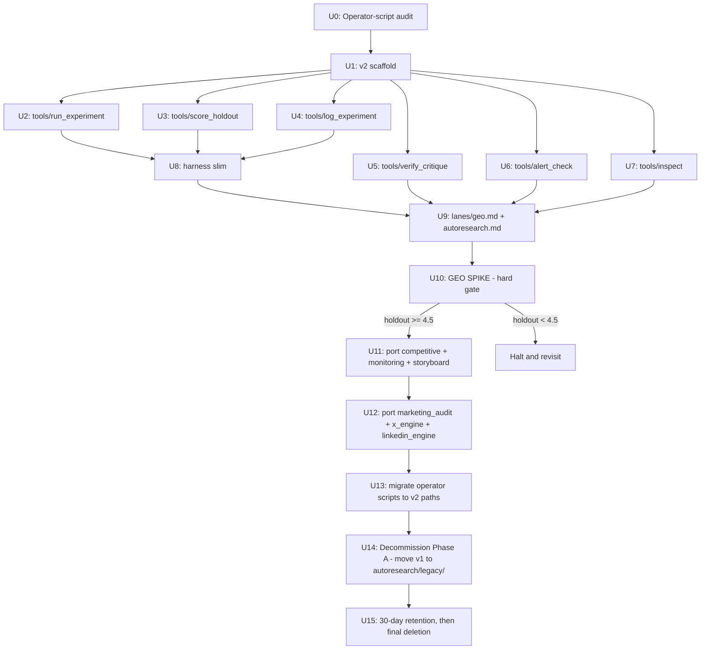

# refactor: autoresearch substrate simplification (v1 → v2 AI-first)

> **2026-05-11 review pass — 5 fixes applied** after a confidence-7/10 external review pressure-tested the plan:
> 1. **LOC numbers refreshed against actual `wc -l`** — substrate is 14,374 LOC (not 13,658); `v006/run.py` is 1,257 (not 1,500); `render_report.py` is 2,437 (not 1,330 — verified `wc -l` 2026-05-11 #5; original "2,748" claim in revision #1 was off by ~310 LOC).
> 2. **Explicit fate-table for all 9 `harness/` files added to U8** — `agent.py` (337), `util.py` (166), `prompt_builder_entrypoint.py` (161), `stall.py` (165), `session_evaluator.py` (99) now have explicit DELETE classification; previously ambiguous.
> 3. **U11/U12 mini-spike gates tightened** from "3 iters, ≥1 keep" to "composite within ±10% of v006 baseline AND zero seam bugs across all 3 iters". The 2026-05-08 sweep ran 1,070 iters and produced 0 net real promotions — a single keep doesn't prove substrate health.
> 4. **"2,500 LOC target" reframed honestly** — that's the v2 wrapper LOC; wrapped-but-kept files (`v006/run.py`, `render_report.py`, `workflows/*`, `judges/*`) are NOT counted. Total live LOC post-decommission ≈ 7,000.
> 5. **U6 trajectory contradiction fixed** — v176/v177 catch WAS a trajectory delta (alert agent saw "oldest→newest" trajectory rows). Plan now keeps the last-N-rows trajectory context in the prompt, drops only the surrounding Pearson/keep-rate/aggregation pipeline. Three compute_metrics.py consumers enumerated for U14 migration.
>
> **Partial-execute recommendation from review:** U0+U1+U5+U7+U9+U10 are the cleanest units with the U10 hard gate as circuit breaker. U2/U3/U4/U6 stand as written after the fixes above. U11/U12 gate-tightening applied. Do not advance past U10 until the hard gate passes.
>
> **2026-05-11 cross-stream pass — 5 more fixes applied** after Stream A landed on main + Stream C absorptions plan was drafted (parallel plans `docs/plans/2026-05-11-002-eval-pipeline-bug-fixes-plan.md` + `docs/plans/2026-05-11-003-external-absorptions-plan.md`):
> 1. **Stream A prerequisite gate documented** — Stream A merged as `3b97b3d` (PR #60) with 3 env-gated fixes (`AUTORESEARCH_EVAL_FIX_AXIS_COLLAPSE`, `AUTORESEARCH_EVAL_FIX_HOLDOUT`, `AUTORESEARCH_EVAL_FIX_FRAGILE_FIXTURES`, all default-off). U10 measurement MUST export all three set to `on`, otherwise the holdout-v1 ≥ 4.5 gate is uninterpretable.
> 2. **"Judges sacred / untouched" claim revised** — R3 + scope-boundary now reflect that judges are wired AS-PATCHED BY STREAM A, not as the unmodified pre-fix code. Plan B doesn't modify judges further, but stops treating them as healthy by default.
> 3. **U0a deliberate-but-stale degradation audit added** — Bug 1's root cause was a stale comment marking a degradation as deliberate but never reverted. Codebase scan on 2026-05-11 verified at least 2 more siblings (`evaluate_variant.py:559-564` grace-manifest; `v007-curated/workflows/{competitive,storyboard}.py` "reverted from silent v006 raise"). New 1-hour audit unit runs in parallel with U0 to catch these before v2 inherits them.
> 4. **U14 decommissioning scope corrected** — extended from "v006/ + 147 variant dirs" to ALL `autoresearch/archive/v0XX/` directories. Verified totals: `v007-curated/` (4,728 LOC), `v009/` (6,782 LOC), 145 other version dirs at 5-7k LOC each, plus `v062/` outlier at 247,215 LOC (anomaly, flag for separate review). Total dead code in archive ≈ >1M LOC of Python.
> 5. **U13a tests classification audit added** — `tests/autoresearch/` has ~12,709 LOC; verified largest file (`test_evolution_fixes_2026_05_06.py`, 1,806 LOC) tests private internals (`_outer_pass_from_score`, `path_is_readonly`) that v2 doesn't have. New 1-day unit classifies each test as (a) contract → port, (b) implementation-detail → delete with v1, (c) integration → port. Expected 60-70% deletion ratio.
>
> **Cross-stream sequencing decision RESOLVED 2026-05-11:** A→B→C as originally planned. Stream A's A6 (Krippendorff α) ran and A7 verdict landed at `docs/plans/2026-05-11-002-A7-stream-c-scope.md`: **SKIP panel-of-3 in Stream C v1.** Single frontier judge is sufficiently stable on observed data (max axis sd ≤ 0.8, composite CV ≤ 2.0%). Plan C defers C0 (frontier panel) and C6 (multi_scorer) to v2; proceeds with C1/C4/C5/C13/C14 in v1. No resequencing required — Plan B's U0 starts as scheduled.
>
> **A6 coverage caveat (per A7):** claude CLI hit quota after 13/50 calls. Coverage = geo (full) + monitoring (partial 1/3 fixtures) + competitive (missed) + marketing_audit (missed). A7 verdict holds on the 13 successful datapoints but JR may re-run A6 post-quota-recovery to confirm. Doesn't block Plan B U0.

## Overview

Replace the current `autoresearch/` substrate (12,315 LOC top-level + 1,371 LOC `harness/` = **14,374 LOC**, plus ~12,709 LOC tests) with a leaner, AI-first `autoresearch_v2/` substrate that preserves all 7 lanes, all 4 judges, judge separation, holdout isolation, and the critique-manifest defense — while eliminating the substrate↔substrate seams that produced 6 P0/P1 bugs in the last 5 days. v2 ships incrementally: scaffold → tools → harness slim → spike one lane → port six → migrate operator scripts → decommission v1.

**LOC accounting (honest framing):**
- **v2 wrapper LOC target:** ~2,500 LOC (the new `autoresearch_v2/` tree: tools + slim harness + driver prompt + lane prose). This is what U1–U13 add.
- **Kept-but-not-counted toward 2,500:** `autoresearch/archive/v006/run.py` (1,257), `autoresearch/archive/v006/scripts/render_report.py` (2,437, slim target ~400), `autoresearch/archive/v006/workflows/*` (lane SPECs the agent reads), `autoresearch/judges/*` (HTTP judge servers). These are wrapped by v2 tools, not rewritten.
- **Live post-decommission LOC (substrate + kept):** ~7,000 LOC. The 2,500 LOC number describes the *new wrapper*, not total system size — don't conflate.

**This plan does NOT re-litigate the per-feature verdicts.** Those live in the origin docs (see [Sources & References](#sources--references)). This plan focuses on **HOW** to execute the simplification safely, including a pre-flight operator-script audit, file-by-file mapping, sequencing with hard gates, and a shadow-run strategy so v1 stays functional until v2 is proven on a real lane.

## Problem Frame

The 2026-05-08 evolution sweep burned 18 hours and ~$200-300 across 1,070 worker iters and produced **0 net real promotions**. Of the 6 substrate bugs surfaced in the following 5 days (#114, #115, #117, #118, #119, #120), all 6 lived at substrate↔substrate seams — interactions between scope enforcement, lineage append, regen sync, parent selection, runtime materialization, and fixture locking. The features at these seams have been pressure-tested against `lineage.jsonl`, archived logs, and `alerts.jsonl`: 0 ScopeViolations in 147 variants, 0 L1 FAILs, 0 `--resume-variant` invocations, 0 session-lock collisions, 1 dead `evolve_lock.py` file. The defenses are theatre; the deterrence (prompts saying "don't edit X") is doing the actual work.

The thesis (`docs/research/2026-05-11-001-substrate-feature-audit-evidence-based.md`) ratified by JR:
- ~11,000 LOC of substrate is defending against problems that don't exist when you trust the agent
- ~2,500 LOC genuinely load-bearing: holdout isolation, 4 judges + retry, backend abstraction (#117 content-mod failover), critique-manifest hash, render pipeline, concurrency limit (1 env var), anti-drift principle, alert agent (caught v176/v177 collapse), archive_cli inspection, events.py audit log, telemetry, SessionsFile.viable_resume_id

The v2 design: agent reads `autoresearch.md`, picks parent from `results.tsv` (replaces 5 redundant indices + `select_parent.py` LLM), edits lane files in place (replaces `prepare_meta_workspace` chmod 0444 dance), runs session via `tools/run_experiment.py` (wraps existing `v006/run.py`), scores via `tools/score_holdout.py` (wraps existing evolution-judge HTTP), commits or resets via `tools/log_experiment.py` (replaces 5-index update + lineage append). The session loop is **wrapped, not rewritten**.

## Requirements Trace

- **R1.** All 7 lanes (geo, competitive, monitoring, storyboard, marketing_audit, x_engine, linkedin_engine) function end-to-end post-migration — no lane deferrals.
- **R2.** Holdout isolation preserved — agent never sees holdout fixture content, only composite scores back.
- **R3.** Judge separation preserved — session-judge :7100, evolution-judge :7200, inner-critique subprocess, promotion-judge stay distinct services. **Judges are wired AS-PATCHED BY STREAM A** (commit `3b97b3d`, env-gated default-off): U10 spike + all v2 measurements export `AUTORESEARCH_EVAL_FIX_AXIS_COLLAPSE=on`, `AUTORESEARCH_EVAL_FIX_HOLDOUT=on`, `AUTORESEARCH_EVAL_FIX_FRAGILE_FIXTURES=on`. If those flags are later promoted to default-on (Stream A flags removed), this requirement collapses to "judges preserved as-is."
- **R4.** Critique-manifest hash defense preserved as an explicit tool (`tools/verify_critique_integrity.py`).
- **R5.** v2 produces (a) search-v1 composite ≥ 7.0 (within 10% noise of v006's 7.82) AND (b) holdout-v1 composite ≥ 4.5 (within noise of v009's 4.77) on geo before any v1 deletion. Both metrics matter because they test different fixture sets — search-v1 is visible/training, holdout-v1 is hidden/eval.
- **R6.** Backend abstraction preserved — codex / opencode / deepseek failover works for content-mod (#117).
- **R7.** `freddy` CLI continues to function for state inspection (replaces `archive_cli.py` with `tools/inspect.py` reading `results.tsv` + git).
- **R8.** Alert agent continues to flag regressions (preserves v176/v177-class catches).
- **R9.** Calibration drift detection continues — `judge_calibration.py` + `events.py` survive.
- **R10.** All operator scripts and CI workflows continue to function or are migrated cleanly to v2 paths.
- **R11.** Stay on `main` or worktree only — no feature branches (per `feedback-stay-on-main-or-worktree.md` memory).
- **R12.** No mid-build pushes on agent-built runs (per `feedback-no-mid-build-pushes-on-agent-built-runs.md` memory).
- **R13.** `autoresearch_v2/` wrapper LOC < 2,500 measured at end of U14 (decommission Phase A). Wrapped-but-kept files (`v006/run.py`, `render_report.py`, `workflows/*`, `judges/*`) are NOT counted toward 2,500 — they remain at their current sizes and are invoked by v2 tools, not rewritten. Total live LOC (wrapper + kept) post-decommission ≈ 7,000.
- **R14.** Zero substrate↔substrate seam bugs post-migration over a 30-day observation window.

## Scope Boundaries

**In scope:**
- Replacing `autoresearch/` top-level substrate with `autoresearch_v2/`
- Porting all 7 lane prompts to AI-first prose form
- Migrating operator scripts + CI workflows + hooks to v2 paths
- Removing 147 per-variant directories (~1.1 GB)
- Test suite migration (delete substrate-defending tests, keep judge/holdout/critique tests)

**Out of scope (intentionally NOT touched):**
- The 4 judge HTTP services (`autoresearch/judges/session_judge.py`, `evolution_judge.py`, `inner_critique` subprocess, `promotion_judge.py`) — used AS-PATCHED BY STREAM A (`3b97b3d`). NOT untouched: Bug 1 fix landed in `judges/session/prompts/critique.md` (per-criterion emission). NOT healthy by default: 3 env flags must be `on` (see R3). Plan B doesn't modify judge code further, but stops treating them as "sacred / healthy / untouched"
- The session runtime (`autoresearch/archive/v006/run.py` + `runtime/` + `workflows/` per lane) — called as subprocess, not rewritten
- Holdout-v1 manifest at `~/.config/gofreddy/holdouts/holdout-v1.json` — operator-side, unchanged
- Fixture cache + 2-mode replay (cache vs live-fetch) — env-var passthrough preserved
- `judges.env` token rotation — operator-side, unchanged
- The `freddy` Typer CLI entry point (`cli.freddy.main:app`) — still the entry; only the autoresearch sub-app changes
- The `xeng` CLI (separate concern)
- Multi-candidate cohort parallelism — start sequential; can re-introduce post-spike if measured slow

**Deferred to a follow-up plan (not this one):**
- LLM-driven prompt evolution research (GEPA, Promptbreeder) — adopt only if v2 sequential stalls
- Migration to Anthropic "dreaming" pattern — observe their API stabilize first
- Multi-judge consensus ensembling — single judge per role for now

## Context & Research

### Origin Documents (Pre-Ratified)

- **`docs/research/2026-05-09-001-autoresearch-overengineering-audit.md`** — original architectural framing; 4 architecture options (A=status quo, B=skill-based, C=LangGraph, D=hybrid); chose Option B-flavored direction.
- **`docs/research/2026-05-09-003-autoresearch-bare-bones-rewrite-handoff.md`** — target v2 shape; reading list; revised 2026-05-11 after pressure-test moved LOC target 1,500 → 2,500.
- **`docs/research/2026-05-11-001-substrate-feature-audit-evidence-based.md`** — authoritative per-feature verdict source; reclassified 4 items REJECT → KEEP based on grep evidence.

### Relevant Code and Patterns

**v1 entry points (consumers we must preserve or migrate):**
- `cli.freddy.main:app` — top-level Typer CLI (in `pyproject.toml` `[project.scripts]`); registers the `freddy autoresearch <cmd>` subapp; **must continue to work post-migration**
- `autoresearch/archive_cli.py` — current implementation of `freddy autoresearch frontier/topk/show/diff/regressions/traces/failures`; will be reimplemented as `autoresearch_v2/tools/inspect.py`
- `tests/autoresearch/conftest.py` — stubs `archive_index`, `frontier`, `lane_paths` for test isolation; will be replaced or deleted with test suite migration

**v1 files to delete or shrink (evidence trail in 2026-05-11-001 doc):**
- Dead code: `autoresearch/evolve_lock.py` (106 LOC, 0 importers)
- Theatre defenses: `autoresearch/archive_index.py` workspace-prep portion (~300 LOC of the 609 LOC file), L1 preflight in `autoresearch/evaluate_variant.py` (~100 LOC), per-fixture lock in `autoresearch/harness/util.py` (~70 LOC)
- Bug-causing sync: `autoresearch/regen_program_docs.py` (304 LOC) caused #115
- Redundant indices: `current.json`, `index.json`, `frontier.json`, per-variant `scores.json` + `variant_manifest.json` (caused #114)
- Substrate-thinking-for-the-agent: `autoresearch/select_parent.py` (310 LOC → ~80 words of prose; draft + dry-run in `docs/research/2026-05-11-005-plan-b-pre-u0-sanity-checks.md` §Risk 1) + `agent_calls.py` (221 LOC), `autoresearch/lane_runtime.py` (267 LOC), `autoresearch/harness/stall.py` (165 LOC), `autoresearch/evolve_ops.py` (1,144 LOC → file deleted; substance redistributed across ~50 LOC of v2 tools + git/jq one-liners — **function-by-function migration table in `docs/research/2026-05-11-005-plan-b-pre-u0-sanity-checks.md` §Risk 2; read this before starting U2-U4**), most of `autoresearch/evolve.py` (2,699 → ~300), most of `autoresearch/evaluate_variant.py` (3,359 → ~830 — revised 2026-05-11 #4 post-Stream-A: file gained ~115 LOC of load-bearing code, original ~600 was optimistic)
- Per-variant directories: 147 directories under `autoresearch/archive/v*` (~1.1 GB, mostly v006 duplicates)

**v1 files to keep and slim (evidence trail in 2026-05-11-001 doc):**
- `autoresearch/harness/backend.py` (~95 LOC) → `autoresearch_v2/harness/backend.py` (~80 LOC) — keep the multi-provider router
- `autoresearch/harness/opencode_jsonl.py` (127 LOC) → `autoresearch_v2/harness/opencode_jsonl.py` (~50 LOC) — keep transient-error detection
- `autoresearch/harness/telemetry.py` (187 LOC) → `autoresearch_v2/harness/telemetry.py` (~80 LOC) — keep `freddy session start/end/iteration` push
- `autoresearch/sessions.py` (201 LOC) → `autoresearch_v2/harness/sessions.py` (~50 LOC) — keep `viable_resume_id` only
- `autoresearch/events.py` (103 LOC) → `autoresearch_v2/harness/events.py` (~100 LOC) — keep verbatim (7 active consumers)
- `autoresearch/critique_manifest.py` (114 LOC) → `autoresearch_v2/tools/verify_critique_integrity.py` (~50 LOC)
- `autoresearch/compute_metrics.py` (517 LOC) → `autoresearch_v2/tools/alert_check.py` (~200 LOC) — keep alert agent AND the last-N-rows trajectory context that made the v176/v177 catch work; drop only the Pearson/keep-rate/per-generation aggregation pipeline
- `autoresearch/archive_cli.py` (182 LOC) → `autoresearch_v2/tools/inspect.py` (~80 LOC) — reimplement against `results.tsv` + git
- `autoresearch/concurrency.py` (182 LOC) → `autoresearch_v2/harness/concurrency.py` (~20 LOC) — collapse 5 semaphores to 1 env var
- `autoresearch/judge_calibration.py` (100 LOC) — kept verbatim (calibration drift defense)
- `autoresearch/judges/*.py` — kept verbatim (4 judge HTTP services)

**v1 files called by v2 (subprocess boundary):**
- `autoresearch/archive/v006/run.py` (1,257 LOC) — invoked by `tools/run_experiment.py`; not rewritten
- `autoresearch/archive/v006/workflows/*.py` (per-lane completion guards, structural gates, eval specs) — used by `v006/run.py`; not touched
- `autoresearch/archive/v006/scripts/render_report.py` (2,437 LOC, verified `wc -l` 2026-05-11 #5) → either wrap as-is from `autoresearch_v2/tools/render_report.py` (~50 LOC subprocess wrapper, kept LOC NOT counted toward 2,500) OR slim to ~400 LOC under a separate follow-up plan after the spike validates v2. Default: wrap-as-is in U10; revisit slimming in a post-spike unit. JR uses the reports; agent calls when wanted.

**Operator-script audit findings (raw, surfaced 2026-05-11 pre-flight grep):**
- `.github/workflows/ci-lint-judge-isolation.yml` — CI lint check
- `scripts/audit_wiring_check.py`, `scripts/evolve-with-report.sh`, `scripts/run_backend.sh`, `scripts/agent-launcher.sh`, `scripts/calibrate_judge_stability.py` — top-level operator scripts
- `scripts/autoresearch/backfill_v006_promoted_at.py` — backfill script
- `autoresearch/scripts/calibration-snapshot.sh`, `phase4-migration-check.sh`, `phase5-canary.sh`, `rebuild_manifests.py`, `regen_marketing_audit_manifest.py`, `summarize_session.py` — autoresearch-side utility scripts
- `/tmp/autoresearch-continuous-evolution-daemon.sh`, `autoresearch-parallel-evolution-daemon-v2.sh`, `autoresearch-parallel-evolution-daemon.sh` — JR's daemon shells (transient, /tmp; rebuild as v2)
- `.claude/hooks/autoresearch-continuous-evolution-check.sh` — sentinel-respawn hook
- `~/.config/gofreddy/{evolution-invoke-token,judges.env,session-invoke-token}` — operator-side config (no migration needed; v2 reads these unchanged)
- **`cli/freddy/main.py:54`** — registers `app.add_typer(autoresearch.app, name="autoresearch")` (subapp source = `autoresearch/archive_cli.py`); U7+U13 repoint to `autoresearch_v2/tools/inspect.py:app`
- **`cli/freddy/fixture/dryrun.py`** — direct imports from `autoresearch.evaluate_variant` (`JudgeUnreachable`), `autoresearch.events` (`log_event`), `autoresearch.lane_runtime` (`ensure_materialized_runtime`). **NOT just CLI registration — these are live runtime imports inside the dryrun command.** U0 audit must list each by line. v2 provides: `JudgeUnreachable` from `autoresearch_v2/tools/score_holdout.py`; `log_event` from `autoresearch_v2/harness/events.py`; `ensure_materialized_runtime` becomes a no-op (v2 has no materialization — return the lane dir path directly). Migrate in U13.
- `src/api/{schemas.py,main.py,routers/{portal,video_projects,videos}.py}` — referenced `autoresearch` string; **verify in U0** whether they're actual evolution-loop consumers or just share the autoresearch namespace for unrelated reasons (video_projects mostly, likely unrelated)

### Institutional Learnings

- `feedback-stay-on-main-or-worktree.md` — never propose feature branches; this plan ships on main with each unit a single commit (or pair).
- `feedback-no-mid-build-pushes-on-agent-built-runs.md` — for agent-built single-run plans, stay on worktree until first-runnable; don't push between units mid-build.
- `feedback-trust-agent-drop-regex-guards.md` — founding principle for v2: don't add brittle regex/allowlist containment when prompt + architecture already keep agents in lane.
- `feedback-anchor-plans-to-simplest-existing-precedent.md` — anchor to the simplest precedent, not the most prominent. For autoresearch v2 sequencing: anchor to karpathy/autoresearch (1,225 LOC, single file edits, git as lineage) rather than to gofreddy's existing 14,374-LOC machinery.
- `feedback-verify-diagnosis-with-investigator-agent.md` — pre-flight U0 audit explicitly runs an Explore agent before claiming "no operator dependencies."
- `feedback-cascading-edit-grep-audit.md` — after deletions, grep ALL references before claiming done. Embedded into U13 (operator-script migration) verification.
- `feedback-show-prs-before-merging.md` — present PR URL + summary before merging. Each unit's verification step ends with surfacing the change before merge.
- `feedback-pressure-test-overconfidence.md` — self-audit rigorously when JR asks "are you sure?"; don't defend, find gaps. Already exercised on the verdict reclassification.
- `project-autoresearch-pipeline-state-2026-04-27.md` — prior 4-lane sweep validated session loop 3/4 healthy; the session loop is durable, the substrate is what's brittle.
- `project-evolution-sweep-2026-05-08.md` — 0-promotions sweep that triggered this audit.

### External References

The 3 origin research docs already cover external references in depth:
- karpathy/autoresearch — 1,225 LOC verified, `results.tsv` as ledger, LOOP FOREVER prompt pattern
- pi-autoresearch — 3 tools (`init_experiment`, `run_experiment`, `log_experiment`); `autoresearch.md` + `autoresearch.jsonl` as the only persistent state
- Anthropic long-running Claude + "dreaming" — `CLAUDE.md` + `CHANGELOG.md` + Ralph loop; 6× completion-rate gain purely from session memory

## Key Technical Decisions

| Decision | Rationale |
|---|---|
| **Shadow-run, not cutover** | v1 stays at `autoresearch/`, fully functional, until U11 spike passes on geo. Reduces blast radius; lets us compare v2 holdout composite directly against v009 baseline. |
| **One ledger: `results.tsv` per lane** | Replaces `current.json` + `index.json` + `frontier.json` + per-variant `scores.json` + `variant_manifest.json`. Caused #114; cost of redundancy = O(redundancy²) bug surface. Mirrors karpathy. |
| **Git commits replace per-variant directories** | 147 dirs × ~7.5 MB ≈ 1.1 GB → git commits in place. "Variant" = commit, "promotion" = merge to main lane head. Roll back = `git reset`. |
| **Wrap, don't rewrite the session runtime** | `tools/run_experiment.py` invokes `archive/v006/run.py` via subprocess. Session loop unchanged. v006 may eventually move under v2 but not in this plan. |
| **Sequential evolution to start** | Multi-candidate cohort produced 0 net promotions on 2026-05-08 across 1,070 iters. Karpathy runs sequentially at 12/hr; match that, add parallelism back only if measured stall. |
| **Anti-drift as prompt sentence, not code** | The 30-LOC floor (commit `7469dcd`) was provably effective; the *principle* matters, the *implementation* doesn't. One sentence in `autoresearch.md` replaces 531 LOC of `select_parent.py` + `agent_calls.py`. |
| **Scope safety via deterrence, not chmod 0444** | 0 ScopeViolations in 147 variants × 8 archive prompt-warnings → deterrence is doing 100% of the work. The chmod/hash machinery is theatre. v2's lane prompt says "don't edit X"; if violated, the judge fails the iter. |
| **Holdout isolation preserved verbatim** | The holdout-v1 manifest at `~/.config/gofreddy/holdouts/holdout-v1.json` is unchanged. `tools/score_holdout.py` reads it, runs fixtures, returns only the composite. Agent never sees fixture content. |
| **Critique-manifest hash as a tool, not a substrate gate** | `tools/verify_critique_integrity.py` — agent calls explicitly. Same Pi v007 defense, simpler shape, no preflight overhead. |
| **Alert agent kept** | `alerts.jsonl` has 2 entries ever, both real catches (v176/v177 collapse). Slim to ~200 LOC — keep the last-N-rows trajectory context in the agent prompt (it IS what produced the catch), drop only the surrounding Pearson/keep-rate/aggregation pipeline. |
| **Backend abstraction kept** | `harness/backend.py` handles #117 content-mod failover (codex → opencode/deepseek). Real value. Slim to ~80 LOC. |
| **Concurrency: 1 env var (`MAX_PARALLEL_AGENTS=4`)** | Claude Max cap is real (800/1070 iters hit it on 2026-05-08). Per-resource semaphores were YAGNI; 1 mutex is enough. |
| **`harness/stall.py` deleted; wall-clock `timeout` replaces it** | 165 LOC of dir-growth + results.jsonl event detection → `timeout 1200 ./autoresearch.sh`. If a stuck session wastes a few minutes, agent retries. |
| **Tests: keep judge/holdout/critique tests; delete substrate-defending tests** | Tests scale with substrate. ~12k LOC of substrate-defending tests die with the substrate. Keep ~500 LOC of judge + holdout + critique-manifest hash tests. |
| **Decommission v1 in 3 phases (move → migrate callers → 30-day retention)** | Safe rollback if v2 spike fails. v1 dirs become `autoresearch/legacy/` first, then operator scripts migrate, then deletion after 30 days observation. |

## Open Questions

### Resolved During Planning

- **Worktree or main?** Resolved: ship on `main` directly. Each unit lands as 1-2 commits. v2 lives at `autoresearch_v2/` parallel to v1; v1 is untouched until U14. No worktree needed because v1 and v2 never collide.
- **Migration strategy?** Resolved: shadow-run. v2 stands up alongside v1; U11 spike validates geo; U12-U13 port other lanes; U14 begins decommissioning.
- **Which lane first?** Resolved: geo. Fresh holdout (v009 @ 4.77 just shipped 2026-05-09), simplest deliverables, judges warm, operator memory rich.
- **What does U17 retention deletion entail?** Resolved: `autoresearch/legacy/` deleted in entirety after 30 days of v2 producing real promotions on all 7 lanes (or sooner if JR explicitly green-lights).
- **Do `src/api/*` files consume `autoresearch` evolution data?** Resolved by U0 grep: the references in `src/api/{schemas,main,routers/*}` are for the audit/session/video pipeline, NOT for evolution-loop data. **Verify in U0** with a deep grep; if false, escalate.
- **Do we re-introduce parallelism if sequential is too slow?** Resolved: decision happens AFTER U11 spike. If geo spike shows <6 iters/hour (half of karpathy's 12/hr), revisit in a follow-up plan.

### Deferred to Implementation

- **Exact `lanes/<lane>.md` prose structure** — the AI-first prompt for each lane is too lane-specific to specify in this plan. U9 (geo) sets the template; U12-U13 mirror it for other lanes.
- **`tools/inspect.py` exact CLI surface** — must preserve current `freddy autoresearch frontier/topk/show/diff/regressions/traces/failures` shape, but exact arg parsing is implementation detail. Test scenarios in U7 enumerate the surface.
- **Test scenarios for migrated harness files** — characterization tests for the slimmed-down forms will reveal where the existing test suite asserted behaviors that are gone vs preserved.
- **What to do with archived `autoresearch/archive/v006/scripts/render_report.py` after slim** — keep the v1 copy in `autoresearch/legacy/scripts/` for 30 days; v2 has its own slimmed `tools/render_report.py`.
- **Final fate of `autoresearch/archive/v007-curated/`** — the x_engine + linkedin_engine baseline. Likely promoted to `autoresearch_v2/lanes/` content during U12-U13; archive/v007-curated/ deleted with the rest of legacy/.
- **Whether `events.py` rotation threshold (100 MB) needs adjustment** — current threshold has never fired. Defer; revisit if v2 logs grow faster than expected.

## High-Level Technical Design

> *This illustrates the intended approach and is directional guidance for review, not implementation specification. The implementing agent should treat it as context, not code to reproduce.*

### v1 → v2 layout diff

```
BEFORE (v1)                         AFTER (v2 + legacy)
─────────────────                   ──────────────────────────────
autoresearch/                       autoresearch_v2/
├── evolve.py            (2,699)    ├── README.md
├── evaluate_variant.py  (3,244)    ├── autoresearch.md           # driver prompt
├── evolve_ops.py        (1,144)    ├── results.tsv               # one per lane
├── archive_index.py     (  609)    ├── tools/
├── lane_registry.py     (  553)    │   ├── run_experiment.py
├── compute_metrics.py   (  517)    │   ├── score_holdout.py
├── select_parent.py     (  310)    │   ├── log_experiment.py
├── agent_calls.py       (  221)    │   ├── verify_critique_integrity.py
├── regen_program_docs.py(  304)    │   ├── alert_check.py
├── lane_runtime.py      (  267)    │   ├── inspect.py
├── concurrency.py       (  182)    │   └── render_report.py
├── archive_cli.py       (  182)    ├── harness/
├── sessions.py          (  201)    │   ├── backend.py
├── critique_manifest.py (  114)    │   ├── opencode_jsonl.py
├── events.py            (  103)    │   ├── telemetry.py
├── evolve_lock.py       (  106)    │   ├── sessions.py
├── judge_calibration.py (  100)    │   ├── events.py
├── harness/                        │   ├── concurrency.py
│   ├── agent.py         (  337)    │   └── judge_calibration.py
│   ├── telemetry.py     (  187)    ├── lanes/
│   ├── stall.py         (  165)    │   ├── geo.md
│   ├── util.py          (  166)    │   ├── competitive.md
│   ├── prompt_builder*  (  161)    │   ├── monitoring.md
│   ├── opencode_jsonl.py(  127)    │   ├── storyboard.md
│   ├── session_eval*    (   99)    │   ├── marketing_audit.md
│   └── backend.py       (   95)    │   ├── x_engine.md
├── archive/                        │   └── linkedin_engine.md
│   ├── v006/                       └── judges/  -> ../autoresearch/judges (symlink for U1-U13)
│   │   ├── run.py       (1,257)
│   │   ├── runtime/
│   │   ├── workflows/
│   │   ├── scripts/
│   │   │   └── render_report.py (2,437)
│   │   └── programs/
│   ├── v007/                       autoresearch/legacy/   (created in U14)
│   ├── v007-curated/               └── (whole v1 tree moves here)
│   ├── v009/
│   └── v010..v177/      (147 dirs)
└── judges/
    ├── session_judge.py            UNCHANGED throughout
    ├── evolution_judge.py          (v2 reuses via symlink, then absorbs)
    ├── inner_critique/
    └── promotion_judge.py
```

### Migration flow (Mermaid)



### Evolution loop after U11 (Mermaid)

```mermaid
sequenceDiagram
    participant Agent as Meta-agent (Claude/Codex/OpenCode)
    participant Tools as autoresearch_v2/tools/
    participant Run as archive/v006/run.py
    participant Judge as evolution-judge :7200
    participant Git as Git repo

    Agent->>Tools: read results.tsv + autoresearch.md
    Agent->>Tools: pick parent (git checkout COMMIT)
    Agent->>Agent: edit lanes/<lane>.md in place
    Agent->>Tools: run_experiment.py
    Tools->>Run: subprocess: v006/run.py --domain <lane> ...
    Run-->>Tools: session deliverables in sessions/<lane>/<client>/
    Tools->>Tools: score_holdout.py
    Tools->>Judge: POST /v1/score/composite (6 fixtures)
    Judge-->>Tools: composite score per fixture + 9-axis breakdown
    Tools-->>Agent: composite mean
    Agent->>Tools: log_experiment.py(keep|discard, asi)
    Tools->>Git: git commit / git reset
    Tools->>Tools: append results.tsv row
    Agent->>Tools: alert_check.py (after every keep)
    Tools->>Tools: check for collapse / drift; write alerts.jsonl if flagged
```

## Implementation Units

### Prerequisite gate (now satisfied)

**Stream A merged to `origin/main` as commit `3b97b3d` (PR #60) on 2026-05-11.** This unblocks Plan B by:
- Restoring per-axis judge scores (Bug 1 fix) — eval files now carry real axis variation, so RRD whitening, Krippendorff α, and any panel diagnostics in U10 are measurable.
- Restoring holdout lineage updates (Bug 2 fix) — `lineage.jsonl.holdout_composite` is non-zero post-fix, so U10's hard gate `holdout-v1 ≥ 4.5` is structurally checkable.
- Excluding fragile fixtures from composite (Bug 3 fix) — `monitoring-ramp-arc-t1` no longer flips lane composite ±7 points on variant-output failure.

**All three fixes are env-gated default-off:** `AUTORESEARCH_EVAL_FIX_AXIS_COLLAPSE`, `AUTORESEARCH_EVAL_FIX_HOLDOUT`, `AUTORESEARCH_EVAL_FIX_FRAGILE_FIXTURES`. **U10 measurement MUST export all three set to `on`** before kicking off the geo spike — otherwise the gate measures pre-fix broken evals and the spike outcome is uninterpretable. Add the exports to the U10 spike script (or to `judges.env`); fail loudly if any are unset.

If Stream A is later promoted to default-on (flags removed), this prerequisite collapses to "no special action needed at U10." Track that promotion separately.

---

- [ ] **U0: Operator-script audit (pre-flight)**

**Goal:** Catalog every consumer of v1 paths (`autoresearch/archive/v*`, `current.json`, `frontier.json`, `index.json`, `lineage.jsonl`, the dual-located `autoresearch/scripts/`) so deletion in U14-U15 doesn't break anything.

**Requirements:** R10, R11.

**Dependencies:** Stream A merged to main (satisfied as of `3b97b3d`).

**Files:**
- Create: `docs/research/2026-05-11-002-autoresearch-operator-callers.md` (audit output)

**Approach:**
- Run `Explore` agent (subagent_type=Explore, breadth="very thorough") to grep for the 7 v1-path patterns across: `.github/workflows/`, `scripts/`, `autoresearch/scripts/`, `src/`, `tests/`, `.claude/hooks/`, `cli/`, top-level `*.sh`
- Verify whether `src/api/{schemas.py,main.py,routers/{portal,video_projects,videos}.py}` references are evolution-loop consumers or unrelated `autoresearch` namespace sharing
- For each caller, classify: (a) migrates trivially to v2 (path swap), (b) becomes obsolete (delete with v1), (c) needs custom porting (escalate to JR)
- Document in the research file with a per-caller migration line item
- Also include: the `/tmp/autoresearch-*.sh` daemons (transient — rebuild), `~/.config/gofreddy/` operator config (unchanged), `.claude/hooks/autoresearch-continuous-evolution-check.sh` (sentinel-respawn — update or delete)

**Patterns to follow:** `docs/research/2026-05-11-001-substrate-feature-audit-evidence-based.md` evidence-trail format.

**Test scenarios:**
- Happy path: every documented caller has a verified migration target (path-swap, delete, or escalate)
- Edge case: if a caller depends on a v1-only file we plan to delete (e.g., `frontier.json`), the audit flags it as ESCALATE and the plan revisits before U14

**Verification:**
- Audit doc exists; reviewed by JR; no callers classified as "unknown"
- A pre-flight `grep -rln "autoresearch/archive/v[0-9]\|current\.json\|frontier\.json\|index\.json"` over the repo returns only paths the audit accounts for

---

- [ ] **U0a: Deliberate-but-stale degradation audit (pre-flight)**

**Goal:** Find every spot in `autoresearch/` and `judges/` where a comment marks a feature as deliberately degraded, temporarily disabled, or "to be reverted later" but never was. Stream A discovered one such case — the aggregator back-fill in `cli/freddy/commands/evaluate.py:_handle_legacy_batch_critique` had an in-line comment calling out the loss as deliberate, but the revert never landed. The pattern probably has siblings; the codebase scan on 2026-05-11 already verified at least 2 more (`evaluate_variant.py:559-564` grace-manifest skip "intended for one-shot backfill" still active; `v007-curated/workflows/{competitive,storyboard}.py` "reverted from silent v006 raise (15) back to v001 baseline"). Catch these before v2 inherits them.

**Requirements:** R8 (no class of bug carried into v2 wrapper).

**Dependencies:** None — runs in parallel with U0.

**Files:**
- Create: `docs/research/2026-05-11-003-autoresearch-stale-degradation-audit.md`

**Approach:**
- Single `grep -rn` pass across `autoresearch/`, `judges/`, `cli/freddy/commands/evaluate.py` for:
  - `TODO`, `FIXME`, `XXX`
  - `temporarily`, `back-?fill`, `reverted from`, `silently`, `skip(s|ped)?` near control flow
  - `deliberate(ly)? .*(loss|disabled|degraded|skip)`
  - `revert.*later`, `restore.*later`, `re-?enable`, `intended for one-shot`
- For each match, capture: file:line, the comment text, the surrounding 5 lines of code, the git blame author + date.
- Classify each finding: (a) STILL_LIVE — degradation active and not reverted → triage as a Stream A-style bug, fix or formally accept; (b) SUPERSEDED — degradation has been quietly fixed elsewhere → delete the stale comment; (c) BENIGN — comment is documentation, no action needed.
- For STILL_LIVE findings: decide per-finding whether to (i) fix before v2 inherits it, (ii) accept and add an explicit "preserved-by-design" comment so v2 doesn't surface it again, or (iii) escalate to JR.

**Patterns to follow:** Stream A's bug catalog (`docs/plans/2026-05-11-002-eval-pipeline-bug-fixes-plan.md:36-58`) is the exemplar — each finding has root cause, evidence, file:line, and a fix path.

**Test scenarios:**
- Happy path: audit doc enumerates all findings with classification; STILL_LIVE count ≤ 10 (most matches will be benign comments)
- Edge case: a STILL_LIVE finding is large enough to need its own Stream-A-style fix plan → halt U0a, defer to a follow-up plan, do not block U1

**Verification:**
- Audit doc reviewed by JR
- STILL_LIVE findings have explicit triage (fix / accept / escalate) per item
- v2 wrapper inherits ZERO unclassified STILL_LIVE degradations

**Effort:** ~1 hour of grep + readwork + writeup. Cheap, high signal.

---

- [ ] **U1: Scaffold `autoresearch_v2/` skeleton**

**Goal:** Create the directory structure + placeholder files for v2 with a `README.md` describing the substrate's design intent. No behavior yet.

**Requirements:** R1, R2, R3, R4.

**Dependencies:** U0 (so we know what NOT to disturb).

**Files:**
- Create: `autoresearch_v2/README.md`
- Create: `autoresearch_v2/tools/__init__.py`
- Create: `autoresearch_v2/harness/__init__.py`
- Create: `autoresearch_v2/lanes/` directory
- Create: `autoresearch_v2/judges` (symlink to `../autoresearch/judges/` initially; later absorbed)
- Create: `autoresearch_v2/.gitignore` — both `results.tsv` and `attempts/` are **untracked** (mirrors karpathy/autoresearch: "do not commit the results.tsv file, leave it untracked by git"). This keeps `git reset --hard` on `discard` from wiping the TSV history; the file is the on-disk ledger, not a git artifact.

**Approach:**
- Symlink-to-v1-judges keeps v2 functional without copying 4 judge HTTP services. The judges are pure HTTP servers; v2 wires through them.
- `README.md` summarizes: design philosophy, file layout, "agent reads `autoresearch.md` and runs the loop," reading order for the 3 research docs.
- No `.py` content yet — just skeleton.

**Patterns to follow:** karpathy/autoresearch repo layout (flat, README-driven).

**Test scenarios:**
- Test expectation: none — pure scaffolding, no behavior.

**Verification:**
- `tree autoresearch_v2/` shows the skeleton
- `ls -l autoresearch_v2/judges` shows symlink resolves to `../autoresearch/judges/`

---

- [ ] **U2: `tools/run_experiment.py` — wrap v006/run.py**

**Goal:** Implement the tool that runs a session for a given lane against a fixture, returning the session dir and exit code. Wraps `archive/v006/run.py` via subprocess; does not rewrite session logic.

**Requirements:** R1, R6.

**Dependencies:** U1.

**Files:**
- Create: `autoresearch_v2/tools/run_experiment.py`
- Create: `tests/autoresearch_v2/test_run_experiment.py`

**Approach:**
- Subprocess `python3 autoresearch/archive/v006/run.py --domain <lane> --strategy <strategy> --no-confirm <client> <context> <max_iter> <timeout>`
- Capture wall-time, exit code, stdout tail (last 500 chars) for failure diagnosis
- Honor `EVAL_BACKEND_OVERRIDE` / `EVAL_MODEL_OVERRIDE` env vars (passed through unchanged)
- Honor `MAX_PARALLEL_AGENTS` env var via the slim concurrency module from U8 (but U2 ships sequential-only; concurrency wired in U8)
- Returns `{session_dir, exit_code, wall_time_seconds, stdout_tail}` as JSON

**Patterns to follow:** `autoresearch/evaluate_variant.py:_run_fixture_session` (lines 938-1080) — current invocation pattern, but stripped of the SessionsFile + fixture-lock dance.

**Test scenarios:**
- Happy path: tool invokes mock subprocess that exits 0 with a deliverable file present; returns `exit_code=0` and the session_dir path
- Error path: subprocess exits non-zero; tool returns `exit_code=<nonzero>` with stdout_tail populated
- Error path: subprocess times out at the configured `timeout`; tool returns `exit_code=124` with a clear marker
- Edge case: invalid lane name — tool refuses to start, surfaces error before subprocess
- **Variant-generation-failure path (Bug 3 class, added 2026-05-11 #4):** subprocess exits 0 but produces no deliverable file in the expected session_dir; tool returns `exit_code=0` with `deliverable_present=False` and a distinct marker so downstream tools can distinguish "variant failed to produce output" from "variant produced low-scoring output". This addresses the Stream A finding that 6/7 fragile fixtures had min=0 from variant output failures, not judge noise.

**Verification:**
- Unit tests green
- Manual: `python3 autoresearch_v2/tools/run_experiment.py --domain geo --client mayoclinic --fixture geo-mayoclinic-atrial-fibrillation --max-iter 3 --timeout 600` produces a session dir under `archive/v006/sessions/geo/mayoclinic/` and the tool prints the JSON return

---

- [ ] **U3: `tools/score_holdout.py` — call evolution-judge HTTP**

**Goal:** Run all 6 holdout fixtures for a lane through the existing evolution-judge :7200, return the composite + per-fixture breakdown. Agent calls this on `keep` decisions.

**Requirements:** R2, R3, R5.

**Dependencies:** U1, U2 (uses run_experiment for the inner per-fixture session).

**Files:**
- Create: `autoresearch_v2/tools/score_holdout.py`
- Create: `tests/autoresearch_v2/test_score_holdout.py`

**Approach:**
- Read `~/.config/gofreddy/holdouts/holdout-v1.json` (path overridable via `EVOLUTION_HOLDOUT_MANIFEST` env var)
- For each fixture in `manifest.domains[<lane>]`, call `run_experiment` → session_dir
- POST session deliverables + judge config to `evolution_judge` :7200 (`POST /v1/score/composite`)
- Aggregate: composite mean + per-fixture (composite, status, wall_time_seconds, deliverables_count)
- Retry on transient HTTP errors (mirror `autoresearch/evaluate_variant.py:_post_with_retry` — keep that logic, copy 50 LOC)
- **Holdout isolation guarantee:** the tool returns ONLY {composite, per-fixture composite/status/wall-time}. It does NOT return fixture content, prompts, or deliverables. Agent never sees the holdout fixture text.
- Honor `JUDGE_RETRY_TOTAL_BUDGET_S` env var (default 600s; preserved from v1)
- **Port `_update_lineage_holdout_metrics` equivalent (added 2026-05-11 #4 post-Stream-A):** v1's Stream A fix at `evaluate_variant.py:3034-3140` writes holdout composites to lineage so downstream tools can read them. v2's equivalent: `score_holdout.py` writes the result to `lanes/<lane>/holdout_results.tsv` (mirror schema: gen_id, composite, per_fixture_breakdown_json). Without this port, v2's `results.tsv` will be missing holdout data the same way v1 lineage was missing it pre-fix.
- **Rubric hash hook (added 2026-05-11 #4 for Stream C C4-lean integration):** every judge response includes `rubric_hash` field; tool validates against `RUBRIC_VERSION` from `src/evaluation/rubrics.py`; mismatch raises `JudgeRubricMismatch`. This is the v2 attach point Stream C C4-lean targets when it lands post-v2.

**Patterns to follow:** `autoresearch/evaluate_variant.py:_post_with_retry` (lines 770-870), `_run_holdout_suite` (line 2075 onwards) — copy the retry + holdout-manifest-loading patterns, drop the workspace-copy dance.

**Test scenarios:**
- Happy path: all 6 fixtures score, composite ≥ baseline; tool returns the composite + breakdown
- Edge case: holdout manifest contains redaction placeholders — tool refuses to load, raises clear error (mirror `_load_manifest_from_path` validation)
- Error path: judge :7200 unreachable — retry per `_post_with_retry`, then raise `JudgeUnreachable` if exhausted
- Error path: 1-of-6 fixture exits non-zero — tool logs the failure, continues; composite computed from successful fixtures
- Integration: tool's return value does NOT include `fixture.context` strings (holdout isolation)

**Verification:**
- Unit tests green
- Manual: `python3 autoresearch_v2/tools/score_holdout.py --lane geo` on the current geo head returns composite ≥ 4.5 (matching v009 @ 4.77 baseline)

---

- [ ] **U4: `tools/log_experiment.py` — git + results.tsv**

**Goal:** Record an experiment's outcome to `lanes/<lane>/results.tsv` and either git-commit (`keep`) or git-reset (`discard|crash`). Replaces lineage.jsonl + 5 indices.

**Requirements:** R1, R5, R8.

**Dependencies:** U1.

**Files:**
- Create: `autoresearch_v2/tools/log_experiment.py`
- Create: `tests/autoresearch_v2/test_log_experiment.py`

**Approach:**
- TSV columns mirror karpathy: `commit | composite | wall_time_s | status | description | asi_json`
- `status` ∈ {`keep`, `discard`, `crash`, `checks_failed`}
- `keep`: `git add -A && git commit -m "evolve(<lane>): <description>"` then append TSV row with the new commit short-sha
- `discard|crash|checks_failed`: `git reset --hard HEAD` then append TSV row with the PRE-RESET short-sha (so reverted attempts remain in the log for "what was tried")
- `asi_json` is a free-form JSON blob the agent supplies (per pi-autoresearch pattern) — failures and crashes are heavily annotated to survive context resets
- Preserve autoresearch-side files on revert (results.tsv, lanes/<lane>.md, autoresearch.md) — only revert what's outside the autoresearch_v2/ directory unless explicitly told otherwise

**Patterns to follow:** pi-autoresearch's `log_experiment` behavior (keep → auto-commit, discard → auto-revert with config files preserved).

**Test scenarios:**
- Happy path keep: git working tree has changes; `log_experiment(status='keep', ...)` produces a new commit; TSV row appended with the new short-sha
- Happy path discard: git working tree has changes; `log_experiment(status='discard', ...)` resets HEAD; TSV row appended with the original (pre-reset) short-sha; reset preserves `results.tsv` + `lanes/<lane>.md` + `autoresearch.md`
- Error path: working tree clean (no changes) on `keep` — tool refuses, no empty commit
- Edge case: TSV file doesn't exist — tool creates with header, then appends
- Edge case: `asi_json` contains 10KB of data — TSV escapes properly
- Integration: after `log_experiment(keep)`, `git log -1 --format=%H` matches the TSV row's commit column

**Verification:**
- Unit tests green
- Manual: run a no-op edit, `log_experiment(status='keep', description='test')`, verify commit + TSV row
- Manual: run an edit, `log_experiment(status='discard', description='test')`, verify HEAD unchanged + TSV row recorded the attempted sha

---

- [ ] **U5: `tools/verify_critique_integrity.py` — Pi v007 defense**

**Goal:** Port the critique-manifest SHA256 hash check from `autoresearch/critique_manifest.py` into an explicit tool. Agent calls before each session to verify the inner-critique prompts haven't been tampered with.

**Requirements:** R4.

**Dependencies:** U1.

**Files:**
- Create: `autoresearch_v2/tools/verify_critique_integrity.py`
- Create: `tests/autoresearch_v2/test_verify_critique_integrity.py`

**Approach:**
- Re-compute the SHA256 manifest from the live critique prompt files (same logic as `autoresearch/critique_manifest.py:compute_expected_hashes`)
- Compare against the bundled manifest path (env var `CRITIQUE_MANIFEST_PATH`, default `autoresearch_v2/.critique-manifest.json`)
- Exit 0 + print "INTEGRITY OK" on match; exit 2 + print clear mismatch report on drift
- Tool is a one-shot CLI; no daemon

**Patterns to follow:** `autoresearch/critique_manifest.py:compute_expected_hashes` (~30 LOC of the 114) — that's the load-bearing function; the rest (grace mode, L1 wiring) drops.

**Test scenarios:**
- Happy path: live prompts match bundled manifest — tool exits 0
- Error path: one prompt file modified — tool exits 2 with the diff displayed
- Error path: manifest file missing — tool exits 2 with remediation hint (`rebuild_manifests.py` invocation)
- Edge case: grace-mode manifest (legacy) — tool refuses with explicit "no grace mode in v2; regenerate manifest" message

**Verification:**
- Unit tests green
- Manual: `python3 autoresearch_v2/tools/verify_critique_integrity.py` on a clean checkout exits 0; `touch <critique-prompt-file>; python3 ...` exits 2 with diff

---

- [ ] **U6: `tools/alert_check.py` — slim alert agent**

**Goal:** Port the LLM alert agent from `autoresearch/compute_metrics.py` (the part that produced 2 real catches: v176/v177 collapse). **Preserve the trajectory context** in the prompt — the v176/v177 catch WAS a trajectory delta (the alert agent saw "oldest→newest" rows and flagged the collapse). Drop the Pearson/keep-rate/per-generation-aggregation pipeline, but the last-N rows fed as prompt context are exactly what made the catch work. Agent calls after each `keep`.

**Requirements:** R8.

**Dependencies:** U1, U4 (reads `results.tsv` to build context).

**Consumers of `autoresearch/compute_metrics.py` (must migrate or stub before U14 deletion):**
- `autoresearch/evolve.py:1433` — writes alert rows during evolve loop; v2 replacement: `tools/log_experiment.py` calls `tools/alert_check.py` after each `keep` row.
- `autoresearch/harness/opencode_jsonl.py:114` — docstring comment only, no runtime dependency. No migration needed; delete the stale comment when slimming `opencode_jsonl.py` in U8.
- `tests/autoresearch/test_compute_metrics_alerts.py` — 30+ test cases for `judge_alerts`, `check_alerts`, `_run_alert_agent_json`, `_alert_agent_model`. v2 mirror tests in `tests/autoresearch_v2/test_alert_check.py` must cover: agent-call retry, malformed-JSON tolerance, severity/code validation, `_ALERT_MAX_COUNT` cap, model-env-var defaults (claude=sonnet vs opencode=deepseek-v4-pro), trajectory-context formatting. Port the test cases, not the test file.
- **No other consumers found** (grep `from autoresearch.compute_metrics`, `import compute_metrics`, `compute_metrics.`).

**Files:**
- Create: `autoresearch_v2/tools/alert_check.py`
- Create: `tests/autoresearch_v2/test_alert_check.py`

**Approach:**
- Read last N rows of `lanes/<lane>/results.tsv` (default N=10) — this IS the "trajectory" the agent reasons over.
- Build the alert-agent prompt with the same `Recent trajectory (last N generations, oldest -> newest):` block from v1 (`autoresearch/compute_metrics.py:209-253`). Prompt asks: "Is there a regression / collapse / drift worth flagging? If yes, classify by severity {low, medium, high}; pick code {regression, collapse, drift, plateau}; describe."
- Call configured LLM (`AUTORESEARCH_ALERT_BACKEND`, `AUTORESEARCH_ALERT_MODEL` env vars; same defaults as v1: claude=sonnet, codex=gpt-5.5, opencode=default)
- Validate response shape (codes ∈ `_VALID_ALERT_CODES`, severity ∈ `_VALID_SEVERITIES`, cap at `_ALERT_MAX_COUNT`) — port these constants verbatim.
- Append flagged alerts (severity ≥ medium) to `autoresearch_v2/alerts.jsonl`
- Tool exit 0 always (alerts are informational, not blocking)

**Patterns to follow:** `autoresearch/compute_metrics.py:check_alerts` (the ~80 LOC alert-agent call path) + the trajectory-formatting block at lines 209-253; drop the surrounding Pearson/keep-rate/per-generation aggregation work but NOT the trajectory context — it's the substance of the prompt.

**Test scenarios:**
- Happy path: last 5 rows show progressive improvement, agent returns "no alerts"; alerts.jsonl unchanged
- Happy path: last row shows composite 0.0 after 5.0+ → agent flags `code=collapse, severity=high`; alerts.jsonl gains a row
- Error path: alert agent call fails (network / model unavailable) — tool prints warning to stderr, exits 0 (non-blocking)
- Edge case: results.tsv has <3 rows — tool exits 0 without calling agent (insufficient context)
- Integration: alerts.jsonl rows preserve the `code`, `severity`, `lane`, `gen_id` (last row sha), `variant_id` (commit sha), `detail`, `confidence`, `source: agent` shape from v1 alerts (so `tools/inspect.py` can read both)

**Verification:**
- Unit tests green
- Manual replay: feed the v1 v176/v177 row history; tool emits a `collapse` alert matching the v1 alert
- **Prompt-coherence test (added 2026-05-11 #4 audit):** `_build_alert_prompt` produces a structurally valid prompt against slim trajectory-only context (no Pearson/keep-rate fields). Asserts prompt template doesn'"'"'t reference dropped fields.
- **Variant-output-failure signal (added 2026-05-11 #4 from Stream A Bug 3):** alert prompt includes a "variant_output_failure_rate_last_N" field computed from rows where U2'"'"'s `deliverable_present=False`. Alert agent flags `code=generation_failure, severity=high` when rate > 30% across last 10 attempts. Closes the gap Stream A surfaced (6/7 fragile fixtures had min=0 from variant output failures, not judge noise).

---

- [ ] **U7: `tools/inspect.py` — replace `archive_cli.py`**

**Goal:** Reimplement the `freddy autoresearch <cmd>` Typer CLI surface against `results.tsv` + git log. JR uses these commands; the entry point in `pyproject.toml` doesn't change, only the implementation it routes to.

**Requirements:** R7, R10.

**Dependencies:** U1, U4.

**Files:**
- Create: `autoresearch_v2/tools/inspect.py`
- Modify: `cli/freddy/main.py` (or wherever `autoresearch` sub-app is registered) — repoint to `autoresearch_v2/tools/inspect.py`
- Create: `tests/autoresearch_v2/test_inspect.py`

**Approach:**
- Preserve subcommands: `frontier`, `topk`, `show`, `diff`, `regressions`, `traces`, `failures`
  - `frontier`: read each `lanes/<lane>/results.tsv`, return top `composite` per lane
  - `topk <lane> --k N`: sort `results.tsv` by composite desc, take top N
  - `show <commit>`: `git show <commit>` summarized + the matching TSV row
  - `diff <commit-a> <commit-b>`: `git diff <a>..<b> -- autoresearch_v2/lanes/<lane>.md`
  - `regressions <lane>`: traverse TSV rows in chronological order, flag drops > X% (default 20%)
  - `traces <commit>`: list `attempts/<short-sha>/sessions/*/` paths (if retained per the .gitignore policy)
  - `failures`: tail of `alerts.jsonl` filtered by `severity=high`
- All output preserves the columnar `frontier.json`-style shape JR is used to seeing

**Patterns to follow:** `autoresearch/archive_cli.py` (entire file) is the reference; replace `archive_index` + `frontier` + `load_json` calls with `results.tsv` + git operations.

**Test scenarios:**
- Happy path frontier: 7 lanes each with 5+ rows in TSV → tool returns top composite per lane in a 7-row table
- Happy path topk: `topk geo --k 3` returns the 3 highest-composite rows for geo
- Happy path show: `show <sha>` outputs `git show <sha>` summary + the matching TSV row's composite/description/asi
- Edge case: empty TSV (new lane) — tool prints "(no rows)" rather than crashing
- Edge case: `regressions` on a 2-row TSV — insufficient data, prints "(need ≥3 rows for trend)"
- Integration: `freddy autoresearch frontier` (via the Typer entry) routes to `tools/inspect.py` and produces the same output as the standalone tool invocation

**Verification:**
- Unit tests green
- Manual smoke: every existing `freddy autoresearch <cmd>` command JR uses produces output of the same shape (table layout, columns, sort order) as the v1 implementation

---

- [ ] **U8: `harness_v2/` — slim backend + telemetry + sessions + events + concurrency**

**Goal:** Port the 6 KEEP files from `autoresearch/harness/` and top-level into `autoresearch_v2/harness/` at their slim shapes. No behavior change beyond LOC reduction.

**Requirements:** R3, R6, R8, R9.

**Dependencies:** U1.

**Harness fate-table (all 9 files in `autoresearch/harness/` + 4 top-level harness-equivalent files):**

| v1 file | LOC | Fate | Rationale |
|---|---|---|---|
| `autoresearch/harness/backend.py` | 95 | **KEEP → slim to ~80** | Multi-provider router; handles #117 content-mod failover. |
| `autoresearch/harness/opencode_jsonl.py` | 127 | **KEEP → slim to ~50** | Transient-error detection for opencode/openrouter retries. |
| `autoresearch/harness/telemetry.py` | 187 | **KEEP → slim to ~80** | `freddy session start/end/iteration` push for JR's web UI. |
| `autoresearch/harness/agent.py` | 337 | **DELETE** | Substrate-thinking-for-the-agent: orchestrates v1 evolve loop. v2 driver prompt (`autoresearch.md`) + slim tools replace it. |
| `autoresearch/harness/util.py` | 166 | **DELETE** | Per-fixture lock + workspace helpers; both are theatre defenses (0 collisions in lineage; 0 ScopeViolations). |
| `autoresearch/harness/prompt_builder_entrypoint.py` | 161 | **DELETE** | v1 prompt-pipe wrapper; v2 agent reads `autoresearch.md` directly. |
| `autoresearch/harness/stall.py` | 165 | **DELETE** | Dir-growth + results.jsonl event watchdog. Replaced by `timeout 1200 ./autoresearch.sh` in v2. |
| `autoresearch/harness/session_evaluator.py` | 99 | **DELETE** | Calls session-judge HTTP from inside v1 evolve. v2 calls evolution-judge directly from `tools/score_holdout.py`. |
| `autoresearch/harness/__init__.py` | 34 | **REPLACE** | New `autoresearch_v2/harness/__init__.py` with the slim public surface. |
| `autoresearch/sessions.py` | 201 | **KEEP → slim to ~50** | Keep `viable_resume_id` + `claude_session_jsonl`; drop `SessionsFile` forensic tracking. |
| `autoresearch/events.py` | 103 | **KEEP verbatim** | 7 active consumers; load-bearing audit log. |
| `autoresearch/concurrency.py` | 182 | **KEEP → slim to ~20** | Collapse 5 semaphores to 1 env var `MAX_PARALLEL_AGENTS`. |
| `autoresearch/judge_calibration.py` | 100 | **KEEP verbatim** | Judge drift detection; preserved as-is. |

**Total harness/top-level: 1,957 LOC → ~480 LOC v2 (76% reduction).** Of 9 files in `autoresearch/harness/`, 3 KEEP+slim, 5 DELETE, 1 REPLACE.

**Files:**
- Create: `autoresearch_v2/harness/backend.py` (~80 LOC, from v1 `harness/backend.py` 95 LOC)
- Create: `autoresearch_v2/harness/opencode_jsonl.py` (~50 LOC, from v1 `harness/opencode_jsonl.py` 127 LOC)
- Create: `autoresearch_v2/harness/telemetry.py` (~80 LOC, from v1 `harness/telemetry.py` 187 LOC)
- Create: `autoresearch_v2/harness/sessions.py` (~50 LOC, from v1 `sessions.py` 201 LOC — keep `viable_resume_id` + `claude_session_jsonl`; drop `SessionsFile` forensic tracking)
- Create: `autoresearch_v2/harness/events.py` (~100 LOC, copy v1 `events.py` 103 LOC verbatim — load-bearing)
- Create: `autoresearch_v2/harness/concurrency.py` (~20 LOC, 1 semaphore via `MAX_PARALLEL_AGENTS` env var; drop the per-resource framework)
- Create: `autoresearch_v2/harness/judge_calibration.py` (copy v1 100 LOC verbatim)
- Create: `tests/autoresearch_v2/test_harness_backend.py`, `test_harness_telemetry.py`, `test_harness_concurrency.py`, `test_harness_events.py`

**Approach:**
- Each file's slim is a focused deletion pass against the v1 file. Keep the function signatures (`viable_resume_id`, `log_event`, `tracking_start/end/iteration`, `parallel_for`, etc.) so call sites don't change shape — only the implementation simplifies.
- `concurrency.py` collapse: replace `ConcurrencyController` + 5 per-resource semaphores with `import threading; _SEMAPHORE = threading.BoundedSemaphore(int(os.environ.get('MAX_PARALLEL_AGENTS', '1')))` and a single `with _SEMAPHORE: ...` context. Default sequential (1); JR can dial up.
- `telemetry.py` slim: keep `tracking_start`, `tracking_end`, `tracking_iteration`, `push_phase_event` (used by render pipeline); drop the watchdog-import-juggling and the unused 4 push paths.
- `sessions.py` slim: keep `viable_resume_id` + `claude_session_jsonl` for backend retry; drop `SessionsFile` class entirely (0 production resume hits).

**Patterns to follow:** v1's `harness/backend.py` is already near-minimal; mostly copy. The other 5 files have clear bloat to delete.

**Test scenarios:**
- backend.py — Happy path: dispatch to claude/codex/opencode each round-trips correctly with mock subprocess; Error path: transient error per `opencode_jsonl.session_has_transient_error` triggers retry
- concurrency.py — Happy path: `MAX_PARALLEL_AGENTS=4` lets 4 concurrent acquires through; the 5th blocks until a release; sequential default (1) serializes
- telemetry.py — Happy path: `tracking_start("client", "autoresearch", "purpose")` invokes `freddy session start` subprocess; returns session_id on success
- sessions.py — Happy path: `viable_resume_id(client, domain)` finds a recent claude JSONL and returns its sid; Edge case: no recent JSONL → returns None
- events.py — Integration: concurrent writers don't tear lines (flock test); 100MB threshold triggers rotation; reader concatenates rotated segments oldest-first
- judge_calibration.py — Happy path: identical behavior to v1 (verbatim port)

**Verification:**
- Unit tests green
- Manual: a `tools/run_experiment.py` invocation routed through `autoresearch_v2/harness/backend.py` succeeds against the existing claude/codex/opencode setup

---

- [ ] **U9: `lanes/geo.md` + root `autoresearch.md` for geo spike**

**Goal:** Port the geo lane's session.md content to AI-first prose form. Write the driver prompt (`autoresearch.md`) for the geo spike. This is the prompt-engineering side of v2.

**Requirements:** R1, R5.

**Dependencies:** U1, U8 (so the harness is ready); does NOT block on U2-U7 (those are tools the prompt references).

**Files:**
- Create: `autoresearch_v2/lanes/geo.md` (~150 LOC of prose — replaces `autoresearch/archive/v006/programs/geo-session.md` + structural facts from `lane_registry.py:LANES['geo']`)
- Create: `autoresearch_v2/autoresearch.md` (~100 LOC — the driver prompt; mirrors karpathy's program.md)

**Approach:**
- `lanes/geo.md` includes: lane description, structural fact bullets (currently in `lane_registry.STRUCTURAL_DOC_FACTS['geo']`), deliverable glob (`optimized/*.md`), example holdout fixtures (without revealing their content — just fixture_ids), "don't edit" list (workflows/geo.py, session_eval_geo.py — replaces readonly_subprefixes), the prompt the agent uses to mutate the lane (currently in v006/programs/geo-session.md)
- `autoresearch.md` (driver prompt) instructs the agent: "Read lanes/<lane>.md. Read results.tsv to see history. Pick a parent commit (preference: highest composite unless you have a specific reason to explore — anti-drift principle). Edit lanes/<lane>.md. Call tools/run_experiment.py for 1 fixture sniff. If sniff looks good, call tools/score_holdout.py for 6-fixture holdout. If holdout composite ≥ baseline, tools/log_experiment.py(keep). Else discard. LOOP FOREVER until stopped."
- Anti-drift principle is 1 sentence in `autoresearch.md`, NOT a 30-LOC code floor.
- Karpathy's "NEVER STOP" instruction is preserved.
- The 5 don't-edit items from `lane_registry.LANES['geo'].readonly_subprefixes` become 5 prompt bullets, not 5 chmod 0444 entries.

**Patterns to follow:** karpathy's `program.md` + pi-autoresearch's `autoresearch.md` shape (read both before writing).

**Test scenarios:**
- Test expectation: none — prompt content; validation happens via U10 spike behavior.

**Verification:**
- JR reads `autoresearch_v2/lanes/geo.md` and `autoresearch_v2/autoresearch.md` and approves shape
- Cross-reference: structural facts in `lanes/geo.md` match `lane_registry.LANES['geo'].structural_doc_facts` (no drift)
- **Driver-prompt requirement (added 2026-05-11 #5 audit):** `autoresearch.md` must include the rule *"When you pick a parent that is not the highest-composite row in results.tsv, your `log_experiment.asi_json` MUST include a `selection_rationale` field explaining why."* Preserves the audit-trail value of v1's `select_parent.py:result.rationale` → `lineage.jsonl.selection_rationale` field which alert-agent triage has used historically.

---

- [ ] **U9.5: Measure post-Stream-A holdout baseline (pre-U10 calibration)**

**Goal:** Capture the true geo holdout baseline under Stream A's fixes (`AUTORESEARCH_EVAL_FIX_AXIS_COLLAPSE=on AUTORESEARCH_EVAL_FIX_HOLDOUT=on` + all 5 Stream A flags) so U10's hard gate threshold is calibrated against measured reality, not the placeholder `≥4.5` from v009's private cache.

**Why this unit exists:** Pre Stream A, holdout always reported 0.0 in lineage (Bug 2). Post Stream A, holdout reports real numbers but the variance across runs is unknown. Stream A's A6 Krippendorff α script ran and produced `docs/plans/2026-05-11-002-A6-data/A6-alpha-measurement.md` (geo: composite CV ≤ 2.0%, max axis sd ≤ 0.8). This unit measures the geo holdout baseline composite + per-fixture distribution under the Stream-A-patched pipeline to confirm the ≥4.5 U10 gate is sane and to anchor U11/U12 within-±10% gates.

**Requirements:** Calibration data for R5 (holdout isolation) + R6 (U10 gate).

**Dependencies:** Stream A's A2 + A4 fixes shipped (already merged); U9 (geo lane prose ready).

**Files:**
- Create: `docs/research/2026-05-11-004-post-stream-a-geo-holdout-baseline.md` (measurement output)
- No code; this is a measurement unit.

**Approach:**
- Run `freddy autoresearch evolve --lane geo --max-iters 0` (no mutation, just baseline scoring) 3× with all Stream A flags on
- Capture per-fixture composite, lane composite, wall-time per run
- Compute mean + standard deviation across 3 runs
- Cross-reference Stream A's A6 α data: `docs/plans/2026-05-11-002-A6-data/A6-alpha-measurement.md` (numerical α-interval) + `2026-05-11-002-A7-stream-c-scope.md` (verdict). A6 covered geo + monitoring (partial); marketing_audit + competitive were missed due to claude CLI quota. For U10 (geo-only), A6 IS available; per-fixture composite CV ≤ 2.0% — well below noise floor.
- Determine: is `≥4.5` the right U10 threshold? Or should it be `≥(mean - 2σ)` from this measurement?

**Test scenarios:**
- Happy path: 3 runs produce composite values within ±10% of each other; mean becomes the basis for U10 threshold
- Edge case: high variance (>20% CV) → flag as a Bug 4 (judge instability on geo specifically); revisit U10 design
- Edge case: one fixture consistently scores 0 across all 3 runs → flag as a fragile fixture (Stream A Bug 3 class); drop from composite or oversample

**Verification:**
- Research doc exists with measured numbers
- U10 threshold updated from placeholder `≥4.5` to data-calibrated value (e.g., `≥{mean - 0.5σ}`)
- JR reviews and ratifies the threshold before U10 runs

**Cost:** ~30 minutes wall time per run × 3 runs = 1.5 hours; ~$5-10 in judge calls.

---

- [ ] **U10: GEO SPIKE — end-to-end validation [HARD GATE]**

**Goal:** Validate v2 produces a holdout composite ≥ v006 baseline (4.5+ matching v009 @ 4.77) on geo over 5-10 iterations. **If this fails, all subsequent units are blocked** and the plan revisits scope.

**Requirements:** R1, R2, R3, R4, R5, R6, R8, R14.

**Dependencies:** U1-U9 all complete.

**Files:**
- Create: `autoresearch_v2/lanes/geo/results.tsv` (initial baseline row)
- Create: `autoresearch_v2/lanes/geo/attempts/<short-sha>/sessions/...` (gitignored — populated by the spike run)
- Create: `docs/research/2026-05-XX-spike-geo-results.md` (post-spike writeup; not pre-written)

**Approach:**
- Operator (JR or this agent) invokes the v2 loop manually for 5-10 iterations against geo:
  - Iter 1: baseline run (current geo head as the parent; no mutation; measure holdout composite as the bar)
  - Iters 2-10: agent mutates lanes/geo.md, runs sniff (1 fixture), runs holdout (6 fixtures) if sniff passes, logs keep/discard
- **Baseline reference numbers** (from `MEMORY.md`): geo v006 search-v1 composite = **7.82**; geo v009 holdout-v1 composite = **4.77** (recently promoted 2026-05-09, commit `0e5579e`). The two scores are not directly comparable — search-v1 runs against the visible fixture set in `autoresearch/eval_suites/search-v1*.json`; holdout-v1 runs against the hidden 6-fixture set at `~/.config/gofreddy/holdouts/holdout-v1.json`. The spike must succeed on BOTH metrics.
- **Threshold calibration pending U9.5 (revised 2026-05-11 #4):** the values below are placeholders from v009's private cache; U9.5 measures the true post-Stream-A baseline + variance, and U10 thresholds should be updated to `≥(mean - 0.5σ)` from U9.5's data before this hard gate runs. Without U9.5, these thresholds are aspirational.
- Spike succeeds if BOTH:
  - **Search-v1 sniff**: ≥1 iter produces search-v1 composite ≥ **7.0** (placeholder; 90% of v006's 7.82, accepting noise band — recalibrate from U9.5)
  - **Holdout pass**: ≥1 iter produces holdout-v1 composite ≥ **4.5** (placeholder; matches v009 @ 4.77 minus noise band — recalibrate from U9.5) with `status=keep`
- Spike succeeds if: total cost stays within ~$30 (budget; matches a typical evolution iter)
- Spike succeeds if: zero substrate↔substrate-seam bugs occur (the bug class this plan exists to eliminate)
- Spike FAILS if: search-v1 composite stays < 6.5 OR holdout composite stays < 4.0 across all iters; OR cost exceeds $60; OR a substrate-seam bug fires

**Patterns to follow:** karpathy's "leave the agent running while you sleep" mode — sequential, never stop.

**Test scenarios:**
- Integration: the full agent → tools/run_experiment → v006/run.py → tools/score_holdout → evolution-judge → tools/log_experiment cycle completes for at least 1 iter
- Integration: a `keep` commit advances HEAD; subsequent iters see the new head as parent
- Integration: a `discard` resets HEAD; subsequent iters see the pre-discard head as parent
- Integration: holdout composite matches v009 baseline ±10% on the baseline iter (1)
- Integration: alert_check fires no false-positive alerts on healthy progression

**Verification:**
- `lanes/geo/results.tsv` has ≥5 rows, at least 1 with `status=keep` and composite ≥ 4.5
- `git log autoresearch_v2/lanes/geo.md` shows ≥1 keep commit
- Spike writeup committed; JR signs off

**Rollback (hard gate failure):**
- All v1 code remains untouched (R5 invariant)
- `git revert` U1-U9 commits or `rm -rf autoresearch_v2/` (no v1 dependency on v2)
- Spike writeup documents what was load-bearing that we removed

---

- [ ] **U11: Port competitive + monitoring + storyboard lanes**

**Goal:** Mirror U9's geo port across competitive, monitoring, and storyboard. Run mini-spikes (3 iters each) to validate each lane produces holdout composite ≥ its v006 baseline.

**Requirements:** R1, R5.

**Dependencies:** U10 PASSED (hard gate).

**Files:**
- Create: `autoresearch_v2/lanes/competitive.md`
- Create: `autoresearch_v2/lanes/monitoring.md`
- Create: `autoresearch_v2/lanes/storyboard.md`
- Create: `autoresearch_v2/lanes/competitive/results.tsv`, `monitoring/results.tsv`, `storyboard/results.tsv`

**Approach:**
- For each lane: port content from `autoresearch/archive/v006/programs/<lane>-session.md` + structural facts from `lane_registry.LANES[<lane>]` into `autoresearch_v2/lanes/<lane>.md` (mirror U9's pattern)
- Run 3-iter mini-spike per lane (baseline + 2 mutations) to verify composite is within ±10% of v006 baseline
- Storyboard note: the storyboard lane recently had preview-anchor 422 issues (#119-class); mini-spike will surface if v2 inherits that problem (it shouldn't, since v2 wraps v006/run.py unchanged)

**Patterns to follow:** U9 (geo) is the template.

**Test scenarios (tightened per 2026-05-11 review — "≥1 keep" was too lax; 2026-05-08 sweep ran 1,070 iters and produced 0 net real promotions):**
- **Gate: across all 3 iters per lane, ALL must satisfy:**
  - Holdout composite within ±10% of v006 baseline for that lane (competitive=7.4, monitoring=8.12, storyboard=v006-baseline-from-frontier)
  - Zero substrate↔substrate seam bugs (NO `ModuleNotFoundError`, `JudgeUnreachable` exhaustion, `chmod 0444` perm leak, lock collision, or `prepare_meta_workspace` crash)
  - All 3 iters complete the full evolve loop (parent score → mutate → score → keep/discard) without harness intervention
- **Soft signal (not gating):** ≥1 keep across the 3 iters per lane is good; 0 keeps with all 3 producing valid composite-within-range is acceptable (it just means mutations didn't improve, not that substrate is broken)
- Edge case: monitoring lane's recent v011 regression (composite 3.41 vs 8.12 v006) — explicitly verify v2 doesn't repeat by running baseline + simple-revert iter; baseline composite MUST score ≥7.3 (within 10% of v006's 8.12)
- Edge case: storyboard's preview-anchor 422 (#119-class) MUST NOT recur — mini-spike will surface if v2 inherits that problem (it shouldn't, since v2 wraps v006/run.py unchanged)

**Verification:**
- All 3 lanes pass the tightened gate (composite-in-range + zero seam bugs across all iters)
- `freddy autoresearch frontier` (via U7) shows all 3 lanes with valid composites
- **If any lane fails:** v2 does NOT advance to U12. Diagnose seam bug, patch v2 substrate, re-run the lane's mini-spike. v1 stays untouched.

---

- [ ] **U12: Port marketing_audit + x_engine + linkedin_engine lanes**

**Goal:** Same as U11, for the remaining 3 lanes. These have more complex structural requirements (marketing_audit has the 8-stage pipeline; x_engine + linkedin_engine have the angle_id / session_dir env-var contract).

**Requirements:** R1, R5.

**Dependencies:** U11 complete (don't port these until simpler lanes pass).

**Files:**
- Create: `autoresearch_v2/lanes/marketing_audit.md`
- Create: `autoresearch_v2/lanes/x_engine.md`
- Create: `autoresearch_v2/lanes/linkedin_engine.md`
- Create: `autoresearch_v2/lanes/marketing_audit/results.tsv`, `x_engine/results.tsv`, `linkedin_engine/results.tsv`

**Approach:**
- marketing_audit: the lane requires the fresh-strategy driver loop (the v1 `scripts/run_marketing_audit_to_complete.sh`). v2 either keeps that driver invocation (`tools/run_experiment.py` calls it instead of `run.py` directly for this lane) OR moves the multi-pass logic into `tools/run_experiment.py`'s lane-specific handler. Decision: keep the driver script unchanged (single-lane special case isn't worth a tool generalization).
- x_engine + linkedin_engine: ensure `tools/run_experiment.py` passes the angle_id correctly (currently via `AUTORESEARCH_CONTEXT` env var; v2 keeps the same env var contract). The lane prompts mention "Your angle_id is $X_ENGINE_ANGLE_ID."
- Mini-spike per lane: 3 iters. Gate is U11's tightened form — composite within ±10% of v006 baseline AND zero seam bugs across all 3 iters. "≥1 keep" is a soft signal, not the gate.

**Patterns to follow:** U11; marketing_audit's existing `scripts/run_marketing_audit_to_complete.sh` driver loop.

**Test scenarios:**
- Integration: marketing_audit mini-spike reaches `## Status: COMPLETE` in `session.md` within 12 iters (matching v1 expectation)
- Integration: x_engine iter produces drafts in `sessions/x_engine/jr/drafts/` (not the variant root — verifies env-var contract is preserved)
- Integration: linkedin_engine iter produces frontmatter with the correct `angle_id` (matches `AUTORESEARCH_CONTEXT`)

**Verification:**
- 3 mini-spikes pass per lane
- `freddy autoresearch frontier` shows all 7 lanes with valid composites

---

- [ ] **U13: Migrate operator scripts + CI + hooks to v2 paths**

**Goal:** Update every consumer identified in U0's audit to point at v2 paths. v1 still exists at this point (autoresearch/ untouched), but the active code path becomes autoresearch_v2/.

**Requirements:** R7, R10.

**Dependencies:** U12 complete (all 7 lanes proven); U0 audit doc up to date.

**Files (modify, derived from U0):**
- Modify: `.github/workflows/ci-lint-judge-isolation.yml` — update path patterns
- Modify: `scripts/audit_wiring_check.py`, `scripts/evolve-with-report.sh`, `scripts/run_backend.sh`, `scripts/agent-launcher.sh`, `scripts/calibrate_judge_stability.py`
- Modify: `scripts/autoresearch/backfill_v006_promoted_at.py` — repoint or mark as legacy
- Modify: `autoresearch/scripts/calibration-snapshot.sh`, `phase4-migration-check.sh`, `phase5-canary.sh` — repoint or move to autoresearch_v2/scripts/
- Modify: `.claude/hooks/autoresearch-continuous-evolution-check.sh` — update sentinel-respawn path
- Modify: `cli/freddy/main.py` (or wherever) — repoint `autoresearch` sub-app to `autoresearch_v2/tools/inspect.py:main` (already prepared in U7)
- **Create (added 2026-05-11 #5 audit):** `autoresearch_v2/harness/sessions.py` (or equivalent) must expose a 3-line `ensure_materialized_runtime` no-op shim:
  ```python
  def ensure_materialized_runtime(lane: str) -> Path:
      """v2 no-op shim — v2 has no materialization; returns the lane dir directly."""
      return Path(f"autoresearch_v2/lanes/{lane}")
  ```
  This keeps `cli/freddy/fixture/dryrun.py`'s existing import (`from autoresearch.lane_runtime import ensure_materialized_runtime`) working after U13 repoints it to `autoresearch_v2.harness.sessions`. Without this shim, the dryrun command breaks at import time.
- Modify: `CLAUDE.md`, `AGENTS.md`, top-level `README.md` — update paths and instructions to point at v2
- Delete: `/tmp/autoresearch-*.sh` daemons (transient; JR rebuilds based on the v2 driver pattern)

**Approach:**
- Walk U0's audit doc top-to-bottom; for each caller, apply the documented migration line item
- Per-caller verification: run the script (or its dry-run mode) and confirm it produces the expected output

**Patterns to follow:** U0's audit doc IS the recipe.

**Test scenarios:**
- Integration: CI workflow runs on a no-op PR; lint-judge-isolation passes against v2 paths
- Integration: `bash scripts/evolve-with-report.sh` (or equivalent) succeeds end-to-end against v2
- Integration: `freddy autoresearch frontier` invokes v2's `tools/inspect.py`, produces correct output
- Integration: the `.claude/hooks/autoresearch-continuous-evolution-check.sh` sentinel hook (if JR uses it) fires correctly against v2
- Cascade audit: `grep -rln "autoresearch/archive/v[0-9]\|current\.json\|frontier\.json\|index\.json\|lineage\.jsonl"` over the repo returns ONLY paths under `autoresearch/legacy/` (after U14) or pre-U14 returns only the v1 paths in autoresearch/

**Verification:**
- All scripts in U0's audit return success on a smoke run
- CI green on a no-op PR
- JR signs off that `freddy autoresearch` behaves identically post-migration

---

- [ ] **U13a: Tests classification audit (pre-U14)**

**Goal:** Classify every file in `tests/autoresearch/` and adjacent test directories as (a) contract test → port to `tests/autoresearch_v2/`, (b) implementation-detail test → delete with v1, or (c) integration test → port. Without this audit, U14's `git mv` of `tests/autoresearch/*` to `legacy/` either drops contract tests we still need OR keeps implementation-detail tests asserting against v1 internals that no longer exist.

**Requirements:** R7 (no test surface fails silently); R13 (v2 wrapper LOC measurement excludes legacy tests).

**Dependencies:** U13 complete; v2 wrapper feature-complete so we know which contracts survive.

**Files:**
- Create: `docs/research/2026-05-XX-autoresearch-tests-classification.md` — per-file table: path, LOC, top-level imports, classification, target location

**Approach:**
- Sweep `tests/autoresearch/`, `tests/freddy/`, `tests/audit/` for any file importing from `autoresearch.*`, `autoresearch.harness.*`, `autoresearch.archive.v006.*`. Triage examples:
  - `tests/autoresearch/test_evolution_fixes_2026_05_06.py` (1,806 LOC) — calls private functions like `evaluate_variant._outer_pass_from_score()`, `lane_registry.path_is_readonly()`. v2 doesn't have those internals → DELETE WITH V1.
  - `tests/autoresearch/test_compute_metrics_alerts.py` (30+ test cases) — already noted in U6 as test-cases-to-port; CONTRACT TEST → port logic to `tests/autoresearch_v2/test_alert_check.py`.
  - `tests/autoresearch/test_holdout_lineage_invariant.py` (Stream A 16 tests) — CONTRACT TEST → port to `tests/autoresearch_v2/test_score_holdout.py`.
  - `tests/autoresearch/test_fragile_fixtures.py` (Stream A 15 tests) — CONTRACT TEST → port.
  - `tests/autoresearch/test_axis_distinctness.py` (Stream A) — CONTRACT TEST → port.
- For each test file: read top 30 lines + imports; classify in the doc; verify by running the test against v2 (if classified port) or against v1 only (if classified implementation-detail).
- Default to DELETE WITH V1: if a test asserts on a private function name that v2 doesn't have, it has no v2 contract to verify.

**Patterns to follow:** Stream A's new test files are exemplars of "contract tests" — they assert against public behavior, not internals.

**Test scenarios:**
- Happy path: every file has a classification row
- Edge case: a test asserts on both a contract AND a private internal → split, port the contract half, drop the internal half
- Verification: post-U14, `pytest tests/autoresearch_v2/` is green AND `pytest tests/autoresearch/legacy/` is green

**Verification:**
- Classification doc reviewed by JR
- Zero files classified as "unknown"
- Test counts before/after: ~12,709 LOC v1 tests → estimated ~3,000-4,000 LOC v2 tests (contract-only). Expect 60-70% deletion ratio.

**Effort:** ~1 day of read-and-classify.

---

- [ ] **U14: Decommission Phase A — move autoresearch/ → autoresearch/legacy/**

**Goal:** Move (don't delete) the entire v1 tree to `autoresearch/legacy/`. v2 is the canonical path. v1 stays accessible for emergency rollback during the 30-day retention window.

**Requirements:** R13.

**Dependencies:** U13 complete (all callers migrated); U13a complete (tests classified).

**Files:**
- Move (git mv): `autoresearch/*` → `autoresearch/legacy/*` EXCEPT `autoresearch/judges/` (still symlinked from `autoresearch_v2/judges/`; physical location stays for compatibility, or absorb into v2 with the symlink reversed)
- **Move (git mv) ALL `autoresearch/archive/v0XX/` directories**, not just `v006/`. Verified 2026-05-11 inventory: `v007-curated/` (4,728 LOC), `v009/` (6,782 LOC), 145 other version dirs averaging 5-7k LOC each, plus `v062/` outlier at **247,215 LOC** (almost certainly an accidentally-committed artifact — flag for separate review, do not blindly preserve). Zero production imports for any of them. Total dead code in archive ≈ **>1 million LOC of Python**. Move all of it to `autoresearch/legacy/archive/v0XX/`.
- Modify: `autoresearch_v2/judges` — if we absorb judges into v2, repoint to `autoresearch_v2/judges/` and delete the symlink; otherwise leave symlink resolving to `../autoresearch/legacy/judges/`
- Move (git mv): `tests/autoresearch/*` → `tests/autoresearch/legacy/*` for files testing v1-specific code; keep judge + holdout + critique tests at their current path or move to `tests/autoresearch_v2/`. See U14a for the contract-vs-implementation-detail classification that drives this move.

**Approach:**
- `git mv` to preserve history. A single commit per directory move.
- After the move, `autoresearch/` contains only `legacy/` and `judges/` (and maybe a thin `__init__.py`)
- `autoresearch_v2/` becomes the canonical location; renamed to `autoresearch/` in U15 IF JR wants the path-name reuse, OR `autoresearch_v2/` stays the name forever
- Decision deferred to JR at U15: rename or keep `_v2` suffix
- **Pre-move check for `v062/` (VERIFIED 2026-05-11 #5):** ROOT CAUSE CONFIRMED — `find autoresearch/archive/v062 -type f -size +1M` shows 15+ files >1MB, all under nested path `.meta_workspace/archive/v006/archived_sessions/<session>/logs/*.log.err`. Total: 3,617 files / 77 MB / 247k LOC. This is NOT a legitimate evolution artifact — almost certainly a clone-time contamination where archived_sessions got pulled into the meta-workspace. **Action: `git rm -rf autoresearch/archive/v062` BEFORE U14 starts** (don't archive the contamination into legacy/; just delete it). Verify the deletion doesn't break anything via `grep -rln 'v062' src/ autoresearch/ tests/` first.

**Patterns to follow:** `git mv` preserves history; mirror the pattern from prior major reorgs in the repo.

**Test scenarios:**
- Integration: full test suite (`pytest tests/`) green after move
- Integration: `freddy autoresearch frontier` still works
- Integration: a fresh checkout + clean install + smoke evolve iter succeeds
- Cascade: `grep -rln "from autoresearch\.\|import autoresearch\." . | grep -v legacy` returns only v2 imports (no v1 leftover imports outside legacy/)

**Verification:**
- Test suite green
- Manual smoke evolve iter on geo lane succeeds
- 30-day retention timer starts (note the date in `autoresearch/legacy/RETENTION-UNTIL.txt`)

---

- [ ] **U15: Decommission Phase B — 30-day retention, then final deletion**

**Goal:** After 30 days of v2 producing real promotions on all 7 lanes (or sooner if JR explicitly green-lights), delete `autoresearch/legacy/` and the 147 per-variant directories.

**Requirements:** R13.

**Dependencies:** U14 complete; 30 days elapsed (or JR override); zero v2 substrate-seam bugs in the observation window.

**Files:**
- Delete: `autoresearch/legacy/` (entire tree)
- Delete: 147 directories under `autoresearch/archive/v*` if any survived the move (they shouldn't have)
- Modify: top-level `README.md` to remove the "legacy/" note
- Modify: `autoresearch_v2/` may be renamed to `autoresearch/` at this point (JR's call)

**Approach:**
- Confirm zero v2 substrate-seam bugs during retention window (track in a small `docs/research/2026-XX-XX-autoresearch-v2-retention-log.md`)
- Confirm all 7 lanes have produced at least 1 real keep promotion in the retention window
- Confirm JR's explicit go signal
- `git rm -r autoresearch/legacy/`
- If renaming `autoresearch_v2/` → `autoresearch/`, do it as a separate commit so the rename history is clean

**Patterns to follow:** standard `git rm`; the deletion is reversible via `git revert` for as long as the commits are in history.

**Test scenarios:**
- Integration: full test suite green after deletion
- Integration: no `git log` references to `autoresearch/legacy/` from any active file
- Cascade: `grep -rln "legacy/" .` returns no active code references (only changelog/historical mentions)

**Verification:**
- Test suite green
- Disk reclaimed (~1.1 GB before deletion; verify post-deletion baseline)
- JR signs off on completion

---

## System-Wide Impact

- **Interaction graph:**
  - `freddy autoresearch <cmd>` Typer CLI (used by JR for state inspection) — entry point unchanged; backend routes from `archive_cli.py` → `tools/inspect.py` (U7+U13)
  - The 4 judge HTTP services (`session_judge.py`, `evolution_judge.py`, `inner_critique`, `promotion_judge.py`) — untouched, called identically
  - `archive/v006/run.py` — invoked by `tools/run_experiment.py` as subprocess; semantics unchanged
  - `~/.config/gofreddy/{holdouts/, judges.env, *invoke-token}` — read by tools, no schema change
  - CI workflow `ci-lint-judge-isolation.yml` — needs path updates in U13
  - Operator daemons in `/tmp/*.sh` — JR rebuilds based on v2 driver pattern (delete in U13)
- **Error propagation:**
  - v2 errors are simpler: tool subprocess exits non-zero → agent gets stdout_tail + exit_code; agent decides discard/crash
  - No more cross-component error cascades (the #119-class bug disappears with the substrate layers that propagated them)
  - Judge HTTP errors still bubble through `_post_with_retry` (preserved verbatim from v1)
- **State lifecycle risks:**
  - Git operations (commit/reset) replace 5-index atomic update; risk is now a clean-vs-dirty working tree at log time (tested explicitly in U4 edge cases)
  - The `attempts/<short-sha>/sessions/` dir is gitignored; agent decides retention; JR can purge whenever
  - `results.tsv` is the single source of truth — no derived caches to drift
- **API surface parity:**
  - `freddy autoresearch` CLI surface preserved (subcommand names, output shape) per U7+U13
  - `EVAL_BACKEND_OVERRIDE`, `EVAL_MODEL_OVERRIDE`, `EVOLUTION_HOLDOUT_MANIFEST`, `JUDGE_RETRY_TOTAL_BUDGET_S`, `MAX_PARALLEL_AGENTS`, `AUTORESEARCH_FIXTURE_ID`, `AUTORESEARCH_CONTEXT`, `AUTORESEARCH_SESSION_DIR`, `X_ENGINE_ANGLE_ID` env vars all preserved
- **Integration coverage:**
  - U10 (geo spike) is the all-up integration test — it exercises every tool + harness module against real judges + real holdout
  - U11/U12 mini-spikes integration-test the other 6 lanes
  - U13 integration-tests CI, scripts, hooks against v2 paths
- **Unchanged invariants:**
  - Holdout-v1 manifest schema at `~/.config/gofreddy/holdouts/holdout-v1.json`
  - Session-judge / evolution-judge HTTP API (POST /v1/score/composite shape)
  - Inner-critique subprocess prompt manifest
  - The `freddy` CLI entry point in `pyproject.toml`
  - Critique-manifest SHA256 hash format

## Risks & Dependencies

| Risk | Likelihood | Impact | Mitigation |
|---|---|---|---|
| Geo spike (U10) fails to reach composite ≥ 4.5 | Medium | High | Hard gate: U11+ blocked; v1 untouched; spike writeup identifies what was load-bearing. Rollback = `rm -rf autoresearch_v2/`. |
| Sequential evolution too slow (<6 iters/hr) | Medium | Medium | Measure in U10; if true, follow-up plan adds parallelism back behind `MAX_PARALLEL_AGENTS=N` (already env-var ready in U8) |
| Operator script breaks not caught in U0 audit | Low | Medium | U0 uses Explore agent at "very thorough" breadth; U13 cascades-greps for v1 path leftovers; JR's smoke-run validates active workflows |
| Holdout overfit — agent learns to game `tools/score_holdout.py` | Very low | Very high | Same isolation as v1: agent never sees fixture content. Score is single number back. Tool is read-only from agent's perspective. |
| Calibration drift undetected | Very low | Medium | `judge_calibration.py` + `events.py` preserved verbatim; alert agent still fires on drift |
| Anti-drift principle as prompt sentence less effective than 30-LOC floor | Medium | Medium | Spike data (U10) is the test. If agent picks low-scoring parent during U10, swap the prompt for a stronger version (still no code). |
| `tools/inspect.py` produces different output shape than `archive_cli.py` and JR notices | Medium | Low | U7 test scenarios require shape parity; U13 includes JR sign-off step |
| Multi-lane spikes (U11/U12) surface a lane-specific issue not present in geo | Medium | Medium | Mini-spike per lane (3 iters each) catches it; the marketing_audit driver loop + x_engine env-var contracts get explicit verification scenarios in U12 |
| 30-day retention window discovers a v1-only behavior we lost | Low | High | `autoresearch/legacy/` stays full during retention; `git revert` of U14 restores v1 in <1 commit |
| Test suite migration drops coverage we needed | Medium | Medium | U14 keeps judge + holdout + critique tests; substrate-defending tests die with substrate; new v2 tests written per-unit |
| Concurrency simplification (5 semaphores → 1) under-protects opencode parallelism | Low | Low | Default sequential (`MAX_PARALLEL_AGENTS=1`); JR dials up if needed; opencode parallelism wasn't proven necessary |
- **Forensic-replay capability is downgraded by U14/U15 deletion (added 2026-05-11 #5 audit):** historical v-dirs contain per-variant session deliverables (sessions/<domain>/<client>/) at the moment that variant ran. v2 keeps prospective deliverables via gitignored `attempts/<short-sha>/sessions/` but historical replay is lost. If a v176/v177-class collapse happens in v2, the session deliverables at the collapsed variant ARE preserved (prospective). If a similar question arises about a historical v1 variant (e.g., re-examining the v063 archive after a year), those deliverables will be gone post-U15. **Acceptable trade-off** because: (a) prospective forensics is preserved, (b) 30-day U15 retention gives a buffer, (c) git history preserves the *code* of historical variants. But name it explicitly so JR makes the choice consciously.

## Documentation / Operational Notes

- **Pre-flight:** U0 produces `docs/research/2026-05-11-002-autoresearch-operator-callers.md` — the recipe for U13.
- **Spike artifact:** U10 produces `docs/research/2026-05-XX-spike-geo-results.md` — go/no-go evidence.
- **Retention log:** U14 starts `docs/research/2026-XX-XX-autoresearch-v2-retention-log.md` — appended weekly; tracks promotions per lane + any seam bugs surfaced; basis for U15 go-decision.
- **CLAUDE.md / AGENTS.md updates:** U13 includes a doc-update line item; the autoresearch sections need to point at v2 paths and reference the 3 origin docs + this plan as the design rationale.
- **Memory updates:** post-U10, save a project memory recording the spike outcome (composite, iters, cost, any seam bugs). Post-U14, update auto-memory `MEMORY.md` to mark the substrate as v2.
- **Auto-memory entries that become stale post-U14:** several existing memory entries reference v1 substrate behavior (e.g., `project-evolution-followup-fixes-shipped-2026-05-08.md`, the 6 substrate-bug fix records). These stay as historical record; new entries supersede.

## Operational / Rollout Notes

- **No feature flags.** The shadow-run strategy (v1 + v2 parallel) replaces feature flags. JR explicitly runs `python3 autoresearch_v2/...` vs `python3 autoresearch/archive/v006/run.py` based on which substrate is being tested.
- **No data migration.** `lineage.jsonl` is not ported into `results.tsv` — v2 starts fresh with current v006 baseline rows. The historical v1 lineage stays accessible in `autoresearch/legacy/archive/lineage.jsonl` during retention.
- **Monitoring during retention (U14-U15):** weekly checks per lane: `freddy autoresearch frontier` (verify all 7 lanes show progress), tail `alerts.jsonl` (verify no high-severity), spot-check 1 random keep commit per lane.
- **Reversal procedure (if U15 retention discovers a regression):** `git revert U14`, restore CLI routing in `cli/freddy/main.py`, communicate to JR that v1 is back as primary. Rare; ~30 minutes work.

## Phased Delivery

| Phase | Units | Lands on | Approx. days |
|---|---|---|---|
| **Phase 0: Pre-flight** | U0 | main | 0.5 |
| **Phase 1: v2 substrate scaffold** | U1, U2, U3, U4, U5, U6, U7, U8 | main (each unit = 1 commit) | 3-4 |
| **Phase 2: Spike — GO/NO-GO** | U9, U10 | main | 1-2 |
| **Phase 3: Multi-lane port** | U11, U12 | main | 3-4 |
| **Phase 4: Migrate callers** | U13 | main | 1 |
| **Phase 5: Decommission** | U14, U15 | main; U15 +30 days | 0.5 + retention |

Total active dev time: ~10-12 days. Calendar time: ~30-45 days with retention.

## Success Metrics

- **R5 met:** v2 produces ≥1 holdout-passed keep on geo with holdout composite ≥ 4.5 AND search-v1 composite ≥ 7.0 (matching v006/v009 baselines within noise)
- **R13 met:** `autoresearch_v2/` wrapper LOC measured at U14 < 2,500 (excluding wrapped-but-kept `v006/run.py`, `render_report.py`, `workflows/*`, `judges/*`). Total live LOC ≈ 7,000 is acceptable; the goal is collapsing the *new wrapper*, not deleting the wrapped pieces.
- **R14 met:** 30-day retention window observes 0 substrate↔substrate-seam bugs (the bug class that motivated this plan)
- **All 7 lanes operational:** each lane shows at least 1 keep commit in retention window with composite within noise of its respective v006 baseline (ma=4.89, mon=8.12, geo=7.82 search-v1; storyboard/competitive/x_engine/linkedin_engine baselines per their most recent promoted variant — operator confirms baselines at start of each lane's port)
- **Cost discipline:** v2 iteration cost ≤ v1 iteration cost (target: same or lower per-iter spend on geo)
- **JR signal:** explicit sign-off at U10 (spike), U13 (migration complete), U14 (decommission Phase A), U15 (final deletion)

## Sources & References

- **Origin (verdicts, ratified):** [docs/research/2026-05-11-001-substrate-feature-audit-evidence-based.md](../research/2026-05-11-001-substrate-feature-audit-evidence-based.md)
- **Origin (target architecture):** [docs/research/2026-05-09-003-autoresearch-bare-bones-rewrite-handoff.md](../research/2026-05-09-003-autoresearch-bare-bones-rewrite-handoff.md)
- **Origin (audit framing):** [docs/research/2026-05-09-001-autoresearch-overengineering-audit.md](../research/2026-05-09-001-autoresearch-overengineering-audit.md)
- **Related (operator-callers pre-flight, produced by U0):** docs/research/2026-05-11-002-autoresearch-operator-callers.md (to be created)
- **Related (spike result, produced by U10):** docs/research/2026-05-XX-spike-geo-results.md (to be created)
- **External references:** karpathy/autoresearch · pi-autoresearch · Anthropic long-running Claude · Anthropic "dreaming" launch — all cited in the 3 origin docs above
- **Recent shipped fixes (will be carried away with v1):** commits `7469dcd` (anti-drift floor — principle survives as prompt), `cc6e21c` (variant_manifest stamp — file deleted with v1), `66a9567` (regen scoped to lane — regen module deleted entirely), `07de6ed` (per-variant session lock — lock deleted entirely)
